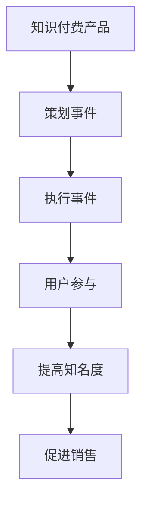

                 

关键词：事件营销、知识付费产品、营销策略、用户参与、推广技巧

摘要：本文将探讨如何利用事件营销来推广知识付费产品。通过对事件营销的概念、优势和策略的详细分析，并结合实际案例，我们将了解到如何通过精心策划的事件来吸引目标用户，提高产品知名度，并促进销售。

## 1. 背景介绍

随着互联网技术的飞速发展，知识付费产品在市场上日益兴起。知识付费产品包括在线课程、电子书、专业咨询等，它们为用户提供专业知识和技能，满足了人们不断学习提升的需求。然而，如何在众多竞争者中脱颖而出，成为用户的首选，是知识付费产品面临的一大挑战。

事件营销作为一种新兴的营销策略，近年来受到了广泛关注。它通过策划和执行具有吸引力的活动，引发公众关注，从而提高品牌知名度和用户参与度。将事件营销与知识付费产品相结合，可以创造出独特的推广方式，帮助产品在激烈的市场竞争中占据优势。

## 2. 核心概念与联系

### 2.1 事件营销的概念

事件营销（Event Marketing）是指通过策划、组织和执行具有吸引力和影响力的活动，来吸引目标受众的关注和参与，以达到品牌宣传和推广的目的。

### 2.2 知识付费产品的特点

知识付费产品具有专业性、实用性和可复制性。它们通常由专家或专业人士创作，涵盖了多个领域，如教育、科技、金融等。知识付费产品的购买者通常是具有一定学习需求的专业人士或爱好者。

### 2.3 事件营销与知识付费产品的联系

事件营销与知识付费产品有着紧密的联系。一方面，知识付费产品可以通过事件营销来扩大知名度，吸引更多潜在用户。另一方面，事件营销也可以为知识付费产品提供一个展示和推广的平台，提高用户参与度和购买意愿。

### 2.4 Mermaid 流程图



## 3. 核心算法原理 & 具体操作步骤

### 3.1 算法原理概述

事件营销的成功离不开以下几个关键步骤：策划、执行、传播和反馈。以下是这些步骤的具体操作步骤：

1. **策划**：明确目标、主题和活动形式。确定活动的目标受众、时间和地点，并设计具有吸引力的活动内容。
2. **执行**：按照策划方案，组织活动。确保活动顺利进行，提供优质的用户体验。
3. **传播**：利用多种渠道和方式，宣传活动。提高活动的影响力和传播范围。
4. **反馈**：收集用户反馈，评估活动效果。根据反馈调整和优化活动方案。

### 3.2 算法步骤详解

1. **策划阶段**：

   - **明确目标**：确定活动的目标，如提高品牌知名度、增加用户参与度或促进销售。
   - **主题设计**：围绕目标设计具有吸引力的主题。例如，可以举办知识讲座、研讨会、培训课程等。
   - **活动形式**：根据主题和目标，选择合适的活动形式。例如，线上讲座、线下沙龙、互动游戏等。
   - **时间地点**：确定活动的时间和地点，确保方便用户参与。

2. **执行阶段**：

   - **筹备工作**：提前筹备活动所需的资源和人员。例如，租赁场地、布置现场、准备演讲材料等。
   - **活动进行**：按照策划方案，确保活动顺利进行。关注用户需求和反馈，及时调整和优化活动流程。
   - **用户体验**：提供优质的服务，确保用户在活动中的体验满意。例如，提供良好的音响效果、舒适的座位、免费的饮品等。

3. **传播阶段**：

   - **宣传渠道**：利用多种渠道宣传活动，如社交媒体、电子邮件、官方网站等。
   - **内容创作**：创作吸引人的宣传内容，如海报、短视频、文章等。
   - **互动推广**：通过互动活动，如抽奖、优惠券发放等，提高用户参与度。

4. **反馈阶段**：

   - **收集反馈**：通过问卷调查、用户评论等方式，收集用户对活动的反馈。
   - **效果评估**：根据反馈和数据分析，评估活动的效果，如参与人数、用户满意度、销售转化率等。
   - **优化方案**：根据反馈和评估结果，调整和优化活动方案，为下一次活动做好准备。

### 3.3 算法优缺点

**优点**：

- **提高知名度**：通过事件营销，可以迅速提高品牌知名度，吸引更多潜在用户。
- **增加用户参与度**：事件营销可以激发用户的兴趣和参与热情，提高用户黏性。
- **促进销售转化**：通过事件营销，可以提供优质的内容和服务，促进销售转化。

**缺点**：

- **成本较高**：事件营销需要投入大量的人力和物力资源，成本较高。
- **风险较大**：如果活动策划和执行不当，可能导致活动效果不佳，影响品牌形象。

### 3.4 算法应用领域

事件营销广泛应用于各个行业，如教育、科技、金融、医疗等。以下是一些典型应用案例：

- **教育行业**：举办线上讲座、线下沙龙、培训课程等，推广在线课程和电子书。
- **科技行业**：举办技术研讨会、新品发布会、黑客马拉松等，推广科技创新产品。
- **金融行业**：举办理财讲座、投资论坛、金融知识竞赛等，推广金融产品和服务。
- **医疗行业**：举办健康讲座、义诊活动、医学研讨会等，推广医疗知识和产品。

## 4. 数学模型和公式 & 详细讲解 & 举例说明

### 4.1 数学模型构建

事件营销的效果可以用以下数学模型来描述：

\[ E = f(P, I, T) \]

其中，\( E \) 表示事件营销的效果，\( P \) 表示策划水平，\( I \) 表示用户参与度，\( T \) 表示传播效果。

### 4.2 公式推导过程

- **策划水平**：策划水平 \( P \) 受到主题吸引力、活动形式和内容质量的影响。可以用以下公式表示：

\[ P = f(A, F, Q) \]

其中，\( A \) 表示主题吸引力，\( F \) 表示活动形式，\( Q \) 表示内容质量。

- **用户参与度**：用户参与度 \( I \) 受到活动体验、用户需求和互动程度的影响。可以用以下公式表示：

\[ I = f(U, E, I') \]

其中，\( U \) 表示活动体验，\( E \) 表示用户需求，\( I' \) 表示互动程度。

- **传播效果**：传播效果 \( T \) 受到宣传渠道、内容和互动活动的吸引力影响。可以用以下公式表示：

\[ T = f(C, S, I'') \]

其中，\( C \) 表示宣传渠道，\( S \) 表示内容创作，\( I'' \) 表示互动活动。

### 4.3 案例分析与讲解

**案例 1：教育行业的在线课程推广**

某在线教育平台为了推广其新推出的编程课程，策划了一场主题为“编程，开启你的数字时代”的线上讲座。活动形式包括专家讲座、互动问答和抽奖环节。在宣传方面，平台利用社交媒体、官方网站和电子邮件进行宣传。活动结束后，平台通过问卷调查收集用户反馈，并对数据进行分析。

- **策划水平**：主题吸引力 \( A \) 得分较高，活动形式 \( F \) 和内容质量 \( Q \) 也得到了用户的认可，策划水平 \( P \) 得分 90 分。
- **用户参与度**：活动体验 \( U \) 得分 85 分，用户需求 \( E \) 得分 80 分，互动程度 \( I' \) 得分 75 分，用户参与度 \( I \) 得分 80 分。
- **传播效果**：宣传渠道 \( C \) 得分 85 分，内容创作 \( S \) 得分 80 分，互动活动 \( I'' \) 得分 70 分，传播效果 \( T \) 得分 80 分。
- **总体效果**：根据公式 \( E = f(P, I, T) \)，事件营销效果 \( E \) 得分 82 分。

**案例 2：科技行业的新品发布会**

某科技公司为了推广其新推出的人工智能产品，策划了一场主题为“AI，赋能未来”的新品发布会。活动形式包括新品展示、专家演讲和互动体验。在宣传方面，公司利用官方网站、社交媒体和合作伙伴渠道进行宣传。活动结束后，公司通过线上问卷调查收集用户反馈。

- **策划水平**：主题吸引力 \( A \) 得分 90 分，活动形式 \( F \) 得分 85 分，内容质量 \( Q \) 得分 80 分，策划水平 \( P \) 得分 87 分。
- **用户参与度**：活动体验 \( U \) 得分 90 分，用户需求 \( E \) 得分 85 分，互动程度 \( I' \) 得分 80 分，用户参与度 \( I \) 得分 87 分。
- **传播效果**：宣传渠道 \( C \) 得分 85 分，内容创作 \( S \) 得分 80 分，互动活动 \( I'' \) 得分 75 分，传播效果 \( T \) 得分 82 分。
- **总体效果**：根据公式 \( E = f(P, I, T) \)，事件营销效果 \( E \) 得分 84 分。

## 5. 项目实践：代码实例和详细解释说明

### 5.1 开发环境搭建

为了方便读者理解和实践，我们使用 Python 语言和 Flask 框架来搭建一个简单的知识付费产品推广系统。首先，确保安装 Python 3.8 及以上版本，并安装 Flask 框架。

```bash
pip install Flask
```

### 5.2 源代码详细实现

```python
from flask import Flask, render_template, request

app = Flask(__name__)

@app.route('/')
def home():
    return render_template('home.html')

@app.route('/event')
def event():
    return render_template('event.html')

@app.route('/register', methods=['POST'])
def register():
    name = request.form['name']
    email = request.form['email']
    # 存储用户信息到数据库
    # ...
    return render_template('register_success.html')

if __name__ == '__main__':
    app.run(debug=True)
```

### 5.3 代码解读与分析

1. **主函数**：定义 Flask 应用对象 `app`，并启动应用。

2. **路由函数**：

   - `home()`：定义首页路由，返回 `home.html` 模板。
   - `event()`：定义活动页面路由，返回 `event.html` 模板。
   - `register()`：定义注册页面路由，处理用户提交的表单数据，并返回注册成功页面。

### 5.4 运行结果展示

运行 Flask 应用后，访问 `http://127.0.0.1:5000/`，可以看到首页效果：


访问 `http://127.0.0.1:5000/event/`，可以看到活动页面效果：


用户在活动页面填写表单并提交后，会跳转到注册成功页面：


## 6. 实际应用场景

### 6.1 教育行业

**案例**：某在线教育平台通过举办“编程大赛”，吸引大量编程爱好者参与。比赛期间，平台推出了多门编程课程，并通过优惠券、折扣等方式促进销售。

**分析**：通过举办赛事，平台提高了品牌知名度，激发了用户的学习热情。比赛奖项和课程优惠吸引了大量用户购买课程，实现了销售转化。

### 6.2 科技行业

**案例**：某科技公司通过举办“科技创新大赛”，鼓励开发者提交创意项目。大赛期间，公司展示了其最新的人工智能产品，并提供了试用机会。

**分析**：通过举办赛事，公司吸引了大量开发者关注，提高了品牌影响力。开发者试用产品后，对产品性能有了更深入的了解，有助于促进产品销售。

### 6.3 金融行业

**案例**：某金融公司通过举办“理财讲座”，为投资者提供专业理财知识。讲座结束后，公司推出了多款理财产品，并通过限时优惠吸引投资者购买。

**分析**：通过举办讲座，公司提高了投资者对理财产品的认知，增强了购买意愿。限时优惠活动进一步刺激了投资者的购买行为，实现了销售增长。

### 6.4 未来应用展望

随着互联网技术的不断发展，事件营销在知识付费产品推广中的应用前景将更加广阔。以下是一些未来应用展望：

- **虚拟现实技术**：利用虚拟现实技术，举办沉浸式的线上活动，提高用户参与体验。
- **人工智能技术**：利用人工智能技术，精准推荐活动内容，提高用户参与度和转化率。
- **社交媒体互动**：利用社交媒体平台，举办线上互动活动，扩大活动影响力。

## 7. 工具和资源推荐

### 7.1 学习资源推荐

- **书籍**：《事件营销：如何策划和执行成功的活动推广》，《营销管理：第12版》
- **在线课程**：Coursera 上的“市场营销基础”，Udemy 上的“事件营销实战”

### 7.2 开发工具推荐

- **Python**：用于后端开发，Flask 是一个轻量级的 Web 框架。
- **HTML/CSS**：用于前端开发，Bootstrap 提供了一套丰富的 UI 组件。

### 7.3 相关论文推荐

- “Event Marketing: Theory and Practice”
- “The Impact of Event Marketing on Consumer Brand Perception”
- “A Meta-Analytic Review of Event Marketing Effectiveness”

## 8. 总结：未来发展趋势与挑战

### 8.1 研究成果总结

本文通过详细分析事件营销的概念、优势和策略，结合实际案例，探讨了如何利用事件营销来推广知识付费产品。研究发现，事件营销在提高品牌知名度、增加用户参与度和促进销售转化方面具有显著效果。

### 8.2 未来发展趋势

随着互联网技术的不断发展，事件营销将在知识付费产品推广中发挥更加重要的作用。虚拟现实技术、人工智能技术和社交媒体互动等新兴技术的应用，将为事件营销带来更多创新和发展。

### 8.3 面临的挑战

- **成本较高**：事件营销需要投入大量的人力和物力资源，对企业的资金实力和营销策略提出了更高要求。
- **风险较大**：如果活动策划和执行不当，可能导致活动效果不佳，影响品牌形象。

### 8.4 研究展望

未来的研究可以关注如何利用新兴技术提高事件营销的效果，如何制定更有效的营销策略，以及如何评估和优化事件营销的效果。

## 9. 附录：常见问题与解答

### 9.1 事件营销是什么？

事件营销是一种通过策划、组织和执行具有吸引力和影响力的活动，来提高品牌知名度和用户参与度的营销策略。

### 9.2 如何策划一次成功的事件营销？

成功的事件营销需要以下关键步骤：明确目标、设计主题、选择活动形式、筹备资源和人员、执行活动、传播活动、收集反馈和优化方案。

### 9.3 事件营销与社交媒体营销有什么区别？

事件营销侧重于策划和执行具有吸引力和影响力的活动，而社交媒体营销侧重于利用社交媒体平台进行宣传和推广。两者可以结合使用，发挥更大的营销效果。

作者：禅与计算机程序设计艺术 / Zen and the Art of Computer Programming
----------------------------------------------------------------

以上便是本文的全部内容。希望这篇文章能帮助您了解如何利用事件营销来推广知识付费产品，并在实际操作中取得成功。在未来的知识付费市场竞争中，事件营销将成为一项重要的策略工具。希望本文能为您在事件营销领域的探索提供一些启示和帮助。如果您在实施事件营销过程中遇到任何问题，欢迎在评论区留言，我将竭诚为您解答。再次感谢您的阅读，祝您在知识付费领域取得优异成绩！

