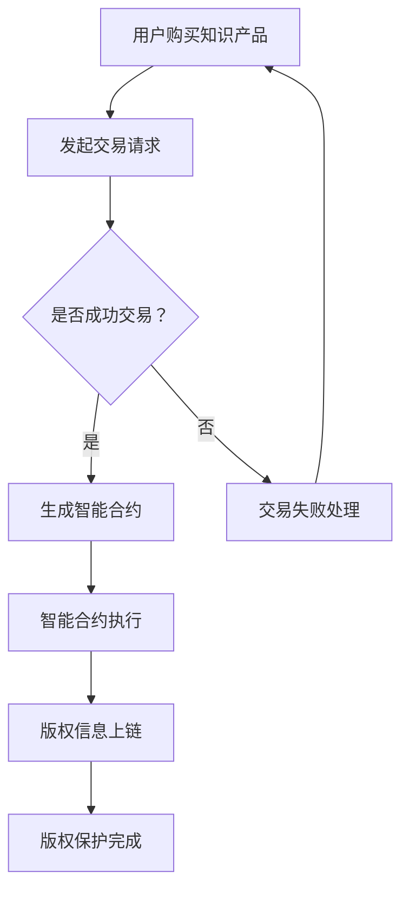

                 

关键词：区块链、知识付费、版权保护、智能合约、分布式账本、加密技术

> 摘要：随着知识付费时代的到来，版权保护问题日益凸显。本文将探讨如何利用区块链技术来保护知识付费版权，通过构建分布式账本、智能合约等手段，实现版权信息的透明、不可篡改和自动化管理。

## 1. 背景介绍

在信息时代，知识付费成为了一种新兴的商业模式，用户通过付费获取专业、有价值的知识内容。然而，伴随着知识付费的普及，版权保护问题也日益凸显。传统的版权保护手段，如法律诉讼、技术加密等，存在诸多不足，如成本高、效率低、维权困难等。因此，寻找一种更加高效、安全的版权保护方案迫在眉睫。

区块链技术作为一种分布式数据库技术，具有去中心化、不可篡改、透明等特性，为版权保护提供了一种新的思路。通过区块链技术，可以实现对知识付费版权的全程监控和管理，提高版权保护的效率和质量。

## 2. 核心概念与联系

### 2.1. 区块链技术

区块链是一种分布式数据库技术，通过加密算法和共识机制，实现了数据的分布式存储和验证。区块链的主要特点是：

- **去中心化**：数据存储在多个节点上，不存在单点故障风险。
- **不可篡改**：一旦数据被写入区块链，将无法被修改或删除。
- **透明**：所有参与节点都可以查看区块链上的数据。

### 2.2. 智能合约

智能合约是一种基于区块链的自动执行合同，通过编写代码，将合同条款嵌入到区块链中。当触发条件满足时，智能合约会自动执行。智能合约的主要特点有：

- **自动化**：减少人工干预，提高执行效率。
- **可信**：合约执行过程透明，可被所有节点验证。
- **不可篡改**：一旦合约被部署，无法修改。

### 2.3. 加密技术

加密技术是区块链的核心组成部分，用于保护数据的安全性和隐私性。常见的加密技术包括：

- **对称加密**：加密和解密使用相同的密钥，如AES。
- **非对称加密**：加密和解密使用不同的密钥，如RSA。
- **哈希函数**：用于生成数据摘要，如SHA-256。

### 2.4. Mermaid 流程图

以下是一个简单的Mermaid流程图，描述了利用区块链技术保护知识付费版权的基本流程：



## 3. 核心算法原理 & 具体操作步骤

### 3.1. 算法原理概述

利用区块链技术保护知识付费版权的原理主要基于以下三个方面：

- **分布式账本**：通过分布式账本记录版权信息，实现版权信息的透明和不可篡改。
- **智能合约**：通过智能合约实现版权交易和授权的自动化执行。
- **加密技术**：通过加密技术保护版权信息的隐私和安全。

### 3.2. 算法步骤详解

#### 3.2.1. 创建知识付费产品

知识付费产品创建者需要在区块链平台上创建一个数字资产，并将其与实际的知识内容绑定。

#### 3.2.2. 创建智能合约

在区块链平台上，创建一个智能合约，用于定义版权交易和授权的规则。智能合约中应包含以下内容：

- **版权信息**：包括知识付费产品的名称、创作者、版权期限等。
- **交易规则**：包括购买价格、购买者权限、版权期限等。
- **授权规则**：包括授权类型、授权期限、授权对象等。

#### 3.2.3. 发布智能合约

将创建好的智能合约发布到区块链上，供用户购买和授权。

#### 3.2.4. 用户购买知识付费产品

用户在区块链平台上购买知识付费产品时，需要通过智能合约发起交易请求。

#### 3.2.5. 智能合约执行

智能合约在接收到交易请求后，会自动执行交易规则，完成版权信息的转移和授权。

#### 3.2.6. 版权信息上链

将交易完成的版权信息上链，实现版权信息的透明和不可篡改。

### 3.3. 算法优缺点

#### 优点：

- **去中心化**：去中心化的特点使得版权信息更加透明、公正。
- **不可篡改**：一旦版权信息上链，将无法被修改或删除，提高了版权保护的可靠性。
- **自动化**：智能合约的自动化执行减少了人工干预，提高了交易效率。

#### 缺点：

- **技术门槛**：区块链技术和智能合约的编写需要较高的技术门槛。
- **性能瓶颈**：区块链的处理能力相对有限，可能无法满足大规模交易的实时需求。
- **安全性问题**：虽然区块链技术具有较高的安全性，但仍然存在被攻击的风险。

### 3.4. 算法应用领域

区块链技术在知识付费版权保护领域的应用非常广泛，主要包括：

- **数字版权管理**：通过区块链技术实现对数字内容的版权保护。
- **知识付费平台**：利用区块链技术实现知识付费交易的自动化和透明化。
- **版权维权**：通过区块链技术提高版权维权的效率和成功率。

## 4. 数学模型和公式 & 详细讲解 & 举例说明

### 4.1. 数学模型构建

在区块链技术中，常用的数学模型包括：

- **哈希函数**：用于生成数据摘要，确保数据的唯一性和完整性。
- **密码学**：用于数据加密和解密，保护数据的安全性和隐私性。
- **共识算法**：用于节点间的数据一致性验证，确保分布式系统的稳定性。

### 4.2. 公式推导过程

假设区块链系统中有n个节点，每个节点维护一个完整的区块链副本。当一个节点需要向区块链中写入新数据时，需要经过以下步骤：

1. 将数据封装成一个交易记录。
2. 对交易记录进行哈希处理，生成一个哈希值。
3. 将哈希值发送给其他节点进行验证。
4. 通过共识算法达成共识，确认交易记录的有效性。
5. 将确认后的交易记录写入区块链。

### 4.3. 案例分析与讲解

假设有5个节点参与一个区块链系统，现在节点A需要向区块链中写入一条新数据。以下是具体的操作步骤：

1. **节点A**：生成交易记录，包含数据内容和哈希值。
2. **节点A**：对交易记录进行哈希处理，生成哈希值H1。
3. **节点A**：将交易记录和哈希值H1发送给其他节点B、C、D、E。
4. **节点B、C、D、E**：对交易记录进行哈希处理，生成哈希值H2、H3、H4、H5。
5. **节点B、C、D、E**：将哈希值H2、H3、H4、H5发送回节点A。
6. **节点A**：通过共识算法（如工作量证明算法）与节点B、C、D、E达成共识，确认交易记录的有效性。
7. **节点A**：将确认后的交易记录写入区块链。

## 5. 项目实践：代码实例和详细解释说明

### 5.1. 开发环境搭建

为了演示如何利用区块链技术保护知识付费版权，我们将使用以太坊平台。以下是在以太坊平台上搭建开发环境的基本步骤：

1. 安装Node.js和npm。
2. 安装Truffle框架：`npm install -g truffle`。
3. 创建一个新的Truffle项目：`truffle init`。
4. 安装以太坊客户端（如Geth）：`npm install -g ethereumjs-util`。
5. 配置Truffle项目，设置合约编译和部署工具。

### 5.2. 源代码详细实现

以下是实现一个简单的知识付费版权保护的智能合约示例：

```solidity
pragma solidity ^0.8.0;

contract KnowledgePay {

    struct License {
        address buyer;
        string contentHash;
        uint256 expirationDate;
    }

    mapping(address => License[]) public licenses;

    function buyLicense(string memory contentHash, uint256 expirationDate) public payable {
        licenses[msg.sender].push(License(msg.sender, contentHash, expirationDate));
    }

    function getLicense(address buyer) public view returns (License[] memory) {
        return licenses[buyer];
    }

    function extendLicense(address buyer, uint256 index, uint256 newExpirationDate) public {
        require(licenses[buyer][index].expirationDate > block.timestamp, "License already expired");
        licenses[buyer][index].expirationDate = newExpirationDate;
    }

}
```

### 5.3. 代码解读与分析

上述智能合约实现了以下功能：

- **结构体License**：用于存储购买者的地址、内容哈希和过期时间。
- **licenses**：一个映射，用于存储购买者的许可证列表。
- **buyLicense**：一个公共函数，用于购买许可证。购买者通过发送以太币支付购买费用。
- **getLicense**：一个公共函数，用于获取购买者的许可证列表。
- **extendLicense**：一个公共函数，用于延长许可证的有效期。

### 5.4. 运行结果展示

以下是一个运行结果示例：

1. **购买许可证**：用户A调用`buyLicense`函数购买一个许可证，内容哈希为`0x123456...`，过期时间为`2023-12-31`。
2. **获取许可证**：用户A调用`getLicense`函数获取自己的许可证列表，返回`[License(userA, "0x123456...", 1672531200)]`。
3. **延长许可证有效期**：用户A调用`extendLicense`函数将许可证的有效期延长到`2024-12-31`。

## 6. 实际应用场景

### 6.1. 数字出版行业

数字出版行业可以利用区块链技术保护电子书、文章、期刊等数字内容的版权，实现版权交易的透明和不可篡改。

### 6.2. 教育行业

教育行业可以通过区块链技术实现在线课程、教学资源等的版权保护，提高教学资源的利用效率和版权保护的可靠性。

### 6.3. 创意产业

创意产业，如音乐、影视、设计等，可以利用区块链技术实现对创意作品的版权保护，简化版权交易流程，提高创作收益。

### 6.4. 未来应用展望

随着区块链技术的不断发展和成熟，未来有望在更多领域实现版权保护，如虚拟现实、增强现实、数字艺术品等。同时，结合其他技术，如人工智能、大数据等，将进一步推动版权保护领域的创新和发展。

## 7. 工具和资源推荐

### 7.1. 学习资源推荐

- 《区块链技术指南》
- 《智能合约设计与开发实战》
- 《区块链应用案例解析》

### 7.2. 开发工具推荐

- Truffle：一个用于以太坊智能合约开发、测试和部署的框架。
- Remix：一个在线智能合约开发环境。
- Ganache：一个本地以太坊节点，用于智能合约的本地测试。

### 7.3. 相关论文推荐

- “Blockchain Technology: A Comprehensive Review”
- “Smart Contracts: A Blockchain-Based Security Model”
- “Blockchain and Intellectual Property Protection”

## 8. 总结：未来发展趋势与挑战

### 8.1. 研究成果总结

本文探讨了如何利用区块链技术保护知识付费版权，介绍了区块链技术的核心概念、算法原理、应用场景和具体实现方法。

### 8.2. 未来发展趋势

随着区块链技术的不断发展和成熟，未来有望在更多领域实现版权保护，提高版权交易的透明度和效率。

### 8.3. 面临的挑战

区块链技术在版权保护领域面临的技术挑战包括性能瓶颈、安全性问题、法律监管等。此外，还需要解决与现有版权法律法规的兼容性问题。

### 8.4. 研究展望

未来，结合其他技术，如人工智能、大数据等，将进一步推动版权保护领域的创新和发展。同时，需要加强对区块链技术的法律和监管研究，为版权保护提供更加完善的法律保障。

## 9. 附录：常见问题与解答

### Q：区块链技术如何保证数据的安全性和隐私性？

A：区块链技术通过加密算法保护数据的安全性和隐私性。在区块链中，所有数据都被加密存储，只有拥有相应密钥的节点才能解密和访问数据。此外，区块链的分布式特性使得单个节点的攻击无法影响整个系统的安全性。

### Q：区块链技术在版权保护中如何处理版权转让和授权问题？

A：区块链技术通过智能合约实现版权转让和授权的自动化执行。在智能合约中，可以定义版权转让和授权的规则，当满足条件时，智能合约会自动执行相应的操作，如版权转让、授权等。

### Q：区块链技术在版权保护中如何处理版权纠纷？

A：区块链技术通过记录和存储所有的版权交易和授权信息，使得版权纠纷的处理更加透明和公正。在发生版权纠纷时，相关方可以查阅区块链上的交易记录，依据实际情况进行裁决。

---

作者：禅与计算机程序设计艺术 / Zen and the Art of Computer Programming
----------------------------------------------------------------


