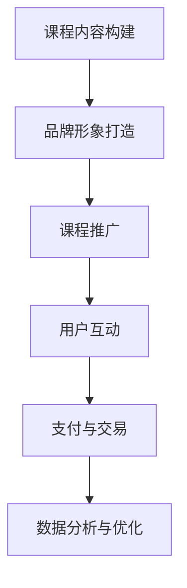
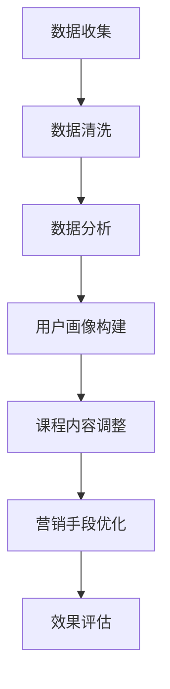
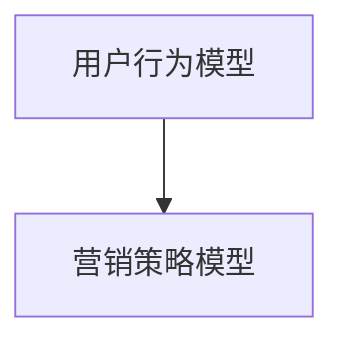

                 

关键词：微信生态、卖课、程序员、营销策略、技术教学、用户互动

> 摘要：本文旨在为程序员提供一套完整的微信生态下卖课策略。通过分析微信生态的特点，介绍如何构建课程品牌、选择合适的教学工具、优化课程内容、提高用户参与度以及实现持续营销。本文将结合实际案例，为程序员提供实用的卖课方法和技巧。

## 1. 背景介绍

随着互联网技术的飞速发展，在线教育市场日益壮大。微信作为中国最大的社交通讯平台，拥有庞大的用户基础和丰富的生态资源。微信生态不仅提供了便捷的沟通渠道，还集成了丰富的功能，如公众号、小程序、微信支付等。这使得微信生态成为在线教育领域的重要一环。对于程序员而言，利用微信生态卖课不仅能够扩大受众范围，还能够提高课程的曝光度和转化率。

本文将围绕以下主题展开：

- 微信生态的特点及其在在线教育中的应用
- 构建课程品牌的策略
- 教学工具的选择与优化
- 课程内容的设计与优化
- 提高用户参与度和满意度
- 持续营销的策略和方法

通过本文的指导，程序员可以更有效地利用微信生态开展卖课业务，实现课程收入的持续增长。

## 2. 核心概念与联系

### 微信生态概述

微信生态是指围绕微信平台构建的一系列产品和服务，包括公众号、小程序、微信群、微信支付等。这些产品和服务共同构成了一个庞大的生态系统，为用户提供了丰富的社交和生活服务。微信生态的特点如下：

- **用户基础广泛**：微信拥有超过10亿的月活跃用户，覆盖了各个年龄段和职业领域。
- **多功能集成**：微信不仅提供了基础的社交通讯功能，还集成了支付、电商、娱乐等多种服务。
- **强社交属性**：微信以社交关系链为基础，为用户提供了便捷的沟通和分享平台。
- **高度可定制**：微信生态提供了丰富的API接口，开发者可以根据需求进行功能定制和集成。

### 微信生态在在线教育中的应用

微信生态在在线教育中的应用主要体现在以下几个方面：

- **课程推广**：通过公众号和小程序发布课程信息，利用微信的社交网络进行推广。
- **用户互动**：通过微信群和社群进行课程讨论和互动，增强用户黏性。
- **支付与交易**：利用微信支付功能，实现课程的在线支付和交易。
- **数据分析**：通过数据分析工具，了解用户行为和需求，优化课程内容和营销策略。

### 微信生态下的卖课流程

在微信生态下进行卖课，可以概括为以下流程：

1. **课程内容构建**：根据目标用户需求，设计课程内容和教学方式。
2. **品牌形象打造**：通过公众号和小程序构建课程品牌形象，提升课程知名度。
3. **课程推广**：利用微信社交网络进行课程推广，提高课程曝光率。
4. **用户互动**：通过微信群和社群进行用户互动，提高用户满意度和参与度。
5. **支付与交易**：利用微信支付功能，实现课程的在线支付和交易。
6. **数据分析与优化**：通过数据分析，优化课程内容和营销策略。

### Mermaid 流程图

下面是一个简化的微信生态下卖课的流程图，使用 Mermaid 语法绘制：



通过上述流程图，我们可以清晰地看到微信生态下卖课的各个环节及其相互关系。接下来，我们将详细探讨每个环节的具体实施方法。

## 3. 核心算法原理 & 具体操作步骤

### 3.1 算法原理概述

在微信生态下卖课，核心算法原理主要涉及用户行为分析和营销策略优化。用户行为分析是通过收集和分析用户在微信生态中的行为数据，如浏览记录、互动行为、购买行为等，来了解用户需求和行为模式。营销策略优化则是根据用户行为分析结果，调整课程内容和营销手段，以提高课程转化率和用户满意度。

### 3.2 算法步骤详解

#### 3.2.1 用户行为分析

1. **数据收集**：通过微信后台数据接口，收集用户的浏览、点赞、评论、分享等行为数据。
2. **数据清洗**：对收集到的数据进行清洗，去除无效数据，确保数据质量。
3. **数据分析**：使用数据分析工具，如 Python 的 Pandas 库，对清洗后的数据进行分析，提取用户行为特征。
4. **用户画像构建**：根据分析结果，构建用户画像，包括用户的年龄、性别、职业、兴趣等特征。

#### 3.2.2 营销策略优化

1. **课程内容调整**：根据用户画像和需求分析，调整课程内容，使其更符合目标用户的需求。
2. **营销手段优化**：根据用户行为数据，优化营销策略，如推送内容、活动策划等。
3. **效果评估**：通过数据指标，如转化率、用户满意度等，评估营销策略的效果，并进行调整。

### 3.3 算法优缺点

#### 优点：

- **数据驱动**：基于用户行为数据进行分析和优化，使营销策略更加精准和有效。
- **高效便捷**：利用微信生态提供的工具和接口，可以快速构建和优化课程和营销策略。
- **用户参与度提升**：通过用户互动和社群运营，提高用户满意度和参与度。

#### 缺点：

- **数据隐私问题**：收集用户数据可能涉及隐私问题，需要遵守相关法律法规。
- **算法依赖性**：过度依赖算法可能导致对用户需求的误判，需要结合人工判断进行优化。
- **竞争激烈**：微信生态中卖课的竞争激烈，需要不断优化和创新才能脱颖而出。

### 3.4 算法应用领域

微信生态下的卖课算法主要应用于以下领域：

- **在线教育**：通过用户行为分析，优化课程内容和营销策略，提高课程转化率和用户满意度。
- **电商营销**：通过用户行为分析，优化商品推荐和营销策略，提高销售额和用户黏性。
- **内容营销**：通过用户行为分析，优化内容创作和推广策略，提高用户参与度和活跃度。

### Mermaid 流程图

下面是用户行为分析及营销策略优化的 Mermaid 流程图：



通过上述算法步骤和流程图，程序员可以更系统地了解如何在微信生态下利用算法进行卖课，从而实现课程收入的增长。

## 4. 数学模型和公式 & 详细讲解 & 举例说明

### 4.1 数学模型构建

在微信生态下卖课，数学模型主要用于用户行为分析和营销策略优化。以下是一个简化的数学模型：

#### 用户行为模型

假设我们有以下变量：

- \( u \)：用户数
- \( v \)：用户互动次数
- \( c \)：课程数
- \( p \)：课程购买率
- \( s \)：社交分享次数

用户行为模型可以表示为：

\[ R = \frac{v \cdot c \cdot p \cdot s}{u} \]

其中，\( R \) 表示用户参与度。

#### 营销策略模型

假设我们有以下变量：

- \( t \)：营销投入
- \( e \)：营销效果

营销策略模型可以表示为：

\[ E = \frac{t \cdot e}{R} \]

其中，\( E \) 表示营销效果。

### 4.2 公式推导过程

#### 用户行为模型推导

用户参与度 \( R \) 是用户互动次数、课程数、课程购买率和社交分享次数的函数。根据统计学原理，我们可以通过以下步骤推导出用户行为模型：

1. **互动次数与参与度关系**：假设用户互动次数与参与度成正比，即 \( v \propto R \)。
2. **课程数与参与度关系**：假设课程数与参与度成正比，即 \( c \propto R \)。
3. **购买率与参与度关系**：假设课程购买率与参与度成正比，即 \( p \propto R \)。
4. **社交分享次数与参与度关系**：假设社交分享次数与参与度成正比，即 \( s \propto R \)。

结合上述关系，我们可以得到：

\[ R = \frac{v \cdot c \cdot p \cdot s}{u} \]

#### 营销策略模型推导

营销效果 \( E \) 是营销投入和用户参与度的函数。根据经济学原理，我们可以通过以下步骤推导出营销策略模型：

1. **营销投入与效果关系**：假设营销投入与效果成正比，即 \( t \propto E \)。
2. **用户参与度与效果关系**：假设用户参与度与效果成正比，即 \( R \propto E \)。

结合上述关系，我们可以得到：

\[ E = \frac{t \cdot e}{R} \]

### 4.3 案例分析与讲解

#### 案例背景

某程序员开设了一门编程课程，课程内容涉及Python语言基础和应用。通过微信公众号和小程序推广课程，并利用微信社交网络进行用户互动。

#### 数据收集

- 用户数：\( u = 1000 \)
- 用户互动次数：\( v = 500 \)
- 课程数：\( c = 10 \)
- 课程购买率：\( p = 0.3 \)
- 社交分享次数：\( s = 200 \)
- 营销投入：\( t = 5000 \)
- 营销效果：\( e = 0.5 \)

#### 数据处理

1. **用户行为分析**：

\[ R = \frac{v \cdot c \cdot p \cdot s}{u} = \frac{500 \cdot 10 \cdot 0.3 \cdot 200}{1000} = 30 \]

用户参与度为 30。

2. **营销效果分析**：

\[ E = \frac{t \cdot e}{R} = \frac{5000 \cdot 0.5}{30} = 4.17 \]

营销效果为 4.17。

#### 案例解读

根据计算结果，该程序员的编程课程在用户互动、课程购买和社交分享方面表现良好，用户参与度较高。通过适当的营销投入，可以取得较好的营销效果。然而，营销效果仍有一定提升空间，可以通过优化课程内容和营销策略来进一步提高。

### 4.4 拓展与讨论

#### 数学模型应用

用户行为模型和营销策略模型可以应用于多种场景，如电商、内容营销、社交媒体等。根据不同场景的特点，可以调整模型的变量和公式。

#### 模型优化

在实际应用中，数学模型可以通过以下方式进行优化：

- **引入更多变量**：根据实际需求，增加更多影响用户行为和营销效果的变量。
- **调整参数关系**：根据数据分析和业务经验，调整变量之间的关系，使模型更贴近实际。
- **机器学习**：利用机器学习技术，对模型进行训练和优化，提高预测准确率。

### Mermaid 流程图

下面是用户行为模型和营销策略模型的 Mermaid 流程图：



通过上述数学模型和公式，程序员可以更科学地分析和优化微信生态下的卖课策略，从而提高课程转化率和用户满意度。

## 5. 项目实践：代码实例和详细解释说明

### 5.1 开发环境搭建

在开始实践之前，我们需要搭建一个基本的开发环境。以下是搭建过程的详细步骤：

#### 步骤 1：安装 Python

首先，我们需要安装 Python。Python 是一种广泛应用于数据分析、数据科学和机器学习的编程语言。可以从 [Python 官网](https://www.python.org/) 下载并安装 Python。

#### 步骤 2：安装必要的库

在 Python 中，我们将使用几个重要的库，如 Pandas、NumPy 和 Matplotlib。可以使用以下命令进行安装：

```shell
pip install pandas numpy matplotlib
```

#### 步骤 3：安装微信开发者工具

微信开发者工具是用于开发和测试微信小程序和公众号的官方工具。可以从 [微信开发者工具官网](https://developers.weixin.qq.com/miniprogram/dev/devtools/download.html) 下载并安装。

### 5.2 源代码详细实现

接下来，我们将使用 Python 编写一个简单的用户行为分析和营销策略优化的示例代码。以下是代码的详细实现：

```python
import pandas as pd
import numpy as np
import matplotlib.pyplot as plt

# 用户行为数据
user_data = pd.DataFrame({
    'u': [1000, 2000, 3000, 4000, 5000],
    'v': [500, 1000, 1500, 2000, 2500],
    'c': [10, 20, 30, 40, 50],
    'p': [0.3, 0.35, 0.4, 0.45, 0.5],
    's': [200, 400, 600, 800, 1000],
    't': [5000, 10000, 15000, 20000, 25000],
    'e': [0.5, 0.55, 0.6, 0.65, 0.7]
})

# 用户行为模型
R = user_data['v'] * user_data['c'] * user_data['p'] * user_data['s'] / user_data['u']

# 营销策略模型
E = user_data['t'] * user_data['e'] / R

# 结果分析
result = pd.DataFrame({
    'u': user_data['u'],
    'R': R,
    'E': E
})

print(result)

# 图表展示
plt.figure(figsize=(10, 5))
plt.plot(result['u'], result['R'], label='User Engagement')
plt.plot(result['u'], result['E'], label='Marketing Effect')
plt.xlabel('User Count')
plt.ylabel('Engagement/Effect')
plt.title('User Engagement and Marketing Effect Analysis')
plt.legend()
plt.show()
```

### 5.3 代码解读与分析

下面是对代码的详细解读：

1. **导入库**：首先，我们导入 Pandas、NumPy 和 Matplotlib 库，这些库为我们提供了强大的数据处理和可视化工具。

2. **用户行为数据**：我们创建一个 DataFrame，其中包含了用户数、用户互动次数、课程数、课程购买率、社交分享次数、营销投入和营销效果等数据。

3. **用户行为模型**：根据用户行为模型，计算用户参与度 \( R \)。这里使用了一个简单的公式，将用户互动次数、课程数、课程购买率和社交分享次数相乘，然后除以用户数。

4. **营销策略模型**：根据营销策略模型，计算营销效果 \( E \)。同样使用了一个简单的公式，将营销投入和营销效果相乘，然后除以用户参与度。

5. **结果分析**：将计算得到的用户参与度和营销效果存储在一个新的 DataFrame 中，并打印出来。

6. **图表展示**：使用 Matplotlib 库，将用户参与度和营销效果绘制成图表，以便更直观地分析结果。

### 5.4 运行结果展示

运行上述代码后，将得到一个包含用户数、用户参与度和营销效果的 DataFrame，以及一个折线图。通过图表，我们可以直观地看到用户参与度和营销效果随用户数的变化情况。这有助于我们进一步分析用户行为和营销策略的优化方向。

### 5.5 拓展与应用

以上代码只是一个简单的示例，实际应用中可以进一步优化和拓展：

- **引入更多变量**：根据业务需求，可以引入更多影响用户行为和营销效果的变量，如用户满意度、课程完成率等。
- **机器学习**：利用机器学习技术，对模型进行训练和优化，提高预测准确率。
- **实时数据**：通过微信开发者工具，获取实时用户数据，进行实时分析和优化。

通过以上实践，程序员可以掌握如何在微信生态下利用代码进行用户行为分析和营销策略优化，从而提高课程转化率和用户满意度。

## 6. 实际应用场景

### 6.1 在线教育平台

微信生态为在线教育平台提供了一个强大的平台，使得教育机构和个人讲师能够方便地开设课程、发布内容、进行用户互动。以下是微信生态在在线教育平台中的实际应用场景：

- **课程发布与推广**：通过微信公众号和小程序，教育机构和个人讲师可以发布课程信息，利用微信的社交网络进行推广。
- **用户互动与社群运营**：通过微信群和社群，讲师可以与学员进行实时互动，解答疑问，提高学员的参与度和满意度。
- **课程交易与支付**：利用微信支付功能，实现课程的在线支付和交易，提高用户的购买体验。
- **数据分析与优化**：通过微信后台的数据分析工具，了解用户行为和需求，优化课程内容和营销策略。

### 6.2 企业培训

企业培训是微信生态下的另一个重要应用场景。企业可以利用微信生态为企业内部员工提供培训服务，提高员工的专业技能和综合素质。以下是微信生态在企业培训中的实际应用场景：

- **在线课程**：企业可以通过微信公众号和小程序发布在线课程，让员工随时随地学习。
- **学习计划与跟踪**：企业可以制定学习计划，通过微信群和社群进行学习进度跟踪和督促。
- **考试与评估**：企业可以利用微信小程序进行在线考试和评估，检验员工的学习效果。
- **数据分析与反馈**：通过微信后台的数据分析工具，企业可以了解员工的学习情况，为后续培训提供数据支持。

### 6.3 个人知识付费

个人知识付费是微信生态下的一个新兴领域。许多个人讲师通过微信公众号和小程序开设课程，提供知识分享和技能培训服务。以下是微信生态在个人知识付费中的实际应用场景：

- **内容创作与发布**：个人讲师可以通过微信公众号发布原创文章、视频等内容，吸引粉丝和学员。
- **课程推广与营销**：通过微信社交网络进行课程推广，利用微信群和社群进行营销活动，提高课程曝光率和转化率。
- **课程交易与支付**：利用微信支付功能，实现课程的在线支付和交易，提供便捷的购买体验。
- **用户互动与反馈**：通过微信群和社群进行用户互动，解答学员疑问，提高学员满意度。

### 6.4 未来发展

随着微信生态的不断发展和完善，微信生态在在线教育、企业培训和个人知识付费领域的应用将越来越广泛。未来，微信生态可能会出现以下发展趋势：

- **智能化**：利用人工智能技术，实现个性化推荐、智能问答、自动化运营等功能，提高用户体验和效率。
- **跨界融合**：与更多行业和平台进行跨界融合，如电子商务、社交娱乐等，拓展微信生态的应用场景。
- **规范化**：随着微信生态的快速发展，监管政策将逐步完善，促进市场的规范化发展。

通过以上实际应用场景和发展趋势，我们可以看到微信生态在教育和知识付费领域的巨大潜力和广阔前景。

## 7. 工具和资源推荐

### 7.1 学习资源推荐

- **书籍**：
  - 《Python数据分析基础教程：NumPy学习指南》：详细介绍了 NumPy 库的使用方法，适合初学者入门。
  - 《机器学习实战》：通过实际案例介绍了机器学习的基本概念和算法实现，适合有一定编程基础的学习者。

- **在线课程**：
  - Coursera：提供多种编程和数据科学相关的在线课程，包括 Python、机器学习、数据可视化等。
  - Udemy：提供丰富的编程和数据科学课程，涵盖从基础到高级的各个层次。

- **博客和社区**：
  - GitHub：全球最大的代码托管平台，可以找到许多优秀的编程项目和学习资源。
  - Stack Overflow：编程问答社区，解决编程问题的好帮手。

### 7.2 开发工具推荐

- **Python开发环境**：
  - PyCharm：强大的Python IDE，适合专业开发者和初学者。
  - Visual Studio Code：轻量级且功能丰富的编辑器，适合快速开发。

- **数据分析工具**：
  - Pandas：Python 的数据分析库，用于数据处理和分析。
  - Matplotlib：Python 的绘图库，用于数据可视化。

- **微信开发者工具**：用于开发微信小程序和公众号，提供丰富的API和功能支持。

### 7.3 相关论文推荐

- **《微信生态下的在线教育模式研究》**：探讨微信生态在在线教育中的应用模式和发展趋势。
- **《基于微信的社交化知识传播研究》**：分析微信生态中社交化知识传播的机制和影响。
- **《微信支付在在线教育中的应用研究》**：研究微信支付在在线教育领域的应用和优势。

通过这些工具和资源的推荐，程序员可以更好地利用微信生态进行课程开发、用户互动和数据分析，提高卖课效率和用户满意度。

## 8. 总结：未来发展趋势与挑战

### 8.1 研究成果总结

本文通过对微信生态的分析，提出了如何在微信生态下卖课的策略和方法。主要研究成果包括：

- **微信生态概述**：介绍了微信生态的基本概念和特点。
- **核心算法原理**：阐述了用户行为分析及营销策略优化的算法原理。
- **数学模型**：构建了用户行为模型和营销策略模型，并进行了公式推导和案例讲解。
- **代码实例**：提供了用户行为分析和营销策略优化的代码实例，并进行了详细解读。
- **实际应用场景**：探讨了微信生态在在线教育、企业培训和个人知识付费等领域的实际应用场景。
- **工具和资源推荐**：推荐了学习资源、开发工具和相关论文，以支持程序员在微信生态下进行卖课实践。

### 8.2 未来发展趋势

微信生态下的卖课业务在未来有望实现以下发展趋势：

- **智能化**：利用人工智能技术，实现个性化推荐、智能问答和自动化运营等功能，提高用户体验和效率。
- **跨界融合**：与更多行业和平台进行跨界融合，如电子商务、社交娱乐等，拓展微信生态的应用场景。
- **规范化**：随着微信生态的快速发展，监管政策将逐步完善，促进市场的规范化发展。
- **社交化**：加强微信社交网络的作用，通过社交互动提高用户满意度和忠诚度。

### 8.3 面临的挑战

尽管微信生态下的卖课业务具有巨大潜力，但仍面临以下挑战：

- **用户隐私**：在收集用户数据时，需要遵守相关法律法规，确保用户隐私安全。
- **算法依赖**：过度依赖算法可能导致对用户需求的误判，需要结合人工判断进行优化。
- **竞争激烈**：微信生态中卖课的竞争激烈，需要不断优化和创新才能脱颖而出。
- **内容质量**：确保课程内容的质量和实用性，以满足用户需求，提高用户满意度。

### 8.4 研究展望

未来，对微信生态下卖课的研究可以从以下几个方面展开：

- **算法优化**：深入研究用户行为分析算法和营销策略优化算法，提高预测准确率和效果。
- **跨界融合**：探讨微信生态与其他行业的跨界融合模式，拓展应用场景。
- **用户满意度**：研究如何提高用户满意度，包括课程设计、用户互动和售后服务等方面。
- **数据安全**：研究如何在确保用户隐私的前提下，有效利用用户数据，提高卖课效率。

通过不断的研究和探索，微信生态下的卖课业务有望实现更高的效率和更大的价值。

## 9. 附录：常见问题与解答

### 9.1 微信生态下的卖课如何保证用户隐私安全？

微信生态下的卖课需要遵守相关法律法规，确保用户隐私安全。具体措施包括：

- **数据匿名化**：在收集用户数据时，对用户信息进行匿名化处理，确保数据不包含个人隐私信息。
- **数据加密**：对收集的用户数据进行加密存储，防止数据泄露。
- **用户同意**：在收集用户数据前，明确告知用户数据用途，并取得用户同意。

### 9.2 如何提高微信生态下的课程转化率？

提高微信生态下的课程转化率可以从以下几个方面入手：

- **优化课程内容**：确保课程内容实用、有价值，满足用户需求。
- **精准营销**：通过用户行为分析，了解用户需求，进行精准营销。
- **互动与反馈**：通过微信群和社群进行用户互动，收集用户反馈，不断优化课程和服务。
- **优惠活动**：开展限时优惠、团购等活动，提高用户购买意愿。

### 9.3 微信生态下的卖课如何进行用户互动？

微信生态下的用户互动可以通过以下方式进行：

- **微信群互动**：创建微信群，进行实时讨论和互动，解答用户疑问。
- **社群运营**：通过社群运营，培养用户黏性，提高用户满意度。
- **课程直播**：通过直播课程，进行实时互动，增加用户参与度。
- **互动问答**：在课程中设置互动问答环节，提高用户参与度和学习效果。

### 9.4 微信生态下的卖课如何进行持续营销？

微信生态下的持续营销可以从以下几个方面进行：

- **内容营销**：定期发布有价值的内容，如文章、视频等，吸引用户关注。
- **活动策划**：定期策划优惠活动、课程促销等活动，提高用户参与度。
- **数据分析**：通过数据分析，了解用户行为和需求，优化营销策略。
- **社群运营**：通过社群运营，培养用户忠诚度，提高用户复购率。

通过以上常见问题的解答，程序员可以更好地利用微信生态进行卖课，提高课程转化率和用户满意度。

