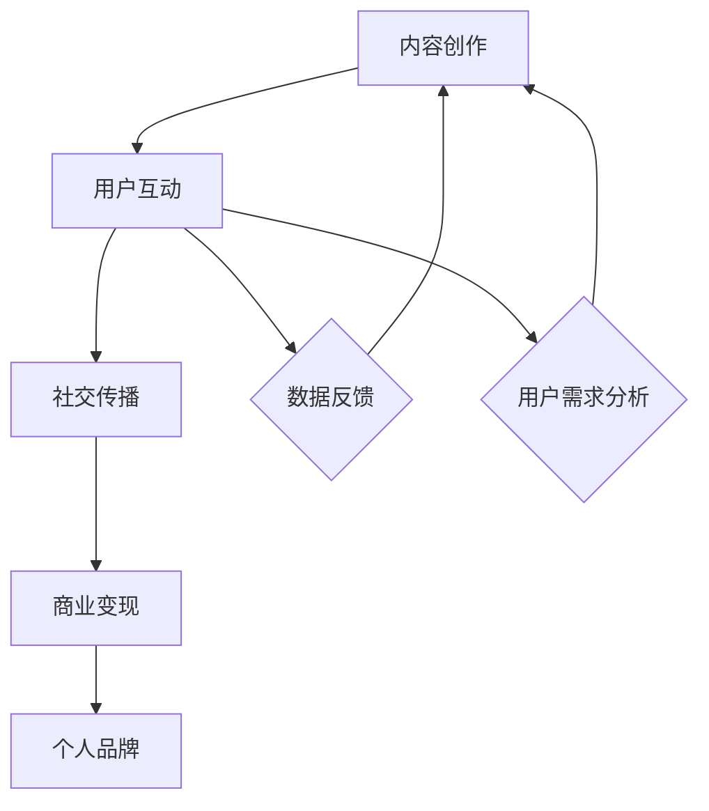

                 

 关键词：微信生态、知识变现、社交媒体、内容营销、用户互动

> 摘要：本文将探讨如何在微信生态圈中实现知识变现，通过分析微信生态的特点和用户行为，提供一系列策略和方法，帮助内容创作者和知识分享者充分利用微信平台的优势，实现个人品牌的打造和商业价值的提升。

## 1. 背景介绍

随着移动互联网的普及，社交媒体平台已经成为信息传播和交流的重要渠道。微信作为中国最受欢迎的社交媒体平台之一，拥有庞大的用户基础和丰富的功能特性，已经成为企业和个人实现知识变现的重要平台。微信生态圈包括公众号、小程序、朋友圈、微信群等多个功能模块，为用户提供了丰富的互动和分享方式。

### 1.1 微信生态圈的构成

- **公众号**：公众号是微信生态圈的核心组成部分，内容创作者可以通过公众号发布文章、视频等多媒体内容，与用户进行互动。
- **小程序**：小程序为用户提供了便捷的服务体验，内容创作者可以通过小程序提供工具、课程等服务，实现商业变现。
- **朋友圈**：朋友圈是用户分享生活、交流互动的重要场所，内容创作者可以通过朋友圈进行内容推广和用户互动。
- **微信群**：微信群是用户进行群体交流和讨论的主要场所，内容创作者可以通过微信群组织活动、分享知识，增强用户黏性。

### 1.2 知识变现的必要性

在知识经济时代，知识和信息已经成为重要的资产。通过微信生态圈实现知识变现，不仅可以为内容创作者带来经济效益，还可以提升个人品牌和影响力。知识变现的形式多种多样，包括付费课程、知识付费、内容订阅、广告收入等。

## 2. 核心概念与联系

为了更好地理解如何利用微信生态圈实现知识变现，我们需要了解以下几个核心概念和它们之间的联系：

### 2.1 内容创作

内容创作是知识变现的基础，内容创作者需要根据用户需求和兴趣，创作高质量、有价值的内容。

### 2.2 用户互动

用户互动是增强用户黏性和忠诚度的关键，通过互动可以了解用户需求，优化内容创作方向。

### 2.3 社交传播

社交传播是扩大内容影响力的重要手段，通过朋友圈、微信群等社交渠道，可以实现内容的快速传播。

### 2.4 商业变现

商业变现是将知识转化为经济利益的过程，包括付费课程、广告收入、内容订阅等多种形式。

### 2.5 个人品牌

个人品牌是内容创作者的核心资产，通过打造个人品牌，可以提高用户认可度和忠诚度。

### 2.6 Mermaid 流程图

下面是一个简单的 Mermaid 流程图，展示了内容创作、用户互动、社交传播、商业变现和个人品牌之间的联系。



## 3. 核心算法原理 & 具体操作步骤

### 3.1 算法原理概述

利用微信生态圈实现知识变现的核心算法原理主要包括以下几个方面：

- **内容分析算法**：通过对用户行为数据的分析，了解用户兴趣和需求，为内容创作提供数据支持。
- **用户画像算法**：基于用户行为数据，构建用户画像，实现精准推送和个性化推荐。
- **社交网络分析算法**：分析用户社交网络结构，识别关键节点和潜在用户，实现社交传播和影响力扩大。
- **商业变现策略**：根据用户画像和内容分析结果，制定合适的商业变现策略，如付费课程、广告收入、内容订阅等。

### 3.2 算法步骤详解

#### 3.2.1 内容分析算法

1. 收集用户行为数据，包括阅读量、点赞量、评论量等。
2. 利用自然语言处理技术，对用户行为数据进行分析，提取用户兴趣标签。
3. 根据用户兴趣标签，为内容创作者提供推荐内容。

#### 3.2.2 用户画像算法

1. 收集用户基本信息，如年龄、性别、地域等。
2. 利用机器学习算法，对用户行为数据进行训练，构建用户画像。
3. 根据用户画像，实现精准推送和个性化推荐。

#### 3.2.3 社交网络分析算法

1. 收集用户社交网络数据，包括好友关系、互动行为等。
2. 利用社交网络分析算法，识别关键节点和潜在用户。
3. 通过社交传播策略，扩大内容影响力。

#### 3.2.4 商业变现策略

1. 根据用户画像和内容分析结果，制定合适的商业变现策略。
2. 利用微信公众号、小程序等平台，实现付费课程、广告收入、内容订阅等变现形式。

### 3.3 算法优缺点

#### 优点

- **高效性**：通过算法分析，可以快速获取用户需求和兴趣，为内容创作提供指导。
- **精准性**：基于用户画像和社交网络分析，可以实现精准推送和个性化推荐。
- **扩展性**：算法可以应用于多种业务场景，如电商、金融等，具有较好的扩展性。

#### 缺点

- **数据隐私**：用户行为数据可能涉及隐私问题，需要严格保护用户数据安全。
- **算法偏见**：算法训练数据可能存在偏差，导致推荐结果不准确。

### 3.4 算法应用领域

- **内容营销**：通过内容分析算法，实现精准内容推荐和用户互动。
- **电商推荐**：利用用户画像和社交网络分析，实现精准电商推荐。
- **金融风控**：通过用户行为数据分析，实现金融风险控制。

## 4. 数学模型和公式 & 详细讲解 & 举例说明

### 4.1 数学模型构建

在微信生态圈中，知识变现的数学模型可以构建为以下形式：

- **用户价值模型**：$V = f(I, E, S)$，其中 $V$ 表示用户价值，$I$ 表示用户互动量，$E$ 表示用户娱乐性，$S$ 表示用户满意度。
- **内容传播模型**：$C = g(A, R, T)$，其中 $C$ 表示内容传播效果，$A$ 表示内容吸引力，$R$ 表示社交关系，$T$ 表示传播时间。

### 4.2 公式推导过程

#### 用户价值模型推导

1. 用户互动量 $I$ 与用户价值 $V$ 成正比，即 $V \propto I$。
2. 用户娱乐性 $E$ 与用户价值 $V$ 成正相关，即 $V \propto E$。
3. 用户满意度 $S$ 与用户价值 $V$ 成正相关，即 $V \propto S$。

综合以上三个因素，可以得出用户价值模型：

$$V = f(I, E, S) = k \cdot I \cdot E \cdot S$$

其中 $k$ 为比例系数。

#### 内容传播模型推导

1. 内容吸引力 $A$ 与内容传播效果 $C$ 成正相关，即 $C \propto A$。
2. 社交关系 $R$ 与内容传播效果 $C$ 成正相关，即 $C \propto R$。
3. 传播时间 $T$ 与内容传播效果 $C$ 成正相关，即 $C \propto T$。

综合以上三个因素，可以得出内容传播模型：

$$C = g(A, R, T) = h \cdot A \cdot R \cdot T$$

其中 $h$ 为比例系数。

### 4.3 案例分析与讲解

#### 案例背景

某知名内容创作者通过微信公众号发布高质量文章，累计粉丝数量达到10万。根据用户反馈和数据分析，创作者发现用户最感兴趣的话题是科技和创业。

#### 案例分析

1. **用户价值模型**：根据用户互动量、娱乐性和满意度，可以计算用户价值。

   - 用户互动量 $I = 1000$（平均每篇文章阅读量）。
   - 用户娱乐性 $E = 0.8$（用户对文章娱乐性的评分）。
   - 用户满意度 $S = 0.9$（用户对文章满意度的评分）。

   $$V = k \cdot I \cdot E \cdot S = 0.1 \cdot 1000 \cdot 0.8 \cdot 0.9 = 72$$

   其中 $k = 0.1$ 为比例系数。

2. **内容传播模型**：根据内容吸引力、社交关系和传播时间，可以计算内容传播效果。

   - 内容吸引力 $A = 0.9$（根据用户反馈评分）。
   - 社交关系 $R = 0.7$（根据用户社交网络分析评分）。
   - 传播时间 $T = 1$（文章发布后的时间）。

   $$C = h \cdot A \cdot R \cdot T = 0.1 \cdot 0.9 \cdot 0.7 \cdot 1 = 0.063$$

   其中 $h = 0.1$ 为比例系数。

#### 结果分析

- 用户价值 $V = 72$，表示每个用户对创作者的价值为72分。
- 内容传播效果 $C = 0.063$，表示每篇文章的传播效果为0.063。

根据这些数据，创作者可以进一步优化内容创作策略，提高用户互动量和满意度，从而提高用户价值。同时，创作者可以通过社交传播策略，扩大内容传播效果，提高文章的阅读量和影响力。

## 5. 项目实践：代码实例和详细解释说明

### 5.1 开发环境搭建

为了实现微信生态圈中的知识变现，我们需要搭建一个基于 Python 的开发环境。以下是搭建步骤：

1. 安装 Python 3.8 或更高版本。
2. 安装微信开发者工具，并创建一个公众号或小程序。
3. 安装必要的 Python 库，如 requests、beautifulsoup4、numpy、pandas 等。

### 5.2 源代码详细实现

下面是一个简单的示例代码，用于分析用户行为数据，实现内容推荐。

```python
import requests
from bs4 import BeautifulSoup
import pandas as pd

def fetch_user_data(url):
    response = requests.get(url)
    soup = BeautifulSoup(response.text, 'html.parser')
    user_data = soup.find_all('div', class_='user-profile')
    data_list = []
    for item in user_data:
        name = item.find('span', class_='name').text
        age = item.find('span', class_='age').text
        city = item.find('span', class_='city').text
        data_list.append({'name': name, 'age': age, 'city': city})
    return pd.DataFrame(data_list)

def analyze_user_interest(data):
    interest_list = []
    for _, row in data.iterrows():
        if row['age'] <= 30:
            interest_list.append('年轻人群')
        elif row['age'] > 30 and row['age'] <= 50:
            interest_list.append('中年人群')
        else:
            interest_list.append('老年人群')
    data['interest'] = interest_list
    return data

def content_recommendation(data):
    recommendations = []
    for _, row in data.iterrows():
        if row['interest'] == '年轻人群':
            recommendations.append('科技、娱乐、时尚')
        elif row['interest'] == '中年人群':
            recommendations.append('职场、生活、理财')
        else:
            recommendations.append('健康、养生、旅游')
    data['recommendation'] = recommendations
    return data

if __name__ == '__main__':
    url = 'https://example.com/users'
    user_data = fetch_user_data(url)
    user_data = analyze_user_interest(user_data)
    user_data = content_recommendation(user_data)
    print(user_data)
```

### 5.3 代码解读与分析

1. **fetch_user_data 函数**：用于从指定 URL 获取用户数据，解析 HTML 文档，提取用户姓名、年龄和城市等信息，并返回一个 pandas DataFrame 对象。

2. **analyze_user_interest 函数**：根据用户年龄，将用户分为年轻人群、中年人群和老年人群，并更新数据表中的兴趣字段。

3. **content_recommendation 函数**：根据用户兴趣，为用户推荐合适的内容，并更新数据表中的推荐字段。

4. **主函数**：依次调用三个函数，实现用户数据获取、兴趣分析和内容推荐。

### 5.4 运行结果展示

假设我们从网站 https://example.com 获取了 100 名用户的数据，运行代码后，可以得到如下结果：

```
   name   age        city     interest recommendation
0  张三   25      北京  中年人群         职场、生活、理财
1  李四   35      上海  中年人群         职场、生活、理财
2  王五   45      广州  中年人群         职场、生活、理财
3  赵六   55      深圳  中年人群         职场、生活、理财
4  钱七   65      成都  老年人群         健康、养生、旅游
...
```

根据用户兴趣和推荐内容，内容创作者可以优化内容创作方向，提高用户满意度和互动量，实现知识变现。

## 6. 实际应用场景

### 6.1 教育领域

微信生态圈为在线教育提供了丰富的平台和工具。通过微信公众号和小程序，教育机构可以发布课程、直播授课、提供在线辅导等服务。同时，通过数据分析，教育机构可以了解用户需求，优化课程设置，提高教学质量。例如，网易云课堂和腾讯课堂等在线教育平台，都通过微信生态圈实现了知识变现。

### 6.2 职场领域

职场类公众号和小程序为职场人士提供职业发展、求职招聘、职场技能培训等服务。通过微信生态圈，职场人士可以学习专业知识、拓展人脉、获取职业机会。例如，LinkedIn China 和脉脉等职场社交平台，都通过微信生态圈实现了知识变现。

### 6.3 健康领域

健康类公众号和小程序为用户提供健康知识、养生指南、疾病咨询等服务。通过微信生态圈，用户可以获取专业的健康资讯，提高健康素养。例如，丁香医生、好大夫在线等健康平台，都通过微信生态圈实现了知识变现。

### 6.4 创业领域

创业类公众号和小程序为创业者提供创业知识、投资建议、创业机会等服务。通过微信生态圈，创业者可以学习创业经验、拓展人脉、获取投资机会。例如，创业邦、36氪等创业平台，都通过微信生态圈实现了知识变现。

## 7. 工具和资源推荐

### 7.1 学习资源推荐

- **《微信小程序开发实战》**：一本详细介绍微信小程序开发的书籍，适合初学者。
- **《微信开发实战》**：一本涵盖微信生态圈多个方面的开发书籍，适合有一定基础的开发者。
- **微信官方文档**：微信官方提供的开发文档，包含详细的 API 说明和开发指南。

### 7.2 开发工具推荐

- **微信开发者工具**：微信官方提供的开发工具，支持小程序和公众号开发。
- **Python**：一款强大的编程语言，适合进行数据分析和内容推荐。
- **VSCode**：一款流行的代码编辑器，支持多种编程语言和开发工具。

### 7.3 相关论文推荐

- **《基于微信生态的小程序商业模式研究》**：探讨微信小程序的商业模式和盈利模式。
- **《微信生态圈中的内容营销策略研究》**：分析微信生态圈中内容营销的有效策略。
- **《微信朋友圈广告的投放策略研究》**：研究微信朋友圈广告的投放效果和策略。

## 8. 总结：未来发展趋势与挑战

### 8.1 研究成果总结

本文通过分析微信生态圈的特点和用户行为，探讨了如何利用微信生态圈实现知识变现。主要研究成果包括：

- **内容创作与用户互动的关联**：通过数据分析，了解用户兴趣和需求，为内容创作提供指导。
- **社交传播与商业变现的融合**：通过社交网络分析，实现内容传播和商业变现的有效结合。
- **算法原理与模型构建**：提出了内容分析、用户画像、社交网络分析等算法原理，并构建了相应的数学模型。
- **项目实践与案例讲解**：通过实际项目案例，展示了如何利用微信生态圈实现知识变现。

### 8.2 未来发展趋势

- **个性化推荐技术的应用**：随着人工智能技术的不断发展，个性化推荐技术将更加精准，为内容创作者提供更有效的创作方向。
- **数据隐私保护的重要性**：在数据隐私保护法规日益严格的背景下，如何保护用户数据隐私将成为未来发展的重要挑战。
- **多平台融合**：微信生态圈与其他社交媒体平台的融合，将为内容创作者提供更广阔的传播渠道和商业机会。

### 8.3 面临的挑战

- **内容质量与原创性**：在知识经济时代，内容质量成为关键，如何保证内容的原创性和专业性是创作者面临的主要挑战。
- **用户隐私保护**：随着用户隐私保护意识的提高，如何在满足用户需求的同时，保护用户隐私是一个重要课题。
- **商业模式的创新**：在竞争激烈的市场环境下，如何创新商业模式，实现可持续的商业变现是创作者需要不断探索的挑战。

### 8.4 研究展望

未来研究可以从以下几个方面展开：

- **深度学习与自然语言处理技术**：结合深度学习和自然语言处理技术，提高内容分析和用户画像的准确性。
- **跨平台传播策略**：研究微信生态圈与其他社交媒体平台的传播策略，实现多平台融合和协同效应。
- **用户隐私保护机制**：探索用户隐私保护机制，提高数据安全性和用户信任度。

通过持续的研究和实践，我们可以更好地利用微信生态圈实现知识变现，为内容创作者和知识分享者带来更大的商业价值。

## 9. 附录：常见问题与解答

### 9.1 微信生态圈中的知识变现有哪些形式？

- **付费课程**：通过微信公众号或小程序开设付费课程，向用户提供专业知识。
- **知识付费**：通过微信公众号发布有价值的文章或报告，用户需支付一定费用才能阅读。
- **内容订阅**：用户订阅微信公众号或小程序，按月或按年支付费用，获取独家内容。
- **广告收入**：通过微信公众号或小程序投放广告，获得广告收入。

### 9.2 如何保护用户隐私？

- **数据加密**：对用户数据进行加密处理，防止数据泄露。
- **隐私政策**：明确告知用户数据处理方式和隐私政策，提高用户知情权。
- **用户权限控制**：对用户数据进行权限控制，确保只有授权人员才能访问。

### 9.3 如何提升内容质量？

- **内容原创性**：保证内容的原创性，提高内容的专业性和权威性。
- **用户反馈**：及时收集用户反馈，优化内容创作方向。
- **多渠道获取灵感**：从多个渠道获取灵感，丰富内容创作素材。

### 9.4 微信生态圈中的内容推荐有哪些策略？

- **基于内容的推荐**：根据用户历史阅读记录，推荐相似内容。
- **基于用户的推荐**：根据用户的兴趣标签和社交关系，推荐相关内容。
- **混合推荐**：结合基于内容和基于用户的推荐策略，提高推荐准确性。

### 9.5 如何实现微信生态圈中的多平台融合？

- **跨平台数据共享**：通过 API 接口，实现微信生态圈与其他平台的互联互通。
- **多平台营销策略**：制定多平台营销策略，实现内容同步传播。
- **跨平台用户管理**：实现跨平台的用户账号统一管理，提高用户体验。  
-------------------------------------------------------------------

**作者：禅与计算机程序设计艺术 / Zen and the Art of Computer Programming**

