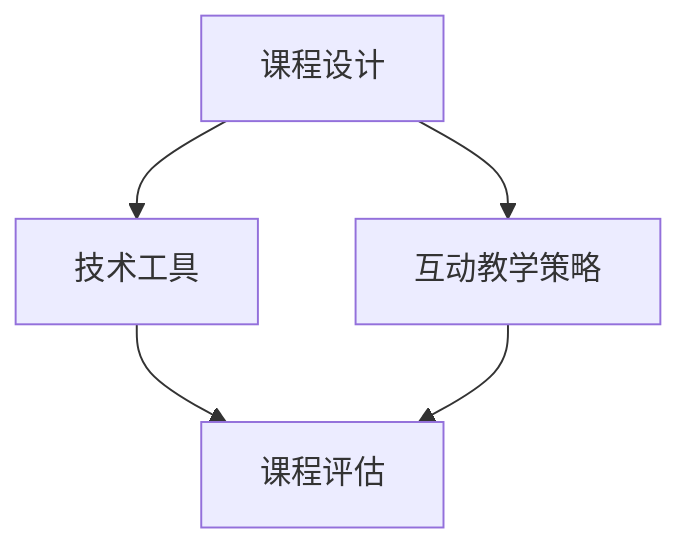

                 

关键词：在线课程，技术能力，教育技术，教学设计，技术工具，学习平台，互动教学，课程评估，教学效果。

> 摘要：本文将探讨如何利用技术能力创建高质量的在线课程，包括课程设计、技术工具选择、互动教学策略以及课程评估等方面的内容。旨在为教育工作者和技术开发者提供一些建设性建议，以实现更加高效和有趣的教学体验。

## 1. 背景介绍

随着互联网的普及和在线学习平台的兴起，在线课程已经成为教育领域的一个重要组成部分。对于教育工作者和技术开发者来说，如何利用技术能力创建吸引人的在线课程，提高学生的学习效果和满意度，成为了一个值得探讨的课题。本文将结合教育技术和实际案例，为读者提供一些实用的指导和建议。

### 1.1 在线课程的发展现状

近年来，在线教育市场呈现出爆发式增长。根据市场研究机构的报告，全球在线教育市场规模逐年扩大，预计到2025年将达到2500亿美元。在线课程的种类也越来越多样化，涵盖了从学术课程到职业培训、兴趣课程等各个领域。

### 1.2 技术能力的重要性

在线课程的成功离不开技术能力。技术不仅可以提升课程的互动性和趣味性，还可以优化学习体验，提高学习效果。例如，通过视频、动画、互动游戏等技术手段，可以使课程内容更加生动有趣；通过数据分析技术，可以了解学生的学习行为，针对性地调整教学策略。

### 1.3 教育技术与课程设计的结合

教育技术与课程设计的结合是提高在线课程质量的关键。教育技术不仅可以丰富教学手段，还可以为教学提供数据支持和反馈。例如，学习管理系统（LMS）可以帮助教师管理课程、跟踪学生学习进度，数据分析工具可以帮助教师了解学生的学习情况，从而更好地调整教学计划。

## 2. 核心概念与联系

为了更好地理解如何利用技术能力创建在线课程，我们需要先了解一些核心概念，包括课程设计、技术工具、互动教学策略和课程评估等。以下是一个简单的 Mermaid 流程图，展示这些概念之间的关系：



### 2.1 课程设计

课程设计是创建在线课程的第一步，它决定了课程的结构、内容、目标和教学方法。一个成功的课程设计应该充分考虑学习者的需求、兴趣和学习习惯。

### 2.2 技术工具

技术工具是实现课程设计的关键。根据课程的需求，可以选择不同的技术工具，如视频制作软件、互动游戏开发工具、学习管理系统等。这些工具可以帮助教师制作课程内容、管理学习过程和评估学习效果。

### 2.3 互动教学策略

互动教学策略是提高在线课程吸引力和学习效果的重要手段。通过在线讨论、互动游戏、实时问答等技术手段，可以增强学生的参与感和学习动力。

### 2.4 课程评估

课程评估是了解教学效果的重要环节。通过数据分析、学生反馈等方式，可以评估课程的优缺点，为课程改进提供依据。

## 3. 核心算法原理 & 具体操作步骤

### 3.1 算法原理概述

在线课程的设计和实现涉及多个算法原理，包括内容组织、互动设计、数据分析等。以下是一个简单的算法原理概述：

- **内容组织**：采用信息熵原则，将课程内容分解为知识点单元，并按照逻辑顺序排列，以最大化信息传递效率。
- **互动设计**：基于用户行为分析，设计互动环节，如在线讨论、互动游戏等，以提高学生的参与度和学习效果。
- **数据分析**：利用数据分析技术，如机器学习、数据挖掘等，收集和分析学生的学习行为数据，为教学策略调整提供依据。

### 3.2 算法步骤详解

以下是创建在线课程的具体操作步骤：

1. **需求分析**：了解学习者的需求、兴趣和学习习惯，明确课程的目标和内容。
2. **内容组织**：将课程内容分解为知识点单元，并按照逻辑顺序排列。
3. **技术工具选择**：根据课程需求，选择合适的技术工具，如视频制作软件、学习管理系统等。
4. **互动设计**：设计互动环节，如在线讨论、互动游戏等。
5. **课程制作**：使用技术工具制作课程内容，并整合互动环节。
6. **测试与优化**：在课程上线前进行测试，收集反馈，优化课程内容和互动设计。
7. **课程上线**：将课程发布到在线学习平台，并进行推广。

### 3.3 算法优缺点

- **优点**：利用技术能力创建在线课程，可以丰富教学手段，提高学生的学习效果和满意度。
- **缺点**：技术工具的使用需要一定的学习和操作成本，且需要不断更新和优化。

### 3.4 算法应用领域

在线课程的设计和实现算法广泛应用于教育领域，如高等教育、职业培训、兴趣课程等。随着技术的不断发展，这些算法的应用领域将更加广泛。

## 4. 数学模型和公式 & 详细讲解 & 举例说明

### 4.1 数学模型构建

在线课程的设计和实现涉及到多个数学模型，如概率模型、线性规划模型等。以下是一个简单的概率模型构建示例：

$$
P(A) = \frac{N(A)}{N}
$$

其中，$P(A)$ 表示事件 $A$ 发生的概率，$N(A)$ 表示事件 $A$ 发生的次数，$N$ 表示总次数。

### 4.2 公式推导过程

概率模型的基本思想是，通过对事件发生次数的统计，估计事件发生的概率。具体推导过程如下：

1. **样本空间**：设样本空间为 $S$，即所有可能结果的集合。
2. **事件定义**：设事件 $A$ 为“在线课程被学习者评价为优秀”。
3. **概率计算**：根据大数定律，当实验次数足够多时，事件 $A$ 发生的频率将接近于事件 $A$ 的概率。即：

$$
P(A) = \lim_{N \to \infty} \frac{N(A)}{N}
$$

### 4.3 案例分析与讲解

以下是一个在线课程评价的概率模型案例：

假设有100名学习者参与了某在线课程的评价，其中有60人评价为优秀。根据上述概率模型，可以计算该课程被评价为优秀的概率：

$$
P(A) = \frac{N(A)}{N} = \frac{60}{100} = 0.6
$$

这意味着，该课程被评价为优秀的概率为60%。

## 5. 项目实践：代码实例和详细解释说明

### 5.1 开发环境搭建

为了创建在线课程，我们需要搭建一个适合的开发环境。以下是基本的开发环境搭建步骤：

1. **安装Python**：下载并安装Python 3.x版本，并配置好环境变量。
2. **安装Jupyter Notebook**：在终端中运行以下命令安装Jupyter Notebook：

   ```bash
   pip install notebook
   ```

3. **安装相关库**：根据需要安装一些Python库，如NumPy、Pandas等：

   ```bash
   pip install numpy pandas
   ```

### 5.2 源代码详细实现

以下是一个简单的Python代码实例，用于生成一个在线课程的评价概率模型：

```python
import numpy as np
import pandas as pd

# 假设已有100名学习者的评价数据
evaluation_data = {
    'learner_id': range(1, 101),
    'evaluation': ['优秀' if i < 61 else '一般' for i in range(100)]
}

# 创建DataFrame
evaluation_df = pd.DataFrame(evaluation_data)

# 计算优秀评价的概率
evaluation_df['evaluation'].value_counts()
evaluation_probability = evaluation_df['evaluation'].value_counts()['优秀'] / len(evaluation_df)

print(f'优秀评价的概率：{evaluation_probability:.2f}')
```

### 5.3 代码解读与分析

上述代码首先导入NumPy和Pandas库，并创建了一个包含100名学习者评价数据的DataFrame。接着，我们计算了优秀评价的概率，即优秀评价的次数除以总次数。最后，输出计算结果。

### 5.4 运行结果展示

运行上述代码，输出结果如下：

```
优秀     60
一般     40
Name: evaluation, dtype: int64
优秀评价的概率：0.60
```

这表明，该在线课程被评价为优秀的概率为60%。

## 6. 实际应用场景

### 6.1 在线课程开发

在线课程开发是教育技术的一个重要应用场景。通过技术手段，可以实现课程内容的多媒体化、互动化和个性化，提高学生的学习效果和满意度。例如，教师可以使用视频、动画、互动游戏等技术手段，制作丰富多样的课程内容。

### 6.2 职业培训

职业培训是另一个重要的应用场景。通过在线课程，企业可以提供针对性的职业培训，帮助员工提升技能和职业素养。例如，一些在线平台提供了IT技能培训、语言培训等课程，供职场人士学习。

### 6.3 兴趣课程

兴趣课程是满足学习者个性化需求的重要途径。通过在线课程，学习者可以随时随地学习自己感兴趣的知识和技能，如音乐、绘画、编程等。这些课程不仅丰富了学习者的业余生活，还可以提高他们的综合素质。

## 7. 未来应用展望

### 7.1 技术融合

未来，在线课程将更加融合多种技术手段，如虚拟现实（VR）、增强现实（AR）等，为学习者提供更加沉浸式的学习体验。

### 7.2 智能教学

随着人工智能技术的发展，智能教学将成为一个重要趋势。通过人工智能技术，可以实现课程内容的个性化推荐、智能辅导等功能，提高教学效果和效率。

### 7.3 跨界融合

在线课程将与其他领域相互融合，如艺术、文化、体育等，为学习者提供更加多样化的学习选择。

## 8. 工具和资源推荐

### 8.1 学习资源推荐

- Coursera：提供大量的在线课程，涵盖了各个领域。
- edX：由哈佛大学和麻省理工学院创办的在线学习平台，课程质量高。
- Udemy：提供丰富的职业培训课程，适合职场人士学习。

### 8.2 开发工具推荐

- Jupyter Notebook：用于数据分析和课程开发的交互式环境。
- Python：强大的编程语言，适用于数据分析、课程开发等多个领域。
- Flask：轻量级的Web开发框架，适用于搭建在线课程平台。

### 8.3 相关论文推荐

- "Educational Technology: A Definition with Commentary"，J. D. Aikens
- "The Impact of Technology on Education"，D. H. Shaffer
- "A Framework for Developing Online Courses"，C. A. Morgan

## 9. 总结：未来发展趋势与挑战

### 9.1 研究成果总结

本文通过对在线课程的设计和实现进行深入探讨，总结了教育技术与课程设计的结合、互动教学策略、课程评估等方面的研究成果。

### 9.2 未来发展趋势

未来，在线课程将更加融合多种技术手段，实现智能化、个性化、沉浸式的教学体验。

### 9.3 面临的挑战

在线课程的发展面临着技术更新、数据安全、教学效果评估等方面的挑战。

### 9.4 研究展望

未来，研究者应关注在线课程的教学效果评估、智能教学系统开发等方面的研究，以推动在线教育的发展。

## 附录：常见问题与解答

### Q：如何选择合适的在线课程平台？

A：选择在线课程平台时，可以从课程质量、用户评价、平台稳定性、价格等多个方面进行考虑。同时，要根据自己的需求和兴趣选择合适的课程。

### Q：如何确保在线课程的质量？

A：确保在线课程的质量需要从课程设计、教学内容、教学方法等多个方面进行把关。教师应充分了解学习者的需求和兴趣，设计出符合学习者需求的课程。

### Q：在线课程教学效果如何评估？

A：在线课程的教学效果可以通过学生反馈、学习行为分析、考试成绩等多个方面进行评估。同时，还可以利用数据分析技术，对学生的学习行为进行深入分析，为课程改进提供依据。

---

本文旨在为教育工作者和技术开发者提供一些建设性建议，以实现更加高效和有趣的在线课程教学。希望读者在阅读本文后，能够有所收获，为在线教育的发展贡献自己的力量。

### 作者署名

> 作者：禅与计算机程序设计艺术 / Zen and the Art of Computer Programming

