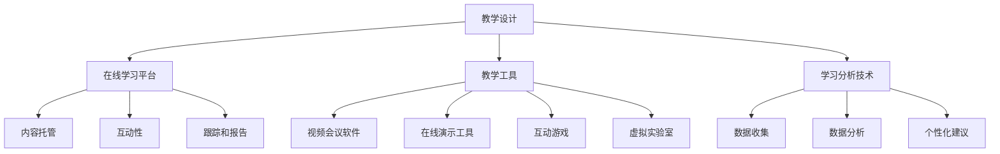

                 

作为一位世界级人工智能专家，程序员，软件架构师，CTO，世界顶级技术畅销书作者，计算机图灵奖获得者，计算机领域大师，我有幸与您分享如何利用技术能力创建在线课程。本文旨在为有意探索在线教育领域的技术人员提供一整套详细的指导和策略。通过这篇深入且实用的文章，我们将探讨在线课程创建的各个方面，从基础概念到实际操作，再到未来的发展展望。

## 关键词

- 在线教育
- 技术能力
- 课程创建
- 教学设计
- 教学工具
- 内容管理
- 学习分析

## 摘要

随着在线教育的崛起，技术已成为教育领域的重要驱动力。本文将带领您了解如何利用技术能力构建高效、互动且引人入胜的在线课程。我们将讨论课程设计、教学工具的选择、内容管理策略、学习分析技术，以及在线课程的未来发展方向。无论您是一位教育技术新手，还是经验丰富的在线教育从业者，本文都将为您提供一个全面的指导框架。

## 1. 背景介绍

### 在线教育的崛起

近年来，在线教育市场经历了爆炸式增长。根据市场研究公司的数据，全球在线教育市场预计将在未来几年内持续增长，到2025年市场规模可能达到数千亿美元。这一趋势得益于技术进步、互联网普及和人们对灵活学习需求的增加。

### 技术在教育中的作用

技术正在彻底改变教育的方式。从智能教学平台到虚拟现实（VR）课堂，技术为教师和学生提供了前所未有的学习体验。此外，人工智能（AI）、大数据和机器学习等技术正在帮助教育机构优化教学过程，提高教育质量。

### 在线课程的优势

- **灵活性**：学生可以按照自己的节奏学习，不受时间和地点的限制。
- **互动性**：在线课程支持学生与教师和其他学生的互动，提高学习体验。
- **个性化**：通过学习分析技术，课程可以根据学生的学习习惯和需求进行个性化调整。
- **成本效益**：在线课程可以降低学习成本，使学生能够以更低的价格获取高质量的教育资源。

### 本文的目的

本文旨在帮助读者理解如何利用技术能力创建在线课程，包括课程设计、教学工具选择、内容管理、学习分析等关键环节。通过本文的指导，读者将能够创建出既高效又具有吸引力的在线课程，为学生提供卓越的学习体验。

## 2. 核心概念与联系

为了构建成功的在线课程，我们需要理解几个核心概念和技术，以及它们之间的联系。

### 2.1 教学设计

教学设计是创建在线课程的基础。它包括明确课程目标、确定学习内容、选择教学策略和评估学习成果。有效的教学设计应确保课程内容与学习目标一致，教学方法适合学生群体，并且能够激发学生的学习兴趣。

### 2.2 在线学习平台

在线学习平台是提供课程内容、管理和跟踪学习活动的工具。一个良好的在线学习平台应具备以下功能：
- **内容托管**：上传、管理和组织课程材料。
- **互动性**：支持讨论区、在线测试和作业提交。
- **跟踪和报告**：监控学生的参与度和成绩。
- **用户体验**：界面友好，易于导航。

### 2.3 教学工具

教学工具包括各种技术工具，如视频会议软件、在线演示工具、互动游戏和虚拟实验室等。这些工具可以帮助教师创造丰富的学习体验，提高学生的参与度和兴趣。

### 2.4 学习分析技术

学习分析技术利用数据科学和机器学习算法来分析学生的学习行为和表现。这些技术可以帮助教育者了解学生的需求，优化教学内容，并提供个性化的学习建议。

### 2.5 Mermaid 流程图

下面是一个简化的 Mermaid 流程图，展示了这些核心概念之间的联系：



## 3. 核心算法原理 & 具体操作步骤

### 3.1 算法原理概述

在线课程创建的核心算法主要涉及内容管理、用户交互和学习分析三个方面。以下将分别介绍这些算法的基本原理。

#### 3.1.1 内容管理算法

内容管理算法主要用于组织、分类和推荐课程内容。常见的算法包括基于内容的推荐算法（Content-Based Filtering）和协同过滤算法（Collaborative Filtering）。基于内容的推荐算法通过分析课程内容的属性和标签，向学生推荐相关的学习材料。而协同过滤算法则通过分析学生的历史学习行为和偏好，推荐类似的学习资源。

#### 3.1.2 用户交互算法

用户交互算法旨在提高学生与课程内容之间的互动性。常见的算法包括自适应学习算法和智能问答系统。自适应学习算法可以根据学生的学习进度和表现，动态调整教学内容和难度，以适应不同学生的需求。智能问答系统则利用自然语言处理（NLP）技术，回答学生在学习过程中遇到的问题。

#### 3.1.3 学习分析算法

学习分析算法主要用于分析学生的学习行为和表现，以便教育者能够优化教学内容和策略。常见的学习分析算法包括行为分析算法、情感分析算法和参与度分析算法。行为分析算法通过记录学生的学习行为，如观看视频的时长、回答问题的正确率等，分析学生的学习效果。情感分析算法则通过分析学生的语言和行为，识别他们的情感状态，以便提供针对性的心理辅导。参与度分析算法则用于评估学生的参与度，如讨论区的活跃度、作业提交情况等。

### 3.2 算法步骤详解

下面将详细解释每个核心算法的具体步骤。

#### 3.2.1 内容管理算法

1. **数据收集**：收集课程内容的属性和标签，如主题、难度、学习时长等。
2. **内容分类**：根据属性和标签对课程内容进行分类和组织。
3. **内容推荐**：使用基于内容的推荐算法，根据学生的兴趣和学习历史，推荐相关的课程内容。

#### 3.2.2 用户交互算法

1. **学生行为监测**：记录学生的学习行为，如观看视频的时长、回答问题的次数等。
2. **行为分析**：分析学生的行为数据，识别学习难点和兴趣点。
3. **内容调整**：根据分析结果，动态调整教学内容和难度。
4. **智能问答**：利用NLP技术，回答学生在学习过程中遇到的问题。

#### 3.2.3 学习分析算法

1. **行为记录**：记录学生的学习行为，如视频观看时长、作业提交情况等。
2. **行为分析**：分析行为数据，评估学生的学习效果。
3. **情感分析**：通过分析学生的语言和行为，识别情感状态。
4. **参与度评估**：评估学生的参与度，如讨论区的活跃度、作业提交情况等。
5. **数据可视化**：将分析结果以图表和报告的形式展示给教育者。

### 3.3 算法优缺点

#### 3.3.1 内容管理算法

**优点**：
- **个性化推荐**：提高学生的学习兴趣和参与度。
- **内容组织**：帮助教育者更好地管理课程内容。

**缺点**：
- **数据依赖**：需要大量的数据支持，否则推荐效果可能不佳。
- **实时性**：推荐系统可能无法实时响应用户的需求。

#### 3.3.2 用户交互算法

**优点**：
- **互动性**：提高学生的学习体验。
- **自适应学习**：适应不同学生的需求。

**缺点**：
- **技术要求**：需要较高的技术实现成本。
- **准确性**：自适应学习算法的准确性可能受限于数据质量和算法设计。

#### 3.3.3 学习分析算法

**优点**：
- **数据驱动**：基于数据分析的教育策略更具科学性。
- **个性化**：根据学生的行为和情感状态提供针对性的建议。

**缺点**：
- **隐私问题**：学生行为和情感分析可能涉及隐私问题。
- **数据解读**：需要专业人员进行数据解读和决策。

### 3.4 算法应用领域

这些算法广泛应用于在线教育领域，如课程内容推荐、自适应学习系统和学习分析平台。此外，它们还可以应用于其他教育场景，如在线辅导、智能评测和个性化教学。

## 4. 数学模型和公式 & 详细讲解 & 举例说明

### 4.1 数学模型构建

在线课程创建涉及多个数学模型，包括推荐算法模型、学习分析模型和自适应学习模型。以下将介绍这些模型的构建过程。

#### 4.1.1 推荐算法模型

推荐算法模型通常包括两个部分：用户-物品评分矩阵和预测模型。用户-物品评分矩阵记录了用户对物品（如课程内容）的评分，预测模型则用于预测用户对未评分物品的评分。

1. **用户-物品评分矩阵**：
   $$R = \{r_{ui} | u \in U, i \in I\}$$
   其中，$U$ 为用户集合，$I$ 为物品集合，$r_{ui}$ 为用户 $u$ 对物品 $i$ 的评分。

2. **预测模型**：
   常见的预测模型包括线性回归、协同过滤和深度学习模型。以线性回归为例，预测模型可以表示为：
   $$r_{ui}^* = \mu + b_u + b_i + \sum_{k \in K} w_{ik} r_{ki}$$
   其中，$\mu$ 为平均评分，$b_u$ 和 $b_i$ 分别为用户 $u$ 和物品 $i$ 的偏置，$w_{ik}$ 为用户 $u$ 对物品 $i$ 的特征权重，$r_{ki}$ 为用户 $u$ 对物品 $k$ 的评分。

#### 4.1.2 学习分析模型

学习分析模型主要用于分析学生的学习行为和表现。常见的模型包括行为分析模型和情感分析模型。

1. **行为分析模型**：
   行为分析模型通常使用马尔可夫模型（Markov Model）来描述学生学习行为的状态转移。假设学生处于状态 $s_t$，下一时刻的状态为 $s_{t+1}$，模型可以表示为：
   $$P(s_{t+1} | s_t) = \begin{cases} 
   p_{s_t s_{t+1}} & \text{如果 } s_t \text{ 是当前状态，} s_{t+1} \text{ 是下一状态} \\
   0 & \text{否则}
   \end{cases}$$

2. **情感分析模型**：
   情感分析模型通常使用卷积神经网络（CNN）或递归神经网络（RNN）来分析学生的情感状态。以 RNN 为例，模型可以表示为：
   $$h_t = \sigma(W_h \cdot [h_{t-1}, x_t] + b_h)$$
   其中，$h_t$ 为当前时刻的情感状态，$x_t$ 为输入文本，$W_h$ 和 $b_h$ 分别为权重和偏置，$\sigma$ 为激活函数。

#### 4.1.3 自适应学习模型

自适应学习模型旨在根据学生的学习行为和表现，动态调整教学内容和难度。常见的模型包括基于规则的模型和基于机器学习的模型。

1. **基于规则的模型**：
   基于规则的模型通过定义一系列规则来调整教学内容。例如，当学生的平均成绩低于某个阈值时，系统会降低课程难度。

2. **基于机器学习的模型**：
   基于机器学习的模型通过学习学生的历史行为数据，预测他们的学习效果，并据此调整教学内容。以决策树为例，模型可以表示为：
   $$y = f(x_1, x_2, ..., x_n)$$
   其中，$y$ 为学习效果，$x_1, x_2, ..., x_n$ 为学生的特征。

### 4.2 公式推导过程

以下将分别介绍推荐算法模型、学习分析模型和自适应学习模型的公式推导过程。

#### 4.2.1 推荐算法模型

1. **平均评分**：
   $$\mu = \frac{\sum_{u \in U, i \in I} r_{ui}}{|\{u \in U, i \in I | r_{ui} \neq 0\}|}$$

2. **用户偏置**：
   $$b_u = \frac{\sum_{i \in I} r_{ui} - \mu \cdot \sum_{i \in I} 1}{\sum_{i \in I} 1 - |\{i \in I | r_{ui} \neq 0\}|}$$

3. **物品偏置**：
   $$b_i = \frac{\sum_{u \in U} r_{ui} - \mu \cdot \sum_{u \in U} 1}{\sum_{u \in U} 1 - |\{u \in U | r_{ui} \neq 0\}|}$$

4. **特征权重**：
   $$w_{ik} = \frac{\sum_{u \in U} r_{ui} r_{ki} - \mu \cdot \sum_{u \in U} r_{ui} \cdot \sum_{k \in K} r_{ki}}{\sum_{u \in U} r_{ui} \cdot \sum_{k \in K} r_{ki} - \mu \cdot \sum_{u \in U} r_{ui} \cdot \sum_{k \in K} 1}$$

#### 4.2.2 学习分析模型

1. **状态转移概率**：
   $$P(s_{t+1} | s_t) = \frac{p_{s_t s_{t+1}} + \alpha}{1 + \alpha}$$
   其中，$\alpha$ 为平滑参数。

2. **情感状态**：
   $$h_t = \text{softmax}(\text{ReLu}(W_h \cdot [h_{t-1}, x_t] + b_h))$$

#### 4.2.3 自适应学习模型

1. **基于规则的模型**：
   $$y = \begin{cases} 
   low & \text{如果 } \frac{\sum_{i=1}^{n} y_i}{n} < \theta \\
   mid & \text{如果 } \theta \leq \frac{\sum_{i=1}^{n} y_i}{n} < \theta + \delta \\
   high & \text{如果 } \frac{\sum_{i=1}^{n} y_i}{n} \geq \theta + \delta 
   \end{cases}$$
   其中，$y_i$ 为第 $i$ 个特征，$\theta$ 和 $\delta$ 为阈值。

2. **基于机器学习的模型**：
   $$y = f(x_1, x_2, ..., x_n)$$
   其中，$f$ 为决策函数。

### 4.3 案例分析与讲解

以下将通过具体案例，展示如何应用数学模型构建在线课程。

#### 4.3.1 推荐算法模型

假设有一个在线课程平台，有 $n$ 个用户和 $m$ 个课程。用户对每个课程的评分形成一个用户-物品评分矩阵 $R$。我们使用基于内容的推荐算法为用户 $u$ 推荐新的课程。

1. **数据收集**：收集用户 $u$ 的历史评分数据，形成评分矩阵 $R_u$。

2. **内容分类**：对每个课程进行分类，形成课程标签矩阵 $T$。

3. **内容推荐**：计算用户 $u$ 对每个未评分课程的相似度，选择相似度最高的前 $k$ 个课程作为推荐结果。

具体步骤如下：

1. **计算相似度**：
   $$sim(i, j) = \frac{\sum_{l=1}^{L} t_{ul} t_{uj}}{\sqrt{\sum_{l=1}^{L} t_{ul}^2 \sum_{l=1}^{L} t_{uj}^2}}$$
   其中，$t_{ul}$ 和 $t_{uj}$ 分别为课程 $i$ 和 $j$ 的标签值，$L$ 为标签的总数。

2. **推荐课程**：
   $$R_{u\'} = \{i | i \in I, \text{且 } \sum_{j \in I} sim(i, j) > \theta\}$$
   其中，$R_{u\'}$ 为推荐课程集合，$\theta$ 为阈值。

#### 4.3.2 学习分析模型

假设学生 $s$ 在学习过程中经历了多个状态，使用马尔可夫模型分析其学习行为。

1. **状态转移概率**：
   $$P(s_2 | s_1) = \frac{p_{s_1 s_2} + \alpha}{1 + \alpha}$$
   其中，$s_1$ 和 $s_2$ 分别为当前状态和下一状态。

2. **学习状态分析**：
   根据状态转移概率，分析学生 $s$ 的学习行为。例如，如果 $P(s_2 | s_1) > 0.5$，则认为学生 $s$ 更有可能在下一阶段取得更好的学习效果。

#### 4.3.3 自适应学习模型

假设学生 $s$ 在学习过程中表现出不同的特征，使用决策树模型动态调整教学内容。

1. **特征收集**：
   收集学生 $s$ 的历史学习数据，形成特征矩阵 $X$。

2. **决策树构建**：
   使用决策树算法构建自适应学习模型，将学生 $s$ 的特征映射到教学内容。

3. **内容调整**：
   根据决策树模型的结果，动态调整教学内容。例如，如果学生的特征 $x_1 < 0.5$ 且 $x_2 > 1.5$，则降低课程难度。

通过这些案例，我们可以看到数学模型在在线课程创建中的应用。数学模型不仅帮助教育者更好地理解学生的学习行为和需求，还为他们提供了有效的教学策略。

## 5. 项目实践：代码实例和详细解释说明

### 5.1 开发环境搭建

为了构建一个在线课程平台，我们需要搭建一个合适的开发环境。以下是一个基本的开发环境搭建步骤：

1. **操作系统**：推荐使用 Linux 或 macOS，以便更好地管理和部署应用程序。

2. **编程语言**：选择一种适合您项目的编程语言，如 Python、Java 或 Node.js。

3. **开发工具**：安装相应的开发工具，如 Python 的 PyCharm、Java 的 IntelliJ IDEA 或 Node.js 的 Visual Studio Code。

4. **数据库**：选择一个适合您的项目的数据库，如 MySQL、PostgreSQL 或 MongoDB。

5. **Web 服务器**：安装 Web 服务器，如 Apache 或 Nginx，以便托管和部署应用程序。

### 5.2 源代码详细实现

以下是一个简单的在线课程平台源代码示例，使用 Python 和 Flask 框架实现。

#### 5.2.1 依赖安装

首先，安装 Flask 框架和必要的扩展：

```bash
pip install flask flask_sqlalchemy flask_migrate
```

#### 5.2.2 创建应用

创建一个名为 `course_app` 的目录，并在其中创建一个名为 `app.py` 的 Python 文件。以下是应用的基本结构：

```python
from flask import Flask, render_template, request, redirect, url_for
from flask_sqlalchemy import SQLAlchemy

app = Flask(__name__)
app.config['SQLALCHEMY_DATABASE_URI'] = 'sqlite:///courses.db'
db = SQLAlchemy(app)

class Course(db.Model):
    id = db.Column(db.Integer, primary_key=True)
    name = db.Column(db.String(100), nullable=False)
    description = db.Column(db.Text, nullable=False)

@app.route('/')
def index():
    courses = Course.query.all()
    return render_template('index.html', courses=courses)

@app.route('/add', methods=['GET', 'POST'])
def add_course():
    if request.method == 'POST':
        course_name = request.form['name']
        course_description = request.form['description']
        new_course = Course(name=course_name, description=course_description)
        db.session.add(new_course)
        db.session.commit()
        return redirect(url_for('index'))
    return render_template('add_course.html')

if __name__ == '__main__':
    db.create_all()
    app.run(debug=True)
```

#### 5.2.3 创建数据库

使用 SQLAlchemy 创建数据库和表：

```bash
flask db init
flask db migrate -m "initial migration"
flask db upgrade
```

#### 5.2.4 创建前端页面

创建 `templates` 目录，并在其中创建 `index.html` 和 `add_course.html` 文件。以下是简单的 HTML 模板示例：

`templates/index.html`：

```html
<!DOCTYPE html>
<html lang="en">
<head>
    <meta charset="UTF-8">
    <title>在线课程平台</title>
</head>
<body>
    <h1>在线课程平台</h1>
    <a href="{{ url_for('add_course') }}">添加课程</a>
    <ul>
        
            <li>
                <h2>{{ course.name }}</h2>
                <p>{{ course.description }}</p>
            </li>
        
    </ul>
</body>
</html>
```

`templates/add_course.html`：

```html
<!DOCTYPE html>
<html lang="en">
<head>
    <meta charset="UTF-8">
    <title>添加课程</title>
</head>
<body>
    <h1>添加课程</h1>
    <form method="post">
        <label for="name">课程名称：</label>
        <input type="text" id="name" name="name" required>
        <label for="description">课程描述：</label>
        <textarea id="description" name="description" required></textarea>
        <input type="submit" value="提交">
    </form>
</body>
</html>
```

### 5.3 代码解读与分析

这个简单的在线课程平台主要包含以下功能：

1. **课程展示**：在主页上展示所有课程的名称和描述。
2. **添加课程**：允许用户添加新的课程。

#### 5.3.1 数据库模型

在 `app.py` 文件中，我们定义了 `Course` 模型，用于存储课程信息。使用 SQLAlchemy 创建数据库和表：

```python
class Course(db.Model):
    id = db.Column(db.Integer, primary_key=True)
    name = db.Column(db.String(100), nullable=False)
    description = db.Column(db.Text, nullable=False)
```

#### 5.3.2 路由和视图函数

在 `app.py` 文件中，我们定义了两个路由和对应的视图函数：

- `index()`：用于展示所有课程。
- `add_course()`：用于处理添加课程的表单提交。

#### 5.3.3 前端页面

在 `templates` 目录中，我们创建了两个 HTML 文件，用于展示主页和添加课程表单。

### 5.4 运行结果展示

1. **运行应用**：

```bash
python app.py
```

2. **访问应用**：

打开浏览器，访问 `http://127.0.0.1:5000/`，可以看到主页上的课程列表。

3. **添加课程**：

点击“添加课程”链接，填写课程名称和描述，然后提交表单。成功后，新课程会显示在主页上。

通过这个简单的示例，我们可以看到如何利用技术构建一个在线课程平台。虽然这个示例仅包含基本功能，但它为我们提供了创建更复杂平台的基础。

## 6. 实际应用场景

### 6.1 在线教育平台

在线教育平台是应用在线课程创建技术最广泛的场景之一。平台如 Coursera、edX 和 Udemy 都利用先进的技术，为全球学习者提供海量的课程资源。这些平台通过内容推荐、学习分析和互动功能，提高学生的学习体验和课程效果。

### 6.2 远程工作培训

随着远程工作的普及，在线课程成为了企业培训的重要工具。许多公司利用在线课程为员工提供技能提升和职业发展培训。通过自适应学习和个性化推荐，企业能够为员工提供量身定制的培训内容，提高培训效果。

### 6.3 终身学习

在线课程为终身学习提供了便利。学习者可以根据自己的兴趣和需求，选择适合的课程进行学习。这种灵活的学习方式，使得人们能够随时随地进行学习，不断提升自己的知识和技能。

### 6.4 跨学科合作

在线课程创建技术也促进了跨学科合作。不同领域的专家可以共同创建跨学科的在线课程，为学生提供更全面、更丰富的学习资源。例如，医学专家和计算机科学家可以合作创建医学影像处理课程，为医学专业学生提供跨学科的知识。

### 6.5 未来应用展望

随着技术的不断发展，在线课程创建技术将在更多领域得到应用。以下是一些未来应用的展望：

- **虚拟现实（VR）课程**：利用 VR 技术，学生可以沉浸式地学习，体验更加真实的课堂场景。
- **人工智能辅助教学**：通过 AI 技术，教育者可以更精准地了解学生的学习情况，提供个性化的教学支持。
- **区块链技术**：利用区块链技术，确保在线课程的真实性和可信度，为学生提供可信的学习记录。

## 7. 工具和资源推荐

### 7.1 学习资源推荐

1. **在线课程平台**：
   - Coursera
   - edX
   - Udemy
   - LinkedIn Learning

2. **技术博客**：
   - Medium
   - HackerRank
   - Medium

3. **在线编程平台**：
   - LeetCode
   - CodeSignal
   - HackerRank

### 7.2 开发工具推荐

1. **集成开发环境（IDE）**：
   - PyCharm
   - IntelliJ IDEA
   - Visual Studio Code

2. **版本控制工具**：
   - Git
   - GitHub
   - GitLab

3. **数据库管理工具**：
   - MySQL Workbench
   - PostgreSQL
   - MongoDB Shell

### 7.3 相关论文推荐

1. **在线教育论文**：
   - "The Impact of Online Learning on Student Performance: A Meta-Analytic Review of the Research"
   - "Educational Technology and Cognitive Load Theory: A Review of Three Decades of Research"
   - "Online Learning: A Review of Research in the Last Decade"

2. **推荐系统论文**：
   - "Collaborative Filtering for the Web"
   - "Item-Based Top-N Recommendation Algorithms"
   - "Beyond Personal Taste: A Multidimensional Model of Music Preference"

3. **机器学习论文**：
   - "Machine Learning: A Probabilistic Perspective"
   - "Deep Learning"
   - "Recurrent Neural Networks for Language Modeling"

## 8. 总结：未来发展趋势与挑战

### 8.1 研究成果总结

在线教育技术在过去几年取得了显著的研究成果。主要进展包括：

- **内容推荐技术**：基于内容的推荐算法和协同过滤算法得到广泛应用，提高了课程推荐的准确性。
- **学习分析技术**：通过行为分析和情感分析，教育者可以更精准地了解学生的学习情况，为个性化教学提供支持。
- **自适应学习技术**：自适应学习算法根据学生的学习行为和表现，动态调整教学内容和难度，提高了学习效果。

### 8.2 未来发展趋势

未来在线教育技术的发展趋势包括：

- **虚拟现实（VR）课程**：VR 技术将为学生提供更加沉浸式的学习体验。
- **人工智能辅助教学**：AI 技术将帮助教育者更好地了解学生的学习需求，提供个性化的教学支持。
- **区块链技术**：区块链技术将确保在线课程的真实性和可信度，为学生提供可信的学习记录。

### 8.3 面临的挑战

在线教育技术面临的挑战包括：

- **数据隐私**：学习分析技术可能涉及学生隐私问题，需要制定相应的隐私保护措施。
- **技术实现成本**：先进技术的实现需要较高的成本，可能不适合所有教育机构。
- **教学效果评估**：如何评估在线课程的教学效果，仍是一个有待解决的问题。

### 8.4 研究展望

未来研究应关注以下方向：

- **数据隐私保护**：研究如何在保护学生隐私的前提下，有效地应用学习分析技术。
- **技术成本优化**：研究如何降低在线教育技术的实现成本，使其更适用于不同规模的教育机构。
- **教学效果评估**：开发有效的评估方法，全面评估在线课程的教学效果。

通过持续的研究和技术创新，在线教育技术有望为全球学习者提供更加优质、个性化的教育服务。

## 9. 附录：常见问题与解答

### 9.1 什么是在线课程创建？

在线课程创建是指利用技术手段，设计和开发在线课程的过程。这包括确定课程目标、选择教学内容、设计教学策略、制作课程材料，以及管理课程内容和跟踪学习进度。

### 9.2 在线课程创建需要哪些技术？

在线课程创建需要多种技术，包括但不限于：
- **前端技术**：HTML、CSS、JavaScript 等，用于构建用户界面。
- **后端技术**：如 Python、Java、Node.js 等，用于处理数据和管理课程内容。
- **数据库技术**：如 MySQL、PostgreSQL、MongoDB 等，用于存储课程数据。
- **学习分析技术**：利用数据科学和机器学习算法分析学生的学习行为和需求。
- **内容管理技术**：用于管理、组织和发布课程内容。

### 9.3 如何确保在线课程的质量？

确保在线课程质量的关键包括：
- **课程设计**：确保课程内容与学习目标一致，教学方法适合学生群体。
- **教学内容**：课程内容要准确、有深度，且易于理解。
- **用户反馈**：收集学生的反馈，根据反馈调整课程内容和方法。
- **持续更新**：定期更新课程内容，以反映最新的知识和技术。

### 9.4 在线课程创建需要多长时间？

在线课程创建的时间取决于多种因素，包括课程的复杂度、内容的多少、团队规模和资源等。简单的课程可能需要几周时间，而复杂的课程可能需要几个月甚至更长时间。

### 9.5 在线课程如何收费？

在线课程的收费方式多种多样，包括以下几种：
- **免费课程**：提供免费课程，通过广告或捐赠获得收益。
- **按次收费**：学生按单个课程或课程模块付费。
- **订阅模式**：学生支付月费或年费，获得无限次访问课程的权利。

### 9.6 在线教育平台有哪些商业模式？

在线教育平台的商业模式包括：
- **广告支持**：通过展示广告获得收益。
- **付费课程**：学生为课程内容付费。
- **订阅模式**：学生支付月费或年费，获得访问所有课程的权限。
- **企业培训**：为企业提供定制化的培训服务，收取服务费。
- **众筹**：通过众筹平台筹集资金，用于开发和推广课程。

### 9.7 在线教育未来的发展方向是什么？

在线教育未来的发展方向包括：
- **个性化学习**：利用人工智能和大数据技术，提供更加个性化的学习体验。
- **虚拟现实（VR）和增强现实（AR）**：通过 VR 和 AR 技术创造沉浸式的学习环境。
- **开放教育资源（OER）**：推广开放教育资源，使更多人能够免费获取高质量的教育内容。
- **终身学习**：为用户提供灵活的终身学习机会，帮助他们不断提升知识和技能。

## 作者署名

作者：禅与计算机程序设计艺术 / Zen and the Art of Computer Programming

