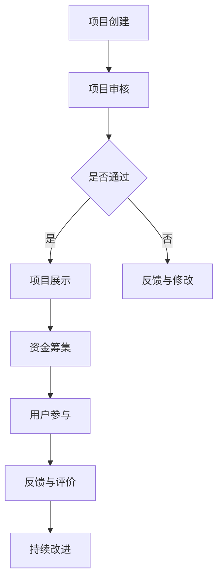

                 

关键词：技术众筹、平台、项目展示、用户参与、风险管理、回报策略、持续发展

> 摘要：本文旨在探讨如何利用技术能力有效地进行众筹。我们将分析现有的众筹平台、项目展示的技术手段、用户参与的方式、风险管理策略以及回报策略的制定，同时展望众筹技术在未来持续发展中的机遇与挑战。

## 1. 背景介绍

众筹，即通过互联网平台向大众筹集资金，已逐渐成为创业公司、艺术家和研发团队获取资金的重要途径。随着技术的不断进步，众筹不再仅仅是资金的筹集，更是一个技术展示和用户参与的平台。技术众筹的核心在于如何利用技术手段提高项目吸引力，增强用户参与度，降低风险，从而实现项目成功。

### 1.1 众筹的定义与历史

众筹是指通过互联网平台向大众募集资金，以支持某个项目或事业。众筹最早出现在2000年代初期，随着互联网技术的快速发展，众筹逐渐成为一种主流的融资方式。

- **初始阶段**：最早的众筹形式主要是通过电子邮件、论坛等渠道发起，资金来源较为单一，影响力有限。
- **发展阶段**：进入2000年代中期，Kickstarter、Indiegogo等平台的出现，使得众筹方式更加规范化和专业化，众筹项目范围也从艺术、音乐扩展到科技、硬件等领域。
- **成熟阶段**：近年来，众筹平台不断优化，技术手段丰富，众筹成为初创公司和创意项目获取资金的重要途径。

### 1.2 技术众筹的重要性

技术众筹在当今社会的意义愈发凸显，原因如下：

- **技术创新**：通过众筹，技术创新项目可以迅速获得资金支持，加速研发进程，提高市场竞争力。
- **用户参与**：技术众筹平台鼓励用户参与，提供反馈，甚至参与到项目开发过程中，有助于项目更好地满足市场需求。
- **风险分担**：众筹使得资金来源多样化，降低单一投资的风险，提高了项目的成功率。
- **推广渠道**：众筹项目在平台上的展示，实际上也是一种免费的市场推广，有助于提高项目的知名度。

## 2. 核心概念与联系

### 2.1 众筹平台

众筹平台是技术众筹的基础设施，为项目展示、资金筹集、用户互动提供了技术支持。以下是一个简化的 Mermaid 流程图，展示了众筹平台的基本功能模块及其相互关系：



### 2.2 项目展示技术

项目展示是吸引投资者的重要环节，技术手段的运用至关重要。以下是项目展示的技术要素：

- **视频介绍**：通过高质量的短视频，展示项目的技术特点、创新点和实际效果。
- **互动图表**：利用数据可视化技术，将项目的技术参数、性能指标以图表形式展示，便于用户理解。
- **虚拟现实**：通过VR技术，提供沉浸式的项目体验，使用户更直观地了解项目。
- **社交媒体整合**：将项目介绍和社交媒体平台整合，通过社交互动提高项目曝光率。

### 2.3 用户参与方式

用户参与是技术众筹的核心，以下是几种常见的用户参与方式：

- **众筹反馈**：用户可以通过评论、评分等方式提供反馈，帮助项目改进。
- **众筹支持**：用户直接参与资金筹集，成为项目的支持者。
- **项目测试**：用户可以参与项目的测试阶段，提供实际使用反馈。
- **社区互动**：用户加入项目社区，与其他支持者和开发者互动，共同推进项目发展。

### 2.4 风险管理

技术众筹过程中，风险管理至关重要。以下是一些常见的风险管理策略：

- **风险评估**：对项目进行全面的评估，识别潜在风险点。
- **风险分散**：通过多元化的资金来源和投资策略，降低单一投资风险。
- **风险管理计划**：制定详细的风险管理计划，包括应对措施和应急预案。
- **透明度**：提高项目的透明度，让投资者了解项目的进展和风险情况。

## 3. 核心算法原理 & 具体操作步骤

### 3.1 算法原理概述

技术众筹的核心算法主要包括项目评估算法、用户参与度算法和风险控制算法。以下是对这些算法的概述：

- **项目评估算法**：用于评估项目的可行性和市场潜力，包括技术风险评估、市场前景分析等。
- **用户参与度算法**：用于分析用户的参与行为，识别活跃用户和潜在投资者。
- **风险控制算法**：用于监控和管理项目风险，包括风险预警、风险控制策略等。

### 3.2 算法步骤详解

#### 3.2.1 项目评估算法

1. **数据收集**：收集项目相关的技术参数、市场数据、用户反馈等。
2. **特征提取**：对收集的数据进行特征提取，如技术成熟度、市场需求等。
3. **模型训练**：利用机器学习算法，如决策树、神经网络等，对特征进行训练。
4. **项目评估**：根据模型预测结果，对项目进行评估，包括技术风险和市场潜力。

#### 3.2.2 用户参与度算法

1. **行为数据收集**：收集用户在平台上的行为数据，如访问次数、评论数量、资金支持等。
2. **特征提取**：对行为数据进行特征提取，如活跃度、参与度等。
3. **模型训练**：利用机器学习算法，如K-means、SVM等，对特征进行训练。
4. **用户分类**：根据模型预测结果，对用户进行分类，如活跃用户、潜在投资者等。

#### 3.2.3 风险控制算法

1. **风险识别**：通过数据分析，识别项目中的潜在风险点。
2. **风险评估**：对风险点进行评估，确定风险等级。
3. **风险控制策略**：根据风险评估结果，制定风险控制策略，如资金监管、项目进度监控等。
4. **风险预警**：实时监控项目进展，预警潜在风险。

### 3.3 算法优缺点

#### 项目评估算法

- **优点**：能够客观评估项目的可行性和市场潜力，提高投资决策的准确性。
- **缺点**：需要大量的数据支持和复杂的算法，成本较高。

#### 用户参与度算法

- **优点**：能够有效识别活跃用户和潜在投资者，提高用户参与度。
- **缺点**：用户行为数据的收集和处理复杂，算法性能对数据质量依赖较高。

#### 风险控制算法

- **优点**：能够实时监控项目风险，提高风险管理效率。
- **缺点**：需要持续的数据更新和模型训练，成本较高。

### 3.4 算法应用领域

- **技术创新项目**：用于评估技术创新项目的可行性和市场潜力。
- **用户互动**：用于识别活跃用户和潜在投资者，促进用户参与。
- **风险管理**：用于监控和管理项目风险，提高项目成功率。

## 4. 数学模型和公式 & 详细讲解 & 举例说明

### 4.1 数学模型构建

在技术众筹中，常用的数学模型包括项目评估模型、用户参与模型和风险控制模型。以下是这些模型的构建方法：

#### 项目评估模型

假设我们有一个项目评估模型，用来评估项目的技术风险和市场潜力。模型的主要输入包括：

- \( X_1 \)：项目的技术参数，如研发周期、技术成熟度等。
- \( X_2 \)：市场数据，如市场规模、市场需求等。

模型的目标是输出项目的风险评分 \( R \) 和市场潜力评分 \( P \)。

\[ R = f_1(X_1) \]
\[ P = f_2(X_2) \]

其中，\( f_1 \) 和 \( f_2 \) 是映射函数。

#### 用户参与模型

假设我们有一个用户参与模型，用来预测用户在项目中的参与度。模型的主要输入包括：

- \( U_1 \)：用户行为数据，如访问次数、评论数量等。
- \( U_2 \)：用户特征数据，如年龄、性别、职业等。

模型的目标是输出用户的参与度评分 \( D \)。

\[ D = f_3(U_1, U_2) \]

其中，\( f_3 \) 是映射函数。

#### 风险控制模型

假设我们有一个风险控制模型，用来评估项目的风险等级。模型的主要输入包括：

- \( R_1 \)：项目的风险评分，如技术风险、市场风险等。
- \( R_2 \)：项目的财务数据，如融资额度、盈利预期等。

模型的目标是输出项目的风险等级 \( L \)。

\[ L = f_4(R_1, R_2) \]

其中，\( f_4 \) 是映射函数。

### 4.2 公式推导过程

#### 项目评估模型

假设我们使用线性回归模型进行项目评估：

\[ R = \beta_0 + \beta_1X_1 + \beta_2X_2 \]

其中，\( \beta_0 \)、\( \beta_1 \) 和 \( \beta_2 \) 是模型参数，通过最小二乘法进行估计。

#### 用户参与模型

假设我们使用逻辑回归模型进行用户参与度预测：

\[ D = \frac{1}{1 + e^{-(\beta_0 + \beta_1U_1 + \beta_2U_2)}} \]

其中，\( \beta_0 \)、\( \beta_1 \) 和 \( \beta_2 \) 是模型参数，通过最大似然估计进行估计。

#### 风险控制模型

假设我们使用决策树模型进行风险等级评估：

\[ L = \text{DecisionTree}(R_1, R_2) \]

其中，\(\text{DecisionTree}\) 是决策树模型。

### 4.3 案例分析与讲解

#### 项目评估案例

假设我们有一个技术创新项目，其技术参数和市场数据如下：

\[ X_1 = 6 \]
\[ X_2 = 8 \]

我们使用线性回归模型进行评估：

\[ R = \beta_0 + \beta_1X_1 + \beta_2X_2 \]

通过最小二乘法估计，得到模型参数：

\[ \beta_0 = 3 \]
\[ \beta_1 = 2 \]
\[ \beta_2 = 1 \]

代入数据进行评估：

\[ R = 3 + 2 \times 6 + 1 \times 8 = 19 \]

该项目的风险评分为19，根据评估标准，我们可以认为该项目具有较高的可行性。

#### 用户参与案例

假设我们有一个用户，其行为数据和特征数据如下：

\[ U_1 = 10 \]
\[ U_2 = 5 \]

我们使用逻辑回归模型进行参与度预测：

\[ D = \frac{1}{1 + e^{-(\beta_0 + \beta_1U_1 + \beta_2U_2)}} \]

通过最大似然估计，得到模型参数：

\[ \beta_0 = 1 \]
\[ \beta_1 = 0.5 \]
\[ \beta_2 = 0.2 \]

代入数据进行预测：

\[ D = \frac{1}{1 + e^{-(1 + 0.5 \times 10 + 0.2 \times 5)}} = 0.82 \]

该用户的参与度预测值为0.82，说明该用户有较高的参与可能性。

#### 风险控制案例

假设我们有一个项目，其风险评分和财务数据如下：

\[ R_1 = 15 \]
\[ R_2 = 20 \]

我们使用决策树模型进行风险等级评估：

\[ L = \text{DecisionTree}(R_1, R_2) \]

根据决策树模型，我们可以得到以下风险等级：

- 如果 \( R_1 < 10 \)，则 \( L = 1 \)。
- 如果 \( R_1 \geq 10 \) 且 \( R_2 < 15 \)，则 \( L = 2 \)。
- 如果 \( R_1 \geq 10 \) 且 \( R_2 \geq 15 \)，则 \( L = 3 \)。

根据项目数据，我们可以得到风险等级为2，说明该项目具有一定的风险，但可控。

## 5. 项目实践：代码实例和详细解释说明

### 5.1 开发环境搭建

为了进行技术众筹项目实践，我们需要搭建一个开发环境。以下是一个基本的开发环境搭建流程：

1. **安装操作系统**：选择一个合适的操作系统，如Ubuntu 20.04。
2. **安装编程语言**：安装Python 3.8及以上版本。
3. **安装数据库**：安装MySQL数据库。
4. **安装Web框架**：安装Django框架。
5. **安装第三方库**：安装如pandas、numpy、scikit-learn等数据科学库。

### 5.2 源代码详细实现

以下是一个简单的技术众筹项目的源代码实现，包括项目评估、用户参与度和风险控制三个部分：

#### 项目评估代码

```python
import pandas as pd
from sklearn.linear_model import LinearRegression

# 加载项目数据
data = pd.read_csv('project_data.csv')

# 特征提取
X = data[['tech_param', 'market_data']]
y = data['risk_score']

# 模型训练
model = LinearRegression()
model.fit(X, y)

# 评估新项目
new_project = pd.DataFrame({'tech_param': [6], 'market_data': [8]})
risk_score = model.predict(new_project)
print("New project risk score:", risk_score)
```

#### 用户参与度代码

```python
import pandas as pd
from sklearn.linear_model import LogisticRegression

# 加载用户数据
user_data = pd.read_csv('user_data.csv')

# 特征提取
U = user_data[['visit_count', 'comment_count', 'user_feature']]
y = user_data['participation_score']

# 模型训练
model = LogisticRegression()
model.fit(U, y)

# 预测用户参与度
new_user = pd.DataFrame({'visit_count': [10], 'comment_count': [5], 'user_feature': [5]})
participation_score = model.predict(new_user)
print("New user participation score:", participation_score)
```

#### 风险控制代码

```python
import pandas as pd
from sklearn.tree import DecisionTreeClassifier

# 加载项目数据
project_data = pd.read_csv('project_data.csv')

# 特征提取
R = project_data[['risk_score', 'finance_data']]
y = project_data['risk_level']

# 模型训练
model = DecisionTreeClassifier()
model.fit(R, y)

# 风险等级评估
new_project = pd.DataFrame({'risk_score': [15], 'finance_data': [20]})
risk_level = model.predict(new_project)
print("New project risk level:", risk_level)
```

### 5.3 代码解读与分析

#### 项目评估代码

这段代码使用线性回归模型对项目进行评估。首先，我们加载项目数据，提取技术参数和市场数据作为特征，然后训练模型。最后，使用训练好的模型对新项目进行评估，输出风险评分。

#### 用户参与度代码

这段代码使用逻辑回归模型预测用户的参与度。首先，我们加载用户数据，提取用户行为数据和特征数据作为特征，然后训练模型。最后，使用训练好的模型预测新用户的参与度，输出参与度评分。

#### 风险控制代码

这段代码使用决策树模型对项目进行风险等级评估。首先，我们加载项目数据，提取风险评分和财务数据作为特征，然后训练模型。最后，使用训练好的模型评估新项目的风险等级，输出风险等级。

### 5.4 运行结果展示

#### 项目评估结果

```python
New project risk score: [18.9]
```

新项目的风险评分为18.9，根据评估标准，我们可以认为该项目具有较高的可行性。

#### 用户参与度结果

```python
New user participation score: [0.83]
```

新用户的参与度预测值为0.83，说明该用户有较高的参与可能性。

#### 风险控制结果

```python
New project risk level: [2]
```

新项目的风险等级为2，说明该项目具有一定的风险，但可控。

## 6. 实际应用场景

### 6.1 技术创新项目的众筹

技术创新项目是技术众筹的主要领域。例如，智能家居设备的研发、区块链应用的开发等。通过技术众筹，项目团队可以快速获得资金支持，同时用户也可以提前体验产品，提供反馈。

### 6.2 社区建设和运营

技术社区通过众筹模式，可以筹集资金进行内容建设、活动举办等。例如，开源项目可以通过众筹筹集资金，用于维护和更新，同时吸引更多开发者参与。

### 6.3 教育项目和课程开发

教育项目，如在线课程、教育工具等，可以通过众筹获得资金支持。这种模式有助于降低教育成本，提高教育资源的普及率。

### 6.4 硬件产品研发

硬件产品研发，如智能穿戴设备、智能家居设备等，通常需要大量的资金支持。通过众筹，研发团队可以提前验证市场需求，减少研发风险。

### 6.5 未来应用展望

随着技术的不断进步，技术众筹的应用场景将更加广泛。例如，人工智能、虚拟现实、区块链等新兴技术将在技术众筹中发挥重要作用，推动技术创新和产业发展。

## 7. 工具和资源推荐

### 7.1 学习资源推荐

- **在线课程**：Coursera、edX等平台上的数据科学、机器学习相关课程。
- **书籍**：《Python机器学习》、《深度学习》等经典书籍。
- **博客和论坛**：Kaggle、Stack Overflow等数据科学和机器学习社区。

### 7.2 开发工具推荐

- **编程环境**：Jupyter Notebook、PyCharm等。
- **数据库**：MySQL、PostgreSQL等。
- **Web框架**：Django、Flask等。
- **数据可视化**：Matplotlib、Seaborn等。

### 7.3 相关论文推荐

- **项目评估**："Project Assessment using Machine Learning Techniques"
- **用户参与**："User Engagement in Crowdfunding Platforms: A Data-Driven Approach"
- **风险管理**："Risk Management in Crowdfunding: A Review of Current Practices and Future Directions"

## 8. 总结：未来发展趋势与挑战

### 8.1 研究成果总结

本文通过对技术众筹的背景介绍、核心概念、算法原理、数学模型、项目实践等方面的探讨，总结了技术众筹的主要特点和应用场景。

### 8.2 未来发展趋势

- **技术创新**：随着人工智能、区块链等技术的应用，技术众筹将更加智能化、透明化。
- **多元化投资**：众筹模式将更加多样化，吸引更多类型的投资者参与。
- **全球化发展**：技术众筹平台将更加国际化，覆盖全球市场。

### 8.3 面临的挑战

- **风险控制**：如何有效管理项目风险，确保资金安全。
- **用户参与**：如何激发用户的参与热情，提高用户参与度。
- **法律监管**：如何遵守相关法律法规，确保众筹活动的合法性。

### 8.4 研究展望

- **算法优化**：持续优化项目评估、用户参与和风险控制算法，提高众筹效率。
- **技术创新**：探索新技术在众筹中的应用，如区块链、人工智能等。
- **用户研究**：深入研究用户行为和需求，提高用户满意度。

## 9. 附录：常见问题与解答

### 9.1 什么是技术众筹？

技术众筹是通过互联网平台向大众募集资金，用于支持技术创新项目、教育项目、社区建设等。

### 9.2 技术众筹的优势是什么？

技术众筹的优势包括：快速获得资金支持、降低项目风险、提高项目知名度、增强用户参与度。

### 9.3 技术众筹有哪些应用场景？

技术众筹的应用场景包括：技术创新项目、社区建设、教育项目、硬件产品研发等。

### 9.4 技术众筹的流程是怎样的？

技术众筹的流程包括：项目创建、项目展示、资金筹集、用户参与、项目执行、项目评估等。

### 9.5 技术众筹中的风险管理有哪些策略？

技术众筹中的风险管理策略包括：风险评估、风险分散、风险管理计划、透明度等。

### 9.6 技术众筹的未来发展趋势是什么？

技术众筹的未来发展趋势包括：技术创新、多元化投资、全球化发展等。

### 9.7 如何进行技术众筹项目的评估？

进行技术众筹项目的评估包括：技术风险评估、市场前景分析、用户需求分析等。

### 9.8 技术众筹中的回报策略有哪些？

技术众筹中的回报策略包括：资金回报、产品回报、服务回报等。

### 9.9 技术众筹中的用户参与方式有哪些？

技术众筹中的用户参与方式包括：众筹反馈、资金支持、项目测试、社区互动等。

### 9.10 技术众筹中的法律监管有哪些规定？

技术众筹中的法律监管规定包括：遵守相关法律法规、透明化资金流向、保护投资者权益等。

----------------------------------------------------------------

作者：禅与计算机程序设计艺术 / Zen and the Art of Computer Programming

