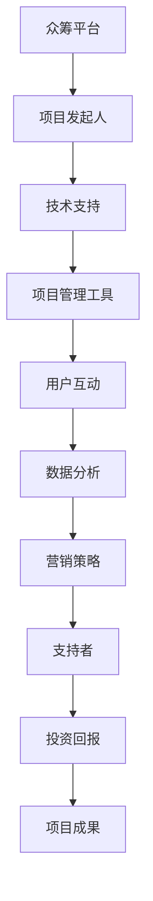

                 

关键词：众筹、技术能力、策略、平台、案例研究、成功因素

> 摘要：本文将探讨如何利用技术能力进行众筹，包括选择合适的众筹平台、制定有效的众筹策略、实施技术支持，以及评估众筹项目的成功因素。通过实际案例，我们将展示如何利用技术手段实现众筹目标。

## 1. 背景介绍

随着互联网技术的发展，众筹平台已经成为创业者、创新者、艺术家和科学家实现资金目标的重要途径。众筹不仅仅是一种筹资方式，更是一种营销策略，可以帮助项目发起人获取早期的用户反馈，验证市场需求，并建立品牌知名度。然而，成功的众筹项目不仅仅依赖于创意和市场需求，还需要充分利用技术能力来提升项目的吸引力、透明度和成功率。

### 1.1 众筹的定义和类型

众筹是指通过互联网平台，向广大公众筹集资金以支持某个项目或创意的一种筹资方式。根据筹款方式的不同，众筹可以分为以下几种类型：

- **捐赠型众筹**：捐赠者出于兴趣、爱好或对项目的支持而捐款，通常没有回报。
- **奖励型众筹**：捐赠者可以获得项目的某种回报，如产品样品、限量版产品或定制服务。
- **债务众筹**：捐赠者购买项目的债券，在未来通过利息或本金回报。
- **股权众筹**：捐赠者购买项目的股份，参与项目的收益分配。

### 1.2 技术能力在众筹中的作用

技术能力在众筹中扮演着多重角色，包括但不限于：

- **项目管理与跟踪**：利用项目管理工具和软件来规划项目进度、资源分配和风险管理。
- **用户互动与反馈**：通过社交媒体、论坛和在线调查工具与支持者互动，收集反馈并快速响应。
- **数据分析和可视化**：对众筹数据进行深入分析，制作可视化报告，帮助项目发起人了解支持者的需求和期望。
- **自动化和智能化**：通过自动化工具和人工智能技术提高项目管理和运营效率。

## 2. 核心概念与联系

### 2.1 核心概念

- **众筹平台**：如Kickstarter、Indiegogo、GoFundMe等，为项目发起人和支持者提供互动和交易的环境。
- **众筹策略**：包括项目定位、目标设定、时间规划、营销策略等。
- **技术支持**：包括网站开发、移动应用开发、数据分析、自动化工具等。

### 2.2 关联图（使用Mermaid绘制）



## 3. 核心算法原理 & 具体操作步骤

### 3.1 算法原理概述

众筹的成功并非偶然，而是依赖于一系列策略和技术手段的综合运用。核心算法原理包括：

- **项目定位**：确定项目的市场定位，明确目标受众。
- **目标设定**：设定合理的资金目标，包括最低目标、理想目标和最高目标。
- **时间规划**：选择最佳的众筹时间窗口，以最大化曝光率。
- **营销策略**：制定并执行营销计划，包括社交媒体推广、合作伙伴关系建立等。
- **技术支持**：利用技术手段提高项目透明度、互动性和吸引力。

### 3.2 算法步骤详解

#### 3.2.1 项目定位

1. **市场调研**：分析目标市场，了解用户需求和竞争对手。
2. **项目特色**：确定项目的独特卖点和优势。
3. **受众分析**：识别目标受众，包括年龄、性别、兴趣等。

#### 3.2.2 目标设定

1. **最低目标**：确保项目能够完成的基本资金需求。
2. **理想目标**：预期可以达到的资金目标。
3. **最高目标**：超出预期，用于扩展项目功能的资金目标。

#### 3.2.3 时间规划

1. **启动时间**：选择市场热度较高的时间段。
2. **持续时长**：通常为30天，但可以根据项目需求进行调整。
3. **倒计时策略**：设置倒计时，增加紧迫感和参与度。

#### 3.2.4 营销策略

1. **内容营销**：通过博客、视频、社交媒体等渠道传播项目信息。
2. **社交媒体推广**：利用社交媒体平台进行广告投放和互动。
3. **合作伙伴**：寻找相关领域的合作伙伴，共同推广项目。
4. **媒体曝光**：争取媒体报道，提高项目知名度。

#### 3.2.5 技术支持

1. **项目网站**：建设专业、易用的项目网站，展示项目详情。
2. **互动工具**：使用互动工具（如论坛、聊天室、在线调查等）与支持者互动。
3. **数据分析**：收集并分析用户数据，优化营销策略。

### 3.3 算法优缺点

#### 优点

- **快速获取资金**：通过众筹平台，项目可以在短时间内筹集到所需资金。
- **市场验证**：众筹过程是验证市场需求和项目可行性的有效方式。
- **品牌建设**：通过成功众筹，可以提高项目知名度和品牌影响力。

#### 缺点

- **竞争激烈**：众筹平台上的项目众多，竞争激烈，需要精心策划和推广。
- **时间压力**：通常众筹项目有时间限制，需要在规定时间内完成筹款目标。
- **回报风险**：部分项目可能因各种原因无法按时完成或交付回报，影响支持者的满意度。

### 3.4 算法应用领域

- **科技创新**：科技类项目可以利用众筹平台快速筹集资金，验证产品概念。
- **文化创意**：艺术、音乐、电影等文化创意项目可以通过众筹平台筹集资金，支持创作。
- **社会公益**：公益项目可以利用众筹平台筹集善款，支持社会公益活动。

## 4. 数学模型和公式 & 详细讲解 & 举例说明

### 4.1 数学模型构建

众筹项目的成功概率可以用以下数学模型表示：

\[ P(Success) = f(\text{Project Quality}, \text{Marketing Effort}, \text{Market Demand}, \text{Platform Effectiveness}) \]

其中，\( P(Success) \) 是众筹成功的概率，\( f \) 是函数，取决于以下因素：

- **Project Quality**：项目质量，包括创意独特性、可行性、市场定位等。
- **Marketing Effort**：营销努力，包括宣传力度、营销策略、用户互动等。
- **Market Demand**：市场需求，包括目标受众规模、用户需求强度等。
- **Platform Effectiveness**：平台效果，包括平台知名度、用户活跃度、资源支持等。

### 4.2 公式推导过程

假设每个因素对成功概率的影响是线性的，即：

\[ P(Success) = \alpha_1 \cdot \text{Project Quality} + \alpha_2 \cdot \text{Marketing Effort} + \alpha_3 \cdot \text{Market Demand} + \alpha_4 \cdot \text{Platform Effectiveness} \]

其中，\( \alpha_1, \alpha_2, \alpha_3, \alpha_4 \) 是权重系数。

### 4.3 案例分析与讲解

以一个科技创新项目为例，假设以下数据：

- **Project Quality**：80分
- **Marketing Effort**：70分
- **Market Demand**：60分
- **Platform Effectiveness**：90分

权重系数如下：

- \( \alpha_1 = 0.3 \)
- \( \alpha_2 = 0.2 \)
- \( \alpha_3 = 0.2 \)
- \( \alpha_4 = 0.3 \)

代入公式：

\[ P(Success) = 0.3 \cdot 80 + 0.2 \cdot 70 + 0.2 \cdot 60 + 0.3 \cdot 90 \]
\[ P(Success) = 24 + 14 + 12 + 27 \]
\[ P(Success) = 67 \]

因此，该项目成功的概率为67%。

## 5. 项目实践：代码实例和详细解释说明

### 5.1 开发环境搭建

为了更好地展示如何利用技术进行众筹，我们将使用一个开源的众筹平台——GitHub，搭建一个简单的众筹项目网站。以下是开发环境搭建的步骤：

1. **安装Git**：在官网下载并安装Git。
2. **安装Node.js和npm**：在官网下载并安装Node.js和npm。
3. **安装Web开发工具**：如Visual Studio Code、Sublime Text等。

### 5.2 源代码详细实现

我们将使用一个简单的Web框架——Express.js，实现一个基本的众筹项目网站。以下是项目的目录结构：

```bash
/众筹项目
|-- /node_modules
|-- /routes
|   |-- index.js
|-- /views
|   |-- home.hbs
|   |-- layout.hbs
|   |-- projects.hbs
|-- /public
|   |-- /css
|   |-- /js
|-- app.js
|-- package.json
```

**app.js**：

```javascript
const express = require('express');
const hbs = require('hbs');

const app = express();

app.set('view engine', 'hbs');
app.set('views', __dirname + '/views');
hbs.registerPartials(__dirname + '/views/partials');

app.use(express.static(__dirname + '/public'));

app.get('/', (req, res) => {
  res.render('home');
});

app.get('/projects', (req, res) => {
  res.render('projects');
});

app.listen(3000, () => {
  console.log('Server started on port 3000');
});
```

**routes/index.js**：

```javascript
const express = require('express');
const router = express.Router();

router.get('/', (req, res) => {
  res.render('home');
});

router.get('/projects', (req, res) => {
  res.render('projects');
});

module.exports = router;
```

**views/home.hbs**：

```html
<!DOCTYPE html>
<html lang="en">
<head>
  <meta charset="UTF-8">
  <title>众筹主页</title>
</head>
<body>
  <h1>欢迎来到众筹平台</h1>
  <a href="/projects">查看项目</a>
</body>
</html>
```

**views/projects.hbs**：

```html
<!DOCTYPE html>
<html lang="en">
<head>
  <meta charset="UTF-8">
  <title>众筹项目</title>
</head>
<body>
  <h1>我们的项目</h1>
  <ul>
    {{#each projects}}
      <li>{{name}} - {{description}}</li>
    {{/each}}
  </ul>
</body>
</html>
```

### 5.3 代码解读与分析

**app.js** 是项目的核心文件，用于配置Express.js应用。我们使用了`express`和`hbs`两个模块，并设置了视图引擎为HBS（Handlebars）。`express.static`用于提供静态文件服务。

**routes/index.js** 定义了路由，用于处理不同的URL请求。

**views/home.hbs** 和 **views/projects.hbs** 是项目模板文件，用于渲染HTML页面。

### 5.4 运行结果展示

运行项目后，访问 `http://localhost:3000` 可以看到众筹主页，访问 `http://localhost:3000/projects` 可以看到众筹项目列表。

## 6. 实际应用场景

### 6.1 科技创新项目

例如，一个初创公司希望通过众筹平台筹集资金，以开发一款智能家居设备。他们可以利用技术手段，搭建一个专业的项目网站，通过社交媒体和合作伙伴的推广，吸引潜在的支持者。

### 6.2 文化创意项目

例如，一个独立音乐人可以通过众筹平台筹集资金，制作专辑。他们可以利用社交媒体、直播和音频平台，与粉丝互动，提高项目的知名度。

### 6.3 社会公益项目

例如，一个公益组织可以通过众筹平台筹集善款，用于支持贫困地区的教育项目。他们可以利用技术手段，提高项目的透明度，让支持者了解善款的用途和效果。

## 6.4 未来应用展望

随着技术的不断发展，众筹平台和技术的结合将更加紧密。未来的众筹项目可能会更加智能化、个性化，支持者将能够通过更加直观和互动的方式参与项目。同时，人工智能和大数据分析技术将帮助项目发起人更好地了解市场趋势和支持者需求，从而提高众筹的成功率。

## 7. 工具和资源推荐

### 7.1 学习资源推荐

- **《众筹实战：如何成功筹集资金》**：一本关于众筹策略和实践的指南。
- **《网站开发从零开始》**：一本关于网站开发的入门书籍。

### 7.2 开发工具推荐

- **GitHub**：一个强大的代码托管和协作平台。
- **Visual Studio Code**：一款优秀的代码编辑器。

### 7.3 相关论文推荐

- **"Crowdfunding Platforms: A Survey of Models, Applications, and Challenges"**：一篇关于众筹平台的研究论文。
- **"The Impact of Crowdfunding on Innovation and Entrepreneurship"**：一篇关于众筹对创新和创业影响的论文。

## 8. 总结：未来发展趋势与挑战

### 8.1 研究成果总结

本文探讨了如何利用技术能力进行众筹，包括项目定位、目标设定、时间规划、营销策略和技术支持等方面。通过实际案例，展示了技术手段在提高众筹项目成功率方面的作用。

### 8.2 未来发展趋势

随着技术的不断发展，众筹平台和技术的结合将更加紧密，众筹项目将更加智能化、个性化。人工智能和大数据分析技术将帮助项目发起人更好地了解市场趋势和支持者需求。

### 8.3 面临的挑战

众筹项目的竞争将更加激烈，项目发起人需要不断创新和提高项目的质量。同时，项目交付的承诺和风险控制也将成为重要的挑战。

### 8.4 研究展望

未来，研究应关注如何利用新兴技术（如区块链、物联网等）提高众筹的透明度和安全性，以及如何通过技术手段提高众筹项目的用户体验和参与度。

## 9. 附录：常见问题与解答

### 9.1 什么类型的项目适合众筹？

适合众筹的项目通常是创新性强、市场需求明确、有明确的资金需求的。例如，科技创新项目、文化创意项目和社会公益项目。

### 9.2 众筹成功的概率有多大？

众筹成功的概率取决于多种因素，包括项目质量、营销策略、市场需求和平台效果等。通常，质量较高的项目成功概率更高。

### 9.3 众筹资金如何分配？

众筹资金通常用于项目开发、生产、营销和运营等方面。项目发起人应在众筹平台上明确资金用途，并定期更新资金使用情况。

## 作者署名

作者：禅与计算机程序设计艺术 / Zen and the Art of Computer Programming

