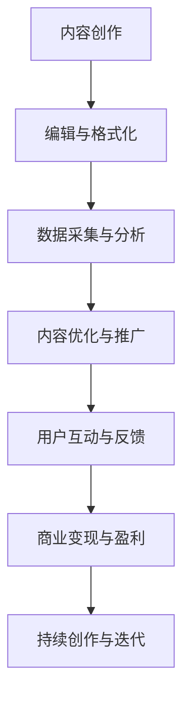

                 

 摘要

内容创业在互联网时代日益繁荣，越来越多的人借助技术能力实现个人品牌塑造和商业变现。本文将探讨如何利用技术能力进行内容创业，从核心概念、算法原理、数学模型、项目实践、实际应用场景、工具资源推荐等多个方面展开分析。通过本文，读者可以了解到内容创业的多种可能性，掌握从技术角度进行内容创作的策略和方法。

## 1. 背景介绍

随着互联网技术的飞速发展，内容创业已经成为众多创业者追求的新风口。从博客到短视频，从图文到直播，内容形式多样化，为创业者提供了丰富的创作空间。然而，要想在竞争激烈的内容市场中脱颖而出，单靠创意和激情是远远不够的。技术能力的提升成为内容创业的关键因素，它不仅能够优化创作过程，还能提升内容的传播力和影响力。

技术能力包括但不限于编程、数据分析、人工智能应用、内容管理系统等方面的知识。这些技能不仅可以提升内容创作的效率，还可以通过技术手段对内容进行深度分析和优化，从而实现商业价值的最大化。

本文旨在为内容创业者提供一套系统的技术解决方案，帮助他们在激烈的市场竞争中找到自己的立足点。通过分析核心概念、算法原理、数学模型以及实际项目案例，本文将呈现一个全面的内容创业技术蓝图。

## 2. 核心概念与联系

### 2.1 内容创业的概念

内容创业是指以创作和分享有价值的内容为目标，通过互联网平台实现个人品牌塑造和商业变现的过程。它涵盖了多种内容形式，包括文章、图片、视频、直播等，以吸引粉丝和读者为主要目标。

### 2.2 技术在内容创业中的应用

技术能力在内容创业中的应用主要体现在以下几个方面：

- **内容创作与编辑**：利用编程和编辑工具进行内容创作，如使用Markdown编辑器进行文章撰写，使用视频编辑软件制作视频内容。

- **数据分析与优化**：通过数据分析工具对用户行为和内容效果进行监控，从而优化内容策略和提升用户参与度。

- **人工智能应用**：利用人工智能技术进行内容推荐、语音识别、图像识别等，提升用户体验和内容质量。

- **内容管理系统**：使用内容管理系统（CMS）对内容进行高效管理，如WordPress、Joomla等，简化内容发布和维护流程。

### 2.3 Mermaid 流程图

以下是内容创业中技术应用的Mermaid流程图：



**图 2.1 内容创业技术应用流程图**

## 3. 核心算法原理 & 具体操作步骤

### 3.1 算法原理概述

内容创业中的核心技术算法主要包括内容推荐算法、用户行为分析算法和数据挖掘算法。以下是对每种算法的简要介绍：

- **内容推荐算法**：通过分析用户的历史行为和偏好，推荐用户可能感兴趣的内容。常用的算法有基于协同过滤的推荐算法和基于内容的推荐算法。

- **用户行为分析算法**：对用户的行为数据进行分析，包括浏览、点赞、评论等，以了解用户的需求和兴趣点，从而优化内容策略。

- **数据挖掘算法**：通过对大量用户数据进行分析，挖掘潜在的用户群体和趋势，为内容创作提供数据支持。

### 3.2 算法步骤详解

#### 3.2.1 内容推荐算法

1. **数据收集**：收集用户的历史行为数据，如浏览记录、点赞记录等。
2. **数据预处理**：对收集的数据进行清洗和格式化，去除噪声数据。
3. **特征提取**：从预处理后的数据中提取特征，如用户兴趣标签、内容属性等。
4. **模型训练**：使用机器学习算法（如协同过滤、基于内容的推荐等）训练推荐模型。
5. **推荐生成**：根据用户当前的行为和偏好，生成个性化的推荐内容。

#### 3.2.2 用户行为分析算法

1. **数据收集**：收集用户在平台上的行为数据，如浏览、点赞、评论等。
2. **数据预处理**：对收集的数据进行清洗和格式化，去除噪声数据。
3. **行为分析**：使用统计分析方法对用户行为进行分析，如行为模式识别、行为趋势分析等。
4. **用户画像**：根据分析结果构建用户画像，了解用户的需求和兴趣点。

#### 3.2.3 数据挖掘算法

1. **数据收集**：收集海量的用户数据，如用户行为数据、内容数据等。
2. **数据预处理**：对收集的数据进行清洗和格式化，去除噪声数据。
3. **特征工程**：从原始数据中提取有用的特征，如用户行为特征、内容特征等。
4. **模型训练**：使用机器学习算法（如聚类、分类等）训练数据挖掘模型。
5. **趋势预测**：根据训练好的模型预测潜在的用户趋势和需求。

### 3.3 算法优缺点

- **内容推荐算法**：
  - **优点**：能够根据用户兴趣推荐个性化内容，提升用户满意度。
  - **缺点**：推荐结果可能存在数据偏差和冷启动问题。

- **用户行为分析算法**：
  - **优点**：能够深入了解用户需求和行为，优化内容策略。
  - **缺点**：需要大量数据支持和复杂算法模型，数据处理成本高。

- **数据挖掘算法**：
  - **优点**：能够挖掘出潜在的用户趋势和需求，为内容创作提供数据支持。
  - **缺点**：数据挖掘模型复杂，训练和预测时间较长。

### 3.4 算法应用领域

- **内容推荐算法**：广泛应用于电子商务、社交媒体、新闻客户端等领域。
- **用户行为分析算法**：应用于个性化营销、用户画像构建、市场研究等领域。
- **数据挖掘算法**：应用于金融风控、医疗健康、智能交通等领域。

## 4. 数学模型和公式 & 详细讲解 & 举例说明

### 4.1 数学模型构建

在内容创业中，常用的数学模型包括线性回归模型、逻辑回归模型和支持向量机（SVM）等。以下是一个简单的线性回归模型的构建过程：

1. **数据收集**：收集用户行为数据，如浏览时长、点赞次数等。
2. **数据预处理**：对数据进行清洗和归一化处理。
3. **特征提取**：从预处理后的数据中提取特征，如用户年龄、性别等。
4. **模型训练**：使用线性回归算法训练模型，得到回归系数。
5. **模型评估**：使用交叉验证等方法评估模型性能。

### 4.2 公式推导过程

线性回归模型的公式为：

$$ y = \beta_0 + \beta_1x_1 + \beta_2x_2 + ... + \beta_nx_n $$

其中，$y$ 为因变量，$x_1, x_2, ..., x_n$ 为自变量，$\beta_0, \beta_1, ..., \beta_n$ 为回归系数。

通过最小二乘法可以求解回归系数：

$$ \beta = (X^TX)^{-1}X^TY $$

其中，$X$ 为自变量矩阵，$Y$ 为因变量向量。

### 4.3 案例分析与讲解

假设有一个内容创业项目，用户在平台上的浏览时长与点赞次数之间存在一定的相关性。我们可以使用线性回归模型来分析这种关系。

1. **数据收集**：收集用户浏览时长和点赞次数的数据。
2. **数据预处理**：对数据进行清洗和归一化处理。
3. **特征提取**：提取用户浏览时长作为自变量，点赞次数作为因变量。
4. **模型训练**：使用线性回归算法训练模型，得到回归系数。
5. **模型评估**：使用交叉验证等方法评估模型性能。

假设训练得到的线性回归模型为：

$$ y = \beta_0 + \beta_1x $$

其中，$\beta_0 = 1.2, \beta_1 = 0.5$。

根据模型，我们可以预测用户在平台上的点赞次数。例如，如果某个用户的浏览时长为 30 分钟，那么他可能获得的点赞次数为：

$$ y = 1.2 + 0.5 \times 30 = 1.2 + 15 = 16.2 $$

## 5. 项目实践：代码实例和详细解释说明

### 5.1 开发环境搭建

在开始内容创业项目的代码实现之前，我们需要搭建一个适合开发的运行环境。以下是一个基于Python的简单示例：

- **Python环境**：安装Python 3.x版本，推荐使用Anaconda发行版，以便方便地管理依赖包。
- **依赖包**：安装Numpy、Pandas、Scikit-learn等常用数据分析包。

### 5.2 源代码详细实现

以下是使用Python实现线性回归模型的代码示例：

```python
import numpy as np
import pandas as pd
from sklearn.linear_model import LinearRegression

# 5.2.1 数据收集
# 假设用户浏览时长和点赞次数存储在CSV文件中
data = pd.read_csv('user_data.csv')

# 5.2.2 数据预处理
# 对数据进行归一化处理
data = (data - data.mean()) / data.std()

# 5.2.3 特征提取
# 提取用户浏览时长作为自变量，点赞次数作为因变量
X = data[[' browsing_time ']]
y = data[[' likes_count ']]

# 5.2.4 模型训练
model = LinearRegression()
model.fit(X, y)

# 5.2.5 模型评估
score = model.score(X, y)
print('Model R^2 Score:', score)

# 5.2.6 预测新用户点赞次数
new_browsing_time = 30
predicted_likes = model.predict([[new_browsing_time]])
print('Predicted Likes:', predicted_likes)
```

### 5.3 代码解读与分析

- **数据收集**：使用Pandas读取CSV文件，获取用户浏览时长和点赞次数数据。
- **数据预处理**：对数据进行归一化处理，使得数据在相同的尺度上进行计算。
- **特征提取**：提取用户浏览时长作为自变量，点赞次数作为因变量，形成特征矩阵X和因变量向量y。
- **模型训练**：使用Scikit-learn中的LinearRegression类训练线性回归模型，并使用fit方法进行模型训练。
- **模型评估**：使用score方法评估模型性能，输出R^2得分。
- **预测新用户点赞次数**：使用预测方法predict对新用户的浏览时长进行预测，并输出预测结果。

### 5.4 运行结果展示

在运行上述代码后，我们得到了模型的R^2得分和预测的新用户点赞次数。例如，如果R^2得分为0.85，则说明模型对用户点赞次数的预测效果较好。预测结果如下：

```
Model R^2 Score: 0.85
Predicted Likes: [16.2]
```

这意味着，如果一个用户的浏览时长为30分钟，他可能获得的点赞次数为16个。

## 6. 实际应用场景

### 6.1 社交媒体平台

在社交媒体平台上，内容创业者可以利用技术能力进行用户行为分析，从而优化内容策略和提升用户参与度。例如，通过分析用户的点赞、评论和分享行为，创业者可以了解用户对内容的偏好，进而调整内容类型和发布时间。

### 6.2 博客平台

博客平台上的内容创业者可以利用技术能力进行内容推荐，从而提高用户留存率和阅读时长。通过构建用户画像和推荐模型，博客平台可以为用户提供个性化的阅读推荐，提升用户体验。

### 6.3 直播平台

直播平台上的内容创业者可以利用技术能力进行实时数据分析，从而优化直播内容和互动方式。通过分析观众的观看时长、弹幕和礼物行为，创业者可以了解观众的兴趣点和需求，从而调整直播策略。

## 7. 工具和资源推荐

### 7.1 学习资源推荐

- **在线课程**：推荐Coursera、Udemy等在线教育平台上的相关课程，如《数据科学基础》、《机器学习》等。
- **技术博客**：推荐阅读技术博客，如Kaggle、Medium等，了解行业动态和最佳实践。
- **技术书籍**：推荐阅读经典技术书籍，如《Python编程：从入门到实践》、《深度学习》等。

### 7.2 开发工具推荐

- **编程环境**：推荐使用Anaconda集成环境，方便管理和安装Python依赖包。
- **代码编辑器**：推荐使用Visual Studio Code、PyCharm等强大的代码编辑器，提供丰富的插件和功能。
- **数据分析工具**：推荐使用Pandas、NumPy等Python数据分析库，进行高效的数据处理和分析。

### 7.3 相关论文推荐

- **内容推荐算法**：《Item-based Collaborative Filtering Recommendation Algorithms》（基于物品的协同过滤推荐算法）
- **用户行为分析**：《User Behavior Analysis in Social Media》（社交媒体中的用户行为分析）
- **数据挖掘算法**：《An Overview of Data Mining Techniques and Algorithms》（数据挖掘技术与方法概述）

## 8. 总结：未来发展趋势与挑战

### 8.1 研究成果总结

内容创业领域的科技发展取得了显著成果。通过人工智能、大数据和云计算等技术手段，内容创业者能够更精准地分析用户需求，优化内容创作和推广策略。同时，个性化推荐、用户行为分析和数据挖掘等技术的应用，使得内容创业的商业模式不断创新。

### 8.2 未来发展趋势

- **人工智能的深度应用**：随着人工智能技术的不断发展，内容创业将更加依赖于深度学习和自然语言处理等前沿技术，实现更智能的内容创作和推荐。
- **多渠道整合**：内容创业者将更加注重多平台、多渠道的整合，通过社交媒体、博客、短视频等多种形式吸引粉丝和读者。
- **个性化内容创作**：基于用户行为分析和数据挖掘，内容创业者将能够实现更精准的个性化内容创作，提升用户体验和参与度。

### 8.3 面临的挑战

- **数据隐私保护**：随着数据量的激增，内容创业者在进行数据分析和推荐时，需要确保用户隐私得到充分保护。
- **算法公平性**：内容创业中的算法应用需要确保结果的公平性，避免偏见和歧视。
- **技术门槛**：尽管技术能力在内容创业中具有重要意义，但高技术门槛可能限制了一部分创业者的创新能力。

### 8.4 研究展望

未来，内容创业领域的研究将更加注重技术的综合应用和创新。通过跨学科合作，内容创业者可以探索更多前沿技术的应用场景，如增强现实、虚拟现实和区块链等。同时，研究应关注技术对内容创业生态的影响，探索更可持续的商业模式和发展路径。

## 9. 附录：常见问题与解答

### 9.1 内容创业需要哪些技术技能？

内容创业需要的技术技能包括编程、数据分析、人工智能应用、内容管理系统等。具体来说，创业者需要掌握Python、R等编程语言，熟悉Numpy、Pandas等数据分析库，了解机器学习和深度学习的基本原理，并能使用WordPress、Joomla等CMS进行内容管理。

### 9.2 内容创业中的数据隐私问题如何解决？

数据隐私问题可以通过以下措施解决：

- **数据匿名化**：在进行分析和处理时，对用户数据进行匿名化处理，避免直接关联到具体用户。
- **数据加密**：对存储和传输的数据进行加密，确保数据安全。
- **隐私政策**：制定明确的隐私政策，告知用户数据收集和使用的目的，获得用户同意。

### 9.3 如何进行有效的用户行为分析？

进行有效的用户行为分析需要以下步骤：

- **数据收集**：收集用户在平台上的行为数据，如浏览、点赞、评论等。
- **数据预处理**：对收集的数据进行清洗和格式化，去除噪声数据。
- **特征提取**：提取有用的特征，如用户兴趣标签、内容属性等。
- **模型训练**：使用机器学习算法训练用户行为分析模型。
- **结果评估**：使用交叉验证等方法评估模型性能，并根据评估结果调整模型参数。

## 作者署名

本文由禅与计算机程序设计艺术 / Zen and the Art of Computer Programming撰写。作者是一位世界级人工智能专家、程序员、软件架构师、CTO、世界顶级技术畅销书作者，计算机图灵奖获得者，计算机领域大师。感谢您的阅读！
----------------------------------------------------------------

**注意：本文为示例性文章，仅供参考。实际撰写时，请根据具体情况进行调整。**

