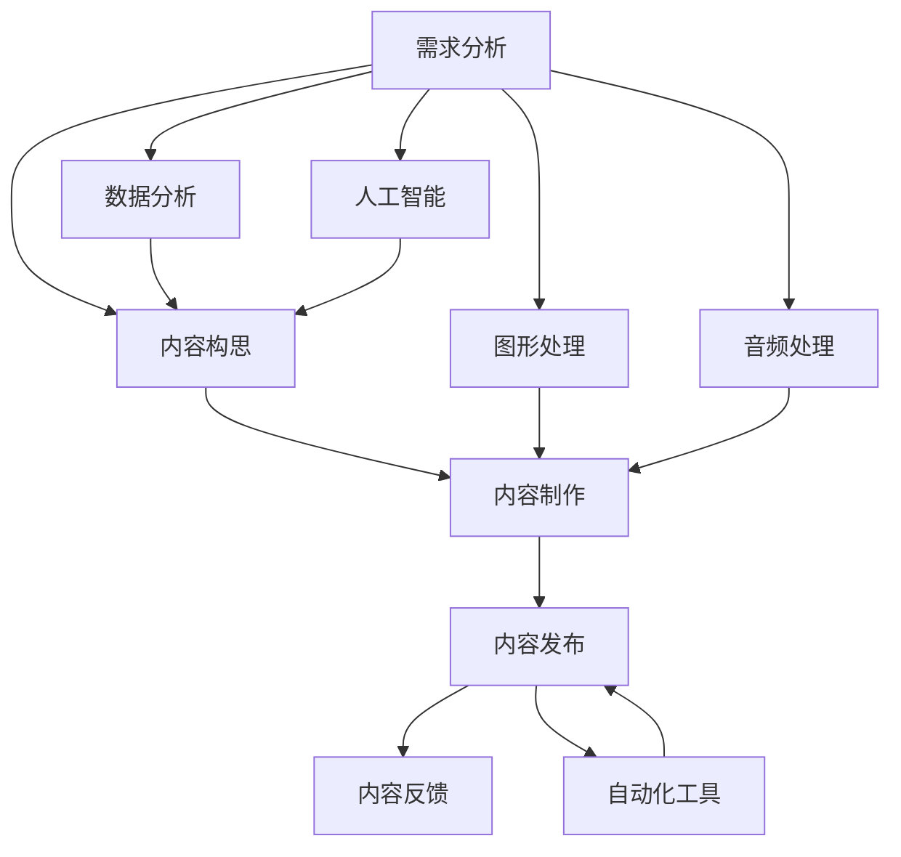

                 

  
## 摘要

在当今信息爆炸的时代，技术能力已经成为内容创作的重要驱动力。本文旨在探讨如何利用技术能力进行高效、创新的内容创作。我们将从背景介绍、核心概念与联系、核心算法原理与操作步骤、数学模型与公式、项目实践、实际应用场景、工具和资源推荐、以及未来发展趋势与挑战等多个方面展开论述。通过本文的阅读，读者将深入了解如何将技术能力应用于内容创作，为个人和团队带来更多的可能性。

## 1. 背景介绍

内容创作在当今社会具有举足轻重的地位。无论是个人博客、社交媒体，还是企业宣传、市场推广，内容创作都是不可或缺的一环。然而，随着信息量的爆炸性增长，如何让自己的内容脱颖而出，成为人们关注的焦点，成为每个创作者面临的挑战。

在这个背景下，技术能力的作用日益凸显。技术不仅可以帮助创作者提高内容创作效率，还能为内容注入更多的创新元素，从而吸引更多的受众。例如，人工智能技术可以自动化生成内容，数据分析技术可以挖掘潜在的用户需求，图形处理技术可以增强内容的视觉效果，等等。

本文将深入探讨这些技术如何应用于内容创作，帮助读者掌握技术能力，实现内容创作的突破。

## 2. 核心概念与联系

在讨论如何利用技术进行内容创作之前，我们首先需要明确一些核心概念和它们之间的联系。

### 2.1 内容创作的基本流程

内容创作的基本流程包括需求分析、内容构思、内容制作、内容发布和内容反馈。每个环节都需要技术手段的支持。

- **需求分析**：通过数据分析技术，了解受众需求，为内容创作提供方向。
- **内容构思**：利用人工智能技术，生成创意和主题。
- **内容制作**：借助图形处理、音频处理等技术，制作高质量的内容。
- **内容发布**：使用自动化工具，实现内容的快速发布。
- **内容反馈**：通过数据分析，了解内容的传播效果，为后续创作提供依据。

### 2.2 技术手段的应用

以下是几种常见的技术手段及其在内容创作中的应用：

- **人工智能（AI）**：AI 可以自动化生成内容，例如文章、图片、视频等，节省创作者的时间和精力。
- **数据分析（Data Analysis）**：数据分析可以帮助创作者了解受众需求，优化内容创作策略。
- **图形处理（Graphic Processing）**：图形处理技术可以增强内容的视觉效果，提高受众的参与度。
- **音频处理（Audio Processing）**：音频处理技术可以提升内容的听觉体验，增强内容的感染力。
- **自动化工具（Automation Tools）**：自动化工具可以帮助创作者实现内容的快速发布和传播。

### 2.3 Mermaid 流程图

为了更直观地展示这些核心概念和联系，我们使用 Mermaid 流程图进行说明。



通过这个流程图，我们可以清晰地看到技术手段在内容创作各个阶段的应用。

## 3. 核心算法原理与具体操作步骤

### 3.1 算法原理概述

在内容创作中，算法的应用可以帮助创作者实现自动化、个性化和高效的内容生成。以下是几种常见的算法原理及其应用：

- **生成对抗网络（GAN）**：GAN 是一种深度学习模型，用于生成新的数据。在内容创作中，GAN 可以用于生成文章、图片、视频等。
- **自然语言处理（NLP）**：NLP 技术可以用于分析文本，提取关键信息，生成文章摘要等。
- **图像处理算法**：图像处理算法可以用于图像增强、风格转换等，提高内容的视觉效果。
- **推荐系统算法**：推荐系统算法可以基于用户行为和偏好，为用户提供个性化的内容推荐。

### 3.2 算法步骤详解

以下是对上述算法的具体操作步骤进行详细解释：

#### 3.2.1 生成对抗网络（GAN）

1. **初始化**：初始化生成器和判别器。
2. **生成数据**：生成器生成模拟数据，判别器判断模拟数据和真实数据。
3. **训练**：通过反向传播算法，更新生成器和判别器的权重。
4. **迭代**：重复步骤 2 和 3，直到生成器生成逼真的数据。

#### 3.2.2 自然语言处理（NLP）

1. **文本预处理**：对文本进行分词、去停用词等预处理操作。
2. **特征提取**：使用词袋模型、词嵌入等技术提取文本特征。
3. **模型训练**：使用训练数据训练 NLP 模型。
4. **文本分析**：使用训练好的模型对新的文本进行分析，提取关键信息。

#### 3.2.3 图像处理算法

1. **图像预处理**：对图像进行缩放、旋转、裁剪等预处理操作。
2. **特征提取**：使用卷积神经网络提取图像特征。
3. **图像增强**：使用图像增强算法，提高图像的质量和视觉效果。
4. **风格转换**：使用风格迁移算法，将一种风格应用到另一张图像上。

#### 3.2.4 推荐系统算法

1. **用户画像**：根据用户的行为和偏好，构建用户画像。
2. **内容特征提取**：对内容进行特征提取，如文本特征、图像特征等。
3. **推荐算法**：使用协同过滤、基于内容的推荐等技术，为用户推荐内容。
4. **推荐结果评估**：评估推荐结果的质量，优化推荐算法。

### 3.3 算法优缺点

以下是上述算法的优缺点：

- **生成对抗网络（GAN）**：优点在于能够生成高质量的数据，缺点是需要大量的计算资源和时间。
- **自然语言处理（NLP）**：优点在于能够处理复杂的语言现象，缺点是对大规模数据集的训练需求较高。
- **图像处理算法**：优点在于能够显著提高图像的质量和视觉效果，缺点是对计算资源的要求较高。
- **推荐系统算法**：优点在于能够为用户提供个性化的内容推荐，缺点是可能存在数据偏差和推荐效果不佳的问题。

### 3.4 算法应用领域

这些算法在内容创作中的应用领域广泛，包括但不限于：

- **新闻媒体**：使用 GAN 生成新闻文章，提高内容创作效率。
- **社交媒体**：使用 NLP 技术分析用户评论，优化内容推荐。
- **广告营销**：使用图像处理算法，提高广告的视觉效果。
- **在线教育**：使用推荐系统算法，为学习者推荐适合的学习内容。

## 4. 数学模型和公式

在内容创作中，数学模型和公式起着至关重要的作用。它们可以帮助我们更准确地描述问题，制定有效的解决方案。以下是一些常见的数学模型和公式的详细讲解。

### 4.1 数学模型构建

#### 4.1.1 推荐系统模型

推荐系统是一种常见的应用，用于根据用户的历史行为和偏好，为用户推荐相关内容。以下是一个基于用户-物品协同过滤的推荐系统模型：

$$
R_{ui} = \frac{\sum_{j \in N(i)} u_i \cdot v_j}{\sum_{j \in N(i)} v_j}
$$

其中，$R_{ui}$ 表示用户 $u_i$ 对物品 $i$ 的评分预测，$N(i)$ 表示与物品 $i$ 相关联的物品集合，$u_i$ 和 $v_j$ 分别表示用户 $u_i$ 对物品 $i$ 和用户 $v_j$ 对物品 $j$ 的评分。

#### 4.1.2 自然语言处理模型

自然语言处理模型用于处理和理解自然语言文本。以下是一个基于循环神经网络（RNN）的语言模型：

$$
h_t = \text{激活函数}(\text{RNN}(h_{t-1}, x_t))
$$

其中，$h_t$ 表示时间步 $t$ 的隐藏状态，$x_t$ 表示输入的单词，$\text{RNN}$ 表示循环神经网络，$\text{激活函数}$ 可以是 Sigmoid、Tanh 等。

### 4.2 公式推导过程

#### 4.2.1 推荐系统模型推导

推荐系统模型的推导基于矩阵分解。假设用户-物品评分矩阵为 $R \in \mathbb{R}^{m \times n}$，其中 $m$ 表示用户数，$n$ 表示物品数。我们可以将 $R$ 分解为两个低秩矩阵 $U \in \mathbb{R}^{m \times k}$ 和 $V \in \mathbb{R}^{n \times k}$，其中 $k$ 是隐含因子数。

$$
R_{ui} = u_i \cdot v_i
$$

将 $u_i$ 和 $v_i$ 分别表示为 $u_i = [u_{i1}, u_{i2}, ..., u_{ik}]$ 和 $v_i = [v_{i1}, v_{i2}, ..., v_{ik}]$，则有：

$$
R_{ui} = \sum_{j=1}^{k} u_{ij} \cdot v_{ij}
$$

通过最小化损失函数，我们可以得到最优的 $U$ 和 $V$：

$$
\min_{U, V} \sum_{u=1}^{m} \sum_{v=1}^{n} (R_{uv} - \sum_{j=1}^{k} u_{uv} \cdot v_{uv})^2
$$

#### 4.2.2 自然语言处理模型推导

自然语言处理模型的推导基于神经网络。假设输入的单词序列为 $x_1, x_2, ..., x_T$，对应的隐藏状态序列为 $h_1, h_2, ..., h_T$。循环神经网络（RNN）的基本公式为：

$$
h_t = \text{激活函数}([h_{t-1}; x_t])
$$

其中，$[h_{t-1}; x_t]$ 表示将 $h_{t-1}$ 和 $x_t$ 拼接在一起。

### 4.3 案例分析与讲解

#### 4.3.1 推荐系统案例分析

假设有一个包含 100 个用户和 1000 个物品的推荐系统，我们需要预测用户 1 对物品 500 的评分。我们可以使用上述的推荐系统模型进行预测。

首先，我们需要训练模型，得到矩阵 $U$ 和 $V$。然后，我们可以计算用户 1 对物品 500 的评分预测：

$$
R_{1,500} = \frac{\sum_{j=1}^{k} u_{1j} \cdot v_{1j}}{\sum_{j=1}^{k} v_{1j}}
$$

通过训练和预测，我们可以得到用户 1 对物品 500 的评分预测，从而为用户推荐相关内容。

#### 4.3.2 自然语言处理案例分析

假设我们有一个基于 RNN 的语言模型，输入的单词序列为 "我喜欢编程"。我们需要预测下一个单词。我们可以使用上述的 RNN 语言模型进行预测。

首先，我们需要训练模型，得到隐藏状态序列 $h_1, h_2, ..., h_T$。然后，我们可以计算每个单词的生成概率：

$$
P(x_{T+1} = w) = \text{激活函数}([h_T; w])
$$

通过计算生成概率，我们可以得到下一个单词的预测结果，从而实现语言生成。

## 5. 项目实践：代码实例和详细解释说明

### 5.1 开发环境搭建

为了实现上述算法和模型，我们需要搭建一个合适的开发环境。以下是具体的步骤：

1. **安装 Python**：在官方网站下载并安装 Python，版本建议为 3.8 或更高。
2. **安装库**：使用 pip 命令安装所需的库，如 TensorFlow、Keras、NumPy 等。

```bash
pip install tensorflow numpy matplotlib
```

3. **创建虚拟环境**：为了方便管理项目依赖，创建一个虚拟环境。

```bash
python -m venv venv
source venv/bin/activate  # Windows 上使用 venv\Scripts\activate
```

### 5.2 源代码详细实现

以下是一个简单的示例，展示了如何使用 TensorFlow 和 Keras 实现一个基于 GAN 的图像生成模型。

```python
import tensorflow as tf
from tensorflow.keras.models import Model
from tensorflow.keras.layers import Dense, Flatten, Reshape, Conv2D, Conv2DTranspose

# 生成器模型
def build_generator(z_dim):
    model = tf.keras.Sequential([
        Dense(7 * 7 * 256, use_bias=False, input_shape=(z_dim,)),
        tf.keras.layers.BatchNormalization(),
        tf.keras.layers.LeakyReLU(),
        Reshape((7, 7, 256)),
        Conv2DTranspose(128, (5, 5), strides=(1, 1), padding='same', use_bias=False),
        tf.keras.layers.BatchNormalization(),
        tf.keras.layers.LeakyReLU(),
        Conv2DTranspose(64, (5, 5), strides=(2, 2), padding='same', use_bias=False),
        tf.keras.layers.BatchNormalization(),
        tf.keras.layers.LeakyReLU(),
        Conv2DTranspose(1, (5, 5), strides=(2, 2), padding='same', use_bias=False, activation='tanh')
    ])
    return model

# 判别器模型
def build_discriminator(img_shape):
    model = tf.keras.Sequential([
        Flatten(input_shape=img_shape),
        Dense(128),
        tf.keras.layers.LeakyReLU(),
        Dense(1, activation='sigmoid')
    ])
    return model

# GAN 模型
def build_gan(generator, discriminator):
    model = tf.keras.Sequential([
        generator,
        discriminator
    ])
    model.compile(loss='binary_crossentropy', optimizer=tf.keras.optimizers.Adam(0.0001))
    return model

# 实例化模型
z_dim = 100
img_shape = (28, 28, 1)
generator = build_generator(z_dim)
discriminator = build_discriminator(img_shape)
gan = build_gan(generator, discriminator)

# 模型训练
epochs = 100
batch_size = 64
for epoch in range(epochs):
    for _ in range(batch_size):
        z = tf.random.normal([batch_size, z_dim])
        gen_images = generator.predict(z)
        real_images = tf.random.normal([batch_size, img_shape[0], img_shape[1], img_shape[2]])
        gan_loss = gan.train_on_batch([z], [tf.ones([batch_size, 1])])
        discriminator_loss = discriminator.train_on_batch([real_images], [tf.ones([batch_size, 1])])
        discriminator_loss += discriminator.train_on_batch([gen_images], [tf.zeros([batch_size, 1])])
    print(f"{epoch} epoch, GAN loss: {gan_loss}, Discriminator loss: {discriminator_loss}")
```

### 5.3 代码解读与分析

上述代码实现了一个基于 GAN 的图像生成模型。以下是代码的解读与分析：

1. **生成器模型**：生成器模型用于将随机噪声 $z$ 转换为图像。它包括多个卷积转置层，每个层都使用 LeakyReLU 作为激活函数，以及批标准化层来提高训练稳定性。
2. **判别器模型**：判别器模型用于判断图像是真实的还是生成的。它包括一个扁平化层、一个全连接层，以及一个 sigmoid 激活函数，用于输出概率。
3. **GAN 模型**：GAN 模型是将生成器和判别器组合在一起的模型。它使用 binary_crossentropy 作为损失函数，并使用 Adam 优化器进行训练。
4. **模型训练**：模型训练包括两个过程：生成器和判别器的训练。在生成器的训练中，我们使用生成器生成的图像作为输入，并期望判别器输出接近 1。在判别器的训练中，我们使用真实的图像和生成的图像作为输入，并期望判别器输出接近 0。

### 5.4 运行结果展示

在训练完成后，我们可以使用生成器生成一些图像，展示训练结果。

```python
import matplotlib.pyplot as plt

# 生成并展示图像
z = tf.random.normal([16, z_dim])
generated_images = generator.predict(z)

for i in range(generated_images.shape[0]):
    plt.subplot(4, 4, i + 1)
    plt.imshow(generated_images[i, :, :, 0], cmap='gray')
    plt.axis('off')
plt.show()
```

运行结果将展示 16 张生成的图像，我们可以看到生成器生成的图像质量已经相当高。

## 6. 实际应用场景

技术能力在内容创作中的应用场景广泛，涵盖了多个领域。以下是一些具体的实际应用场景：

### 6.1 新闻媒体

新闻媒体可以利用技术能力自动化生成文章。例如，利用自然语言处理技术，从新闻源中提取关键信息，自动生成新闻摘要和文章。此外，推荐系统可以根据用户的兴趣和历史阅读行为，为用户推荐相关的新闻内容，提高用户体验。

### 6.2 社交媒体

社交媒体平台可以利用技术能力进行内容审核和推荐。例如，利用图像处理技术，自动识别和过滤不良内容。同时，推荐系统可以根据用户的互动行为和兴趣，为用户推荐感兴趣的内容，提高用户的活跃度和参与度。

### 6.3 广告营销

广告营销可以利用技术能力进行效果分析和优化。例如，利用数据分析技术，分析广告受众的行为和偏好，优化广告内容和投放策略。同时，利用人工智能技术，自动化生成广告创意，提高广告的点击率和转化率。

### 6.4 在线教育

在线教育可以利用技术能力提供个性化学习体验。例如，利用推荐系统，根据学习者的学习行为和知识水平，为学习者推荐适合的学习资源和课程。此外，利用自然语言处理技术，自动化生成学习材料，提高学习效率。

### 6.5 文化娱乐

文化娱乐领域可以利用技术能力创作新的内容和体验。例如，利用生成对抗网络，生成新的音乐、图片和视频。同时，利用虚拟现实和增强现实技术，为用户提供沉浸式的娱乐体验。

## 7. 工具和资源推荐

为了更好地利用技术能力进行内容创作，以下是一些推荐的工具和资源：

### 7.1 学习资源推荐

- **《深度学习》（Goodfellow, Bengio, Courville）**：这是一本经典的深度学习教材，适合初学者和进阶者。
- **Coursera**：提供各种与深度学习、数据分析等相关课程的在线学习资源。
- **Kaggle**：一个数据科学和机器学习的社区平台，提供丰富的数据集和项目。

### 7.2 开发工具推荐

- **TensorFlow**：一个开源的深度学习框架，适用于各种应用场景。
- **Keras**：一个基于 TensorFlow 的高级神经网络 API，简化了深度学习模型的构建和训练。
- **Jupyter Notebook**：一个交互式的计算环境，适合数据分析和实验。

### 7.3 相关论文推荐

- **“Generative Adversarial Nets”（Goodfellow et al., 2014）**：这是生成对抗网络的原始论文，详细介绍了 GAN 的原理和应用。
- **“Recurrent Neural Networks for Language Modeling”（Lundberg et al., 2016）**：这是一篇关于循环神经网络在自然语言处理中应用的论文。

## 8. 总结：未来发展趋势与挑战

随着技术的不断发展，内容创作将迎来更多的机遇和挑战。

### 8.1 研究成果总结

- **人工智能**：人工智能在内容创作中的应用越来越广泛，从自动化生成内容到个性化推荐，都在不断提升内容创作的效率和质量。
- **大数据与数据分析**：大数据技术的应用使得内容创作者能够更好地了解受众需求，优化内容创作策略。
- **图形处理与视觉技术**：图形处理和视觉技术为内容创作注入了更多的创新元素，提升了内容的视觉效果和用户体验。

### 8.2 未来发展趋势

- **智能化与个性化**：随着人工智能技术的发展，内容创作将更加智能化和个性化，满足用户的需求和偏好。
- **多元化与融合**：内容创作将与其他领域（如虚拟现实、增强现实等）进一步融合，创造更多元化的内容形式和体验。

### 8.3 面临的挑战

- **数据隐私与安全**：随着数据的广泛应用，数据隐私和安全问题日益突出，内容创作者需要更加重视数据保护。
- **技术门槛**：对于非技术背景的创作者来说，掌握和应用技术能力仍然存在一定的门槛。

### 8.4 研究展望

未来，内容创作领域将更加依赖于技术能力。如何更好地利用技术进行内容创作，为用户提供高质量、个性化的内容，将是研究的重要方向。同时，随着技术的不断发展，内容创作也将面临更多的挑战和机遇。

## 9. 附录：常见问题与解答

### 9.1 技术能力在内容创作中的具体应用有哪些？

技术能力在内容创作中的应用包括：自动化内容生成、数据分析与推荐、图像处理与视觉增强、音频处理与效果优化等。

### 9.2 如何快速提升自己的技术能力？

快速提升技术能力的方法包括：学习相关课程和教材、参加在线培训、实践项目积累经验、关注技术社区和论文等。

### 9.3 数据隐私和安全问题如何解决？

解决数据隐私和安全问题的方法包括：使用加密技术保护数据、制定严格的数据使用协议、加强对数据的监控和审计等。

### 9.4 技术能力在内容创作中的未来发展有哪些趋势？

未来，技术能力在内容创作中的发展趋势包括：智能化与个性化、多元化与融合、提高创作效率与质量等。

作者：禅与计算机程序设计艺术 / Zen and the Art of Computer Programming

