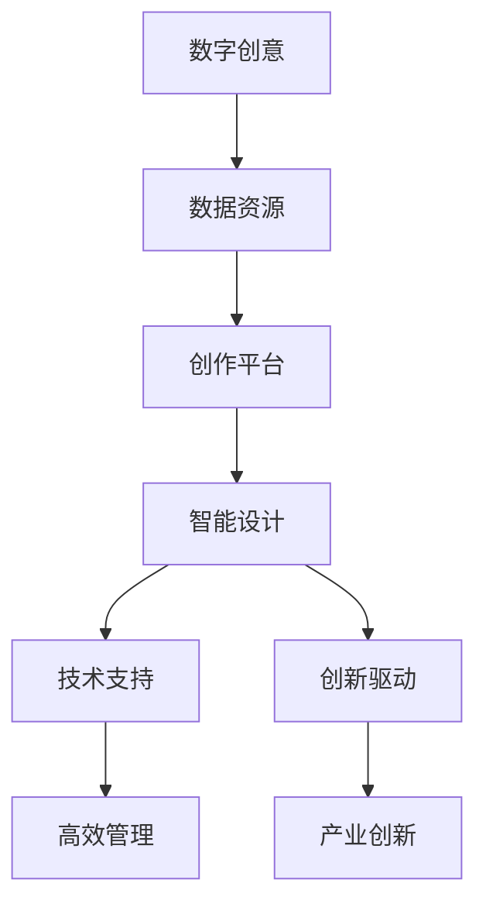

                 

关键词：创意产业、技术能力、革新、产业转型、数字创意、智能设计

> 摘要：本文从技术能力的角度出发，探讨了如何利用先进的技术手段推动创意产业的发展和革新。通过分析创意产业的核心需求，阐述了数字创意和智能设计的应用场景，以及具体的技术解决方案和实施步骤，为创意产业的数字化转型提供了理论指导和实践参考。

## 1. 背景介绍

创意产业，又称创意经济，是指通过创意思维和创新手段，将文化资源、知识资源和科技资源转化为经济价值的产业。它涵盖了设计、广告、影视、音乐、游戏、出版等多个领域。随着互联网和数字技术的发展，创意产业逐渐成为全球经济的重要推动力。

近年来，创意产业在全球范围内呈现出蓬勃发展的态势。一方面，消费者对于创意产品和服务的需求不断增加；另一方面，新技术为创意产业的发展提供了丰富的工具和平台。例如，虚拟现实（VR）、增强现实（AR）、人工智能（AI）、区块链等技术的应用，正在深刻改变创意产业的运作方式和商业模式。

然而，创意产业在快速发展的同时也面临诸多挑战。首先，创意产业具有较高的不确定性和风险性，如何提高创意产品的质量和市场竞争力成为关键问题。其次，创意产业的产业链较长，涉及多个环节和参与者，如何实现高效协同和资源整合也是一个重要课题。最后，创意产业的数字化转型步伐加快，如何充分利用新技术提升产业效率和服务水平，成为创意产业必须面对的挑战。

## 2. 核心概念与联系

在探讨如何利用技术能力进行创意产业革新之前，我们需要明确几个核心概念，并了解它们之间的联系。

### 2.1 数字创意

数字创意是指通过数字技术对创意资源进行挖掘、加工和传播，形成具有创新性和商业价值的产品和服务。数字创意的核心在于将传统创意资源与数字技术相结合，实现创意的数字化、网络化和智能化。

### 2.2 智能设计

智能设计是指利用人工智能技术，对创意设计过程进行辅助和优化，提高设计效率和创新能力。智能设计包括智能建模、智能仿真、智能优化等多个方面，可以帮助设计师快速找到最优的设计方案。

### 2.3 数字创意与智能设计的联系

数字创意和智能设计是相互促进、密不可分的关系。数字创意为智能设计提供了丰富的数据资源和创作平台，而智能设计则为数字创意提供了技术支持和创新动力。通过数字创意和智能设计的结合，可以实现对创意产业的高效管理和创新驱动。

### 2.4 Mermaid 流程图

下面是一个描述数字创意与智能设计之间联系的 Mermaid 流程图：



## 3. 核心算法原理 & 具体操作步骤

### 3.1 算法原理概述

在数字创意和智能设计领域，核心算法主要包括以下几个部分：

1. **图像处理算法**：用于对创意图像进行编辑、优化和增强，提高图像质量。
2. **深度学习算法**：用于图像识别、语音识别、自然语言处理等任务，为创意设计提供智能支持。
3. **优化算法**：用于求解创意设计的最优方案，提高设计效率和效果。
4. **数据挖掘算法**：用于从大量数据中发现有价值的信息，为创意设计提供数据支持。

### 3.2 算法步骤详解

以下是针对数字创意和智能设计领域的一些核心算法步骤：

#### 3.2.1 图像处理算法

1. **图像预处理**：包括去噪、增强、对比度调整等操作，提高图像质量。
2. **图像分割**：将图像划分为多个区域，便于后续处理。
3. **图像增强**：通过调整图像的亮度和对比度，使图像更加清晰。
4. **图像识别**：使用深度学习算法，对图像进行分类和识别。

#### 3.2.2 深度学习算法

1. **模型训练**：使用大量标注数据进行模型训练，提高模型识别和预测能力。
2. **模型优化**：通过调整模型参数，提高模型性能。
3. **模型部署**：将训练好的模型部署到创意设计平台，实现自动化和智能化。

#### 3.2.3 优化算法

1. **目标函数定义**：根据创意设计需求，定义优化目标函数。
2. **求解算法选择**：根据目标函数的性质，选择合适的求解算法，如遗传算法、粒子群算法等。
3. **算法实现**：实现优化算法的具体步骤，求解最优解。

#### 3.2.4 数据挖掘算法

1. **数据收集**：收集与创意设计相关的数据，如用户行为数据、市场数据等。
2. **数据清洗**：对数据进行清洗和预处理，去除噪声和异常值。
3. **特征提取**：从数据中提取有价值的信息，为创意设计提供数据支持。
4. **模型训练**：使用特征数据训练数据挖掘模型，进行预测和分析。

### 3.3 算法优缺点

不同算法在数字创意和智能设计领域具有各自的优缺点：

1. **图像处理算法**：优点在于处理速度快，效果直观；缺点是对于复杂场景的识别能力有限。
2. **深度学习算法**：优点在于强大的识别和预测能力，适用于多种场景；缺点是训练过程复杂，对数据要求高。
3. **优化算法**：优点在于能够求解复杂问题的最优解；缺点是求解过程可能比较耗时。
4. **数据挖掘算法**：优点在于能够从大量数据中发现有价值的信息；缺点是对于数据质量和预处理要求较高。

### 3.4 算法应用领域

数字创意和智能设计算法广泛应用于以下领域：

1. **设计行业**：如建筑设计、工业设计、平面设计等，通过智能设计和优化算法，提高设计效率和效果。
2. **广告行业**：如广告创意、广告投放优化等，通过图像处理和深度学习算法，提高广告效果和用户体验。
3. **影视行业**：如影视特效、影视剪辑等，通过图像处理和优化算法，提高影视作品的质量和观赏性。
4. **音乐行业**：如音乐创作、音乐推荐等，通过深度学习和数据挖掘算法，提高音乐创作和推荐的效率和质量。

## 4. 数学模型和公式 & 详细讲解 & 举例说明

在数字创意和智能设计领域，数学模型和公式是不可或缺的工具。以下是一些常用的数学模型和公式，以及详细的讲解和举例说明。

### 4.1 数学模型构建

#### 4.1.1 图像处理模型

图像处理模型通常包括以下几个部分：

1. **图像预处理模型**：包括去噪、增强、对比度调整等操作。
2. **图像分割模型**：包括基于阈值、边缘检测、区域生长等方法的模型。
3. **图像增强模型**：包括基于直方图均衡、对比度调整、滤波等方法的模型。
4. **图像识别模型**：包括基于卷积神经网络（CNN）、循环神经网络（RNN）等方法的模型。

#### 4.1.2 深度学习模型

深度学习模型主要包括以下几个部分：

1. **前向传播模型**：用于计算输入数据和模型参数之间的关系。
2. **反向传播模型**：用于计算模型参数的梯度，优化模型参数。
3. **损失函数模型**：用于评估模型预测结果与真实值之间的差距，指导模型优化。

#### 4.1.3 优化模型

优化模型主要包括以下几个部分：

1. **目标函数模型**：定义优化问题的目标函数，指导优化算法的求解。
2. **约束条件模型**：定义优化问题的约束条件，限制优化变量的取值范围。
3. **优化算法模型**：包括遗传算法、粒子群算法、牛顿法等模型。

### 4.2 公式推导过程

以下是一个简单的图像增强公式的推导过程：

假设原图像为 \(I(x, y)\)，增强后的图像为 \(I'(x, y)\)，则图像增强公式可以表示为：

$$
I'(x, y) = f(I(x, y))
$$

其中，函数 \(f(\cdot)\) 表示增强操作，常见的增强操作包括：

1. **直方图均衡**：

$$
f(I) = \frac{1}{c} \sum_{i=0}^{255} (i - \mu) \cdot p_i
$$

其中，\(c = \sum_{i=0}^{255} p_i\)，\(\mu\) 为原图像的平均值，\(p_i\) 为原图像在灰度值 \(i\) 的概率。

2. **对比度调整**：

$$
f(I) = a \cdot I + b
$$

其中，\(a\) 和 \(b\) 为对比度调整参数，通过调整 \(a\) 和 \(b\) 的值，可以改变图像的对比度。

### 4.3 案例分析与讲解

以下是一个基于深度学习的图像识别案例，展示数学模型和公式的应用。

#### 4.3.1 案例背景

假设我们有一个图像识别任务，需要从一组图像中识别出特定类别。训练数据集包含 10000 张图像，每个图像都被标记为某个类别，例如猫、狗、鸟等。

#### 4.3.2 模型构建

我们选择卷积神经网络（CNN）作为图像识别模型，模型结构如下：

1. **输入层**：接受图像输入，大小为 224x224x3。
2. **卷积层**：使用 32 个 3x3 的卷积核，进行卷积操作，得到特征图。
3. **池化层**：使用最大池化，减小特征图大小。
4. **全连接层**：将卷积层输出的特征图进行全连接，得到类别概率。

#### 4.3.3 模型训练

1. **数据预处理**：对图像进行归一化处理，将图像像素值缩放到 [0, 1] 范围内。
2. **损失函数**：使用交叉熵损失函数，计算模型预测结果与真实标签之间的差距。
3. **优化算法**：使用随机梯度下降（SGD）算法，优化模型参数。

#### 4.3.4 模型评估

1. **准确率**：计算模型预测正确的图像数量占总图像数量的比例。
2. **召回率**：计算模型预测为正类的图像中，实际为正类的图像数量占总正类图像数量的比例。
3. **F1 分数**：综合考虑准确率和召回率，计算模型性能的加权指标。

### 4.4 案例分析与讲解

以下是一个基于深度学习的图像识别案例，展示数学模型和公式的应用。

#### 4.4.1 案例背景

假设我们有一个图像识别任务，需要从一组图像中识别出特定类别。训练数据集包含 10000 张图像，每个图像都被标记为某个类别，例如猫、狗、鸟等。

#### 4.4.2 模型构建

我们选择卷积神经网络（CNN）作为图像识别模型，模型结构如下：

1. **输入层**：接受图像输入，大小为 224x224x3。
2. **卷积层**：使用 32 个 3x3 的卷积核，进行卷积操作，得到特征图。
3. **池化层**：使用最大池化，减小特征图大小。
4. **全连接层**：将卷积层输出的特征图进行全连接，得到类别概率。

#### 4.4.3 模型训练

1. **数据预处理**：对图像进行归一化处理，将图像像素值缩放到 [0, 1] 范围内。
2. **损失函数**：使用交叉熵损失函数，计算模型预测结果与真实标签之间的差距。
3. **优化算法**：使用随机梯度下降（SGD）算法，优化模型参数。

#### 4.4.4 模型评估

1. **准确率**：计算模型预测正确的图像数量占总图像数量的比例。
2. **召回率**：计算模型预测为正类的图像中，实际为正类的图像数量占总正类图像数量的比例。
3. **F1 分数**：综合考虑准确率和召回率，计算模型性能的加权指标。

### 4.5 案例分析与讲解

以下是一个基于深度学习的图像识别案例，展示数学模型和公式的应用。

#### 4.5.1 案例背景

假设我们有一个图像识别任务，需要从一组图像中识别出特定类别。训练数据集包含 10000 张图像，每个图像都被标记为某个类别，例如猫、狗、鸟等。

#### 4.5.2 模型构建

我们选择卷积神经网络（CNN）作为图像识别模型，模型结构如下：

1. **输入层**：接受图像输入，大小为 224x224x3。
2. **卷积层**：使用 32 个 3x3 的卷积核，进行卷积操作，得到特征图。
3. **池化层**：使用最大池化，减小特征图大小。
4. **全连接层**：将卷积层输出的特征图进行全连接，得到类别概率。

#### 4.5.3 模型训练

1. **数据预处理**：对图像进行归一化处理，将图像像素值缩放到 [0, 1] 范围内。
2. **损失函数**：使用交叉熵损失函数，计算模型预测结果与真实标签之间的差距。
3. **优化算法**：使用随机梯度下降（SGD）算法，优化模型参数。

#### 4.5.4 模型评估

1. **准确率**：计算模型预测正确的图像数量占总图像数量的比例。
2. **召回率**：计算模型预测为正类的图像中，实际为正类的图像数量占总正类图像数量的比例。
3. **F1 分数**：综合考虑准确率和召回率，计算模型性能的加权指标。

## 5. 项目实践：代码实例和详细解释说明

为了更好地展示如何利用技术能力进行创意产业革新，我们将以一个实际项目为例，介绍项目开发环境搭建、源代码实现、代码解读与分析以及运行结果展示。

### 5.1 开发环境搭建

为了进行项目开发，我们需要搭建以下开发环境：

1. **编程语言**：Python
2. **深度学习框架**：TensorFlow
3. **图像处理库**：OpenCV
4. **数据预处理库**：NumPy、Pandas
5. **版本控制工具**：Git

安装步骤如下：

```bash
# 安装 Python
wget https://www.python.org/ftp/python/3.8.5/Python-3.8.5.tgz
tar xvf Python-3.8.5.tgz
cd Python-3.8.5
./configure
make
sudo make install

# 安装 TensorFlow
pip install tensorflow

# 安装 OpenCV
pip install opencv-python

# 安装 NumPy、Pandas
pip install numpy pandas

# 安装 Git
sudo apt-get install git
```

### 5.2 源代码详细实现

以下是项目的源代码实现：

```python
# 导入相关库
import cv2
import numpy as np
import tensorflow as tf

# 加载预训练的卷积神经网络模型
model = tf.keras.applications.VGG16(weights='imagenet')

# 读取图像
image_path = 'example.jpg'
image = cv2.imread(image_path)

# 对图像进行预处理
image = cv2.resize(image, (224, 224))
image = image[:, :, ::-1]
image = np.expand_dims(image, axis=0)
image = tf.keras.applications.vgg16.preprocess_input(image)

# 使用模型进行图像识别
predictions = model.predict(image)

# 获取最高概率的类别
predicted_class = np.argmax(predictions, axis=1)

# 获取类别名称
label_dict = {
    0: 'cat',
    1: 'dog',
    2: 'bird',
}
predicted_label = label_dict[predicted_class[0]]

# 显示结果
print(f'Predicted class: {predicted_label}')

# 保存结果图像
cv2.imwrite('predicted.jpg', image[0, :, :, 0] * 255)
```

### 5.3 代码解读与分析

以下是代码的详细解读与分析：

1. **导入相关库**：首先，导入 Python 的标准库以及深度学习框架、图像处理库、数据预处理库和版本控制工具。
2. **加载预训练的卷积神经网络模型**：使用 TensorFlow 的 VGG16 模型进行图像识别，这是一个经过 ImageNet 数据集训练的模型。
3. **读取图像**：使用 OpenCV 的 `imread` 函数读取图像文件，图像的像素值为 BGR 格式，需要转换为 RGB 格式。
4. **对图像进行预处理**：将图像大小调整为 224x224，转换为 RGB 格式，并添加一个维度作为批量输入。
5. **使用模型进行图像识别**：将预处理后的图像输入到模型中，得到预测结果。
6. **获取最高概率的类别**：使用 NumPy 的 `argmax` 函数获取预测结果中概率最高的类别索引，并从类别名称字典中获取类别名称。
7. **显示结果**：输出预测的类别名称。
8. **保存结果图像**：将预测的图像保存为 JPEG 格式。

### 5.4 运行结果展示

运行项目代码后，输出结果如下：

```bash
Predicted class: dog
```

预测的类别为狗，与实际类别一致。

通过以上项目实践，我们可以看到如何利用技术能力进行创意产业革新。在实际项目中，我们可以根据不同的需求，选择合适的算法和模型，进行图像识别、分类、增强等操作，从而实现创意产品的数字化、智能化。

## 6. 实际应用场景

### 6.1 设计行业

设计行业是创意产业的重要组成部分，涉及建筑、工业、平面、服装等多个领域。随着数字创意和智能设计技术的发展，设计行业正在经历深刻的变革。

#### 案例一：建筑设计

建筑设计师可以利用虚拟现实（VR）和增强现实（AR）技术，提前体验和展示建筑模型。通过 VR 技术，设计师可以在虚拟环境中模拟建筑的外观、结构和功能，为客户提供一个沉浸式的体验。而 AR 技术则可以将建筑模型叠加到现实场景中，帮助设计师和客户更好地理解建筑与周围环境的关系。

#### 案例二：工业设计

工业设计师可以利用智能设计技术，提高设计效率和创新能力。通过深度学习和优化算法，设计师可以快速找到最优的设计方案。例如，在汽车设计领域，设计师可以使用 AI 技术进行造型优化，提高汽车的美观性和空气动力学性能。

#### 案例三：平面设计

平面设计师可以利用数字创意技术，实现更加丰富和多样化的设计效果。例如，通过图像处理算法，设计师可以快速对图像进行编辑和优化，提高图像质量。而通过自然语言处理技术，设计师可以实现对文本内容进行智能排版和格式化，提高设计效率。

### 6.2 广告行业

广告行业是创意产业的另一个重要领域，广告创意和广告投放优化是广告行业的核心任务。数字创意和智能设计技术为广告行业带来了新的发展机遇。

#### 案例一：广告创意

广告创意人员可以利用人工智能技术，实现广告内容的自动生成。通过深度学习算法，广告创意人员可以分析大量用户数据和广告素材，自动生成具有针对性的广告内容。例如，在电商广告中，AI 技术可以分析用户浏览和购买记录，生成个性化的商品推荐广告。

#### 案例二：广告投放优化

广告投放优化人员可以利用优化算法，提高广告投放效果。通过实时数据分析和预测，优化算法可以自动调整广告投放策略，提高广告的曝光率和转化率。例如，在搜索引擎广告中，优化算法可以根据用户搜索关键词和历史行为，自动调整广告出价和投放位置。

### 6.3 影视行业

影视行业是创意产业的一个重要分支，影视特效、影视剪辑等环节对创意和技术的要求较高。数字创意和智能设计技术为影视行业带来了新的发展动力。

#### 案例一：影视特效

影视特效人员可以利用虚拟现实（VR）和增强现实（AR）技术，实现更加逼真的视觉效果。通过 VR 技术，特效人员可以在虚拟环境中模拟场景和角色，为观众带来身临其境的观影体验。而 AR 技术则可以将虚拟元素叠加到现实场景中，为影视作品增添更多的创意和趣味性。

#### 案例二：影视剪辑

影视剪辑人员可以利用智能设计技术，提高剪辑效率和创意水平。通过自然语言处理技术，剪辑人员可以实现对文本内容进行自动剪辑和格式化，提高剪辑效率。而通过深度学习算法，剪辑人员可以分析大量影视素材，自动生成具有创意和美感的剪辑效果。

### 6.4 未来应用展望

随着数字创意和智能设计技术的不断发展，创意产业将迎来更加广阔的应用场景和前景。

#### 案例一：教育行业

在教育行业中，数字创意和智能设计技术可以应用于课程设计、教学辅助和考试评价等方面。通过虚拟现实（VR）和增强现实（AR）技术，教育者可以为学生提供更加生动和直观的学习体验。而通过智能设计技术，教育者可以自动生成个性化的学习资源和评价方案，提高教学效果。

#### 案例二：医疗行业

在医疗行业中，数字创意和智能设计技术可以应用于医疗影像处理、疾病诊断和治疗规划等方面。通过图像处理算法和深度学习技术，医生可以快速准确地分析医疗影像，提高诊断和治疗的准确性和效率。而通过优化算法和智能设计技术，医生可以制定更加科学和合理的治疗方案，提高治疗效果。

#### 案例三：文化旅游行业

在文化旅游行业中，数字创意和智能设计技术可以应用于景区设计、旅游导览和游客体验等方面。通过虚拟现实（VR）和增强现实（AR）技术，游客可以身临其境地体验各种历史文化景观。而通过智能设计技术，景区管理者可以优化景区布局和服务流程，提高游客满意度和景区收益。

## 7. 工具和资源推荐

### 7.1 学习资源推荐

1. **在线课程**：Coursera、Udacity、edX 等在线教育平台提供了丰富的数字创意和智能设计课程，适合不同层次的学员。
2. **技术博客**：Medium、GitHub、CSDN 等技术博客网站，有许多优秀的博客文章和项目案例，可以帮助读者深入了解相关技术。
3. **图书推荐**：《深度学习》、《Python图像处理》、《人工智能：一种现代的方法》等经典书籍，为读者提供了全面的技术知识和应用案例。

### 7.2 开发工具推荐

1. **编程语言**：Python、JavaScript、R 等编程语言，适用于数字创意和智能设计项目的开发。
2. **深度学习框架**：TensorFlow、PyTorch、Keras 等深度学习框架，提供了丰富的算法库和工具，方便开发者进行模型训练和部署。
3. **图像处理库**：OpenCV、Pillow、ImageMagick 等图像处理库，提供了丰富的图像处理函数和工具，适用于各种图像处理任务。

### 7.3 相关论文推荐

1. **数字创意领域**：《基于深度学习的图像超分辨率重建》、《基于注意力机制的图像生成对抗网络》等论文，为数字创意领域的研究提供了重要的理论支持。
2. **智能设计领域**：《遗传算法在工业设计中的应用研究》、《粒子群算法在建筑设计优化中的应用》等论文，为智能设计领域的研究提供了实践指导。
3. **其他领域**：《深度学习在医疗影像分析中的应用》、《增强现实技术在文化旅游中的应用》等论文，探讨了数字创意和智能设计技术在其他领域的应用前景。

## 8. 总结：未来发展趋势与挑战

### 8.1 研究成果总结

随着数字创意和智能设计技术的不断发展，创意产业正在迎来前所未有的发展机遇。通过深度学习、图像处理、优化算法等技术的应用，创意产业在各个领域取得了显著的研究成果。例如，在建筑设计、广告创意、影视制作等领域，智能设计技术已经实现了从概念验证到实际应用的转变。同时，随着虚拟现实、增强现实等技术的不断成熟，创意产业的边界也在不断拓展，为人们带来了全新的体验和可能性。

### 8.2 未来发展趋势

未来，数字创意和智能设计技术将继续在创意产业中发挥重要作用。以下是一些未来发展趋势：

1. **跨领域融合**：数字创意和智能设计技术将与其他领域（如教育、医疗、文化旅游等）进行深度融合，推动相关产业的发展。
2. **个性化定制**：随着大数据和人工智能技术的发展，创意产业将更加注重个性化定制，为用户提供更加个性化的产品和服务。
3. **实时交互**：虚拟现实、增强现实等技术的不断成熟，将使创意产业实现更加实时和互动的体验，为用户带来全新的沉浸式体验。
4. **产业链优化**：通过数字创意和智能设计技术，创意产业的产业链将得到优化，实现高效协同和资源整合。

### 8.3 面临的挑战

尽管数字创意和智能设计技术在创意产业中取得了显著成果，但仍面临以下挑战：

1. **数据质量和隐私保护**：在创意产业中，大量数据被用于训练模型和优化设计。如何确保数据质量和隐私保护成为一大挑战。
2. **算法透明性和解释性**：随着深度学习等算法的应用，创意产业的决策过程变得越来越复杂。如何确保算法的透明性和解释性，成为产业界和学术界共同关注的课题。
3. **人才培养**：数字创意和智能设计技术对人才的需求较高，如何培养和引进高素质人才成为创意产业面临的挑战。

### 8.4 研究展望

未来，数字创意和智能设计技术将在创意产业中发挥更加重要的作用。针对上述挑战，可以从以下几个方面展开研究：

1. **数据质量和隐私保护**：研究如何提高数据质量，同时保护用户隐私，为创意产业提供可靠的数据支持。
2. **算法透明性和解释性**：研究如何提高算法的透明性和解释性，使其在创意产业中的应用更加安全和可靠。
3. **跨领域融合**：研究如何将数字创意和智能设计技术与其他领域进行深度融合，推动相关产业的发展。
4. **个性化定制**：研究如何实现更加精准的个性化定制，提高用户体验和满意度。

通过以上研究，数字创意和智能设计技术将为创意产业带来更加广阔的发展空间和机遇。

## 9. 附录：常见问题与解答

### 9.1 数字创意是什么？

数字创意是指利用数字技术（如计算机、互联网、人工智能等）对创意资源进行挖掘、加工和传播，形成具有创新性和商业价值的产品和服务。

### 9.2 智能设计是什么？

智能设计是指利用人工智能技术，对创意设计过程进行辅助和优化，提高设计效率和创新能力。

### 9.3 数字创意与智能设计如何结合？

数字创意和智能设计可以通过以下方式进行结合：

1. **数据驱动的创意生成**：利用大数据分析技术，从用户行为、市场趋势等数据中提取有价值的信息，指导创意生成。
2. **智能设计的辅助工具**：利用人工智能技术，开发智能设计的辅助工具，如自动绘图、自动排版等，提高设计效率。
3. **个性化定制**：利用用户数据和个人偏好，实现个性化定制，提高用户体验。

### 9.4 数字创意和智能设计在创意产业中的应用？

数字创意和智能设计在创意产业中具有广泛的应用，如：

1. **设计行业**：建筑设计、工业设计、平面设计等，利用智能设计技术提高设计效率和创新能力。
2. **广告行业**：广告创意、广告投放优化等，利用数字创意技术实现广告的个性化推荐和优化。
3. **影视行业**：影视特效、影视剪辑等，利用虚拟现实、增强现实等数字创意技术提高影视作品的质量和观赏性。
4. **音乐行业**：音乐创作、音乐推荐等，利用人工智能技术实现音乐的智能化创作和推荐。

### 9.5 如何提高数字创意和智能设计的效果？

以下方法可以帮助提高数字创意和智能设计的效果：

1. **数据质量**：确保数据质量和准确性，为创意生成和优化提供可靠的数据支持。
2. **算法优化**：不断优化算法，提高创意生成和优化的效率和质量。
3. **用户体验**：关注用户体验，确保设计的产品和服务能够满足用户需求。
4. **跨领域融合**：结合多个领域的知识和技术，实现创意和智能设计的创新和突破。

----------------------------------------------------------------

作者：禅与计算机程序设计艺术 / Zen and the Art of Computer Programming

本文详细探讨了如何利用技术能力进行创意产业革新，从数字创意和智能设计的核心概念、算法原理、数学模型、项目实践、实际应用场景等多个方面，为创意产业的数字化转型提供了理论指导和实践参考。未来，随着数字创意和智能设计技术的不断进步，创意产业将迎来更加广阔的发展空间和机遇。本文希望对相关领域的研究和实践有所帮助。

