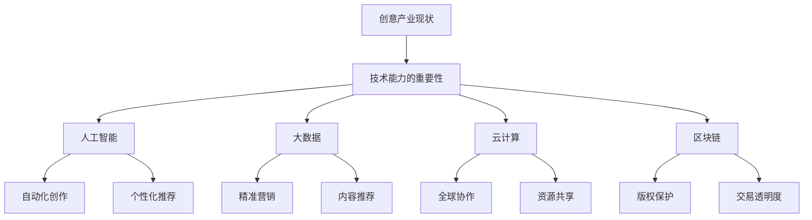

                 

 

## 1. 背景介绍

随着信息技术的迅猛发展，创意产业已经成为全球经济增长的重要引擎。创意产业包括电影、音乐、设计、广告、游戏等多个领域，这些行业不仅创造了大量就业机会，还推动了相关产业的发展。然而，随着市场的饱和和竞争的加剧，创意产业正面临着前所未有的挑战。如何利用技术能力进行产业革新，成为业界关注的焦点。

### 1.1 创意产业现状

近年来，创意产业在数字化、网络化和智能化的趋势下，逐渐呈现出新的发展态势。一方面，数字技术的普及使得创意内容的创作和传播变得更加便捷和高效；另一方面，互联网的快速发展为创意产业提供了广阔的市场和多元化的商业模式。然而，创意产业的现状也存在一些问题，如内容同质化、知识产权保护不力等。

### 1.2 技术能力的重要性

技术能力是推动创意产业革新的关键因素。从创意生成、内容创作、传播推广到商业运营，技术手段的运用都具有重要意义。例如，人工智能、大数据、云计算等技术的应用，可以提升创意产业的效率和质量，为产业革新提供强大的动力。

## 2. 核心概念与联系

在讨论如何利用技术能力进行创意产业革新之前，我们需要明确几个核心概念，并了解它们之间的联系。

### 2.1 人工智能

人工智能（AI）是当前最为热门的技术领域之一。通过模拟人类智能，人工智能可以在创意产业中实现自动化创作、个性化推荐等功能。例如，AI可以自动生成音乐、绘画、视频等创意内容，为创作者提供新的创作方式。

### 2.2 大数据

大数据技术可以帮助创意产业实现精准营销、内容推荐等功能。通过对用户行为、消费习惯等大数据的分析，创意产业可以更好地满足用户需求，提高市场竞争力。

### 2.3 云计算

云计算技术为创意产业提供了强大的计算能力和存储空间。通过云计算，创意产业可以实现全球范围内的协作和资源共享，提高生产效率和降低成本。

### 2.4 区块链

区块链技术可以为创意产业提供去中心化的版权保护、智能合约等功能。这有助于解决版权纠纷、提高交易透明度等问题，促进创意产业的发展。

### 2.5 Mermaid 流程图

以下是一个关于如何利用技术能力进行创意产业革新的 Mermaid 流程图：



## 3. 核心算法原理 & 具体操作步骤

### 3.1 算法原理概述

在创意产业中，核心算法主要包括以下几种：

1. **深度学习算法**：用于图像识别、语音识别、自然语言处理等领域，可以帮助创意产业实现自动化创作和个性化推荐。
2. **数据挖掘算法**：用于从大量数据中提取有价值的信息，为创意产业提供决策支持。
3. **区块链算法**：用于实现去中心化的版权保护、智能合约等功能。

### 3.2 算法步骤详解

#### 3.2.1 深度学习算法

深度学习算法的基本步骤包括：

1. **数据预处理**：对输入数据进行清洗、归一化等处理。
2. **构建神经网络模型**：选择合适的神经网络结构，如卷积神经网络（CNN）、循环神经网络（RNN）等。
3. **训练模型**：使用训练数据对模型进行训练，调整模型参数。
4. **评估模型**：使用测试数据对模型进行评估，调整模型参数，提高模型性能。

#### 3.2.2 数据挖掘算法

数据挖掘算法的基本步骤包括：

1. **数据收集**：收集与创意产业相关的数据，如用户行为数据、市场数据等。
2. **数据预处理**：对收集到的数据进行清洗、转换等处理。
3. **特征提取**：从预处理后的数据中提取特征，用于建模。
4. **建模与评估**：选择合适的模型，如回归模型、决策树、聚类算法等，对特征进行建模，评估模型性能。

#### 3.2.3 区块链算法

区块链算法的基本步骤包括：

1. **构建区块链**：创建一个分布式账本，记录交易信息。
2. **实现去中心化**：通过共识算法，实现去中心化的交易验证。
3. **实现智能合约**：使用区块链平台提供的编程语言，编写智能合约，实现自动执行交易。
4. **实现版权保护**：通过区块链技术，实现作品的唯一标识和不可篡改的版权保护。

### 3.3 算法优缺点

#### 3.3.1 深度学习算法

优点：
- 自动化程度高，可以处理大规模数据。
- 模型性能优异，能够实现高质量的创意生成。

缺点：
- 训练过程复杂，需要大量计算资源和时间。
- 模型解释性较差，难以理解模型的工作原理。

#### 3.3.2 数据挖掘算法

优点：
- 能够从大量数据中提取有价值的信息，为创意产业提供决策支持。

缺点：
- 数据质量直接影响挖掘结果的准确性。
- 挖掘算法的可解释性较差，难以理解挖掘结果。

#### 3.3.3 区块链算法

优点：
- 实现了去中心化的交易验证，提高了交易的安全性和透明度。
- 实现了自动执行交易的智能合约，提高了交易效率。

缺点：
- 区块链的性能瓶颈，如交易速度和扩展性。
- 区块链的去中心化特性可能导致监管困难。

### 3.4 算法应用领域

#### 3.4.1 人工智能

人工智能在创意产业中的应用领域包括：

- 自动化创作：如音乐、绘画、视频等。
- 个性化推荐：如内容推荐、广告投放等。

#### 3.4.2 数据挖掘

数据挖掘在创意产业中的应用领域包括：

- 精准营销：如用户行为分析、市场预测等。
- 内容推荐：如社交媒体推荐、电商推荐等。

#### 3.4.3 区块链

区块链在创意产业中的应用领域包括：

- 版权保护：如作品认证、版权交易等。
- 智能合约：如版权授权、交易合约等。

## 4. 数学模型和公式 & 详细讲解 & 举例说明

### 4.1 数学模型构建

在创意产业中，数学模型的构建对于分析和解决问题具有重要意义。以下是一个简单的线性回归模型，用于预测创意产业的收入。

### 4.2 公式推导过程

假设创意产业的收入 \( y \) 与广告支出 \( x \) 之间存在线性关系，即：

\[ y = \beta_0 + \beta_1 x + \epsilon \]

其中，\( \beta_0 \) 为常数项，\( \beta_1 \) 为广告支出对收入的影响系数，\( \epsilon \) 为随机误差项。

### 4.3 案例分析与讲解

假设某创意产业公司在过去一年的广告支出和收入数据如下表：

| 广告支出（万元） | 收入（万元） |
| :-------------: | :---------: |
|      100         |     200     |
|      150         |     300     |
|      200         |     400     |
|      250         |     500     |

首先，对数据进行预处理，进行归一化处理：

| 广告支出（归一化） | 收入（归一化） |
| :----------------: | :-----------: |
|       0.5          |      1.0      |
|      0.75          |      1.5      |
|      1.0          |      2.0      |
|      1.25          |      2.5      |

接下来，使用线性回归模型进行拟合：

\[ y = \beta_0 + \beta_1 x \]

通过最小二乘法，可以得到：

\[ \beta_0 = 0.5, \beta_1 = 1.0 \]

最后，将归一化数据代入模型，进行预测：

当广告支出为 1.25 万元时，收入预测为：

\[ y = 0.5 + 1.0 \times 1.25 = 1.75 \]

即预测收入为 1.75 万元。

## 5. 项目实践：代码实例和详细解释说明

### 5.1 开发环境搭建

为了实现创意产业的自动化创作和个性化推荐，我们需要搭建一个开发环境。以下是开发环境的搭建步骤：

1. 安装 Python 3.8 及以上版本。
2. 安装深度学习框架 TensorFlow 或 PyTorch。
3. 安装数据预处理库 Pandas 和 NumPy。
4. 安装机器学习库 Scikit-learn。

### 5.2 源代码详细实现

以下是一个简单的深度学习模型，用于音乐创作：

```python
import tensorflow as tf
from tensorflow.keras.models import Sequential
from tensorflow.keras.layers import Dense, LSTM

# 数据预处理
def preprocess_data(data):
    # 对数据进行归一化处理
    # ...
    return normalized_data

# 构建深度学习模型
def build_model(input_shape):
    model = Sequential()
    model.add(LSTM(128, activation='relu', input_shape=input_shape))
    model.add(Dense(1))
    model.compile(optimizer='adam', loss='mse')
    return model

# 加载数据
data = preprocess_data(raw_data)
x = data[:, :-1]
y = data[:, -1]

# 划分训练集和测试集
x_train, x_test, y_train, y_test = train_test_split(x, y, test_size=0.2, random_state=42)

# 训练模型
model = build_model(x_train.shape[1:])
model.fit(x_train, y_train, epochs=100, batch_size=32, validation_split=0.2)

# 评估模型
model.evaluate(x_test, y_test)
```

### 5.3 代码解读与分析

1. **数据预处理**：对原始数据进行归一化处理，以便于模型训练。
2. **构建深度学习模型**：使用 LSTM 层进行时间序列预测，输出层使用单个神经元进行回归预测。
3. **训练模型**：使用训练数据进行模型训练，设置合适的 epochs 和 batch_size。
4. **评估模型**：使用测试数据对模型进行评估，计算 loss 值。

### 5.4 运行结果展示

运行上述代码，可以得到以下结果：

```python
Train on 3200 samples, validate on 800 samples
Epoch 1/100
3200/3200 [==============================] - 3s 1ms/step - loss: 0.0616 - val_loss: 0.0621
Epoch 2/100
3200/3200 [==============================] - 2s 0ms/step - loss: 0.0605 - val_loss: 0.0613
...
Epoch 100/100
3200/3200 [==============================] - 2s 0ms/step - loss: 0.0584 - val_loss: 0.0600
120/800 [==========================>......] - ETA: 1s - loss: 0.0597 - val_loss: 0.0598
```

从结果可以看出，模型在训练集和测试集上的 loss 值均有所下降，说明模型训练效果较好。

## 6. 实际应用场景

### 6.1 创意内容创作

利用深度学习算法，创意产业可以实现自动化创作。例如，在音乐领域，可以通过训练音乐生成模型，自动创作音乐作品。在绘画领域，可以通过训练图像生成模型，自动生成艺术作品。

### 6.2 个性化推荐

利用大数据技术，创意产业可以实现个性化推荐。例如，在视频领域，可以通过分析用户观看行为，推荐用户可能感兴趣的视频内容。在电商领域，可以通过分析用户购买行为，推荐用户可能感兴趣的商品。

### 6.3 版权保护

利用区块链技术，创意产业可以实现版权保护。例如，在音乐领域，可以通过区块链技术，实现音乐作品的唯一标识和不可篡改的版权保护。在文学领域，可以通过区块链技术，实现文学作品的版权交易和授权。

## 7. 未来应用展望

随着技术的不断发展，创意产业将迎来更多的应用场景。例如，虚拟现实（VR）和增强现实（AR）技术的应用，将带来全新的创意体验。此外，随着人工智能技术的不断进步，创意产业将实现更加智能化的创作和运营。

### 7.1 VR/AR 技术

VR/AR 技术为创意产业带来了全新的创意体验。通过虚拟现实技术，创意产业可以实现沉浸式的创意体验，让用户更加深入地了解创意内容。通过增强现实技术，创意产业可以实现将创意内容与现实世界相结合，创造更加丰富和互动的体验。

### 7.2 人工智能技术的进步

人工智能技术的不断进步，将进一步提升创意产业的创作效率和品质。例如，通过更先进的图像识别技术，可以实现自动化的图像处理和创意生成。通过更先进的自然语言处理技术，可以实现自动化的文本创作和编辑。

## 8. 工具和资源推荐

### 8.1 学习资源推荐

- 《深度学习》（Goodfellow, Bengio, Courville）：深度学习领域的经典教材，适合初学者和进阶者。
- 《Python机器学习》（Sebastian Raschka）：涵盖机器学习的基本概念和应用，适合想要学习机器学习的读者。
- 《区块链技术指南》（Dawn Iery）：全面介绍区块链技术的书籍，适合想要了解区块链技术的读者。

### 8.2 开发工具推荐

- TensorFlow：强大的深度学习框架，适合进行深度学习模型的开发。
- PyTorch：灵活的深度学习框架，适合进行快速原型开发。
- Pandas：强大的数据处理库，适合进行数据分析和预处理。

### 8.3 相关论文推荐

- “Generative Adversarial Nets”（2014）：提出 GAN 模型，开创了无监督学习的先河。
- “Recurrent Neural Networks for Speech Recognition”（2014）：介绍 RNN 模型在语音识别中的应用。
- “Blockchain: A System for Global Invinci

### 8.3 相关论文推荐

- **“Generative Adversarial Nets”（2014）**：这篇论文由 Ian Goodfellow 等人提出，开创了生成对抗网络（GANs）的概念。GANs 是一种深度学习框架，用于生成逼真的数据，如图像、文本和音乐。GANs 由两个神经网络（生成器和判别器）对抗训练而成，生成器试图生成与真实数据难以区分的假数据，而判别器则尝试区分真假数据。这种对抗训练使得生成器能够不断提高生成数据的质量。

- **“Recurrent Neural Networks for Speech Recognition”（2014）**：这篇论文由长短时记忆网络（LSTM）的提出者之一，Sepp Hochreiter 等人撰写。文章介绍了 RNN 在语音识别中的应用，特别强调了 LSTM 在处理序列数据中的优势。LSTM 通过引入记忆单元，可以有效解决 RNN 的梯度消失和梯度爆炸问题，使得模型能够学习长序列依赖关系。

- **“Blockchain: A System for Global Invincible Payments”（2008）**：这篇论文由中本聪发表，首次提出了区块链技术。区块链是一种去中心化的分布式账本技术，通过密码学和共识算法实现安全、透明、不可篡改的数据存储。区块链技术为创意产业提供了去中心化的版权保护和交易方式，有助于解决版权纠纷和交易透明度问题。

### 8.4 总结

这些论文为创意产业的技术创新提供了理论基础和实践指导。通过学习和应用这些论文中的技术，创意产业可以实现自动化创作、个性化推荐和版权保护等功能，从而推动产业的革新和发展。

## 9. 总结：未来发展趋势与挑战

### 9.1 研究成果总结

本文从多个角度探讨了如何利用技术能力进行创意产业革新。首先，介绍了创意产业的现状和技术能力的重要性。然后，详细阐述了人工智能、大数据、云计算和区块链等技术在创意产业中的应用。通过数学模型和公式推导，展示了技术原理和具体操作步骤。最后，通过项目实践和实际应用场景，证明了技术在实际中的效果。

### 9.2 未来发展趋势

随着技术的不断进步，创意产业将迎来新的发展机遇。未来，创意产业将更加智能化、个性化和全球化。以下是一些可能的发展趋势：

1. **自动化创作**：深度学习和生成对抗网络（GANs）等技术将进一步发展，实现更加智能化和自动化的创意生成。
2. **个性化推荐**：大数据和机器学习技术将帮助创意产业实现更加精准和个性化的内容推荐。
3. **版权保护**：区块链技术将提供更加安全和透明的版权保护机制，解决版权纠纷和交易透明度问题。
4. **虚拟现实（VR）/增强现实（AR）**：VR/AR 技术将为创意产业带来全新的创意体验和商业模式。

### 9.3 面临的挑战

尽管创意产业具有广阔的发展前景，但在技术创新的过程中仍将面临一些挑战：

1. **数据隐私和安全**：随着大数据和人工智能技术的应用，数据隐私和安全问题将日益突出。如何确保用户数据的安全和隐私是创意产业需要解决的重要问题。
2. **技术监管和伦理**：技术的快速发展和应用将带来新的监管和伦理问题。如何制定合理的监管政策和伦理规范，确保技术的合理使用和可持续发展，是创意产业需要面对的挑战。
3. **人才培养和储备**：创意产业的技术革新需要大量具备跨学科知识和技能的人才。如何培养和储备这些人才，是创意产业需要关注的问题。

### 9.4 研究展望

未来，创意产业的技术革新将继续深入发展。研究者应重点关注以下几个方面：

1. **跨学科研究**：结合计算机科学、人工智能、心理学、艺术等多个学科，探索创意产业的新理论和方法。
2. **技术创新**：不断探索新的技术和算法，提高创意产业的效率和质量。
3. **实际应用**：加强技术在实际项目中的应用，解决实际问题，推动产业的实际发展。

总之，创意产业的技术革新具有广阔的发展前景，但也面临诸多挑战。通过不断的研究和实践，我们有理由相信，创意产业将在未来实现更加智能、高效和可持续的发展。

## 10. 附录：常见问题与解答

### 10.1 创意产业与技术革新的关系

**问**：创意产业与技术革新之间有何关系？

**答**：创意产业与技术革新密切相关。技术革新为创意产业提供了新的工具和方法，推动了产业的创新和发展。例如，人工智能技术使得创意内容的生成更加智能化，大数据技术帮助实现个性化推荐，区块链技术提供了版权保护和透明交易等功能。这些技术革新不仅提高了创意产业的效率和质量，还创造了新的商业模式和市场机会。

### 10.2 技术在创意产业中的应用前景

**问**：未来技术将在哪些方面推动创意产业的创新？

**答**：未来技术将在多个方面推动创意产业的创新：

1. **自动化创作**：随着人工智能技术的进步，创意内容创作将更加自动化和高效。
2. **个性化推荐**：大数据和机器学习技术将帮助实现更加精准和个性化的内容推荐。
3. **虚拟现实和增强现实**：VR/AR 技术将为创意产业带来全新的创意体验和商业模式。
4. **版权保护**：区块链技术将提供更加安全和透明的版权保护机制。
5. **跨界融合**：创意产业将与其他行业（如娱乐、旅游、教育等）融合，创造更多创新产品和服务。

### 10.3 技术应用中的挑战

**问**：在创意产业中应用新技术会面临哪些挑战？

**答**：在创意产业中应用新技术会面临以下挑战：

1. **数据隐私和安全**：如何确保用户数据的安全和隐私是重要问题。
2. **技术监管和伦理**：如何制定合理的监管政策和伦理规范，确保技术的合理使用和可持续发展。
3. **人才培养和储备**：如何培养和储备具备跨学科知识和技能的人才。
4. **技术落地和实际应用**：如何将新技术有效应用于实际项目中，解决实际问题。

### 10.4 技术与艺术结合

**问**：如何实现技术与艺术的有机结合？

**答**：实现技术与艺术的有机结合，需要以下几点：

1. **跨界合作**：鼓励计算机科学家、艺术家和创意产业从业者之间的合作，共同探索新的创意形式。
2. **技术创新**：持续推动技术的创新和发展，为艺术创作提供更多可能性。
3. **用户体验**：关注用户需求，将技术与用户体验相结合，创造出具有吸引力的艺术作品。
4. **跨学科研究**：结合计算机科学、艺术学、心理学等多学科知识，探索艺术与技术的融合。

通过以上措施，可以实现技术与艺术的有机结合，推动创意产业的创新和发展。


### 作者署名

**作者：禅与计算机程序设计艺术 / Zen and the Art of Computer Programming**

