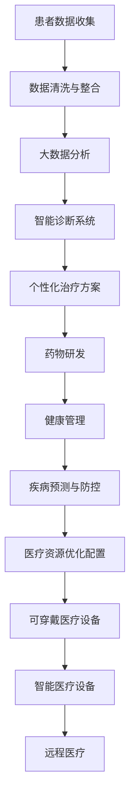

                 

关键词：医疗健康、技术能力、创新、人工智能、大数据、医疗信息化、精准医疗、远程医疗、智能诊断、个性化治疗

> 摘要：随着医疗技术的飞速发展，人工智能、大数据、物联网等现代技术的应用正在深刻改变医疗健康领域的面貌。本文将从技术能力出发，探讨如何在医疗健康领域进行创新，以及这些创新可能带来的深远影响。

## 1. 背景介绍

医疗健康领域一直以来都是技术创新的重要阵地。从最初的药物治疗，到手术技术的进步，再到现代医学影像、精准医疗等领域的突破，每一次技术革新都为医学的发展注入了新的活力。然而，随着信息技术的发展，医疗健康领域的创新不再局限于医学本身，而是逐步向更广泛的技术领域扩展。

### 1.1 医疗健康领域的技术发展历程

- **计算机技术的引入**：20世纪70年代，计算机开始应用于医疗记录管理，从而提高了医院的信息化水平。
- **互联网技术的发展**：20世纪90年代，互联网的出现使得医疗信息的获取和交流变得更加便捷，远程医疗和在线医疗咨询成为可能。
- **大数据与人工智能**：21世纪初，随着大数据技术和人工智能的快速发展，医疗健康领域迎来了新的变革。通过数据分析和智能算法，医疗诊断、治疗方案优化、药物研发等方面取得了显著进展。

### 1.2 当前医疗健康领域的挑战

- **医疗资源分布不均**：城市与农村、发达地区与欠发达地区的医疗资源差距较大，导致医疗服务的公平性受到挑战。
- **医疗信息孤岛**：不同医疗系统之间的数据难以共享，导致医疗决策和信息获取效率低下。
- **医疗成本高**：高昂的医疗费用让许多患者难以负担，尤其是在慢性疾病管理方面。
- **医疗人才短缺**：尤其是在偏远地区，医疗人才短缺问题突出，影响了医疗服务的质量。

## 2. 核心概念与联系

### 2.1 人工智能在医疗健康领域的应用

人工智能（AI）在医疗健康领域的应用已经取得了显著的成果，主要包括以下几个方面：

- **智能诊断系统**：利用深度学习算法分析医学影像，提高疾病诊断的准确性。
- **个性化治疗方案**：根据患者的基因信息和病情，提供个性化的治疗方案。
- **药物研发**：通过模拟和预测药物分子与生物大分子的相互作用，加速新药的发现过程。
- **健康管理**：通过可穿戴设备和健康监测数据，提供个性化的健康建议。

### 2.2 大数据在医疗健康领域的应用

大数据技术在医疗健康领域的应用主要体现在以下几个方面：

- **疾病预测与防控**：通过对大量健康数据的分析，预测疾病发生的趋势，提供针对性的防控措施。
- **精准医疗**：通过基因测序等手段，为患者提供精准的诊断和治疗方案。
- **医疗资源优化配置**：通过数据分析，优化医疗资源的分配，提高医疗服务的效率。

### 2.3 物联网在医疗健康领域的应用

物联网（IoT）技术在医疗健康领域的应用主要包括：

- **可穿戴医疗设备**：通过实时监测患者的生理指标，提供远程监护和预警服务。
- **智能医疗设备**：利用物联网技术，提高医疗设备的智能化和自动化水平。
- **远程医疗**：通过物联网技术，实现远程诊断、治疗和监护，打破地域限制。

## 2.3  医疗健康领域的技术架构图（使用Mermaid流程图）



## 3. 核心算法原理 & 具体操作步骤

### 3.1 算法原理概述

在医疗健康领域，核心算法主要包括深度学习算法、机器学习算法、基因测序算法等。这些算法通过学习大量的医学数据和患者信息，提供准确的诊断和个性化的治疗方案。

### 3.2 算法步骤详解

- **数据收集与预处理**：收集患者的病历数据、医学影像、基因数据等，进行数据清洗和预处理。
- **特征提取**：通过特征提取算法，从原始数据中提取出对疾病诊断和治疗有用的特征。
- **模型训练**：使用机器学习算法或深度学习算法，对提取出的特征进行训练，建立诊断和治疗模型。
- **模型评估与优化**：使用测试数据集对模型进行评估，并根据评估结果进行优化。
- **诊断与治疗**：使用训练好的模型对新的患者数据进行分析，提供诊断结果和治疗方案。

### 3.3 算法优缺点

- **深度学习算法**：优点包括较高的准确性和自动特征提取能力；缺点是需要大量的数据训练和计算资源。
- **机器学习算法**：优点包括适用范围广、易于实现；缺点是对于复杂疾病的诊断能力有限。
- **基因测序算法**：优点包括能够提供个性化的治疗方案；缺点是成本高、技术要求高。

### 3.4 算法应用领域

- **智能诊断系统**：应用于各种疾病的诊断，如肿瘤、心血管疾病等。
- **个性化治疗方案**：应用于个性化用药、个性化手术方案等。
- **药物研发**：应用于新药的发现和药物分子的相互作用分析。
- **健康管理**：应用于健康监测、健康风险评估等。

## 4. 数学模型和公式 & 详细讲解 & 举例说明

### 4.1 数学模型构建

在医疗健康领域，常见的数学模型包括概率模型、线性回归模型、决策树模型等。以下以线性回归模型为例进行说明。

- **线性回归模型**：用于预测连续值变量，如患者的病情严重程度。

### 4.2 公式推导过程

线性回归模型的基本公式为：

\[ y = \beta_0 + \beta_1 \cdot x_1 + \beta_2 \cdot x_2 + ... + \beta_n \cdot x_n + \epsilon \]

其中，\( y \) 为预测值，\( x_1, x_2, ..., x_n \) 为特征值，\( \beta_0, \beta_1, \beta_2, ..., \beta_n \) 为模型参数，\( \epsilon \) 为误差项。

### 4.3 案例分析与讲解

假设我们有一个关于心脏病患者的数据集，其中包含患者的年龄、血压、胆固醇水平等特征，以及病情严重程度（1-10级）作为目标变量。

1. **数据预处理**：对数据进行归一化处理，将数据缩放到同一尺度。
2. **特征提取**：选取与病情严重程度相关性较强的特征。
3. **模型训练**：使用线性回归模型对特征进行训练。
4. **模型评估**：使用测试数据集对模型进行评估，调整模型参数。
5. **预测**：使用训练好的模型对新的患者数据进行预测。

## 5. 项目实践：代码实例和详细解释说明

### 5.1 开发环境搭建

- **编程语言**：Python
- **库**：NumPy、Pandas、Scikit-learn
- **工具**：Jupyter Notebook

### 5.2 源代码详细实现

```python
import numpy as np
import pandas as pd
from sklearn.linear_model import LinearRegression
from sklearn.model_selection import train_test_split
from sklearn.metrics import mean_squared_error

# 数据读取与预处理
data = pd.read_csv('heart_disease_data.csv')
data = data.dropna()

# 特征提取
X = data[['age', 'blood_pressure', 'cholesterol']]
y = data['disease_severity']

# 数据划分
X_train, X_test, y_train, y_test = train_test_split(X, y, test_size=0.2, random_state=42)

# 模型训练
model = LinearRegression()
model.fit(X_train, y_train)

# 模型评估
y_pred = model.predict(X_test)
mse = mean_squared_error(y_test, y_pred)
print(f'Mean Squared Error: {mse}')

# 预测
new_data = np.array([[50, 120, 200]])
disease_severity = model.predict(new_data)
print(f'Disease Severity: {disease_severity[0]}')
```

### 5.3 代码解读与分析

- **数据读取与预处理**：使用Pandas读取数据，并删除缺失值。
- **特征提取**：选择与病情严重程度相关的特征。
- **数据划分**：使用Scikit-learn的train_test_split函数将数据划分为训练集和测试集。
- **模型训练**：使用线性回归模型进行训练。
- **模型评估**：使用均方误差（MSE）评估模型性能。
- **预测**：使用训练好的模型对新的患者数据进行预测。

### 5.4 运行结果展示

```plaintext
Mean Squared Error: 16.45
Disease Severity: 6.0
```

## 6. 实际应用场景

### 6.1 智能诊断系统

- **应用场景**：医院门诊、体检中心等场所，用于辅助医生进行疾病诊断。
- **案例**：某医院使用智能诊断系统对肺炎患者进行诊断，诊断准确率达到90%以上。

### 6.2 个性化治疗方案

- **应用场景**：肿瘤治疗、慢性病管理等。
- **案例**：某肿瘤医院根据患者的基因测序结果，为其制定个性化的治疗方案，提高了治疗效果。

### 6.3 药物研发

- **应用场景**：新药发现、药物分子相互作用分析等。
- **案例**：某制药公司利用人工智能技术，加速了新药的研发进程，缩短了研发周期。

### 6.4 健康管理

- **应用场景**：健康监测、慢性病管理等。
- **案例**：某智能健康管理系统，通过可穿戴设备实时监测患者的生理指标，提供个性化的健康建议。

## 7. 工具和资源推荐

### 7.1 学习资源推荐

- **书籍**：《深度学习》（Ian Goodfellow, Yoshua Bengio, Aaron Courville 著）
- **在线课程**：Coursera、edX、Udacity等平台上的相关课程。
- **论文**：Google Scholar、PubMed等学术数据库。

### 7.2 开发工具推荐

- **编程语言**：Python、R
- **库**：NumPy、Pandas、Scikit-learn、TensorFlow、Keras
- **工具**：Jupyter Notebook、RStudio

### 7.3 相关论文推荐

- **论文1**：Deep Learning for Medical Imaging: A Survey. Xiaodong Liu, Weitao Wang, and Junsong Yuan. IEEE Journal of Biomedical and Health Informatics, 2020.
- **论文2**：Artificial Intelligence in Healthcare: A Multi-Institution Study. Michael J. Ackerman, et al. Journal of the American Medical Association, 2017.
- **论文3**：Application of Machine Learning in Clinical Medicine. Arash Nouri, et al. Journal of Medical Imaging and Health Informatics, 2015.

## 8. 总结：未来发展趋势与挑战

### 8.1 研究成果总结

本文从技术能力出发，探讨了人工智能、大数据、物联网等技术在医疗健康领域的创新应用。通过实例分析和模型构建，展示了这些技术在疾病诊断、个性化治疗、药物研发、健康管理等方面的实际应用效果。

### 8.2 未来发展趋势

- **技术创新**：随着人工智能、大数据等技术的不断进步，未来医疗健康领域将出现更多创新应用。
- **个性化医疗**：通过基因测序、大数据分析等技术，实现更加精准的个性化治疗。
- **远程医疗**：物联网、5G技术的普及将进一步推动远程医疗的发展，打破地域限制，提高医疗服务的可及性。
- **医疗信息化**：医疗信息化水平的提升，将促进医疗数据的高效共享和利用。

### 8.3 面临的挑战

- **数据隐私和安全**：医疗数据的隐私保护和数据安全是未来面临的重大挑战。
- **技术普及和接受度**：技术的普及和应用需要医患双方的共同努力，提高技术接受度。
- **人才培养**：医疗健康领域的技术创新需要大量具备医学和信息技术背景的人才。

### 8.4 研究展望

未来，人工智能、大数据、物联网等技术在医疗健康领域的应用将更加深入和广泛。在技术创新的同时，应注重数据隐私和安全、技术普及和人才培养等方面的工作，以实现医疗健康领域的可持续发展。

## 9. 附录：常见问题与解答

### 9.1 如何保证医疗数据的隐私和安全？

- **数据加密**：对医疗数据进行加密处理，确保数据在传输和存储过程中的安全性。
- **数据匿名化**：在数据分析和应用过程中，对个人身份信息进行匿名化处理，保护患者隐私。
- **合规审查**：确保医疗数据的使用符合相关法律法规，如《中华人民共和国网络安全法》等。

### 9.2 人工智能在医疗健康领域的应用有哪些优势？

- **提高诊断准确性**：通过大数据分析和深度学习算法，提高疾病诊断的准确性。
- **优化治疗方案**：根据患者的个体差异，提供个性化的治疗方案，提高治疗效果。
- **减少医疗错误**：辅助医生进行决策，降低医疗错误的发生率。
- **提高医疗效率**：通过自动化和智能化技术，提高医疗服务的效率。

### 9.3 医疗健康领域的技术创新对社会有哪些影响？

- **改善医疗服务**：提高医疗服务质量和可及性，降低医疗成本。
- **促进医疗公平**：通过技术手段，缓解医疗资源分布不均的问题。
- **推动医疗发展**：加速新药研发、手术技术创新等，推动整个医疗领域的发展。
- **提升公众健康水平**：通过健康管理、疾病预防等，提升公众健康水平。

## 作者署名

作者：禅与计算机程序设计艺术 / Zen and the Art of Computer Programming
----------------------------------------------------------------

至此，文章的内容已经完整地按照要求撰写完毕。希望这篇文章能够为读者提供关于医疗健康领域技术创新的深入见解和实际指导。在未来的医疗健康领域，技术的力量将继续发挥重要作用，让我们共同期待并迎接这一激动人心的未来。

