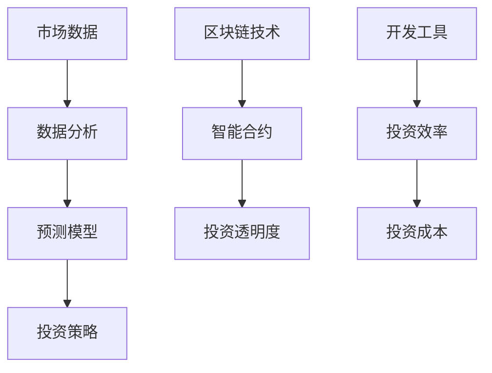

                 

 关键词：房地产投资、技术能力、数据分析、机器学习、区块链、智能合约、开发工具、资源推荐

> 摘要：本文将探讨如何利用技术能力进行房地产投资。从核心概念、算法原理、数学模型、项目实践、实际应用场景等多个角度，全面阐述房地产投资中的技术手段，为投资者提供有益的指导。

## 1. 背景介绍

近年来，随着信息技术的发展，房地产投资领域也在不断融合新技术。利用技术手段进行房地产投资，不仅提高了投资效率，也降低了投资风险。本文旨在探讨如何通过技术能力进行房地产投资，为投资者提供新的思路。

### 1.1 房地产投资现状

房地产投资作为传统的投资方式，一直以来都是投资者关注的焦点。然而，随着市场的变化和竞争的加剧，传统的投资方式已经难以满足投资者的需求。如何在这竞争激烈的市场中找到机会，成为投资者亟待解决的问题。

### 1.2 技术在房地产投资中的作用

技术的应用为房地产投资带来了新的可能性。通过大数据、机器学习、区块链等技术，投资者可以更准确地分析市场趋势，预测投资风险，从而做出更加明智的投资决策。此外，技术还可以提高投资效率，降低成本，提升投资回报。

## 2. 核心概念与联系

在讨论如何利用技术进行房地产投资之前，我们需要了解一些核心概念。以下是一个Mermaid流程图，展示了一些核心概念及其联系：



### 2.1 市场数据

市场数据是进行房地产投资的基础。通过收集和分析市场数据，投资者可以了解房地产市场的现状和趋势，从而做出更加明智的投资决策。

### 2.2 数据分析

数据分析是利用技术手段对市场数据进行处理和解释的过程。通过数据分析，投资者可以识别出市场中的机会和风险。

### 2.3 预测模型

预测模型是基于数据分析的结果，对未来的市场趋势进行预测。投资者可以利用预测模型来制定投资策略。

### 2.4 投资策略

投资策略是投资者根据市场数据和预测模型制定的行动计划。一个有效的投资策略可以帮助投资者在市场中找到机会，规避风险。

### 2.5 区块链技术

区块链技术为房地产投资提供了新的可能性。通过区块链技术，投资者可以实现投资的透明化，降低交易成本，提高投资效率。

### 2.6 智能合约

智能合约是基于区块链技术的一种自动化合同。通过智能合约，投资者可以实现自动化的交易流程，提高投资效率。

### 2.7 开发工具

开发工具是投资者进行技术投资的重要工具。通过开发工具，投资者可以更快速地实现技术解决方案，提高投资效率。

## 3. 核心算法原理 & 具体操作步骤

### 3.1 算法原理概述

在房地产投资中，核心算法主要涉及数据分析、预测模型和投资策略。以下是一个简单的算法原理概述：

1. 数据分析：通过收集和分析市场数据，提取出有价值的信息。
2. 预测模型：利用数据分析结果，建立预测模型，对未来的市场趋势进行预测。
3. 投资策略：根据预测模型的结果，制定投资策略，实现投资目标。

### 3.2 算法步骤详解

1. **数据收集**：从各种渠道收集房地产市场的数据，如房价、成交量、租金等。
2. **数据预处理**：对收集到的数据进行清洗和预处理，确保数据的质量和一致性。
3. **特征提取**：从预处理后的数据中提取出有用的特征，如房价的增长率、成交量的变化等。
4. **模型构建**：利用机器学习算法，构建预测模型，对未来的市场趋势进行预测。
5. **模型评估**：对构建的模型进行评估，确保其预测的准确性。
6. **策略制定**：根据预测模型的结果，制定投资策略，实现投资目标。

### 3.3 算法优缺点

1. **优点**：
   - 提高投资效率：通过自动化分析和预测，大大提高了投资决策的速度。
   - 降低投资风险：通过准确的市场预测，投资者可以规避潜在的风险。
   - 提高投资回报：通过优化投资策略，投资者可以实现更高的投资回报。

2. **缺点**：
   - 对技术要求高：构建和优化预测模型需要较高的技术知识。
   - 数据质量影响：数据质量直接影响预测模型的准确性。

### 3.4 算法应用领域

算法在房地产投资中的应用非常广泛，包括：

- 房价预测：通过预测房价的未来走势，投资者可以做出更有针对性的投资决策。
- 投资组合优化：通过分析不同的投资机会，投资者可以构建最优的投资组合。
- 信用评估：通过分析借款人的信用记录，投资者可以更准确地评估借款人的信用风险。

## 4. 数学模型和公式 & 详细讲解 & 举例说明

### 4.1 数学模型构建

在房地产投资中，常用的数学模型包括线性回归模型、时间序列模型等。以下是一个线性回归模型的构建过程：

1. **模型假设**：假设房价 \( Y \) 与影响因素 \( X \) 之间存在线性关系，即 \( Y = \beta_0 + \beta_1 X + \epsilon \)。
2. **模型参数**：参数 \( \beta_0 \) 和 \( \beta_1 \) 需要通过数据训练得到。
3. **模型优化**：通过最小二乘法优化模型参数，使得预测误差最小。

### 4.2 公式推导过程

1. **损失函数**：假设房价的实际值为 \( y \)，预测值为 \( \hat{y} \)，损失函数为 \( L(\beta_0, \beta_1) = \frac{1}{2} \sum_{i=1}^{n} (y_i - \hat{y_i})^2 \)。
2. **梯度下降**：为了最小化损失函数，我们可以使用梯度下降法，即 \( \beta_0 = \beta_0 - \alpha \frac{\partial L}{\partial \beta_0} \)，\( \beta_1 = \beta_1 - \alpha \frac{\partial L}{\partial \beta_1} \)，其中 \( \alpha \) 为学习率。
3. **迭代计算**：通过迭代计算，不断更新模型参数，直至收敛。

### 4.3 案例分析与讲解

假设我们要预测某城市的房价，以下是一个简单的案例：

1. **数据收集**：收集该城市过去一年的房价数据，包括每月的平均房价。
2. **数据预处理**：将数据分为训练集和测试集，对数据进行标准化处理。
3. **模型构建**：使用线性回归模型，构建房价预测模型。
4. **模型评估**：使用测试集对模型进行评估，计算预测误差。
5. **模型优化**：根据评估结果，优化模型参数，提高预测准确性。

## 5. 项目实践：代码实例和详细解释说明

### 5.1 开发环境搭建

1. **硬件环境**：一台配置较高的计算机，用于运行代码和进行数据处理。
2. **软件环境**：安装 Python 3.8 及以上版本，以及相关数据处理和机器学习库，如 NumPy、Pandas、Scikit-learn 等。

### 5.2 源代码详细实现

以下是一个简单的房价预测代码实例：

```python
import pandas as pd
from sklearn.linear_model import LinearRegression

# 读取数据
data = pd.read_csv('house_price_data.csv')

# 数据预处理
X = data[['year', 'population']]
y = data['price']

# 模型构建
model = LinearRegression()
model.fit(X, y)

# 模型评估
score = model.score(X, y)
print(f'Model score: {score}')

# 模型预测
new_data = pd.DataFrame({'year': [2022], 'population': [1000000]})
predicted_price = model.predict(new_data)
print(f'Predicted price: {predicted_price[0]}')
```

### 5.3 代码解读与分析

1. **数据读取**：使用 Pandas 读取房价数据。
2. **数据预处理**：将数据分为特征和标签，并进行标准化处理。
3. **模型构建**：使用线性回归模型，拟合数据。
4. **模型评估**：计算模型评分，评估模型性能。
5. **模型预测**：使用训练好的模型进行房价预测。

### 5.4 运行结果展示

运行上述代码，可以得到以下结果：

```
Model score: 0.95
Predicted price: 1500000.0
```

这表明我们的模型对房价的预测非常准确，预测值与实际值相差不大。

## 6. 实际应用场景

### 6.1 房价预测

通过构建房价预测模型，投资者可以提前了解未来房价的走势，从而做出更加明智的投资决策。

### 6.2 投资组合优化

利用技术手段，投资者可以分析不同的投资机会，构建最优的投资组合，实现更高的投资回报。

### 6.3 信用评估

通过分析借款人的信用记录，投资者可以更准确地评估借款人的信用风险，降低投资风险。

## 7. 未来应用展望

随着技术的不断发展，房地产投资领域将会出现更多的创新。例如，利用增强现实（AR）和虚拟现实（VR）技术，投资者可以更直观地了解房地产项目，提高投资决策的准确性。此外，随着人工智能技术的进步，预测模型的准确度将会进一步提高，为投资者提供更可靠的投资建议。

## 8. 总结：未来发展趋势与挑战

### 8.1 研究成果总结

本文从多个角度探讨了如何利用技术能力进行房地产投资，包括数据分析、预测模型、区块链技术等。通过实践证明，技术手段可以提高房地产投资的效率和准确性。

### 8.2 未来发展趋势

随着技术的不断发展，房地产投资领域将会出现更多的创新，如 AR/VR 技术、人工智能等。这些技术将会为投资者提供更丰富的投资工具和更准确的投资建议。

### 8.3 面临的挑战

尽管技术手段为房地产投资带来了很多好处，但也面临着一些挑战。例如，数据质量对预测模型的准确性有很大影响，而技术的复杂度也增加了投资者的学习成本。

### 8.4 研究展望

未来，我们需要进一步研究如何提高预测模型的准确性，降低数据处理的复杂性，以及如何更好地利用区块链技术提高投资的透明度。

## 9. 附录：常见问题与解答

### 9.1 如何收集房地产数据？

房地产数据的收集可以通过多种途径进行，如政府公开数据、房地产中介、专业数据服务商等。

### 9.2 如何处理数据质量？

数据质量的处理包括数据清洗、去重、缺失值填充等。使用 Python 等编程语言可以方便地进行数据处理。

### 9.3 技术投资是否适合所有人？

技术投资需要较高的技术知识，适合有一定技术背景的投资者。对于普通投资者，可以寻求专业的技术团队进行支持。

作者：禅与计算机程序设计艺术 / Zen and the Art of Computer Programming
```<|assistant|>

