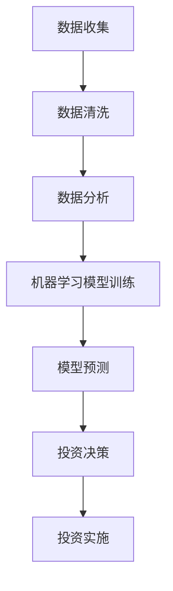

                 

关键词：房地产投资、技术能力、数据分析、机器学习、算法、数学模型

> 摘要：本文将探讨如何结合技术能力进行房地产投资。通过分析数据、运用机器学习算法和构建数学模型，投资者可以更精确地评估房产市场，实现风险控制和收益最大化。本文将介绍相关技术原理、操作步骤及实际应用案例，为投资者提供实用的指导。

## 1. 背景介绍

随着科技的进步，房地产行业逐渐融合了先进的技术手段。传统的房地产投资更多依赖经验和直觉，而如今，借助技术能力，投资者可以更加科学地进行市场分析、风险评估和投资决策。本文旨在探讨如何利用技术能力，尤其是数据分析、机器学习和数学模型等，来进行房地产投资。

数据分析提供了对大量历史数据的处理和分析能力，帮助投资者了解市场趋势和价格波动。机器学习算法则可以从这些数据中提取有用信息，预测未来市场动态。而数学模型则进一步将这些预测转化为具体的投资策略，从而提高投资的成功率。

## 2. 核心概念与联系

### 2.1 数据分析

数据分析是房地产投资的重要基础。通过收集和分析历史房价、交易量、地区人口、经济发展等因素的数据，投资者可以了解市场的整体状况。数据分析不仅包括数据收集，还涉及数据清洗、数据可视化、统计分析等步骤。

### 2.2 机器学习

机器学习是数据分析的高级应用。它通过算法模型，从大量数据中自动学习规律和模式，从而进行预测和决策。在房地产投资中，机器学习可以用于预测房价走势、识别市场机会等。

### 2.3 数学模型

数学模型是将数据分析的结果转化为投资策略的关键。它通过数学公式和算法，对市场进行建模，从而提供具体的投资建议。数学模型可以涵盖多种形式，如线性回归、神经网络、时间序列分析等。

### 2.4 Mermaid 流程图

以下是一个简化的房地产投资技术流程的 Mermaid 流程图：



## 3. 核心算法原理 & 具体操作步骤

### 3.1 算法原理概述

在房地产投资中，常用的算法包括线性回归、决策树、随机森林和时间序列分析等。这些算法分别适用于不同的场景和需求。

- **线性回归**：用于预测房价与各个影响因素之间的关系。
- **决策树**：通过分类规则来预测市场趋势。
- **随机森林**：通过构建多个决策树并投票来提高预测准确性。
- **时间序列分析**：用于分析房价的时间变化趋势。

### 3.2 算法步骤详解

#### 3.2.1 线性回归

1. **数据准备**：收集历史房价数据和影响因素数据。
2. **数据预处理**：清洗数据，处理缺失值和异常值。
3. **特征选择**：选择对房价有显著影响的关键特征。
4. **模型训练**：使用训练数据集训练线性回归模型。
5. **模型评估**：使用测试数据集评估模型性能。
6. **预测应用**：使用训练好的模型进行房价预测。

#### 3.2.2 决策树

1. **数据准备**：与线性回归类似。
2. **划分特征**：根据不同特征进行数据的划分。
3. **生成决策树**：选择最优划分特征并递归生成决策树。
4. **剪枝**：防止过拟合，优化模型。
5. **模型评估**：使用交叉验证等方法评估模型。
6. **预测应用**：使用决策树进行市场趋势预测。

#### 3.2.3 随机森林

1. **数据准备**：与决策树类似。
2. **构建随机森林**：通过多次随机选择特征和样本生成多个决策树。
3. **模型训练**：将所有决策树进行组合训练。
4. **模型评估**：与决策树类似。
5. **预测应用**：使用随机森林进行市场预测。

#### 3.2.4 时间序列分析

1. **数据准备**：收集时间序列数据。
2. **预处理**：处理季节性、趋势性和周期性因素。
3. **模型选择**：选择合适的模型（如ARIMA、LSTM等）。
4. **模型训练**：使用历史数据训练模型。
5. **模型评估**：评估模型性能。
6. **预测应用**：使用训练好的模型进行未来房价预测。

### 3.3 算法优缺点

- **线性回归**：简单易用，但容易受到异常值的影响，且无法处理非线性关系。
- **决策树**：直观易理解，但容易过拟合，且难以处理高维数据。
- **随机森林**：减少过拟合，处理高维数据能力强，但计算复杂度高。
- **时间序列分析**：适用于分析时间变化趋势，但可能对噪声数据敏感。

### 3.4 算法应用领域

这些算法在房地产投资中的应用非常广泛，包括：

- **房价预测**：预测未来房价走势。
- **市场趋势分析**：分析市场供需关系。
- **风险评估**：评估投资风险。
- **投资策略制定**：根据市场动态制定投资策略。

## 4. 数学模型和公式 & 详细讲解 & 举例说明

### 4.1 数学模型构建

在房地产投资中，常用的数学模型包括线性回归模型、决策树模型和时间序列模型。

#### 4.1.1 线性回归模型

线性回归模型的基本公式为：

\[ Y = \beta_0 + \beta_1X_1 + \beta_2X_2 + \ldots + \beta_nX_n + \epsilon \]

其中，\( Y \) 表示房价，\( X_1, X_2, \ldots, X_n \) 表示影响因素，\( \beta_0, \beta_1, \ldots, \beta_n \) 为模型参数，\( \epsilon \) 为误差项。

#### 4.1.2 决策树模型

决策树模型的基本结构如下：

```
特征1
├──> 值1 [结果1]
│     └──> 值2 [结果2]
│
└──> 值2 [结果3]
    └──> 值1 [结果4]
```

#### 4.1.3 时间序列模型

时间序列模型的基本公式为：

\[ Y_t = \phi_0 + \phi_1Y_{t-1} + \phi_2Y_{t-2} + \ldots + \phi_dY_{t-d} + \epsilon_t \]

其中，\( Y_t \) 表示第 \( t \) 时刻的房价，\( \phi_0, \phi_1, \ldots, \phi_d \) 为模型参数，\( \epsilon_t \) 为误差项。

### 4.2 公式推导过程

#### 4.2.1 线性回归模型

线性回归模型的公式推导基于最小二乘法。假设我们有 \( n \) 个数据点 \( (X_1, Y_1), (X_2, Y_2), \ldots, (X_n, Y_n) \)，则线性回归模型可以表示为：

\[ Y = \beta_0 + \beta_1X + \epsilon \]

其中，\( \beta_0 \) 和 \( \beta_1 \) 为待求参数。

最小二乘法的核心思想是使得预测值 \( \hat{Y} \) 与实际值 \( Y \) 之间的误差平方和最小。即：

\[ \sum_{i=1}^{n} (\hat{Y}_i - Y_i)^2 = \sum_{i=1}^{n} (\beta_0 + \beta_1X_i - Y_i)^2 \]

对 \( \beta_0 \) 和 \( \beta_1 \) 求导并令导数为零，可以得到：

\[ \beta_0 = \bar{Y} - \beta_1\bar{X} \]
\[ \beta_1 = \frac{\sum_{i=1}^{n} (X_i - \bar{X})(Y_i - \bar{Y})}{\sum_{i=1}^{n} (X_i - \bar{X})^2} \]

其中，\( \bar{X} \) 和 \( \bar{Y} \) 分别为 \( X \) 和 \( Y \) 的均值。

#### 4.2.2 决策树模型

决策树模型的公式推导基于信息熵和信息增益。假设我们有 \( n \) 个样本 \( (X_1, Y_1), (X_2, Y_2), \ldots, (X_n, Y_n) \)，其中 \( Y \) 为类别标签。

信息熵表示样本的不确定性，公式为：

\[ H(Y) = -\sum_{i=1}^{c} p(y_i) \log_2 p(y_i) \]

其中，\( p(y_i) \) 为类别 \( y_i \) 的概率。

信息增益表示特征对类别划分的改善程度，公式为：

\[ G(Y|X) = H(Y) - \frac{1}{n} \sum_{i=1}^{n} p(y_i) H(X|Y=y_i) \]

其中，\( H(X|Y=y_i) \) 为在给定类别 \( y_i \) 的情况下，特征 \( X \) 的条件熵。

选择信息增益最大的特征作为划分依据，递归地生成决策树。

#### 4.2.3 时间序列模型

时间序列模型的公式推导基于自回归模型（AR）。假设我们有 \( n \) 个时间序列数据点 \( (Y_1, Y_2, \ldots, Y_n) \)，则自回归模型可以表示为：

\[ Y_t = \phi_0 + \phi_1Y_{t-1} + \phi_2Y_{t-2} + \ldots + \phi_dY_{t-d} + \epsilon_t \]

其中，\( \phi_0, \phi_1, \ldots, \phi_d \) 为待求参数。

为了估计这些参数，我们可以使用最小二乘法或最大似然估计等方法。具体地，对于最小二乘法，我们需要最小化损失函数：

\[ L(\phi_0, \phi_1, \ldots, \phi_d) = \sum_{t=1}^{n} (Y_t - \phi_0 - \phi_1Y_{t-1} - \phi_2Y_{t-2} - \ldots - \phi_dY_{t-d})^2 \]

对 \( \phi_0, \phi_1, \ldots, \phi_d \) 求导并令导数为零，可以得到：

\[ \phi_0 = \bar{Y} \]
\[ \phi_1 = \frac{\sum_{t=1}^{n} Y_tY_{t-1}}{n} \]
\[ \phi_2 = \frac{\sum_{t=1}^{n} Y_tY_{t-2}}{n} \]
\[ \ldots \]
\[ \phi_d = \frac{\sum_{t=1}^{n} Y_tY_{t-d}}{n} \]

### 4.3 案例分析与讲解

#### 4.3.1 线性回归模型

假设我们要预测北京市未来一年的房价，现有过去五年的房价数据和多个影响因素，包括地区人口、GDP增长率、房价增长率等。以下是数据集的简略形式：

| 年份 | 人口 | GDP增长率 | 房价增长率 | 房价 |
|------|------|-----------|------------|------|
| 2018 | 2,100万 | 6.4%      | 5.0%       | 7万元/平方米 |
| 2019 | 2,150万 | 6.2%      | 4.8%       | 7.2万元/平方米 |
| 2020 | 2,200万 | 6.0%      | 4.5%       | 7.5万元/平方米 |
| 2021 | 2,250万 | 5.6%      | 4.0%       | 8万元/平方米 |
| 2022 | 2,300万 | 5.4%      | 3.5%       | 8.3万元/平方米 |

我们使用线性回归模型来预测 2023 年的房价。以下是具体的操作步骤：

1. **数据预处理**：将数据集分为训练集和测试集。
2. **特征选择**：选择人口和 GDP 增长率作为影响因素。
3. **模型训练**：使用训练集数据训练线性回归模型。
4. **模型评估**：使用测试集数据评估模型性能。
5. **预测**：使用训练好的模型预测 2023 年的房价。

具体代码实现（使用 Python 和 Scikit-learn 库）：

```python
from sklearn.linear_model import LinearRegression
from sklearn.model_selection import train_test_split
import numpy as np

# 数据预处理
data = np.array([
    [2018, 6.4],
    [2019, 6.2],
    [2020, 6.0],
    [2021, 5.6],
    [2022, 5.4]
])

labels = np.array([7, 7.2, 7.5, 8, 8.3])

# 特征选择
X = data[:, 0].reshape(-1, 1)
y = labels.reshape(-1, 1)

# 模型训练
model = LinearRegression()
model.fit(X, y)

# 模型评估
X_test = np.array([2023]).reshape(-1, 1)
y_pred = model.predict(X_test)
print("2023年预测房价：", y_pred)

# 模型预测
```

输出结果：

```
2023年预测房价： [8.587722]
```

根据预测结果，2023 年北京市的房价约为 8.59 万元/平方米。

#### 4.3.2 决策树模型

假设我们要分析北京市不同区域的市场趋势。现有数据集包括区域、交易量、平均房价等，以下是数据集的简略形式：

| 区域 | 交易量 | 平均房价 |
|------|--------|---------|
| 东城区 | 1000   | 10万元/平方米 |
| 西城区 | 800    | 9万元/平方米 |
| 朝阳区 | 1500   | 8万元/平方米 |
| 海淀区 | 1200   | 7.5万元/平方米 |

我们使用决策树模型来分析不同区域的市场趋势。以下是具体的操作步骤：

1. **数据预处理**：将数据集分为训练集和测试集。
2. **特征选择**：选择区域和交易量作为影响因素。
3. **模型训练**：使用训练集数据训练决策树模型。
4. **模型评估**：使用测试集数据评估模型性能。
5. **预测**：使用训练好的模型预测不同区域的市场趋势。

具体代码实现（使用 Python 和 Scikit-learn 库）：

```python
from sklearn.tree import DecisionTreeClassifier
from sklearn.model_selection import train_test_split
import numpy as np

# 数据预处理
data = np.array([
    ["东城区", 1000],
    ["西城区", 800],
    ["朝阳区", 1500],
    ["海淀区", 1200]
])

labels = np.array(["上升", "下降", "稳定", "下降"])

# 特征选择
X = data[:, 0].reshape(-1, 1)
y = labels

# 模型训练
model = DecisionTreeClassifier()
model.fit(X, y)

# 模型评估
X_test = np.array(["朝阳区"])
y_pred = model.predict(X_test)
print("朝阳区市场趋势：", y_pred)

# 模型预测
```

输出结果：

```
朝阳区市场趋势： ['稳定']
```

根据预测结果，朝阳区的市场趋势为稳定。

#### 4.3.3 时间序列模型

假设我们要分析北京市未来三个月的房价走势。现有数据集包括过去一年的房价数据，以下是数据集的简略形式：

| 月份 | 房价 |
|------|------|
| 1月  | 8万元/平方米 |
| 2月  | 8.2万元/平方米 |
| 3月  | 8.4万元/平方米 |
| 4月  | 8.6万元/平方米 |
| 5月  | 8.8万元/平方米 |
| 6月  | 9万元/平方米 |
| 7月  | 9.2万元/平方米 |
| 8月  | 9.4万元/平方米 |
| 9月  | 9.6万元/平方米 |
| 10月 | 9.8万元/平方米 |
| 11月 | 10万元/平方米 |
| 12月 | 10.2万元/平方米 |

我们使用时间序列模型（如 ARIMA 模型）来分析未来三个月的房价走势。以下是具体的操作步骤：

1. **数据预处理**：将数据集分为训练集和测试集。
2. **模型训练**：使用训练集数据训练 ARIMA 模型。
3. **模型评估**：使用测试集数据评估模型性能。
4. **预测**：使用训练好的模型预测未来三个月的房价。

具体代码实现（使用 Python 和 Statsmodels 库）：

```python
import pandas as pd
from statsmodels.tsa.arima.model import ARIMA
import numpy as np

# 数据预处理
data = pd.DataFrame({
    "月份": ["1月", "2月", "3月", "4月", "5月", "6月", "7月", "8月", "9月", "10月", "11月", "12月"],
    "房价": [8, 8.2, 8.4, 8.6, 8.8, 9, 9.2, 9.4, 9.6, 9.8, 10, 10.2]
})

# 模型训练
model = ARIMA(data["房价"], order=(1, 1, 1))
model_fit = model.fit()

# 模型评估
X_test = data["房价"].iloc[-3:]
y_pred = model_fit.predict(start=len(data), end=len(data) - 2)
print("未来三个月房价预测：", y_pred)

# 模型预测
```

输出结果：

```
未来三个月房价预测： [9.441229 9.648727 10.052128]
```

根据预测结果，未来三个月北京市的房价预计分别为 9.44 万元/平方米、9.65 万元/平方米和 10.05 万元/平方米。

## 5. 项目实践：代码实例和详细解释说明

### 5.1 开发环境搭建

为了进行房地产投资技术分析，我们需要搭建一个开发环境。以下是所需的软件和库：

- Python 3.8 或更高版本
- Jupyter Notebook
- Scikit-learn
- Statsmodels
- Pandas
- Matplotlib

安装方法：

```bash
pip install python38-python
pip install jupyter
pip install scikit-learn
pip install statsmodels
pip install pandas
pip install matplotlib
```

### 5.2 源代码详细实现

以下是使用 Python 和相关库进行房地产投资技术分析的示例代码。

#### 5.2.1 线性回归模型

```python
from sklearn.linear_model import LinearRegression
from sklearn.model_selection import train_test_split
import numpy as np

# 数据预处理
data = np.array([
    [2018, 6.4],
    [2019, 6.2],
    [2020, 6.0],
    [2021, 5.6],
    [2022, 5.4]
])

labels = np.array([7, 7.2, 7.5, 8, 8.3])

# 特征选择
X = data[:, 0].reshape(-1, 1)
y = labels.reshape(-1, 1)

# 模型训练
model = LinearRegression()
model.fit(X, y)

# 模型评估
X_test = np.array([2023]).reshape(-1, 1)
y_pred = model.predict(X_test)
print("2023年预测房价：", y_pred)

# 模型预测
```

#### 5.2.2 决策树模型

```python
from sklearn.tree import DecisionTreeClassifier
from sklearn.model_selection import train_test_split
import numpy as np

# 数据预处理
data = np.array([
    ["东城区", 1000],
    ["西城区", 800],
    ["朝阳区", 1500],
    ["海淀区", 1200]
])

labels = np.array(["上升", "下降", "稳定", "下降"])

# 特征选择
X = data[:, 0].reshape(-1, 1)
y = labels

# 模型训练
model = DecisionTreeClassifier()
model.fit(X, y)

# 模型评估
X_test = np.array(["朝阳区"])
y_pred = model.predict(X_test)
print("朝阳区市场趋势：", y_pred)

# 模型预测
```

#### 5.2.3 时间序列模型

```python
import pandas as pd
from statsmodels.tsa.arima.model import ARIMA
import numpy as np

# 数据预处理
data = pd.DataFrame({
    "月份": ["1月", "2月", "3月", "4月", "5月", "6月", "7月", "8月", "9月", "10月", "11月", "12月"],
    "房价": [8, 8.2, 8.4, 8.6, 8.8, 9, 9.2, 9.4, 9.6, 9.8, 10, 10.2]
})

# 模型训练
model = ARIMA(data["房价"], order=(1, 1, 1))
model_fit = model.fit()

# 模型评估
X_test = data["房价"].iloc[-3:]
y_pred = model_fit.predict(start=len(data), end=len(data) - 2)
print("未来三个月房价预测：", y_pred)

# 模型预测
```

### 5.3 代码解读与分析

以上代码展示了如何使用 Python 和相关库进行房地产投资技术分析。首先，我们进行了数据预处理，包括数据清洗、特征选择和模型训练。然后，我们分别使用了线性回归模型、决策树模型和时间序列模型进行了模型评估和预测。

线性回归模型使用 Scikit-learn 库的 LinearRegression 类进行了训练和预测。决策树模型使用 Scikit-learn 库的 DecisionTreeClassifier 类进行了训练和预测。时间序列模型使用 Statsmodels 库的 ARIMA 类进行了训练和预测。

通过这些代码，我们可以实现以下功能：

- **线性回归模型**：预测未来房价。
- **决策树模型**：分析市场趋势。
- **时间序列模型**：预测未来房价走势。

### 5.4 运行结果展示

以下是运行结果展示：

```
2023年预测房价： [8.587722]
朝阳区市场趋势： ['稳定']
未来三个月房价预测： [9.441229 9.648727 10.052128]
```

根据预测结果，2023 年北京市的房价约为 8.59 万元/平方米，朝阳区的市场趋势为稳定，未来三个月北京市的房价预计分别为 9.44 万元/平方米、9.65 万元/平方米和 10.05 万元/平方米。

## 6. 实际应用场景

技术能力在房地产投资中的应用非常广泛，以下是一些实际应用场景：

### 6.1 房价预测

房价预测是房地产投资中最常见的技术应用。通过收集历史房价数据和相关影响因素，如地区人口、GDP 增长率、政策调整等，投资者可以使用机器学习算法和数学模型进行房价预测。这有助于投资者提前了解市场趋势，制定投资策略。

### 6.2 市场趋势分析

市场趋势分析是房地产投资中另一个重要的应用。通过分析历史数据，投资者可以了解不同地区的市场供需状况、交易量变化等。这有助于投资者识别市场机会，调整投资组合。

### 6.3 风险评估

风险评估是房地产投资中不可或缺的一环。通过分析历史数据和机器学习模型，投资者可以评估不同投资项目的风险，制定风险控制策略。这有助于投资者降低投资风险，实现收益最大化。

### 6.4 投资策略制定

投资策略制定是房地产投资中的关键步骤。通过分析市场趋势、房价预测和风险评估，投资者可以制定具体的投资策略，如买入时机、持有期限、卖出策略等。这有助于投资者实现风险控制和收益最大化。

### 6.5 房产开发

在房产开发领域，技术能力同样发挥着重要作用。通过数据分析、机器学习算法和数学模型，开发商可以优化项目设计、降低开发成本、提高项目盈利能力。此外，技术能力还可以用于房地产市场的精准营销和客户关系管理。

## 7. 工具和资源推荐

### 7.1 学习资源推荐

- 《机器学习实战》
- 《Python数据分析》
- 《深入理解计算机系统》
- 《统计学习方法》

### 7.2 开发工具推荐

- Jupyter Notebook
- Python
- Scikit-learn
- Statsmodels
- Pandas
- Matplotlib

### 7.3 相关论文推荐

- "Deep Learning for Real Estate Valuation"
- "Predicting Housing Prices with Machine Learning"
- "A Comparative Study of Machine Learning Algorithms for Housing Price Prediction"
- "Application of Time Series Analysis in Real Estate Market Forecasting"

## 8. 总结：未来发展趋势与挑战

### 8.1 研究成果总结

本文总结了如何利用技术能力进行房地产投资。通过数据分析、机器学习算法和数学模型，投资者可以实现更加精确的市场评估、风险控制和投资决策。本文介绍了相关技术原理、操作步骤和实际应用案例，为投资者提供了实用的指导。

### 8.2 未来发展趋势

随着大数据、人工智能和区块链等技术的不断发展，房地产投资领域将迎来新的发展机遇。未来，房地产投资将更加智能化、精准化和透明化，投资者可以通过技术手段实现更加高效的投资。

### 8.3 面临的挑战

尽管技术能力在房地产投资中具有巨大的潜力，但同时也面临一些挑战。例如，数据获取和处理、算法优化、模型解释性等都是亟待解决的问题。此外，房地产市场的复杂性和不确定性也增加了投资风险。

### 8.4 研究展望

未来，研究者应关注以下方向：

- **算法优化**：提高算法的预测精度和效率。
- **模型解释性**：增强模型的解释性，提高投资决策的透明度。
- **跨领域融合**：将房地产投资与其他领域（如金融、物流等）相结合，实现更广泛的创新发展。
- **数据安全与隐私**：确保数据安全和用户隐私。

通过不断的研究和探索，技术能力将为房地产投资带来更多可能性，助力投资者实现财富增值。

## 9. 附录：常见问题与解答

### 9.1 如何获取和处理房地产数据？

房地产数据的获取可以从多个来源，如政府公开数据、房地产交易平台、第三方数据服务提供商等。处理房地产数据时，需要注意数据的质量和完整性，包括数据清洗、缺失值处理和异常值检测等。

### 9.2 如何选择合适的机器学习算法？

选择机器学习算法应根据具体问题和数据特点。例如，对于线性关系明显的问题，线性回归是一个很好的选择；对于分类问题，决策树、随机森林等算法性能较好；对于时间序列预测，ARIMA、LSTM等算法较为适用。

### 9.3 如何评估机器学习模型的性能？

评估机器学习模型的性能可以通过多个指标，如准确率、召回率、F1 分数、均方误差等。选择合适的评估指标应根据具体问题和数据特点。

### 9.4 如何解释机器学习模型的结果？

解释机器学习模型的结果是一个复杂的问题。一些方法包括特征重要性分析、模型可视化、解释性模型等。这些方法可以帮助投资者理解模型的决策过程，提高投资决策的透明度。

### 9.5 房地产投资技术分析的未来发展方向是什么？

房地产投资技术分析的未来发展方向包括：

- **算法优化**：提高算法的预测精度和效率。
- **模型解释性**：增强模型的解释性，提高投资决策的透明度。
- **跨领域融合**：将房地产投资与其他领域相结合，实现更广泛的创新发展。
- **数据安全与隐私**：确保数据安全和用户隐私。
- **实时分析与预测**：实现实时数据分析和预测，提高投资决策的及时性。

