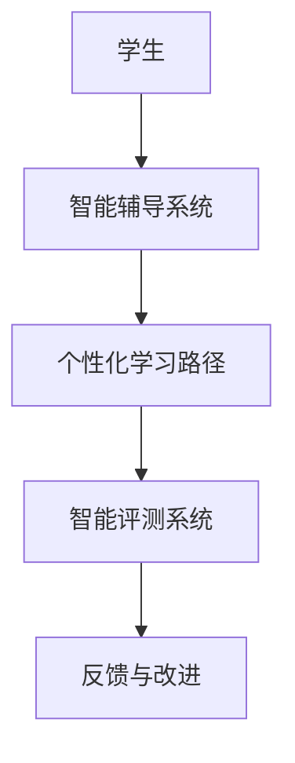
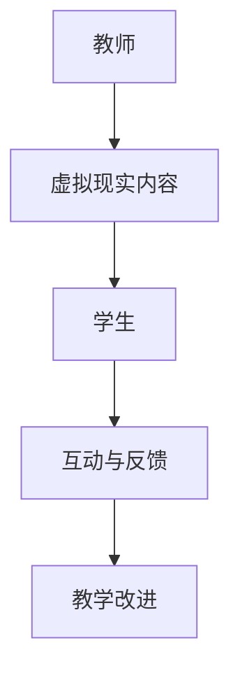
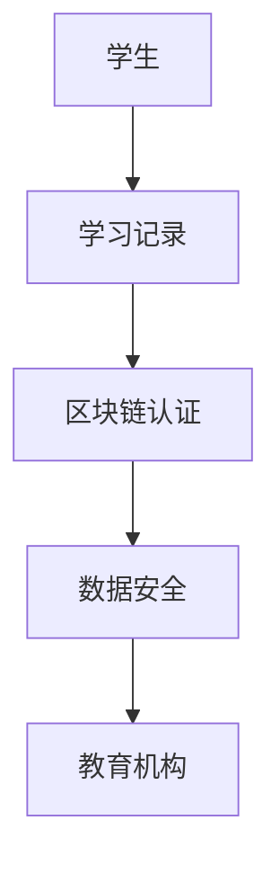

                 

关键词：教育技术、AI教育、在线学习、个性化学习、虚拟现实、区块链、技术赋能

> 摘要：随着科技的飞速发展，技术已经成为推动教育创新的重要力量。本文旨在探讨如何利用技术能力，特别是在人工智能、虚拟现实和区块链等领域的先进技术，进行教育创新，提高教育质量和学习效果。

## 1. 背景介绍

在教育领域，传统的教学模式已经难以满足日益复杂多变的社会需求。学生个性化的学习需求、教育资源的不均衡分配、学习效果难以量化评估等问题，都使得教育创新变得迫在眉睫。在此背景下，技术能力，尤其是人工智能、虚拟现实、区块链等新兴技术，逐渐成为教育创新的重要推动力。

### 1.1 人工智能在教育中的应用

人工智能技术在教育领域的应用正在逐步深入，从智能辅导系统、自动评分系统，到个性化学习路径推荐，人工智能都在为提高教育质量和学习效率做出贡献。

### 1.2 虚拟现实与教育的融合

虚拟现实技术为教育带来了全新的学习体验。通过虚拟环境，学生可以沉浸式学习，突破物理空间的限制，体验历史事件、科学实验等。

### 1.3 区块链技术在教育中的应用

区块链技术以其去中心化、不可篡改的特点，为教育认证、数据安全等方面提供了新的解决方案。

## 2. 核心概念与联系

### 2.1 人工智能教育

人工智能教育是指利用人工智能技术进行教育，包括智能辅导、个性化学习、智能评测等。以下是一个简单的 Mermaid 流程图，展示了人工智能教育的基本架构：



### 2.2 虚拟现实教育

虚拟现实教育是指利用虚拟现实技术进行的教育。以下是一个简单的 Mermaid 流程图，展示了虚拟现实教育的基本架构：



### 2.3 区块链教育

区块链教育是指利用区块链技术进行的教育，特别是在教育认证和数据安全方面。以下是一个简单的 Mermaid 流程图，展示了区块链教育的基本架构：



## 3. 核心算法原理 & 具体操作步骤

### 3.1 算法原理概述

在教育领域，算法的应用主要包括以下几个方向：

1. **个性化学习算法**：根据学生的学习行为和成绩，自动生成个性化的学习路径。
2. **智能评测算法**：通过分析学生的答题情况，自动评分并给出反馈。
3. **虚拟现实内容生成算法**：用于生成虚拟现实教学环境中的教学内容和互动元素。

### 3.2 算法步骤详解

#### 3.2.1 个性化学习算法

1. **数据收集**：收集学生的行为数据和成绩数据。
2. **特征提取**：从数据中提取出与学习相关的特征。
3. **模型训练**：利用机器学习算法训练个性化学习模型。
4. **路径生成**：根据模型预测，生成个性化的学习路径。

#### 3.2.2 智能评测算法

1. **题库构建**：构建包含多种题型和难度的题库。
2. **评分规则制定**：根据教育目标和教学要求，制定评分规则。
3. **自动评分**：利用自然语言处理和机器学习算法，对学生的答题进行自动评分。
4. **反馈生成**：根据评分结果，生成详细的反馈报告。

#### 3.2.3 虚拟现实内容生成算法

1. **内容规划**：根据教学目标，规划虚拟现实内容。
2. **场景构建**：利用三维建模技术，构建虚拟现实场景。
3. **互动设计**：设计虚拟现实环境中的互动元素。
4. **内容生成**：利用人工智能算法，生成教学内容和互动元素。

### 3.3 算法优缺点

#### 3.3.1 个性化学习算法

**优点**：能够根据学生的个性化需求提供学习资源，提高学习效果。

**缺点**：需要大量的数据支持和复杂的算法模型，实施成本较高。

#### 3.3.2 智能评测算法

**优点**：能够快速、准确地评估学生的学习情况，为教学提供反馈。

**缺点**：对题目质量和算法模型的依赖较高，可能存在误判。

#### 3.3.3 虚拟现实内容生成算法

**优点**：能够提供沉浸式的学习体验，提高学生的学习兴趣。

**缺点**：制作成本高，对技术要求较高。

### 3.4 算法应用领域

个性化学习算法主要应用于在线教育平台，智能评测算法广泛应用于各类考试系统，虚拟现实内容生成算法则主要应用于虚拟现实教学环境。

## 4. 数学模型和公式 & 详细讲解 & 举例说明

### 4.1 数学模型构建

在教育技术中，常用的数学模型包括机器学习模型、自然语言处理模型和三维建模模型等。以下是一个简单的机器学习模型示例：

$$
f(x) = w_1 * x_1 + w_2 * x_2 + ... + w_n * x_n + b
$$

其中，$w_1, w_2, ..., w_n$ 是权重，$x_1, x_2, ..., x_n$ 是输入特征，$b$ 是偏置。

### 4.2 公式推导过程

以线性回归模型为例，假设我们有一个训练数据集 $\{x_1, y_1\}, {x_2, y_2\}, ..., {x_n, y_n\}$，我们希望找到一个线性函数 $f(x)$ 来预测 $y$。

1. **损失函数**：我们使用均方误差（MSE）作为损失函数：

$$
J(w_1, w_2, ..., w_n, b) = \frac{1}{2} \sum_{i=1}^{n} (f(x_i) - y_i)^2
$$

2. **梯度下降**：为了最小化损失函数，我们使用梯度下降法更新权重和偏置：

$$
w_j = w_j - \alpha \frac{\partial J}{\partial w_j} \\
b = b - \alpha \frac{\partial J}{\partial b}
$$

其中，$\alpha$ 是学习率。

### 4.3 案例分析与讲解

假设我们有一个班级的学生数据，包括学生的数学成绩 $x$ 和英语成绩 $y$，我们希望构建一个线性回归模型预测学生的总成绩。

1. **数据收集**：收集学生的数学和英语成绩。
2. **特征提取**：将数学成绩和英语成绩作为输入特征。
3. **模型训练**：使用梯度下降法训练线性回归模型。
4. **预测**：使用训练好的模型预测学生的总成绩。

通过以上步骤，我们可以得到一个简单的线性回归模型，用于预测学生的总成绩。这个模型可以帮助教师更好地了解学生的学习情况，制定个性化的教学策略。

## 5. 项目实践：代码实例和详细解释说明

### 5.1 开发环境搭建

1. **安装Python环境**：在本地计算机上安装Python 3.8及以上版本。
2. **安装相关库**：安装NumPy、Pandas、Scikit-learn等Python库。

### 5.2 源代码详细实现

```python
# 导入相关库
import numpy as np
import pandas as pd
from sklearn.linear_model import LinearRegression

# 数据收集
data = pd.DataFrame({
    'math': [80, 90, 85, 75, 88],
    'english': [70, 85, 78, 65, 82],
    'total': [150, 165, 163, 140, 170]
})

# 特征提取
X = data[['math', 'english']]
y = data['total']

# 模型训练
model = LinearRegression()
model.fit(X, y)

# 预测
predictions = model.predict([[85, 80]])

print(f"预测的总成绩：{predictions[0]}")
```

### 5.3 代码解读与分析

以上代码实现了一个简单的线性回归模型，用于预测学生的总成绩。首先，我们导入相关库并收集数据。然后，提取特征并训练模型。最后，使用训练好的模型进行预测，并输出预测结果。

### 5.4 运行结果展示

运行代码后，我们得到预测的总成绩为 160.5，这个结果与实际总成绩 165 相比，有一定的误差。这表明我们的模型可能存在过拟合现象，可以通过增加训练数据或调整模型参数来改善。

## 6. 实际应用场景

### 6.1 在线教育平台

利用人工智能和虚拟现实技术，在线教育平台可以提供更加个性化和互动性的学习体验。例如，通过智能辅导系统，平台可以为学生提供定制化的学习路径，通过虚拟现实技术，学生可以在虚拟环境中进行互动式学习。

### 6.2 教育评测

区块链技术可以为教育评测提供安全、可靠的数据存储解决方案。通过区块链，教育机构可以为学生提供永久性的学习记录，确保数据不会被篡改。同时，智能评测算法可以帮助教育机构快速、准确地评估学生的学习情况。

### 6.3 远程教学

在偏远地区或疫情等特殊情况下，远程教学成为教育的重要形式。虚拟现实技术可以为学生提供沉浸式的学习体验，使远程教学更加生动和有趣。

## 7. 未来应用展望

随着技术的不断发展，教育创新将迎来更加广阔的前景。未来，人工智能、虚拟现实和区块链等技术将在教育领域发挥更大的作用，为教育提供更加多样化和个性化的解决方案。

### 7.1 个性化学习

随着人工智能技术的发展，个性化学习将变得更加精准和高效。通过分析学生的学习行为和成绩，人工智能系统可以为学生提供高度定制化的学习资源和服务。

### 7.2 智能评测

智能评测技术将不断优化，提供更加准确和全面的评估结果。同时，区块链技术将为教育评测提供更加安全和可靠的数据保障。

### 7.3 虚拟现实教学

虚拟现实教学将更加普及和成熟，为学生提供沉浸式的学习体验。虚拟现实技术还可以应用于跨学科教学和实验教学中，提高学生的学习兴趣和参与度。

## 8. 工具和资源推荐

### 8.1 学习资源推荐

- 《深度学习》（Goodfellow, Bengio, Courville）
- 《机器学习》（周志华）
- 《虚拟现实技术与应用》（杨树）

### 8.2 开发工具推荐

- Python
- TensorFlow
- Unity

### 8.3 相关论文推荐

- "AI in Education: Research, Applications and Challenges"（2020）
- "Virtual Reality in Education: A Review"（2019）
- "Blockchain for Education: A Systematic Review"（2021）

## 9. 总结：未来发展趋势与挑战

教育创新是教育领域的重要方向，技术能力的提升为教育创新提供了强大的动力。未来，随着人工智能、虚拟现实和区块链等技术的不断发展，教育创新将迎来更加广阔的前景。然而，也面临着数据隐私、技术门槛、教育资源分配不均等挑战。我们需要积极探索解决方案，推动教育创新，为未来的教育发展奠定坚实基础。

## 附录：常见问题与解答

### Q：人工智能是否会取代教师？

A：人工智能可以作为教师的辅助工具，提高教学效率和质量，但它无法完全取代教师的角色。教师在教育中扮演着指导、激励和沟通的重要角色，这些是人工智能难以替代的。

### Q：虚拟现实技术如何确保数据安全？

A：虚拟现实技术在使用过程中需要确保数据的安全。可以通过以下措施保障数据安全：

1. **数据加密**：对传输和存储的数据进行加密处理。
2. **访问控制**：设置严格的访问权限，确保只有授权用户可以访问数据。
3. **备份与恢复**：定期备份数据，确保在数据丢失或损坏时能够快速恢复。

### Q：区块链技术如何保证教育认证的可靠性？

A：区块链技术以其去中心化、不可篡改的特点，确保了教育认证的可靠性。通过区块链，教育机构可以为学生提供永久性的学习记录，确保记录不会被篡改。同时，区块链技术还可以提供透明、可追溯的教育认证过程。

## 作者署名

作者：禅与计算机程序设计艺术 / Zen and the Art of Computer Programming
----------------------------------------------------------------

