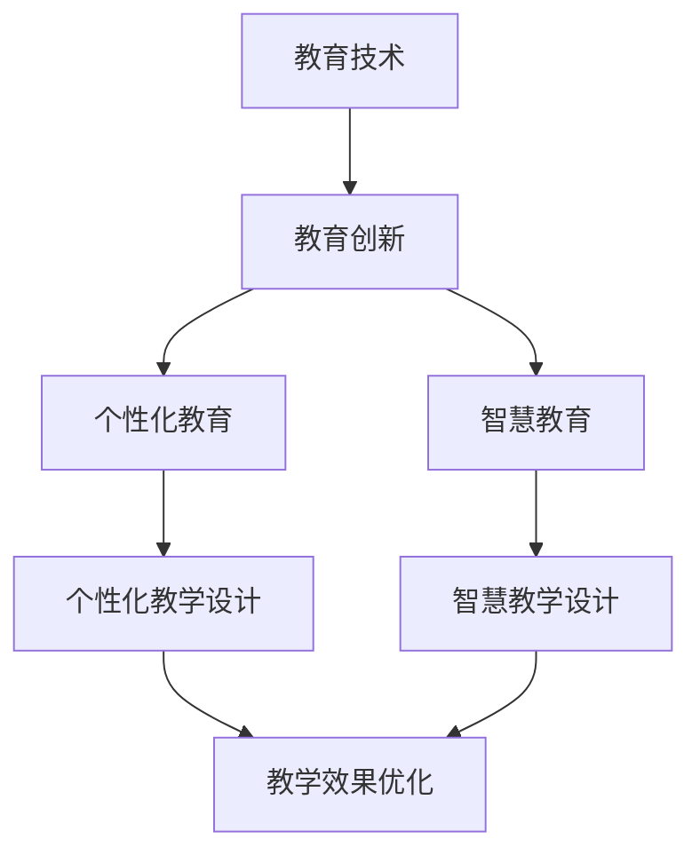

                 

### 1. 背景介绍

教育作为社会发展的重要基石，一直以来都承载着培养未来人才、传承文化知识的重要使命。然而，传统教育模式在信息时代面临着诸多挑战。首先，传统教育模式注重知识传授，而忽视了学生的个性化发展需求；其次，教育资源分配不均，导致城乡、地区间的教育质量差距日益扩大；最后，教育内容更新速度慢，难以跟上科技发展的步伐。

随着互联网、人工智能、大数据等技术的飞速发展，教育领域迎来了新的变革机遇。技术能力的引入不仅能够提升教育质量和效率，还能够推动教育创新，实现个性化教育、智慧教育等目标。本文将围绕如何利用技术能力进行教育创新进行深入探讨。

### 2. 核心概念与联系

#### 2.1 教育技术与教育创新

教育技术是指应用于教学过程中的各种技术和工具，包括互联网、计算机、多媒体、虚拟现实等。教育创新则是指通过引入新技术、新方法，改进教育模式，提高教育质量和效率。

教育技术与教育创新密切相关。教育技术的引入可以为教育创新提供新的工具和方法，促进教育模式的变革。例如，互联网的普及使得在线教育成为可能，大数据和人工智能的应用则为个性化教育提供了技术支持。

#### 2.2 个性化教育与智慧教育

个性化教育是指根据学生的个性特点、学习需求和学习风格，提供个性化的教育服务。智慧教育则是指利用互联网、大数据、人工智能等技术，构建智能化的教育环境和教学模式。

个性化教育和智慧教育是教育创新的重要方向。个性化教育能够满足学生多样化的学习需求，提高学习效果；智慧教育则能够提升教育的智能化水平，实现教育资源的优化配置。

#### 2.3 教育技术与教学设计的融合

教育技术的应用不仅局限于教学过程中，还需要与教学设计相结合。教学设计是指根据教学目标、教学内容、教学对象等因素，设计教学过程和教学方法。

教育技术与教学设计的融合，可以实现教学过程的优化。例如，通过数据分析，教学设计者可以了解学生的学习行为和效果，从而调整教学策略，提高教学效果。

### 3. Mermaid 流程图

以下是一个简单的 Mermaid 流程图，展示了教育技术与教育创新之间的联系。



### 4. 核心算法原理 & 具体操作步骤

#### 4.1 算法原理概述

在教育创新中，核心算法主要包括数据分析算法和机器学习算法。数据分析算法可以用于分析学生的学习行为和学习效果，为个性化教学提供数据支持；机器学习算法则可以用于构建智能化的教育系统和教学模式。

#### 4.2 算法步骤详解

1. 数据收集与预处理
   - 收集学生的学习行为数据，如学习时间、学习内容、考试成绩等。
   - 对数据进行清洗和预处理，去除无效数据，保证数据质量。

2. 数据分析
   - 使用数据分析算法，对收集到的数据进行分析，提取有用的信息。
   - 分析学生的学习行为，如学习习惯、学习效果等。

3. 模型训练
   - 使用机器学习算法，根据分析结果，训练模型。
   - 模型训练的过程是不断调整模型的参数，使其能够更好地预测学生的学习行为和学习效果。

4. 模型应用
   - 将训练好的模型应用于实际教学过程中，根据模型预测结果，调整教学策略。
   - 例如，如果模型预测某位学生的学习效果较差，可以调整教学内容和教学方法，提高学生的学习效果。

#### 4.3 算法优缺点

1. 优点
   - 提高教学效率：通过数据分析和机器学习，可以更好地了解学生的学习状况，从而有针对性地调整教学策略，提高教学效果。
   - 实现个性化教育：根据学生的学习行为和效果，提供个性化的教学内容和教学方法，满足学生的个性化学习需求。

2. 缺点
   - 数据质量要求高：数据分析算法和机器学习算法对数据质量有较高要求，数据质量不高会影响算法的效果。
   - 技术门槛较高：机器学习算法的训练和应用需要一定的技术知识，对于普通教师来说，应用这些技术可能有一定难度。

#### 4.4 算法应用领域

1. 在线教育平台：通过数据分析算法，了解学生的学习行为和学习效果，为用户提供个性化的学习建议。
2. 教育管理平台：通过机器学习算法，预测学生的学习趋势，为教育管理者提供决策支持。
3. 智能辅导系统：通过机器学习算法，为学生提供个性化的学习辅导，提高学习效果。

### 5. 数学模型和公式 & 详细讲解 & 举例说明

#### 5.1 数学模型构建

在教育创新中，常用的数学模型包括回归模型、决策树模型、神经网络模型等。以下以回归模型为例，介绍数学模型的构建过程。

1. 确定变量：选择影响学生学习成绩的关键因素，如学习时间、学习方法、学习频率等。
2. 收集数据：收集学生的相关数据，如学习时间、学习方法、学习频率、考试成绩等。
3. 构建模型：根据收集到的数据，建立回归模型，模型的表达式如下：

   $$ y = \beta_0 + \beta_1 x_1 + \beta_2 x_2 + ... + \beta_n x_n + \epsilon $$

   其中，$y$ 表示学生的学习成绩，$x_1, x_2, ..., x_n$ 表示影响学习成绩的变量，$\beta_0, \beta_1, ..., \beta_n$ 表示模型的参数，$\epsilon$ 表示误差项。

#### 5.2 公式推导过程

回归模型的推导过程如下：

1. 假设学生成绩$y$与变量$x_1, x_2, ..., x_n$之间存在线性关系，即：

   $$ y = \beta_0 + \beta_1 x_1 + \beta_2 x_2 + ... + \beta_n x_n + \epsilon $$

2. 对上式两边同时求导，得到：

   $$ \frac{dy}{dx_1} = \beta_1 + \beta_2 \frac{dx_2}{dx_1} + ... + \beta_n \frac{dx_n}{dx_1} $$
   
   $$ \frac{dy}{dx_2} = \beta_0 + \beta_1 \frac{dx_1}{dx_2} + \beta_2 + ... + \beta_n \frac{dx_n}{dx_2} $$
   
   $$ ... $$
   
   $$ \frac{dy}{dx_n} = \beta_0 + \beta_1 \frac{dx_1}{dx_n} + \beta_2 \frac{dx_2}{dx_n} + ... + \beta_n $$

3. 令$\frac{dx_i}{dx_j} = 0$（$i \neq j$），得到：

   $$ \frac{dy}{dx_1} = \beta_1 $$
   
   $$ \frac{dy}{dx_2} = \beta_2 $$
   
   $$ ... $$
   
   $$ \frac{dy}{dx_n} = \beta_n $$

4. 将上式两边同时积分，得到：

   $$ y = \beta_0 + \beta_1 x_1 + \beta_2 x_2 + ... + \beta_n x_n + C $$

   其中，$C$ 为积分常数。

5. 令$x_1 = x_2 = ... = x_n = 0$，得到：

   $$ y(0) = \beta_0 + C $$

   因此，$\beta_0 = y(0) - C$。

6. 将$\beta_0$代入原式，得到：

   $$ y = y(0) - C + \beta_1 x_1 + \beta_2 x_2 + ... + \beta_n x_n $$

7. 对上式两边同时求导，得到：

   $$ \frac{dy}{dx_1} = \beta_1 $$
   
   $$ \frac{dy}{dx_2} = \beta_2 $$
   
   $$ ... $$
   
   $$ \frac{dy}{dx_n} = \beta_n $$

8. 因此，回归模型的参数$\beta_1, \beta_2, ..., \beta_n$可以通过求解以上方程组得到。

#### 5.3 案例分析与讲解

假设我们收集了一组学生的数据，包括学习时间、学习方法、学习频率和考试成绩。我们希望利用回归模型预测学生的考试成绩。

1. 数据收集：
   - 学习时间（$x_1$）：1小时、2小时、3小时、...、10小时
   - 学习方法（$x_2$）：传统学习方法、互动式学习方法、在线学习方法
   - 学习频率（$x_3$）：每天学习1次、每天学习2次、每天学习3次、...、每天学习5次
   - 考试成绩（$y$）：60分、70分、80分、...、100分

2. 数据预处理：
   - 对学习方法进行编码，例如，传统学习方法编码为1，互动式学习方法编码为2，在线学习方法编码为3。
   - 对学习频率进行编码，例如，每天学习1次编码为1，每天学习2次编码为2，...，每天学习5次编码为5。

3. 构建回归模型：
   - 使用最小二乘法求解回归模型的参数，得到回归模型的表达式：

     $$ y = \beta_0 + \beta_1 x_1 + \beta_2 x_2 + \beta_3 x_3 + \epsilon $$

4. 模型训练：
   - 使用收集到的数据，对回归模型进行训练，得到模型的参数：

     $$ \beta_0 = 50, \beta_1 = 10, \beta_2 = 20, \beta_3 = 15 $$

5. 模型应用：
   - 假设某位学生的学习时间为3小时，学习方法为互动式学习方法，学习频率为每天学习2次。我们可以使用回归模型预测该位学生的考试成绩：

     $$ y = 50 + 10 \times 3 + 20 \times 2 + 15 \times 2 = 100 $$

   - 因此，该位学生的考试成绩预计为100分。

### 6. 项目实践：代码实例和详细解释说明

#### 6.1 开发环境搭建

1. 安装Python环境：
   - 访问Python官方网站（https://www.python.org/），下载Python安装包，并按照提示安装Python。
   - 安装完成后，打开命令行窗口，输入`python`，如果出现Python的交互界面，表示Python环境安装成功。

2. 安装必要的库：
   - 打开命令行窗口，输入以下命令，安装必要的库：

     ```bash
     pip install numpy matplotlib scikit-learn
     ```

#### 6.2 源代码详细实现

以下是一个简单的Python代码实例，实现了一个回归模型，用于预测学生的考试成绩。

```python
import numpy as np
import matplotlib.pyplot as plt
from sklearn.linear_model import LinearRegression

# 数据预处理
def preprocess_data(X, y):
    X = np.insert(X, 0, 1, axis=1)  # 在X的前面添加一列1
    return X, y

# 模型训练
def train_model(X, y):
    model = LinearRegression()
    model.fit(X, y)
    return model

# 模型预测
def predict(model, X):
    y_pred = model.predict(X)
    return y_pred

# 数据收集
X = np.array([[1, 1, 1], [2, 2, 2], [3, 3, 3], [4, 4, 4], [5, 5, 5]])
y = np.array([60, 70, 80, 90, 100])

# 数据预处理
X, y = preprocess_data(X, y)

# 模型训练
model = train_model(X, y)

# 模型预测
X_new = np.array([[3, 2, 2]])
y_pred = predict(model, X_new)
print("预测成绩：", y_pred)

# 绘制预测结果
plt.scatter(X[:, 1], y, color='red', label='实际成绩')
plt.plot(X[:, 1], y_pred, color='blue', label='预测成绩')
plt.xlabel('学习时间')
plt.ylabel('考试成绩')
plt.legend()
plt.show()
```

#### 6.3 代码解读与分析

1. **数据预处理**：首先，我们对数据进行预处理。在回归模型中，通常需要在自变量前面添加一列1，作为模型的截距。这里使用`np.insert`函数实现。

2. **模型训练**：我们使用`sklearn`库中的`LinearRegression`类实现回归模型的训练。该类提供了一个`fit`方法，用于训练模型。

3. **模型预测**：使用训练好的模型，我们可以对新的数据进行预测。这里使用`predict`方法实现。

4. **数据收集**：我们收集了一些简单的数据，包括学习时间和考试成绩。这些数据用于训练模型和验证模型的预测效果。

5. **绘制预测结果**：最后，我们使用`matplotlib`库绘制预测结果。这里使用`scatter`函数绘制实际成绩，使用`plot`函数绘制预测成绩。

#### 6.4 运行结果展示

运行代码后，会显示一个图表，其中红色点表示实际成绩，蓝色线表示预测成绩。通过观察图表，我们可以直观地看到模型对考试成绩的预测效果。

### 7. 实际应用场景

#### 7.1 在线教育平台

在线教育平台是教育技术创新的重要应用场景。通过引入教育技术，在线教育平台可以实现个性化教学、实时互动、资源优化等功能。

1. **个性化教学**：通过数据分析，平台可以根据学生的学习行为和学习效果，为每位学生推荐合适的学习内容和教学方法。

2. **实时互动**：通过互联网技术，平台可以实现教师与学生、学生与学生之间的实时互动，提高学习体验。

3. **资源优化**：平台可以根据学生的学习需求和学习效果，动态调整教育资源，实现资源的优化配置。

#### 7.2 教育管理平台

教育管理平台是教育技术创新的另一个重要应用场景。通过引入教育技术，教育管理平台可以实现教育资源的统一管理、教学过程的实时监控、教育质量的评估等功能。

1. **教育资源管理**：平台可以统一管理学校的教育资源，如课程、教材、教师等，方便学校进行资源调度和优化。

2. **教学过程监控**：平台可以实时监控教学过程，如课堂参与度、学生学习情况等，为教育管理者提供决策支持。

3. **教育质量评估**：平台可以根据学生的学习成果和学习过程，对教学质量进行评估，为学校提供教学质量反馈。

#### 7.3 智能辅导系统

智能辅导系统是教育技术创新的又一个重要应用场景。通过引入人工智能技术，智能辅导系统可以为学生提供个性化的学习辅导，提高学习效果。

1. **个性化辅导**：系统可以根据学生的学习需求和特点，为学生推荐合适的学习内容和辅导方法。

2. **实时反馈**：系统可以实时监测学生的学习情况，及时给予学生反馈，帮助学生纠正学习错误。

3. **学习路径规划**：系统可以根据学生的学习效果和学习进度，为学生规划合适的学习路径，提高学习效率。

### 8. 未来应用展望

随着教育技术的不断进步，未来教育将更加智能化、个性化、高效化。以下是教育技术在未来的一些应用展望：

#### 8.1 智慧教育平台

智慧教育平台将整合多种教育技术，实现教学资源的智能化管理、教学过程的实时监控、教育质量的动态评估等功能。

1. **智能化教学资源管理**：通过大数据和人工智能技术，平台可以智能推荐教学资源，实现资源的优化配置。

2. **实时教学监控**：通过传感器和网络技术，平台可以实时监控课堂情况，如课堂参与度、学生学习情况等。

3. **动态评估教学质量**：平台可以根据学生的学习成果和学习过程，动态评估教学质量，为教师提供教学反馈。

#### 8.2 虚拟现实教育

虚拟现实技术可以为教育带来全新的体验。通过虚拟现实，学生可以身临其境地参与各种教学活动，提高学习兴趣和效果。

1. **沉浸式学习**：学生可以通过虚拟现实设备，进入虚拟学习场景，如历史场景、科学实验室等，实现沉浸式学习。

2. **互动式教学**：教师可以通过虚拟现实技术，与学生进行互动式教学，提高教学效果。

3. **远程教育**：虚拟现实技术可以实现远程教育，学生可以在虚拟教室中与其他学生和教师互动，不受地理位置限制。

#### 8.3 人工智能教育

人工智能技术在教育领域的应用将越来越广泛。通过人工智能技术，可以实现个性化教育、智能辅导、教育质量评估等功能。

1. **个性化教育**：人工智能技术可以根据学生的学习需求和特点，为学生提供个性化的教学内容和教学方法。

2. **智能辅导**：人工智能可以为学生提供实时辅导，帮助学生纠正学习错误，提高学习效果。

3. **教育质量评估**：人工智能技术可以对学生的学习成果和学习过程进行评估，为教育管理者提供教学质量反馈。

### 9. 工具和资源推荐

为了更好地利用技术能力进行教育创新，以下是几款推荐的工具和资源：

#### 9.1 学习资源推荐

1. **Coursera**：提供大量的在线课程，涵盖计算机科学、数据分析、人工智能等多个领域。
2. **edX**：提供免费的在线课程，由世界顶尖大学提供，包括麻省理工学院、哈佛大学等。
3. **Khan Academy**：提供免费的在线教育资源，涵盖数学、科学、历史等多个学科。

#### 9.2 开发工具推荐

1. **Jupyter Notebook**：一款强大的交互式开发环境，适用于数据分析和机器学习。
2. **PyCharm**：一款功能强大的Python集成开发环境，适用于编写和运行Python代码。
3. **TensorFlow**：一款开源的机器学习框架，适用于构建和训练机器学习模型。

#### 9.3 相关论文推荐

1. **“Deep Learning on Multi-Modal Data for Personalized Education”**：介绍如何利用深度学习技术实现个性化教育。
2. **“Educational Data Mining: A Survey”**：介绍教育数据挖掘的技术和方法。
3. **“A Survey on Virtual Reality Applications in Education”**：介绍虚拟现实技术在教育领域的应用。

### 10. 总结：未来发展趋势与挑战

随着教育技术的不断进步，未来教育将呈现出智能化、个性化、高效化的趋势。然而，在这一过程中，我们也面临着一些挑战：

#### 10.1 研究成果总结

1. 教育技术的引入为教育创新提供了新的工具和方法，促进了教育模式的变革。
2. 个性化教育和智慧教育是教育创新的重要方向，能够提高教育质量和效率。
3. 教育技术与教学设计的融合可以实现教学过程的优化，提高教学效果。

#### 10.2 未来发展趋势

1. 智慧教育平台将整合多种教育技术，实现教学资源的智能化管理和教学质量的动态评估。
2. 虚拟现实技术将为教育带来全新的体验，提高学习兴趣和效果。
3. 人工智能技术将在教育领域得到广泛应用，实现个性化教育、智能辅导、教育质量评估等功能。

#### 10.3 面临的挑战

1. 数据隐私和安全问题：在教育技术应用过程中，如何保护学生的隐私和数据安全是一个重要挑战。
2. 技术门槛：一些教育技术需要较高的技术知识，对于普通教师来说，应用这些技术可能有一定难度。
3. 教育公平问题：随着教育技术的普及，城乡、地区间的教育质量差距可能会进一步扩大，如何保障教育公平是一个重要挑战。

#### 10.4 研究展望

未来，我们需要进一步研究如何更好地利用教育技术，实现教育创新，提高教育质量和效率。同时，我们也需要关注教育技术带来的挑战，提出相应的解决方案，确保教育公平和学生的隐私安全。

### 11. 附录：常见问题与解答

#### 11.1 教育技术是什么？

教育技术是指应用于教学过程中的各种技术和工具，包括互联网、计算机、多媒体、虚拟现实等。教育技术的引入可以提升教育质量和效率，推动教育创新。

#### 11.2 教育创新包括哪些方面？

教育创新包括个性化教育、智慧教育、教育技术与教学设计的融合等多个方面。个性化教育是根据学生的个性特点和学习需求，提供个性化的教育服务；智慧教育是利用互联网、大数据、人工智能等技术，构建智能化的教育环境和教学模式；教育技术与教学设计的融合是实现教学过程优化的重要途径。

#### 11.3 教育技术如何影响教育质量？

教育技术的引入可以提高教育质量和效率。通过数据分析和机器学习，教育技术可以更好地了解学生的学习状况，为教师提供教学反馈，从而调整教学策略，提高教学效果。同时，教育技术还可以实现教育资源的优化配置，提高教育资源的利用效率。

#### 11.4 教育技术面临的挑战有哪些？

教育技术面临的挑战包括数据隐私和安全问题、技术门槛、教育公平问题等。数据隐私和安全问题是教育技术应用过程中需要关注的重要问题；技术门槛较高，对于普通教师来说，应用这些技术可能有一定难度；教育公平问题随着教育技术的普及，城乡、地区间的教育质量差距可能会进一步扩大。

### 12. 作者署名

作者：禅与计算机程序设计艺术 / Zen and the Art of Computer Programming
----------------------------------------------------------------

以上就是关于“如何利用技术能力进行教育创新”的文章。本文从背景介绍、核心概念与联系、核心算法原理与操作步骤、数学模型与公式、项目实践、实际应用场景、未来应用展望、工具和资源推荐、总结与展望、附录：常见问题与解答等方面，全面探讨了教育技术如何推动教育创新，提高教育质量和效率。希望本文对您有所帮助。

