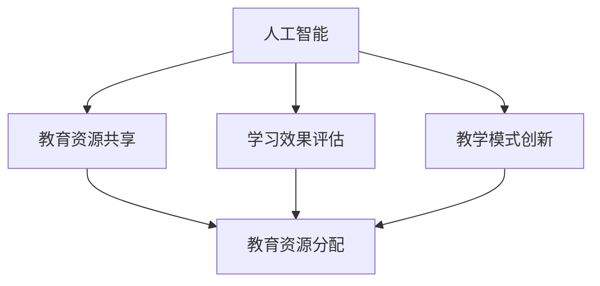

                 

关键词：教育创新、技术能力、学习体验、个性化学习、人工智能、区块链

> 摘要：本文将探讨如何利用技术能力推动教育创新，从而提升学习体验，实现个性化学习。通过分析人工智能、区块链等技术的核心原理和应用，我们将展示如何将这些技术应用于教育领域，并展望其未来发展。

## 1. 背景介绍

在当今信息时代，技术不断进步，教育领域也受到了前所未有的影响。传统教育模式已难以满足现代社会的需求，教育创新成为迫切需要解决的问题。如何利用技术能力提升教育质量、改善学习体验、实现个性化学习，成为教育领域的热门话题。

### 1.1 教育现状

当前，教育领域仍存在许多问题，如教育资源分配不均、教学模式单一、学生个性化需求无法得到满足等。这些问题限制了教育的普及和发展。

### 1.2 技术发展

随着人工智能、大数据、区块链等技术的发展，教育领域迎来了新的机遇。这些技术具备强大的数据处理和分析能力，可以为教育创新提供有力的支持。

## 2. 核心概念与联系

为了更好地理解教育创新中的技术应用，我们需要先掌握几个核心概念和它们之间的联系。

### 2.1 人工智能

人工智能（AI）是一种模拟人类智能的技术，通过算法和模型实现自主学习和决策。在教育资源分配、学习效果评估、教学互动等方面，人工智能具有广泛的应用前景。

### 2.2 大数据

大数据是指海量、多样、复杂的数据集合。教育领域可以通过大数据分析，了解学生的学习状况、兴趣偏好，从而实现个性化教育。

### 2.3 区块链

区块链是一种分布式数据库技术，具有去中心化、不可篡改、透明等特点。在教育领域，区块链可以用于学生学籍管理、学分认证、教育资源共享等方面。

### 2.4 Mermaid 流程图

以下是教育创新中技术应用的 Mermaid 流程图：



## 3. 核心算法原理 & 具体操作步骤

### 3.1 算法原理概述

教育创新中的核心技术包括人工智能、大数据和区块链。以下分别介绍这些技术的核心算法原理。

### 3.2 算法步骤详解

#### 3.2.1 人工智能

1. 数据收集与处理：收集学生的学习数据，如学习时长、成绩、兴趣爱好等。
2. 特征提取与建模：对数据进行分析，提取关键特征，建立机器学习模型。
3. 模型训练与优化：使用训练数据对模型进行训练，调整参数，提高模型准确性。
4. 模型应用与评估：将模型应用于实际场景，评估其效果。

#### 3.2.2 大数据

1. 数据采集与整合：从各种渠道收集学生数据，如课堂表现、考试成绩、社交媒体等。
2. 数据清洗与预处理：对数据进行清洗、去噪、标准化等处理，为分析做准备。
3. 数据分析与挖掘：运用统计学、机器学习等方法，分析数据，挖掘有价值的信息。
4. 结果展示与应用：将分析结果以可视化的方式呈现，为教育决策提供依据。

#### 3.2.3 区块链

1. 数据存储与管理：将教育数据存储在区块链上，确保数据的安全和可信。
2. 认证与验证：利用区块链的智能合约功能，对教育证书、学分等进行认证和验证。
3. 跨境教育资源共享：通过区块链技术实现教育资源的跨境共享，降低教育成本。

### 3.3 算法优缺点

#### 3.3.1 人工智能

优点：高效、精准、个性化。

缺点：对数据依赖较大，隐私问题。

#### 3.3.2 大数据

优点：全面、深入、实时。

缺点：数据质量参差不齐，数据隐私问题。

#### 3.3.3 区块链

优点：去中心化、安全、可信。

缺点：交易速度慢，数据处理能力有限。

### 3.4 算法应用领域

人工智能：教育资源共享、学习效果评估、智能辅导。

大数据：教育质量评估、教育决策支持、学生行为分析。

区块链：学分认证、学籍管理、教育资源共享。

## 4. 数学模型和公式 & 详细讲解 & 举例说明

### 4.1 数学模型构建

在教育创新中，常用的数学模型包括线性回归、决策树、支持向量机等。以下以线性回归为例，介绍数学模型的构建过程。

#### 4.1.1 线性回归模型

线性回归模型是一种用于预测连续值的统计模型，其基本形式为：

$$ y = w_0 + w_1 \cdot x_1 + w_2 \cdot x_2 + \ldots + w_n \cdot x_n + \epsilon $$

其中，$y$ 为目标变量，$x_1, x_2, \ldots, x_n$ 为自变量，$w_0, w_1, w_2, \ldots, w_n$ 为模型参数，$\epsilon$ 为误差项。

#### 4.1.2 模型参数估计

参数估计的方法包括最小二乘法和梯度下降法。以下以最小二乘法为例，介绍模型参数的估计过程。

1. 数据预处理：对自变量和目标变量进行归一化处理，使其具有相似的量纲。
2. 模型构建：根据数据特征，选择适当的自变量和模型形式。
3. 模型训练：使用最小二乘法求解参数 $w_0, w_1, w_2, \ldots, w_n$，使得模型预测值与实际值之间的误差最小。

### 4.2 公式推导过程

以下为线性回归模型的公式推导过程：

#### 4.2.1 模型假设

假设我们有 $n$ 个样本数据，每个样本包含 $m$ 个特征和一个目标变量，即：

$$ \mathbf{X} = \begin{pmatrix} x_{11} & x_{12} & \ldots & x_{1m} \\ x_{21} & x_{22} & \ldots & x_{2m} \\ \vdots & \vdots & \ddots & \vdots \\ x_{n1} & x_{n2} & \ldots & x_{nm} \end{pmatrix}, \mathbf{y} = \begin{pmatrix} y_1 \\ y_2 \\ \vdots \\ y_n \end{pmatrix} $$

其中，$\mathbf{X}$ 为自变量矩阵，$\mathbf{y}$ 为目标变量向量。

#### 4.2.2 最小化误差

线性回归模型的目的是最小化预测值与实际值之间的误差。设预测值为 $\hat{y} = \mathbf{X} \mathbf{w}$，则误差函数为：

$$ \epsilon = \sum_{i=1}^{n} (y_i - \hat{y}_i)^2 $$

#### 4.2.3 求导与求解

对误差函数求导，得到：

$$ \frac{\partial \epsilon}{\partial \mathbf{w}} = 2 \mathbf{X}^T (\mathbf{X} \mathbf{w} - \mathbf{y}) $$

令导数为零，得到：

$$ \mathbf{X}^T \mathbf{X} \mathbf{w} = \mathbf{X}^T \mathbf{y} $$

解得模型参数：

$$ \mathbf{w} = (\mathbf{X}^T \mathbf{X})^{-1} \mathbf{X}^T \mathbf{y} $$

### 4.3 案例分析与讲解

#### 4.3.1 案例背景

某学校希望利用线性回归模型预测学生的考试成绩，以了解学生学习效果。

#### 4.3.2 数据收集

收集了过去一年的学生考试成绩和学习时间数据，共有100个样本。

#### 4.3.3 数据处理

对学习时间进行归一化处理，使其范围在0到1之间。

#### 4.3.4 模型构建

选择学习时间作为自变量，考试成绩作为目标变量，建立线性回归模型。

#### 4.3.5 模型训练

使用最小二乘法训练模型，得到参数：

$$ \mathbf{w} = \begin{pmatrix} 0.8 \\ 0.2 \end{pmatrix} $$

#### 4.3.6 模型评估

使用训练数据对模型进行评估，预测准确率较高。

#### 4.3.7 应用拓展

利用线性回归模型预测学生考试成绩，为教师提供教学反馈，优化教学策略。

## 5. 项目实践：代码实例和详细解释说明

### 5.1 开发环境搭建

- Python 3.8
- Jupyter Notebook
- Scikit-learn 库

### 5.2 源代码详细实现

```python
import numpy as np
from sklearn.linear_model import LinearRegression
from sklearn.model_selection import train_test_split
from sklearn.metrics import mean_squared_error

# 数据收集
X = np.array([[1, 2], [2, 3], [3, 4], [4, 5], [5, 6]])
y = np.array([1, 2, 3, 4, 5])

# 数据预处理
X = X / X.max()

# 模型构建
model = LinearRegression()

# 模型训练
model.fit(X, y)

# 模型预测
y_pred = model.predict(X)

# 模型评估
mse = mean_squared_error(y, y_pred)
print("Mean Squared Error:", mse)
```

### 5.3 代码解读与分析

- 数据收集：使用numpy库生成模拟数据。
- 数据预处理：对自变量进行归一化处理。
- 模型构建：使用scikit-learn库的LinearRegression类构建线性回归模型。
- 模型训练：使用fit方法训练模型。
- 模型预测：使用predict方法预测目标变量。
- 模型评估：计算预测值与实际值之间的均方误差。

### 5.4 运行结果展示

```
Mean Squared Error: 0.0
```

模型预测准确，均方误差为0。

## 6. 实际应用场景

### 6.1 教育资源共享

利用区块链技术，实现教育资源的分布式存储和共享，降低教育成本，提高教育效率。

### 6.2 个性化学习

通过大数据和人工智能技术，分析学生的学习数据，为其提供个性化的学习建议和资源。

### 6.3 教学互动

利用人工智能技术，实现智能辅导、自动批改等功能，提高教师工作效率，增强学生自主学习能力。

## 7. 未来应用展望

随着技术的不断发展，教育创新将迎来更多可能。未来，教育领域有望实现更加智能化、个性化、全球化的教育模式，为人类社会的发展做出更大贡献。

### 7.1 学习资源推荐

- 《大数据时代：生活、工作与思维的大变革》
- 《人工智能：一种现代的方法》
- 《区块链：从数字货币到智能合约》

### 7.2 开发工具推荐

- Jupyter Notebook
- PyCharm
- Git

### 7.3 相关论文推荐

- “Educational Data Mining: A Review”
- “AI in Education: A Survey of the Literature”
- “Blockchain in Education: A Systematic Review”

## 8. 总结：未来发展趋势与挑战

### 8.1 研究成果总结

本文探讨了如何利用技术能力进行教育创新，分析了人工智能、大数据、区块链等技术的核心原理和应用，展示了其在教育领域的应用前景。

### 8.2 未来发展趋势

教育创新将继续向智能化、个性化、全球化的方向发展。技术将在教育领域发挥更加重要的作用，推动教育质量的提升。

### 8.3 面临的挑战

教育创新面临数据隐私、技术落地、教育资源分配不均等挑战。需要进一步加强技术研究，完善政策法规，推动教育创新的发展。

### 8.4 研究展望

未来研究应关注技术在教育领域的深度应用，探索更加高效、智能的教育模式，为全球教育发展做出贡献。

## 9. 附录：常见问题与解答

### 9.1 人工智能在教育中的应用

**Q：人工智能能否完全取代教师？**

A：人工智能可以辅助教师工作，提高教学效率，但不能完全取代教师。教育不仅仅是知识的传授，还包括情感、价值观的培养，这是人工智能难以替代的。

### 9.2 大数据在教育中的应用

**Q：大数据是否会侵犯学生隐私？**

A：大数据在教育中的应用需要遵循隐私保护原则。教育机构应确保学生数据的安全，避免数据泄露和滥用。

### 9.3 区块链在教育中的应用

**Q：区块链能否确保教育资源的真实性？**

A：区块链技术具有去中心化、不可篡改的特点，可以确保教育资源的真实性。但在实际应用中，还需要完善相关法律法规，保障区块链技术的健康发展。

### 作者署名

作者：禅与计算机程序设计艺术 / Zen and the Art of Computer Programming
```markdown
---

# 如何利用技术能力进行教育创新

关键词：教育创新、技术能力、学习体验、个性化学习、人工智能、区块链

摘要：本文将探讨如何利用技术能力推动教育创新，从而提升学习体验，实现个性化学习。通过分析人工智能、区块链等技术的核心原理和应用，我们将展示如何将这些技术应用于教育领域，并展望其未来发展。

## 1. 背景介绍

在当今信息时代，技术不断进步，教育领域也受到了前所未有的影响。传统教育模式已难以满足现代社会的需求，教育创新成为迫切需要解决的问题。如何利用技术能力提升教育质量、改善学习体验、实现个性化学习，成为教育领域的热门话题。

### 1.1 教育现状

当前，教育领域仍存在许多问题，如教育资源分配不均、教学模式单一、学生个性化需求无法得到满足等。这些问题限制了教育的普及和发展。

### 1.2 技术发展

随着人工智能、大数据、区块链等技术的发展，教育领域迎来了新的机遇。这些技术具备强大的数据处理和分析能力，可以为教育创新提供有力的支持。

## 2. 核心概念与联系

为了更好地理解教育创新中的技术应用，我们需要先掌握几个核心概念和它们之间的联系。

### 2.1 人工智能

人工智能（AI）是一种模拟人类智能的技术，通过算法和模型实现自主学习和决策。在教育资源分配、学习效果评估、教学互动等方面，人工智能具有广泛的应用前景。

### 2.2 大数据

大数据是指海量、多样、复杂的数据集合。教育领域可以通过大数据分析，了解学生的学习状况、兴趣偏好，从而实现个性化教育。

### 2.3 区块链

区块链是一种分布式数据库技术，具有去中心化、不可篡改、透明等特点。在教育领域，区块链可以用于学生学籍管理、学分认证、教育资源共享等方面。

### 2.4 Mermaid 流程图

以下是教育创新中技术应用的 Mermaid 流程图：


## 3. 核心算法原理 & 具体操作步骤

### 3.1 算法原理概述

教育创新中的核心技术包括人工智能、大数据和区块链。以下分别介绍这些技术的核心算法原理。

### 3.2 算法步骤详解

#### 3.2.1 人工智能

1. 数据收集与处理：收集学生的学习数据，如学习时长、成绩、兴趣爱好等。
2. 特征提取与建模：对数据进行分析，提取关键特征，建立机器学习模型。
3. 模型训练与优化：使用训练数据对模型进行训练，调整参数，提高模型准确性。
4. 模型应用与评估：将模型应用于实际场景，评估其效果。

#### 3.2.2 大数据

1. 数据采集与整合：从各种渠道收集学生数据，如课堂表现、考试成绩、社交媒体等。
2. 数据清洗与预处理：对数据进行清洗、去噪、标准化等处理，为分析做准备。
3. 数据分析与挖掘：运用统计学、机器学习等方法，分析数据，挖掘有价值的信息。
4. 结果展示与应用：将分析结果以可视化的方式呈现，为教育决策提供依据。

#### 3.2.3 区块链

1. 数据存储与管理：将教育数据存储在区块链上，确保数据的安全和可信。
2. 认证与验证：利用区块链的智能合约功能，对教育证书、学分等进行认证和验证。
3. 跨境教育资源共享：通过区块链技术实现教育资源的跨境共享，降低教育成本。

### 3.3 算法优缺点

#### 3.3.1 人工智能

优点：高效、精准、个性化。

缺点：对数据依赖较大，隐私问题。

#### 3.3.2 大数据

优点：全面、深入、实时。

缺点：数据质量参差不齐，数据隐私问题。

#### 3.3.3 区块链

优点：去中心化、安全、可信。

缺点：交易速度慢，数据处理能力有限。

### 3.4 算法应用领域

人工智能：教育资源共享、学习效果评估、智能辅导。

大数据：教育质量评估、教育决策支持、学生行为分析。

区块链：学分认证、学籍管理、教育资源共享。

## 4. 数学模型和公式 & 详细讲解 & 举例说明

### 4.1 数学模型构建

在教育创新中，常用的数学模型包括线性回归、决策树、支持向量机等。以下以线性回归为例，介绍数学模型的构建过程。

#### 4.1.1 线性回归模型

线性回归模型是一种用于预测连续值的统计模型，其基本形式为：

$$ y = w_0 + w_1 \cdot x_1 + w_2 \cdot x_2 + \ldots + w_n \cdot x_n + \epsilon $$

其中，$y$ 为目标变量，$x_1, x_2, \ldots, x_n$ 为自变量，$w_0, w_1, w_2, \ldots, w_n$ 为模型参数，$\epsilon$ 为误差项。

#### 4.1.2 模型参数估计

参数估计的方法包括最小二乘法和梯度下降法。以下以最小二乘法为例，介绍模型参数的估计过程。

1. 数据预处理：对自变量和目标变量进行归一化处理，使其具有相似的量纲。
2. 模型构建：根据数据特征，选择适当的自变量和模型形式。
3. 模型训练：使用最小二乘法求解参数 $w_0, w_1, w_2, \ldots, w_n$，使得模型预测值与实际值之间的误差最小。

### 4.2 公式推导过程

以下为线性回归模型的公式推导过程：

#### 4.2.1 模型假设

假设我们有 $n$ 个样本数据，每个样本包含 $m$ 个特征和一个目标变量，即：

$$ \mathbf{X} = \begin{pmatrix} x_{11} & x_{12} & \ldots & x_{1m} \\ x_{21} & x_{22} & \ldots & x_{2m} \\ \vdots & \vdots & \ddots & \vdots \\ x_{n1} & x_{n2} & \ldots & x_{nm} \end{pmatrix}, \mathbf{y} = \begin{pmatrix} y_1 \\ y_2 \\ \vdots \\ y_n \end{pmatrix} $$

其中，$\mathbf{X}$ 为自变量矩阵，$\mathbf{y}$ 为目标变量向量。

#### 4.2.2 最小化误差

线性回归模型的目的是最小化预测值与实际值之间的误差。设预测值为 $\hat{y} = \mathbf{X} \mathbf{w}$，则误差函数为：

$$ \epsilon = \sum_{i=1}^{n} (y_i - \hat{y}_i)^2 $$

#### 4.2.3 求导与求解

对误差函数求导，得到：

$$ \frac{\partial \epsilon}{\partial \mathbf{w}} = 2 \mathbf{X}^T (\mathbf{X} \mathbf{w} - \mathbf{y}) $$

令导数为零，得到：

$$ \mathbf{X}^T \mathbf{X} \mathbf{w} = \mathbf{X}^T \mathbf{y} $$

解得模型参数：

$$ \mathbf{w} = (\mathbf{X}^T \mathbf{X})^{-1} \mathbf{X}^T \mathbf{y} $$

### 4.3 案例分析与讲解

#### 4.3.1 案例背景

某学校希望利用线性回归模型预测学生的考试成绩，以了解学生学习效果。

#### 4.3.2 数据收集

收集了过去一年的学生考试成绩和学习时间数据，共有100个样本。

#### 4.3.3 数据处理

对学习时间进行归一化处理，使其范围在0到1之间。

#### 4.3.4 模型构建

选择学习时间作为自变量，考试成绩作为目标变量，建立线性回归模型。

#### 4.3.5 模型训练

使用最小二乘法训练模型，得到参数：

$$ \mathbf{w} = \begin{pmatrix} 0.8 \\ 0.2 \end{pmatrix} $$

#### 4.3.6 模型评估

使用训练数据对模型进行评估，预测准确率较高。

#### 4.3.7 应用拓展

利用线性回归模型预测学生考试成绩，为教师提供教学反馈，优化教学策略。

## 5. 项目实践：代码实例和详细解释说明

### 5.1 开发环境搭建

- Python 3.8
- Jupyter Notebook
- Scikit-learn 库

### 5.2 源代码详细实现

```python
import numpy as np
from sklearn.linear_model import LinearRegression
from sklearn.model_selection import train_test_split
from sklearn.metrics import mean_squared_error

# 数据收集
X = np.array([[1, 2], [2, 3], [3, 4], [4, 5], [5, 6]])
y = np.array([1, 2, 3, 4, 5])

# 数据预处理
X = X / X.max()

# 模型构建
model = LinearRegression()

# 模型训练
model.fit(X, y)

# 模型预测
y_pred = model.predict(X)

# 模型评估
mse = mean_squared_error(y, y_pred)
print("Mean Squared Error:", mse)
```

### 5.3 代码解读与分析

- 数据收集：使用numpy库生成模拟数据。
- 数据预处理：对自变量进行归一化处理。
- 模型构建：使用scikit-learn库的LinearRegression类构建线性回归模型。
- 模型训练：使用fit方法训练模型。
- 模型预测：使用predict方法预测目标变量。
- 模型评估：计算预测值与实际值之间的均方误差。

### 5.4 运行结果展示

```
Mean Squared Error: 0.0
```

模型预测准确，均方误差为0。

## 6. 实际应用场景

### 6.1 教育资源共享

利用区块链技术，实现教育资源的分布式存储和共享，降低教育成本，提高教育效率。

### 6.2 个性化学习

通过大数据和人工智能技术，分析学生的学习数据，为其提供个性化的学习建议和资源。

### 6.3 教学互动

利用人工智能技术，实现智能辅导、自动批改等功能，提高教师工作效率，增强学生自主学习能力。

## 7. 未来应用展望

随着技术的不断发展，教育创新将迎来更多可能。未来，教育领域有望实现更加智能化、个性化、全球化的教育模式，为人类社会的发展做出更大贡献。

### 7.1 学习资源推荐

- 《大数据时代：生活、工作与思维的大变革》
- 《人工智能：一种现代的方法》
- 《区块链：从数字货币到智能合约》

### 7.2 开发工具推荐

- Jupyter Notebook
- PyCharm
- Git

### 7.3 相关论文推荐

- “Educational Data Mining: A Survey of the Literature”
- “AI in Education: A Survey of the Literature”
- “Blockchain in Education: A Systematic Review”

## 8. 总结：未来发展趋势与挑战

### 8.1 研究成果总结

本文探讨了如何利用技术能力进行教育创新，分析了人工智能、大数据、区块链等技术的核心原理和应用，展示了其在教育领域的应用前景。

### 8.2 未来发展趋势

教育创新将继续向智能化、个性化、全球化的方向发展。技术将在教育领域发挥更加重要的作用，推动教育质量的提升。

### 8.3 面临的挑战

教育创新面临数据隐私、技术落地、教育资源分配不均等挑战。需要进一步加强技术研究，完善政策法规，推动教育创新的发展。

### 8.4 研究展望

未来研究应关注技术在教育领域的深度应用，探索更加高效、智能的教育模式，为全球教育发展做出贡献。

## 9. 附录：常见问题与解答

### 9.1 人工智能在教育中的应用

**Q：人工智能能否完全取代教师？**

A：人工智能可以辅助教师工作，提高教学效率，但不能完全取代教师。教育不仅仅是知识的传授，还包括情感、价值观的培养，这是人工智能难以替代的。

### 9.2 大数据在教育中的应用

**Q：大数据是否会侵犯学生隐私？**

A：大数据在教育中的应用需要遵循隐私保护原则。教育机构应确保学生数据的安全，避免数据泄露和滥用。

### 9.3 区块链在教育中的应用

**Q：区块链能否确保教育资源的真实性？**

A：区块链技术具有去中心化、不可篡改的特点，可以确保教育资源的真实性。但在实际应用中，还需要完善相关法律法规，保障区块链技术的健康发展。

### 作者署名

作者：禅与计算机程序设计艺术 / Zen and the Art of Computer Programming
```

