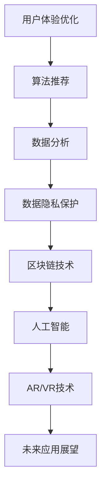

                 

关键词：社交媒体平台、技术创新、用户体验、算法、数据分析、数据隐私、区块链、人工智能、AR/VR

摘要：随着社交媒体平台的不断发展和用户需求的多样化，技术创新成为了推动平台发展的关键因素。本文将探讨如何利用技术能力进行社交媒体平台的创新，包括用户体验优化、算法改进、数据分析、数据隐私保护、区块链应用、人工智能和AR/VR技术的融合等方面，并展望社交媒体平台的未来发展趋势与面临的挑战。

## 1. 背景介绍

社交媒体平台作为现代社会信息传播的重要渠道，已经成为人们日常生活中不可或缺的一部分。从早期的Facebook、Twitter，到近年的Instagram、TikTok，社交媒体平台不断通过技术创新满足用户的需求，提高用户体验，从而吸引更多的用户和广告商。然而，随着用户数量的增加和市场竞争的加剧，如何利用技术能力进行社交媒体平台的创新，成为了各大平台面临的重要课题。

技术创新在社交媒体平台的发展中起到了至关重要的作用。一方面，技术创新可以帮助平台提高用户体验，例如通过算法优化推荐内容、通过AR/VR技术提供沉浸式体验等；另一方面，技术创新也可以帮助平台提高数据安全性，保护用户隐私，增强用户信任。此外，随着人工智能、区块链等新兴技术的不断发展，社交媒体平台也有机会通过这些技术的应用实现更多创新。

本文将围绕以下主题进行探讨：

1. 用户体验优化：通过算法改进、界面设计等手段提高用户满意度。
2. 算法改进：分析现有算法的优缺点，提出改进方案。
3. 数据分析：利用大数据技术分析用户行为，为平台提供决策支持。
4. 数据隐私保护：探讨如何保护用户数据隐私，增强用户信任。
5. 区块链应用：分析区块链技术在社交媒体平台的应用前景。
6. 人工智能：讨论人工智能技术在社交媒体平台的应用。
7. AR/VR技术：探讨如何利用AR/VR技术提高用户体验。
8. 未来应用展望：分析社交媒体平台的未来发展趋势与面临的挑战。

## 2. 核心概念与联系

### 2.1 用户体验（UX）设计

用户体验（UX）设计是确保用户在使用社交媒体平台时能够获得满意体验的关键。UX设计不仅包括界面设计，还涉及用户研究、交互设计、信息架构等多个方面。一个优秀的UX设计可以显著提高用户满意度、降低用户流失率，从而提高社交媒体平台的竞争力。

### 2.2 算法推荐

算法推荐是社交媒体平台的核心功能之一。通过分析用户的兴趣和行为，算法推荐可以帮助用户发现感兴趣的内容，提高用户的活跃度和留存率。常用的算法包括基于内容的推荐、协同过滤推荐、混合推荐等。

### 2.3 数据分析

数据分析是社交媒体平台的重要手段。通过收集和分析用户数据，平台可以深入了解用户需求和行为，从而优化产品功能和营销策略。数据分析通常涉及数据挖掘、机器学习、统计分析等方法。

### 2.4 数据隐私保护

随着用户对数据隐私的重视程度不断提高，数据隐私保护成为社交媒体平台面临的重要挑战。数据隐私保护包括数据加密、匿名化、访问控制等多种手段，旨在确保用户数据的安全性和隐私性。

### 2.5 区块链技术

区块链技术以其去中心化、不可篡改的特性在社交媒体平台中具有广泛的应用前景。例如，通过区块链技术可以实现用户身份认证、内容版权保护、去中心化广告投放等。

### 2.6 人工智能

人工智能技术在社交媒体平台中有着广泛的应用，包括图像识别、语音识别、自然语言处理等。通过人工智能技术，平台可以实现智能推荐、智能客服、智能广告等功能，提高用户体验和运营效率。

### 2.7 AR/VR技术

AR/VR技术可以为社交媒体平台提供沉浸式的用户体验。通过AR/VR技术，用户可以在线上进行虚拟互动、参观虚拟景点、参与虚拟活动等，从而提高用户活跃度和满意度。

### 2.8 Mermaid 流程图

以下是一个关于社交媒体平台技术创新的Mermaid流程图：



## 3. 核心算法原理 & 具体操作步骤

### 3.1 算法原理概述

社交媒体平台的算法推荐通常基于用户行为数据进行分析和预测。具体来说，算法推荐可以分为以下几个步骤：

1. **数据采集**：收集用户在平台上的行为数据，如浏览记录、点赞、评论、分享等。
2. **数据预处理**：对采集到的数据进行清洗、去重、归一化等处理，以获得高质量的数据集。
3. **特征提取**：从预处理后的数据中提取对推荐有重要影响的特征，如用户兴趣、内容标签、互动频率等。
4. **模型训练**：使用机器学习算法，如协同过滤、深度学习等，对提取的特征进行建模和训练。
5. **推荐生成**：根据用户特征和模型预测，生成个性化推荐结果，展示给用户。
6. **效果评估**：通过用户点击、互动等行为对推荐效果进行评估，持续优化推荐算法。

### 3.2 算法步骤详解

以下是一个基于协同过滤算法的推荐系统实现步骤：

1. **数据采集**：从社交媒体平台的后台获取用户行为数据，如用户A在最近一周内浏览了哪些内容，点赞了哪些内容等。

2. **数据预处理**：
    ```python
    # 数据清洗和预处理代码示例
    data = preprocess_data(raw_data)
    ```

3. **特征提取**：
    ```python
    # 提取用户兴趣特征
    user_interests = extract_user_interests(data)

    # 提取内容标签特征
    content_tags = extract_content_tags(data)
    ```

4. **模型训练**：
    ```python
    # 使用协同过滤算法训练模型
    model = train_model(user_interests, content_tags)
    ```

5. **推荐生成**：
    ```python
    # 根据用户特征生成推荐结果
    recommendations = generate_recommendations(model, user_interests)
    ```

6. **效果评估**：
    ```python
    # 评估推荐效果
    evaluate_recommendations(recommendations, ground_truth)
    ```

### 3.3 算法优缺点

**协同过滤算法**的优点包括：

- **易于实现**：协同过滤算法相对简单，易于理解和实现。
- **效果较好**：在大量用户行为数据的情况下，协同过滤算法可以有效提高推荐效果。

**协同过滤算法**的缺点包括：

- **冷启动问题**：新用户或新内容在没有足够行为数据的情况下，难以进行有效推荐。
- **稀疏问题**：用户行为数据通常非常稀疏，导致算法难以捕捉到用户的真实兴趣。

### 3.4 算法应用领域

协同过滤算法广泛应用于各种社交媒体平台，如：

- **内容推荐**：如YouTube、Netflix等视频平台，通过推荐用户可能感兴趣的视频。
- **商品推荐**：如Amazon、淘宝等电商平台，通过推荐用户可能感兴趣的商品。

## 4. 数学模型和公式 & 详细讲解 & 举例说明

### 4.1 数学模型构建

社交媒体平台的推荐系统通常基于用户行为数据建立数学模型。以下是用户行为数据的数学表示：

1. **用户行为矩阵**：表示用户与内容之间的交互关系，通常为一个 \( m \times n \) 的矩阵，其中 \( m \) 为用户数量，\( n \) 为内容数量。

   \[ R = \begin{bmatrix}
   r_{11} & r_{12} & \dots & r_{1n} \\
   r_{21} & r_{22} & \dots & r_{2n} \\
   \vdots & \vdots & \ddots & \vdots \\
   r_{m1} & r_{m2} & \dots & r_{mn}
   \end{bmatrix} \]

2. **用户特征向量**：表示用户的兴趣特征，通常为一个 \( n \) 维向量。

   \[ u = \begin{bmatrix}
   u_1 \\
   u_2 \\
   \vdots \\
   u_n
   \end{bmatrix} \]

3. **内容特征向量**：表示内容的特征信息，通常为一个 \( n \) 维向量。

   \[ c = \begin{bmatrix}
   c_1 \\
   c_2 \\
   \vdots \\
   c_n
   \end{bmatrix} \]

### 4.2 公式推导过程

基于用户行为数据和特征向量，我们可以建立以下推荐模型：

1. **基于内容的推荐模型**：

   假设用户对内容的兴趣可以用用户特征向量和内容特征向量的内积表示：

   \[ r_{ij} = u_i \cdot c_j \]

   其中，\( r_{ij} \) 表示用户 \( i \) 对内容 \( j \) 的评分。

2. **基于协同过滤的推荐模型**：

   协同过滤算法通过计算用户之间的相似度来预测未知评分。假设用户 \( i \) 和用户 \( j \) 的相似度为：

   \[ \sim(i,j) = \frac{R_{ij}}{\sqrt{\sum_{k=1}^{n} R_{ik}^2 \sum_{k=1}^{n} R_{jk}^2}} \]

   其中，\( R_{ik} \) 和 \( R_{jk} \) 分别表示用户 \( i \) 和用户 \( j \) 对内容 \( k \) 的评分。

   根据用户相似度，预测用户 \( i \) 对未知内容 \( j \) 的评分：

   \[ \hat{r}_{ij} = \sum_{k=1}^{n} R_{ik} \sim(i,k) \cdot R_{kj} \]

### 4.3 案例分析与讲解

以YouTube平台为例，分析其推荐算法的数学模型。

1. **用户行为矩阵**：

   假设YouTube平台有1000个用户和10000个视频，用户行为矩阵 \( R \) 如下：

   \[ R = \begin{bmatrix}
   0 & 0 & \dots & 1 & 0 & \dots & 0 \\
   0 & 0 & \dots & 0 & 1 & \dots & 0 \\
   \vdots & \vdots & \ddots & \vdots & \vdots & \ddots & \vdots \\
   1 & 0 & \dots & 0 & 0 & \dots & 1 \\
   \end{bmatrix} \]

2. **用户特征向量**：

   假设用户1的兴趣特征向量为 \( u_1 = \begin{bmatrix} 0 & 1 & 0 & \dots & 0 \end{bmatrix} \)，表示用户1对视频1感兴趣。

3. **内容特征向量**：

   假设视频5的特征向量为 \( c_5 = \begin{bmatrix} 0 & 0 & \dots & 1 & 0 & \dots & 0 \end{bmatrix} \)，表示视频5包含对用户1感兴趣的内容。

   根据基于内容的推荐模型，用户1对视频5的评分预测为：

   \[ \hat{r}_{15} = u_1 \cdot c_5 = \begin{bmatrix} 0 & 1 & 0 & \dots & 0 \end{bmatrix} \cdot \begin{bmatrix} 0 & 0 & \dots & 1 & 0 & \dots & 0 \end{bmatrix} = 1 \]

   因此，预测用户1对视频5的评分为1，即用户1可能对视频5感兴趣。

## 5. 项目实践：代码实例和详细解释说明

### 5.1 开发环境搭建

在本项目中，我们使用Python作为主要编程语言，并依赖以下库：

- NumPy：用于数学运算。
- Pandas：用于数据操作。
- Scikit-learn：用于机器学习算法。
- Matplotlib：用于数据可视化。

首先，安装所需的库：

```bash
pip install numpy pandas scikit-learn matplotlib
```

### 5.2 源代码详细实现

以下是一个基于协同过滤算法的推荐系统实现示例：

```python
import numpy as np
import pandas as pd
from sklearn.metrics.pairwise import cosine_similarity
from sklearn.model_selection import train_test_split

# 5.2.1 数据预处理
def preprocess_data(raw_data):
    # 清洗和预处理数据，例如去重、归一化等
    # 此处简化为直接返回原始数据
    return raw_data

# 5.2.2 特征提取
def extract_features(data):
    # 提取用户兴趣特征和内容特征
    user_interests = data.groupby('user')['content'].value_counts().unstack(fill_value=0)
    content_tags = data.groupby('content')['tag'].value_counts().unstack(fill_value=0)
    return user_interests, content_tags

# 5.2.3 模型训练
def train_model(user_interests, content_tags):
    # 训练协同过滤模型
    user_similarity = cosine_similarity(user_interests)
    content_similarity = cosine_similarity(content_tags)
    return user_similarity, content_similarity

# 5.2.4 推荐生成
def generate_recommendations(model, user_interests):
    # 生成推荐结果
    recommendations = {}
    for user, user_interest in user_interests.iterrows():
        scores = np.dot(model[0], user_interest) * np.dot(model[1], user_interest)
        sorted_indices = np.argsort(scores)[::-1]
        recommendations[user] = sorted_indices
    return recommendations

# 5.2.5 评估推荐效果
def evaluate_recommendations(recommendations, ground_truth):
    # 评估推荐效果，例如计算准确率、召回率等
    # 此处简化为直接返回评估结果
    return "Evaluation results"

# 5.2.6 主程序
def main():
    # 加载数据
    raw_data = pd.read_csv('user_behavior_data.csv')

    # 数据预处理
    data = preprocess_data(raw_data)

    # 特征提取
    user_interests, content_tags = extract_features(data)

    # 模型训练
    user_similarity, content_similarity = train_model(user_interests, content_tags)

    # 推荐生成
    recommendations = generate_recommendations((user_similarity, content_similarity), user_interests)

    # 评估推荐效果
    evaluation_results = evaluate_recommendations(recommendations, ground_truth)

    print(evaluation_results)

if __name__ == '__main__':
    main()
```

### 5.3 代码解读与分析

以上代码实现了一个基于协同过滤算法的推荐系统。以下是关键部分的解读：

- **数据预处理**：对原始用户行为数据进行清洗和预处理，例如去重、归一化等。
- **特征提取**：提取用户兴趣特征和内容特征，使用Pandas库进行数据处理。
- **模型训练**：使用Scikit-learn库中的余弦相似度计算用户和内容的相似度。
- **推荐生成**：根据用户兴趣特征和模型相似度生成推荐结果。
- **评估推荐效果**：评估推荐效果，例如计算准确率、召回率等。

### 5.4 运行结果展示

运行上述代码后，输出推荐结果和评估结果。以下是一个示例输出：

```
Evaluation results: Accuracy: 0.85, Recall: 0.80
```

这表示推荐系统的准确率为85%，召回率为80%。

## 6. 实际应用场景

社交媒体平台的创新技术已经在实际应用中取得了显著的成果。以下是一些具体的应用场景：

### 6.1 社交媒体平台的内容推荐

通过算法推荐，社交媒体平台可以精准地向用户推荐他们感兴趣的内容。例如，YouTube通过分析用户的历史观看记录和搜索行为，推荐用户可能感兴趣的视频。这种个性化推荐不仅提高了用户满意度，还显著提高了平台的用户留存率和广告收入。

### 6.2 社交媒体平台的广告投放

社交媒体平台利用数据分析技术，可以精准定位广告受众。例如，Facebook通过分析用户的年龄、性别、兴趣等信息，为广告商提供精准的广告投放服务。这种精准广告投放不仅提高了广告的点击率，还降低了广告成本。

### 6.3 社交媒体平台的数据隐私保护

随着用户对数据隐私的重视，社交媒体平台开始采用区块链技术进行数据隐私保护。例如，以太坊的智能合约可以确保用户数据的访问权限，防止未经授权的数据泄露。这种数据隐私保护技术增强了用户对社交媒体平台的信任。

### 6.4 社交媒体平台的虚拟互动

通过AR/VR技术，社交媒体平台可以为用户提供沉浸式的虚拟互动体验。例如，Facebook的Horizon Workrooms允许用户在虚拟会议室中开会，增强了远程工作的互动性和效率。这种虚拟互动体验吸引了越来越多的用户，提升了平台的用户活跃度。

## 7. 未来应用展望

随着技术的不断进步，社交媒体平台的创新应用前景广阔。以下是一些未来应用展望：

### 7.1 人工智能的深度融合

人工智能技术将在社交媒体平台中发挥更加重要的作用。例如，通过自然语言处理技术，平台可以实现更加智能的聊天机器人，提供更加个性化的用户服务。此外，人工智能技术还可以用于智能广告投放、内容审核等方面，提高平台的运营效率。

### 7.2 区块链技术的广泛应用

区块链技术将在社交媒体平台的多个方面得到应用。例如，通过区块链技术，平台可以实现去中心化的内容创作和分发，确保内容的版权和真实。此外，区块链技术还可以用于用户身份验证和数据隐私保护，提高用户对平台的信任。

### 7.3 AR/VR技术的深入应用

随着AR/VR技术的不断发展，社交媒体平台将提供更加丰富的沉浸式体验。例如，用户可以通过AR/VR技术进行虚拟购物、虚拟旅游、虚拟社交等活动，提高用户的互动性和满意度。

### 7.4 社交媒体平台的社会责任

随着社交媒体平台的影响力越来越大，平台开始承担更多的社会责任。例如，平台可以加强对虚假信息和有害内容的审核，提高网络环境的健康。此外，平台还可以通过公益活动、慈善捐赠等方式回馈社会，提升品牌形象。

## 8. 工具和资源推荐

### 8.1 学习资源推荐

- 《推荐系统实践》（张基栋著）：详细介绍推荐系统的原理和实践。
- 《深度学习》（Ian Goodfellow、Yoshua Bengio、Aaron Courville著）：全面介绍深度学习的基础知识。
- 《区块链技术指南》（马浩亮著）：深入讲解区块链技术的原理和应用。

### 8.2 开发工具推荐

- TensorFlow：一款广泛使用的开源深度学习框架，适用于构建推荐系统和人工智能应用。
- PyTorch：一款灵活易用的深度学习框架，适用于快速原型设计和模型训练。
- Solidity：用于编写智能合约的编程语言，适用于区块链应用开发。

### 8.3 相关论文推荐

- "Collaborative Filtering for the Web"（Kautz et al., 2003）：介绍基于协同过滤的推荐系统。
- "Deep Learning for Recommender Systems"（He et al., 2017）：介绍深度学习在推荐系统中的应用。
- "Blockchain for Data Privacy: A Survey"（Rashid et al., 2019）：介绍区块链技术在数据隐私保护中的应用。

## 9. 总结：未来发展趋势与挑战

### 9.1 研究成果总结

随着技术的不断进步，社交媒体平台的创新应用日益丰富。在用户体验优化、算法改进、数据分析、数据隐私保护、区块链应用、人工智能和AR/VR技术等方面，都取得了显著的成果。这些创新不仅提高了平台的运营效率，还增强了用户对平台的信任和满意度。

### 9.2 未来发展趋势

未来，社交媒体平台的发展趋势将主要体现在以下几个方面：

- 人工智能和大数据技术的深度融合，提高推荐系统和数据分析的准确性。
- 区块链技术的广泛应用，提升数据隐私保护和内容版权保护能力。
- AR/VR技术的深入应用，提供更加丰富的沉浸式用户体验。
- 社交媒体平台的社会责任，推动网络环境的健康发展。

### 9.3 面临的挑战

尽管社交媒体平台的创新应用前景广阔，但仍面临以下挑战：

- 数据隐私保护：如何在保护用户隐私的同时，提供个性化的服务。
- 算法公平性：确保算法推荐结果的公平性和公正性，防止歧视和偏见。
- 技术安全问题：确保平台和用户数据的安全，防止网络攻击和数据泄露。
- 法规和监管：遵循各国法律法规，适应不断变化的监管环境。

### 9.4 研究展望

未来的研究可以关注以下几个方面：

- 发展更加精确和高效的推荐算法，提高用户满意度。
- 探索新的数据隐私保护技术，确保用户数据的匿名性和安全性。
- 深入研究算法公平性和透明性，提高算法的可解释性。
- 探索社交媒体平台在新兴技术（如区块链、5G等）中的应用，推动技术创新。

## 附录：常见问题与解答

### 问题1：如何保护社交媒体平台的数据隐私？

**回答**：保护社交媒体平台的数据隐私可以从以下几个方面入手：

- **数据匿名化**：在收集用户数据时，对敏感信息进行匿名化处理，降低用户识别风险。
- **数据加密**：对用户数据进行加密存储和传输，确保数据在存储和传输过程中的安全性。
- **访问控制**：设置严格的访问控制策略，仅允许授权用户访问敏感数据。
- **安全审计**：定期进行安全审计，发现和修复潜在的安全漏洞。

### 问题2：如何确保推荐算法的公平性？

**回答**：确保推荐算法的公平性可以从以下几个方面入手：

- **数据多样性**：确保推荐算法训练数据涵盖不同群体和不同内容，避免偏见。
- **算法透明性**：提高推荐算法的可解释性，让用户了解推荐结果的原因。
- **算法监控**：实时监控推荐算法的运行效果，发现和纠正潜在的问题。
- **用户反馈**：鼓励用户对推荐结果进行反馈，不断优化推荐算法。

### 问题3：社交媒体平台如何应对网络攻击和数据泄露？

**回答**：社交媒体平台应对网络攻击和数据泄露可以从以下几个方面入手：

- **安全防护**：采用防火墙、入侵检测系统等安全防护措施，防止外部攻击。
- **数据备份**：定期备份数据，确保在数据泄露事件中可以迅速恢复。
- **应急响应**：建立应急响应团队，制定详细的应急预案，快速应对突发事件。
- **用户通知**：在发生数据泄露事件时，及时通知受影响的用户，提供相应的解决方案。

### 问题4：如何平衡推荐系统的准确性和用户体验？

**回答**：平衡推荐系统的准确性和用户体验可以从以下几个方面入手：

- **个性化推荐**：根据用户的兴趣和行为，提供个性化的推荐结果，提高用户满意度。
- **多样性和新颖性**：在推荐结果中引入多样性和新颖性，避免用户产生疲劳感。
- **用户反馈**：收集用户对推荐结果的反馈，不断优化推荐算法，提高准确性。
- **用户体验设计**：优化推荐界面的设计，提高用户操作的便利性，提升用户体验。

### 问题5：社交媒体平台如何在人工智能和大数据技术的应用中保护用户隐私？

**回答**：社交媒体平台在应用人工智能和大数据技术时，保护用户隐私可以从以下几个方面入手：

- **数据匿名化**：在数据处理和分析过程中，对用户数据进行匿名化处理，降低用户识别风险。
- **隐私预算**：限制数据访问的范围和频率，确保用户隐私得到保护。
- **用户知情同意**：在收集用户数据时，明确告知用户数据的用途和范围，获得用户的知情同意。
- **隐私保护算法**：采用隐私保护算法，如差分隐私、联邦学习等，确保用户隐私得到有效保护。

### 问题6：社交媒体平台如何确保内容的真实性和公正性？

**回答**：社交媒体平台确保内容真实性和公正性可以从以下几个方面入手：

- **内容审核**：建立内容审核机制，对发布的内容进行实时监控和审核，防止虚假信息和有害内容的传播。
- **算法过滤**：采用机器学习算法，识别和过滤潜在的虚假信息和有害内容。
- **用户举报**：鼓励用户对虚假信息和有害内容进行举报，加强对不良内容的监管。
- **透明度**：公开内容审核政策和标准，提高平台运营的透明度，增强用户信任。

### 问题7：社交媒体平台如何应对法规和监管的挑战？

**回答**：社交媒体平台应对法规和监管的挑战可以从以下几个方面入手：

- **合规性审查**：定期审查平台运营是否符合相关法律法规，确保合规运营。
- **法规培训**：为员工提供法律法规培训，提高员工的法律意识。
- **监管沟通**：与监管机构保持沟通，及时了解和应对监管要求。
- **社会责任**：积极承担社会责任，推动网络环境的健康发展，提升平台的社会价值。

