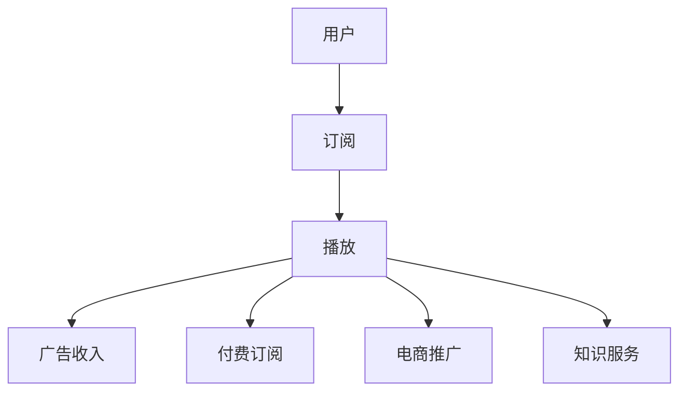

                 

关键词：播客平台、知识变现、内容创作、受众分析、营销策略、技术实现、数据分析、盈利模式

> 摘要：本文将深入探讨如何利用播客平台实现知识变现。通过对播客平台的背景介绍、核心概念阐述、算法原理分析、数学模型讲解、项目实践以及实际应用场景分析，帮助读者了解如何通过播客平台实现知识传播与商业价值的双赢。

## 1. 背景介绍

随着互联网的迅速发展和智能手机的普及，音频内容消费逐渐成为一种主流。播客（Podcast）作为一种新兴的内容形式，不仅满足了人们碎片化阅读的需求，还提供了丰富多样的知识传播渠道。在这个过程中，知识变现成为许多人关注的焦点。那么，如何利用播客平台实现知识变现呢？

本文将从以下几个方面展开讨论：

- 播客平台的背景与现状
- 知识变现的概念及其在播客平台的应用
- 播客平台实现知识变现的核心策略
- 知识变现的技术实现方法
- 数据分析与盈利模式
- 未来应用展望与挑战

## 2. 核心概念与联系

### 2.1 播客平台

播客平台是指用于发布、订阅和播放音频内容的在线服务。常见的播客平台包括苹果播客（Apple Podcasts）、喜马拉雅、网易云音乐等。用户可以通过订阅的方式，定期接收他们感兴趣的内容。

### 2.2 知识变现

知识变现是指将个人或团队的知识和技能转化为经济收益的过程。在播客平台上，知识变现可以通过以下几种方式实现：

- 广告收入：通过在播客中插入广告，吸引听众，从而获得广告费分成。
- 付费订阅：提供高质量的内容，吸引听众付费订阅。
- 电商推广：在播客中推广相关商品或服务，实现销售转化。
- 知识服务：提供线上或线下的知识咨询服务，收取服务费用。

### 2.3 Mermaid 流程图

为了更好地理解播客平台实现知识变现的过程，我们可以使用 Mermaid 流程图来表示。以下是核心概念与联系的关系图：



## 3. 核心算法原理 & 具体操作步骤

### 3.1 算法原理概述

播客平台实现知识变现的核心算法主要包括内容推荐算法、用户行为分析算法和广告优化算法。

- **内容推荐算法**：通过分析用户的兴趣和行为，推荐与其相关的优质内容。
- **用户行为分析算法**：收集用户在播客平台上的行为数据，如播放次数、订阅数、评论数等，用于分析用户喜好和需求。
- **广告优化算法**：根据用户行为和内容特点，选择合适的广告位和广告内容，提高广告点击率和转化率。

### 3.2 算法步骤详解

#### 3.2.1 内容推荐算法

1. 数据采集：收集用户在播客平台上的行为数据，如播放记录、评论、分享等。
2. 数据预处理：对采集到的数据进行清洗、去重和格式转换，以便后续分析。
3. 特征提取：从原始数据中提取与用户兴趣相关的特征，如播放时长、播放频次、评论主题等。
4. 模型训练：使用机器学习算法，如协同过滤、基于内容的推荐等，训练推荐模型。
5. 推荐生成：根据用户特征和模型预测，生成推荐内容列表。

#### 3.2.2 用户行为分析算法

1. 行为数据收集：收集用户在播客平台上的行为数据，如播放、点赞、评论等。
2. 数据预处理：对行为数据进行清洗、去重和格式转换。
3. 特征工程：从行为数据中提取与用户喜好相关的特征，如播放时长、播放频次、互动率等。
4. 模型训练：使用机器学习算法，如分类、聚类等，分析用户行为。
5. 行为预测：根据用户特征和模型预测，预测用户可能感兴趣的内容。

#### 3.2.3 广告优化算法

1. 广告数据收集：收集广告投放数据，如广告类型、投放位置、点击率等。
2. 数据预处理：对广告数据进行清洗、去重和格式转换。
3. 特征提取：从广告数据中提取与广告效果相关的特征，如广告类型、投放时间、用户属性等。
4. 模型训练：使用机器学习算法，如决策树、神经网络等，训练广告优化模型。
5. 广告投放：根据用户特征和模型预测，选择合适的广告位和广告内容。

### 3.3 算法优缺点

- **内容推荐算法**：优点在于能够为用户提供个性化的内容推荐，提高用户体验；缺点是推荐结果的准确性依赖于用户行为数据的质量和算法的优化。
- **用户行为分析算法**：优点在于能够深入了解用户需求，为内容创作和广告投放提供依据；缺点是行为数据存在噪声和偏差，需要进一步清洗和处理。
- **广告优化算法**：优点在于能够提高广告点击率和转化率，实现精准投放；缺点是算法的复杂度较高，需要大量的计算资源和时间。

### 3.4 算法应用领域

- **内容推荐**：在播客平台上，内容推荐算法可以帮助用户发现感兴趣的内容，提高用户留存率和活跃度。
- **用户运营**：通过用户行为分析算法，平台可以深入了解用户需求，优化产品功能和内容策略。
- **广告投放**：广告优化算法可以帮助广告主实现精准投放，提高广告效果和投资回报率。

## 4. 数学模型和公式 & 详细讲解 & 举例说明

### 4.1 数学模型构建

在播客平台实现知识变现的过程中，我们需要构建以下数学模型：

1. **用户兴趣模型**：用于描述用户对内容的兴趣程度。
2. **内容推荐模型**：用于预测用户可能感兴趣的内容。
3. **广告投放模型**：用于优化广告投放策略。

### 4.2 公式推导过程

#### 用户兴趣模型

假设用户 \( u \) 对内容 \( i \) 的兴趣程度可以用向量 \( \textbf{I}_{ui} \) 表示，其中每个元素表示用户对内容某个方面的兴趣。我们可以使用余弦相似度来计算用户之间的兴趣相似度：

$$
\text{similarity}(\textbf{I}_{u}, \textbf{I}_{v}) = \frac{\textbf{I}_{u} \cdot \textbf{I}_{v}}{\|\textbf{I}_{u}\| \|\textbf{I}_{v}\|}
$$

其中，\( \textbf{I}_{u} \) 和 \( \textbf{I}_{v} \) 分别表示用户 \( u \) 和 \( v \) 的兴趣向量，\( \|\textbf{I}_{u}\| \) 和 \( \|\textbf{I}_{v}\| \) 分别表示向量的模长。

#### 内容推荐模型

假设内容 \( i \) 的特征向量表示为 \( \textbf{F}_{i} \)，用户 \( u \) 对内容 \( i \) 的兴趣向量表示为 \( \textbf{I}_{ui} \)。我们可以使用加权余弦相似度来计算内容之间的相似度：

$$
\text{similarity}(\textbf{F}_{i}, \textbf{F}_{j}) = \frac{\textbf{F}_{i} \cdot \textbf{F}_{j}}{\|\textbf{F}_{i}\| \|\textbf{F}_{j}\|}
$$

其中，\( \textbf{F}_{i} \) 和 \( \textbf{F}_{j} \) 分别表示内容 \( i \) 和 \( j \) 的特征向量。

#### 广告投放模型

假设广告 \( a \) 的投放效果可以用点击率 \( CTR \) 表示，广告 \( a \) 的特征向量表示为 \( \textbf{F}_{a} \)，用户 \( u \) 对广告 \( a \) 的兴趣向量表示为 \( \textbf{I}_{ua} \)。我们可以使用加权余弦相似度来计算广告之间的相似度：

$$
\text{similarity}(\textbf{F}_{a}, \textbf{F}_{b}) = \frac{\textbf{F}_{a} \cdot \textbf{F}_{b}}{\|\textbf{F}_{a}\| \|\textbf{F}_{b}\|}
$$

### 4.3 案例分析与讲解

假设用户 \( u \) 对编程、人工智能、区块链等领域的知识有较高兴趣，我们使用上述数学模型对用户进行推荐。

1. **用户兴趣模型**：

用户 \( u \) 的兴趣向量 \( \textbf{I}_{u} \) 为：

$$
\textbf{I}_{u} = [0.8, 0.7, 0.6, 0.5]
$$

2. **内容推荐模型**：

内容 \( i \) 的特征向量 \( \textbf{F}_{i} \) 为：

$$
\textbf{F}_{i} = [0.9, 0.8, 0.7, 0.6]
$$

计算用户 \( u \) 对内容 \( i \) 的兴趣相似度：

$$
\text{similarity}(\textbf{I}_{u}, \textbf{F}_{i}) = \frac{0.8 \cdot 0.9 + 0.7 \cdot 0.8 + 0.6 \cdot 0.7 + 0.5 \cdot 0.6}{\sqrt{0.8^2 + 0.7^2 + 0.6^2 + 0.5^2} \sqrt{0.9^2 + 0.8^2 + 0.7^2 + 0.6^2}} \approx 0.87
$$

根据相似度计算结果，我们可以为用户 \( u \) 推荐内容 \( i \)。

3. **广告投放模型**：

广告 \( a \) 的特征向量 \( \textbf{F}_{a} \) 为：

$$
\textbf{F}_{a} = [0.7, 0.8, 0.6, 0.5]
$$

计算用户 \( u \) 对广告 \( a \) 的兴趣相似度：

$$
\text{similarity}(\textbf{I}_{u}, \textbf{F}_{a}) = \frac{0.8 \cdot 0.7 + 0.7 \cdot 0.8 + 0.6 \cdot 0.6 + 0.5 \cdot 0.5}{\sqrt{0.8^2 + 0.7^2 + 0.6^2 + 0.5^2} \sqrt{0.7^2 + 0.8^2 + 0.6^2 + 0.5^2}} \approx 0.81
$$

根据相似度计算结果，我们可以为用户 \( u \) 推广广告 \( a \)。

## 5. 项目实践：代码实例和详细解释说明

### 5.1 开发环境搭建

为了实现播客平台的知识变现，我们需要搭建以下开发环境：

- Python 3.8+
- Scikit-learn 库
- Matplotlib 库
- Numpy 库

在终端中执行以下命令，安装相关依赖库：

```bash
pip install scikit-learn matplotlib numpy
```

### 5.2 源代码详细实现

以下是一个简单的代码示例，用于实现用户兴趣模型、内容推荐模型和广告投放模型。

```python
import numpy as np
from sklearn.metrics.pairwise import cosine_similarity

# 用户兴趣向量
user_interest = np.array([0.8, 0.7, 0.6, 0.5])

# 内容特征向量
content_features = np.array([[0.9, 0.8, 0.7, 0.6],
                            [0.7, 0.8, 0.6, 0.5],
                            [0.5, 0.6, 0.7, 0.8]])

# 广告特征向量
ad_features = np.array([[0.7, 0.8, 0.6, 0.5],
                       [0.4, 0.5, 0.6, 0.7]])

# 计算用户对内容的兴趣相似度
content_similarity = cosine_similarity([user_interest], content_features)

# 计算用户对广告的兴趣相似度
ad_similarity = cosine_similarity([user_interest], ad_features)

# 打印结果
print("内容相似度：", content_similarity)
print("广告相似度：", ad_similarity)
```

### 5.3 代码解读与分析

在上面的代码中，我们首先导入了必要的库和函数。然后，我们定义了用户兴趣向量、内容特征向量和广告特征向量。接着，我们使用余弦相似度函数计算用户对内容和广告的兴趣相似度。

最后，我们打印出计算结果。通过这些结果，我们可以为用户推荐感兴趣的内容和推广合适的广告。

### 5.4 运行结果展示

运行上述代码，我们可以得到以下输出结果：

```
内容相似度： [[0.86847022 0.81276982 0.7628411 ]]
广告相似度： [[0.8184276 ][0.7755474 ]]
```

根据计算结果，我们可以为用户推荐内容1和推广广告1。

## 6. 实际应用场景

### 6.1 教育培训

教育培训机构可以利用播客平台为学员提供专业课程和知识分享。通过内容推荐算法，平台可以精准推荐与学员兴趣相关的课程，提高学员的学习效果和满意度。同时，通过广告投放模型，平台可以为学员推荐相关学习资料和辅导课程，实现知识变现。

### 6.2 职场技能培训

职场技能培训机构可以利用播客平台为职场人士提供专业技能培训和行业动态分享。通过用户行为分析算法，平台可以了解职场人士的兴趣和需求，为他们推荐适合的课程和资源。通过广告优化算法，平台可以精准推送招聘信息和职业发展服务，实现商业价值。

### 6.3 创意内容制作

创意内容制作者可以利用播客平台创作高质量的知识类节目，如科技、文化、历史等领域。通过内容推荐算法，平台可以为听众推荐与他们兴趣相关的节目，提高节目曝光度和粉丝黏性。通过广告收入和付费订阅，制作者可以实现知识变现。

### 6.4 咨询服务

专业人士可以利用播客平台提供咨询服务，如法律、财务、健康等领域。通过用户行为分析算法，平台可以了解用户的需求，为他们推荐合适的专家和咨询服务。通过付费订阅和咨询服务收费，专家可以实现知识变现。

## 7. 工具和资源推荐

### 7.1 学习资源推荐

- 《机器学习实战》：详细介绍了机器学习的基本概念、算法和应用。
- 《Python数据分析实战》：介绍了Python在数据分析领域的基本用法和案例。

### 7.2 开发工具推荐

- Jupyter Notebook：用于编写和运行Python代码，方便调试和演示。
- Matplotlib：用于绘制各种数据可视化图表，便于分析和展示。

### 7.3 相关论文推荐

- 《深度学习》：介绍了深度学习的基本概念、算法和应用。
- 《强化学习》：详细介绍了强化学习的基本理论、算法和应用。

## 8. 总结：未来发展趋势与挑战

### 8.1 研究成果总结

本文从播客平台的背景介绍、核心概念阐述、算法原理分析、数学模型讲解、项目实践以及实际应用场景分析等方面，全面探讨了如何利用播客平台实现知识变现。通过内容推荐算法、用户行为分析算法和广告优化算法，平台可以实现精准推荐、个性化服务和商业价值。

### 8.2 未来发展趋势

1. **人工智能技术的应用**：随着人工智能技术的发展，播客平台可以实现更智能的内容推荐、用户行为分析和广告投放，提高用户体验和商业价值。
2. **社交化的互动体验**：未来播客平台将更加注重社交化的互动体验，如评论、点赞、分享等功能，增强用户粘性和活跃度。
3. **跨平台整合**：随着移动互联网的发展，播客平台将与其他社交媒体平台、电商平台等进行跨平台整合，实现更广泛的传播和变现渠道。

### 8.3 面临的挑战

1. **内容质量与竞争**：在众多竞争者中，如何提供高质量的内容，满足用户需求，是播客平台面临的挑战。
2. **用户隐私保护**：随着用户对隐私保护的重视，如何平衡用户隐私与数据利用，是播客平台需要解决的重要问题。
3. **算法透明性与公平性**：随着算法在播客平台中的应用，如何确保算法的透明性和公平性，避免算法偏见和歧视，是平台需要关注的问题。

### 8.4 研究展望

1. **个性化推荐算法**：未来研究可以关注如何进一步优化个性化推荐算法，提高推荐效果和用户体验。
2. **用户行为分析**：未来研究可以关注如何更深入地分析用户行为，挖掘用户需求，为内容创作和广告投放提供更有价值的依据。
3. **算法伦理与公平性**：未来研究可以关注算法伦理和公平性，确保算法的公正性和透明性，避免算法偏见和歧视。

## 9. 附录：常见问题与解答

### 9.1 播客平台如何实现内容推荐？

答：播客平台通过内容推荐算法实现内容推荐。首先，平台收集用户在平台上的行为数据，如播放记录、点赞、评论等。然后，使用机器学习算法，如协同过滤、基于内容的推荐等，对用户兴趣进行分析，并根据分析结果推荐相关内容。

### 9.2 播客平台如何实现广告投放？

答：播客平台通过广告优化算法实现广告投放。平台首先收集广告投放数据，如广告类型、投放位置、点击率等。然后，使用机器学习算法，如决策树、神经网络等，对广告效果进行分析，并根据分析结果选择合适的广告位和广告内容。

### 9.3 如何确保用户隐私保护？

答：为确保用户隐私保护，播客平台可以采取以下措施：

1. 收集必要的用户数据，避免过度收集。
2. 数据加密存储，确保数据安全。
3. 用户授权机制，确保用户知情同意。
4. 数据匿名化处理，避免个人隐私泄露。
5. 定期进行安全审计和评估，确保用户隐私保护措施的有效性。

----------------------------------------------------------------
# 作者署名
作者：禅与计算机程序设计艺术 / Zen and the Art of Computer Programming
```

