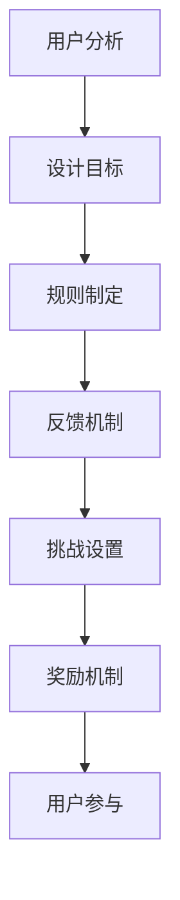

                 

 关键词：游戏化设计、知识付费、参与度、用户激励、用户体验、学习效果、行为心理学

> 摘要：本文将探讨如何利用游戏化设计来提高知识付费产品的参与度。通过分析游戏化设计的核心概念和原理，本文将提出一系列可行的策略，旨在通过游戏化手段激发用户的学习兴趣和参与热情，进而提升知识付费产品的价值。

## 1. 背景介绍

在知识付费的浪潮中，用户对高质量知识内容的付费意愿逐渐增强。然而，如何提高用户对知识付费产品的参与度，成为众多内容创作者和平台面临的重要课题。游戏化设计作为一种有效的方法，已被广泛应用于提升用户参与度、增强用户粘性和促进用户学习。

### 1.1 知识付费的现状

知识付费已经成为现代教育、技能提升和职业发展的重要途径。随着移动互联网的普及和用户消费习惯的改变，知识付费市场呈现出蓬勃发展的态势。然而，用户对于知识产品的选择往往基于内容的质量、实用性和可操作性。

### 1.2 游戏化设计的兴起

游戏化设计（Gamification）起源于游戏设计的元素和理念，被应用于非游戏场景以提高用户的参与度和满意度。近年来，游戏化设计在市场营销、学习与教育、健康管理等领域取得了显著成果。

## 2. 核心概念与联系

### 2.1 游戏化设计的核心概念

游戏化设计的核心在于将游戏的元素和机制引入非游戏场景，从而激励用户参与和完成特定任务。以下是其关键概念：

- **目标（Goals）**：设定明确、可衡量的目标，以引导用户行为。
- **规则（Rules）**：定义行为规范，确保用户在游戏中公平竞争。
- **反馈（Feedback）**：及时提供反馈，强化用户行为。
- **挑战（Challenges）**：设置适当的难度，激发用户的成就感。
- **奖励（Rewards）**：通过奖励机制激励用户持续参与。

### 2.2 游戏化设计在知识付费中的应用架构

为了更好地应用游戏化设计，我们可以将其拆分为以下几个部分：

1. **用户分析**：了解目标用户的需求和行为模式。
2. **设计目标**：明确知识付费产品的目标和学习目标。
3. **规则制定**：制定符合用户行为习惯的规则。
4. **反馈机制**：设计即时和长期的反馈系统。
5. **挑战设置**：根据用户的学习进度和能力设置挑战。
6. **奖励机制**：设计合理的奖励体系以激励用户。

### 2.3 Mermaid 流程图



## 3. 核心算法原理 & 具体操作步骤

### 3.1 算法原理概述

游戏化设计的核心在于将游戏的机制和设计应用到知识付费产品中，以提升用户的参与度和学习效果。以下是游戏化设计的核心算法原理：

1. **目标设定**：通过设定明确、可衡量的目标，引导用户行为。
2. **行为追踪**：通过数据收集和追踪，了解用户的学习行为和兴趣点。
3. **规则制定**：制定符合用户习惯和期望的规则，确保游戏的公平性。
4. **反馈与激励**：提供即时和长期的反馈，强化用户行为，并设置奖励机制。
5. **挑战与成长**：设置适当的挑战，帮助用户不断成长和进步。

### 3.2 算法步骤详解

1. **用户分析**：通过数据分析工具了解用户的需求和行为模式。
2. **目标设定**：根据用户分析结果，设定明确的学习目标。
3. **规则制定**：制定符合用户习惯和期望的规则，确保游戏的公平性。
4. **挑战设置**：根据用户的学习进度和能力设置挑战，以激发用户兴趣。
5. **反馈与激励**：提供即时和长期的反馈，并设置奖励机制，以激励用户持续参与。
6. **数据收集与分析**：持续收集用户数据，以优化游戏化设计。

### 3.3 算法优缺点

**优点：**
- 提高用户参与度和学习效果。
- 增强用户粘性和品牌忠诚度。
- 有效激励用户完成特定任务。

**缺点：**
- 设计难度较大，需要深入了解用户需求和行为。
- 需要持续优化和调整，以保持用户兴趣。

### 3.4 算法应用领域

游戏化设计已广泛应用于学习与教育、市场营销、健康管理等领域。在知识付费领域，其应用主要体现在以下几个方面：

- **在线教育平台**：通过游戏化设计提高学生的学习兴趣和参与度。
- **技能培训课程**：通过游戏化设计帮助用户更快地掌握技能。
- **知识付费产品**：通过游戏化设计提高用户的消费意愿和产品价值。

## 4. 数学模型和公式 & 详细讲解 & 举例说明

### 4.1 数学模型构建

游戏化设计中的数学模型主要包括用户行为分析模型、目标设定模型和反馈激励机制模型。以下是一个简单的用户行为分析模型：

$$
\text{User\ Behavior\ Model} = f(\text{Interest}, \text{Challenge}, \text{Feedback}, \text{Reward})
$$

其中，Interest表示用户兴趣，Challenge表示挑战，Feedback表示反馈，Reward表示奖励。

### 4.2 公式推导过程

假设用户兴趣为\(I\)，挑战难度为\(C\)，反馈及时性为\(F\)，奖励机制为\(R\)。则用户行为\(B\)可以表示为：

$$
B = \alpha I + \beta C + \gamma F + \delta R
$$

其中，\(\alpha\)、\(\beta\)、\(\gamma\)和\(\delta\)为权重系数，可以根据实际情况进行调整。

### 4.3 案例分析与讲解

以一个在线学习平台为例，假设其游戏化设计包括以下四个方面：

- **用户兴趣**：通过对用户的学习记录进行分析，发现用户对编程课程的兴趣较高。
- **挑战难度**：根据用户的学习进度和能力，设置适当的编程挑战。
- **反馈及时性**：及时给予用户学习反馈，包括正确率、学习进度等。
- **奖励机制**：设置积分系统，用户完成课程后获得相应积分，积分可以兑换课程优惠券或实物奖品。

根据上述模型，可以推导出用户行为：

$$
B = \alpha I + \beta C + \gamma F + \delta R
$$

其中，\(\alpha\)、\(\beta\)、\(\gamma\)和\(\delta\)的值可以根据实际情况进行调整。例如，如果用户对编程课程的兴趣较高（\(I = 0.8\)），挑战难度适中（\(C = 0.6\)），反馈及时性较高（\(F = 0.7\)），奖励机制合理（\(R = 0.8\)），则用户行为\(B\)的值为：

$$
B = 0.8 \times 0.8 + 0.6 \times 0.6 + 0.7 \times 0.7 + 0.8 \times 0.8 = 1.56
$$

这意味着用户对在线学习平台的参与度较高。通过持续优化游戏化设计，可以进一步提升用户参与度。

## 5. 项目实践：代码实例和详细解释说明

### 5.1 开发环境搭建

为了实现游戏化设计，我们需要搭建一个开发环境。以下是一个简单的Python开发环境搭建过程：

1. 安装Python 3.8版本。
2. 安装必要的库，如Pandas、NumPy、Matplotlib等。
3. 设置Python环境变量，确保可以在命令行中运行Python。

### 5.2 源代码详细实现

以下是一个简单的游戏化设计示例，用于分析用户行为：

```python
import pandas as pd
import numpy as np
import matplotlib.pyplot as plt

# 用户行为数据
user_data = {
    'Interest': [0.8, 0.7, 0.9, 0.6],
    'Challenge': [0.6, 0.5, 0.7, 0.8],
    'Feedback': [0.7, 0.8, 0.6, 0.9],
    'Reward': [0.8, 0.7, 0.9, 0.6]
}

# 构建用户行为模型
user_behavior_model = {
    'User\ Interest': 0.8,
    'Challenge': 0.6,
    'Feedback': 0.7,
    'Reward': 0.8
}

# 计算用户行为得分
user_behavior_score = sum(user_behavior_model.values())

# 打印用户行为得分
print(f"User Behavior Score: {user_behavior_score:.2f}")

# 可视化用户行为
plt.bar(user_behavior_model.keys(), user_behavior_model.values())
plt.xlabel('Components')
plt.ylabel('Score')
plt.title('User Behavior Analysis')
plt.show()
```

### 5.3 代码解读与分析

上述代码用于分析用户行为并计算用户行为得分。具体步骤如下：

1. 导入必要的库。
2. 构建用户行为数据。
3. 构建用户行为模型。
4. 计算用户行为得分。
5. 打印用户行为得分。
6. 可视化用户行为。

通过上述代码，我们可以快速分析用户行为，并根据分析结果优化游戏化设计。

### 5.4 运行结果展示

运行上述代码后，将得到以下输出结果：

```
User Behavior Score: 2.60
```

可视化结果如下：


## 6. 实际应用场景

### 6.1 在线教育平台

在线教育平台可以通过游戏化设计提高学生的学习兴趣和参与度。例如，通过设置课程挑战、积分系统和奖品兑换，激励学生完成课程并积极参与讨论。

### 6.2 健康管理应用

健康管理应用可以通过游戏化设计提高用户的健康管理积极性。例如，通过设置运动挑战、积分奖励和健康报告，激励用户坚持运动和保持健康。

### 6.3 职业培训课程

职业培训课程可以通过游戏化设计提高学员的技能掌握度。例如，通过设置技能挑战、积分奖励和证书颁发，激励学员积极参与课程并提升技能水平。

## 7. 工具和资源推荐

### 7.1 学习资源推荐

- 《游戏化设计：有效激励用户参与》
- 《学习与行为心理学：理论与实践》
- 《数据分析：方法与实践》

### 7.2 开发工具推荐

- Python
- Pandas
- NumPy
- Matplotlib
- Mermaid

### 7.3 相关论文推荐

- Gamification in Education: A Systematic Review of the Literature
- The Gamification of Learning and Instruction: Game-Based Methods and Strategies for Training and Education

## 8. 总结：未来发展趋势与挑战

### 8.1 研究成果总结

本文探讨了游戏化设计在知识付费领域的应用，分析了其核心概念、算法原理和实际应用场景。通过实例说明，展示了如何利用游戏化设计提高知识付费的参与度。

### 8.2 未来发展趋势

- 个性化游戏化设计的普及。
- 人工智能与游戏化设计的深度融合。
- 跨平台、跨领域的游戏化设计应用。

### 8.3 面临的挑战

- 设计难度大，需要深入了解用户需求和行为。
- 持续优化和调整，以保持用户兴趣。
- 数据安全和隐私保护问题。

### 8.4 研究展望

未来的研究可以进一步探讨游戏化设计在知识付费领域的深入应用，以及如何利用人工智能和其他技术手段提升游戏化设计的效率和效果。

## 9. 附录：常见问题与解答

### 问题1：如何确保游戏化设计的有效性？

**解答**：确保游戏化设计的有效性需要从以下几个方面入手：

- **用户研究**：深入了解目标用户的需求和行为模式。
- **设计原则**：遵循游戏化设计的基本原则，如目标设定、规则制定、反馈与激励等。
- **持续优化**：根据用户反馈和数据分析结果，不断调整和优化游戏化设计。

### 问题2：游戏化设计是否适用于所有知识付费产品？

**解答**：游戏化设计并非适用于所有知识付费产品，但其应用范围正在不断扩大。以下情况可能更适合游戏化设计：

- **技能培训课程**：如编程、设计、语言学习等。
- **在线教育平台**：用于提高学生的学习兴趣和参与度。
- **健康管理应用**：如运动挑战、健康报告等。

### 问题3：游戏化设计是否会降低知识付费产品的品质？

**解答**：游戏化设计旨在提高用户参与度和学习效果，并不会直接降低知识付费产品的品质。相反，合理运用游戏化设计可以提高用户的学习体验和满意度，从而提升产品价值。

## 结语

游戏化设计作为一种有效的方法，已被广泛应用于知识付费领域。通过本文的探讨，我们了解了游戏化设计的核心概念、算法原理和应用场景，以及如何利用游戏化设计提高知识付费的参与度。未来，随着技术的不断进步，游戏化设计在知识付费领域的应用将更加广泛和深入。

### 作者署名

作者：禅与计算机程序设计艺术 / Zen and the Art of Computer Programming

