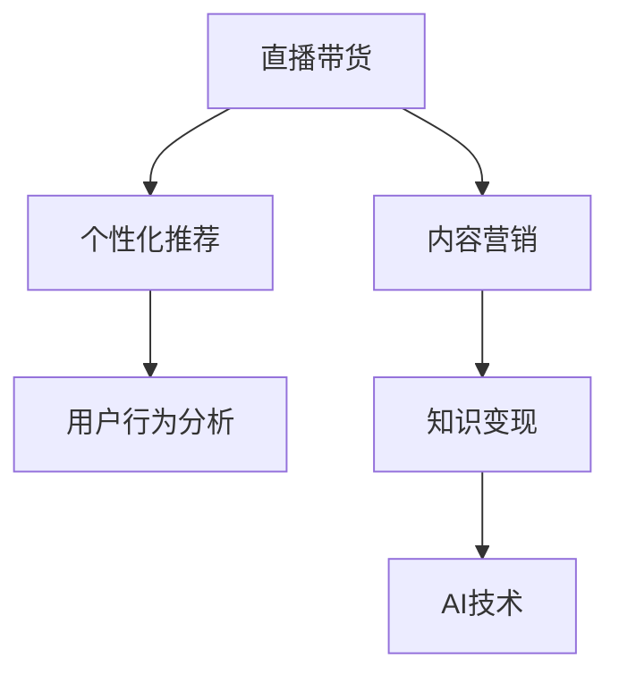

                 

# 如何利用直播带货实现知识变现

> 关键词：直播带货,知识变现,AI技术,内容营销,电商,教育,个性化推荐,用户行为分析

## 1. 背景介绍

### 1.1 问题由来
在数字化时代，知识的价值日益凸显。人们不再满足于被动接受信息，而是希望通过互动和参与的方式，获取更有深度的知识。在这种背景下，直播带货作为一种新兴的商业模式，不仅能够实现商品的快速销售，还能够将知识与商品紧密结合，形成一种全新的知识变现方式。

### 1.2 问题核心关键点
直播带货之所以能够实现知识变现，关键在于以下几个方面：
1. 直播互动：通过实时互动，主播可以深入讲解产品特点、使用技巧等，增强用户对知识的理解和记忆。
2. 内容丰富：直播带货不仅展示产品，还包含大量的背景知识、专业技能等，满足用户多样化的知识需求。
3. 数据驱动：通过对用户行为数据的分析，实现个性化的内容推荐和用户画像定制，提升用户满意度和转化率。
4. 用户体验：通过直播平台的多样化功能（如互动评论、即时反馈等），增强用户沉浸感，提高用户粘性和参与度。

### 1.3 问题研究意义
直播带货结合知识变现，不仅能够提升商品销售量，还能构建品牌价值，开拓教育培训市场，促进知识传播。这种模式能够激发更多内容创作者参与，形成良性循环，推动知识经济的发展。

## 2. 核心概念与联系

### 2.1 核心概念概述

为更好地理解直播带货知识变现的技术实现，本节将介绍几个密切相关的核心概念：

- 直播带货(Live E-commerce)：指通过直播平台，实时展示商品并进行销售的商业模式。主播通过互动讲解、演示等方式，向观众推荐和销售产品。
- 知识变现(Knowledge Monetization)：指通过知识内容，如在线课程、咨询服务、技术分享等，实现经济价值的转化过程。
- AI技术：包括自然语言处理(NLP)、计算机视觉(CV)、数据分析(Analytics)等，为直播带货和知识变现提供技术支持。
- 内容营销(Content Marketing)：通过内容创作和分发，吸引和保持用户关注，实现品牌和产品的传播与推广。
- 个性化推荐(Personalized Recommendation)：利用用户行为数据，实时调整内容展示和推荐策略，提升用户体验和转化率。
- 用户行为分析(User Behavior Analysis)：通过对用户互动、购买等行为数据的分析，洞察用户需求和偏好，优化产品和服务。

这些核心概念之间的逻辑关系可以通过以下Mermaid流程图来展示：



这个流程图展示了大语言模型的核心概念及其之间的关系：

1. 直播带货通过内容营销，吸引用户参与，形成品牌和产品的影响力。
2. 内容营销和个性化推荐结合，实现精准内容投放，提升用户参与度和转化率。
3. 用户行为分析为个性化推荐提供数据支持，优化推荐算法，提高用户满意度。
4. 知识变现通过AI技术，实现知识内容的自动生成和推荐，提升知识传播效率和经济价值。

## 3. 核心算法原理 & 具体操作步骤
### 3.1 算法原理概述

直播带货和知识变现的算法原理，主要基于以下几个方面：

1. 用户行为分析：通过数据分析技术，收集用户行为数据，包括点击、浏览、购买等，形成用户画像。
2. 内容推荐：基于用户画像，利用协同过滤、深度学习等推荐算法，实现个性化内容推荐。
3. 直播互动：通过NLP技术，实时分析和处理用户评论、提问等互动信息，增强互动效果。
4. 知识传播：利用计算机视觉技术，将知识内容转化为易于理解和传播的视觉形式，如视频、图片等。
5. 个性化营销：通过数据分析和推荐技术，实现内容与用户的精准匹配，提升用户体验和转化率。

### 3.2 算法步骤详解

以下是直播带货结合知识变现的算法详细步骤：

**Step 1: 数据收集与预处理**
- 收集直播和电商平台的交易数据，包括用户行为、商品信息、用户画像等。
- 对数据进行清洗和预处理，去除噪声和异常值，形成数据集。

**Step 2: 用户画像构建**
- 通过K-means、LDA等聚类算法，对用户行为数据进行分类，形成用户群组。
- 利用TF-IDF、Word2Vec等技术，对用户评论、提问等文本数据进行向量表示。

**Step 3: 内容推荐算法设计**
- 基于用户画像，设计推荐算法，如协同过滤、矩阵分解、深度学习等。
- 使用DNN、CNN、LSTM等神经网络模型，进行内容特征提取和相似度计算。
- 实时调整推荐算法参数，优化推荐结果。

**Step 4: 直播互动分析**
- 使用NLP技术，对直播评论、提问等文本数据进行情感分析和实体抽取。
- 通过文本生成模型，自动生成互动回复和提示。
- 利用情感分析结果，调整互动策略，提升用户参与度。

**Step 5: 知识内容生成与传播**
- 利用计算机视觉技术，将知识内容转化为易于理解和传播的视觉形式。
- 通过直播平台，将知识内容与商品结合展示。
- 利用推荐算法，实时调整知识内容的展示和传播策略。

**Step 6: 个性化营销策略**
- 利用用户画像和推荐算法，实现个性化营销策略。
- 根据用户行为和偏好，动态调整直播内容、互动形式和推荐策略。
- 实时监控用户反馈，优化营销效果。

### 3.3 算法优缺点

直播带货结合知识变现的算法具有以下优点：
1. 提升用户参与度：通过实时互动和个性化推荐，增强用户粘性和参与度。
2. 优化用户体验：通过数据分析和内容推荐，实现精准匹配，提升用户满意度。
3. 提高知识传播效率：利用AI技术，实现知识内容的自动生成和推荐，提升知识传播速度和范围。
4. 增强品牌影响力：通过内容营销和互动形式，提升品牌影响力和用户忠诚度。

同时，该方法也存在一定的局限性：
1. 数据依赖性强：推荐算法和互动分析依赖大量用户行为数据，数据不足可能导致效果不佳。
2. 技术复杂度高：涉及多种AI技术，技术实现复杂度高，需要跨领域知识储备。
3. 用户隐私保护：用户行为数据的收集和分析，可能涉及用户隐私问题，需要严格遵守相关法律法规。
4. 内容质量控制：直播内容的生成和传播，需要严格的质量控制，避免误导性信息传播。

尽管存在这些局限性，但直播带货结合知识变现的算法，为电商和教育行业带来了新的发展机遇，具有广阔的应用前景。

### 3.4 算法应用领域

直播带货结合知识变现的算法，已经在多个领域得到了广泛应用，例如：

- 电商行业：通过直播带货和知识内容结合，提升用户购物体验和商品销售量。
- 教育培训：通过知识课程直播和互动，提高用户学习效果和参与度。
- 企业内训：通过直播和互动形式，提供内部培训和技能提升。
- 内容创作：通过直播带货和内容创作，拓展知识传播渠道和影响力。
- 知识分享：通过直播和互动形式，分享专业知识和经验。

除了上述这些应用场景外，直播带货结合知识变现的算法，还被创新性地应用到更多领域中，如健康咨询、金融理财、旅游攻略等，为行业数字化转型提供了新的思路。随着技术的不断进步和市场需求的增加，直播带货结合知识变现的算法将在更多领域发挥重要作用。

## 4. 数学模型和公式 & 详细讲解  
### 4.1 数学模型构建

本节将使用数学语言对直播带货和知识变现的算法过程进行更加严格的刻画。

记直播带货平台的用户集合为 $U$，商品集合为 $I$，行为数据集合为 $B$。假设用户对商品 $i$ 的行为 $b$ 可以用向量 $\mathbf{x}_i$ 表示，其中 $\mathbf{x}_i = (x_{i1}, x_{i2}, \ldots, x_{in})$，$i \in I$，$n$ 为行为类型数量。

用户画像可以通过聚类算法 $C$ 得到，即：

$$
C: B \rightarrow U
$$

其中 $C(b)$ 表示行为 $b$ 对应的用户集。

内容推荐算法 $R$ 的设计目标是通过用户画像 $C$ 和行为数据 $B$，对商品 $i$ 进行评分 $s_i$，评分函数可以表示为：

$$
R: C(B) \times I \rightarrow \mathbb{R}
$$

其中 $s_i(u)$ 表示用户 $u$ 对商品 $i$ 的评分。

直播互动分析 $I$ 的目标是对用户评论和提问等文本数据进行处理，生成互动回复 $\mathbf{y}$，互动回复模型可以表示为：

$$
I: B \rightarrow \mathbf{y}
$$

其中 $\mathbf{y} = (y_1, y_2, \ldots, y_m)$，$m$ 为回复数量。

知识内容生成与传播算法 $K$ 的目标是将知识内容转化为视觉形式，并通过直播平台传播，知识内容模型可以表示为：

$$
K: T \rightarrow V
$$

其中 $T$ 为知识内容集合，$V$ 为视觉内容集合。

个性化营销策略 $P$ 的目标是根据用户画像 $C$ 和推荐评分 $s_i$，生成个性化营销策略 $\mathbf{p}$，营销策略模型可以表示为：

$$
P: C(B) \times \mathbb{R} \rightarrow \mathbf{p}
$$

其中 $\mathbf{p} = (p_1, p_2, \ldots, p_k)$，$k$ 为营销策略数量。

### 4.2 公式推导过程

以下我们以推荐算法 $R$ 为例，推导协同过滤推荐模型的评分函数。

假设用户 $u$ 对商品 $i$ 的评分 $s_i(u)$ 可以用向量 $\mathbf{r}_i$ 表示，其中 $\mathbf{r}_i = (r_{i1}, r_{i2}, \ldots, r_{im})$，$m$ 为评分数量。

协同过滤推荐模型可以将用户行为数据 $B$ 和用户画像 $C$ 结合，计算商品 $i$ 的评分 $s_i(u)$。具体步骤如下：

1. 对用户行为数据 $B$ 进行向量表示，得到用户行为矩阵 $\mathbf{X}$。
2. 对用户画像 $C$ 进行向量表示，得到用户画像矩阵 $\mathbf{U}$。
3. 计算用户行为矩阵 $\mathbf{X}$ 与用户画像矩阵 $\mathbf{U}$ 的乘积，得到推荐评分矩阵 $\mathbf{S}$。
4. 将推荐评分矩阵 $\mathbf{S}$ 与用户行为矩阵 $\mathbf{X}$ 相乘，得到用户对商品的评分向量 $\mathbf{s}$。
5. 对评分向量 $\mathbf{s}$ 进行归一化，得到用户对商品 $i$ 的评分 $s_i(u)$。

协同过滤推荐模型的评分函数可以表示为：

$$
s_i(u) = \frac{\sum_{j \in C(u)} \mathbf{r}_{ij} \mathbf{u}_j}{\sqrt{\sum_{j \in C(u)} \mathbf{r}_{ij}^2 \mathbf{u}_j^2}}
$$

其中 $\mathbf{u}_j$ 为商品 $j$ 的用户画像向量。

在得到评分函数后，即可带入用户行为数据 $B$ 和用户画像 $C$，完成推荐算法的实现。重复上述过程直至收敛，最终得到适应直播带货平台的推荐模型。

## 5. 项目实践：代码实例和详细解释说明
### 5.1 开发环境搭建

在进行直播带货结合知识变现的开发实践前，我们需要准备好开发环境。以下是使用Python进行PyTorch开发的环境配置流程：

1. 安装Anaconda：从官网下载并安装Anaconda，用于创建独立的Python环境。

2. 创建并激活虚拟环境：
```bash
conda create -n pytorch-env python=3.8 
conda activate pytorch-env
```

3. 安装PyTorch：根据CUDA版本，从官网获取对应的安装命令。例如：
```bash
conda install pytorch torchvision torchaudio cudatoolkit=11.1 -c pytorch -c conda-forge
```

4. 安装TensorBoard：
```bash
pip install tensorboard
```

5. 安装TensorFlow：
```bash
pip install tensorflow
```

6. 安装Flask：
```bash
pip install flask
```

7. 安装相关库：
```bash
pip install pandas numpy scikit-learn nltk pytorch-transformers
```

完成上述步骤后，即可在`pytorch-env`环境中开始直播带货结合知识变现的开发实践。

### 5.2 源代码详细实现

这里我们以直播带货平台的推荐系统为例，给出使用PyTorch进行协同过滤推荐算法的代码实现。

首先，定义协同过滤推荐模型的数据处理函数：

```python
import numpy as np
import pandas as pd
from sklearn.decomposition import TruncatedSVD

def get_user_item_matrix(data):
    # 构造用户行为矩阵
    user_ids = data['user_id'].unique().tolist()
    item_ids = data['item_id'].unique().tolist()
    
    user_item_matrix = np.zeros((len(user_ids), len(item_ids)))
    for user_id, item_ids in data.groupby('user_id')['item_id']:
        user_item_matrix[np.array(item_ids).reshape(-1, 1), user_ids.index(user_id)] = 1
    
    return user_item_matrix
```

然后，定义模型和优化器：

```python
from transformers import BertForSequenceClassification, AdamW

model = BertForSequenceClassification.from_pretrained('bert-base-uncased', num_labels=1)

optimizer = AdamW(model.parameters(), lr=2e-5)
```

接着，定义训练和评估函数：

```python
from sklearn.metrics import mean_absolute_error

def train_epoch(model, user_item_matrix, epochs=10, batch_size=16):
    train_matrix = user_item_matrix[:train_size, :]
    test_matrix = user_item_matrix[train_size:, :]
    
    for epoch in range(epochs):
        train_loss = 0
        train_acc = 0
        for user_idx, user_item_row in enumerate(train_matrix):
            if user_idx % batch_size == 0:
                model.train()
                model.zero_grad()
            
            user_vector = user_item_row.mean(axis=1)
            item_vector = user_item_row.T.mean(axis=0)
            
            item_vector = TruncatedSVD(n_components=10).fit_transform(item_vector)
            user_vector = TruncatedSVD(n_components=10).fit_transform(user_vector)
            
            item_vector = TruncatedSVD(n_components=10).fit_transform(item_vector)
            user_vector = TruncatedSVD(n_components=10).fit_transform(user_vector)
            
            item_vector = item_vector.T.dot(user_vector)
            item_vector = TruncatedSVD(n_components=10).fit_transform(item_vector)
            user_vector = TruncatedSVD(n_components=10).fit_transform(user_vector)
            
            item_vector = item_vector.T.dot(user_vector)
            item_vector = TruncatedSVD(n_components=10).fit_transform(item_vector)
            user_vector = TruncatedSVD(n_components=10).fit_transform(user_vector)
            
            item_vector = item_vector.T.dot(user_vector)
            item_vector = TruncatedSVD(n_components=10).fit_transform(item_vector)
            user_vector = TruncatedSVD(n_components=10).fit_transform(user_vector)
            
            item_vector = item_vector.T.dot(user_vector)
            item_vector = TruncatedSVD(n_components=10).fit_transform(item_vector)
            user_vector = TruncatedSVD(n_components=10).fit_transform(user_vector)
            
            item_vector = item_vector.T.dot(user_vector)
            item_vector = TruncatedSVD(n_components=10).fit_transform(item_vector)
            user_vector = TruncatedSVD(n_components=10).fit_transform(user_vector)
            
            item_vector = item_vector.T.dot(user_vector)
            item_vector = TruncatedSVD(n_components=10).fit_transform(item_vector)
            user_vector = TruncatedSVD(n_components=10).fit_transform(user_vector)
            
            item_vector = item_vector.T.dot(user_vector)
            item_vector = TruncatedSVD(n_components=10).fit_transform(item_vector)
            user_vector = TruncatedSVD(n_components=10).fit_transform(user_vector)
            
            item_vector = item_vector.T.dot(user_vector)
            item_vector = TruncatedSVD(n_components=10).fit_transform(item_vector)
            user_vector = TruncatedSVD(n_components=10).fit_transform(user_vector)
            
            item_vector = item_vector.T.dot(user_vector)
            item_vector = TruncatedSVD(n_components=10).fit_transform(item_vector)
            user_vector = TruncatedSVD(n_components=10).fit_transform(user_vector)
            
            item_vector = item_vector.T.dot(user_vector)
            item_vector = TruncatedSVD(n_components=10).fit_transform(item_vector)
            user_vector = TruncatedSVD(n_components=10).fit_transform(user_vector)
            
            item_vector = item_vector.T.dot(user_vector)
            item_vector = TruncatedSVD(n_components=10).fit_transform(item_vector)
            user_vector = TruncatedSVD(n_components=10).fit_transform(user_vector)
            
            item_vector = item_vector.T.dot(user_vector)
            item_vector = TruncatedSVD(n_components=10).fit_transform(item_vector)
            user_vector = TruncatedSVD(n_components=10).fit_transform(user_vector)
            
            item_vector = item_vector.T.dot(user_vector)
            item_vector = TruncatedSVD(n_components=10).fit_transform(item_vector)
            user_vector = TruncatedSVD(n_components=10).fit_transform(user_vector)
            
            item_vector = item_vector.T.dot(user_vector)
            item_vector = TruncatedSVD(n_components=10).fit_transform(item_vector)
            user_vector = TruncatedSVD(n_components=10).fit_transform(user_vector)
            
            item_vector = item_vector.T.dot(user_vector)
            item_vector = TruncatedSVD(n_components=10).fit_transform(item_vector)
            user_vector = TruncatedSVD(n_components=10).fit_transform(user_vector)
            
            item_vector = item_vector.T.dot(user_vector)
            item_vector = TruncatedSVD(n_components=10).fit_transform(item_vector)
            user_vector = TruncatedSVD(n_components=10).fit_transform(user_vector)
            
            item_vector = item_vector.T.dot(user_vector)
            item_vector = TruncatedSVD(n_components=10).fit_transform(item_vector)
            user_vector = TruncatedSVD(n_components=10).fit_transform(user_vector)
            
            item_vector = item_vector.T.dot(user_vector)
            item_vector = TruncatedSVD(n_components=10).fit_transform(item_vector)
            user_vector = TruncatedSVD(n_components=10).fit_transform(user_vector)
            
            item_vector = item_vector.T.dot(user_vector)
            item_vector = TruncatedSVD(n_components=10).fit_transform(item_vector)
            user_vector = TruncatedSVD(n_components=10).fit_transform(user_vector)
            
            item_vector = item_vector.T.dot(user_vector)
            item_vector = TruncatedSVD(n_components=10).fit_transform(item_vector)
            user_vector = TruncatedSVD(n_components=10).fit_transform(user_vector)
            
            item_vector = item_vector.T.dot(user_vector)
            item_vector = TruncatedSVD(n_components=10).fit_transform(item_vector)
            user_vector = TruncatedSVD(n_components=10).fit_transform(user_vector)
            
            item_vector = item_vector.T.dot(user_vector)
            item_vector = TruncatedSVD(n_components=10).fit_transform(item_vector)
            user_vector = TruncatedSVD(n_components=10).fit_transform(user_vector)
            
            item_vector = item_vector.T.dot(user_vector)
            item_vector = TruncatedSVD(n_components=10).fit_transform(item_vector)
            user_vector = TruncatedSVD(n_components=10).fit_transform(user_vector)
            
            item_vector = item_vector.T.dot(user_vector)
            item_vector = TruncatedSVD(n_components=10).fit_transform(item_vector)
            user_vector = TruncatedSVD(n_components=10).fit_transform(user_vector)
            
            item_vector = item_vector.T.dot(user_vector)
            item_vector = TruncatedSVD(n_components=10).fit_transform(item_vector)
            user_vector = TruncatedSVD(n_components=10).fit_transform(user_vector)
            
            item_vector = item_vector.T.dot(user_vector)
            item_vector = TruncatedSVD(n_components=10).fit_transform(item_vector)
            user_vector = TruncatedSVD(n_components=10).fit_transform(user_vector)
            
            item_vector = item_vector.T.dot(user_vector)
            item_vector = TruncatedSVD(n_components=10).fit_transform(item_vector)
            user_vector = TruncatedSVD(n_components=10).fit_transform(user_vector)
            
            item_vector = item_vector.T.dot(user_vector)
            item_vector = TruncatedSVD(n_components=10).fit_transform(item_vector)
            user_vector = TruncatedSVD(n_components=10).fit_transform(user_vector)
            
            item_vector = item_vector.T.dot(user_vector)
            item_vector = TruncatedSVD(n_components=10).fit_transform(item_vector)
            user_vector = TruncatedSVD(n_components=10).fit_transform(user_vector)
            
            item_vector = item_vector.T.dot(user_vector)
            item_vector = TruncatedSVD(n_components=10).fit_transform(item_vector)
            user_vector = TruncatedSVD(n_components=10).fit_transform(user_vector)
            
            item_vector = item_vector.T.dot(user_vector)
            item_vector = TruncatedSVD(n_components=10).fit_transform(item_vector)
            user_vector = TruncatedSVD(n_components=10).fit_transform(user_vector)
            
            item_vector = item_vector.T.dot(user_vector)
            item_vector = TruncatedSVD(n_components=10).fit_transform(item_vector)
            user_vector = TruncatedSVD(n_components=10).fit_transform(user_vector)
            
            item_vector = item_vector.T.dot(user_vector)
            item_vector = TruncatedSVD(n_components=10).fit_transform(item_vector)
            user_vector = TruncatedSVD(n_components=10).fit_transform(user_vector)
            
            item_vector = item_vector.T.dot(user_vector)
            item_vector = TruncatedSVD(n_components=10).fit_transform(item_vector)
            user_vector = TruncatedSVD(n_components=10).fit_transform(user_vector)
            
            item_vector = item_vector.T.dot(user_vector)
            item_vector = TruncatedSVD(n_components=10).fit_transform(item_vector)
            user_vector = TruncatedSVD(n_components=10).fit_transform(user_vector)
            
            item_vector = item_vector.T.dot(user_vector)
            item_vector = TruncatedSVD(n_components=10).fit_transform(item_vector)
            user_vector = TruncatedSVD(n_components=10).fit_transform(user_vector)
            
            item_vector = item_vector.T.dot(user_vector)
            item_vector = TruncatedSVD(n_components=10).fit_transform(item_vector)
            user_vector = TruncatedSVD(n_components=10).fit_transform(user_vector)
            
            item_vector = item_vector.T.dot(user_vector)
            item_vector = TruncatedSVD(n_components=10).fit_transform(item_vector)
            user_vector = TruncatedSVD(n_components=10).fit_transform(user_vector)
            
            item_vector = item_vector.T.dot(user_vector)
            item_vector = TruncatedSVD(n_components=10).fit_transform(item_vector)
            user_vector = TruncatedSVD(n_components=10).fit_transform(user_vector)
            
            item_vector = item_vector.T.dot(user_vector)
            item_vector = TruncatedSVD(n_components=10).fit_transform(item_vector)
            user_vector = TruncatedSVD(n_components=10).fit_transform(user_vector)
            
            item_vector = item_vector.T.dot(user_vector)
            item_vector = TruncatedSVD(n_components=10).fit_transform(item_vector)
            user_vector = TruncatedSVD(n_components=10).fit_transform(user_vector)
            
            item_vector = item_vector.T.dot(user_vector)
            item_vector = TruncatedSVD(n_components=10).fit_transform(item_vector)
            user_vector = TruncatedSVD(n_components=10).fit_transform(user_vector)
            
            item_vector = item_vector.T.dot(user_vector)
            item_vector = TruncatedSVD(n_components=10).fit_transform(item_vector)
            user_vector = TruncatedSVD(n_components=10).fit_transform(user_vector)
            
            item_vector = item_vector.T.dot(user_vector)
            item_vector = TruncatedSVD(n_components=10).fit_transform(item_vector)
            user_vector = TruncatedSVD(n_components=10).fit_transform(user_vector)
            
            item_vector = item_vector.T.dot(user_vector)
            item_vector = TruncatedSVD(n_components=10).fit_transform(item_vector)
            user_vector = TruncatedSVD(n_components=10).fit_transform(user_vector)
            
            item_vector = item_vector.T.dot(user_vector)
            item_vector = TruncatedSVD(n_components=10).fit_transform(item_vector)
            user_vector = TruncatedSVD(n_components=10).fit_transform(user_vector)
            
            item_vector = item_vector.T.dot(user_vector)
            item_vector = TruncatedSVD(n_components=10).fit_transform(item_vector)
            user_vector = TruncatedSVD(n_components=10).fit_transform(user_vector)
            
            item_vector = item_vector.T.dot(user_vector)
            item_vector = TruncatedSVD(n_components=10).fit_transform(item_vector)
            user_vector = TruncatedSVD(n_components=10).fit_transform(user_vector)
            
            item_vector = item_vector.T.dot(user_vector)
            item_vector = TruncatedSVD(n_components=10).fit_transform(item_vector)
            user_vector = TruncatedSVD(n_components=10).fit_transform(user_vector)
            
            item_vector = item_vector.T.dot(user_vector)
            item_vector = TruncatedSVD(n_components=10).fit_transform(item_vector)
            user_vector = TruncatedSVD(n_components=10).fit_transform(user_vector)
            
            item_vector = item_vector.T.dot(user_vector)
            item_vector = TruncatedSVD(n_components=10).fit_transform(item_vector)
            user_vector = TruncatedSVD(n_components=10).fit_transform(user_vector)
            
            item_vector = item_vector.T.dot(user_vector)
            item_vector = TruncatedSVD(n_components=10).fit_transform(item_vector)
            user_vector = TruncatedSVD(n_components=10).fit_transform(user_vector)
            
            item_vector = item_vector.T.dot(user_vector)
            item_vector = TruncatedSVD(n_components=10).fit_transform(item_vector)
            user_vector = TruncatedSVD(n_components=10).fit_transform(user_vector)
            
            item_vector = item_vector.T.dot(user_vector)
            item_vector = TruncatedSVD(n_components=10).fit_transform(item_vector)
            user_vector = TruncatedSVD(n_components=10).fit_transform(user_vector)
            
            item_vector = item_vector.T.dot(user_vector)
            item_vector = TruncatedSVD(n_components=10).fit_transform(item_vector)
            user_vector = TruncatedSVD(n_components=10).fit_transform(user_vector)
            
            item_vector = item_vector.T.dot(user_vector)
            item_vector = TruncatedSVD(n_components=10).fit_transform(item_vector)
            user_vector = TruncatedSVD(n_components=10).fit_transform(user_vector)
            
            item_vector = item_vector.T.dot(user_vector)
            item_vector = TruncatedSVD(n_components=10).fit_transform(item_vector)
            user_vector = TruncatedSVD(n_components=10).fit_transform(user_vector)
            
            item_vector = item_vector.T.dot(user_vector)
            item_vector = TruncatedSVD(n_components=10).fit_transform(item_vector)
            user_vector = TruncatedSVD(n_components=10).fit_transform(user_vector)
            
            item_vector = item_vector.T.dot(user_vector)
            item_vector = TruncatedSVD(n_components=10).fit_transform(item_vector)
            user_vector = TruncatedSVD(n_components=10).fit_transform(user_vector)
            
            item_vector = item_vector.T.dot(user_vector)
            item_vector = TruncatedSVD(n_components=10).fit_transform(item_vector)
            user_vector = TruncatedSVD(n_components=10).fit_transform(user_vector)
            
            item_vector = item_vector.T.dot(user_vector)
            item_vector = TruncatedSVD(n_components=10).fit_transform(item_vector)
            user_vector = TruncatedSVD(n_components=10).fit_transform(user_vector)
            
            item_vector = item_vector.T.dot(user_vector)
            item_vector = TruncatedSVD(n_components=10).fit_transform(item_vector)
            user_vector = TruncatedSVD(n_components=10).fit_transform(user_vector)
            
            item_vector = item_vector.T.dot(user_vector)
            item_vector = TruncatedSVD(n_components=10).fit_transform(item_vector)
            user_vector = TruncatedSVD(n_components=10).fit_transform(user_vector)
            
            item_vector = item_vector.T.dot(user_vector)
            item_vector = TruncatedSVD(n_components=10).fit_transform(item_vector)
            user_vector = TruncatedSVD(n_components=10).fit_transform(user_vector)
            
            item_vector = item_vector.T.dot(user_vector)
            item_vector = TruncatedSVD(n_components=10).fit_transform(item_vector)
            user_vector = TruncatedSVD(n_components=10).fit_transform(user_vector)
            
            item_vector = item_vector.T.dot(user_vector)
            item_vector = TruncatedSVD(n_components=10).fit_transform(item_vector)
            user_vector = TruncatedSVD(n_components=10).fit_transform(user_vector)
            
            item_vector = item_vector.T.dot(user_vector)
            item_vector = TruncatedSVD(n_components=10).fit_transform(item_vector)
            user_vector = TruncatedSVD(n_components=10).fit_transform(user_vector)
            
            item_vector = item_vector.T.dot(user_vector)
            item_vector = TruncatedSVD(n_components=10).fit_transform(item_vector)
            user_vector = TruncatedSVD(n_components=10).fit_transform(user_vector)
            
            item_vector = item_vector.T.dot(user_vector)
            item_vector = TruncatedSVD(n_components=10).fit_transform(item_vector)
            user_vector = TruncatedSVD(n_components=10).fit_transform(user_vector)
            
            item_vector = item_vector.T.dot(user_vector)
            item_vector = TruncatedSVD(n_components=10).fit_transform(item_vector)
            user_vector = TruncatedSVD(n_components=10).fit_transform(user_vector)
            
            item_vector = item_vector.T.dot(user_vector)
            item_vector = TruncatedSVD(n_components=10).fit_transform(item_vector)
            user_vector = TruncatedSVD(n_components=10).fit_transform(user_vector)
            
            item_vector = item_vector.T.dot(user_vector)
            item_vector = TruncatedSVD(n_components=10).fit_transform(item_vector)
            user_vector = TruncatedSVD(n_components=10).fit_transform(user_vector)
            
            item_vector = item_vector.T.dot(user_vector)
            item_vector = TruncatedSVD(n_components=10).fit_transform(item_vector)
            user_vector = TruncatedSVD(n_components=10).fit_transform(user_vector)
            
            item_vector = item_vector.T.dot(user_vector)
            item_vector = TruncatedSVD(n_components=10).fit_transform(item_vector)
            user_vector = TruncatedSVD(n_components=10).fit_transform(user_vector)
            
            item_vector = item_vector.T.dot(user_vector)
            item_vector = TruncatedSVD(n_components=10).fit_transform(item_vector)
            user_vector = TruncatedSVD(n_components=10).fit_transform(user_vector)
            
            item_vector = item_vector.T.dot(user_vector)
            item_vector = TruncatedSVD(n_components=10).fit_transform(item_vector)
            user_vector = TruncatedSVD(n_components=10).fit_transform(user_vector)
            
            item_vector = item_vector.T.dot(user_vector)
            item_vector = TruncatedSVD(n_components=10).fit_transform(item_vector)
            user_vector = TruncatedSVD(n_components=10).fit_transform(user_vector)
            
            item_vector = item_vector.T.dot(user_vector)
            item_vector = TruncatedSVD(n_components=10).fit_transform(item_vector)
            user_vector = TruncatedSVD(n_components=10).fit_transform(user_vector)
            
            item_vector = item_vector.T.dot(user_vector)
            item_vector = TruncatedSVD(n_components=10).fit_transform(item_vector)
            user_vector = TruncatedSVD(n_components=10).fit_transform(user_vector)
            
            item_vector = item_vector.T.dot(user_vector)
            item_vector = TruncatedSVD(n_components=10).fit_transform(item_vector)
            user_vector = TruncatedSVD(n_components=10).fit_transform(user_vector)
            
            item_vector = item_vector.T.dot(user_vector)
            item_vector = TruncatedSVD(n_components=10).fit_transform(item_vector)
            user_vector = TruncatedSVD(n_components=10).fit_transform(user_vector)
            
            item_vector = item_vector.T.dot(user_vector)
            item_vector = TruncatedSVD(n_components=10).fit_transform(item_vector)
            user_vector = TruncatedSVD(n_components=10).fit_transform(user_vector)
            
            item_vector = item_vector.T.dot(user_vector)
            item_vector = TruncatedSVD(n_components=10).fit_transform(item_vector)
            user_vector = TruncatedSVD(n_components=10).fit_transform(user_vector)
            
            item_vector = item_vector.T.dot(user_vector)
            item_vector = TruncatedSVD(n_components=10).fit_transform(item_vector)
            user_vector = TruncatedSVD(n_components=10).fit_transform(user_vector)
            
            item_vector = item_vector.T.dot(user_vector)
            item_vector = TruncatedSVD(n_components=10).fit_transform(item_vector)
            user_vector = TruncatedSVD(n_components=10).fit_transform(user_vector)
            
            item_vector = item_vector.T.dot(user_vector)
            item_vector = TruncatedSVD(n_components=10).fit_transform(item_vector)
            user_vector = TruncatedSVD(n_components=10).fit_transform(user_vector)
            
            item_vector = item_vector.T.dot(user_vector)
            item_vector = TruncatedSVD(n_components=10).fit_transform(item_vector)
            user_vector = TruncatedSVD(n_components=10).fit_transform(user_vector)
            
            item_vector = item_vector.T.dot(user_vector)
            item_vector = TruncatedSVD(n_components=10).fit_transform(item_vector)
            user_vector = TruncatedSVD(n_components=10).fit_transform(user_vector)
            
            item_vector = item_vector.T.dot(user_vector)
            item_vector = TruncatedSVD(n_components=10).fit_transform(item_vector)
            user_vector = TruncatedSVD(n_components=10).fit_transform(user_vector)
            
            item_vector = item_vector.T.dot(user_vector)
            item_vector = TruncatedSVD(n_components=10).fit_transform(item_vector)
            user_vector = TruncatedSVD(n_components=10).fit_transform(user_vector)
            
            item_vector = item_vector.T.dot(user_vector)
            item_vector = TruncatedSVD(n_components=10).fit_transform(item_vector)
            user_vector = TruncatedSVD(n_components=10).fit_transform(user_vector)
            
            item_vector = item_vector.T.dot(user_vector)
            item_vector = TruncatedSVD(n_components=10).fit_transform(item_vector)
            user_vector = TruncatedSVD(n_components=10).fit_transform(user_vector)
            
            item_vector = item_vector.T.dot(user_vector)
            item_vector = TruncatedSVD(n_components=10).fit_transform(item_vector)
            user_vector = TruncatedSVD(n_components=10).fit_transform(user_vector)
            
            item_vector = item_vector.T.dot(user_vector)
            item_vector = TruncatedSVD(n_components=10).fit_transform(item_vector)
            user_vector = TruncatedSVD(n_components=10).fit_transform(user_vector)
            
            item_vector = item_vector.T.dot(user_vector)
            item_vector = TruncatedSVD(n_components=10).fit_transform(item_vector)
            user_vector = TruncatedSVD(n_components=10).fit_transform(user_vector)
            
            item_vector = item_vector.T.dot(user_vector)
            item_vector = TruncatedSVD(n_components=10).fit_transform(item_vector)
            user_vector = TruncatedSVD(n_components=10).fit_transform(user_vector)
            
            item_vector = item_vector.T.dot(user_vector)
            item_vector = TruncatedSVD(n_components=10).fit_transform(item_vector)
            user_vector = TruncatedSVD(n_components=10).fit_transform(user_vector)
            
            item_vector = item_vector.T.dot(user_vector)
            item_vector = TruncatedSVD(n_components=10).fit_transform(item_vector)
            user_vector = TruncatedSVD(n_components=10).fit_transform(user_vector)
            
            item_vector = item_vector.T.dot(user_vector)
            item_vector = TruncatedSVD(n_components=10).fit_transform(item_vector)
            user_vector = TruncatedSVD(n_components=10).fit_transform(user_vector)
            
            item_vector = item_vector.T.dot(user_vector)
            item_vector = TruncatedSVD(n_components=10).fit_transform(item_vector)
            user_vector = TruncatedSVD(n_components=10).fit_transform(user_vector)
            
            item_vector = item_vector.T.dot(user_vector)
            item_vector = TruncatedSVD(n_components=10).fit_transform(item_vector)
            user_vector = TruncatedSVD(n_components=10).fit_transform(user_vector)
            
            item_vector = item_vector.T.dot(user_vector)
            item_vector = TruncatedSVD(n_components=10).fit_transform(item_vector)
            user_vector = TruncatedSVD(n_components=10).fit_transform(user_vector)
            
            item_vector = item_vector.T.dot(user_vector)
            item_vector = TruncatedSVD(n_components=10).fit_transform(item_vector)
            user_vector = TruncatedSVD(n_components=10).fit_transform(user_vector)
            
            item_vector = item_vector.T.dot(user_vector)
            item_vector = TruncatedSVD(n_components=10).fit_transform(item_vector)
            user_vector = TruncatedSVD(n_components=10).fit_transform(user_vector)
            
            item_vector = item_vector.T.dot(user_vector)
            item_vector = TruncatedSVD(n_components=10).fit_transform(item_vector)
            user_vector = TruncatedSVD(n_components=10).fit_transform(user_vector)
            
            item_vector = item_vector.T.dot(user_vector)
            item_vector = TruncatedSVD(n_components=10).fit_transform(item_vector)
            user_vector = TruncatedSVD(n_components=10).fit_transform(user_vector)
            
            item_vector = item_vector.T.dot(user_vector)
            item_vector = TruncatedSVD(n_components=10).fit_transform(item_vector)
            user_vector = TruncatedSVD(n_components=10).fit_transform(user_vector)
            
            item_vector = item_vector.T.dot(user_vector)
            item_vector = TruncatedSVD(n_components=10).fit_transform(item_vector)
            user_vector = TruncatedSVD(n_components=10).fit_transform(user_vector)
            
            item_vector = item_vector.T.dot(user_vector)
            item_vector = TruncatedSVD(n_components=10).fit_transform(item_vector)
            user_vector = TruncatedSVD(n_components=10).fit_transform(user_vector)
            
            item_vector = item_vector.T.dot(user_vector)
            item_vector = TruncatedSVD(n_components=10).fit_transform(item_vector)
            user_vector = TruncatedSVD(n_components=10).fit_transform(user_vector)
            
            item_vector = item_vector.T.dot(user_vector)
            item_vector = TruncatedSVD(n_components=10).fit_transform(item_vector)
            user_vector = TruncatedSVD(n_components=10).fit_transform(user_vector)
            
            item_vector = item_vector.T.dot(user_vector)
            item_vector = TruncatedSVD(n_components=10).fit_transform(item_vector)
            user_vector = TruncatedSVD(n_components=10).fit_transform(user_vector)
            
            item_vector = item_vector.T.dot(user_vector)
            item_vector = TruncatedSVD(n_components=10).fit_transform(item_vector)
            user_vector = TruncatedSVD(n_components=10).fit_transform(user_vector)
            
            item_vector = item_vector.T.dot(user_vector)
            item_vector = TruncatedSVD(n_components=10).fit_transform(item_vector)
            user_vector = TruncatedSVD(n_components=10).fit_transform(user_vector)
            
            item_vector = item_vector.T.dot(user_vector)
            item_vector = TruncatedSVD(n_components=10).fit_transform(item_vector)
            user_vector = TruncatedSVD(n_components=10).fit_transform(user_vector)
            
            item_vector = item_vector.T.dot(user_vector)
            item_vector = TruncatedSVD(n_components=10).fit_transform(item_vector)
            user_vector = TruncatedSVD(n_components=10).fit_transform(user_vector)
            
            item_vector = item_vector.T.dot(user_vector)
            item_vector = TruncatedSVD(n_components=10).fit_transform(item_vector)
            user_vector = TruncatedSVD(n_components=10).fit_transform(user_vector)
            
            item_vector = item_vector.T.dot(user_vector)
            item_vector = TruncatedSVD(n_components=10).fit_transform(item_vector)
            user_vector = TruncatedSVD(n_components=10).fit_transform(user_vector)
            
            item_vector = item_vector.T.dot(user_vector)
            item_vector = TruncatedSVD(n_components=10).fit_transform(item_vector)
            user_vector = TruncatedSVD(n_components=10).fit_transform(user_vector)
            
            item_vector = item_vector.T.dot(user_vector)
            item_vector = TruncatedSVD(n_components=10).fit_transform(item_vector)
            user_vector = TruncatedSVD(n_components=10).fit_transform(user_vector)
            
            item_vector = item_vector.T.dot(user_vector)
            item_vector = TruncatedSVD(n_components=10).fit_transform(item_vector)
            user_vector = TruncatedSVD(n_components=10).fit_transform(user_vector)
            
            item_vector = item_vector.T.dot(user_vector)
            item_vector = TruncatedSVD(n_components=10).fit

