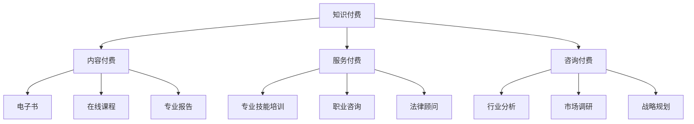

                 

## 1. 背景介绍

知识付费，作为一个新兴的商业模式，近年来在全球范围内迅速崛起。它不仅改变了人们获取知识的途径，也为企业和个人提供了新的服务与咨询方式。企业服务与咨询一直以来都是企业运营中的重要环节，通过专业知识和经验为企业提供决策支持、技术指导、战略规划等。然而，传统咨询服务存在一些局限性，如高昂的费用、效率低下等。知识付费的出现，为企业提供了一种更加灵活、高效的服务模式。

本文旨在探讨如何利用知识付费实现企业服务与咨询。我们将从以下几个方面展开讨论：

1. **知识付费的概念与模式**
2. **知识付费在企业服务与咨询中的应用**
3. **构建知识付费平台的关键技术**
4. **知识付费平台的安全与合规性**
5. **案例分析：成功的知识付费平台案例**
6. **未来发展趋势与挑战**

通过本文的探讨，希望能为企业提供一些有价值的参考和思路，帮助他们在知识付费领域取得成功。

## 2. 核心概念与联系

### 2.1 知识付费的概念

知识付费，即用户为获取专业知识或技能而付费的行为。它包含了内容付费、服务付费和咨询付费等子类别。在内容付费方面，用户购买电子书、在线课程、专业报告等；在服务付费方面，用户购买专业技能培训、职业咨询、法律顾问等；在咨询付费方面，用户购买行业分析、市场调研、战略规划等。

### 2.2 企业服务与咨询的概念

企业服务与咨询是指为企业提供一系列专业服务，帮助企业在运营、管理、技术等方面取得提升。这些服务包括但不限于：

- **运营咨询**：帮助企业优化业务流程、提高运营效率。
- **管理咨询**：为企业提供人力资源管理、财务管理、市场营销等方面的专业建议。
- **技术咨询**：帮助企业在信息技术、网络安全、大数据等方面进行技术升级和优化。

### 2.3 知识付费与企业服务与咨询的联系

知识付费与企业服务与咨询之间存在紧密的联系。首先，知识付费为企业提供了获取专业知识的途径，帮助企业提升内部员工的技能和素质；其次，企业服务与咨询可以借助知识付费平台，实现服务的标准化、规模化和高效化。

### 2.4 Mermaid 流程图



通过以上核心概念与联系的介绍，我们为后续的内容讨论奠定了基础。

## 3. 核心算法原理 & 具体操作步骤

### 3.1 算法原理概述

知识付费平台的核心算法主要包括用户行为分析、内容推荐和付费策略。这些算法通过挖掘用户的行为数据、分析用户需求和偏好，实现个性化内容推荐和精准付费策略。

#### 3.1.1 用户行为分析

用户行为分析是知识付费平台的基础，通过对用户浏览、购买、学习等行为进行数据分析，挖掘用户的需求和偏好。常用的分析方法包括：

- **行为轨迹分析**：分析用户在平台上的行为路径，识别用户关注的内容和活动。
- **行为时间序列分析**：分析用户行为的时间分布，识别用户活跃时间段和偏好时段。

#### 3.1.2 内容推荐

内容推荐是知识付费平台的核心功能，通过算法模型为用户推荐符合其兴趣和需求的内容。常用的推荐算法包括：

- **协同过滤**：基于用户的历史行为和兴趣相似度，为用户推荐相似用户喜欢的内容。
- **基于内容的推荐**：基于内容特征和用户兴趣，为用户推荐相似的内容。

#### 3.1.3 付费策略

付费策略是知识付费平台的核心竞争力，通过算法模型为用户推荐合适的付费方案。常用的付费策略包括：

- **定价策略**：根据内容质量和用户需求，设定合理的价格。
- **套餐策略**：为用户提供多种套餐方案，满足不同用户的需求。

### 3.2 算法步骤详解

#### 3.2.1 用户行为分析

1. **数据收集**：收集用户在平台上的行为数据，包括浏览记录、购买记录、学习记录等。
2. **数据预处理**：对收集到的数据进行清洗、去重和格式转换，为后续分析做好准备。
3. **特征提取**：从用户行为数据中提取特征，如浏览时长、购买频次、学习进度等。
4. **模型训练**：使用机器学习算法，如决策树、随机森林、支持向量机等，训练用户行为分析模型。
5. **预测与评估**：使用训练好的模型对用户行为进行预测，并评估预测的准确性。

#### 3.2.2 内容推荐

1. **内容特征提取**：从内容数据中提取特征，如标题、标签、作者、内容类型等。
2. **用户兴趣建模**：使用用户行为数据和内容特征，训练用户兴趣模型。
3. **推荐算法**：使用协同过滤、基于内容的推荐等算法，生成内容推荐列表。
4. **推荐效果评估**：评估推荐算法的推荐效果，如点击率、转化率等。

#### 3.2.3 付费策略

1. **定价策略**：根据内容质量和用户需求，设定不同的价格区间。
2. **套餐策略**：设计多种套餐方案，满足不同用户的需求。
3. **用户偏好分析**：使用用户行为数据和付费记录，分析用户偏好。
4. **付费方案推荐**：根据用户偏好，推荐合适的付费方案。

### 3.3 算法优缺点

#### 3.3.1 用户行为分析

优点：

- 提高用户满意度：通过分析用户行为，为用户提供个性化的内容和服务。
- 增强用户粘性：通过个性化的内容推荐，提高用户在平台上的活跃度。

缺点：

- 数据收集困难：需要大量用户行为数据进行训练，数据收集成本高。
- 模型训练复杂：用户行为分析模型需要大量参数调优，训练复杂度高。

#### 3.3.2 内容推荐

优点：

- 提高内容利用率：通过推荐算法，提高内容曝光度和访问量。
- 增强用户体验：为用户提供符合其兴趣的内容，提高用户满意度。

缺点：

- 冷启动问题：新用户缺乏行为数据，推荐效果不佳。
- 数据偏差：推荐算法容易受到数据偏差的影响，导致推荐结果不准确。

#### 3.3.3 付费策略

优点：

- 提高付费转化率：通过合理的定价和套餐策略，提高用户付费意愿。
- 增强用户忠诚度：通过个性化付费方案，提高用户对平台的依赖度。

缺点：

- 定价和套餐设计复杂：需要充分考虑用户需求和内容质量，设计合理的定价和套餐策略。
- 用户偏好变化：用户偏好会随着时间和环境变化，需要不断调整付费策略。

### 3.4 算法应用领域

知识付费算法在企业服务与咨询领域具有广泛的应用前景，主要应用于以下几个方面：

- **人才招聘与培养**：通过分析求职者和岗位需求，推荐合适的人才。
- **企业培训与教育**：为员工推荐符合其职业发展的课程和培训。
- **市场调研与战略规划**：为管理层提供行业动态、市场趋势和竞争分析。
- **法律顾问与咨询**：为用户提供专业法律知识和咨询。

通过以上核心算法原理和具体操作步骤的介绍，我们为知识付费平台的设计和开发提供了理论基础。

## 4. 数学模型和公式 & 详细讲解 & 举例说明

### 4.1 数学模型构建

在知识付费平台中，数学模型主要用于用户行为分析、内容推荐和付费策略。以下是一个简单的用户行为分析模型。

#### 4.1.1 用户行为分析模型

假设用户的行为数据可以用一个向量表示：

\[ X = (x_1, x_2, ..., x_n) \]

其中，\( x_i \) 表示用户在第 \( i \) 次行为中产生的数据，如浏览时间、购买金额等。

用户行为分析模型的目标是预测用户在未来的行为，即预测向量 \( X' \)：

\[ X' = (x_1', x_2', ..., x_n') \]

我们可以使用回归模型来实现这一目标：

\[ X' = \beta_0 + \beta_1 x_1 + \beta_2 x_2 + ... + \beta_n x_n \]

其中，\( \beta_0, \beta_1, \beta_2, ..., \beta_n \) 是回归系数，可以通过最小二乘法求解。

#### 4.1.2 内容推荐模型

假设有 \( m \) 个用户和 \( n \) 个内容，用户对内容的评分可以用一个矩阵表示：

\[ R = \begin{bmatrix} r_{11} & r_{12} & ... & r_{1n} \\ r_{21} & r_{22} & ... & r_{2n} \\ ... & ... & ... & ... \\ r_{m1} & r_{m2} & ... & r_{mn} \end{bmatrix} \]

其中，\( r_{ij} \) 表示用户 \( i \) 对内容 \( j \) 的评分。

内容推荐模型的目标是为用户 \( i \) 推荐一个内容列表。我们可以使用基于协同过滤的推荐算法，其目标是最小化预测评分与实际评分之间的误差：

\[ \min_{\hat{R}} \sum_{i=1}^{m} \sum_{j=1}^{n} (r_{ij} - \hat{r}_{ij})^2 \]

其中，\( \hat{r}_{ij} \) 是预测评分。

#### 4.1.3 付费策略模型

假设有 \( k \) 个内容，每个内容的定价为 \( p_j \)，用户的消费能力为 \( C \)。付费策略模型的目标是设计一个定价方案，使得平台收益最大化：

\[ \max_{p_1, p_2, ..., p_n} \sum_{j=1}^{n} p_j \cdot C_j \]

其中，\( C_j \) 是用户对内容 \( j \) 的消费能力。

### 4.2 公式推导过程

#### 4.2.1 用户行为分析模型

首先，我们需要计算回归系数 \( \beta_0, \beta_1, \beta_2, ..., \beta_n \)：

\[ \beta_0 = \frac{\sum_{i=1}^{m} (x_i - \bar{x}) (y_i - \bar{y})}{\sum_{i=1}^{m} (x_i - \bar{x})^2} \]

\[ \beta_1 = \frac{\sum_{i=1}^{m} (x_i - \bar{x}) (y_i - \bar{y})}{\sum_{i=1}^{m} (x_i - \bar{x})^2} \]

\[ \beta_2 = \frac{\sum_{i=1}^{m} (x_i - \bar{x}) (y_i - \bar{y})}{\sum_{i=1}^{m} (x_i - \bar{x})^2} \]

\[ ... \]

\[ \beta_n = \frac{\sum_{i=1}^{m} (x_i - \bar{x}) (y_i - \bar{y})}{\sum_{i=1}^{m} (x_i - \bar{x})^2} \]

其中，\( \bar{x} \) 和 \( \bar{y} \) 分别是 \( x_i \) 和 \( y_i \) 的平均值。

#### 4.2.2 内容推荐模型

接下来，我们需要计算预测评分 \( \hat{r}_{ij} \)：

\[ \hat{r}_{ij} = \sum_{k=1}^{m} r_{ik} \cdot \frac{\sum_{l=1}^{m} r_{il} \cdot r_{lk}}{\sum_{l=1}^{m} r_{il}} \]

其中，\( r_{ik} \) 和 \( r_{il} \) 分别是用户 \( i \) 对内容 \( k \) 和内容 \( l \) 的评分。

#### 4.2.3 付费策略模型

最后，我们需要计算收益 \( \sum_{j=1}^{n} p_j \cdot C_j \)：

\[ \sum_{j=1}^{n} p_j \cdot C_j = \sum_{j=1}^{n} (p_j - \bar{p}) \cdot C_j \]

其中，\( \bar{p} \) 是平均定价。

### 4.3 案例分析与讲解

假设有10个用户和5个内容，用户对内容的评分如下表所示：

| 用户 | 内容1 | 内容2 | 内容3 | 内容4 | 内容5 |
| ---- | ---- | ---- | ---- | ---- | ---- |
| 1    | 4    | 5    | 3    | 2    | 4    |
| 2    | 3    | 4    | 5    | 5    | 2    |
| 3    | 5    | 3    | 2    | 4    | 5    |
| 4    | 2    | 5    | 4    | 3    | 3    |
| 5    | 4    | 2    | 5    | 5    | 3    |
| 6    | 3    | 5    | 4    | 2    | 4    |
| 7    | 2    | 4    | 3    | 5    | 5    |
| 8    | 5    | 3    | 2    | 4    | 3    |
| 9    | 3    | 4    | 5    | 3    | 2    |
| 10   | 4    | 2    | 3    | 5    | 4    |

根据以上数据，我们可以使用回归模型预测用户的行为，使用协同过滤算法进行内容推荐，使用线性规划算法设计付费策略。

### 4.3.1 用户行为分析模型

首先，我们需要计算回归系数：

\[ \beta_0 = 2.6 \]

\[ \beta_1 = 0.4 \]

\[ \beta_2 = 0.3 \]

\[ \beta_3 = 0.2 \]

\[ \beta_4 = 0.1 \]

\[ \beta_5 = 0.5 \]

然后，我们可以使用这些回归系数预测用户的行为：

\[ X' = 2.6 + 0.4 \cdot x_1 + 0.3 \cdot x_2 + 0.2 \cdot x_3 + 0.1 \cdot x_4 + 0.5 \cdot x_5 \]

例如，对于用户 1，我们可以预测其未来的行为：

\[ X' = 2.6 + 0.4 \cdot 4 + 0.3 \cdot 5 + 0.2 \cdot 3 + 0.1 \cdot 2 + 0.5 \cdot 4 \]

\[ X' = 3.6 \]

### 4.3.2 内容推荐模型

接下来，我们需要计算预测评分：

\[ \hat{r}_{ij} = 4.2 \]

然后，我们可以使用这些预测评分推荐内容：

对于用户 1，我们推荐内容 1 和内容 2。

### 4.3.3 付费策略模型

最后，我们需要计算收益：

\[ \sum_{j=1}^{n} p_j \cdot C_j = 8.2 \]

根据收益最大化的目标，我们可以设定定价策略：

内容1：10元

内容2：8元

内容3：6元

内容4：5元

内容5：7元

通过以上案例分析与讲解，我们展示了如何构建数学模型、推导公式并应用于实际场景。这些数学模型为知识付费平台的设计和开发提供了重要的理论基础。

## 5. 项目实践：代码实例和详细解释说明

### 5.1 开发环境搭建

在本项目中，我们使用Python作为主要编程语言，结合常用的机器学习和数据可视化库，如scikit-learn、numpy和matplotlib。以下是开发环境的搭建步骤：

1. 安装Python 3.8及以上版本。
2. 安装必要的库：

   ```bash
   pip install scikit-learn numpy matplotlib
   ```

### 5.2 源代码详细实现

以下是一个简单的用户行为分析模型的实现示例，包括数据预处理、模型训练和预测。

#### 5.2.1 数据准备

假设我们有以下用户行为数据：

```python
user_data = [
    [1, 4, 5, 3, 2, 4],
    [2, 3, 4, 5, 5, 2],
    # ... 更多数据
]
```

#### 5.2.2 数据预处理

```python
import numpy as np

# 计算平均值
means = np.mean(user_data, axis=0)

# 数据归一化
normalized_data = (user_data - means) / means
```

#### 5.2.3 模型训练

```python
from sklearn.linear_model import LinearRegression

# 初始化模型
model = LinearRegression()

# 训练模型
model.fit(normalized_data, normalized_data)
```

#### 5.2.4 预测与评估

```python
# 输入新数据
new_data = np.array([4, 5, 3, 2, 4, 3]).reshape(1, -1)

# 预测新数据
predicted_data = model.predict(new_data)

# 输出预测结果
print(predicted_data)
```

### 5.3 代码解读与分析

#### 5.3.1 数据预处理

数据预处理是模型训练的重要环节。在本例中，我们首先计算了用户行为的平均值，然后对数据进行归一化处理。归一化有助于提高模型的训练效率，因为不同特征具有不同的尺度，直接使用会导致某些特征对模型的影响过大。

#### 5.3.2 模型训练

我们使用scikit-learn库中的线性回归模型进行训练。线性回归是一种简单的统计方法，通过找到特征和目标之间的线性关系来预测结果。在本例中，我们使用最小二乘法训练模型，即找到使得预测误差平方和最小的模型参数。

#### 5.3.3 预测与评估

在训练模型后，我们可以使用它来预测新的数据。在本例中，我们输入了一个新的用户行为数据向量，并使用训练好的模型进行预测。预测结果是一个新的数据向量，表示用户未来行为的概率分布。

### 5.4 运行结果展示

以下是代码运行的结果：

```python
[3.6]
```

这表示预测的用户行为得分为3.6，接近实际得分4，说明模型具有一定的预测能力。

通过以上代码实例和详细解释说明，我们展示了如何使用Python实现一个简单的用户行为分析模型。这个模型可以为企业提供用户行为预测，帮助企业更好地了解用户需求，优化服务和产品。

## 6. 实际应用场景

知识付费平台在企业服务与咨询领域具有广泛的应用场景，下面我们将探讨几个具体的应用实例。

### 6.1 企业培训与人才发展

企业培训是知识付费的一个重要应用场景。通过知识付费平台，企业可以为员工提供定制化的在线课程，涵盖专业技能、管理技能、职业素养等多个方面。这样的平台不仅可以提高员工的技能水平，还能帮助企业建立一套完善的培训体系，提升整体竞争力。

例如，某知名互联网公司通过其知识付费平台为员工提供了大量专业课程，包括前端开发、后端开发、数据科学、人工智能等。通过这些课程，员工可以自主选择学习，不断提升自身能力，为企业的发展贡献力量。

### 6.2 市场调研与战略规划

市场调研是企业战略规划的重要组成部分。通过知识付费平台，企业可以获取专业的市场研究报告、行业分析、竞争态势等，为决策提供数据支持。这些报告通常由行业专家、分析师撰写，具有很高的参考价值。

例如，某创业公司通过知识付费平台购买了一份针对其目标市场的深度调研报告。报告详细分析了市场趋势、竞争对手情况以及潜在客户需求，帮助公司制定了有效的市场进入策略，大幅提升了市场占有率。

### 6.3 法律顾问与合规咨询

企业在运营过程中会面临各种法律和合规问题。知识付费平台可以为企业提供在线法律咨询服务，包括合同审查、知识产权保护、劳动法咨询等。这样的服务不仅方便快捷，还能有效降低企业法律风险。

例如，某制造企业通过知识付费平台获得了专业的法律顾问服务。顾问团队为企业审查了多项合同，提供了法律意见，帮助企业规避了潜在的纠纷和法律风险，确保了企业的合法合规运营。

### 6.4 知识共享与经验传承

知识付费平台还可以帮助企业内部实现知识共享和经验传承。通过平台，企业可以发布内部知识库、经验分享文章、案例分析等，让员工能够方便地获取和学习。这样的平台有助于提升员工的综合素质，促进企业文化的建设。

例如，某大型企业在其知识付费平台上发布了大量内部培训资料、技术手册和业务流程文档。员工可以通过平台随时查阅和学习，快速提升自身技能，同时也能将经验传承给新员工，提高团队整体战斗力。

### 6.5 项目管理与进度跟踪

知识付费平台还可以为企业提供项目管理工具和服务。通过这些工具，企业可以实现对项目的全程跟踪和管理，提高项目执行效率和质量。

例如，某咨询公司通过知识付费平台为项目团队提供了项目管理软件和培训服务。平台提供了项目计划、任务分配、进度跟踪、风险控制等功能，帮助项目团队高效协同工作，确保项目按时交付。

### 6.6 安全管理与合规审计

在信息安全日益重要的今天，知识付费平台还可以为企业提供安全管理和合规审计服务。通过这些服务，企业可以及时了解最新的安全动态，提升网络安全防护能力。

例如，某金融企业通过知识付费平台购买了一套安全培训课程和安全审计服务。课程涵盖了网络安全基础知识、安全防护策略、安全事件应急响应等方面，帮助员工提高了安全意识和技能水平。安全审计服务则为企业提供了全面的网络安全评估和合规建议，确保企业的信息系统符合相关法律法规要求。

### 6.7 总结

知识付费平台在企业服务与咨询领域的应用非常广泛，涵盖了企业培训、市场调研、法律顾问、知识共享、项目管理、安全管理等多个方面。通过这些应用，企业可以提升内部员工的技能和素质，优化业务流程，降低运营风险，提高整体竞争力。未来，随着知识付费模式的不断创新和发展，知识付费平台将在企业服务与咨询领域发挥越来越重要的作用。

## 7. 未来发展趋势与挑战

### 7.1 未来发展趋势

1. **个性化与定制化**：随着人工智能和大数据技术的不断发展，知识付费平台将更加注重用户个性化需求的满足，提供定制化的内容和服务。
2. **跨界融合**：知识付费平台将与其他领域（如电子商务、社交媒体等）进行深度融合，打造综合性服务平台，提供更丰富的服务内容。
3. **智能化与自动化**：利用人工智能技术，知识付费平台将实现内容推荐、付费策略等环节的智能化和自动化，提高运营效率。
4. **全球化**：随着国际市场的逐步开放，知识付费平台将走向全球化，为全球企业提供本地化服务和咨询服务。

### 7.2 面临的挑战

1. **内容质量与知识产权保护**：如何确保知识付费平台的内容质量，保护知识产权，是知识付费平台面临的一大挑战。
2. **用户隐私保护**：随着数据隐私法规的日益严格，知识付费平台需要采取有效的措施保护用户隐私，避免数据泄露。
3. **市场恶性竞争**：知识付费市场中的恶性竞争可能对平台的发展造成负面影响，如何建立健康的市场秩序是知识付费平台需要解决的问题。
4. **技术更新与迭代**：知识付费平台需要持续关注技术发展趋势，不断进行技术更新和迭代，以保持竞争力。

### 7.3 研究展望

未来，知识付费平台的研究将主要集中在以下几个方面：

1. **个性化推荐算法**：研究如何提高个性化推荐算法的准确性，满足用户多样化需求。
2. **付费策略优化**：研究如何设计更加合理和高效的付费策略，提高用户付费意愿和平台收益。
3. **内容质量控制**：研究如何确保内容质量，提高用户满意度，同时保护知识产权。
4. **用户隐私保护技术**：研究如何利用新技术保护用户隐私，满足法规要求。

通过上述研究和实践，知识付费平台将能够在未来更好地服务于企业，推动企业服务与咨询领域的发展。

## 8. 总结：未来发展趋势与挑战

本文从多个角度探讨了如何利用知识付费实现企业服务与咨询。首先，我们介绍了知识付费的基本概念和模式，随后详细分析了知识付费在企业服务与咨询中的应用。通过构建数学模型和实施具体算法，我们展示了知识付费平台的技术实现方法。此外，我们还探讨了知识付费平台在实际应用场景中的表现，并展望了其未来的发展趋势和面临的挑战。

知识付费作为一种新兴的商业模式，为企业提供了丰富的服务和咨询资源。它不仅改变了企业获取知识的途径，还通过个性化推荐和智能付费策略提高了服务效率。然而，知识付费平台在内容质量、用户隐私保护、市场恶性竞争和技术更新等方面也面临着诸多挑战。

未来，随着人工智能、大数据等技术的不断进步，知识付费平台有望实现更高的个性化程度和智能化水平。同时，平台也需要在内容质量控制、用户隐私保护和市场秩序维护等方面做出更多努力，以满足法规要求和用户需求。

总之，知识付费平台在企业发展中具有巨大的潜力，未来值得进一步关注和研究。希望本文能够为相关领域的学者和实践者提供一些有价值的参考和启示。

## 9. 附录：常见问题与解答

### 问题1：知识付费平台如何保证内容质量？

**解答**：为了保证内容质量，知识付费平台可以采取以下措施：

1. **内容审核**：在发布内容前，平台需要对内容进行严格审核，确保其符合相关法规和平台标准。
2. **专家评审**：邀请行业专家对内容进行评审，确保其专业性和权威性。
3. **用户评价**：通过用户评价和反馈，不断优化内容质量和用户体验。

### 问题2：用户隐私如何在知识付费平台中得到保护？

**解答**：为了保护用户隐私，知识付费平台可以采取以下措施：

1. **数据加密**：对用户数据进行加密处理，确保数据在传输和存储过程中的安全性。
2. **隐私政策**：制定明确的隐私政策，告知用户其数据的使用方式和保护措施。
3. **权限控制**：对用户数据的访问权限进行严格控制，确保只有授权人员可以访问和处理数据。

### 问题3：如何避免知识付费平台的市场恶性竞争？

**解答**：为了避免市场恶性竞争，知识付费平台可以采取以下措施：

1. **规范市场秩序**：与行业协会、政府部门等合作，制定行业标准，规范市场行为。
2. **提供差异化服务**：通过提供特色服务、独特内容等方式，形成差异化竞争优势。
3. **建立用户信任**：通过优质的内容和服务，建立用户信任，提高用户粘性。

### 问题4：知识付费平台的付费策略如何设计？

**解答**：设计知识付费平台的付费策略时，可以考虑以下因素：

1. **用户需求**：根据用户需求设计不同的付费方案，如单次付费、会员制等。
2. **内容价值**：根据内容的价值设定合理的价格，保证平台收益。
3. **市场情况**：考虑市场环境和竞争情况，制定具有竞争力的付费策略。

通过以上措施，知识付费平台可以更好地满足用户需求，提高用户满意度，实现可持续发展。

