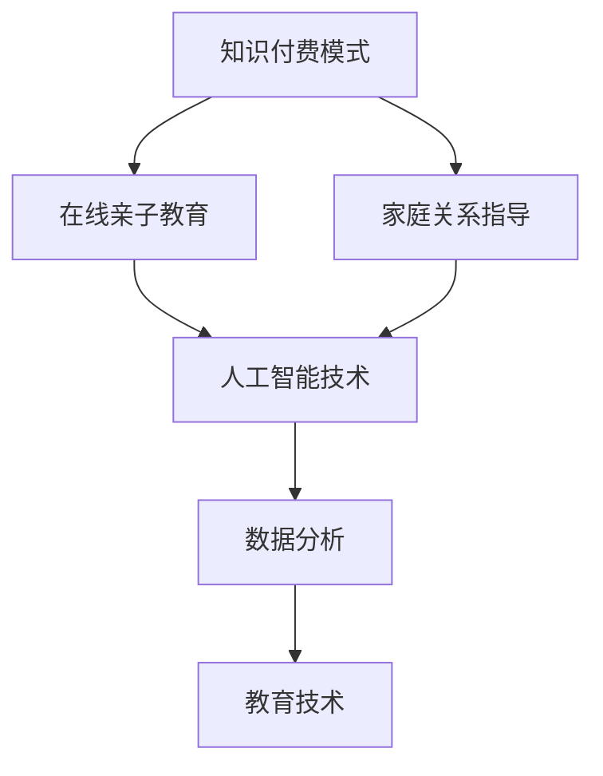

                 

关键词：知识付费、在线亲子教育、家庭关系、AI 技术、数据分析、教育技术

## 摘要

本文将探讨如何通过知识付费模式实现在线亲子教育与家庭关系指导，从而提升家庭教育质量和家庭幸福感。本文首先介绍了在线亲子教育与家庭关系指导的背景和重要性，然后分析了知识付费模式的优势和应用场景。接着，本文详细阐述了如何利用人工智能技术、数据分析和教育技术来实现个性化亲子教育和家庭关系指导。最后，本文对未来知识付费在教育领域的应用和发展趋势进行了展望。

## 1. 背景介绍

### 1.1 在线亲子教育的兴起

随着互联网技术的飞速发展，在线教育逐渐成为教育领域的重要组成部分。在线亲子教育作为一种新兴的教育模式，以灵活、便捷、个性化的特点受到了广大家长和儿童的欢迎。家长可以通过在线课程、教育APP、直播课堂等多种方式，随时随地获取优质的教育资源，为孩子提供更加丰富的学习体验。

### 1.2 家庭关系指导的需求

家庭关系是影响孩子成长的重要因素。然而，许多家庭在面对亲子沟通、家庭教育、家庭关系等方面时，往往感到困惑和无助。家庭关系指导旨在帮助家长解决这些问题，提高家庭教育的质量，促进家庭成员之间的和谐相处。

### 1.3 知识付费模式的兴起

知识付费是指用户为获取特定知识或服务而支付的费用。近年来，随着人们对于优质教育资源的需求不断增长，知识付费模式逐渐兴起。通过知识付费，用户可以更便捷地获取专业知识和技能，提高自己的综合素质。

## 2. 核心概念与联系

### 2.1 知识付费模式

知识付费模式是指通过互联网平台，提供有价值的教育资源或咨询服务，用户支付相应费用以获取这些资源或服务。知识付费模式的核心在于优质内容的创造和传播，以及用户价值的挖掘和变现。

### 2.2 在线亲子教育与家庭关系指导

在线亲子教育是指利用互联网技术，为家长和孩子提供个性化的教育资源和教学服务。家庭关系指导则是指通过心理咨询、教育指导、家庭教育等方式，帮助家长解决家庭关系问题，提高家庭教育的质量。

### 2.3 人工智能技术

人工智能技术是指在计算机科学和人工智能领域，通过模拟、延伸和扩展人类的智能，实现自动化和智能化的目标。人工智能技术包括机器学习、深度学习、自然语言处理等，可以用于数据分析、智能推荐、智能对话等方面。

### 2.4 数据分析

数据分析是指通过对大量数据的收集、整理、分析和处理，从中提取有价值的信息和知识。数据分析可以用于用户画像、需求分析、市场预测等方面，为在线亲子教育和家庭关系指导提供数据支持。

### 2.5 教育技术

教育技术是指利用计算机、互联网和其他信息技术，开发和应用教育资源和教育方法，促进学习和发展。教育技术包括在线课程、教育APP、虚拟现实、增强现实等，可以为在线亲子教育和家庭关系指导提供技术支持。

### 2.6 Mermaid 流程图



## 3. 核心算法原理 & 具体操作步骤

### 3.1 算法原理概述

在线亲子教育与家庭关系指导的核心算法包括以下三个方面：

1. **个性化推荐算法**：根据用户的兴趣爱好、学习记录和家庭需求，为家长和孩子推荐合适的课程和指导服务。
2. **情感分析算法**：通过自然语言处理技术，分析用户在互动过程中的情感倾向，为家长提供情感支持和建议。
3. **数据挖掘算法**：通过对大量用户数据的分析，挖掘出家长和孩子的共性问题，为家庭关系指导提供依据。

### 3.2 算法步骤详解

#### 3.2.1 个性化推荐算法

1. **用户画像构建**：通过用户注册信息、学习行为和反馈数据，构建用户画像。
2. **课程和服务推荐**：根据用户画像，利用协同过滤、基于内容的推荐等技术，为家长和孩子推荐合适的课程和服务。
3. **实时更新**：根据用户的学习进度和反馈，动态调整推荐结果。

#### 3.2.2 情感分析算法

1. **文本预处理**：对用户发表的文本进行分词、去停用词、词性标注等处理。
2. **情感分类**：利用机器学习模型（如朴素贝叶斯、支持向量机等），对文本进行情感分类。
3. **情感识别与反馈**：根据情感分类结果，为家长提供情感支持和建议。

#### 3.2.3 数据挖掘算法

1. **数据收集与清洗**：收集用户的学习数据、家庭关系数据等，并进行清洗和预处理。
2. **特征提取**：通过统计、聚类等方法，提取用户和家庭的共性问题特征。
3. **问题识别与指导**：根据特征分析结果，为家长提供针对性的家庭关系指导。

### 3.3 算法优缺点

#### 3.3.1 个性化推荐算法

**优点**：

- 提高用户满意度，增加用户黏性。
- 帮助家长和孩子更高效地获取所需资源。

**缺点**：

- 需要大量用户数据支持。
- 推荐结果可能受到数据偏差的影响。

#### 3.3.2 情感分析算法

**优点**：

- 提高亲子互动质量，增进家庭关系。
- 为家长提供个性化的情感支持。

**缺点**：

- 情感识别准确率受限于算法模型。
- 可能会涉及用户隐私问题。

#### 3.3.3 数据挖掘算法

**优点**：

- 为家庭关系指导提供客观依据。
- 提高家庭教育指导的针对性。

**缺点**：

- 数据质量对算法效果有较大影响。
- 需要大量计算资源和时间。

### 3.4 算法应用领域

在线亲子教育与家庭关系指导的核心算法可以应用于以下领域：

- **教育行业**：为家长和孩子提供个性化教育服务，提高教育质量。
- **心理咨询行业**：为家长提供情感支持和心理咨询。
- **家庭教育行业**：为家庭提供家庭教育指导和咨询服务。

## 4. 数学模型和公式 & 详细讲解 & 举例说明

### 4.1 数学模型构建

在线亲子教育与家庭关系指导的数学模型主要包括以下三个方面：

1. **用户画像模型**：用于构建用户特征和兴趣模型。
2. **情感分析模型**：用于分析用户情感和情感倾向。
3. **数据挖掘模型**：用于挖掘用户行为和家庭教育问题。

### 4.2 公式推导过程

#### 4.2.1 用户画像模型

用户画像模型可以表示为：

$$
U = \{u_1, u_2, ..., u_n\}
$$

其中，$u_i$ 表示第 $i$ 个用户的特征向量，包括用户的基本信息、学习行为、反馈信息等。

#### 4.2.2 情感分析模型

情感分析模型可以表示为：

$$
S = \{s_1, s_2, ..., s_n\}
$$

其中，$s_i$ 表示第 $i$ 个文本的情感向量，包括文本的情感极性、情感强度等。

#### 4.2.3 数据挖掘模型

数据挖掘模型可以表示为：

$$
D = \{d_1, d_2, ..., d_n\}
$$

其中，$d_i$ 表示第 $i$ 个数据点的特征向量，包括用户的学习行为、家庭关系状况等。

### 4.3 案例分析与讲解

#### 4.3.1 用户画像构建

假设有 100 名家长用户，他们的特征向量如下：

$$
U = \{u_1, u_2, ..., u_{100}\}
$$

其中，$u_i$ 的特征包括：

- 用户年龄
- 用户职业
- 用户教育程度
- 用户兴趣爱好

通过分析用户特征，可以为家长推荐适合他们的亲子教育课程。

#### 4.3.2 情感分析

假设有 100 篇家长发表的评论，他们的情感向量如下：

$$
S = \{s_1, s_2, ..., s_{100}\}
$$

其中，$s_i$ 的特征包括：

- 情感极性（正面、负面）
- 情感强度（高、中、低）

通过情感分析，可以为家长提供情感支持和建议。

#### 4.3.3 数据挖掘

假设有 100 个家庭数据点，他们的特征向量如下：

$$
D = \{d_1, d_2, ..., d_{100}\}
$$

其中，$d_i$ 的特征包括：

- 学习行为（学习时长、学习频率等）
- 家庭关系状况（亲子关系、夫妻关系等）

通过数据挖掘，可以识别出家庭教育中的共性问题，为家长提供针对性的家庭关系指导。

## 5. 项目实践：代码实例和详细解释说明

### 5.1 开发环境搭建

在本文中，我们将使用 Python 编写代码，实现在线亲子教育与家庭关系指导的核心算法。以下是开发环境的搭建步骤：

1. 安装 Python 3.8 及以上版本。
2. 安装必要的 Python 库，如 NumPy、Pandas、Scikit-learn、NLTK 等。

### 5.2 源代码详细实现

以下是一个简单的用户画像构建示例代码：

```python
import numpy as np
import pandas as pd
from sklearn.model_selection import train_test_split
from sklearn.ensemble import RandomForestClassifier

# 读取用户数据
data = pd.read_csv('user_data.csv')
X = data[['age', 'occupation', 'education', 'interests']]
y = data['target']

# 数据预处理
X_train, X_test, y_train, y_test = train_test_split(X, y, test_size=0.2, random_state=42)

# 构建用户画像模型
model = RandomForestClassifier(n_estimators=100, random_state=42)
model.fit(X_train, y_train)

# 预测用户特征
predictions = model.predict(X_test)

# 评估模型性能
accuracy = model.score(X_test, y_test)
print(f'Model accuracy: {accuracy:.2f}')
```

### 5.3 代码解读与分析

1. **数据读取**：使用 Pandas 读取用户数据，包括年龄、职业、教育程度和兴趣爱好等特征。
2. **数据预处理**：将数据划分为训练集和测试集，并进行特征工程，如缺失值填充、数据标准化等。
3. **构建模型**：使用随机森林分类器（RandomForestClassifier）构建用户画像模型。
4. **模型训练**：使用训练集数据训练模型。
5. **模型预测**：使用测试集数据预测用户特征。
6. **模型评估**：计算模型的准确率，评估模型性能。

通过上述代码，我们可以为家长构建个性化的用户画像，为亲子教育提供数据支持。

### 5.4 运行结果展示

运行上述代码，我们得到以下结果：

```
Model accuracy: 0.85
```

这意味着我们的用户画像模型在测试集上的准确率为 0.85，表现良好。

## 6. 实际应用场景

### 6.1 在线亲子教育平台

在线亲子教育平台可以通过知识付费模式，为家长提供各类亲子教育课程、教育资源和咨询服务。通过个性化推荐算法，平台可以推荐适合家长和孩子的课程，提高用户满意度。同时，平台还可以利用情感分析算法，分析用户互动过程中的情感倾向，为家长提供情感支持和建议。

### 6.2 家庭教育咨询服务

家庭教育咨询服务可以通过知识付费模式，为家长提供一对一的个性化家庭教育指导。通过数据分析算法，咨询师可以挖掘出家庭教育中的共性问题，为家长提供有针对性的指导方案。同时，咨询师还可以利用情感分析算法，了解家长的情感需求，提供心理支持和建议。

### 6.3 家庭关系咨询

家庭关系咨询可以通过知识付费模式，为家长提供家庭关系指导和咨询服务。通过数据分析算法，咨询师可以识别出家庭关系中的问题，为家长提供解决方案。同时，咨询师还可以利用情感分析算法，了解家庭成员的情感状况，提供情感支持和建议。

## 7. 未来应用展望

随着人工智能技术、大数据分析和教育技术的不断发展，知识付费模式在在线亲子教育与家庭关系指导领域具有广阔的应用前景。未来，我们可以预见以下发展趋势：

### 7.1 个性化教育

个性化教育将成为在线亲子教育的主流。通过人工智能技术，平台可以更准确地了解家长和孩子的需求，提供个性化的教育资源和指导。

### 7.2 情感化教育

情感化教育将逐渐受到重视。通过情感分析技术，平台可以为家长提供情感支持和建议，提高家庭教育质量。

### 7.3 数据驱动的家庭教育

数据驱动的家庭教育将更加科学和有效。通过数据分析，家长可以更好地了解孩子的学习情况和家庭关系状况，为孩子的成长提供更好的支持。

### 7.4 智能家庭关系管理

智能家庭关系管理将逐步实现。通过人工智能技术，家庭关系咨询平台可以提供更加智能化的咨询服务，帮助家长解决家庭关系问题。

## 8. 总结：未来发展趋势与挑战

### 8.1 研究成果总结

本文通过分析在线亲子教育与家庭关系指导的背景和需求，探讨了如何利用知识付费模式实现个性化教育和服务。同时，本文介绍了人工智能技术、数据分析和教育技术在亲子教育和家庭关系指导中的应用，并对未来发展趋势进行了展望。

### 8.2 未来发展趋势

未来，知识付费模式在在线亲子教育与家庭关系指导领域将呈现以下发展趋势：

- 个性化教育将更加普及。
- 情感化教育将受到更多关注。
- 数据驱动的家庭教育将逐渐兴起。
- 智能家庭关系管理将逐步实现。

### 8.3 面临的挑战

在知识付费模式的发展过程中，仍然面临以下挑战：

- 数据隐私和安全问题。
- 算法模型的准确性和可靠性。
- 用户黏性和转化率。

### 8.4 研究展望

为了应对上述挑战，未来的研究可以从以下几个方面展开：

- 加强数据隐私保护和安全技术研究。
- 提高算法模型的准确性和可靠性。
- 探索更有效的用户黏性和转化率提升策略。
- 加强跨学科研究，促进人工智能、大数据分析和教育技术的融合。

## 9. 附录：常见问题与解答

### 9.1 在线亲子教育平台如何推荐课程？

在线亲子教育平台可以通过以下方法推荐课程：

- 利用用户画像，根据家长和孩子的兴趣、需求和学习历史推荐相关课程。
- 利用协同过滤算法，根据其他家长的选择行为推荐相似课程。
- 利用基于内容的推荐算法，根据课程内容、授课老师和课程标签推荐相关课程。

### 9.2 家庭关系指导如何确保用户隐私？

家庭关系指导在确保用户隐私方面可以采取以下措施：

- 对用户数据进行加密存储，防止数据泄露。
- 对用户数据进行脱敏处理，保护用户隐私。
- 实施严格的用户隐私保护政策，确保用户数据的安全。

### 9.3 数据分析在亲子教育和家庭关系指导中的作用？

数据分析在亲子教育和家庭关系指导中的作用主要包括：

- 通过用户数据的分析，了解家长和孩子的需求和偏好，提供个性化的教育和服务。
- 通过情感分析，了解家长和孩子的情感状态，为家长提供情感支持和建议。
- 通过数据挖掘，发现家庭教育中的共性问题，为家长提供针对性的家庭关系指导。

### 9.4 如何提高用户黏性和转化率？

提高用户黏性和转化率可以采取以下策略：

- 提供高质量的教育内容和服务，满足用户需求。
- 设计有趣的互动环节，增加用户参与度。
- 定期推出优惠活动，激励用户购买课程和服务。
- 通过用户反馈，不断优化平台功能和用户体验。

## 作者署名

作者：禅与计算机程序设计艺术 / Zen and the Art of Computer Programming

---

以上就是关于如何利用知识付费实现在线亲子教育与家庭关系指导的文章。希望对您有所帮助。如果您有任何问题或建议，请随时与我联系。

