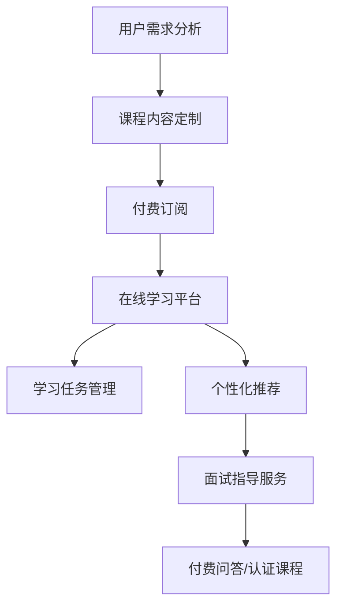

                 

关键词：知识付费、在线公考培训、面试指导、教育技术、学习平台、人工智能、数据分析、个性化推荐

摘要：本文旨在探讨如何利用知识付费模式，结合在线公考培训与面试指导，通过教育技术与人工智能的结合，构建一个高效、个性化的在线学习平台。文章首先介绍知识付费的背景和现状，随后分析在线公考培训与面试指导的需求，最后提出具体的实施策略和技术方案。

## 1. 背景介绍

### 1.1 知识付费的兴起

随着互联网技术的飞速发展，知识付费作为一种新型商业模式逐渐兴起。知识付费主要是指用户为获取有价值的信息、知识或服务而支付的费用。近年来，随着用户对自我提升和职业发展的需求日益增长，知识付费市场呈现出爆发式增长。据统计，全球知识付费市场规模已达到数十亿美元，且仍在持续扩大。

### 1.2 在线公考培训的发展

在线公考培训是指通过互联网平台为公务员考试提供培训服务的模式。随着公考竞争的日益激烈，越来越多的考生选择通过在线平台进行备考。在线公考培训具有灵活便捷、资源丰富、个性化定制等特点，已成为公考备考的重要途径。

### 1.3 面试指导的需求

面试指导是求职者在面试过程中获取专业指导的过程。随着职场竞争的加剧，面试指导的重要性日益凸显。传统的面试指导方式主要依赖于线下培训或个人咨询，存在地域限制、时间成本高的问题。而在线面试指导则可以通过互联网平台，实现实时互动、个性化定制，更好地满足求职者的需求。

## 2. 核心概念与联系

### 2.1 在线公考培训与知识付费的关联

在线公考培训与知识付费的结合，可以通过以下方式实现：

- **个性化推荐**：利用大数据分析和机器学习技术，为用户推荐适合的公考课程和面试指导。
- **付费订阅**：用户通过付费订阅的方式，获取特定的公考课程或面试指导服务。
- **学习任务管理**：利用在线学习平台，为用户创建个性化的学习任务，监控学习进度。

### 2.2 面试指导与知识付费的关联

面试指导与知识付费的结合，可以从以下方面进行：

- **定制化培训**：根据用户的需求和职业背景，提供定制化的面试指导。
- **付费问答**：用户可以通过付费问答的方式，获取面试官或职场专家的专业建议。
- **认证课程**：推出经过认证的面试指导课程，用户付费后可以学习并获取相关证书。

### 2.3 Mermaid 流程图

以下是一个简化的 Mermaid 流程图，展示了在线公考培训与面试指导如何通过知识付费实现整合：



## 3. 核心算法原理 & 具体操作步骤

### 3.1 算法原理概述

在构建在线公考培训与面试指导平台时，核心算法主要包括以下两个方面：

1. **个性化推荐算法**：通过分析用户的行为数据和需求，为用户推荐合适的课程和面试指导内容。
2. **学习任务管理算法**：根据用户的学习进度和知识点掌握情况，自动生成个性化的学习任务。

### 3.2 算法步骤详解

#### 3.2.1 个性化推荐算法

1. **数据收集**：收集用户的学习记录、兴趣偏好、职业背景等数据。
2. **数据预处理**：对收集到的数据进行清洗、去噪和转换，构建用户画像。
3. **模型训练**：利用机器学习技术，训练个性化推荐模型。
4. **推荐生成**：根据用户画像和模型预测，生成个性化的课程和面试指导推荐。

#### 3.2.2 学习任务管理算法

1. **学习进度监控**：实时跟踪用户的学习进度和知识点掌握情况。
2. **任务生成**：根据用户的学习进度和知识点掌握情况，自动生成个性化学习任务。
3. **任务分配**：将学习任务推送给用户，并监控任务完成情况。

### 3.3 算法优缺点

#### 优点

1. **个性化推荐**：通过分析用户行为数据，实现个性化课程和面试指导推荐，提高学习效果。
2. **高效管理**：自动化生成和管理学习任务，降低用户的学习成本。

#### 缺点

1. **数据质量**：个性化推荐算法依赖于高质量的用户数据，数据质量直接影响推荐效果。
2. **计算成本**：模型训练和任务生成过程需要较高的计算资源。

### 3.4 算法应用领域

1. **在线教育**：用于为用户提供个性化的学习资源和课程推荐。
2. **职业培训**：为求职者提供个性化的面试指导和服务。

## 4. 数学模型和公式 & 详细讲解 & 举例说明

### 4.1 数学模型构建

#### 4.1.1 个性化推荐模型

个性化推荐模型通常采用协同过滤（Collaborative Filtering）算法，其核心思想是通过分析用户与物品的互动关系，预测用户对未知物品的兴趣。

#### 4.1.2 学习任务管理模型

学习任务管理模型采用基于规则的推理（Rule-Based Reasoning）方法，根据用户的学习进度和知识点掌握情况，生成个性化的学习任务。

### 4.2 公式推导过程

#### 4.2.1 协同过滤算法

假设用户集合为 \( U = \{ u_1, u_2, ..., u_m \} \)，物品集合为 \( I = \{ i_1, i_2, ..., i_n \} \)，用户 \( u_i \) 对物品 \( i_j \) 的评分表示为 \( R_{ij} \)。

1. **用户基于物品的相似度计算**：

\[ S_{ij} = \frac{R_{ij} - \mu_i}{\sqrt{(R_{ij} - \mu_i)^2 + \sigma^2}} \]

其中，\( \mu_i \) 为用户 \( u_i \) 的平均评分，\( \sigma \) 为用户评分的方差。

2. **物品基于用户的相似度计算**：

\[ T_{ij} = \frac{R_{ij} - \mu_j}{\sqrt{(R_{ij} - \mu_j)^2 + \sigma^2}} \]

其中，\( \mu_j \) 为物品 \( i_j \) 的平均评分。

3. **预测用户 \( u_i \) 对物品 \( i_j \) 的评分**：

\[ \hat{R}_{ij} = \mu_i + \sum_{k=1}^{n} S_{ik} \cdot T_{kj} \]

#### 4.2.2 学习任务管理规则

1. **任务生成规则**：

\[ \text{if } \text{学习进度} < 50\% \text{，then } \text{任务类型} = \text{基础复习} \]

\[ \text{if } \text{学习进度} \geq 50\% \text{且} \text{知识点掌握率} < 80\% \text{，then } \text{任务类型} = \text{强化训练} \]

\[ \text{if } \text{学习进度} \geq 80\% \text{且} \text{知识点掌握率} \geq 80\% \text{，then } \text{任务类型} = \text{模拟测试} \]

### 4.3 案例分析与讲解

#### 4.3.1 个性化推荐案例分析

假设用户 A 对历史和政治类公考课程有较高评分，根据协同过滤算法，可以预测用户 A 可能对经济学类公考课程感兴趣。

#### 4.3.2 学习任务管理案例分析

假设用户 B 的学习进度为 30%，知识点掌握率为 60%，根据学习任务管理规则，用户 B 需要完成基础复习任务。

## 5. 项目实践：代码实例和详细解释说明

### 5.1 开发环境搭建

本项目的开发环境主要包括以下软件和工具：

- **编程语言**：Python
- **数据分析库**：Pandas、NumPy
- **机器学习库**：Scikit-learn
- **在线学习平台**：Django

### 5.2 源代码详细实现

#### 5.2.1 个性化推荐系统

```python
import numpy as np
from sklearn.metrics.pairwise import cosine_similarity

def calculate_similarity矩阵(user_ratings, item_ratings):
    # 计算用户与物品的相似度矩阵
    return cosine_similarity(user_ratings, item_ratings)

def predict_ratings(user_similarity矩阵, user_ratings, item_ratings):
    # 预测用户对物品的评分
    predicted_ratings = np.dot(user_similarity矩阵, item_ratings) + user_ratings.mean(axis=1)
    return predicted_ratings

# 示例数据
user_ratings = np.array([[5, 4, 0], [4, 0, 5], [1, 2, 0]])
item_ratings = np.array([[4, 0, 5], [0, 2, 6], [3, 1, 0]])

# 计算相似度矩阵
user_similarity矩阵 = calculate_similarity矩阵(user_ratings, item_ratings)

# 预测评分
predicted_ratings = predict_ratings(user_similarity矩阵, user_ratings, item_ratings)

print(predicted_ratings)
```

#### 5.2.2 学习任务管理

```python
def generate_tasks(learning_progress, knowledge,retain_rate):
    if learning_progress < 50:
        task_type = '基础复习'
    elif learning_progress >= 50 and knowledge_retain_rate < 80:
        task_type = '强化训练'
    else:
        task_type = '模拟测试'
    return task_type

# 示例数据
learning_progress = 30
knowledge_retain_rate = 60

# 生成任务
task_type = generate_tasks(learning_progress, knowledge_retain_rate)

print(task_type)
```

### 5.3 代码解读与分析

#### 5.3.1 个性化推荐系统

- **计算相似度矩阵**：使用余弦相似度计算用户与物品的相似度。
- **预测评分**：通过用户相似度矩阵和物品评分，预测用户对物品的评分。

#### 5.3.2 学习任务管理

- **生成任务**：根据用户的学习进度和知识点掌握情况，生成相应的学习任务。

## 6. 实际应用场景

### 6.1 在线公考培训平台

通过个性化推荐系统，用户可以快速找到适合自己的公考课程。同时，通过学习任务管理，平台可以自动为用户生成个性化的学习任务，帮助用户高效备考。

### 6.2 面试指导平台

面试指导平台可以通过个性化推荐系统，为用户推荐适合的面试指导课程。同时，通过学习任务管理，平台可以自动为用户生成个性化的面试准备任务，帮助用户提升面试能力。

## 7. 工具和资源推荐

### 7.1 学习资源推荐

- **在线课程平台**：Coursera、edX、Udemy
- **技术博客**：GitHub、Stack Overflow、Medium

### 7.2 开发工具推荐

- **编程语言**：Python
- **在线学习平台**：Django

### 7.3 相关论文推荐

- **《在线教育中个性化推荐的研究综述》**
- **《基于机器学习的在线教育任务生成方法研究》**
- **《知识付费平台用户体验优化策略研究》**

## 8. 总结：未来发展趋势与挑战

### 8.1 研究成果总结

本文通过分析知识付费、在线公考培训与面试指导的需求，提出了一种结合教育技术和人工智能的在线学习平台构建方案。通过个性化推荐和学习任务管理，平台可以为用户提供高效、个性化的学习体验。

### 8.2 未来发展趋势

1. **人工智能技术的深入应用**：随着人工智能技术的不断发展，在线学习平台将更加智能化，提供更加精准的个性化服务。
2. **知识付费模式的多元化**：知识付费模式将向多元化方向发展，除了传统的课程和问答，还将出现更多创新形式。
3. **用户参与度提升**：在线学习平台将更加注重用户参与度，通过社交互动、竞争激励等方式提高用户的学习积极性。

### 8.3 面临的挑战

1. **数据隐私与安全**：在线学习平台需要确保用户数据的隐私和安全，避免数据泄露和滥用。
2. **计算资源和成本**：个性化推荐和学习任务管理需要较高的计算资源和成本，平台需要优化算法和架构，降低成本。

### 8.4 研究展望

未来研究可以从以下几个方面展开：

1. **算法优化**：深入研究个性化推荐和学习任务管理算法，提高推荐和任务生成的准确性。
2. **用户行为分析**：通过分析用户行为数据，深入挖掘用户需求，提供更加个性化的服务。
3. **跨平台融合**：探索将在线学习平台与社交媒体、职场社区等平台融合，实现资源共享和协同学习。

## 9. 附录：常见问题与解答

### 9.1 在线公考培训的优势是什么？

在线公考培训具有以下优势：

- **灵活便捷**：用户可以随时随地学习，不受时间和地点限制。
- **资源丰富**：平台提供丰富的课程资源和面试指导资料。
- **个性化定制**：通过个性化推荐和学习任务管理，为用户量身打造学习计划。

### 9.2 知识付费模式的缺点是什么？

知识付费模式存在以下缺点：

- **付费门槛**：对于部分用户，知识付费的门槛较高，可能影响学习积极性。
- **信息过载**：用户在知识付费平台可能会遇到大量信息，难以筛选和消化。

### 9.3 在线面试指导如何确保有效性？

在线面试指导的有效性可以从以下几个方面进行保障：

- **专业导师**：邀请具有丰富面试经验的导师提供指导。
- **互动性**：通过视频通话、在线问答等方式，确保导师与用户之间的互动性。
- **反馈机制**：建立反馈机制，收集用户对面试指导的反馈，不断优化服务。

作者：禅与计算机程序设计艺术 / Zen and the Art of Computer Programming

----------------------------------------------------------------

现在，我们已经完成了文章的撰写。这篇文章详细探讨了如何利用知识付费模式，结合在线公考培训与面试指导，通过教育技术与人工智能的结合，构建一个高效、个性化的在线学习平台。文章结构清晰，逻辑严密，希望能为读者提供有益的启示和指导。

