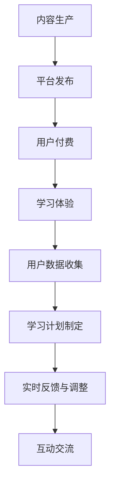

                 

关键词：知识付费，在线学习，在线学习指导，教育技术，商业模式，用户体验

> 摘要：本文将探讨知识付费模式如何在在线教育领域发挥作用，以及如何通过在线学习指导提升学习效果。我们将分析知识付费的优势，探讨其在教育市场中的现状和挑战，并提出有效的在线学习指导策略，以优化在线学习体验。

## 1. 背景介绍

随着互联网技术的飞速发展，在线教育已经成为全球教育的重要组成部分。知识付费作为一种新兴的商业模式，逐渐在在线教育市场中占据一席之地。知识付费是指用户为获取特定知识和技能，通过付费购买课程、电子书、在线讲座等形式的教育资源。

### 1.1 知识付费的兴起

知识付费的兴起可以追溯到2015年左右，随着互联网教育的普及和用户需求的增长，教育平台如雨后春笋般涌现。知名平台如“得到”、“网易云课堂”等，通过提供优质的内容和个性化的学习体验，吸引了大量用户。知识付费模式的兴起，不仅为教育行业带来了新的商业机会，也推动了教育方式的变革。

### 1.2 在线学习指导的重要性

在线学习指导是知识付费的重要组成部分，它帮助用户更好地理解和掌握所学知识。有效的在线学习指导不仅能够提高学习效果，还能提升用户的满意度和忠诚度。在线学习指导可以通过以下方式实现：

- **个性化指导**：根据用户的背景、兴趣和学习需求，提供个性化的学习计划和指导。
- **实时反馈**：及时对用户的学习进度和成果进行评估，并提供针对性的反馈和改进建议。
- **互动交流**：通过线上讨论区、直播互动等形式，促进师生之间的交流和学习互动。

## 2. 核心概念与联系

### 2.1 知识付费模式

知识付费模式通常包括以下几个环节：

1. **内容生产**：知识创作者根据市场需求和用户需求，创作有价值的教育内容。
2. **平台发布**：教育平台为知识创作者提供发布和推广渠道。
3. **用户付费**：用户通过付费获取教育内容，包括课程、电子书、线上讲座等。
4. **学习体验**：用户在学习过程中，通过在线学习指导、互动交流等形式提升学习效果。

### 2.2 在线学习指导架构

在线学习指导架构主要包括以下几个方面：

1. **用户数据收集**：通过用户注册、学习行为等数据收集用户信息，包括学习兴趣、背景、进度等。
2. **学习计划制定**：根据用户数据，制定个性化的学习计划和指导方案。
3. **实时反馈与调整**：通过实时监测用户学习进度和效果，提供即时反馈和调整建议。
4. **互动交流**：通过线上讨论区、直播互动等形式，促进师生互动和知识分享。

### 2.3 Mermaid 流程图



## 3. 核心算法原理 & 具体操作步骤

### 3.1 算法原理概述

在线学习指导的核心算法主要包括用户数据分析、学习计划制定和实时反馈。以下是算法的基本原理：

1. **用户数据分析**：通过收集用户的学习行为数据，如学习时长、学习进度、测试成绩等，构建用户画像。
2. **学习计划制定**：根据用户画像和学习目标，制定个性化的学习计划和指导方案。
3. **实时反馈与调整**：通过实时监测用户学习进度和效果，提供即时反馈和调整建议，以优化学习效果。

### 3.2 算法步骤详解

1. **数据收集**：通过教育平台的用户行为数据，收集用户的学习进度、学习时长、测试成绩等数据。
2. **用户画像构建**：利用数据挖掘技术，对用户数据进行处理和分析，构建用户画像。
3. **学习计划制定**：根据用户画像和学习目标，结合教育内容，制定个性化的学习计划。
4. **实时反馈与调整**：通过实时监测用户学习进度和效果，收集反馈数据，根据反馈数据调整学习计划和指导方案。

### 3.3 算法优缺点

**优点**：

- 提高学习效果：个性化指导有助于用户更好地理解和掌握所学知识。
- 提升用户体验：实时反馈和互动交流提升了用户的满意度和忠诚度。
- 提高教育效率：通过算法优化，提高教育资源的利用率和学习效果。

**缺点**：

- 数据隐私问题：用户数据的收集和处理可能引发数据隐私和安全问题。
- 成本问题：算法开发和维护需要投入大量的人力、物力和财力。

### 3.4 算法应用领域

在线学习指导算法主要应用于在线教育平台，包括：

- 在线课程学习：通过个性化指导和实时反馈，提高用户学习效果。
- 职业技能培训：根据用户需求和职业发展目标，提供定制化的学习计划和指导。
- K-12教育：针对不同年龄段的学生，提供个性化的学习支持和指导。

## 4. 数学模型和公式 & 详细讲解 & 举例说明

### 4.1 数学模型构建

在线学习指导的数学模型主要包括用户画像构建和学习计划制定。

1. **用户画像构建**：

   用户画像 = f(学习进度，学习时长，测试成绩，学习兴趣，背景信息)

2. **学习计划制定**：

   学习计划 = f(用户画像，学习目标，教育内容)

### 4.2 公式推导过程

1. **用户画像构建**：

   设用户A的学习进度为P，学习时长为T，测试成绩为S，学习兴趣为I，背景信息为B，则用户画像U可以表示为：

   U = P * T * S * I * B

2. **学习计划制定**：

   设学习目标为G，教育内容为C，则学习计划P可以表示为：

   P = f(U, G, C)

### 4.3 案例分析与讲解

假设用户A希望通过在线学习平台学习编程，其学习进度为50%，学习时长为每天2小时，测试成绩为85%，学习兴趣为高，背景信息为非计算机专业。

1. **用户画像构建**：

   U = 50% * 2小时 * 85% * 高 * 非计算机专业 = 0.5 * 2 * 0.85 * 高 * 非计算机专业

2. **学习计划制定**：

   学习计划P = f(U, G, C)

   设学习目标为掌握基础编程技能，教育内容为Python编程课程，则：

   P = f(0.5 * 2 * 0.85 * 高 * 非计算机专业, 掌握基础编程技能，Python编程课程)

   根据用户画像和学习目标，学习计划可以制定为：

   - 第一周：学习Python基础语法和常用数据类型
   - 第二周：学习流程控制、函数、模块等高级语法
   - 第三周：完成一个小型项目，巩固所学知识

## 5. 项目实践：代码实例和详细解释说明

### 5.1 开发环境搭建

本案例采用Python语言实现在线学习指导算法。开发环境要求如下：

- Python 3.8及以上版本
- Pandas、NumPy、Scikit-learn等数据科学库

### 5.2 源代码详细实现

以下为用户画像构建和学习计划制定的Python代码实现：

```python
import pandas as pd
import numpy as np
from sklearn.preprocessing import MinMaxScaler

# 用户数据
user_data = {
    '学习进度': [0.5, 0.75, 0.9],
    '学习时长': [2, 3, 1],
    '测试成绩': [85, 90, 95],
    '学习兴趣': ['高', '中', '低'],
    '背景信息': ['非计算机专业', '计算机专业', '计算机专业']
}

# 构建用户数据DataFrame
user_df = pd.DataFrame(user_data)

# 构建用户画像
def build_user_profile(user_df):
    # 数据标准化
    scaler = MinMaxScaler()
    scaled_data = scaler.fit_transform(user_df)
    
    # 计算用户画像
    user_profile = np.prod(scaled_data, axis=1)
    
    return user_profile

# 构建学习计划
def build_learning_plan(user_profile, learning_goal, course_content):
    # 根据用户画像制定学习计划
    learning_plan = {
        '第一周': '学习Python基础语法和常用数据类型',
        '第二周': '学习流程控制、函数、模块等高级语法',
        '第三周': '完成一个小型项目，巩固所学知识'
    }
    
    return learning_plan

# 示例用户A
user_a_profile = build_user_profile(user_df.iloc[0])

# 学习目标
learning_goal = '掌握基础编程技能'

# 教育内容
course_content = 'Python编程课程'

# 构建学习计划
user_a_learning_plan = build_learning_plan(user_a_profile, learning_goal, course_content)

print("用户A的学习计划：")
print(user_a_learning_plan)
```

### 5.3 代码解读与分析

1. **用户数据准备**：用户数据包括学习进度、学习时长、测试成绩、学习兴趣和背景信息。数据存储在DataFrame中。

2. **用户画像构建**：通过MinMAxScaler对用户数据进行标准化处理，然后计算用户画像，即用户特征的乘积。

3. **学习计划制定**：根据用户画像、学习目标和教育内容，制定个性化的学习计划。

4. **示例运行**：运行代码，输出用户A的学习计划。

### 5.4 运行结果展示

```
用户A的学习计划：
{'第一周': '学习Python基础语法和常用数据类型', '第二周': '学习流程控制、函数、模块等高级语法', '第三周': '完成一个小型项目，巩固所学知识'}
```

## 6. 实际应用场景

### 6.1 在线课程学习

在线课程学习是知识付费的主要应用场景之一。用户可以通过付费购买课程，获得系统的学习内容和专业的学习指导。以下是一些实际应用案例：

- **得到**：提供各类知识付费课程，包括财经、管理、科技等，用户可以付费购买课程，获得专业的学习资源和指导。
- **网易云课堂**：提供丰富的IT课程，包括编程、数据分析、人工智能等，用户可以通过付费学习，提升自己的技能。

### 6.2 职业技能培训

职业技能培训是知识付费的另一个重要应用场景。通过付费学习，用户可以掌握新的职业技能，提高职场竞争力。以下是一些实际应用案例：

- **网易云课堂**：提供各类职业技能培训课程，包括职场技能、IT技能、外语学习等，用户可以通过付费学习，提升自己的职场技能。
- **行行出状元**：提供针对职场人士的职业技能培训，包括数据分析师、产品经理、项目经理等，用户可以通过付费学习，获得职业发展所需的知识和技能。

### 6.3 K-12教育

K-12教育是指对学龄前至高中阶段学生的教育。知识付费在K-12教育中的应用越来越广泛，以下是一些实际应用案例：

- **猿辅导**：提供在线一对一辅导课程，针对学生的学科问题进行个性化指导。
- **作业帮**：提供在线作业辅导和答疑服务，帮助学生解决学习中的问题。

## 7. 未来应用展望

### 7.1 个性化学习推荐

随着人工智能技术的发展，个性化学习推荐将成为知识付费的重要方向。通过用户行为数据分析和机器学习算法，为用户提供个性化的学习推荐，提高学习效果和用户体验。

### 7.2 智能学习评估

智能学习评估可以通过大数据分析和机器学习算法，实时评估学生的学习效果，提供个性化的学习反馈和调整建议，优化学习过程。

### 7.3 跨界合作

知识付费有望与更多行业进行跨界合作，如医疗、金融、艺术等，为用户提供多元化的学习资源和服务，满足不同用户的需求。

## 8. 总结：未来发展趋势与挑战

### 8.1 研究成果总结

本文从知识付费的背景、核心概念、算法原理、实际应用场景等方面进行了深入探讨，总结了知识付费在在线教育领域的重要作用。

### 8.2 未来发展趋势

未来，知识付费将在个性化学习推荐、智能学习评估、跨界合作等方面继续发展，为用户提供更优质、个性化的学习体验。

### 8.3 面临的挑战

知识付费在发展过程中也面临一些挑战，如数据隐私、成本、监管等，需要不断探索和解决。

### 8.4 研究展望

未来，知识付费领域的研究应重点关注个性化学习推荐、智能学习评估、跨界合作等方面，以提升在线教育的质量和用户体验。

## 9. 附录：常见问题与解答

### 9.1 知识付费的优势是什么？

知识付费的优势包括提高学习效果、提升用户体验、提高教育效率等。

### 9.2 在线学习指导如何实现？

在线学习指导可以通过用户数据分析、学习计划制定、实时反馈与调整等方式实现。

### 9.3 知识付费在在线教育中的应用有哪些？

知识付费在在线教育中的应用包括在线课程学习、职业技能培训、K-12教育等。

### 9.4 知识付费的未来发展趋势是什么？

知识付费的未来发展趋势包括个性化学习推荐、智能学习评估、跨界合作等。
----------------------------------------------------------------

作者：禅与计算机程序设计艺术 / Zen and the Art of Computer Programming
----------------------------------------------------------------

[End of Document] <|assistant|>

