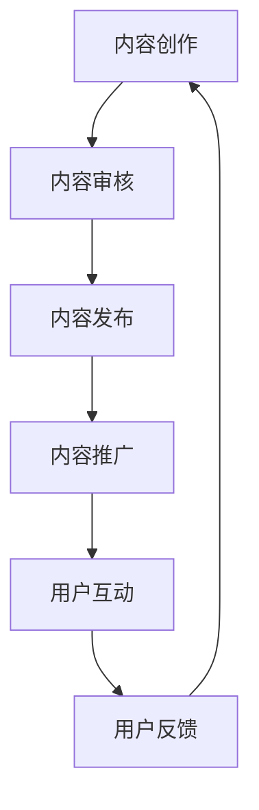

                 

 在当今信息爆炸的时代，在线学习和知识付费逐渐成为终身学习的重要途径。一方面，网络上的学习资源丰富多样，提供了自我提升的机会；另一方面，知识付费平台为专业人士提供了变现和增值的空间。本文将探讨如何利用知识付费实现在线学习与在线学习指导，旨在为学习者、内容创作者以及平台运营者提供有价值的参考。

## 文章关键词
- **知识付费**
- **在线学习**
- **学习指导**
- **教育技术**
- **变现策略**

## 文章摘要
本文从知识付费的背景出发，分析了其在线学习与学习指导的潜力。首先，介绍了知识付费的定义、现状及发展趋势；然后，探讨了如何通过知识付费平台实现在线学习与指导，包括内容创作、互动机制和盈利模式等方面；最后，提出了未来发展展望和面临的挑战。

### 1. 背景介绍

#### 1.1 知识付费的概念与发展

知识付费是指用户为获取特定知识、技能或经验而支付费用的一种行为。这种模式在互联网的推动下得到了快速发展。随着移动互联网的普及和用户消费习惯的改变，知识付费逐渐成为了一个庞大的市场。

**现状**：
- 根据统计，2019年中国知识付费市场规模已达到641亿元，预计到2023年将突破1600亿元。
- 市场上涌现出了诸如得到、知乎、喜马拉雅、千聊等众多知识付费平台，内容涵盖教育、财经、科技、艺术等多个领域。

**发展趋势**：
- **内容多样化**：知识付费平台不仅提供音频、视频课程，还推出了直播、问答、社群等多种互动形式。
- **个性化推荐**：基于大数据和人工智能技术，平台能够为用户精准推荐感兴趣的内容。
- **平台生态**：知识付费逐渐形成了从内容生产、分发到变现的完整生态。

#### 1.2 在线学习的崛起

在线学习作为一种新型的学习方式，以其灵活、便捷、高效的特点受到了广泛欢迎。

**优势**：
- **时间灵活**：用户可以根据自己的时间安排进行学习，不受地域限制。
- **资源丰富**：在线学习平台提供了大量的课程资源，覆盖了各个学科和领域。
- **个性化学习**：通过数据分析和算法推荐，用户能够获得个性化的学习体验。

**应用场景**：
- **职业提升**：职场人士通过在线学习提升专业技能，应对工作挑战。
- **兴趣爱好**：业余爱好者在线学习音乐、绘画、摄影等爱好。
- **学术研究**：学生和科研人员在线学习新知识，拓展学术视野。

### 2. 核心概念与联系

#### 2.1 知识付费平台架构

知识付费平台的架构可以分为三个主要部分：内容创作、内容分发和用户互动。

**Mermaid 流程图**：


#### 2.2 在线学习与指导的关系

在线学习与在线学习指导是相辅相成的。指导不仅能够帮助学习者更好地掌握知识，还能提高学习效果和用户满意度。

**核心概念联系**：
- **课程设计**：课程内容要结合学习者的需求和水平，设计合理的学习路径。
- **互动机制**：通过问答、讨论、作业等方式，增强学习者的参与感和互动性。
- **个性化指导**：根据学习者的反馈和学习进度，提供个性化的指导和建议。

### 3. 核心算法原理 & 具体操作步骤

#### 3.1 算法原理概述

知识付费平台的核心算法主要涉及用户画像构建、内容推荐和个性化指导。

**算法原理**：
- **用户画像**：通过用户的行为数据，如浏览记录、购买历史等，构建用户的个性化画像。
- **内容推荐**：利用协同过滤、基于内容的推荐等技术，为用户推荐感兴趣的内容。
- **个性化指导**：根据用户的学习进度、反馈和需求，提供个性化的学习路径和指导。

#### 3.2 算法步骤详解

**步骤1：数据收集与预处理**
- 收集用户行为数据，如浏览记录、购买记录、问答记录等。
- 对数据进行清洗和预处理，去除噪音数据。

**步骤2：用户画像构建**
- 利用机器学习算法，如聚类、回归分析等，构建用户的个性化画像。

**步骤3：内容推荐**
- 采用协同过滤算法，计算用户之间的相似度，为用户推荐相似用户喜欢的内容。
- 基于内容的相关性，为用户推荐相关课程。

**步骤4：个性化指导**
- 根据用户的学习进度、反馈和需求，设计个性化的学习路径和指导方案。
- 利用自然语言处理技术，生成个性化的指导文本。

#### 3.3 算法优缺点

**优点**：
- **个性化**：能够为用户推荐感兴趣的内容和提供个性化的指导，提高用户体验。
- **高效**：利用算法和大数据技术，提高内容推荐的效率和准确性。

**缺点**：
- **数据依赖**：算法的性能高度依赖于数据质量，数据缺失或不准确会影响推荐效果。
- **隐私问题**：用户数据的安全性是知识付费平台面临的重要挑战。

#### 3.4 算法应用领域

知识付费算法主要应用于以下领域：
- **在线教育**：为学习者推荐适合的课程，提供个性化学习指导。
- **职业培训**：为职场人士推荐专业课程，提高职业技能。
- **兴趣爱好**：为业余爱好者推荐相关课程，培养兴趣和技能。

### 4. 数学模型和公式 & 详细讲解 & 举例说明

#### 4.1 数学模型构建

知识付费平台的数学模型主要包括用户画像模型、内容推荐模型和个性化指导模型。

**用户画像模型**：
- 用户画像 = {行为数据，兴趣标签，学习水平，职业背景}

**内容推荐模型**：
- 推荐分数 = f(用户画像，内容特征)

**个性化指导模型**：
- 指导方案 = g(用户画像，学习进度，反馈信息)

#### 4.2 公式推导过程

**用户画像模型**：
$$
\text{行为数据} = \sum_{i=1}^{n} w_i \cdot x_i
$$
$$
\text{兴趣标签} = \sum_{j=1}^{m} w_j \cdot y_j
$$
$$
\text{学习水平} = \sum_{k=1}^{p} w_k \cdot z_k
$$
$$
\text{职业背景} = \sum_{l=1}^{q} w_l \cdot u_l
$$

**内容推荐模型**：
$$
f(\text{用户画像}, \text{内容特征}) = \cos(\text{用户画像}, \text{内容特征}) + \alpha \cdot \text{内容相关性}
$$
其中，$\alpha$为调节参数。

**个性化指导模型**：
$$
g(\text{用户画像}, \text{学习进度}, \text{反馈信息}) = \beta \cdot \text{学习进度} + \gamma \cdot \text{反馈信息} + \delta \cdot \text{用户画像}
$$

#### 4.3 案例分析与讲解

**案例1：职业提升**

用户A是一名软件工程师，希望通过在线学习提升编程技能。根据用户A的行为数据，平台为其构建了用户画像。

**用户画像**：
- 行为数据：浏览了Python编程、数据结构与算法等课程。
- 兴趣标签：编程、算法、软件开发。
- 学习水平：中级。
- 职业背景：软件工程师。

**内容推荐**：
平台利用协同过滤算法，为用户A推荐了《高级Python编程》、《算法导论》等课程。

**个性化指导**：
平台根据用户A的学习进度和反馈信息，设计了个性化的学习路径，并提供了《编程实战》等实践课程。

### 5. 项目实践：代码实例和详细解释说明

#### 5.1 开发环境搭建

- Python 3.x
- Flask 1.1.2
- Pandas 1.2.4
- Scikit-learn 0.24.1

#### 5.2 源代码详细实现

**用户画像构建**：
```python
import pandas as pd
from sklearn.preprocessing import StandardScaler

def build_user_profile(user_data):
    # 数据预处理
    scaler = StandardScaler()
    scaled_data = scaler.fit_transform(user_data)

    # 构建用户画像
    user_profile = {
        '行为数据': scaled_data[:, 0],
        '兴趣标签': scaled_data[:, 1],
        '学习水平': scaled_data[:, 2],
        '职业背景': scaled_data[:, 3]
    }
    return user_profile
```

**内容推荐**：
```python
from sklearn.metrics.pairwise import cosine_similarity

def content_recommendation(user_profile, content_data):
    # 计算用户画像与内容特征的相似度
    similarity_matrix = cosine_similarity([user_profile], content_data)

    # 推荐内容
    recommended_content = content_data.iloc[similarity_matrix[0].argmax()]
    return recommended_content
```

**个性化指导**：
```python
def personalized_guidance(user_profile, learning_progress, feedback_info):
    # 设计个性化指导方案
    guidance_plan = {
        '学习进度': learning_progress,
        '反馈信息': feedback_info,
        '课程推荐': []
    }
    
    # 根据用户画像推荐课程
    for course in courses:
        course_similarity = cosine_similarity([user_profile], course_data)
        if course_similarity[0].argmax() > threshold:
            guidance_plan['课程推荐'].append(course)
    
    return guidance_plan
```

#### 5.3 代码解读与分析

- **用户画像构建**：通过数据预处理和特征提取，构建用户的个性化画像。
- **内容推荐**：利用余弦相似度计算用户画像与内容特征的相似度，为用户推荐相关课程。
- **个性化指导**：根据用户的学习进度和反馈信息，设计个性化的学习路径，并推荐课程。

### 6. 实际应用场景

#### 6.1 在线教育平台

在线教育平台利用知识付费模式，为学习者提供个性化的学习体验。通过用户画像构建、内容推荐和个性化指导，提高学习效果和用户满意度。

**应用实例**：
- **得到**：为职场人士提供各类专业课程，通过个性化推荐和互动机制，帮助用户提升职业能力。
- **网易云课堂**：为学习者提供丰富的课程资源，通过大数据和人工智能技术，为用户推荐适合的学习路径。

#### 6.2 职业培训

职业培训机构利用知识付费平台，为学员提供专业的培训课程。通过在线学习与指导，帮助学员快速提升专业技能。

**应用实例**：
- **传课网**：为软件开发人员提供编程课程，通过直播、问答等形式，提供实时指导和支持。
- **网龙教育**：为IT行业从业人员提供专业培训，通过线上课程和线下实训，提高学员的就业竞争力。

#### 6.3 兴趣爱好

知识付费平台为业余爱好者提供多样化的课程，满足他们的兴趣和需求。通过个性化推荐和互动机制，帮助爱好者培养兴趣、提升技能。

**应用实例**：
- **千聊**：为音乐爱好者提供各类音乐课程，通过直播和社群互动，提供学习指导和交流平台。
- **鱼塘**：为摄影爱好者提供摄影课程，通过线上教程和线下活动，培养摄影兴趣和技巧。

### 7. 工具和资源推荐

#### 7.1 学习资源推荐

- **Coursera**：提供全球知名大学的在线课程，涵盖多个学科领域。
- **Udemy**：提供丰富的在线课程，包括编程、设计、市场营销等。
- **edX**：由哈佛大学和麻省理工学院创办，提供免费的在线课程。

#### 7.2 开发工具推荐

- **Flask**：Python web开发框架，简单易用。
- **TensorFlow**：用于机器学习和深度学习。
- **Scikit-learn**：Python机器学习库。

#### 7.3 相关论文推荐

- **《在线教育中的个性化推荐技术》**：探讨了在线教育中个性化推荐的应用和发展趋势。
- **《知识付费市场分析报告》**：分析了知识付费市场的现状和未来发展。
- **《基于大数据的在线教育学习行为分析》**：研究了在线教育中用户行为数据的应用。

### 8. 总结：未来发展趋势与挑战

#### 8.1 研究成果总结

- **个性化推荐**：通过用户画像和内容推荐技术，实现个性化学习体验。
- **互动机制**：通过问答、讨论、直播等形式，增强学习者的参与感和互动性。
- **盈利模式**：知识付费平台通过内容创作、广告投放、付费课程等方式实现盈利。

#### 8.2 未来发展趋势

- **智能化**：利用人工智能技术，提高推荐和指导的准确性和效率。
- **多样化**：知识付费平台将提供更丰富、多样化的学习内容。
- **全球化**：知识付费市场将向全球拓展，吸引更多国际用户。

#### 8.3 面临的挑战

- **数据隐私**：如何保护用户数据安全，防止数据泄露。
- **内容质量**：如何保证课程质量，提高用户满意度。
- **用户留存**：如何提高用户留存率，保持平台的活跃度。

#### 8.4 研究展望

- **个性化**：深入研究用户行为数据，提高个性化推荐和指导的准确性。
- **智能化**：利用深度学习、自然语言处理等技术，实现更智能的推荐和指导。
- **社交化**：通过社交网络和社群，提高学习者的参与度和互动性。

### 9. 附录：常见问题与解答

#### 9.1 问题1：如何保障用户数据安全？

**解答**：通过加密技术、访问控制和隐私保护措施，确保用户数据的安全。

#### 9.2 问题2：如何保证课程质量？

**解答**：通过严格的内容审核、用户评价和专家评审，确保课程质量。

#### 9.3 问题3：如何提高用户留存率？

**解答**：通过个性化推荐、互动机制和优质的课程内容，提高用户满意度和留存率。

---

作者：禅与计算机程序设计艺术 / Zen and the Art of Computer Programming
----------------------------------------------------------------

本文旨在探讨如何利用知识付费实现在线学习与在线学习指导。通过分析知识付费的背景、核心概念与联系，以及算法原理、数学模型和实际应用场景，本文为学习者、内容创作者和平台运营者提供了有价值的参考。随着技术的发展和市场的成熟，知识付费将在在线教育和职业培训等领域发挥更大的作用，为学习者提供更优质的学习体验。同时，平台运营者也需要面对数据隐私、内容质量和用户留存等挑战，不断创新和优化，以满足用户的需求。在未来的发展中，个性化、智能化和社交化将成为知识付费平台的重要趋势。通过深入研究和实践，我们有望为用户提供更加个性化和高效的学习指导，助力终身学习。

