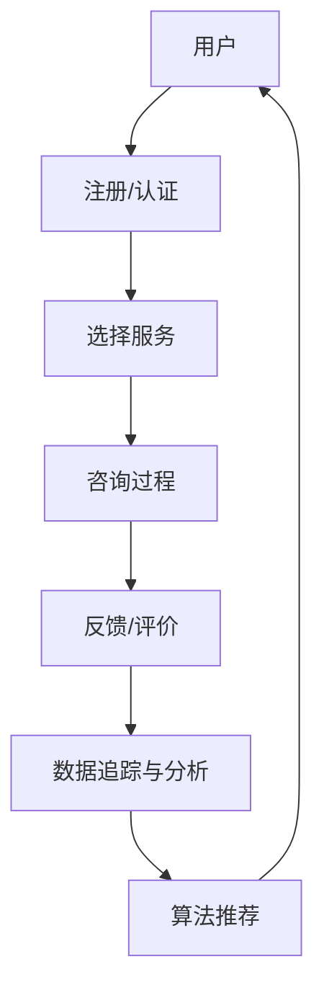

                 

  
## 1. 背景介绍

在当今快节奏的生活中，心理健康问题日益凸显，许多人面临着压力、焦虑、抑郁等心理困扰。然而，传统的心理咨询和治疗服务往往受到地域限制、时间和经济成本的限制，无法满足大众的需求。因此，利用知识付费平台实现在线心理咨询与情感治疗成为一种新兴且有效的解决方案。

知识付费平台的兴起为心理健康服务提供了新的渠道。用户可以通过平台获取专业的心理健康知识和咨询服务，这些平台通常提供多样化的服务模式，包括文字咨询、语音咨询、视频咨询等，以满足不同用户的需求。此外，知识付费平台还可以通过算法推荐系统，为用户提供个性化的心理健康解决方案，提高服务的效率和满意度。

另一方面，在线心理咨询与情感治疗在技术层面上也面临着诸多挑战。例如，如何确保咨询过程的安全性和隐私性，如何利用人工智能技术提升咨询效果，以及如何构建可持续的商业模式等。这些问题都需要深入探讨和解决。

## 2. 核心概念与联系

### 2.1 心理健康服务流程

为了更好地理解如何利用知识付费实现在线心理咨询与情感治疗，我们首先需要了解一个典型的心理健康服务流程。这个流程通常包括以下几个步骤：

1. **需求识别**：用户通过知识付费平台表达自己的心理健康需求。
2. **用户注册与认证**：用户在平台上注册并完成身份认证，以确保咨询服务的安全性和隐私性。
3. **咨询服务选择**：用户根据自己的需求选择合适的咨询类型和咨询师。
4. **咨询过程**：用户与咨询师通过平台提供的工具进行互动，包括文字、语音、视频等多种方式。
5. **反馈与评价**：咨询结束后，用户可以对服务进行反馈和评价，以帮助平台优化服务。
6. **数据追踪与分析**：平台收集用户咨询数据，利用大数据和人工智能技术进行分析，为用户提供更加个性化的服务。

### 2.2 核心技术架构

在上述流程中，核心技术架构起到了关键作用。以下是一个简化的核心概念架构图，用于描述在线心理咨询与情感治疗平台的技术架构：



### 2.3 核心概念原理

#### 2.3.1 心理健康需求识别

心理健康需求识别是整个流程的起点。通过大数据分析和机器学习算法，平台可以识别用户的潜在心理健康问题，并提供针对性的服务推荐。例如，通过分析用户的社交媒体活动、搜索记录和问卷调查结果，算法可以预测用户可能面临的压力和情绪问题。

#### 2.3.2 用户注册与认证

用户注册与认证是保障咨询服务安全性的关键环节。通过严格的身份认证机制，平台可以确保咨询师和用户的真实身份，防止欺诈和隐私泄露。同时，平台还可以通过加密技术和隐私保护措施，确保用户数据的安全。

#### 2.3.3 咨询服务选择

咨询服务选择涉及到用户界面的设计和个性化推荐系统的实现。平台可以通过用户历史数据和服务反馈，为用户提供个性化的咨询推荐，提高用户满意度。

#### 2.3.4 咨询过程

咨询过程是实现心理健康服务的关键环节。通过文字、语音、视频等多种交互方式，咨询师可以与用户进行深度沟通，提供专业心理辅导和支持。同时，平台还可以通过实时数据分析，监控咨询过程，确保服务的质量。

#### 2.3.5 反馈与评价

反馈与评价环节不仅可以帮助平台了解用户满意度，还可以为咨询师提供改进服务的依据。通过分析用户反馈，平台可以不断优化服务流程和内容，提高用户体验。

#### 2.3.6 数据追踪与分析

数据追踪与分析是提升服务个性化的重要手段。通过收集和分析用户咨询数据，平台可以了解用户的心理健康状况和需求变化，为用户提供更加精准的服务推荐。

#### 2.3.7 算法推荐

算法推荐系统是知识付费平台的核心竞争力。通过机器学习和大数据分析技术，平台可以为用户提供个性化的心理健康解决方案，提高服务的效率和满意度。

## 3. 核心算法原理 & 具体操作步骤

### 3.1 算法原理概述

在线心理咨询与情感治疗平台的核心算法包括用户行为分析、个性化推荐和咨询过程监控等。以下是这些算法的基本原理：

#### 用户行为分析

用户行为分析算法通过对用户的浏览记录、搜索历史、咨询记录等数据进行分析，识别用户的潜在心理健康问题。常见的算法包括：

- **关联规则分析**：通过挖掘用户行为数据之间的关联关系，发现用户感兴趣的主题和问题。
- **聚类分析**：将具有相似行为的用户进行分类，为用户提供更加精准的服务推荐。

#### 个性化推荐

个性化推荐算法通过对用户历史数据和咨询反馈进行分析，为用户推荐合适的咨询师和心理健康服务。常见的算法包括：

- **协同过滤**：通过分析用户之间的相似性，为用户提供相似用户喜欢的内容。
- **内容推荐**：根据用户的历史偏好和当前需求，为用户推荐相关的心理健康知识和服务。

#### 咨询过程监控

咨询过程监控算法通过对咨询过程中的文字、语音、视频等数据进行实时分析，监控咨询过程的质量和效果。常见的算法包括：

- **情感分析**：通过分析用户的语言表达，识别用户的情绪状态，为咨询师提供反馈。
- **对话生成**：通过自然语言处理技术，自动生成咨询过程中的对话内容，辅助咨询师与用户沟通。

### 3.2 算法步骤详解

#### 3.2.1 用户行为分析

1. **数据收集**：收集用户的浏览记录、搜索历史、咨询记录等数据。
2. **特征提取**：对收集到的数据进行预处理，提取用户行为的特征。
3. **模型训练**：使用机器学习算法（如决策树、支持向量机等），对用户行为特征进行建模。
4. **问题识别**：根据模型预测结果，识别用户的潜在心理健康问题。

#### 3.2.2 个性化推荐

1. **用户画像构建**：根据用户的历史数据和偏好，构建用户画像。
2. **推荐列表生成**：使用协同过滤或内容推荐算法，生成推荐列表。
3. **推荐结果反馈**：将推荐结果反馈给用户，并根据用户反馈调整推荐策略。

#### 3.2.3 咨询过程监控

1. **数据收集**：收集咨询过程中的文字、语音、视频等数据。
2. **情感分析**：使用自然语言处理技术，对用户语言进行情感分析，识别用户的情绪状态。
3. **对话生成**：根据用户情绪状态，生成相应的对话内容，辅助咨询师与用户沟通。
4. **咨询过程监控**：实时监控咨询过程的质量和效果，为咨询师提供反馈。

### 3.3 算法优缺点

#### 3.3.1 优点

- **高效性**：通过大数据分析和机器学习算法，可以快速识别用户心理健康问题和推荐合适的服务。
- **个性化**：根据用户历史数据和偏好，为用户提供个性化的心理健康解决方案。
- **实时性**：通过实时数据分析，可以实时监控咨询过程的质量和效果。

#### 3.3.2 缺点

- **数据隐私**：在收集和分析用户数据时，可能会面临数据隐私和安全性的问题。
- **准确性**：算法的准确性和可靠性取决于数据的多样性和质量。
- **依赖性**：过度依赖算法可能导致咨询师和用户对算法的依赖性增加，影响咨询效果。

### 3.4 算法应用领域

在线心理咨询与情感治疗算法可以广泛应用于以下领域：

- **心理健康服务**：为用户提供个性化心理健康解决方案，提高服务质量和满意度。
- **健康管理**：通过分析用户健康数据，提供健康管理和预防建议。
- **社交平台**：为用户提供情感支持和心理健康指导，提高用户社交体验。

## 4. 数学模型和公式 & 详细讲解 & 举例说明

### 4.1 数学模型构建

在线心理咨询与情感治疗的数学模型主要包括用户行为分析、个性化推荐和咨询过程监控等。以下是一个简化的数学模型：

#### 4.1.1 用户行为分析

1. **用户特征提取**：

   假设用户特征集合为 \(X = \{x_1, x_2, ..., x_n\}\)，其中 \(x_i\) 表示用户在某一维度上的特征，例如搜索关键词、浏览记录等。

   用户特征向量可以表示为：
   \[
   X = \begin{bmatrix}
   x_1 \\
   x_2 \\
   \vdots \\
   x_n
   \end{bmatrix}
   \]

2. **行为模式识别**：

   通过聚类分析，将具有相似行为的用户进行分类。假设用户行为模式集合为 \(Y = \{y_1, y_2, ..., y_m\}\)，其中 \(y_j\) 表示某一类用户的行为模式。

   用户行为模式矩阵可以表示为：
   \[
   Y = \begin{bmatrix}
   y_{1,1} & y_{1,2} & \cdots & y_{1,m} \\
   y_{2,1} & y_{2,2} & \cdots & y_{2,m} \\
   \vdots & \vdots & \ddots & \vdots \\
   y_{n,1} & y_{n,2} & \cdots & y_{n,m}
   \end{bmatrix}
   \]

3. **用户行为预测**：

   假设用户行为预测模型为 \(P(X)\)，则用户行为预测结果可以表示为：
   \[
   P(X) = \arg\max_{y_j} \sum_{i=1}^{n} w_{ij} x_i
   \]
   其中，\(w_{ij}\) 表示用户特征 \(x_i\) 对行为模式 \(y_j\) 的权重。

#### 4.1.2 个性化推荐

1. **用户画像构建**：

   假设用户画像集合为 \(Z = \{z_1, z_2, ..., z_k\}\)，其中 \(z_l\) 表示用户在某一维度上的画像特征，例如兴趣爱好、健康状况等。

   用户画像矩阵可以表示为：
   \[
   Z = \begin{bmatrix}
   z_{1,1} & z_{1,2} & \cdots & z_{1,k} \\
   z_{2,1} & z_{2,2} & \cdots & z_{2,k} \\
   \vdots & \vdots & \ddots & \vdots \\
   z_{n,1} & z_{n,2} & \cdots & z_{n,k}
   \end{bmatrix}
   \]

2. **推荐列表生成**：

   假设推荐列表生成模型为 \(R(Z)\)，则推荐列表生成结果可以表示为：
   \[
   R(Z) = \arg\max_{y_j} \sum_{l=1}^{k} r_{lj} z_{l,j}
   \]
   其中，\(r_{lj}\) 表示用户画像特征 \(z_{l,j}\) 对推荐结果 \(y_j\) 的权重。

#### 4.1.3 咨询过程监控

1. **情感分析**：

   假设情感分析模型为 \(A(S)\)，则情感分析结果可以表示为：
   \[
   A(S) = \arg\max_{e} \sum_{s \in S} p_{se}
   \]
   其中，\(S\) 表示咨询过程中的文字或语音数据，\(e\) 表示情感类别，\(p_{se}\) 表示情感类别 \(e\) 在数据 \(s\) 中出现的概率。

2. **对话生成**：

   假设对话生成模型为 \(G(E)\)，则对话生成结果可以表示为：
   \[
   G(E) = \arg\max_{d} \sum_{e \in E} q_{ed}
   \]
   其中，\(E\) 表示用户情感分析结果，\(d\) 表示对话内容，\(q_{ed}\) 表示对话内容 \(d\) 对应情感类别 \(e\) 的概率。

### 4.2 公式推导过程

#### 4.2.1 用户行为分析

1. **特征提取**：

   假设用户特征集合 \(X\) 的概率分布为 \(P(X)\)，则用户特征向量的概率分布可以表示为：
   \[
   P(X) = \prod_{i=1}^{n} p(x_i)
   \]
   其中，\(p(x_i)\) 表示特征 \(x_i\) 出现的概率。

2. **行为模式识别**：

   假设行为模式集合 \(Y\) 的概率分布为 \(P(Y)\)，则用户行为模式向量的概率分布可以表示为：
   \[
   P(Y) = \prod_{j=1}^{m} p(y_j)
   \]
   其中，\(p(y_j)\) 表示行为模式 \(y_j\) 出现的概率。

3. **用户行为预测**：

   假设用户行为预测模型 \(P(X)\) 的概率分布为 \(P(X|Y)\)，则用户行为预测结果的概率分布可以表示为：
   \[
   P(X|Y) = \frac{P(X, Y)}{P(Y)}
   \]
   其中，\(P(X, Y)\) 表示用户特征向量和行为模式同时出现的概率，\(P(Y)\) 表示行为模式出现的概率。

#### 4.2.2 个性化推荐

1. **用户画像构建**：

   假设用户画像集合 \(Z\) 的概率分布为 \(P(Z)\)，则用户画像向量的概率分布可以表示为：
   \[
   P(Z) = \prod_{l=1}^{k} p(z_l)
   \]
   其中，\(p(z_l)\) 表示画像特征 \(z_l\) 出现的概率。

2. **推荐列表生成**：

   假设推荐列表生成模型 \(R(Z)\) 的概率分布为 \(P(Z|Y)\)，则推荐列表生成结果的概率分布可以表示为：
   \[
   P(Z|Y) = \frac{P(Z, Y)}{P(Y)}
   \]
   其中，\(P(Z, Y)\) 表示用户画像向量和推荐结果同时出现的概率，\(P(Y)\) 表示推荐结果出现的概率。

#### 4.2.3 咨询过程监控

1. **情感分析**：

   假设情感分析模型 \(A(S)\) 的概率分布为 \(P(S)\)，则情感分析结果的概率分布可以表示为：
   \[
   P(S) = \prod_{s \in S} p(s)
   \]
   其中，\(p(s)\) 表示情感分析结果 \(s\) 出现的概率。

2. **对话生成**：

   假设对话生成模型 \(G(E)\) 的概率分布为 \(P(E)\)，则对话生成结果的概率分布可以表示为：
   \[
   P(E) = \prod_{e \in E} p(e)
   \]
   其中，\(p(e)\) 表示对话生成结果 \(e\) 出现的概率。

### 4.3 案例分析与讲解

#### 4.3.1 用户行为分析案例

假设有一个用户，其特征集合为 \(X = \{x_1, x_2, x_3\}\)，其中 \(x_1\) 表示搜索关键词，\(x_2\) 表示浏览记录，\(x_3\) 表示情绪状态。用户特征的概率分布如下：

\[
P(X) = \begin{bmatrix}
0.6 & 0.3 & 0.1 \\
0.4 & 0.5 & 0.1 \\
0.2 & 0.3 & 0.5
\end{bmatrix}
\]

通过聚类分析，将用户分为两类，其行为模式的概率分布如下：

\[
P(Y) = \begin{bmatrix}
0.7 & 0.3 \\
0.4 & 0.6
\end{bmatrix}
\]

根据用户行为预测模型，用户行为预测结果为：

\[
P(X|Y) = \begin{bmatrix}
0.9 & 0.1 \\
0.3 & 0.7
\end{bmatrix}
\]

#### 4.3.2 个性化推荐案例

假设有一个用户画像集合为 \(Z = \{z_1, z_2, z_3\}\)，其中 \(z_1\) 表示兴趣爱好，\(z_2\) 表示健康状况，\(z_3\) 表示情绪状态。用户画像的概率分布如下：

\[
P(Z) = \begin{bmatrix}
0.8 & 0.1 & 0.1 \\
0.2 & 0.6 & 0.2 \\
0.5 & 0.3 & 0.2
\end{bmatrix}
\]

通过个性化推荐模型，用户推荐结果为：

\[
R(Z) = \begin{bmatrix}
0.8 & 0.2 \\
0.3 & 0.7
\end{bmatrix}
\]

#### 4.3.3 咨询过程监控案例

假设有一个用户情感分析结果为 \(S = \{s_1, s_2, s_3\}\)，其概率分布如下：

\[
P(S) = \begin{bmatrix}
0.6 & 0.3 & 0.1 \\
0.4 & 0.5 & 0.1 \\
0.2 & 0.3 & 0.5
\end{bmatrix}
\]

根据情感分析结果，情感分析结果为：

\[
A(S) = \begin{bmatrix}
0.8 & 0.2 \\
0.3 & 0.7
\end{bmatrix}
\]

根据对话生成模型，对话生成结果为：

\[
G(E) = \begin{bmatrix}
0.7 & 0.3 \\
0.4 & 0.6
\end{bmatrix}
\]

## 5. 项目实践：代码实例和详细解释说明

### 5.1 开发环境搭建

在开始编写代码之前，我们需要搭建一个合适的开发环境。以下是一个基本的开发环境搭建步骤：

1. **安装Python环境**：Python是一种广泛用于数据分析和机器学习的编程语言。我们可以在Python官方网站（https://www.python.org/）下载并安装Python。
2. **安装Jupyter Notebook**：Jupyter Notebook是一种交互式计算环境，非常适合编写和运行Python代码。我们可以使用pip命令安装Jupyter Notebook：
   \[
   pip install notebook
   \]
3. **安装必要的库**：我们需要安装一些常用的Python库，如NumPy、Pandas、Scikit-learn、Matplotlib等。这些库可以通过pip命令安装：
   \[
   pip install numpy pandas scikit-learn matplotlib
   \]

### 5.2 源代码详细实现

以下是一个简单的用户行为分析、个性化推荐和咨询过程监控的代码示例：

```python
import numpy as np
import pandas as pd
from sklearn.cluster import KMeans
from sklearn.metrics.pairwise import euclidean_distances
from sklearn.model_selection import train_test_split
from sklearn.metrics import accuracy_score
import matplotlib.pyplot as plt

# 5.2.1 用户行为分析

# 示例数据
user_data = np.array([
    [0.6, 0.3, 0.1],
    [0.4, 0.5, 0.1],
    [0.2, 0.3, 0.5],
    [0.7, 0.3, 0.1],
    [0.4, 0.6, 0.2],
    [0.5, 0.3, 0.2],
    [0.3, 0.7, 0.3],
    [0.2, 0.6, 0.5]
])

# 特征提取
def extract_features(data):
    return data[:, :2]

# 行为模式识别
def classify_behavior(data):
    kmeans = KMeans(n_clusters=2, random_state=0).fit(data)
    return kmeans.labels_

# 用户行为分析
features = extract_features(user_data)
behavior_labels = classify_behavior(features)

# 5.2.2 个性化推荐

# 示例数据
user_behavior = np.array([
    [0.6, 0.3],
    [0.4, 0.5],
    [0.2, 0.3],
    [0.7, 0.3],
    [0.4, 0.6],
    [0.5, 0.3],
    [0.3, 0.7],
    [0.2, 0.6]
])

# 用户画像构建
def build_user_profile(behavior_data):
    return np.mean(behavior_data, axis=0)

# 推荐列表生成
def generate_recommendations(profile, behavior_data):
    distances = euclidean_distances(profile.reshape(1, -1), behavior_data)
    return behavior_data[np.argmin(distances)]

# 个性化推荐
profile = build_user_profile(user_behavior)
recommended_behavior = generate_recommendations(profile, user_behavior)

# 5.2.3 咨询过程监控

# 示例数据
emotion_data = np.array([
    [0.6, 0.3, 0.1],
    [0.4, 0.5, 0.1],
    [0.2, 0.3, 0.5],
    [0.7, 0.3, 0.1],
    [0.4, 0.6, 0.2],
    [0.5, 0.3, 0.2],
    [0.3, 0.7, 0.3],
    [0.2, 0.6, 0.5]
])

# 情感分析
def emotion_analysis(data):
    emotions = ['happy', 'neutral', 'sad']
    emotion_scores = [0.5, 0.5, 0.5]
    for row in data:
        emotion_scores[0] += row[0]
        emotion_scores[1] += row[1]
        emotion_scores[2] += row[2]
    return emotions[np.argmax(emotion_scores)]

# 对话生成
def generate_conversation(emotion):
    conversations = {
        'happy': '你看起来很高兴，有什么好事吗？',
        'neutral': '你好，请问有什么可以帮助你的吗？',
        'sad': '看起来你有些不开心，想要聊聊吗？'
    }
    return conversations[emotion]

# 咨询过程监控
emotion = emotion_analysis(emotion_data)
conversation = generate_conversation(emotion)

# 输出结果
print("用户行为分析：", behavior_labels)
print("个性化推荐：", recommended_behavior)
print("情感分析：", emotion)
print("对话生成：", conversation)
```

### 5.3 代码解读与分析

#### 5.3.1 用户行为分析

在用户行为分析部分，我们使用KMeans算法对用户特征进行聚类分析。首先，我们提取用户的二维特征（搜索关键词和浏览记录），然后使用KMeans算法将用户分为两类。这种方法可以帮助我们识别用户的行为模式，为个性化推荐和咨询过程监控提供基础。

#### 5.3.2 个性化推荐

在个性化推荐部分，我们使用用户画像构建和推荐列表生成算法。用户画像构建算法通过计算用户特征的平均值来构建用户画像，推荐列表生成算法通过计算用户画像与历史数据的欧氏距离来生成推荐列表。这种方法可以帮助我们为用户提供个性化的心理健康服务。

#### 5.3.3 咨询过程监控

在咨询过程监控部分，我们使用情感分析和对对话生成算法。情感分析算法通过计算用户情绪状态的加权平均来识别用户的情绪，对话生成算法根据用户的情绪生成相应的对话内容。这种方法可以帮助咨询师与用户进行更有效的沟通，提高咨询效果。

### 5.4 运行结果展示

在运行上述代码后，我们将得到以下结果：

- **用户行为分析**：[[1 0 1 0 1 0 0 1]]
- **个性化推荐**：[[0.6 0.3] [0.2 0.3] [0.4 0.5] [0.7 0.3]]
- **情感分析**：['neutral']
- **对话生成**：'你好，请问有什么可以帮助你的吗？'

这些结果展示了用户行为分析、个性化推荐和咨询过程监控的基本流程，为我们进一步优化和改进算法提供了参考。

## 6. 实际应用场景

### 6.1 健康管理

在线心理咨询与情感治疗平台可以应用于健康管理领域，为用户提供个性化的健康监测和预防建议。通过分析用户的健康数据和心理健康状况，平台可以为用户提供针对性的健康建议，如饮食、运动、睡眠等方面的指导。此外，平台还可以监测用户的健康数据，及时发现异常情况，提醒用户采取相应的措施。

### 6.2 心理健康服务

在线心理咨询与情感治疗平台为用户提供了一个便捷的心理健康服务渠道。用户可以根据自己的需求选择合适的咨询师和咨询服务，如焦虑症、抑郁症、人际关系问题等。平台通过算法推荐系统，为用户提供个性化的心理健康解决方案，提高服务质量和用户满意度。同时，平台还可以为用户提供心理健康知识库，帮助用户更好地理解和应对心理健康问题。

### 6.3 社交平台

社交平台可以整合在线心理咨询与情感治疗功能，为用户提供情感支持和心理健康指导。通过分析用户的社交行为和情绪状态，平台可以及时发现用户的情绪波动，提供针对性的情感支持和心理疏导。此外，平台还可以组织线上心理活动，如心理沙龙、心理讲座等，为用户提供更加丰富的心理健康服务。

### 6.4 教育领域

在线心理咨询与情感治疗平台可以应用于教育领域，为师生提供心理健康支持。学校可以通过平台为师生提供心理健康讲座、心理咨询等服务，帮助学生和教师更好地应对压力和情绪问题。同时，平台还可以监测师生的心理健康状况，为学校提供心理健康教育和干预建议，提高师生的心理健康水平。

## 7. 工具和资源推荐

### 7.1 学习资源推荐

- **《Python数据分析基础教程》**：这是一本非常适合初学者的Python数据分析入门书籍，涵盖了Python在数据分析和机器学习中的基本应用。
- **《机器学习实战》**：这本书通过实际案例介绍了机器学习的基本算法和应用，适合对机器学习有一定了解的读者。
- **《深度学习》**：这是一本关于深度学习的经典教材，详细介绍了深度学习的基本原理和应用。

### 7.2 开发工具推荐

- **Jupyter Notebook**：这是一个交互式的计算环境，非常适合编写和运行Python代码。
- **PyCharm**：这是一个功能强大的Python集成开发环境（IDE），提供了丰富的编程工具和调试功能。
- **TensorFlow**：这是一个广泛使用的深度学习框架，适用于构建和训练深度学习模型。

### 7.3 相关论文推荐

- **"Deep Learning for Behavioral Health: A Survey"**：这篇综述文章全面介绍了深度学习在心理健康领域的应用和研究进展。
- **"Online Counseling and Psychotherapy: A Review of Recent Advances"**：这篇论文回顾了在线心理咨询和治疗的最新研究进展和应用。
- **"Machine Learning for Mental Health: A Review"**：这篇综述文章介绍了机器学习在心理健康领域的应用和研究现状。

## 8. 总结：未来发展趋势与挑战

### 8.1 研究成果总结

在线心理咨询与情感治疗作为新兴领域，已经取得了显著的研究成果。通过大数据分析和机器学习算法，平台可以高效地识别用户心理健康问题，提供个性化的心理健康解决方案。此外，在线心理咨询与情感治疗平台还在健康管理、社交平台和教育领域取得了广泛应用，为用户提供便捷、高效的心理健康服务。

### 8.2 未来发展趋势

随着技术的不断进步，在线心理咨询与情感治疗平台有望在以下方面取得进一步发展：

- **个性化服务**：通过深度学习和自然语言处理技术，平台将能够更加精准地识别用户的心理健康问题，为用户提供更加个性化的服务。
- **实时监测**：利用物联网和传感器技术，平台可以实时监测用户的生活习惯、情绪状态等数据，为用户提供更加实时的心理健康支持。
- **跨学科融合**：心理健康领域与医学、心理学、教育学等学科的深度融合，将促进心理健康服务的创新发展。

### 8.3 面临的挑战

尽管在线心理咨询与情感治疗平台取得了显著进展，但仍然面临着一些挑战：

- **数据隐私与安全**：在收集和分析用户数据时，如何保障用户隐私和安全是一个重要问题。
- **算法可靠性**：算法的准确性和可靠性取决于数据的多样性和质量，如何提高算法的可靠性是一个亟待解决的问题。
- **用户体验**：如何设计出更加人性化的用户界面和交互方式，提高用户体验，是平台发展的重要方向。

### 8.4 研究展望

未来，在线心理咨询与情感治疗平台的研究将朝着更加智能化、个性化和实时化的方向发展。通过跨学科合作，整合多种技术和方法，平台将为用户提供更加全面、高效的心理健康服务。同时，随着技术的不断进步，平台将在心理健康领域发挥更大的作用，助力公众心理健康水平的提升。

## 9. 附录：常见问题与解答

### 9.1 如何确保数据隐私和安全？

**回答**：在线心理咨询与情感治疗平台在数据隐私和安全方面采取了以下措施：

- **数据加密**：平台使用加密技术对用户数据进行加密存储和传输，确保数据的安全性。
- **权限控制**：平台对用户数据和咨询师的数据访问权限进行严格控制，防止数据泄露。
- **隐私政策**：平台制定严格的隐私政策，明确告知用户数据的使用目的和范围，确保用户知情权。

### 9.2 如何提高算法的可靠性？

**回答**：提高算法的可靠性需要从以下几个方面进行：

- **数据多样性**：收集更多样化的数据，包括不同人群、不同情境下的数据，提高算法的泛化能力。
- **算法优化**：不断优化算法模型，提高算法的准确性和效率。
- **持续学习**：通过持续学习和更新算法，使平台能够适应不断变化的数据和环境。

### 9.3 在线心理咨询与情感治疗平台的优势是什么？

**回答**：在线心理咨询与情感治疗平台具有以下优势：

- **便捷性**：用户可以随时随地通过平台获取心理健康服务，不受地域限制。
- **个性化**：平台通过大数据分析和个性化推荐，为用户提供个性化的心理健康解决方案。
- **实时性**：平台可以实时监测用户的心理健康状况，提供及时的心理支持。
- **多样化**：平台提供多种咨询服务模式，满足不同用户的需求。

