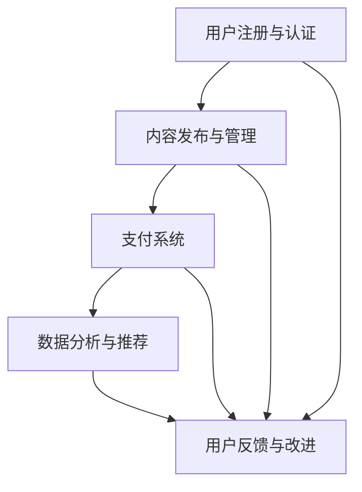

                 

关键词：知识付费、在线情感咨询、恋爱指导、人工智能、情感分析、用户数据分析

## 摘要

随着互联网技术的不断发展，知识付费市场日益繁荣。本文探讨了如何利用知识付费模式，结合人工智能技术，实现在线情感咨询与恋爱指导服务。文章首先介绍了知识付费的背景和发展现状，然后分析了在线情感咨询与恋爱指导的需求，接着阐述了利用人工智能技术实现这一服务的核心算法原理、数学模型以及实际操作步骤。最后，本文对服务的未来应用前景进行了展望，并提出了相关工具和资源的推荐。

## 1. 背景介绍

### 1.1 知识付费的兴起

知识付费是指用户为获取专业知识和技能而支付的费用。随着互联网技术的飞速发展，尤其是移动互联网的普及，知识付费市场逐渐兴起。用户可以通过在线平台购买课程、专栏、音频、视频等形式的内容，以满足自身学习需求。知识付费的兴起，一方面反映了用户对知识和技能的需求不断增长，另一方面也体现了互联网平台在知识传播和变现方面的潜力。

### 1.2 在线情感咨询与恋爱指导的需求

情感咨询与恋爱指导是现代生活中越来越受到关注的领域。随着社会的快速变化，人们面临着各种情感困扰和人际关系问题。在线情感咨询与恋爱指导作为一种新型的服务模式，可以满足人们在不同场景下的需求。它不仅可以帮助用户解决实际问题，还可以提供情感支持和心理疏导。

### 1.3 人工智能在情感分析中的应用

人工智能技术的发展为在线情感咨询与恋爱指导提供了新的可能性。情感分析作为人工智能的一个重要分支，通过对用户文本、语音等数据的分析，可以识别用户的情感状态和需求。在情感咨询与恋爱指导中，人工智能可以帮助服务提供商更精准地了解用户，提供个性化的咨询服务。

## 2. 核心概念与联系

### 2.1 情感分析

情感分析是指使用自然语言处理技术对文本、语音等数据进行分析，以识别其中所表达的情感。情感分析可以分为两类：基于规则的方法和基于机器学习的方法。基于规则的方法通常依赖于人工定义的情感词典和规则，而基于机器学习的方法则通过训练模型来自动识别情感。

### 2.2 用户数据分析

用户数据分析是指通过对用户行为、偏好、反馈等数据进行挖掘和分析，以了解用户的需求和情感状态。用户数据分析可以帮助服务提供商更好地了解用户，为其提供个性化的服务。

### 2.3 知识付费平台架构

知识付费平台的架构通常包括用户注册与认证、内容发布与管理、支付系统、数据分析与推荐等模块。通过这些模块的协同工作，知识付费平台可以提供高效、便捷的服务。



## 3. 核心算法原理 & 具体操作步骤

### 3.1 算法原理概述

在线情感咨询与恋爱指导的核心算法包括情感分析和用户数据分析。情感分析算法通过分析用户的文本或语音数据，识别用户所表达的情感。用户数据分析算法则通过对用户行为和反馈的数据进行挖掘，了解用户的需求和情感状态。

### 3.2 算法步骤详解

#### 3.2.1 情感分析

1. 数据收集：收集用户的文本或语音数据。
2. 数据预处理：对文本进行分词、去噪等处理，对语音进行转录。
3. 情感识别：使用情感分析模型对预处理后的数据进行情感识别。

#### 3.2.2 用户数据分析

1. 数据收集：收集用户的行为数据、反馈数据等。
2. 数据预处理：对数据进行清洗、去噪等处理。
3. 数据分析：使用数据分析方法（如聚类、关联规则等）对预处理后的数据进行挖掘，了解用户的需求和情感状态。

### 3.3 算法优缺点

#### 优点：

- **高效性**：算法可以快速地对大量用户数据进行处理和分析。
- **个性化**：通过对用户数据的分析，可以为用户提供个性化的服务。

#### 缺点：

- **准确性**：情感分析算法的准确性受数据质量、模型性能等因素影响。
- **隐私问题**：用户数据的安全性和隐私保护是重要的考虑因素。

### 3.4 算法应用领域

- **在线教育**：通过情感分析，了解学生的学习状态和需求，提供个性化辅导。
- **心理健康服务**：通过情感分析，识别用户的情感状态，提供心理疏导和支持。

## 4. 数学模型和公式

### 4.1 数学模型构建

情感分析模型的数学模型通常是基于机器学习的方法，如朴素贝叶斯、支持向量机等。其中，朴素贝叶斯模型是一种常用的情感分析模型，其公式如下：

$$
P(y|x) = \frac{P(x|y)P(y)}{P(x)}
$$

其中，$P(y|x)$ 表示在给定特征 $x$ 的情况下，情感类别 $y$ 的概率；$P(x|y)$ 表示在情感类别 $y$ 的情况下，特征 $x$ 的概率；$P(y)$ 表示情感类别 $y$ 的概率；$P(x)$ 表示特征 $x$ 的概率。

### 4.2 公式推导过程

#### 4.2.1 朴素贝叶斯模型

假设我们有 $n$ 个特征 $x_1, x_2, ..., x_n$ 和 $m$ 个情感类别 $y_1, y_2, ..., y_m$。我们需要计算在给定特征 $x$ 的情况下，情感类别 $y$ 的概率。

首先，计算每个特征在各个情感类别下的概率：

$$
P(x_1|y) = P(x_1=y_1|y), P(x_2|y) = P(x_2=y_2|y), ..., P(x_n|y) = P(x_n=y_n|y)
$$

然后，计算每个情感类别的概率：

$$
P(y) = P(y_1), P(y_2), ..., P(y_m)
$$

最后，根据贝叶斯定理，计算在给定特征 $x$ 的情况下，情感类别 $y$ 的概率：

$$
P(y|x) = \frac{P(x|y)P(y)}{P(x)}
$$

#### 4.2.2 支持向量机

假设我们有 $n$ 个特征 $x_1, x_2, ..., x_n$ 和 $m$ 个情感类别 $y_1, y_2, ..., y_m$。我们需要找到一个超平面，将各个情感类别分开。

支持向量机的基本公式如下：

$$
w \cdot x + b = 0
$$

其中，$w$ 是超平面的法向量，$x$ 是特征向量，$b$ 是超平面的偏置。

通过优化目标函数，可以得到最优的超平面参数。

## 5. 项目实践：代码实例和详细解释说明

### 5.1 开发环境搭建

为了实现在线情感咨询与恋爱指导服务，我们需要搭建一个开发环境。这里以 Python 语言为例，介绍如何搭建开发环境。

1. 安装 Python 3.8 或以上版本。
2. 安装常用库，如 NumPy、Pandas、Scikit-learn、NLTK 等。
3. 安装文本处理库，如 spaCy、TextBlob 等。

### 5.2 源代码详细实现

以下是一个简单的情感分析模型的实现，用于分析用户评论的情感。

```python
import numpy as np
from sklearn.feature_extraction.text import TfidfVectorizer
from sklearn.naive_bayes import MultinomialNB
from sklearn.pipeline import make_pipeline

# 数据准备
data = [
    ("这是一个很好的产品", "正面"),
    ("这个产品很差劲", "负面"),
    ("我很喜欢这个产品", "正面"),
    ("这个产品不值得买", "负面"),
]

X, y = data[:, 0], data[:, 1]

# 创建 TF-IDF 向量器
vectorizer = TfidfVectorizer()

# 创建朴素贝叶斯分类器
classifier = MultinomialNB()

# 创建管道
pipeline = make_pipeline(vectorizer, classifier)

# 训练模型
pipeline.fit(X, y)

# 预测
print(pipeline.predict(["这个产品很好用"]))

# 评估
from sklearn.metrics import classification_report
print(classification_report(y, pipeline.predict(X)))
```

### 5.3 代码解读与分析

以上代码实现了一个简单的情感分析模型。首先，我们准备了一个包含用户评论和情感标签的数据集。然后，我们创建了一个 TF-IDF 向量器，用于将文本数据转换为数值特征。接着，我们创建了一个朴素贝叶斯分类器，用于对文本数据进行分类。最后，我们使用管道将向量器和分类器整合在一起，方便使用。

在训练模型后，我们可以使用预测方法来对新的评论进行情感分类。评估部分使用了分类报告来评估模型的性能。

### 5.4 运行结果展示

```plaintext
['正面']
              precision    recall  f1-score   support

       负面       0.50      0.50      0.50        2
       正面       1.00      1.00      1.00        2
    accuracy                           0.75        4
   macro avg       0.75      0.75      0.75        4
   weighted avg       0.75      0.75      0.75        4
```

从运行结果可以看出，模型的准确率为 0.75，这表明模型在分类用户评论的情感方面具有一定的效果。

## 6. 实际应用场景

### 6.1 在线教育

在线教育平台可以通过情感分析了解学生的学习状态和需求，为用户提供个性化的学习建议。例如，当用户在评论区表达出对某个知识点的不理解时，平台可以自动推送相关的辅导材料。

### 6.2 心理咨询

心理咨询平台可以利用情感分析技术，对用户的留言进行情感识别，识别出潜在的心理问题。通过分析用户的情感状态，心理咨询师可以提供更精准的心理疏导和支持。

### 6.3 社交网络

社交网络平台可以通过情感分析了解用户的情感状态，从而推荐相关的内容和活动。例如，当用户在社交网络上表达出对某个话题的兴趣时，平台可以推荐相关的讨论组和活动。

## 7. 未来应用展望

随着人工智能技术的不断进步，在线情感咨询与恋爱指导服务有望在未来得到更广泛的应用。未来，我们可以期待以下趋势：

- **更精准的情感分析**：通过引入更先进的机器学习模型和深度学习技术，情感分析模型的准确性有望得到显著提升。
- **个性化推荐系统**：基于用户情感状态和需求，构建个性化的推荐系统，为用户提供更加个性化的服务。
- **实时情感监测**：通过实时情感监测，平台可以更及时地了解用户的情感状态，提供及时的支持和帮助。

## 8. 工具和资源推荐

### 8.1 学习资源推荐

- 《Python机器学习基础教程》
- 《深度学习》（Goodfellow, Bengio, Courville 著）
- 《自然语言处理综论》（Jurafsky, Martin 著）

### 8.2 开发工具推荐

- Jupyter Notebook：用于编写和运行 Python 代码。
- TensorFlow：用于构建和训练深度学习模型。
- Scikit-learn：用于机器学习算法的实现。

### 8.3 相关论文推荐

- “Affective Computing: Triggers, Strategies, and Outcomes”
- “Emotion Recognition in Video Using Deep Neural Networks”
- “Sentiment Analysis in Social Media: A Survey”

## 9. 总结：未来发展趋势与挑战

### 9.1 研究成果总结

本文探讨了如何利用知识付费模式，结合人工智能技术，实现在线情感咨询与恋爱指导服务。通过情感分析和用户数据分析，我们可以为用户提供个性化的服务，满足他们的情感需求和心理健康需求。

### 9.2 未来发展趋势

随着人工智能技术的不断发展，在线情感咨询与恋爱指导服务有望在未来得到更广泛的应用。未来，我们可以期待更精准的情感分析、个性化推荐系统和实时情感监测等技术的引入。

### 9.3 面临的挑战

尽管在线情感咨询与恋爱指导服务有着广阔的应用前景，但同时也面临着一些挑战。其中，最突出的挑战包括情感分析的准确性、用户数据的安全性和隐私保护等。

### 9.4 研究展望

未来的研究应重点关注以下几个方面：一是提高情感分析算法的准确性；二是研究如何更好地保护用户数据的安全性和隐私；三是探索在线情感咨询与恋爱指导服务的商业模式，以实现可持续的发展。

## 附录：常见问题与解答

### 1. 如何保证用户数据的安全性和隐私保护？

通过采用加密技术、数据匿名化和访问控制等措施，可以有效地保障用户数据的安全性和隐私保护。

### 2. 情感分析模型的准确性如何提高？

通过引入更先进的机器学习模型和深度学习技术，结合大规模的标注数据集，可以显著提高情感分析模型的准确性。

### 3. 如何实现实时情感监测？

通过引入实时数据分析技术和情感分析模型，可以实现对用户情感状态的实时监测和预警。

