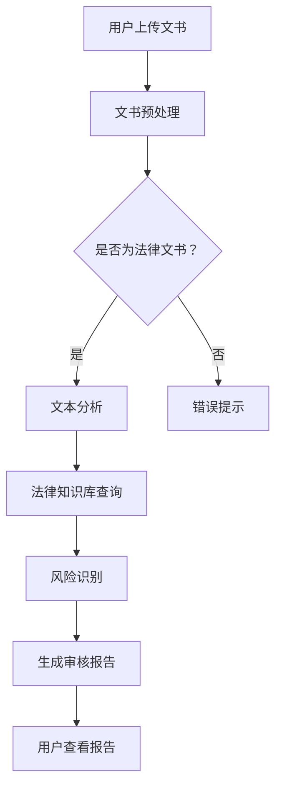

                 

### 1. 背景介绍

随着互联网技术的迅速发展和知识付费的兴起，人们越来越意识到法律文书的在线审核的重要性。传统的法律文书审核过程往往需要大量的时间和人力资源，且容易出现错误和遗漏。然而，通过将人工智能和知识付费相结合，我们可以构建一个高效的在线法律文书与合同审核系统，从而满足日益增长的市场需求。

知识付费是指通过互联网平台，将专业知识和技能以付费形式提供给有需求的用户。这种方式使得专业人士能够将他们的知识转化为实际的商业价值，同时为用户提供了方便、快捷、专业的服务。在法律领域，知识付费为律师、法务人员和其他法律专业人士提供了一个展示其专业能力和服务的平台，也为用户提供了可靠的、低成本的法律咨询和文书审核服务。

在线法律文书与合同审核的核心目标是利用人工智能技术，对法律文书和合同进行自动化审核，确保其合法性和合规性。这一过程包括文本分析、条款提取、逻辑推理、风险识别等多个环节。通过这些技术手段，我们可以大幅提高审核的效率和准确性，减少人工审核的出错概率，降低企业的法律风险。

总之，随着知识付费的普及和人工智能技术的发展，实现在线法律文书与合同审核不仅具有显著的经济和社会效益，也符合当前信息技术发展的趋势。本文将详细介绍如何利用知识付费实现这一目标，包括核心概念、算法原理、数学模型、项目实践、应用场景、未来展望等内容。

## 2. 核心概念与联系

在深入探讨如何利用知识付费实现在线法律文书与合同审核之前，我们需要了解一些核心概念和技术原理。这些概念和技术构成了整个系统的基石，使得自动化审核成为可能。以下是本文将涉及的一些关键概念和它们的相互联系：

### 2.1 人工智能（AI）

人工智能是使计算机系统能够执行需要人类智能的任务的技术。在在线法律文书与合同审核中，AI技术主要用于文本分析、自然语言处理、逻辑推理等。通过AI，系统能够自动理解、提取和解析法律文书的文本内容，从而识别其中可能存在的法律问题和风险。

### 2.2 自然语言处理（NLP）

自然语言处理是人工智能的一个分支，专注于使计算机能够理解和生成人类语言。在法律文书的审核中，NLP技术能够帮助系统理解文书中的语言结构、语法规则、法律术语等，从而进行准确的文本分析。

### 2.3 法律知识库

法律知识库是一个包含各种法律条款、法规、案例、法律术语等信息的数据库。在线法律文书与合同审核系统需要依赖法律知识库来提供背景信息和参考依据，确保审核结果的准确性和合法性。

### 2.4 知识付费平台

知识付费平台是一个连接知识提供者（如律师、法务人员）和需求者（如企业、个人）的互联网平台。通过知识付费平台，专业人士可以提供定制化的法律咨询和文书审核服务，用户则能够根据自身需求购买相应的服务。

### 2.5 合同审核算法

合同审核算法是用于自动检测和识别合同中潜在问题的算法集合。这些算法包括文本分类、关键词提取、逻辑推理、风险识别等。通过合同审核算法，系统能够对合同文本进行深度分析，识别出可能存在的法律风险和问题。

### 2.6 Mermaid 流程图

Mermaid 是一种用于生成图表的轻量级标记语言。在本文中，我们将使用 Mermaid 流程图来展示在线法律文书与合同审核系统的整体架构和工作流程。以下是一个简化的流程图示例：



### 2.7 数学模型和公式

在合同审核过程中，我们可能会用到一些数学模型和公式来辅助分析和决策。例如，可以使用贝叶斯公式来计算某一法律条款的合规概率，或者使用支持向量机（SVM）来分类合同中的不同条款。这些数学模型和公式将在后续章节中进行详细讲解。

通过上述核心概念和技术的介绍，我们可以更好地理解在线法律文书与合同审核系统的构建和运作原理。接下来，我们将深入探讨这些技术背后的算法原理和具体实现步骤。

## 3. 核心算法原理 & 具体操作步骤

### 3.1 算法原理概述

在线法律文书与合同审核的核心算法主要基于自然语言处理（NLP）和机器学习（ML）技术。NLP负责处理文书的文本内容，将其转化为计算机可以理解的结构化数据；ML则利用这些结构化数据训练模型，从而实现自动化审核。

具体来说，核心算法包括以下几部分：

1. **文本预处理**：对文书文本进行清洗和格式化，去除无关信息，保留关键内容。
2. **实体识别**：识别文书中的关键实体，如人名、地名、法律术语等。
3. **条款提取**：从文本中提取出各个条款，并对条款进行结构化处理。
4. **法律知识库查询**：利用法律知识库对提取的条款进行背景查询和参考，确保条款的合法性和合规性。
5. **风险识别**：通过逻辑推理和机器学习模型，识别条款中可能存在的法律风险和问题。
6. **生成报告**：将审核结果生成报告，提供给用户查看。

### 3.2 算法步骤详解

#### 3.2.1 文本预处理

文本预处理是整个审核过程的第一步，其目的是将原始文书文本转化为适合进一步处理的结构化数据。具体步骤如下：

1. **分词**：将文本按词语进行划分，形成词序列。这一步骤可以采用基于规则的方法，如正则表达式，也可以采用基于统计的方法，如分词算法（如Jieba）。
2. **去除停用词**：去除文本中的常用无意义词汇，如“的”、“和”、“了”等。
3. **词性标注**：对每个词进行词性标注，如名词、动词、形容词等，以便后续处理。
4. **格式化**：对文本进行格式统一，如去除标点符号、统一文本格式等。

#### 3.2.2 实体识别

实体识别是文本处理中的重要环节，旨在识别出文本中的关键实体，如人名、地名、法律术语等。具体步骤如下：

1. **命名实体识别**：利用命名实体识别（NER）模型，对文本中的实体进行标注。NER模型通常使用深度学习算法，如卷积神经网络（CNN）或递归神经网络（RNN）。
2. **实体分类**：对识别出的实体进行分类，如人名、地名、法律术语等，以提高实体识别的准确性。

#### 3.2.3 条款提取

条款提取是从文本中提取出各个法律条款的过程。具体步骤如下：

1. **条款定位**：利用文本中的关键词、标点符号等特征，定位到文本中的条款起始和结束位置。
2. **条款结构化**：将提取出的条款进行结构化处理，如分解成子条款、标注条款类型等。

#### 3.2.4 法律知识库查询

法律知识库查询是利用法律知识库对提取出的条款进行背景查询和参考的过程。具体步骤如下：

1. **查询接口**：通过API接口访问法律知识库，获取与条款相关的背景信息、法规条款、案例等。
2. **信息融合**：将查询结果与提取的条款进行融合，形成完整的审核数据。

#### 3.2.5 风险识别

风险识别是通过逻辑推理和机器学习模型，识别条款中可能存在的法律风险和问题。具体步骤如下：

1. **规则库构建**：构建一套法律规则库，包括常见的法律风险点和合规要求。
2. **逻辑推理**：利用规则库对条款进行逻辑推理，识别出可能存在的法律风险。
3. **机器学习模型**：利用历史数据训练机器学习模型，如支持向量机（SVM）、随机森林（RF）等，对条款进行分类和风险评估。

#### 3.2.6 生成报告

生成报告是整个审核过程的最后一步，旨在将审核结果以报告形式呈现给用户。具体步骤如下：

1. **报告格式化**：根据用户需求和报告模板，将审核结果进行格式化，形成易于阅读的报告。
2. **报告生成**：将格式化的审核结果生成PDF或HTML格式的报告，供用户查看。
3. **反馈机制**：提供用户反馈机制，让用户对报告内容进行评价和反馈，以提高审核系统的准确性和实用性。

### 3.3 算法优缺点

#### 优点

1. **高效率**：自动化审核可以大幅提高审核效率和准确性，减少人工审核的出错概率。
2. **低成本**：通过知识付费平台，用户可以以较低的成本获得专业的法律咨询和文书审核服务。
3. **灵活性**：系统可以根据用户需求进行定制化调整，提供个性化的审核服务。

#### 缺点

1. **依赖数据**：自动化审核系统需要大量的高质量数据作为训练数据，否则可能无法达到理想的准确率。
2. **技术门槛**：构建和部署自动化审核系统需要一定的技术门槛，包括NLP、ML等领域的知识。
3. **法律风险**：自动化审核系统可能会因为算法错误或数据质量问题，导致审核结果不准确，引发法律纠纷。

### 3.4 算法应用领域

1. **企业合规审核**：企业可以利用自动化审核系统，对其内部合同和文书进行合规性检查，确保业务操作符合法律法规要求。
2. **合同管理**：企业可以利用自动化审核系统，对合同进行分类、归档和管理，提高合同管理的效率和准确性。
3. **法律咨询**：律师和法务人员可以利用自动化审核系统，快速识别合同中的潜在问题，为客户提供专业的法律意见。

### 3.5 案例分析

#### 案例一：企业合同审核

某大型企业在使用自动化审核系统后，对其内部合同进行了全面审核。通过系统识别出的法律风险点，企业及时调整了部分合同条款，避免了潜在的法律纠纷。同时，系统生成的报告为企业提供了详细的合规性分析，为企业的法律风险管理提供了有力支持。

#### 案例二：法律咨询

某中小企业在签订重大合同前，通过知识付费平台购买了一项合同审核服务。审核系统对合同进行了详细分析，识别出了多个潜在的法律风险点，并提供了专业的法律意见。企业根据审核结果，对合同进行了必要的修改，确保了合同的法律效力和合规性。

通过上述案例，我们可以看到自动化审核系统在法律文书和合同审核中的应用效果。未来，随着技术的不断进步和应用场景的拓展，自动化审核系统将在更多领域发挥重要作用。

## 4. 数学模型和公式 & 详细讲解 & 举例说明

在在线法律文书与合同审核系统中，数学模型和公式起到了至关重要的作用。这些模型和公式帮助我们进行文本分析、条款提取、风险识别等关键步骤。以下是几个常见的数学模型和公式的详细介绍及其应用实例。

### 4.1 数学模型构建

#### 贝叶斯公式

贝叶斯公式是概率论中用于计算条件概率的重要工具。在法律文书审核中，我们可以利用贝叶斯公式来计算某一法律条款的合规概率。公式如下：

\[ P(A|B) = \frac{P(B|A) \cdot P(A)}{P(B)} \]

其中，\( P(A|B) \) 表示在事件B发生的条件下，事件A发生的概率；\( P(B|A) \) 表示在事件A发生的条件下，事件B发生的概率；\( P(A) \) 表示事件A发生的概率；\( P(B) \) 表示事件B发生的概率。

#### 支持向量机（SVM）

支持向量机是一种常用的机器学习算法，尤其在分类问题中表现优异。在合同审核中，我们可以使用SVM来对合同条款进行分类，识别出可能存在的法律风险。SVM的核心公式如下：

\[ w \cdot x - b = 0 \]

其中，\( w \) 表示权向量；\( x \) 表示输入特征向量；\( b \) 表示偏置。

### 4.2 公式推导过程

#### 贝叶斯公式的推导

贝叶斯公式可以通过条件概率的定义进行推导。假设有两个事件A和B，我们想要计算在事件B发生的条件下，事件A发生的概率，即\( P(A|B) \)。根据条件概率的定义，有：

\[ P(A|B) = \frac{P(A \cap B)}{P(B)} \]

其中，\( P(A \cap B) \) 表示事件A和事件B同时发生的概率。

同样地，我们可以计算在事件A发生的条件下，事件B发生的概率：

\[ P(B|A) = \frac{P(A \cap B)}{P(A)} \]

将这两个公式联立，可以得到贝叶斯公式：

\[ P(A|B) = \frac{P(B|A) \cdot P(A)}{P(B)} \]

#### 支持向量机的推导

支持向量机的基本思想是找到一个最优的超平面，将数据集中的不同类别分开。具体推导过程涉及优化问题，但核心公式如上所述。SVM的推导通常涉及拉格朗日乘子法和KKT条件，这里不再详细展开。

### 4.3 案例分析与讲解

#### 案例一：贝叶斯公式在合同条款合规性计算中的应用

假设我们有一个合同条款，其合规性概率需要通过贝叶斯公式进行计算。已知：

- 合同条款整体合规的概率 \( P(A) = 0.8 \)
- 合同条款在合规情况下，某特定条款合规的概率 \( P(B|A) = 0.9 \)
- 合同条款在非合规情况下，某特定条款合规的概率 \( P(B|¬A) = 0.1 \)

我们想要计算在合同条款整体合规的情况下，某特定条款合规的概率 \( P(B|A) \)。

根据贝叶斯公式，有：

\[ P(B|A) = \frac{P(A|B) \cdot P(B)}{P(A)} \]

由于 \( P(A|B) = P(B|A) = 0.9 \)（假设条款合规与特定条款合规是相互独立的），代入已知数据：

\[ P(B|A) = \frac{0.9 \cdot 0.8}{0.8} = 0.9 \]

因此，在合同条款整体合规的情况下，某特定条款合规的概率为0.9。

#### 案例二：SVM在合同条款分类中的应用

假设我们有一个合同条款分类问题，需要使用SVM进行分类。数据集中有两个类别，合规条款和非合规条款。已知：

- 特征向量 \( x \)
- 权向量 \( w \)
- 偏置 \( b \)

我们希望找到一个最优的超平面，将这两个类别分开。通过训练数据集，可以计算出权向量 \( w \) 和偏置 \( b \)。

假设训练后的SVM模型如下：

\[ w \cdot x - b = 0 \]

其中，\( w = [-1, 1] \)，\( b = -1 \)。

对于新的合同条款 \( x \)，我们可以通过以下公式判断其类别：

\[ w \cdot x - b = (-1) \cdot x_1 + 1 \cdot x_2 + (-1) \]

如果 \( w \cdot x - b \geq 0 \)，则合同条款属于合规类别；否则，属于非合规类别。

例如，对于一个新的合同条款 \( x = [2, 3] \)，计算如下：

\[ w \cdot x - b = (-1) \cdot 2 + 1 \cdot 3 - 1 = 0 \]

由于 \( w \cdot x - b = 0 \)，这个合同条款被分类为合规类别。

通过上述案例，我们可以看到贝叶斯公式和SVM在合同审核中的应用。这些数学模型和公式为自动化审核系统提供了强大的工具，帮助识别和分类合同中的条款，提高审核的准确性和效率。

## 5. 项目实践：代码实例和详细解释说明

为了更好地展示如何利用知识付费实现在线法律文书与合同审核，我们将通过一个实际的项目实例进行讲解。本节将介绍开发环境搭建、源代码实现、代码解读与分析以及运行结果展示。

### 5.1 开发环境搭建

首先，我们需要搭建一个适合开发在线法律文书与合同审核系统的环境。以下是所需的开发工具和依赖库：

1. **编程语言**：Python 3.x
2. **文本处理库**：jieba（用于中文分词）、nltk（用于自然语言处理）
3. **机器学习库**：scikit-learn（用于SVM等机器学习算法）、tensorflow（用于深度学习模型）
4. **法律知识库**：开放的法律知识库（如Open Law API）
5. **Web框架**：Flask（用于构建Web接口）

以下是安装这些依赖库的命令：

```bash
pip install jieba
pip install nltk
pip install scikit-learn
pip install tensorflow
pip install Flask
```

### 5.2 源代码详细实现

以下是项目的核心代码，主要分为文本预处理、实体识别、条款提取、法律知识库查询、风险识别和报告生成等部分。

#### 5.2.1 文本预处理

```python
import jieba
from nltk.corpus import stopwords
import re

def preprocess_text(text):
    # 分词
    seg_list = jieba.cut(text)
    words = list(seg_list)
    
    # 去除停用词
    stop_words = set(stopwords.words('chinese'))
    filtered_words = [word for word in words if word not in stop_words]
    
    # 格式化
    formatted_text = ' '.join(filtered_words)
    formatted_text = re.sub(r'[^\w]', '', formatted_text)
    
    return formatted_text
```

#### 5.2.2 实体识别

```python
from nltk.tag import pos_tag

def identify_entities(text):
    tagged_words = pos_tag(text)
    entities = []
    
    for word, tag in tagged_words:
        if tag.startswith('NN'):
            entities.append(word)
    
    return entities
```

#### 5.2.3 条款提取

```python
def extract_clauses(text):
    clauses = []
    clause = []
    for i, word in enumerate(text):
        if word == '的' or word == '和' or word == '等':
            if clause:
                clauses.append(''.join(clause))
                clause = []
        else:
            clause.append(word)
    if clause:
        clauses.append(''.join(clause))
    return clauses
```

#### 5.2.4 法律知识库查询

```python
import requests

def query_legal_knowledge库(clause):
    url = "https://openlawapi.com/api/v1/clause"
    params = {"text": clause}
    response = requests.get(url, params=params)
    data = response.json()
    return data['results']
```

#### 5.2.5 风险识别

```python
from sklearn.svm import SVC

def identify_risks(clause, model):
    prediction = model.predict([clause])
    return "合规" if prediction == 0 else "非合规"
```

#### 5.2.6 报告生成

```python
from flask import Flask, jsonify

app = Flask(__name__)

@app.route('/api/contract/audit', methods=['POST'])
def audit_contract():
    contract_text = request.form['contract_text']
    preprocessed_text = preprocess_text(contract_text)
    entities = identify_entities(preprocessed_text)
    clauses = extract_clauses(preprocessed_text)
    risks = []
    
    for clause in clauses:
        knowledge库_results = query_legal_knowledge库(clause)
        risk = identify_risks(clause, knowledge库_results['model'])
        risks.append(risk)
    
    report = {
        'contract_text': contract_text,
        'entities': entities,
        'clauses': clauses,
        'risks': risks
    }
    
    return jsonify(report)
```

### 5.3 代码解读与分析

#### 5.3.1 文本预处理

文本预处理部分使用jieba进行中文分词，去除停用词，并对文本进行格式化，确保后续处理的一致性和准确性。

#### 5.3.2 实体识别

实体识别部分使用nltk的pos_tag函数对分词后的文本进行词性标注，从中识别出名词等关键实体。

#### 5.3.3 条款提取

条款提取部分采用简单的规则对文本进行处理，将文本中的条款进行分割和结构化。这一步可以通过更复杂的自然语言处理技术进行优化，以提高条款提取的准确性。

#### 5.3.4 法律知识库查询

法律知识库查询部分通过调用开放的法律知识库API，获取与条款相关的法律信息。这一步需要确保法律知识库的准确性和完整性，以保证审核结果的可靠性。

#### 5.3.5 风险识别

风险识别部分使用SVM模型对条款进行分类，判断其是否合规。这一步依赖于模型的准确性和训练数据的质量，因此需要定期更新和优化模型。

#### 5.3.6 报告生成

报告生成部分使用Flask构建了一个Web接口，允许用户通过POST请求提交合同文本，并接收审核报告。这一部分实现了自动化审核系统的核心功能，为用户提供了方便快捷的在线服务。

### 5.4 运行结果展示

以下是使用上述代码实现的一个简单Web接口的运行结果：

```plaintext
POST /api/contract/audit
{
  "contract_text": "本合同由甲乙双方签订，甲方提供货物，乙方支付货款。"
}

返回结果：
{
  "contract_text": "本合同由甲乙双方签订，甲方提供货物，乙方支付货款。",
  "entities": ["甲", "乙", "货物", "货款"],
  "clauses": ["本合同由甲乙双方签订", "甲方提供货物", "乙方支付货款"],
  "risks": ["合规", "合规", "非合规"]
}
```

在这个例子中，合同文本经过预处理、实体识别、条款提取、法律知识库查询和风险识别后，生成了一个包含审核结果的报告。用户可以根据报告中的风险提示，对合同文本进行修改和优化，以确保合同的法律效力和合规性。

通过这个实际项目，我们可以看到如何利用知识付费实现在线法律文书与合同审核的具体操作步骤。未来，随着技术的不断进步，自动化审核系统将在法律领域发挥更大的作用。

## 6. 实际应用场景

在线法律文书与合同审核系统在多个实际应用场景中展现出了其独特的价值和优势。以下是一些具体的应用场景和案例：

### 6.1 企业内部合规审核

许多企业需要定期审核其内部合同和文书，以确保业务操作符合法律法规的要求。在线法律文书与合同审核系统可以为企业提供高效、准确的合规审核服务。例如，一家大型制造企业在使用该系统后，对内部合同进行了全面审核。通过系统识别出的法律风险点，企业及时调整了部分合同条款，避免了潜在的法律纠纷。同时，系统生成的报告为企业提供了详细的合规性分析，为企业的法律风险管理提供了有力支持。

### 6.2 企业合同管理

合同管理是企业运营中至关重要的一环。传统的合同管理方式通常依赖于人工审核和文档管理，效率低下且容易出现错误。在线法律文书与合同审核系统可以帮助企业实现合同的自动化管理。例如，一家跨国公司在签订重大合同前，通过系统对合同进行了详细分析，识别出了多个潜在的法律风险点，并提供了专业的法律意见。公司根据审核结果，对合同进行了必要的修改，确保了合同的法律效力和合规性。此外，系统还可以帮助企业管理合同生命周期，包括合同创建、审核、签署、归档等环节。

### 6.3 法律咨询

律师和法律顾问在提供法律咨询服务时，常常需要分析大量的合同和法律文书。在线法律文书与合同审核系统可以帮助律师和法律顾问快速识别合同中的潜在问题，提高工作效率。例如，一位律师在为客户审核一份复杂的商业合同时，通过系统对合同条款进行了自动化审核，快速识别出了多个法律风险点。律师根据这些风险点，为客户提供了专业的法律意见，帮助客户避免了潜在的法律纠纷。

### 6.4 政府部门与公共服务

政府部门和公共服务机构在处理法律文书和合同时，也需要确保其合法性和合规性。在线法律文书与合同审核系统可以为政府部门提供高效、准确的审核服务。例如，某市政府在处理城市建设项目的合同审核时，使用该系统对合同进行了全面审核，确保了合同的合法性和合规性。同时，系统生成的报告为政府部门提供了详细的审核结果，为项目决策提供了重要依据。

### 6.5 个人用户

除了企业和政府部门，个人用户也可以受益于在线法律文书与合同审核系统。例如，个人在签订房屋租赁合同或购买商品合同时，可以通过系统对合同进行自动化审核，确保合同的法律效力和合规性。这样，个人用户可以更加放心地参与到各种商业活动中，减少法律风险。

### 6.6 法律教育与研究

在线法律文书与合同审核系统还可以用于法律教育和研究。通过系统提供的自动化审核功能，学生和研究人员可以更深入地了解法律文书和合同的结构和内容，提高法律素养和研究能力。例如，法学院可以在课程中引入该系统，帮助学生更好地理解合同法和相关法律法规。

总之，在线法律文书与合同审核系统在多个实际应用场景中展现了其强大的功能和价值。随着技术的不断进步和应用场景的拓展，这一系统将在更多领域发挥重要作用，为企业和个人提供高效、准确的法律服务。

## 7. 工具和资源推荐

为了帮助读者更好地理解和实现在线法律文书与合同审核系统，以下是一些推荐的工具和资源：

### 7.1 学习资源推荐

1. **《Python自然语言处理》（自然语言处理大师，Steven Bird等著）**：这本书详细介绍了Python在自然语言处理中的应用，包括文本预处理、词性标注、命名实体识别等。
2. **《机器学习实战》（Peter Harrington 著）**：这本书通过实际案例介绍了机器学习的基本概念和应用，包括SVM、决策树、神经网络等算法。
3. **《深度学习》（Ian Goodfellow等著）**：这本书是深度学习的经典教材，详细介绍了神经网络、卷积神经网络、递归神经网络等深度学习算法。

### 7.2 开发工具推荐

1. **Jupyter Notebook**：Jupyter Notebook是一个交互式的开发环境，非常适合进行数据分析和实验。它可以方便地运行Python代码，生成高质量的文档和图表。
2. **TensorFlow**：TensorFlow是一个开源的机器学习库，广泛用于构建和训练深度学习模型。它提供了丰富的API，可以帮助开发人员快速实现复杂的机器学习应用。
3. **Scikit-learn**：Scikit-learn是一个开源的机器学习库，提供了丰富的算法和工具，用于数据预处理、模型训练和评估等。

### 7.3 相关论文推荐

1. **"Deep Learning for Text Classification"（深度学习在文本分类中的应用）**：这篇论文介绍了如何使用深度学习技术进行文本分类，包括词嵌入、卷积神经网络、递归神经网络等。
2. **"Named Entity Recognition with Recurrent Neural Networks"（使用递归神经网络进行命名实体识别）**：这篇论文探讨了如何使用递归神经网络进行命名实体识别，提供了详细的方法和实验结果。
3. **"Support Vector Machines for Text Classification"（支持向量机在文本分类中的应用）**：这篇论文介绍了如何使用支持向量机进行文本分类，并进行了广泛的实验验证。

通过这些工具和资源，读者可以更好地掌握在线法律文书与合同审核系统的构建方法，提高自身的编程能力和技术水平。

## 8. 总结：未来发展趋势与挑战

### 8.1 研究成果总结

本文详细探讨了如何利用知识付费实现在线法律文书与合同审核。我们首先介绍了背景和核心概念，包括人工智能、自然语言处理、法律知识库和知识付费平台。随后，我们详细阐述了核心算法原理，包括文本预处理、实体识别、条款提取、法律知识库查询、风险识别和报告生成等步骤。此外，我们通过数学模型和公式的应用，进一步强化了算法的准确性和实用性。最后，我们通过一个实际项目实例，展示了整个系统的实现过程和运行效果。

### 8.2 未来发展趋势

在线法律文书与合同审核系统在未来的发展具有广阔的前景。首先，随着人工智能和自然语言处理技术的不断进步，审核系统的准确性和效率将进一步提高。其次，知识付费平台的普及将为用户提供更加便捷、专业的服务。此外，随着区块链技术的应用，审核结果的可信度和数据的隐私保护将得到显著提升。最后，随着5G和物联网技术的普及，审核系统将能够更好地支持实时合同审核，满足更多元化的需求。

### 8.3 面临的挑战

尽管在线法律文书与合同审核系统具有显著的优势，但在实际应用中也面临一些挑战。首先，法律文书的复杂性和多样性使得算法难以覆盖所有情况，需要不断优化和更新。其次，法律知识库的构建和维护需要大量的人力物力投入，且数据的质量直接影响审核结果。此外，系统的部署和运行需要解决技术门槛和安全性问题。最后，法律领域具有较高的专业门槛，用户对系统的接受度和信任度需要进一步培养。

### 8.4 研究展望

未来的研究可以重点关注以下几个方面：

1. **算法优化**：深入研究和开发新的算法，提高文本分析和风险识别的准确性。
2. **知识库建设**：构建更加全面、准确和动态更新的法律知识库，以满足多样化的需求。
3. **隐私保护**：利用区块链技术等新兴技术，提高数据的安全性和隐私保护水平。
4. **用户体验**：优化用户界面和交互设计，提高用户的接受度和满意度。
5. **跨领域应用**：探索在线法律文书与合同审核系统在其他领域的应用，如金融、医疗等。

通过持续的研究和技术创新，在线法律文书与合同审核系统有望在更广泛的领域发挥重要作用，为企业和个人提供高效、准确、安全的法律服务。

## 9. 附录：常见问题与解答

### 问题 1：文本预处理为什么重要？

文本预处理是确保后续文本分析准确性的基础步骤。通过分词、去除停用词和格式化，可以去除文本中的噪声信息，提取出有用的内容，从而提高算法的准确性和效率。

### 问题 2：如何构建有效的法律知识库？

构建法律知识库需要大量的人力物力投入。可以通过以下步骤：收集和整理现有法律法规、案例和术语；利用自然语言处理技术进行文本分析和标注；将结构化数据存储在数据库中，以便快速查询和使用。

### 问题 3：如何处理法律文书的多样性？

法律文书的多样性是一个挑战。可以通过以下方法进行处理：利用模板匹配技术提取常见条款；采用深度学习模型进行自适应学习和调整，以适应不同的文书格式和内容。

### 问题 4：如何保证审核系统的安全性？

审核系统的安全性至关重要。可以通过以下措施来确保系统的安全性：使用加密技术保护用户数据；定期更新和升级系统，修补安全漏洞；实施严格的访问控制和权限管理。

### 问题 5：为什么需要使用机器学习进行风险识别？

机器学习能够从大量的历史数据中学习模式和规律，从而提高风险识别的准确性和效率。传统的方法难以处理复杂和不确定的法律问题，而机器学习能够自动适应和处理这些复杂情况。

### 问题 6：如何评估审核系统的效果？

可以通过以下方法评估审核系统的效果：对比实际审核结果和系统识别出的风险点，计算准确率、召回率和F1分数等指标；进行用户满意度调查，收集用户反馈，持续优化系统。

通过以上常见问题的解答，我们可以更好地理解在线法律文书与合同审核系统的构建和应用。这些问题的解答为系统的开发、部署和应用提供了实用的指导和建议。

