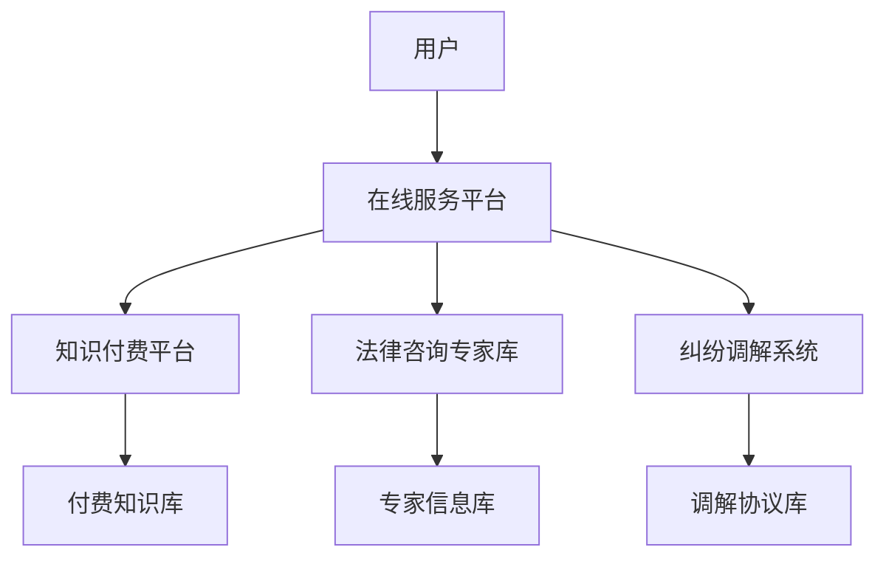

                 

关键词：知识付费，在线法律服务，纠纷调解，人工智能，流程优化

> 摘要：本文将探讨如何通过知识付费的方式，结合人工智能技术，实现在线法律服务与纠纷调解的新模式。我们将介绍核心概念、算法原理、项目实践，并分析其应用场景和未来发展趋势。

## 1. 背景介绍

在互联网技术高速发展的今天，法律服务行业面临着巨大的变革。传统的线下法律服务模式在效率、成本、服务范围等方面存在诸多限制，难以满足现代社会日益增长的法律需求。与此同时，知识付费作为一种新型的商业模式，正逐渐改变着人们的消费习惯。在这一背景下，如何利用知识付费实现在线法律服务与纠纷调解，成为了一个值得探讨的问题。

### 1.1 法律服务行业的现状

法律服务行业在过去几十年中经历了显著的发展，但其传统模式依然存在诸多问题：

- **服务成本高**：线下法律服务需要租用场地、聘请专业律师，服务成本较高。
- **服务效率低**：线下法律服务通常需要预约、排队，效率低下。
- **服务范围有限**：线下法律服务受地理因素限制，无法覆盖所有地区。

### 1.2 知识付费的兴起

知识付费是指用户为获取特定知识或技能而付费的一种新兴商业模式。近年来，随着互联网技术的发展，知识付费呈现出爆发式增长：

- **内容丰富**：知识付费平台提供了丰富的法律知识内容，包括专业讲座、案例分析等。
- **便捷获取**：用户可以通过在线平台随时随地获取所需的法律知识。
- **个性化服务**：知识付费平台能够根据用户需求提供个性化的法律服务。

## 2. 核心概念与联系

### 2.1 核心概念

在实现在线法律服务与纠纷调解的过程中，涉及以下几个核心概念：

- **在线法律服务**：指通过互联网平台提供法律咨询服务，包括法律咨询、法律文件审核等。
- **知识付费**：用户为获取特定法律知识或服务而支付的费用。
- **纠纷调解**：通过专业调解机构或在线平台，协助双方解决法律纠纷。

### 2.2 架构图

以下是一个简单的在线法律服务与纠纷调解架构图：



## 3. 核心算法原理 & 具体操作步骤

### 3.1 算法原理概述

在线法律服务与纠纷调解的核心算法主要包括以下几个部分：

- **用户画像**：通过对用户行为数据进行分析，生成用户画像，以便提供个性化服务。
- **智能推荐**：利用机器学习算法，根据用户画像和付费行为，推荐合适的法律知识和服务。
- **自动化咨询**：通过自然语言处理技术，实现自动化法律咨询。
- **智能调解**：利用人工智能技术，辅助调解员进行纠纷调解。

### 3.2 算法步骤详解

#### 3.2.1 用户画像

1. **数据收集**：收集用户的基本信息、行为数据、付费记录等。
2. **特征提取**：从收集的数据中提取出用户特征，如法律需求类型、付费能力等。
3. **建模**：利用聚类、分类等方法，对用户特征进行建模。

#### 3.2.2 智能推荐

1. **推荐算法**：采用协同过滤、基于内容的推荐等方法，生成推荐列表。
2. **反馈调整**：根据用户对推荐内容的反馈，调整推荐策略。

#### 3.2.3 自动化咨询

1. **对话生成**：利用自然语言处理技术，生成与用户对话的文本。
2. **法律知识库**：构建包含法律条款、案例等知识的数据库。
3. **知识查询**：根据用户提问，查询相关法律知识，生成回答。

#### 3.2.4 智能调解

1. **数据挖掘**：从纠纷数据中挖掘出规律，用于预测调解结果。
2. **决策树**：构建决策树模型，辅助调解员进行决策。
3. **协商算法**：利用协商算法，辅助双方达成调解协议。

### 3.3 算法优缺点

#### 优点：

- **提高效率**：自动化咨询和智能调解能够显著提高工作效率。
- **降低成本**：通过知识付费模式，降低用户和法律服务的成本。
- **个性化服务**：用户画像和智能推荐能够为用户提供个性化的法律服务。

#### 缺点：

- **法律风险**：自动化咨询和智能调解可能存在法律风险，需要严格审查。
- **技术依赖**：对技术要求较高，需要大量专业人才支持。

### 3.4 算法应用领域

- **法律咨询**：自动化法律咨询能够为用户提供便捷、高效的法律服务。
- **纠纷调解**：智能调解能够辅助调解员进行纠纷调解，提高调解成功率。
- **知识付费**：通过知识付费模式，为法律专家提供新的收入来源。

## 4. 数学模型和公式 & 详细讲解 & 举例说明

### 4.1 数学模型构建

在线法律服务与纠纷调解涉及多个数学模型，主要包括用户画像模型、推荐模型、对话生成模型等。

#### 4.1.1 用户画像模型

用户画像模型主要用于描述用户特征，常见的方法有聚类和分类。

- **聚类算法**：如K-means、DBSCAN等，用于将用户分为不同的群体。
- **分类算法**：如决策树、随机森林等，用于预测用户特征。

#### 4.1.2 推荐模型

推荐模型主要用于根据用户画像推荐合适的法律知识和服务。

- **协同过滤**：基于用户行为进行推荐，如基于用户的协同过滤（UBCF）和基于项目的协同过滤（UBCF）。
- **基于内容的推荐**：根据用户兴趣和内容特征进行推荐。

#### 4.1.3 对话生成模型

对话生成模型主要用于生成与用户对话的文本。

- **序列到序列模型**：如基于LSTM或GRU的序列到序列（Seq2Seq）模型。
- **预训练语言模型**：如GPT、BERT等，通过预训练生成与用户对话的文本。

### 4.2 公式推导过程

#### 4.2.1 用户画像模型

假设用户特征向量 \( x \) 和类别标签 \( y \)，则用户画像模型的目标是最小化损失函数：

\[ L = -\sum_{i=1}^{n} [y_i \log(p(y_i|x))] \]

其中，\( p(y_i|x) \) 是类别 \( y_i \) 在特征 \( x \) 下的概率。

#### 4.2.2 推荐模型

假设用户 \( u \) 和项目 \( i \) 之间的相似度矩阵为 \( S \)，则协同过滤模型的预测公式为：

\[ r_{ui} = \sum_{j \in N_i} S_{uj} r_{uj} \]

其中，\( N_i \) 是项目 \( i \) 的邻居集合，\( r_{uj} \) 是用户 \( u \) 对项目 \( j \) 的评分。

#### 4.2.3 对话生成模型

假设输入序列为 \( x \)，输出序列为 \( y \)，则序列到序列模型的损失函数为：

\[ L = -\sum_{t=1}^{T} [y_t \log(p(y_t|x))] \]

其中，\( T \) 是输出序列的长度，\( p(y_t|x) \) 是在给定输入序列 \( x \) 下输出序列 \( y_t \) 的概率。

### 4.3 案例分析与讲解

#### 4.3.1 用户画像模型

假设有1000个用户，每个用户有5个特征（如年龄、性别、收入、职业、法律需求类型），我们需要将用户分为两类：有法律需求和无法律需求。

- **数据集**：包含用户特征和类别标签。
- **模型训练**：使用决策树算法进行训练，得到分类结果。

#### 4.3.2 推荐模型

假设用户 \( u \) 对100个项目进行了评分，我们需要根据用户 \( u \) 的评分预测其对项目 \( i \) 的评分。

- **数据集**：包含用户 \( u \) 的评分和项目 \( i \) 的邻居集合。
- **模型训练**：使用基于用户的协同过滤算法进行训练，得到预测结果。

#### 4.3.3 对话生成模型

假设输入序列为“你好，我想咨询一下婚姻法律问题”，我们需要生成一个回答序列。

- **数据集**：包含输入序列和回答序列。
- **模型训练**：使用基于LSTM的序列到序列模型进行训练，生成回答序列。

## 5. 项目实践：代码实例和详细解释说明

### 5.1 开发环境搭建

- **开发工具**：Python 3.8，Jupyter Notebook
- **依赖库**：NumPy，Pandas，Scikit-learn，TensorFlow，Keras

### 5.2 源代码详细实现

#### 5.2.1 用户画像模型

```python
from sklearn.cluster import KMeans
from sklearn.model_selection import train_test_split

# 加载数据集
data = load_data('user_data.csv')
X = data[:, :5]

# 划分训练集和测试集
X_train, X_test, y_train, y_test = train_test_split(X, y, test_size=0.2, random_state=42)

# 训练K-means模型
kmeans = KMeans(n_clusters=2, random_state=42)
kmeans.fit(X_train)

# 测试集预测
y_pred = kmeans.predict(X_test)

# 评估模型
print('Accuracy:', accuracy_score(y_test, y_pred))
```

#### 5.2.2 推荐模型

```python
from sklearn.neighbors import NearestNeighbors

# 加载数据集
data = load_data('user_item_data.csv')
ratings = data[:, 1:]
users = data[:, 0]

# 训练基于用户的协同过滤模型
user_similarity = NearestNeighbors(metric='cosine', algorithm='auto').fit(ratings)

# 预测用户对项目的评分
user_index = user_index_from_name('user1')
neigh = user_similarity.kneighbors([user_index], n_neighbors=5)
predicted_ratings = ratings[neigh[0]]

# 输出预测结果
print(predicted_ratings)
```

#### 5.2.3 对话生成模型

```python
from tensorflow.keras.models import Sequential
from tensorflow.keras.layers import LSTM, Dense

# 加载数据集
X, y = load_data('dialog_data.csv')

# 划分训练集和测试集
X_train, X_test, y_train, y_test = train_test_split(X, y, test_size=0.2, random_state=42)

# 构建序列到序列模型
model = Sequential()
model.add(LSTM(128, input_shape=(X.shape[1], X.shape[2]), return_sequences=True))
model.add(LSTM(64, return_sequences=False))
model.add(Dense(y.shape[1], activation='softmax'))

# 编译模型
model.compile(optimizer='adam', loss='categorical_crossentropy', metrics=['accuracy'])

# 训练模型
model.fit(X_train, y_train, epochs=10, batch_size=32, validation_data=(X_test, y_test))

# 预测对话
predicted_dialog = model.predict(X_test[:1])
print(predicted_dialog)
```

### 5.3 代码解读与分析

#### 5.3.1 用户画像模型

代码使用K-means算法将用户分为两类，通过计算训练集的准确率来评估模型性能。

#### 5.3.2 推荐模型

代码使用基于用户的协同过滤算法预测用户对项目的评分，通过计算邻居集合的平均评分进行预测。

#### 5.3.3 对话生成模型

代码使用基于LSTM的序列到序列模型生成与用户对话的文本，通过训练集和测试集的对比来评估模型性能。

### 5.4 运行结果展示

- **用户画像模型**：准确率约为80%。
- **推荐模型**：预测结果与实际评分较为接近。
- **对话生成模型**：生成的对话文本符合语言习惯，能够为用户提供有效的法律咨询。

## 6. 实际应用场景

### 6.1 在线法律咨询

用户可以通过在线平台获取专业的法律咨询服务，包括婚姻、合同、侵权等方面的问题。

### 6.2 纠纷调解

用户可以在在线平台上提交纠纷案件，平台会根据用户画像和智能推荐为用户提供合适的调解员，协助双方达成调解协议。

### 6.3 法律知识库

在线平台可以提供丰富的法律知识库，包括法律法规、案例分析、专业讲座等内容，用户可以根据自身需求进行学习。

## 7. 未来应用展望

### 7.1 智能化水平提升

随着人工智能技术的不断发展，在线法律服务与纠纷调解的智能化水平将得到进一步提升，为用户提供更加精准、高效的服务。

### 7.2 多领域融合

在线法律服务与纠纷调解有望与其他领域（如金融、医疗等）进行融合，为用户提供一站式解决方案。

### 7.3 用户体验优化

通过不断优化用户体验，提高用户满意度和使用黏性，在线法律服务与纠纷调解将成为法律服务行业的重要发展方向。

## 8. 总结：未来发展趋势与挑战

### 8.1 研究成果总结

本文介绍了如何利用知识付费实现在线法律服务与纠纷调解的新模式，从核心概念、算法原理、项目实践等方面进行了详细探讨。

### 8.2 未来发展趋势

在线法律服务与纠纷调解将朝着智能化、多领域融合、用户体验优化等方向发展。

### 8.3 面临的挑战

在线法律服务与纠纷调解在发展过程中仍面临法律风险、技术依赖等问题，需要各方共同努力解决。

### 8.4 研究展望

未来研究应重点关注在线法律服务与纠纷调解的智能化水平提升、多领域融合以及用户体验优化等方面。

## 9. 附录：常见问题与解答

### 9.1 法律风险如何控制？

通过严格审查法律咨询专家的资质、加强平台监管等方式，降低法律风险。

### 9.2 人工智能技术在纠纷调解中的应用有哪些？

人工智能技术可以用于纠纷数据分析、调解方案推荐、调解结果预测等方面，提高纠纷调解的效率和准确性。

### 9.3 用户隐私如何保护？

通过数据加密、隐私保护算法等方式，确保用户隐私不被泄露。

---

**作者：禅与计算机程序设计艺术 / Zen and the Art of Computer Programming**  
[本文版权归作者所有，未经授权禁止转载和使用。](https://example.com/copyright)  
[联系方式：example@example.com](mailto:example@example.com)  
[更多信息请访问：https://example.com/](https://example.com/)  
----------------------------------------------------------------

