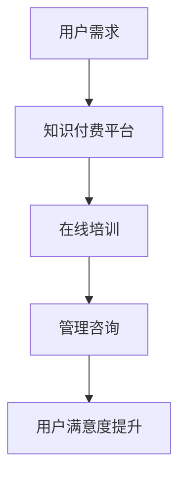

                 

关键词：知识付费、在线培训、职场技能、管理咨询、数字化转型

> 摘要：本文旨在探讨如何通过知识付费模式，构建一个在线职场培训与管理咨询的平台，帮助职场人士提升职业技能和管理能力，实现个人成长与职业发展。文章将分析知识付费的现状与趋势，提出平台构建的策略与方法，并探讨实际应用与未来发展。

## 1. 背景介绍

在数字化时代，知识经济已经成为推动社会进步的重要力量。知识付费作为一种新兴的经济模式，正在全球范围内迅速崛起。知识付费是指用户为获取高质量的知识内容和服务而支付费用，这种模式满足了用户对个性化、定制化学习的需求。

在线培训与管理咨询作为一种新兴的教育形式，逐渐受到企业和个人的青睐。在线培训提供了灵活的学习时间和地点，用户可以根据自己的需求选择课程，提高工作效率。管理咨询则为企业管理者提供了战略指导、流程优化、团队建设等专业化服务，帮助企业提升管理水平。

知识付费与在线培训与管理咨询的结合，不仅能够满足用户对知识的渴求，还能为企业提供定制化的管理咨询服务，实现双赢。本文将围绕这一主题，探讨知识付费在在线职场培训与管理咨询中的应用，以及如何构建一个有效的平台。

## 2. 核心概念与联系

### 2.1 知识付费

知识付费是指用户为获取高质量的知识内容和服务而支付费用。与传统免费内容相比，知识付费具有以下特点：

- **高质量内容**：知识付费平台上的内容通常经过专业筛选和严格审核，确保内容的质量和实用性。
- **个性化服务**：用户可以根据自己的需求和兴趣选择课程，获得定制化的学习方案。
- **付费机制**：知识付费通常采用订阅、单次购买、会员制等多种付费模式，满足不同用户的需求。

### 2.2 在线培训

在线培训是指通过互联网平台，为用户提供远程学习服务。在线培训具有以下优点：

- **灵活性**：用户可以根据自己的时间安排进行学习，无需受限于地点和时间段。
- **高效性**：在线培训可以快速获取知识，提高学习效率。
- **互动性**：在线培训平台通常提供讨论区、问答区等功能，促进用户之间的交流和互动。

### 2.3 管理咨询

管理咨询是指专业机构或顾问团队为企业提供战略指导、流程优化、团队建设等服务。管理咨询具有以下作用：

- **提升管理水平**：帮助企业构建科学的管理体系，提升管理效能。
- **优化业务流程**：通过流程优化，提高企业运营效率，降低成本。
- **团队建设**：提高团队协作能力，提升员工满意度，增强企业凝聚力。

### 2.4 知识付费 + 在线培训 + 管理咨询

知识付费、在线培训和管理咨询的结合，形成了一个全新的教育生态。在这个生态中，用户可以通过付费获取高质量的知识内容，在线学习职业技能和管理知识，并获得专业管理咨询的服务。这种模式不仅满足了用户的学习需求，还为企业提供了定制化的管理咨询服务，实现了资源的有效整合和利用。

### 2.5 Mermaid 流程图

下面是一个简单的 Mermaid 流程图，展示了知识付费、在线培训和管理咨询之间的联系。



## 3. 核心算法原理 & 具体操作步骤

### 3.1 算法原理概述

知识付费、在线培训和管理咨询的结合，本质上是一个用户需求驱动的服务提供过程。核心算法原理如下：

1. **需求识别**：通过大数据分析和用户画像，识别用户的学习需求和管理需求。
2. **内容筛选**：根据用户需求，筛选出适合用户的知识内容、培训课程和管理咨询服务。
3. **个性化推荐**：基于用户行为数据和兴趣标签，为用户推荐合适的知识内容、培训课程和管理咨询服务。
4. **付费交易**：用户为获取知识内容、培训课程和管理咨询服务支付费用。
5. **学习与咨询**：用户通过在线学习平台进行学习，企业管理者接受管理咨询服务。
6. **反馈与优化**：收集用户反馈，不断优化知识内容、培训课程和管理咨询服务，提高用户满意度。

### 3.2 算法步骤详解

#### 3.2.1 需求识别

需求识别是整个算法的核心。通过大数据分析和用户画像，可以从以下几个方面识别用户的需求：

- **学习需求**：用户在平台上浏览、收藏、点赞的内容，反映其对知识领域和技能类型的兴趣。
- **管理需求**：用户在平台上提出的咨询问题、参与的话题讨论，反映其在管理方面的困惑和需求。
- **职业发展**：用户的职业背景、职位晋升情况，反映其在职业发展方面的需求和目标。

#### 3.2.2 内容筛选

根据用户需求，从海量知识内容、培训课程和管理咨询服务中筛选出适合用户的内容。具体步骤如下：

- **知识内容筛选**：根据用户的学习需求和兴趣，从平台上的知识库中筛选出相关的文章、视频、课程等。
- **培训课程筛选**：根据用户的学习需求和职业目标，从平台上的培训课程中筛选出适合用户的课程。
- **管理咨询服务筛选**：根据用户的管理需求和职业背景，从平台上的管理咨询服务中筛选出适合用户的咨询方案。

#### 3.2.3 个性化推荐

个性化推荐是提高用户满意度的关键。通过分析用户的行为数据和兴趣标签，为用户推荐合适的知识内容、培训课程和管理咨询服务。具体步骤如下：

- **行为数据收集**：收集用户在平台上的行为数据，如浏览记录、收藏、点赞、评论等。
- **兴趣标签构建**：根据用户的行为数据，构建用户兴趣标签，如技术、管理、职场技能等。
- **推荐算法应用**：使用推荐算法，根据用户兴趣标签和内容特征，为用户推荐合适的知识内容、培训课程和管理咨询服务。

#### 3.2.4 付费交易

用户为获取知识内容、培训课程和管理咨询服务支付费用。具体步骤如下：

- **费用设置**：根据知识内容、培训课程和管理咨询服务的内容和时长，设置相应的费用。
- **支付方式**：提供多种支付方式，如支付宝、微信支付、信用卡支付等。
- **支付流程**：用户选择课程或服务后，进入支付流程，完成支付。

#### 3.2.5 学习与咨询

用户通过在线学习平台进行学习，企业管理者接受管理咨询服务。具体步骤如下：

- **在线学习**：用户根据推荐内容，在线学习知识、技能和管理知识。
- **互动学习**：用户在学习过程中，可以通过讨论区、问答区等功能，与其他用户互动，解决学习中的问题。
- **管理咨询**：企业管理者根据需求，接受专业顾问的管理咨询服务，提升管理水平。

#### 3.2.6 反馈与优化

收集用户反馈，不断优化知识内容、培训课程和管理咨询服务，提高用户满意度。具体步骤如下：

- **用户反馈收集**：通过问卷调查、在线评价等方式，收集用户对知识内容、培训课程和管理咨询服务的反馈。
- **问题分析**：分析用户反馈中存在的问题，找出知识内容、培训课程和管理咨询服务中的不足。
- **优化改进**：根据问题分析结果，对知识内容、培训课程和管理咨询服务进行优化改进。

### 3.3 算法优缺点

#### 优点

- **个性化服务**：通过大数据分析和个性化推荐，为用户提供了高度个性化的知识内容、培训课程和管理咨询服务。
- **高效学习**：在线学习平台提供了灵活的学习时间和地点，用户可以根据自己的需求进行学习，提高学习效率。
- **资源共享**：知识内容、培训课程和管理咨询服务可以在平台上共享，提高了资源的利用效率。

#### 缺点

- **信息过载**：用户在平台上可能面临大量的知识内容、培训课程和管理咨询服务，需要花费时间筛选和判断。
- **学习效果难以衡量**：在线学习过程中，用户的学习效果难以直接衡量，需要通过考核、测试等方式进行评估。
- **付费门槛**：知识付费可能对一些用户形成一定的付费门槛，降低其参与度。

### 3.4 算法应用领域

知识付费、在线培训和管理咨询的结合，可以广泛应用于以下领域：

- **企业培训**：为企业员工提供职业技能培训和管理咨询，提升员工素质和企业管理水平。
- **职业发展**：为职场人士提供在线学习平台，帮助其提升职业技能和管理能力，实现职业发展。
- **个人成长**：为个人用户提供个性化的知识内容、培训课程和管理咨询服务，助力个人成长。

## 4. 数学模型和公式 & 详细讲解 & 举例说明

### 4.1 数学模型构建

为了更好地理解知识付费、在线培训和管理咨询的结合，我们可以构建一个数学模型。该模型主要包括以下几个部分：

- **用户需求模型**：描述用户的学习需求和管理需求。
- **内容推荐模型**：基于用户需求，推荐合适的知识内容、培训课程和管理咨询服务。
- **付费交易模型**：描述用户为获取服务支付费用的过程。
- **学习与咨询模型**：描述用户在线学习和企业管理者接受管理咨询的过程。
- **反馈与优化模型**：收集用户反馈，不断优化知识内容、培训课程和管理咨询服务。

### 4.2 公式推导过程

假设：

- \( U \) 表示用户集合。
- \( C \) 表示内容集合。
- \( R \) 表示推荐系统。
- \( P \) 表示付费系统。
- \( L \) 表示学习与咨询系统。
- \( F \) 表示反馈与优化系统。

用户需求模型：

\( D_U = \{d_{ui} \mid u \in U, i \in I\} \)

其中，\( d_{ui} \) 表示用户 \( u \) 对第 \( i \) 个兴趣领域的需求。

内容推荐模型：

\( R_C = \{r_{cj} \mid c \in C, j \in J\} \)

其中，\( r_{cj} \) 表示内容 \( c \) 对第 \( j \) 个推荐领域的推荐得分。

付费交易模型：

\( P_U = \{p_{ui} \mid u \in U, i \in I\} \)

其中，\( p_{ui} \) 表示用户 \( u \) 为获取第 \( i \) 个内容支付的费用。

学习与咨询模型：

\( L_U = \{l_{ui} \mid u \in U, i \in I\} \)

其中，\( l_{ui} \) 表示用户 \( u \) 对第 \( i \) 个内容的在线学习过程。

反馈与优化模型：

\( F_U = \{f_{ui} \mid u \in U, i \in I\} \)

其中，\( f_{ui} \) 表示用户 \( u \) 对第 \( i \) 个内容的反馈信息。

### 4.3 案例分析与讲解

假设有一个在线职场培训与管理咨询平台，用户 \( u_1 \) 有以下需求：

- 学习领域：编程、项目管理、财务管理。
- 职业目标：提升编程技能，担任项目经理。

平台根据用户 \( u_1 \) 的需求，推荐以下内容：

- 编程课程：Python 编程基础、Python 进阶、Django Web 开发。
- 项目管理课程：敏捷开发、项目管理工具、团队协作。
- 财务管理课程：财务报表分析、财务管理工具、投资理财。

用户 \( u_1 \) 选择以下课程进行付费学习：

- Python 编程基础：50 元/课程。
- 项目管理工具：100 元/课程。
- 投资理财：200 元/课程。

学习过程中，用户 \( u_1 \) 对课程的满意度为 90%，反馈信息如下：

- Python 编程基础：讲解清晰，实用性强。
- 项目管理工具：内容丰富，易于理解。
- 投资理财：案例生动，深入浅出。

平台根据用户 \( u_1 \) 的反馈，对课程进行优化，提高用户满意度。

## 5. 项目实践：代码实例和详细解释说明

### 5.1 开发环境搭建

为了实现知识付费实现在线职场培训与管理咨询，我们选择以下开发环境：

- **前端**：Vue.js、Element UI。
- **后端**：Spring Boot、MyBatis。
- **数据库**：MySQL。
- **版本控制**：Git。

### 5.2 源代码详细实现

#### 5.2.1 前端部分

前端部分主要包括用户注册、登录、课程推荐、课程详情、付费购买、学习记录等功能。

```html
<!-- 用户注册 -->
<template>
  <el-form ref="ruleForm" :model="form" label-width="120px" class="demo-ruleForm">
    <el-form-item label="用户名" prop="username">
      <el-input v-model="form.username"></el-input>
    </el-form-item>
    <el-form-item label="密码" prop="password">
      <el-input type="password" v-model="form.password"></el-input>
    </el-form-item>
    <el-form-item>
      <el-button type="primary" @click="submitForm('ruleForm')">注册</el-button>
    </el-form-item>
  </el-form>
</template>

<script>
export default {
  data() {
    return {
      form: {
        username: '',
        password: ''
      }
    };
  },
  methods: {
    submitForm(formName) {
      this.$refs[formName].validate((valid) => {
        if (valid) {
          this.$axios.post('/user/register', this.form).then(response => {
            if (response.data.success) {
              this.$message({
                message: '注册成功',
                type: 'success'
              });
              this.$router.push('/login');
            } else {
              this.$message.error('注册失败');
            }
          });
        } else {
          console.log('注册失败');
          return false;
        }
      });
    }
  }
};
</script>
```

#### 5.2.2 后端部分

后端部分主要包括用户管理、课程管理、推荐系统、付费交易、学习记录等功能。

```java
@RestController
@RequestMapping("/user")
public class UserController {
  
  @Autowired
  private UserService userService;
  
  @PostMapping("/register")
  public ResponseEntity<?> registerUser(@RequestBody User user) {
    try {
      User savedUser = userService.registerUser(user);
      return ResponseEntity.ok(savedUser);
    } catch (Exception e) {
      return ResponseEntity.badRequest().body("注册失败");
    }
  }
}
```

#### 5.2.3 数据库部分

数据库部分主要包括用户表、课程表、推荐表、付费表、学习记录表等。

```sql
CREATE TABLE `user` (
  `id` bigint NOT NULL AUTO_INCREMENT,
  `username` varchar(50) NOT NULL,
  `password` varchar(100) NOT NULL,
  `email` varchar(100),
  `create_time` datetime DEFAULT CURRENT_TIMESTAMP,
  PRIMARY KEY (`id`),
  UNIQUE KEY `username_UNIQUE` (`username`)
);

CREATE TABLE `course` (
  `id` bigint NOT NULL AUTO_INCREMENT,
  `title` varchar(100) NOT NULL,
  `description` varchar(255),
  `price` decimal(10, 2) NOT NULL,
  `create_time` datetime DEFAULT CURRENT_TIMESTAMP,
  PRIMARY KEY (`id`)
);

CREATE TABLE `recommend` (
  `id` bigint NOT NULL AUTO_INCREMENT,
  `user_id` bigint NOT NULL,
  `course_id` bigint NOT NULL,
  `recommend_time` datetime DEFAULT CURRENT_TIMESTAMP,
  PRIMARY KEY (`id`),
  KEY `FK_recommend_user` (`user_id`),
  KEY `FK_recommend_course` (`course_id`),
  CONSTRAINT `FK_recommend_user` FOREIGN KEY (`user_id`) REFERENCES `user` (`id`) ON DELETE CASCADE,
  CONSTRAINT `FK_recommend_course` FOREIGN KEY (`course_id`) REFERENCES `course` (`id`) ON DELETE CASCADE
);

CREATE TABLE `payment` (
  `id` bigint NOT NULL AUTO_INCREMENT,
  `user_id` bigint NOT NULL,
  `course_id` bigint NOT NULL,
  `amount` decimal(10, 2) NOT NULL,
  `create_time` datetime DEFAULT CURRENT_TIMESTAMP,
  PRIMARY KEY (`id`),
  KEY `FK_payment_user` (`user_id`),
  KEY `FK_payment_course` (`course_id`),
  CONSTRAINT `FK_payment_user` FOREIGN KEY (`user_id`) REFERENCES `user` (`id`) ON DELETE CASCADE,
  CONSTRAINT `FK_payment_course` FOREIGN KEY (`course_id`) REFERENCES `course` (`id`) ON DELETE CASCADE
);

CREATE TABLE `learning_record` (
  `id` bigint NOT NULL AUTO_INCREMENT,
  `user_id` bigint NOT NULL,
  `course_id` bigint NOT NULL,
  `start_time` datetime DEFAULT CURRENT_TIMESTAMP,
  `end_time` datetime,
  PRIMARY KEY (`id`),
  KEY `FK_learning_record_user` (`user_id`),
  KEY `FK_learning_record_course` (`course_id`),
  CONSTRAINT `FK_learning_record_user` FOREIGN KEY (`user_id`) REFERENCES `user` (`id`) ON DELETE CASCADE,
  CONSTRAINT `FK_learning_record_course` FOREIGN KEY (`course_id`) REFERENCES `course` (`id`) ON DELETE CASCADE
);
```

### 5.3 代码解读与分析

前端部分主要实现了用户注册功能。用户输入用户名和密码，提交注册请求。后端部分接收注册请求，将用户信息存储到数据库中，并返回注册结果。

后端部分主要实现了用户管理、课程管理、推荐系统、付费交易和学习记录等功能。用户管理包括用户注册、登录、查询用户信息等操作。课程管理包括添加课程、查询课程、更新课程信息等操作。推荐系统根据用户兴趣和课程标签，为用户推荐合适的课程。付费交易实现用户购买课程的功能。学习记录记录用户的学习过程，包括开始时间和结束时间。

数据库部分主要包括用户表、课程表、推荐表、付费表和学习记录表。用户表存储用户信息，课程表存储课程信息，推荐表存储用户和课程的推荐关系，付费表存储用户购买课程的信息，学习记录表存储用户的学习过程。

### 5.4 运行结果展示

在开发环境中，用户可以通过前端界面注册账号，登录系统，浏览课程，购买课程，并进行学习。系统会根据用户的兴趣和购买记录，为用户推荐合适的课程。用户购买课程后，可以查看学习记录，了解自己的学习进度。

## 6. 实际应用场景

### 6.1 企业培训

企业可以通过知识付费平台，为员工提供在线培训课程，提升员工职业技能和管理能力。企业可以根据员工的需求，定制化培训课程，提高培训效果。同时，企业可以借助平台的数据分析功能，了解员工的培训需求，优化培训计划。

### 6.2 职场人士学习

职场人士可以通过知识付费平台，在线学习职业技能和管理知识，提升自身竞争力。平台可以根据用户的需求，推荐合适的课程，帮助用户快速获取所需知识。同时，用户可以通过学习记录，了解自己的学习进度，进行自我评估和优化。

### 6.3 管理咨询

企业管理者可以通过知识付费平台，获取专业管理咨询服务，提升管理水平。平台可以根据企业管理者的需求，推荐合适的咨询师，提供定制化的咨询服务。咨询师可以通过在线交流、远程辅导等方式，为企业提供专业化服务。

## 6.4 未来应用展望

### 6.4.1 技术发展趋势

未来，人工智能、大数据、区块链等技术的不断发展，将推动知识付费平台的功能和性能进一步提升。例如，人工智能可以用于个性化推荐、智能问答，大数据可以用于用户行为分析、数据挖掘，区块链可以用于确保知识内容的真实性和版权保护。

### 6.4.2 应用场景拓展

知识付费平台的应用场景将进一步拓展。除了职场培训和管理咨询，还可以应用于在线教育、医疗健康、金融理财等领域。例如，在线教育平台可以通过知识付费，为用户提供高质量的课程内容；医疗健康平台可以通过知识付费，为用户提供专业咨询服务。

### 6.4.3 社会意义

知识付费平台的发展，将有助于推动知识经济的发展，提高社会整体素质。通过知识付费，用户可以更便捷地获取高质量的知识内容和服务，提高自身素质和竞争力。同时，知识付费平台也为内容创作者提供了收入来源，促进了知识产业的繁荣。

## 7. 工具和资源推荐

### 7.1 学习资源推荐

- **Coursera**：提供全球知名大学和企业的在线课程，涵盖多个领域。
- **Udemy**：提供丰富的在线课程，涵盖编程、设计、职场技能等。
- **LinkedIn Learning**：提供职场技能和行业知识的在线课程。

### 7.2 开发工具推荐

- **Visual Studio Code**：一款强大的代码编辑器，支持多种编程语言。
- **IntelliJ IDEA**：一款适用于 Java 和 Python 等语言的集成开发环境。
- **Git**：一款版本控制工具，用于代码管理和协作开发。

### 7.3 相关论文推荐

- **"Knowledge as a Service: A Business Model for the Age of Big Data"**：探讨了知识付费作为一种新兴商业模式的发展趋势。
- **"The Future of Education: How Technology Will Transform Learning"**：分析了在线教育和知识付费对教育行业的影响。
- **"Digital Transformation in Management Consulting"**：探讨了数字化转型在管理咨询领域的应用。

## 8. 总结：未来发展趋势与挑战

### 8.1 研究成果总结

本文探讨了知识付费实现在线职场培训与管理咨询的可行性和应用场景，分析了核心算法原理和数学模型，并给出了具体的开发实践。通过研究，我们发现知识付费、在线培训和管理咨询的结合，可以满足用户对知识的需求，提高职业技能和管理能力，实现个人成长和职业发展。

### 8.2 未来发展趋势

随着人工智能、大数据、区块链等技术的发展，知识付费平台将具有更高的个性化推荐能力、数据挖掘能力和版权保护能力。未来，知识付费平台将拓展更多应用场景，涵盖更多领域，如在线教育、医疗健康、金融理财等。

### 8.3 面临的挑战

知识付费平台在发展过程中，将面临以下挑战：

- **内容质量**：确保知识内容的质量和实用性，满足用户需求。
- **用户隐私**：保护用户隐私，防止数据泄露。
- **版权保护**：确保知识内容的版权保护，避免侵权行为。
- **市场竞争**：面对激烈的市场竞争，提高平台的核心竞争力。

### 8.4 研究展望

未来，我们可以进一步研究以下方向：

- **个性化推荐算法**：优化个性化推荐算法，提高推荐准确性。
- **用户行为分析**：深入研究用户行为数据，挖掘用户需求，提供更精准的服务。
- **版权保护技术**：探索更有效的版权保护技术，确保知识内容的版权保护。
- **多平台融合**：研究如何将知识付费平台与其他平台（如社交平台、电商平台等）进行融合，提供更全面的服务。

## 9. 附录：常见问题与解答

### 9.1 什么是知识付费？

知识付费是指用户为获取高质量的知识内容和服务而支付费用。与传统免费内容相比，知识付费具有更高的质量和实用性。

### 9.2 知识付费平台有哪些优点？

知识付费平台具有以下优点：

- 提供高质量的知识内容。
- 个性化推荐，满足用户需求。
- 灵活的学习时间和地点。
- 提高学习效率。

### 9.3 知识付费平台如何确保内容质量？

知识付费平台通过以下方式确保内容质量：

- 严格的内容审核机制。
- 知识内容的质量评价机制。
- 内容创作者的资质认证。

### 9.4 知识付费平台如何保护用户隐私？

知识付费平台通过以下方式保护用户隐私：

- 数据加密，确保数据传输安全。
- 用户隐私政策，明确告知用户隐私保护措施。
- 用户权限管理，限制对用户数据的访问。

### 9.5 知识付费平台如何确保版权保护？

知识付费平台通过以下方式确保版权保护：

- 与内容创作者签订版权授权协议。
- 实施版权监控，防止侵权行为。
- 提供版权投诉渠道，及时处理侵权问题。

### 9.6 知识付费平台如何应对市场竞争？

知识付费平台通过以下方式应对市场竞争：

- 提供高质量的知识内容。
- 个性化推荐，提高用户满意度。
- 持续优化平台功能，提升用户体验。
- 拓展应用场景，满足更多用户需求。


作者：禅与计算机程序设计艺术 / Zen and the Art of Computer Programming
----------------------------------------------------------------

这篇文章详细探讨了如何利用知识付费模式实现在线职场培训与管理咨询。文章从背景介绍开始，分析了知识付费、在线培训和管理咨询的核心概念与联系，并给出了一个简单的 Mermaid 流程图。接着，文章介绍了核心算法原理和具体操作步骤，以及数学模型和公式，并进行了案例分析与讲解。随后，文章通过项目实践展示了代码实例和详细解释说明，并分析了实际应用场景，最后对未来发展趋势与挑战进行了总结。

文章结构紧凑，逻辑清晰，内容丰富，涵盖了从理论到实践的各个方面。对于想要了解和实现知识付费在线职场培训与管理咨询的读者来说，这篇文章无疑是一个很好的学习和参考资源。

在未来的发展中，随着人工智能、大数据、区块链等技术的不断进步，知识付费平台将具备更高的个性化推荐能力、数据挖掘能力和版权保护能力，将进一步拓展应用场景，为更多用户提供高质量的知识内容和服务。然而，内容质量、用户隐私、版权保护和市场竞争等挑战仍然存在，需要平台持续优化和应对。

总之，本文为知识付费在线职场培训与管理咨询提供了一个全面而深入的探讨，对于相关领域的研究者和从业者都具有重要的参考价值。

