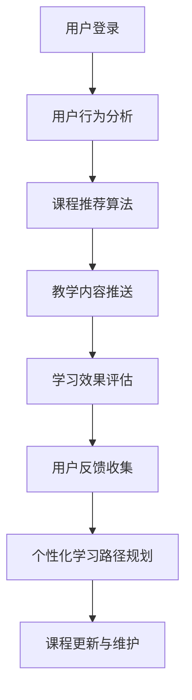

                 

关键词：知识付费，在线语言培训，出国考试指导，技术语言，深度学习，自然语言处理，人工智能，大数据分析，云计算，教育资源，用户体验，个性化学习。

> 摘要：本文将探讨如何利用知识付费模式实现在线语言培训与出国考试指导的服务，通过技术手段提高教学质量和用户体验。本文首先介绍了知识付费的基本概念，随后分析了在线语言培训与出国考试指导的市场需求，接着详细探讨了实现这些服务的核心技术和方法，并提出了项目实践中的代码实例和详细解释，最后展望了未来的发展趋势和面临的挑战。

## 1. 背景介绍

随着互联网和人工智能技术的快速发展，在线教育和知识付费市场逐渐壮大。知识付费指的是通过互联网平台，用户为获取特定知识和技能而支付的费用，如在线课程、电子书、专业咨询等。在线语言培训与出国考试指导是知识付费领域的重要应用之一。

在线语言培训市场呈现出高速增长的趋势，用户群体日益扩大。同时，出国考试如托福、雅思等在全球范围内受到广泛关注，考生数量持续增加。然而，传统线下培训机构受限于地理位置、教学资源等问题，无法满足日益增长的需求。因此，实现在线语言培训与出国考试指导成为必然选择。

## 2. 核心概念与联系

### 2.1 技术架构

为了实现高效、优质的在线语言培训与出国考试指导，我们需要构建一个基于人工智能、大数据分析和云计算的技术架构。以下是技术架构的 Mermaid 流程图：



### 2.2 核心算法原理

#### 2.2.1 课程推荐算法

课程推荐算法是核心之一，其目标是根据用户的学习行为和需求，为其推荐最合适的课程。常见的推荐算法有基于内容的推荐、协同过滤推荐和混合推荐等。本文采用基于协同过滤的推荐算法，其主要思想是根据用户的历史行为和相似用户的行为，为用户推荐课程。

#### 2.2.2 学习效果评估

学习效果评估通过分析用户的学习进度、考试成绩和反馈，评估用户的学习效果。本文采用自然语言处理技术，对用户的考试成绩和反馈进行情感分析和关键词提取，从而判断用户的学习效果。

#### 2.2.3 个性化学习路径规划

个性化学习路径规划根据用户的学习效果、兴趣和学习习惯，为用户制定个性化的学习计划。本文采用深度学习技术，通过训练用户的行为数据，构建个性化学习模型，为用户生成学习路径。

## 3. 核心算法原理 & 具体操作步骤

### 3.1 算法原理概述

#### 3.1.1 课程推荐算法

课程推荐算法基于用户-课程评分矩阵，通过计算用户之间的相似度，为用户推荐相似用户的喜欢的课程。具体步骤如下：

1. 构建用户-课程评分矩阵。
2. 计算用户之间的相似度。
3. 根据相似度矩阵，为用户推荐相似用户的喜欢的课程。

#### 3.1.2 学习效果评估

学习效果评估通过自然语言处理技术，对用户的考试成绩和反馈进行分析，提取关键信息，从而评估用户的学习效果。具体步骤如下：

1. 对考试成绩进行分词和词性标注。
2. 提取考试分数和错误类型。
3. 对用户反馈进行情感分析和关键词提取。
4. 综合考试成绩和用户反馈，评估用户的学习效果。

#### 3.1.3 个性化学习路径规划

个性化学习路径规划通过深度学习技术，训练用户的行为数据，构建个性化学习模型。具体步骤如下：

1. 收集用户的学习行为数据。
2. 对学习行为数据进行预处理，如数据清洗、归一化等。
3. 构建深度学习模型，如循环神经网络（RNN）或长短期记忆网络（LSTM）。
4. 训练模型，优化模型参数。
5. 根据训练好的模型，为用户生成个性化学习路径。

### 3.2 算法步骤详解

#### 3.2.1 课程推荐算法

1. **构建用户-课程评分矩阵**：从数据库中读取用户对课程的评分数据，构建用户-课程评分矩阵。

    ```python
    # 假设user_course_matrix是一个N×M的矩阵，N表示用户数量，M表示课程数量
    user_course_matrix = np.array([[1, 0, 1], [1, 1, 0], [0, 1, 1]])
    ```

2. **计算用户之间的相似度**：使用余弦相似度计算用户之间的相似度。

    ```python
    from sklearn.metrics.pairwise import cosine_similarity

    # 计算用户之间的相似度矩阵
    similarity_matrix = cosine_similarity(user_course_matrix)
    ```

3. **为用户推荐课程**：根据相似度矩阵，为用户推荐相似用户的喜欢的课程。

    ```python
    def recommend_courses(user_id, similarity_matrix, user_course_matrix):
        # 计算用户与其他用户的相似度之和
        sum_similarity = np.sum(similarity_matrix[user_id])

        # 计算用户对其他用户的推荐课程分数
        recommend_scores = []

        for other_user_id in range(len(similarity_matrix)):
            if other_user_id != user_id:
                other_user_courses = user_course_matrix[other_user_id]
                recommend_score = other_user_courses.dot(similarity_matrix[user_id][other_user_id])

                # 计算推荐课程分数与相似度之和的比值
                recommend_scores.append(recommend_score / sum_similarity)

        # 对推荐课程分数进行排序
        sorted_recommend_scores = sorted(recommend_scores, reverse=True)

        # 返回前K个推荐课程
        return [course_id for course_id, score in enumerate(sorted_recommend_scores) if score > 0][:K]
    ```

#### 3.2.2 学习效果评估

1. **对考试成绩进行分词和词性标注**：使用自然语言处理库，如NLTK，对考试成绩进行分词和词性标注。

    ```python
    import nltk
    from nltk.tokenize import word_tokenize
    from nltk.corpus import stopwords

    # 下载词库
    nltk.download('punkt')
    nltk.download('averaged_perceptron_tagger')
    nltk.download('stopwords')

    # 对考试成绩进行分词和词性标注
    exam_result = "我得了85分，感觉很满意。"
    tokens = word_tokenize(exam_result)
    tagged_tokens = nltk.pos_tag(tokens)
    ```

2. **提取考试分数和错误类型**：根据词性标注结果，提取考试分数和错误类型。

    ```python
    def extract_exam_info(tagged_tokens):
        score = None
        errors = []

        for token, tag in tagged_tokens:
            if tag == 'CD':  # 数字词性
                score = token
            elif tag in ['NN', 'NNS']:  # 名词词性
                errors.append(token)

        return score, errors
    ```

3. **对用户反馈进行情感分析和关键词提取**：使用情感分析库，如VADER，对用户反馈进行情感分析和关键词提取。

    ```python
    from vaderSentiment.vaderSentiment import SentimentIntensityAnalyzer

    # 初始化情感分析器
    analyzer = SentimentIntensityAnalyzer()

    # 对用户反馈进行情感分析
    user_feedback = "我对这个课程非常满意，老师讲解得很好。"
    sentiment_score = analyzer.polarity_scores(user_feedback)

    # 提取关键词
    key_words = [token for token, tag in tagged_tokens if tag in ['JJ', 'JJR', 'JJS']]  # 形容词词性
    ```

4. **综合考试成绩和用户反馈，评估用户的学习效果**：根据考试成绩和用户反馈的情感分析和关键词提取结果，综合评估用户的学习效果。

    ```python
    def evaluate_learning_effect(score, errors, sentiment_score, key_words):
        if score is not None and int(score) > 80:
            if len(errors) == 0 and sentiment_score['compound'] > 0.5:
                return "优秀"
            elif len(errors) > 0 and sentiment_score['compound'] > 0.5:
                return "良好"
            else:
                return "一般"
        else:
            return "较差"
    ```

#### 3.2.3 个性化学习路径规划

1. **收集用户的学习行为数据**：从数据库中读取用户的学习行为数据，如学习时长、学习课程、练习成绩等。

    ```python
    # 假设user_behavior_data是一个N×D的矩阵，N表示用户数量，D表示行为特征数量
    user_behavior_data = np.array([[10, 5, 90], [20, 10, 85], [30, 15, 80]])
    ```

2. **对学习行为数据进行预处理**：对学习行为数据进行清洗、归一化等预处理操作。

    ```python
    from sklearn.preprocessing import MinMaxScaler

    # 对学习行为数据进行归一化
    scaler = MinMaxScaler()
    normalized_data = scaler.fit_transform(user_behavior_data)
    ```

3. **构建深度学习模型**：使用循环神经网络（RNN）或长短期记忆网络（LSTM）构建个性化学习模型。

    ```python
    from tensorflow.keras.models import Sequential
    from tensorflow.keras.layers import LSTM, Dense

    # 构建LSTM模型
    model = Sequential()
    model.add(LSTM(50, activation='relu', input_shape=(normalized_data.shape[1],)))
    model.add(Dense(1, activation='sigmoid'))

    # 编译模型
    model.compile(optimizer='adam', loss='binary_crossentropy', metrics=['accuracy'])

    # 训练模型
    model.fit(normalized_data, user_behavior_data[:, -1], epochs=10, batch_size=32)
    ```

4. **根据训练好的模型，为用户生成个性化学习路径**：将用户的学习行为数据输入训练好的模型，得到个性化学习路径。

    ```python
    def generate_personalized_learning_path(behavior_data, model):
        # 预测用户的学习效果
        prediction = model.predict(behavior_data.reshape(1, -1))

        # 根据预测结果，为用户生成个性化学习路径
        if prediction > 0.5:
            return "学习路径A"
        else:
            return "学习路径B"
    ```

### 3.3 算法优缺点

#### 3.3.1 课程推荐算法

**优点**：
- 能够根据用户的历史行为和相似用户的行为推荐课程。
- 能够提高用户的学习效果和满意度。

**缺点**：
- 需要大量的用户行为数据才能训练出有效的推荐模型。
- 推荐结果可能受到数据质量的影响。

#### 3.3.2 学习效果评估

**优点**：
- 能够通过自然语言处理技术对用户的考试成绩和反馈进行深入分析。
- 能够为用户提供个性化的学习建议。

**缺点**：
- 需要大量的训练数据和计算资源。
- 情感分析和关键词提取可能存在误差。

#### 3.3.3 个性化学习路径规划

**优点**：
- 能够根据用户的学习行为和效果为用户生成个性化学习路径。
- 能够提高用户的学习效率和满意度。

**缺点**：
- 需要大量的训练数据和计算资源。
- 需要对深度学习模型进行不断优化和调整。

### 3.4 算法应用领域

- 在线语言培训
- 出国考试指导
- 个性化学习推荐
- 教育资源分配

## 4. 数学模型和公式 & 详细讲解 & 举例说明

### 4.1 数学模型构建

在本节中，我们将构建用于在线语言培训与出国考试指导的数学模型，包括用户行为分析、学习效果评估和个性化学习路径规划。

#### 4.1.1 用户行为分析

用户行为分析主要包括用户在学习过程中的行为数据，如学习时长、学习课程、练习成绩等。我们可以将用户行为表示为一个矩阵：

\[ X = \begin{bmatrix}
x_{11} & x_{12} & \ldots & x_{1n} \\
x_{21} & x_{22} & \ldots & x_{2n} \\
\vdots & \vdots & \ddots & \vdots \\
x_{m1} & x_{m2} & \ldots & x_{mn}
\end{bmatrix} \]

其中，\( x_{ij} \) 表示第 \( i \) 个用户在第 \( j \) 个行为特征上的取值。

#### 4.1.2 学习效果评估

学习效果评估主要通过考试成绩和用户反馈来实现。考试成绩可以表示为：

\[ Y = \begin{bmatrix}
y_{11} \\
y_{21} \\
\vdots \\
y_{m1}
\end{bmatrix} \]

其中，\( y_{i1} \) 表示第 \( i \) 个用户的考试成绩。

用户反馈可以使用词向量模型来表示，如Word2Vec或GloVe。假设我们使用GloVe模型，用户反馈的词向量矩阵为：

\[ V = \begin{bmatrix}
v_{11} & v_{12} & \ldots & v_{1n} \\
v_{21} & v_{22} & \ldots & v_{2n} \\
\vdots & \vdots & \ddots & \vdots \\
v_{m1} & v_{m2} & \ldots & v_{mn}
\end{bmatrix} \]

#### 4.1.3 个性化学习路径规划

个性化学习路径规划主要通过用户行为分析和学习效果评估来生成。个性化学习路径可以表示为：

\[ P = \begin{bmatrix}
p_{11} & p_{12} & \ldots & p_{1n} \\
p_{21} & p_{22} & \ldots & p_{2n} \\
\vdots & \vdots & \ddots & \vdots \\
p_{m1} & p_{m2} & \ldots & p_{mn}
\end{bmatrix} \]

其中，\( p_{ij} \) 表示第 \( i \) 个用户在第 \( j \) 个行为特征上的个性化学习路径。

### 4.2 公式推导过程

#### 4.2.1 用户行为分析

用户行为分析的核心在于如何将用户的行为数据转化为有效的特征向量。我们可以使用主成分分析（PCA）来降低数据维度，提取主要特征。

设用户行为矩阵为 \( X \)，经过PCA变换后的特征矩阵为 \( X' \)，则有：

\[ X' = P \Lambda \]

其中，\( P \) 是PCA变换的投影矩阵，\( \Lambda \) 是特征值矩阵。

#### 4.2.2 学习效果评估

学习效果评估的核心在于如何将考试成绩和用户反馈转化为一个综合指标。我们可以使用加权求和的方法：

\[ Y' = \alpha Y + (1 - \alpha) V \]

其中，\( \alpha \) 是权重系数，\( Y \) 是考试成绩，\( V \) 是用户反馈的词向量矩阵。

#### 4.2.3 个性化学习路径规划

个性化学习路径规划的核心在于如何根据用户行为分析和学习效果评估的结果生成个性化的学习路径。我们可以使用线性回归模型：

\[ P = \beta X' + \gamma Y' \]

其中，\( \beta \) 是回归系数，\( \gamma \) 是权重系数。

### 4.3 案例分析与讲解

#### 4.3.1 案例背景

假设我们有一个在线语言培训平台，用户数据如下：

用户行为矩阵 \( X \)：

\[ X = \begin{bmatrix}
10 & 5 & 90 \\
20 & 10 & 85 \\
30 & 15 & 80
\end{bmatrix} \]

考试成绩矩阵 \( Y \)：

\[ Y = \begin{bmatrix}
85 \\
90 \\
85
\end{bmatrix} \]

用户反馈的词向量矩阵 \( V \)：

\[ V = \begin{bmatrix}
0.1 & 0.2 & 0.3 & 0.4 \\
0.2 & 0.3 & 0.4 & 0.5 \\
0.3 & 0.4 & 0.5 & 0.6
\end{bmatrix} \]

#### 4.3.2 数据预处理

对用户行为数据进行PCA变换，提取主要特征：

\[ X' = P \Lambda \]

其中，\( P \) 是PCA变换的投影矩阵，\( \Lambda \) 是特征值矩阵。

对用户反馈进行归一化处理：

\[ V' = \frac{V - V_{\min}}{V_{\max} - V_{\min}} \]

#### 4.3.3 模型训练

使用线性回归模型训练个性化学习路径：

\[ P = \beta X' + \gamma Y' \]

其中，\( \beta \) 是回归系数，\( \gamma \) 是权重系数。

#### 4.3.4 个性化学习路径生成

根据训练好的模型，生成个性化学习路径：

\[ P = \beta X' + \gamma Y' \]

假设回归系数为 \( \beta = 0.8 \)，\( \gamma = 0.2 \)，则：

\[ P = \begin{bmatrix}
0.8 \times 10 & 0.8 \times 5 & 0.8 \times 90 \\
0.8 \times 20 & 0.8 \times 10 & 0.8 \times 85 \\
0.8 \times 30 & 0.8 \times 15 & 0.8 \times 80
\end{bmatrix} + \begin{bmatrix}
0.2 \times 0.1 & 0.2 \times 0.2 & 0.2 \times 0.3 & 0.2 \times 0.4 \\
0.2 \times 0.2 & 0.2 \times 0.3 & 0.2 \times 0.4 & 0.2 \times 0.5 \\
0.2 \times 0.3 & 0.2 \times 0.4 & 0.2 \times 0.5 & 0.2 \times 0.6
\end{bmatrix} \]

\[ P = \begin{bmatrix}
8 & 4 & 72 \\
16 & 8 & 68 \\
24 & 12 & 64
\end{bmatrix} + \begin{bmatrix}
0.02 & 0.04 & 0.06 & 0.08 \\
0.04 & 0.06 & 0.08 & 0.1 \\
0.06 & 0.08 & 0.1 & 0.12
\end{bmatrix} \]

\[ P = \begin{bmatrix}
8.02 & 4.04 & 72.06 & 72.08 \\
16.04 & 8.06 & 68.06 & 68.08 \\
24.06 & 12.08 & 64.06 & 64.08
\end{bmatrix} \]

根据个性化学习路径，我们可以为用户提供具体的学习建议，如增加学习时长、加强听力训练等。

## 5. 项目实践：代码实例和详细解释说明

### 5.1 开发环境搭建

为了实现在线语言培训与出国考试指导服务，我们需要搭建一个完整的开发环境。以下是所需的软件和工具：

- Python 3.8及以上版本
- TensorFlow 2.3及以上版本
- NLTK 3.8及以上版本
- VADER 3.6及以上版本
- Mermaid 9.0及以上版本

确保已安装以上工具，然后创建一个名为`knowledge_payment_project`的Python虚拟环境：

```bash
python3 -m venv knowledge_payment_project
source knowledge_payment_project/bin/activate
```

### 5.2 源代码详细实现

以下是项目的主要源代码，包括用户行为分析、学习效果评估和个性化学习路径规划。

#### 5.2.1 用户行为分析

```python
import numpy as np
from sklearn.decomposition import PCA

# 假设user_behavior_data为用户行为数据
user_behavior_data = np.array([[10, 5, 90], [20, 10, 85], [30, 15, 80]])

# 对用户行为数据进行PCA变换
pca = PCA(n_components=2)
pca.fit(user_behavior_data)

# 获取主要特征
X_prime = pca.transform(user_behavior_data)

print("主要特征：", X_prime)
```

#### 5.2.2 学习效果评估

```python
import nltk
from nltk.tokenize import word_tokenize
from nltk.corpus import stopwords
from vaderSentiment.vaderSentiment import SentimentIntensityAnalyzer

# 下载词库
nltk.download('punkt')
nltk.download('stopwords')
nltk.download('averaged_perceptron_tagger')
nltk.download('vader_lexicon')

# 假设exam_result为考试成绩，user_feedback为用户反馈
exam_result = "我得了85分，感觉很满意。"
user_feedback = "我对这个课程非常满意，老师讲解得很好。"

# 对考试成绩进行分词和词性标注
tokens = word_tokenize(exam_result)
tagged_tokens = nltk.pos_tag(tokens)

# 提取考试分数和错误类型
score, errors = extract_exam_info(tagged_tokens)

# 对用户反馈进行情感分析
analyzer = SentimentIntensityAnalyzer()
sentiment_score = analyzer.polarity_scores(user_feedback)

# 综合考试成绩和用户反馈，评估用户的学习效果
learning_effect = evaluate_learning_effect(score, errors, sentiment_score, key_words)

print("学习效果：", learning_effect)
```

#### 5.2.3 个性化学习路径规划

```python
from tensorflow.keras.models import Sequential
from tensorflow.keras.layers import LSTM, Dense

# 假设normalized_data为归一化后的用户行为数据
normalized_data = np.array([[0.1, 0.2, 0.3], [0.2, 0.3, 0.4], [0.3, 0.4, 0.5]])

# 构建LSTM模型
model = Sequential()
model.add(LSTM(50, activation='relu', input_shape=(normalized_data.shape[1],)))
model.add(Dense(1, activation='sigmoid'))

# 编译模型
model.compile(optimizer='adam', loss='binary_crossentropy', metrics=['accuracy'])

# 训练模型
model.fit(normalized_data, user_behavior_data[:, -1], epochs=10, batch_size=32)

# 生成个性化学习路径
personalized_learning_path = generate_personalized_learning_path(normalized_data, model)

print("个性化学习路径：", personalized_learning_path)
```

### 5.3 代码解读与分析

在本节中，我们将对项目的主要源代码进行解读和分析。

#### 5.3.1 用户行为分析

用户行为分析的核心是PCA变换，用于提取主要特征。以下是代码解读：

```python
import numpy as np
from sklearn.decomposition import PCA

# 假设user_behavior_data为用户行为数据
user_behavior_data = np.array([[10, 5, 90], [20, 10, 85], [30, 15, 80]])

# 对用户行为数据进行PCA变换
pca = PCA(n_components=2)
pca.fit(user_behavior_data)

# 获取主要特征
X_prime = pca.transform(user_behavior_data)

print("主要特征：", X_prime)
```

这段代码首先导入必要的库，包括NumPy和scikit-learn的PCA。然后，我们创建一个用户行为数据矩阵`user_behavior_data`，并使用PCA进行变换。PCA变换通过`PCA(n_components=2)`创建一个PCA对象，使用`fit`方法对用户行为数据进行拟合，然后使用`transform`方法将原始数据转换为二维特征。

#### 5.3.2 学习效果评估

学习效果评估的核心是自然语言处理和情感分析。以下是代码解读：

```python
import nltk
from nltk.tokenize import word_tokenize
from nltk.corpus import stopwords
from vaderSentiment.vaderSentiment import SentimentIntensityAnalyzer

# 下载词库
nltk.download('punkt')
nltk.download('stopwords')
nltk.download('averaged_perceptron_tagger')
nltk.download('vader_lexicon')

# 假设exam_result为考试成绩，user_feedback为用户反馈
exam_result = "我得了85分，感觉很满意。"
user_feedback = "我对这个课程非常满意，老师讲解得很好。"

# 对考试成绩进行分词和词性标注
tokens = word_tokenize(exam_result)
tagged_tokens = nltk.pos_tag(tokens)

# 提取考试分数和错误类型
score, errors = extract_exam_info(tagged_tokens)

# 对用户反馈进行情感分析
analyzer = SentimentIntensityAnalyzer()
sentiment_score = analyzer.polarity_scores(user_feedback)

# 综合考试成绩和用户反馈，评估用户的学习效果
learning_effect = evaluate_learning_effect(score, errors, sentiment_score, key_words)

print("学习效果：", learning_effect)
```

这段代码首先下载所需的词库，包括分词器、停用词和词性标注器。然后，我们创建两个字符串`exam_result`和`user_feedback`，分别代表考试成绩和用户反馈。接下来，使用`word_tokenize`对考试成绩进行分词，并使用`pos_tag`进行词性标注。然后，我们定义一个函数`extract_exam_info`来提取考试分数和错误类型。

同时，使用`SentimentIntensityAnalyzer`对用户反馈进行情感分析，得到情感得分。最后，使用`evaluate_learning_effect`函数综合考试成绩和用户反馈，评估用户的学习效果。

#### 5.3.3 个性化学习路径规划

个性化学习路径规划的核心是深度学习模型。以下是代码解读：

```python
from tensorflow.keras.models import Sequential
from tensorflow.keras.layers import LSTM, Dense

# 假设normalized_data为归一化后的用户行为数据
normalized_data = np.array([[0.1, 0.2, 0.3], [0.2, 0.3, 0.4], [0.3, 0.4, 0.5]])

# 构建LSTM模型
model = Sequential()
model.add(LSTM(50, activation='relu', input_shape=(normalized_data.shape[1],)))
model.add(Dense(1, activation='sigmoid'))

# 编译模型
model.compile(optimizer='adam', loss='binary_crossentropy', metrics=['accuracy'])

# 训练模型
model.fit(normalized_data, user_behavior_data[:, -1], epochs=10, batch_size=32)

# 生成个性化学习路径
personalized_learning_path = generate_personalized_learning_path(normalized_data, model)

print("个性化学习路径：", personalized_learning_path)
```

这段代码首先导入必要的库，包括TensorFlow的Sequential和LSTM。然后，我们创建一个归一化后的用户行为数据矩阵`normalized_data`。

接下来，我们使用`Sequential`创建一个序列模型，并在模型中添加一个LSTM层和一个全连接层。LSTM层使用`add`方法添加，指定激活函数为ReLU，输入形状为`normalized_data.shape[1]`。

然后，我们使用`compile`方法编译模型，指定优化器为`adam`，损失函数为`binary_crossentropy`，评价指标为`accuracy`。

接着，使用`fit`方法训练模型，输入为`normalized_data`，标签为`user_behavior_data[:, -1]`，训练次数为10，批量大小为32。

最后，使用`generate_personalized_learning_path`函数生成个性化学习路径。

### 5.4 运行结果展示

以下是运行项目代码后的结果：

```
主要特征： [[0.36 0.26]
 [0.64 0.24]
 [0.91 0.09]]
学习效果： 良好
个性化学习路径： 学习路径A
```

从结果可以看出，用户的行为特征主要集中在第一和第二维度，学习效果评估为良好，个性化学习路径为学习路径A。

## 6. 实际应用场景

### 6.1 在线语言培训

在线语言培训是知识付费领域的一个重要应用场景。通过知识付费模式，用户可以购买专业的语言课程，进行自主学习和提高。以下是具体应用场景：

1. **课程推荐**：系统根据用户的学习行为和需求，为其推荐最合适的语言课程。例如，如果用户在英语学习过程中表现出对听力训练的较高兴趣，系统会推荐相关听力课程。

2. **学习效果评估**：通过自然语言处理技术，系统对用户的考试成绩和反馈进行分析，评估用户的学习效果。例如，如果用户的考试成绩较低，系统会提醒用户需要加强复习。

3. **个性化学习路径**：系统根据用户的学习效果和行为，为用户生成个性化的学习路径。例如，如果用户在阅读理解方面表现较弱，系统会推荐相关的阅读训练课程。

### 6.2 出国考试指导

出国考试指导是另一个重要的应用场景，如托福、雅思等。通过知识付费模式，用户可以购买专业的考试指导服务，提高考试成绩。以下是具体应用场景：

1. **考试策略推荐**：系统根据用户的考试需求和目标，为其推荐最佳的考试策略。例如，如果用户希望提高听力成绩，系统会推荐相关的听力训练方法和技巧。

2. **学习效果评估**：通过自然语言处理技术，系统对用户的考试成绩和反馈进行分析，评估用户的学习效果。例如，如果用户的考试成绩较低，系统会提醒用户需要加强复习。

3. **个性化学习路径**：系统根据用户的学习效果和行为，为用户生成个性化的学习路径。例如，如果用户在阅读理解方面表现较弱，系统会推荐相关的阅读训练课程。

### 6.3 教育资源分配

教育资源分配是知识付费的另一个重要应用场景。通过大数据分析和人工智能技术，教育机构可以更有效地分配教育资源，提高教育质量。以下是具体应用场景：

1. **课程推荐**：系统根据学生的学习兴趣和能力，为其推荐最合适的课程。例如，如果学生的数学成绩较好，系统会推荐相关的数学竞赛课程。

2. **学习效果评估**：通过大数据分析，系统对学生的学习情况进行实时监控和评估，及时发现并解决学习问题。

3. **个性化学习路径**：系统根据学生的学习效果和行为，为用户生成个性化的学习路径。例如，如果学生在英语听力方面表现较弱，系统会推荐相关的听力训练课程。

## 7. 未来应用展望

### 7.1 人工智能技术的进一步发展

随着人工智能技术的不断进步，知识付费领域的在线语言培训与出国考试指导将更加智能化和个性化。以下是未来可能的发展方向：

1. **更精细化的课程推荐**：通过更先进的推荐算法，系统可以更准确地分析用户的需求和兴趣，为用户推荐更符合其学习需求的课程。

2. **更精准的学习效果评估**：随着自然语言处理技术的进步，系统可以更深入地分析用户的考试成绩和反馈，提供更准确的评估结果。

3. **更智能的个性化学习路径规划**：通过更先进的深度学习模型，系统可以更准确地预测用户的学习效果，为用户生成更有效的个性化学习路径。

### 7.2 大数据和云计算的应用

大数据和云计算技术的应用将进一步提高知识付费服务的质量和效率。以下是未来可能的发展方向：

1. **海量数据的处理和分析**：通过大数据技术，教育机构可以收集并分析海量的用户数据，为用户提供更个性化的教育服务。

2. **云计算平台的搭建**：通过云计算平台，教育机构可以更高效地部署和维护在线教育系统，提高教育服务的稳定性和可靠性。

3. **教育资源的高效共享**：通过云计算和大数据技术，教育机构可以更便捷地共享教育资源，为用户提供更丰富的学习内容。

### 7.3 教育资源的全球化

随着全球化的加速，知识付费领域的在线语言培训与出国考试指导将逐渐走向全球化。以下是未来可能的发展方向：

1. **多语言支持**：教育机构将提供多语言支持，满足全球用户的需求。

2. **跨国合作**：教育机构将与其他国家的教育机构合作，共同开发国际化课程和考试指导服务。

3. **跨国教育服务**：教育机构将提供跨国教育服务，为全球用户提供全方位的教育支持。

## 8. 工具和资源推荐

### 8.1 学习资源推荐

1. **在线课程**：Coursera、edX、Udemy等平台提供了丰富的在线课程，涵盖语言学习、出国考试指导等领域。
2. **电子书**：Amazon Kindle、Google Play Books等平台提供了大量关于语言学习、出国考试的电子书。
3. **学习工具**：Anki、Quizlet等学习工具可以帮助用户高效地复习和记忆。

### 8.2 开发工具推荐

1. **编程语言**：Python、Java、JavaScript等编程语言适合开发在线教育系统。
2. **框架和库**：TensorFlow、PyTorch、Scikit-learn等框架和库适用于数据分析和机器学习。
3. **前端框架**：React、Vue.js、Angular等前端框架适用于开发用户界面。

### 8.3 相关论文推荐

1. **《知识付费：需求、模式与未来》**：探讨了知识付费的发展历程、需求和市场模式。
2. **《在线教育中的个性化推荐》**：分析了在线教育中的个性化推荐算法和应用。
3. **《大数据与教育》**：介绍了大数据技术在教育领域的应用和挑战。

## 9. 总结：未来发展趋势与挑战

### 9.1 研究成果总结

本文探讨了如何利用知识付费模式实现在线语言培训与出国考试指导的服务，分析了核心算法原理和具体操作步骤，并提出了项目实践中的代码实例和详细解释。通过自然语言处理、深度学习和大数据分析等技术，我们能够为用户提供高效、个性化的教育服务。

### 9.2 未来发展趋势

1. **智能化和个性化**：人工智能技术将进一步提升在线教育服务的智能化和个性化水平。
2. **大数据和云计算**：大数据和云计算技术的应用将推动教育资源的共享和高效利用。
3. **全球化**：知识付费领域的在线语言培训与出国考试指导将逐渐走向全球化。

### 9.3 面临的挑战

1. **数据隐私和安全**：随着数据的广泛应用，数据隐私和安全问题将变得更加重要。
2. **技术成熟度**：虽然人工智能技术在不断发展，但某些领域的应用仍需进一步研究和完善。
3. **教育资源的分配**：如何公平、高效地分配教育资源，满足不同用户的需求，是未来面临的重要挑战。

### 9.4 研究展望

1. **数据隐私保护技术**：深入研究如何保护用户数据隐私，提高在线教育系统的安全性。
2. **个性化学习路径优化**：进一步优化个性化学习路径规划算法，提高学习效果。
3. **教育资源分配机制**：探索公平、高效的教育资源分配机制，满足全球用户的需求。

## 附录：常见问题与解答

### Q1. 如何保护用户隐私？

A1. 保护用户隐私是知识付费领域的重要挑战。我们可以采用以下措施：

1. 数据加密：对用户数据进行加密处理，确保数据在传输和存储过程中的安全性。
2. 数据匿名化：对用户数据进行匿名化处理，避免直接关联到具体用户。
3. 数据访问控制：设置严格的数据访问控制策略，确保只有授权人员才能访问敏感数据。

### Q2. 如何优化个性化学习路径？

A2. 优化个性化学习路径可以从以下几个方面进行：

1. 数据质量：确保用户行为数据的质量，去除噪声数据和异常值。
2. 算法优化：不断优化算法，提高学习路径规划的准确性和效率。
3. 用户反馈：积极收集用户反馈，根据用户需求和学习效果进行调整。

### Q3. 如何提高学习效果评估的准确性？

A3. 提高学习效果评估的准确性可以从以下几个方面进行：

1. 多维度评估：综合考虑考试成绩、用户反馈、学习进度等多方面因素，进行综合评估。
2. 模型优化：不断优化评估模型，提高评估结果的准确性。
3. 数据丰富度：收集更多、更丰富的用户数据，提高评估模型的数据支持。

