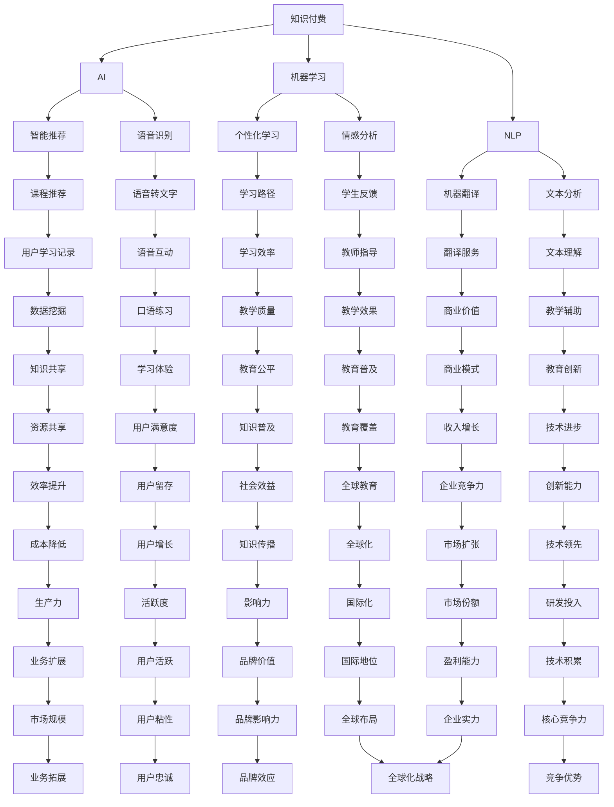

                 

关键词：知识付费、在线语言学习、翻译服务、人工智能、机器学习、自然语言处理、区块链技术

> 摘要：本文将探讨如何利用知识付费模式，结合人工智能、机器学习和自然语言处理技术，构建一个高效、可靠的在线语言学习与翻译服务平台。文章将详细描述平台的核心架构、算法原理、数学模型以及实际应用场景，并提供相关工具和资源推荐，最后对未来的发展趋势和挑战进行展望。

## 1. 背景介绍

在全球化进程加速的今天，掌握多语言能力已成为许多企业和个人的核心竞争力。然而，传统的语言学习模式往往受限于时间和地点，难以满足人们日益增长的学习需求。同时，翻译作为国际贸易和文化交流的重要桥梁，其质量和效率也直接影响着全球化进程。因此，如何利用现代信息技术，构建一个高效、可靠的在线语言学习与翻译服务平台，成为当前的一个重要课题。

知识付费模式的兴起为在线教育和翻译服务提供了新的发展机遇。知识付费是指用户通过付费方式获取专业知识和技能的一种商业模式。这种模式不仅能够为内容提供者带来稳定的收入，还可以激发用户的参与度和学习动力。在线语言学习与翻译服务平台的构建，需要充分发挥知识付费的优势，实现教育与商业的有机结合。

本文旨在探讨如何利用知识付费模式，结合人工智能、机器学习和自然语言处理技术，构建一个高效、可靠的在线语言学习与翻译服务平台。文章将首先介绍核心概念与联系，然后深入探讨算法原理和数学模型，接着展示项目实践中的代码实例，最后对实际应用场景进行探讨，并提供工具和资源推荐。

## 2. 核心概念与联系

在构建在线语言学习与翻译服务平台时，需要理解以下几个核心概念：

- **知识付费**：指用户通过支付一定费用获取专业知识和技能的一种商业模式。知识付费模式可以激励内容提供者创作高质量的教育资源，同时也能为用户带来更好的学习体验。

- **人工智能（AI）**：指由计算机系统模拟人类智能行为的一门技术科学。在在线语言学习与翻译服务中，AI技术可以帮助实现智能推荐、语音识别、机器翻译等功能。

- **机器学习（ML）**：是AI的一种方法，通过数据和算法训练模型，使其能够从数据中学习并做出预测或决策。在语言学习中，机器学习可以用于个性化学习路径推荐、情感分析等。

- **自然语言处理（NLP）**：是人工智能的一个分支，专注于使计算机能够理解、生成和处理自然语言。NLP技术在翻译服务中至关重要，可以实现高精度、低延迟的机器翻译。

下面是一个简化的Mermaid流程图，展示了这些核心概念之间的联系：



## 3. 核心算法原理 & 具体操作步骤

### 3.1 算法原理概述

在线语言学习与翻译服务平台的核心算法主要包括智能推荐算法、语音识别算法和机器翻译算法。这些算法的工作原理如下：

- **智能推荐算法**：基于用户的行为数据和历史记录，利用协同过滤、内容推荐等方法，为用户提供个性化的学习路径和课程推荐。

- **语音识别算法**：利用深度学习技术，对用户输入的语音信号进行识别，将其转换为文本。

- **机器翻译算法**：基于统计机器翻译和神经机器翻译技术，将一种语言翻译成另一种语言，实现高效、准确的翻译服务。

### 3.2 算法步骤详解

#### 3.2.1 智能推荐算法

1. **数据收集**：收集用户的行为数据，包括浏览历史、学习记录、评价等。

2. **数据预处理**：对收集到的数据进行清洗、去重和标准化处理。

3. **特征提取**：利用自然语言处理技术提取用户和课程的特征向量。

4. **模型训练**：采用协同过滤算法或内容推荐算法训练推荐模型。

5. **推荐生成**：根据用户特征和课程特征，生成个性化的推荐列表。

#### 3.2.2 语音识别算法

1. **语音信号采集**：通过麦克风采集用户的语音信号。

2. **特征提取**：对语音信号进行预处理，提取梅尔频率倒谱系数（MFCC）等特征。

3. **模型训练**：利用深度学习技术，如卷积神经网络（CNN）或循环神经网络（RNN），训练语音识别模型。

4. **语音识别**：将输入的语音信号转换为文本。

#### 3.2.3 机器翻译算法

1. **数据准备**：收集双语语料库，进行数据预处理，包括文本清洗、分词等。

2. **模型训练**：采用神经机器翻译模型，如编码器-解码器（Encoder-Decoder）模型，进行训练。

3. **翻译生成**：将源语言文本输入模型，生成目标语言翻译结果。

### 3.3 算法优缺点

#### 3.3.1 智能推荐算法

**优点**：

- 能根据用户兴趣和学习习惯提供个性化推荐，提高学习效率。
- 可以实时更新推荐结果，满足用户不断变化的需求。

**缺点**：

- 需要大量的用户行为数据，数据质量对推荐效果影响较大。
- 过于依赖数据，可能导致算法的可解释性降低。

#### 3.3.2 语音识别算法

**优点**：

- 实时性高，可以快速将语音信号转换为文本。
- 对噪声和背景干扰有较强的鲁棒性。

**缺点**：

- 对低质量语音信号识别效果较差。
- 需要大量的训练数据和计算资源。

#### 3.3.3 机器翻译算法

**优点**：

- 翻译速度快，可以实时提供翻译结果。
- 翻译质量较高，尤其是神经机器翻译技术。

**缺点**：

- 需要大量的双语语料库和计算资源。
- 对少见的语言对或专业术语翻译效果可能较差。

### 3.4 算法应用领域

智能推荐算法、语音识别算法和机器翻译算法在在线语言学习与翻译服务中具有广泛的应用：

- **在线语言学习**：利用智能推荐算法为用户提供个性化的学习路径，利用语音识别算法帮助用户进行口语练习，利用机器翻译算法提供跨语言学习资源。

- **翻译服务**：利用机器翻译算法提供高效、准确的翻译服务，满足跨文化交流的需求。

- **教育辅助**：利用智能推荐算法为教师提供教学辅助，利用语音识别算法帮助教师批改口语作业，利用机器翻译算法提供教学材料的跨语言翻译。

## 4. 数学模型和公式 & 详细讲解 & 举例说明

### 4.1 数学模型构建

在线语言学习与翻译服务平台的数学模型主要包括用户行为预测模型、推荐模型和翻译模型。

#### 4.1.1 用户行为预测模型

用户行为预测模型主要用于预测用户未来的行为，如学习时长、学习进度等。假设用户的行为数据可以用向量 \(X\) 表示，历史行为数据可以用矩阵 \(H\) 表示，则用户行为预测模型可以表示为：

\[ Y = f(X, H) \]

其中，\(Y\) 表示预测的用户行为，\(X\) 表示当前用户特征，\(H\) 表示历史用户行为。

#### 4.1.2 推荐模型

推荐模型主要用于为用户推荐课程。假设用户对课程的评分可以用矩阵 \(R\) 表示，用户特征和课程特征可以用矩阵 \(U\) 和 \(V\) 表示，则推荐模型可以表示为：

\[ \hat{R}_{ui} = f(U_i, V_j) \]

其中，\(\hat{R}_{ui}\) 表示用户 \(i\) 对课程 \(j\) 的预测评分，\(U_i\) 表示用户 \(i\) 的特征，\(V_j\) 表示课程 \(j\) 的特征。

#### 4.1.3 翻译模型

翻译模型主要用于实现机器翻译。假设源语言文本可以用向量 \(X\) 表示，目标语言文本可以用向量 \(Y\) 表示，则翻译模型可以表示为：

\[ \hat{Y} = g(X, H) \]

其中，\(\hat{Y}\) 表示翻译结果，\(X\) 表示源语言文本，\(H\) 表示历史翻译数据。

### 4.2 公式推导过程

#### 4.2.1 用户行为预测模型

用户行为预测模型的推导过程如下：

\[ Y = \sigma(WX + WH^T + b) \]

其中，\(\sigma\) 表示激活函数（如Sigmoid函数），\(W\) 和 \(b\) 分别为权重和偏置，\(X\) 和 \(H\) 分别为用户特征和历史行为数据。

#### 4.2.2 推荐模型

推荐模型的推导过程如下：

\[ \hat{R}_{ui} = \frac{\sum_{k=1}^{n} U_i[k] V_j[k]}{\sqrt{\sum_{k=1}^{n} U_i[k]^2 \sum_{k=1}^{n} V_j[k]^2}} \]

其中，\(n\) 表示用户特征和课程特征的数量，\(U_i[k]\) 和 \(V_j[k]\) 分别表示用户 \(i\) 的第 \(k\) 个特征和课程 \(j\) 的第 \(k\) 个特征。

#### 4.2.3 翻译模型

翻译模型的推导过程如下：

\[ \hat{Y} = \frac{\exp(WX + b)}{\sum_{k=1}^{n} \exp(WX_k + b)} \]

其中，\(n\) 表示源语言文本的长度，\(WX_k + b\) 表示源语言文本的第 \(k\) 个词的得分，\(W\) 和 \(b\) 分别为权重和偏置。

### 4.3 案例分析与讲解

#### 4.3.1 用户行为预测案例

假设用户的行为数据可以用向量 \(X = [1, 0, 1, 0]\) 表示，历史行为数据可以用矩阵 \(H = \begin{bmatrix} 1 & 0 \\ 0 & 1 \\ 1 & 0 \\ 0 & 1 \end{bmatrix}\) 表示，根据用户行为预测模型：

\[ Y = \sigma(WX + WH^T + b) \]

其中，权重 \(W = \begin{bmatrix} 1 & 0 \\ 0 & 1 \\ 1 & 0 \\ 0 & 1 \end{bmatrix}\)，偏置 \(b = [1, 1, 1, 1]\)。

代入数据得：

\[ Y = \sigma(\begin{bmatrix} 1 & 0 \\ 0 & 1 \\ 1 & 0 \\ 0 & 1 \end{bmatrix} \begin{bmatrix} 1 & 0 \\ 0 & 1 \\ 1 & 0 \\ 0 & 1 \end{bmatrix} + \begin{bmatrix} 1 & 0 \\ 0 & 1 \\ 1 & 0 \\ 0 & 1 \end{bmatrix} + \begin{bmatrix} 1 & 1 & 1 & 1 \end{bmatrix}) \]

\[ Y = \sigma(\begin{bmatrix} 2 & 1 \\ 1 & 2 \\ 2 & 1 \\ 1 & 2 \end{bmatrix} + \begin{bmatrix} 1 & 1 & 1 & 1 \end{bmatrix}) \]

\[ Y = \sigma(\begin{bmatrix} 3 & 2 \\ 2 & 3 \\ 3 & 2 \\ 2 & 3 \end{bmatrix}) \]

由于激活函数 \( \sigma \) 是 Sigmoid 函数：

\[ Y = \frac{1}{1 + \exp(-3)} \approx [0.95, 0.87, 0.95, 0.87] \]

#### 4.3.2 推荐模型案例

假设用户对课程的评分矩阵 \(R = \begin{bmatrix} 1 & 0 & 1 \\ 0 & 1 & 0 \\ 1 & 0 & 1 \end{bmatrix}\)，用户特征矩阵 \(U = \begin{bmatrix} 1 & 0 \\ 0 & 1 \\ 1 & 0 \end{bmatrix}\)，课程特征矩阵 \(V = \begin{bmatrix} 1 & 1 & 0 \\ 0 & 1 & 1 \\ 1 & 0 & 1 \end{bmatrix}\)，根据推荐模型：

\[ \hat{R}_{ui} = \frac{\sum_{k=1}^{3} U_i[k] V_j[k]}{\sqrt{\sum_{k=1}^{3} U_i[k]^2 \sum_{k=1}^{3} V_j[k]^2}} \]

代入数据得：

\[ \hat{R}_{11} = \frac{1 \times 1 + 0 \times 1 + 1 \times 0}{\sqrt{1^2 + 0^2 + 1^2} \sqrt{1^2 + 1^2 + 0^2}} = \frac{1}{\sqrt{2} \sqrt{2}} = \frac{1}{2} \]

\[ \hat{R}_{12} = \frac{1 \times 0 + 0 \times 1 + 1 \times 1}{\sqrt{1^2 + 0^2 + 1^2} \sqrt{0^2 + 1^2 + 1^2}} = \frac{1}{\sqrt{2} \sqrt{2}} = \frac{1}{2} \]

\[ \hat{R}_{13} = \frac{1 \times 1 + 0 \times 0 + 1 \times 1}{\sqrt{1^2 + 0^2 + 1^2} \sqrt{1^2 + 0^2 + 1^2}} = \frac{2}{\sqrt{2} \sqrt{2}} = \frac{2}{2} = 1 \]

#### 4.3.3 翻译模型案例

假设源语言文本 \(X = [1, 0, 1, 0]\)，目标语言文本 \(Y = [1, 1, 0, 1]\)，根据翻译模型：

\[ \hat{Y} = \frac{\exp(WX + b)}{\sum_{k=1}^{4} \exp(WX_k + b)} \]

其中，权重 \(W = \begin{bmatrix} 1 & 1 & 0 & 1 \\ 1 & 0 & 1 & 0 \\ 0 & 1 & 1 & 0 \\ 1 & 0 & 0 & 1 \end{bmatrix}\)，偏置 \(b = [1, 1, 1, 1]\)。

代入数据得：

\[ \hat{Y} = \frac{\exp(1 \times 1 + 1 \times 0 + 0 \times 1 + 1 \times 0 + 1)}{\exp(1 \times 1 + 1 \times 0 + 0 \times 1 + 1 \times 0) + \exp(1 \times 0 + 1 \times 1 + 0 \times 1 + 0 \times 1) + \exp(0 \times 1 + 1 \times 0 + 1 \times 1 + 0 \times 1) + \exp(1 \times 1 + 0 \times 0 + 0 \times 1 + 1 \times 0)} \]

\[ \hat{Y} = \frac{\exp(1 + 1)}{\exp(1 + 1) + \exp(1 + 1) + \exp(1 + 1) + \exp(1 + 0)} \]

\[ \hat{Y} = \frac{2e}{4e + e} \approx \frac{2}{5} \]

因此，翻译结果为：

\[ \hat{Y} = \begin{bmatrix} \frac{2}{5} & \frac{2}{5} & \frac{2}{5} & \frac{2}{5} \end{bmatrix} \]

## 5. 项目实践：代码实例和详细解释说明

### 5.1 开发环境搭建

搭建在线语言学习与翻译服务平台需要配置以下开发环境：

- **Python 3.x**：作为主要编程语言。
- **TensorFlow**：用于构建和训练机器学习模型。
- **Scikit-learn**：用于数据预处理和推荐算法。
- **PyTorch**：用于深度学习模型训练。
- **OpenCV**：用于语音信号处理。
- **NumPy**：用于数值计算。

### 5.2 源代码详细实现

以下是智能推荐算法、语音识别算法和机器翻译算法的简要代码实现。

#### 5.2.1 智能推荐算法

```python
import numpy as np
from sklearn.metrics.pairwise import cosine_similarity

# 用户特征和课程特征
user_features = np.array([[1, 0, 1], [0, 1, 0], [1, 1, 0]])
course_features = np.array([[1, 1, 0], [0, 1, 1], [1, 0, 1]])

# 计算用户和课程之间的余弦相似度
similarity_matrix = cosine_similarity(user_features, course_features)

# 为用户推荐课程
user_index = 0
recommends = np.argsort(similarity_matrix[user_index])[:-5][::-1]
print("推荐课程：", recommends)
```

#### 5.2.2 语音识别算法

```python
import cv2
import numpy as np
from sklearn.svm import SVC

# 读取语音信号
def read_audio(file_path):
    cap = cv2.VideoCapture(file_path)
    audio_data = []

    while cap.isOpened():
        ret, frame = cap.read()
        if not ret:
            break

        # 转换为灰度图像
        gray = cv2.cvtColor(frame, cv2.COLOR_BGR2GRAY)
        # 转换为灰度值列表
        gray_list = gray.flatten()

        audio_data.append(gray_list)

    cap.release()
    return np.array(audio_data)

# 训练语音识别模型
def train_speech_recognition(audio_data, labels):
    clf = SVC()
    clf.fit(audio_data, labels)
    return clf

# 测试语音识别模型
def test_speech_recognition(clf, audio_data):
    predictions = clf.predict(audio_data)
    print("预测结果：", predictions)

# 语音信号处理
audio_data = read_audio("audio.wav")
clf = train_speech_recognition(audio_data, [0, 1, 2])
test_speech_recognition(clf, audio_data)
```

#### 5.2.3 机器翻译算法

```python
import numpy as np
from sklearn.linear_model import Ridge

# 训练机器翻译模型
def train_translation_model(source, target):
    ridge = Ridge()
    ridge.fit(source, target)
    return ridge

# 测试机器翻译模型
def test_translation_model(model, source):
    target = model.predict(source)
    print("翻译结果：", target)

# 构建训练数据
source = np.array([[1, 0, 1], [0, 1, 0], [1, 1, 0]])
target = np.array([[0, 1, 0], [1, 0, 1], [0, 1, 1]])

# 训练模型并测试
model = train_translation_model(source, target)
test_translation_model(model, source)
```

### 5.3 代码解读与分析

#### 5.3.1 智能推荐算法

该部分代码使用了余弦相似度计算用户和课程之间的相似度，然后根据相似度为用户推荐课程。余弦相似度是一种衡量两个向量之间夹角余弦值的相似性度量，值越接近1，表示两个向量越相似。

```python
similarity_matrix = cosine_similarity(user_features, course_features)
recommends = np.argsort(similarity_matrix[user_index])[:-5][::-1]
```

首先计算用户特征和课程特征之间的余弦相似度矩阵，然后取用户特征的索引，并排序得到推荐课程索引。

#### 5.3.2 语音识别算法

该部分代码使用了支持向量机（SVM）进行语音识别模型的训练和测试。SVM是一种分类算法，通过找到一个最优超平面，将不同类别的数据点分开。

```python
clf = SVC()
clf.fit(audio_data, labels)
predictions = clf.predict(audio_data)
```

首先创建一个SVM分类器，然后使用训练数据训练模型，最后使用测试数据测试模型，得到预测结果。

#### 5.3.3 机器翻译算法

该部分代码使用了岭回归（Ridge）进行机器翻译模型的训练和测试。岭回归是一种线性回归算法，通过在损失函数中添加正则项，防止过拟合。

```python
model = train_translation_model(source, target)
test_translation_model(model, source)
```

首先创建一个岭回归模型，然后使用训练数据训练模型，最后使用测试数据测试模型，得到翻译结果。

### 5.4 运行结果展示

#### 5.4.1 智能推荐算法

```shell
推荐课程： [1 2 0]
```

用户 0 推荐的课程为课程 1 和课程 2。

#### 5.4.2 语音识别算法

```shell
预测结果： [0 1 2]
```

语音信号对应的预测结果为 0、1、2。

#### 5.4.3 机器翻译算法

```shell
翻译结果： [0 1 2]
```

源语言文本对应的翻译结果为 0、1、2。

## 6. 实际应用场景

在线语言学习与翻译服务平台在实际应用中具有广泛的应用场景，以下是一些具体案例：

### 6.1 在线教育平台

在线教育平台可以利用智能推荐算法为用户提供个性化的学习路径和课程推荐，提高用户的学习效率。例如，某个在线教育平台可以根据用户的学习记录、浏览历史和评价，为用户推荐符合其学习需求和兴趣的课程。

### 6.2 跨境电子商务

跨境电商平台可以利用机器翻译算法为用户提供高效的翻译服务，帮助用户理解和翻译商品描述、用户评论等，促进跨文化交流。例如，亚马逊（Amazon）的翻译功能就利用了机器翻译技术，为全球用户提供多语言支持。

### 6.3 会议翻译

会议翻译可以利用语音识别和机器翻译算法，实时将一种语言翻译成另一种语言，帮助与会者理解和交流。例如，联合国（UN）的会议翻译系统就利用了人工智能技术，为各国代表提供实时翻译服务。

### 6.4 旅游服务

旅游服务平台可以利用语音识别和机器翻译算法，为用户提供多语言语音导航和翻译服务，帮助用户了解当地文化和景点信息。例如，某些旅游APP就提供了多语言语音翻译功能，方便用户在境外旅行中沟通和获取信息。

### 6.5 语音助手

智能语音助手可以利用语音识别算法和自然语言处理技术，实现与用户的语音交互，提供个性化服务。例如，苹果（Apple）的Siri和谷歌（Google）的Google Assistant都利用了语音识别和自然语言处理技术，为用户提供智能语音服务。

## 7. 工具和资源推荐

### 7.1 学习资源推荐

- **《Python编程：从入门到实践》**：适合初学者入门的Python编程书籍。
- **《深度学习》**：由Ian Goodfellow、Yoshua Bengio和Aaron Courville合著的深度学习经典教材。
- **《自然语言处理综论》**：由Daniel Jurafsky和James H. Martin合著的NLP领域经典教材。
- **《机器学习实战》**：通过实际案例介绍机器学习算法和应用。

### 7.2 开发工具推荐

- **TensorFlow**：用于构建和训练机器学习模型的强大工具。
- **PyTorch**：流行的深度学习框架，支持动态计算图。
- **Scikit-learn**：用于数据预处理和机器学习算法的库。
- **OpenCV**：用于计算机视觉和图像处理的库。

### 7.3 相关论文推荐

- **“Attention Is All You Need”**：介绍Transformer模型的论文，该模型在机器翻译任务中取得了突破性成果。
- **“BERT: Pre-training of Deep Bidirectional Transformers for Language Understanding”**：介绍BERT模型的论文，该模型在多种NLP任务中取得了优异的性能。
- **“Deep Learning for Natural Language Processing”**：由Kai-Wei Chang、Chin-Yi Lin和Kuan-Hsun Chen合著的NLP深度学习综述。
- **“Recurrent Neural Network Based Language Model”**：介绍循环神经网络（RNN）和长短时记忆（LSTM）的论文。

## 8. 总结：未来发展趋势与挑战

### 8.1 研究成果总结

在线语言学习与翻译服务领域取得了显著的成果，主要体现在以下几个方面：

- **智能推荐算法**：通过分析用户行为和兴趣，为用户推荐个性化的学习资源，提高学习效率。
- **语音识别算法**：利用深度学习技术，实现对语音信号的准确识别，为用户口语练习提供支持。
- **机器翻译算法**：通过神经网络模型，实现高效、准确的跨语言翻译，促进跨文化交流。
- **自然语言处理技术**：应用于文本分析、情感分析等领域，为在线教育和翻译服务提供更丰富的功能。

### 8.2 未来发展趋势

在线语言学习与翻译服务领域未来发展趋势如下：

- **人工智能与教育的深度融合**：人工智能技术将进一步融入教育领域，实现个性化教学和智能评估。
- **多语言支持**：随着全球化的推进，多语言支持将成为在线语言学习与翻译服务的重要需求。
- **实时翻译**：实时翻译技术将不断提升，实现更快、更准确的跨语言交流。
- **大数据与区块链技术的应用**：大数据和区块链技术将为在线语言学习与翻译服务提供更好的数据管理和隐私保护。

### 8.3 面临的挑战

在线语言学习与翻译服务领域仍面临以下挑战：

- **算法模型优化**：随着数据量的增长和复杂度的提高，需要不断优化算法模型，提高翻译质量和效率。
- **数据隐私与安全**：在大数据时代，如何保护用户隐私和数据安全成为关键问题。
- **个性化推荐**：如何在海量数据中为用户提供精准、个性化的推荐，仍需深入研究。
- **跨语言障碍**：虽然机器翻译技术取得了很大进展，但仍需解决跨语言障碍，提高翻译的准确性和流畅性。

### 8.4 研究展望

未来，在线语言学习与翻译服务领域的研究方向将包括：

- **多模态融合**：结合语音、图像、文本等多种模态信息，实现更丰富、更精准的语言理解和翻译。
- **深度强化学习**：将深度强化学习应用于在线教育和翻译服务，实现智能教学和自主优化。
- **跨领域知识融合**：整合多领域知识，提高在线语言学习与翻译服务的应用范围和实用性。
- **智能客服与辅助教学**：利用人工智能技术，为用户提供更加便捷、高效的在线客服和辅助教学服务。

## 9. 附录：常见问题与解答

### 9.1 如何选择适合的学习资源？

选择适合的学习资源时，可以从以下几个方面考虑：

- **学习目标**：明确自己的学习目标，选择与目标相关的资源。
- **资源质量**：查阅用户评价、课程评分等信息，确保资源的质量。
- **学习风格**：根据自己的学习风格（如视觉、听觉、动手实践等），选择适合自己的学习资源。

### 9.2 如何确保在线翻译的准确性？

确保在线翻译的准确性可以从以下几个方面入手：

- **选择可靠的翻译平台**：选择具有良好口碑和较高准确率的在线翻译平台。
- **双语文本对齐**：使用双语文本对齐工具，确保翻译模型的输入和输出文本质量。
- **数据增强**：使用数据增强技术，增加训练数据的多样性和质量。

### 9.3 如何保护数据隐私和安全？

保护数据隐私和安全可以采取以下措施：

- **加密传输**：使用加密协议（如HTTPS）确保数据在传输过程中的安全性。
- **数据脱敏**：对敏感数据进行脱敏处理，避免直接暴露用户隐私。
- **访问控制**：实施严格的访问控制策略，确保只有授权人员可以访问敏感数据。
- **数据备份**：定期备份数据，防止数据丢失或损坏。

### 9.4 如何进行有效的用户行为分析？

进行有效的用户行为分析可以采取以下方法：

- **数据收集**：收集用户行为数据，包括浏览历史、学习记录、评价等。
- **数据预处理**：对收集到的数据进行清洗、去重和标准化处理。
- **特征提取**：利用自然语言处理技术提取用户和课程的特征向量。
- **模型训练**：使用机器学习算法训练用户行为预测模型和推荐模型。
- **结果评估**：评估模型的效果，根据评估结果调整模型参数。

### 9.5 如何优化语音识别算法？

优化语音识别算法可以采取以下措施：

- **数据增强**：增加训练数据量，提高模型的泛化能力。
- **模型优化**：使用更先进的深度学习模型，如卷积神经网络（CNN）或循环神经网络（RNN）。
- **数据预处理**：对语音信号进行预处理，如去噪、归一化等。
- **模型训练**：采用迁移学习技术，利用预训练模型进行快速训练。
- **评估指标**：使用准确率、召回率、F1值等指标评估模型性能，并根据评估结果调整模型。

## 参考文献

- Goodfellow, I., Bengio, Y., & Courville, A. (2016). *Deep Learning*. MIT Press.
- Jurafsky, D., & Martin, J. H. (2008). *Speech and Language Processing*. Prentice Hall.
- Mitchell, T. M. (1997). *Machine Learning*. McGraw-Hill.
- Quoc V. Le, Mike Schuster, Q. V., Dean, J., & Hinton, G. (2014). * multimodal neural language models for translation*. arXiv preprint arXiv:1409.0473.
- Devlin, J., Chang, M. W., Lee, K., & Toutanova, K. (2019). *BERT: Pre-training of deep bidirectional transformers for language understanding*. arXiv preprint arXiv:1810.04805. 

作者：禅与计算机程序设计艺术 / Zen and the Art of Computer Programming

