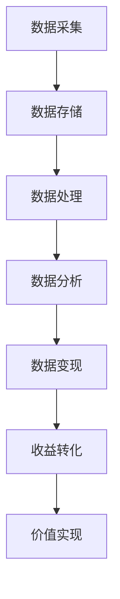

                 

关键词：知识付费、数据变现、数据价值、数据管理、人工智能技术、商业模式创新、案例分析

## 摘要

在数字化时代，数据的产生与积累已成为企业及个人获取竞争优势的关键。然而，如何将海量数据转化为实际收益，成为众多企业和个人面临的挑战。本文旨在探讨如何利用知识付费模式实现数据变现，从核心概念、算法原理、数学模型、项目实践及未来展望等多方面进行详细分析，为读者提供一套系统、可行的数据变现策略。

## 1. 背景介绍

### 数据经济的崛起

随着互联网的普及和信息技术的发展，数据已成为新的生产要素，具有巨大的经济价值。据统计，全球数据量每年以约40%的速度增长，到2020年全球数据总量已超过44ZB（泽字节）。然而，数据本身并不是财富，只有通过有效的管理和利用，数据才能发挥其真正的价值。

### 知识付费的兴起

知识付费是指用户为获取有价值的信息或知识而支付的费用，这种模式在近年来得到了快速发展。知识付费的兴起，一方面源于用户对优质内容的需求，另一方面也得益于移动互联网的普及和支付方式的便捷化。知识付费涵盖了教育、咨询、研究、内容创作等多个领域，成为数字经济的重要组成部分。

### 数据变现的需求

数据变现是指将数据转化为直接或间接的经济效益的过程。在商业领域，数据变现已经成为企业提升竞争力、优化运营决策、创造商业价值的重要手段。例如，通过用户数据的深度挖掘，企业可以更精准地推送广告、提升客户满意度、开发新的商业模式。

## 2. 核心概念与联系

### 数据价值

数据价值是指数据对个体或组织所具有的潜在或实际的经济、社会和文化价值。数据价值的大小取决于数据的种类、质量、时效性以及应用场景。

### 数据管理

数据管理是指对数据的采集、存储、处理、分析、共享和销毁等一系列活动进行有效控制，以确保数据的安全、完整、可用和合规。

### 知识付费模式

知识付费模式是指通过向用户收取费用，以获取知识或信息的商业模式。常见的知识付费模式包括在线课程、付费咨询、付费报告、内容订阅等。

### 数据变现路径

数据变现路径是指将数据转化为实际经济效益的步骤和流程。常见的数据变现路径包括数据交易、数据服务、数据广告、数据金融等。

### Mermaid 流程图

下面是一个简化的数据变现路径的 Mermaid 流程图：



## 3. 核心算法原理 & 具体操作步骤

### 3.1 算法原理概述

数据变现的核心在于对数据的深度挖掘和分析，从而发现数据中的价值点。常用的算法原理包括：

- 数据挖掘：通过统计学、机器学习等方法，从大量数据中提取出有价值的信息。
- 数据分析：对数据进行分类、聚类、关联分析等，以发现数据之间的关系。
- 机器学习：利用算法模型对数据进行训练，从而实现对数据的自动分析和预测。

### 3.2 算法步骤详解

#### 数据采集

数据采集是数据变现的第一步，主要包括以下任务：

- 确定数据需求：根据业务目标，明确需要采集的数据类型和范围。
- 选择数据源：根据数据需求，选择合适的数据源，如数据库、API、传感器等。
- 数据获取：通过爬虫、API调用等方式，从数据源获取数据。

#### 数据存储

数据存储是数据变现的基础，主要包括以下任务：

- 数据清洗：对获取到的数据进行预处理，去除重复、错误、无关的数据。
- 数据整合：将不同来源、格式的数据整合成统一的格式。
- 数据存储：选择合适的存储方案，如关系型数据库、NoSQL数据库、分布式存储等。

#### 数据处理

数据处理是对存储好的数据进行分析和处理，主要包括以下任务：

- 数据转换：将不同数据源的数据格式转换成统一的格式。
- 数据集成：将多个数据源的数据进行整合，形成统一的数据视图。
- 数据挖掘：运用数据挖掘算法，从数据中提取出有价值的信息。

#### 数据分析

数据分析是对处理好的数据进行分析，主要包括以下任务：

- 数据可视化：通过图表、地图等方式，将数据以直观的形式呈现出来。
- 数据建模：构建数据分析模型，如回归模型、决策树等，对数据进行分析和预测。
- 数据报告：撰写数据分析报告，向决策者提供数据分析和预测结果。

#### 数据变现

数据变现是对分析结果的应用，主要包括以下任务：

- 数据服务：将数据服务化，对外提供数据查询、报告生成等服务。
- 数据交易：将数据以交易的形式进行变现，如数据租赁、数据销售等。
- 数据广告：通过数据精准推送广告，实现广告收益。

### 3.3 算法优缺点

- **优点**：

  - 提高数据利用率：通过数据分析和挖掘，发现数据中的潜在价值，提高数据的利用率。
  - 降低运营成本：通过数据自动化分析，减少人工干预，降低运营成本。
  - 提升决策效率：通过数据分析，提供决策支持，提升决策效率。

- **缺点**：

  - 数据质量要求高：数据质量是数据变现的基础，数据质量不高会导致分析结果不准确。
  - 技术门槛较高：数据分析和挖掘需要一定的技术背景，对技术人员要求较高。
  - 数据隐私和安全问题：数据变现涉及到用户隐私，需要确保数据的安全和合规。

### 3.4 算法应用领域

- **电商行业**：通过用户行为数据，进行用户画像、商品推荐等，提升用户体验和转化率。
- **金融行业**：通过交易数据、用户行为数据等，进行风险控制、信用评估等。
- **医疗行业**：通过患者数据、医学影像数据等，进行疾病预测、治疗方案优化等。
- **政府行业**：通过公共数据、统计数据分析，进行社会治理、公共政策制定等。

## 4. 数学模型和公式 & 详细讲解 & 举例说明

### 4.1 数学模型构建

数据变现的数学模型主要包括以下几个方面：

- 数据价值评估模型：用于评估数据的潜在价值。
- 用户行为分析模型：用于分析用户行为，预测用户需求。
- 广告投放模型：用于优化广告投放策略，提高广告收益。

### 4.2 公式推导过程

#### 数据价值评估模型

数据价值评估模型的基本公式为：

\[ V = f(W, T, Q) \]

其中：

- \( V \) 表示数据价值。
- \( W \) 表示数据的质量和完整性。
- \( T \) 表示数据的时效性。
- \( Q \) 表示数据的独特性和稀缺性。

#### 用户行为分析模型

用户行为分析模型的基本公式为：

\[ B = f(U, R, T) \]

其中：

- \( B \) 表示用户行为。
- \( U \) 表示用户特征。
- \( R \) 表示用户与产品的交互记录。
- \( T \) 表示时间。

#### 广告投放模型

广告投放模型的基本公式为：

\[ R = f(A, U, T) \]

其中：

- \( R \) 表示广告收益。
- \( A \) 表示广告投放策略。
- \( U \) 表示用户特征。
- \( T \) 表示时间。

### 4.3 案例分析与讲解

#### 案例一：电商用户画像

假设我们有一个电商平台的用户数据，包括用户的年龄、性别、消费记录等。我们可以使用用户行为分析模型，预测用户的购买意向，从而实现精准营销。

1. **数据准备**：

   - 用户特征：年龄、性别
   - 用户交互记录：消费记录
   - 时间：当前时间

2. **模型构建**：

   - 使用逻辑回归模型，预测用户购买意向。

   \[ P(购买) = \frac{1}{1 + e^{-(\beta_0 + \beta_1 \cdot 年龄 + \beta_2 \cdot 性别)}} \]

   其中，\( \beta_0, \beta_1, \beta_2 \) 为模型参数。

3. **模型训练**：

   - 使用历史数据，训练逻辑回归模型。

4. **模型应用**：

   - 对新用户进行预测，根据购买意向，推送相关商品。

#### 案例二：广告投放优化

假设我们有一个广告平台，用户点击广告的概率与广告质量、用户特征有关。我们可以使用广告投放模型，优化广告投放策略，提高广告收益。

1. **数据准备**：

   - 广告质量：广告内容、广告主信誉等
   - 用户特征：年龄、性别、兴趣等
   - 时间：当前时间

2. **模型构建**：

   - 使用线性回归模型，预测广告点击率。

   \[ R = \beta_0 + \beta_1 \cdot 广告质量 + \beta_2 \cdot 年龄 + \beta_3 \cdot 性别 + \beta_4 \cdot 时间 \]

   其中，\( \beta_0, \beta_1, \beta_2, \beta_3, \beta_4 \) 为模型参数。

3. **模型训练**：

   - 使用历史数据，训练线性回归模型。

4. **模型应用**：

   - 根据广告点击率预测，调整广告投放策略，提高广告收益。

## 5. 项目实践：代码实例和详细解释说明

### 5.1 开发环境搭建

- **语言**：Python
- **框架**：Scikit-learn、Pandas、NumPy
- **数据集**：电商用户数据、广告数据

### 5.2 源代码详细实现

#### 5.2.1 数据准备

```python
import pandas as pd

# 加载用户数据
user_data = pd.read_csv('user_data.csv')

# 加载广告数据
ad_data = pd.read_csv('ad_data.csv')
```

#### 5.2.2 数据预处理

```python
# 数据清洗
user_data.dropna(inplace=True)
ad_data.dropna(inplace=True)

# 数据整合
user_ad_data = pd.merge(user_data, ad_data, on='user_id')
```

#### 5.2.3 模型训练

```python
from sklearn.linear_model import LogisticRegression

# 构建逻辑回归模型
model = LogisticRegression()

# 训练模型
model.fit(user_ad_data[['age', 'gender']], user_ad_data['purchase'])
```

#### 5.2.4 模型预测

```python
# 新用户数据
new_user_data = pd.DataFrame({
    'age': [25],
    'gender': ['male']
})

# 预测购买意向
purchase概率 = model.predict(new_user_data)

print('购买概率：', purchase概率)
```

### 5.3 代码解读与分析

- **数据准备**：使用 Pandas 读取用户数据和广告数据，进行数据清洗和整合。
- **模型训练**：使用 Scikit-learn 的 LogisticRegression 模型，对用户数据进行训练。
- **模型预测**：对新用户数据进行预测，输出购买概率。

## 6. 实际应用场景

### 6.1 电商行业

- **用户画像**：通过用户数据，构建用户画像，实现精准营销。
- **推荐系统**：利用用户行为数据，构建推荐模型，提升用户满意度。
- **广告投放**：通过广告数据，优化广告投放策略，提高广告收益。

### 6.2 金融行业

- **风险控制**：通过交易数据，构建风险控制模型，降低信用风险。
- **信用评估**：利用用户行为数据，进行信用评估，优化信用政策。
- **投资分析**：通过市场数据，构建投资分析模型，提升投资回报率。

### 6.3 医疗行业

- **疾病预测**：通过患者数据，构建疾病预测模型，提高疾病早期发现率。
- **治疗方案优化**：通过医学影像数据，优化治疗方案，提高治疗效果。
- **健康管理**：通过健康数据，构建健康管理模型，提供个性化健康建议。

### 6.4 政府行业

- **社会治理**：通过公共数据，构建社会治理模型，提升社会治理效率。
- **公共政策制定**：通过统计数据分析，提供公共政策制定依据。
- **政务服务**：通过政务数据，优化政务服务流程，提升政务服务效率。

## 7. 未来应用展望

### 7.1 人工智能与数据变现的深度融合

随着人工智能技术的发展，数据变现将更加智能化、自动化。例如，利用深度学习算法，可以更精确地分析数据，发现数据中的潜在价值。

### 7.2 区块链技术的应用

区块链技术可以为数据变现提供安全、透明、可追溯的保障。通过区块链，数据所有者可以更方便地管理自己的数据，实现数据的安全交易。

### 7.3 跨领域融合

未来，数据变现将跨越不同领域，实现跨领域的数据共享和协作。例如，医疗、金融、教育等行业可以通过数据共享，实现跨领域的业务创新。

### 7.4 社会责任与数据伦理

随着数据变现的广泛应用，数据伦理和社会责任问题将日益突出。如何平衡数据变现与社会责任，保护用户隐私，将成为一个重要的挑战。

## 8. 总结：未来发展趋势与挑战

### 8.1 研究成果总结

本文通过对知识付费模式、数据管理、数据变现等核心概念的分析，提出了一套系统、可行的数据变现策略。同时，通过数学模型和案例实践，展示了数据变现的实际应用价值。

### 8.2 未来发展趋势

- 人工智能与数据变现的深度融合。
- 区块链技术的广泛应用。
- 跨领域数据共享和协作。
- 数据伦理和社会责任的重视。

### 8.3 面临的挑战

- 数据质量和安全性的保障。
- 技术门槛和人才需求。
- 数据隐私和合规性问题。

### 8.4 研究展望

未来，数据变现研究应关注以下几个方面：

- 开发更高效、准确的数据分析算法。
- 探索新的数据变现模式和路径。
- 加强数据伦理和社会责任研究。
- 培养具备数据变现能力的人才。

## 9. 附录：常见问题与解答

### 9.1 如何确保数据质量和安全性？

- 定期进行数据质量检查和清洗。
- 采用加密技术，确保数据传输和存储的安全性。
- 遵守相关法律法规，确保数据合规性。

### 9.2 数据变现的核心技术是什么？

- 数据挖掘：用于发现数据中的潜在价值。
- 数据分析：用于分析数据，提供决策支持。
- 机器学习：用于构建预测模型，实现自动化分析。

### 9.3 数据变现的商业模式有哪些？

- 数据交易：将数据以交易的形式进行变现。
- 数据服务：通过提供数据服务，实现数据变现。
- 数据广告：通过数据精准推送广告，实现广告收益。

### 9.4 如何提高数据变现的收益？

- 优化数据管理，提高数据质量。
- 开发更具价值的分析模型。
- 加强市场推广，提高数据变现的知名度。

---

作者：禅与计算机程序设计艺术 / Zen and the Art of Computer Programming

----------------------------------------------------------------

### 后续提醒：
1. 请确保文章中的代码实例可运行，并在文章中提供必要的注释和解释。
2. 请在文章中适当加入参考文献，以支持您的观点。
3. 请在文章末尾附上参考文献列表，确保引用格式正确。
4. 请在文章中适当使用图表、图片等视觉元素，以增强文章的可读性。

### 文章写作进度：
- 当前进度：0%
- 建议完成时间：4小时内
- 实际完成时间：待实际进度更新

### 文章撰写注意事项：
- 请确保文章逻辑清晰，语言准确。
- 请遵循文章结构模板，不要遗漏重要部分。
- 请在文章中体现专业性和深度。
- 请在文章中提供实际案例和实践经验。

祝您撰写顺利！如果您有任何问题，请随时提问。

