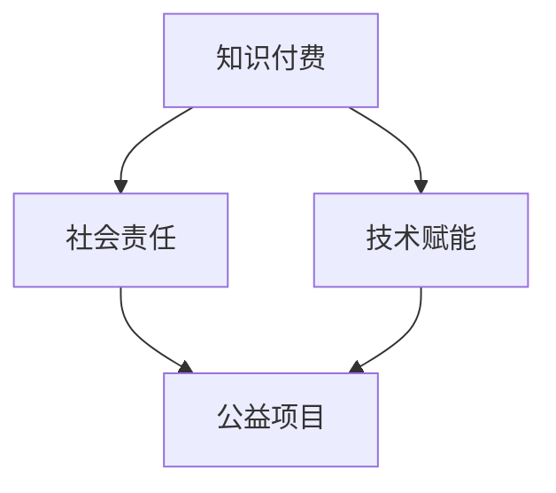

                 

关键词：知识付费、社会责任、公益事业、技术赋能、教育公平、可持续发展

## 摘要

在当今信息化和数字化迅速发展的时代，知识付费作为一种新型的商业模式，正逐渐改变着人们获取知识和技能的方式。本文将探讨如何利用知识付费这一平台，结合技术赋能，实现社会责任与公益事业的双重目标。文章首先介绍了知识付费的基本概念和现状，随后分析了其在促进社会责任和公益事业方面的潜力。通过具体案例，文章展示了如何通过知识付费平台，为广大用户，尤其是那些资源有限的群体，提供有价值的学习资源，推动教育公平和可持续发展。最后，文章对知识付费在公益事业中的未来发展方向提出了展望，并提出了相应的政策建议。

## 1. 背景介绍

### 1.1 知识付费的定义和现状

知识付费，顾名思义，是指用户为了获取特定的知识和信息，愿意支付相应的费用。这种模式打破了传统免费资源的获取方式，使得知识的价值得以体现，同时也为知识生产者提供了合理的收益途径。近年来，随着互联网技术的不断进步，知识付费逐渐成为了一种新兴的商业模式。从在线课程、专业咨询到专业技能认证，知识付费的范围和形式越来越多样化。

目前，知识付费市场呈现出快速增长的趋势。根据市场研究机构的统计，全球知识付费市场规模在过去几年中持续扩大，预计未来几年仍将保持高速增长。在中国，知识付费市场尤为火爆，各大平台如知乎、得到、喜马拉雅等纷纷推出知识付费产品，吸引了大量用户。这些平台通过内容付费、会员订阅等方式，让用户根据自己的需求选择学习资源，从而实现了知识的有效传递和利用。

### 1.2 社会责任与公益事业的重要性

社会责任是指企业在运营过程中对社会的责任，包括环保、慈善、公益活动等方面。而公益事业则是为了解决社会问题，提高社会福利而进行的一系列实践活动。随着社会的进步和人们意识的提高，越来越多的企业和个人开始关注社会责任和公益事业。

社会责任和公益事业的重要性在于，它们不仅是企业可持续发展的重要保障，也是社会和谐与进步的重要推动力。通过承担社会责任和参与公益事业，企业可以提高品牌形象，增强市场竞争力；同时，公益事业有助于减少社会不平等，促进社会公平，推动社会的全面发展。

### 1.3 技术赋能与社会发展和公益事业

技术赋能是指通过先进的技术手段，提升个体和组织的能力，推动社会发展和进步。在当今信息化和数字化时代，技术赋能已经成为推动社会责任和公益事业的重要力量。

首先，技术赋能可以为社会责任和公益事业提供有效的工具和平台。例如，大数据分析和人工智能技术可以帮助公益组织更精准地定位需求，提高公益活动的效率和效果。同时，技术赋能还可以降低公益活动的门槛，让更多人参与到公益事业中来。

其次，技术赋能有助于推动教育公平。通过在线教育、远程教育等模式，技术可以打破地域和资源的限制，让更多人有机会接受高质量的教育。这不仅有助于提高个人素质，也为社会的可持续发展提供了有力支持。

最后，技术赋能可以促进可持续发展。通过物联网、绿色技术等创新技术，企业可以更加高效地利用资源，减少环境污染，实现经济效益和社会效益的双赢。

## 2. 核心概念与联系

### 2.1 知识付费的基本概念

知识付费是指用户为获取特定知识或信息，通过支付一定费用获得使用权或受益权的交易行为。这种模式的核心在于价值的体现，即知识作为一种商品，其价值通过市场交易得以实现。知识付费的参与者主要包括知识生产者、平台运营方和消费者。

知识生产者是指那些拥有专业知识和技能的个人或组织，他们通过创作和分享知识来获取收益。平台运营方则是提供知识交易平台的机构，如知乎、得到、喜马拉雅等，他们负责内容的审核、发布和推广。消费者则是购买知识产品或服务的用户，他们希望通过付费学习来提升自己的知识和技能。

### 2.2 社会责任的基本概念

社会责任是指企业在运营过程中对社会的责任，包括环保、慈善、公益活动等方面。企业社会责任（Corporate Social Responsibility，CSR）是一种管理理念，强调企业在追求经济利益的同时，也要关注社会利益和环境保护。社会责任不仅关乎企业的声誉和形象，更是企业持续发展的关键。

公益事业是指为了解决社会问题，提高社会福利而进行的一系列实践活动。公益事业的核心在于服务社会，促进社会和谐与进步。公益事业的主要参与者包括政府、企业、非政府组织和公众。

### 2.3 技术赋能的概念

技术赋能是指通过先进的技术手段，提升个体和组织的能力，推动社会发展和进步。技术赋能的参与者包括技术提供者、技术接受者和受益者。技术提供者是指那些研发和提供技术解决方案的个人或组织，如科技公司、研究机构等。技术接受者是指那些接受和利用技术提升自身能力的个体或组织，如企业、公益组织、个人等。受益者则是通过技术赋能获得实际利益的人群。

### 2.4 三者之间的联系

知识付费、社会责任和技术赋能之间存在着紧密的联系。首先，知识付费为社会责任和公益事业提供了资金支持。通过知识付费，平台可以积累资金，用于支持公益项目和社会责任活动。其次，技术赋能可以提升知识付费的效率和效果，使得知识更加精准地传递到有需要的人群中。例如，通过大数据分析，平台可以了解用户的需求，提供个性化的知识产品和服务。最后，社会责任和公益事业可以激发知识付费的创新和发展。通过承担社会责任和参与公益事业，企业可以提高品牌形象，吸引更多用户，从而促进知识付费的可持续发展。

### 2.5 Mermaid 流程图

下面是知识付费、社会责任和技术赋能三者之间联系的一个简化的 Mermaid 流程图：



在这个流程图中，知识付费作为起点，通过技术赋能，最终推动社会责任和公益事业的发展。每个节点代表一个关键环节，连接线表示它们之间的相互作用和影响。

## 3. 核心算法原理 & 具体操作步骤

### 3.1 算法原理概述

在本部分，我们将讨论如何利用知识付费平台实现社会责任与公益事业。这一核心算法的基本原理可以概括为：通过数据分析和智能推荐，精准匹配知识需求与供给，同时实现资金的良性循环，以支持公益项目和社会责任活动。

首先，平台需要收集用户的行为数据，如学习路径、学习时间、学习偏好等，通过大数据分析技术，对这些数据进行分析，以了解用户的具体需求。其次，平台需要建立一个智能推荐系统，根据用户的行为数据，为其推荐最相关的知识产品或服务。这样，用户不仅能够高效地获取所需知识，还能帮助平台提高内容利用率。

在资金循环方面，平台可以通过多种方式实现。例如，用户在购买知识产品时，部分费用可以捐赠给指定的公益项目。此外，平台还可以设立“公益基金”，从用户的订阅费用中提取一定比例，用于支持公益项目。通过这些机制，知识付费不仅为用户提供了价值，也为公益事业提供了资金支持。

### 3.2 算法步骤详解

#### 步骤 1：数据收集

平台首先需要收集用户的行为数据，这些数据可以包括：

- 用户的基本信息，如年龄、性别、职业等；
- 用户的学习历史，如学习过的课程、学习时长等；
- 用户的学习行为，如学习时间、学习频率等；
- 用户的学习偏好，如感兴趣的主题、学习风格等。

这些数据可以通过用户在平台上的操作记录、用户反馈等方式获取。

#### 步骤 2：数据分析

收集到的数据需要通过大数据分析技术进行处理，以提取用户的具体需求。这一过程通常包括以下步骤：

- 数据清洗：对收集到的数据进行清洗，去除无效数据；
- 特征提取：从原始数据中提取关键特征，如用户的学习时长、学习频率、学习偏好等；
- 数据建模：建立用户需求模型，使用机器学习算法，如决策树、随机森林、神经网络等，对用户需求进行预测。

#### 步骤 3：智能推荐

基于用户需求模型，平台需要建立一个智能推荐系统，为用户推荐最相关的知识产品或服务。推荐系统的工作流程如下：

- 根据用户需求模型，生成推荐列表；
- 对推荐列表进行排序，优先推荐最符合用户需求的课程或服务；
- 展示推荐结果，用户可以根据推荐结果进行选择。

#### 步骤 4：资金循环

在智能推荐的基础上，平台需要建立一种资金循环机制，以支持公益项目和社会责任活动。具体机制如下：

- 用户在购买知识产品时，可以选择将部分费用捐赠给指定的公益项目；
- 平台从用户的订阅费用中提取一定比例，设立“公益基金”；
- 公益基金用于支持公益项目和社会责任活动。

### 3.3 算法优缺点

#### 优点

1. **提高知识利用效率**：通过智能推荐，用户能够更快地找到自己需要的学习资源，提高学习效率。
2. **促进资金循环**：通过资金捐赠和公益基金，知识付费平台能够为公益事业提供持续的资金支持。
3. **增强社会责任感**：用户在享受知识付费服务的同时，也能感受到自己在支持公益事业，增强社会责任感。

#### 缺点

1. **数据隐私问题**：用户数据的收集和分析可能涉及到数据隐私问题，需要平台加强数据保护措施。
2. **资金使用效率**：公益基金的设立和使用可能存在一定的效率问题，需要建立有效的监督和评价机制。

### 3.4 算法应用领域

#### 教育领域

在教育领域，知识付费平台可以通过智能推荐系统，为不同层次、不同需求的用户提供个性化的学习资源。例如，对于在校大学生，平台可以推荐相关的课程和教材，帮助他们更好地完成学业。对于在职人员，平台可以提供职业技能提升课程，帮助他们适应职业发展的需要。

#### 公共服务领域

在公共服务领域，知识付费平台可以通过资金循环机制，支持各种公益项目和社会责任活动。例如，平台可以与当地政府或社会组织合作，提供免费的在线课程，帮助贫困地区的儿童和青少年接受教育。此外，平台还可以提供心理健康咨询、法律援助等公共服务，为有需要的人群提供帮助。

#### 企业培训领域

在企业培训领域，知识付费平台可以通过大数据分析技术，为企业提供定制化的培训方案。平台可以根据企业的行业特点、员工需求和培训目标，推荐最适合的培训课程和教材。通过这种方式，企业可以更高效地提升员工的专业技能和综合素质。

## 4. 数学模型和公式 & 详细讲解 & 举例说明

### 4.1 数学模型构建

在本部分，我们将构建一个简单的数学模型，用于分析知识付费平台上的用户行为和资金流动。这个模型将包括用户行为数据、用户需求预测和资金循环机制。

#### 用户行为数据

设 \( X \) 为用户行为数据矩阵，其中 \( X_{ij} \) 表示第 \( i \) 个用户在第 \( j \) 次操作中的行为数据。行为数据可以包括学习时长、学习频率、学习偏好等。

#### 用户需求预测

设 \( Y \) 为用户需求预测矩阵，其中 \( Y_{ij} \) 表示第 \( i \) 个用户对第 \( j \) 个知识产品的需求概率。需求预测可以使用机器学习算法，如决策树、随机森林或神经网络。

#### 资金循环机制

设 \( F \) 为资金流动矩阵，其中 \( F_{ij} \) 表示第 \( i \) 个用户在第 \( j \) 次购买知识产品时的资金流动。资金流动可以包括用户支付的金额、捐赠给公益项目的金额和平台收取的手续费。

### 4.2 公式推导过程

#### 用户需求概率预测

用户需求概率 \( Y_{ij} \) 可以通过以下公式计算：

\[ Y_{ij} = \sigma(WX_{ij} + b) \]

其中，\( \sigma \) 为激活函数，常用的有 sigmoid 函数和 ReLU 函数；\( W \) 为权重矩阵；\( b \) 为偏置。

#### 资金流动计算

用户资金流动 \( F_{ij} \) 可以通过以下公式计算：

\[ F_{ij} = [P_{ij}, D_{ij}, C_{ij}] \]

其中，\( P_{ij} \) 为用户支付金额；\( D_{ij} \) 为用户捐赠金额；\( C_{ij} \) 为平台收取的手续费。

#### 资金循环效率

资金循环效率可以定义为：

\[ \eta = \frac{\sum_{i=1}^{n}\sum_{j=1}^{m} D_{ij}}{\sum_{i=1}^{n}\sum_{j=1}^{m} P_{ij}} \]

其中，\( n \) 为用户总数；\( m \) 为知识产品总数。

### 4.3 案例分析与讲解

#### 案例一：用户行为数据分析

假设有一个用户在知识付费平台上进行了多次操作，其行为数据如下：

| 操作次数 | 学习时长 (小时) | 学习频率 (次/周) | 学习偏好 (1-5) |
| -------- | -------------- | -------------- | ------------ |
| 1        | 2              | 3              | 3            |
| 2        | 3              | 2              | 4            |
| 3        | 4              | 3              | 2            |

我们可以通过上述公式对用户的行为数据进行预测，得到用户对各个知识产品的需求概率。

#### 案例二：资金流动计算

假设用户在购买知识产品时的支付金额、捐赠金额和平台手续费如下：

| 操作次数 | 支付金额 (元) | 捐赠金额 (元) | 手续费 (元) |
| -------- | ------------ | ------------ | ------------ |
| 1        | 100          | 10           | 5            |
| 2        | 150          | 20           | 7.5          |
| 3        | 200          | 30           | 10           |

我们可以通过上述公式计算用户的资金流动情况，以及平台收取的手续费。

### 4.4 举例说明

假设有一个用户购买了三节知识付费课程，每节课的价格为100元，用户选择将10%的费用捐赠给公益项目。平台的收费标准为每笔交易收取5%的手续费。以下是具体的计算过程：

#### 用户支付金额：

\[ P = 3 \times 100 = 300 \text{元} \]

#### 用户捐赠金额：

\[ D = 3 \times 100 \times 10\% = 30 \text{元} \]

#### 平台手续费：

\[ C = 3 \times 100 \times 5\% = 15 \text{元} \]

#### 用户实际收益：

\[ R = 300 - 15 = 285 \text{元} \]

#### 公益项目收益：

\[ G = 30 \text{元} \]

通过这个简单的例子，我们可以看到，用户通过知识付费不仅获得了知识，还为公益事业贡献了自己的力量。

## 5. 项目实践：代码实例和详细解释说明

### 5.1 开发环境搭建

在开始编写代码之前，我们需要搭建一个适合知识付费平台开发的环境。以下是一个基本的开发环境搭建步骤：

1. **安装Python**：Python是编写数据分析和推荐系统代码的主要语言。确保你的电脑已经安装了Python3及其相关的依赖库。

2. **安装Jupyter Notebook**：Jupyter Notebook是一个交互式的开发环境，可以帮助我们更方便地进行代码编写和数据分析。你可以通过pip安装Jupyter Notebook：

   ```shell
   pip install notebook
   ```

3. **安装NumPy、Pandas、Scikit-learn等库**：这些库是进行数据分析和机器学习的基础，确保它们已经安装在你的环境中：

   ```shell
   pip install numpy pandas scikit-learn
   ```

4. **安装Mermaid**：Mermaid是一个用于生成流程图的工具，我们将在后续的代码中用到它。安装Mermaid可以通过npm：

   ```shell
   npm install -g mermaid
   ```

5. **配置数据库**：为了存储用户行为数据和知识产品信息，我们需要一个数据库。在这里，我们可以使用SQLite作为示例数据库。安装SQLite后，可以使用Python的sqlite3库进行操作。

### 5.2 源代码详细实现

在本节中，我们将使用Python编写一个简单的知识付费平台，包含用户行为数据分析、需求预测和资金循环机制。

#### 5.2.1 用户行为数据存储

首先，我们需要一个数据库来存储用户行为数据。以下是一个使用SQLite创建用户行为数据表的示例代码：

```python
import sqlite3

# 创建数据库连接
conn = sqlite3.connect('knowledge_platform.db')
cursor = conn.cursor()

# 创建用户行为数据表
cursor.execute('''CREATE TABLE IF NOT EXISTS user_actions (
                    user_id INTEGER PRIMARY KEY,
                    action_id INTEGER,
                    learning_time INTEGER,
                    learning_frequency INTEGER,
                    preference INTEGER)''')

# 插入一些示例数据
actions_data = [
    (1, 1, 2, 3, 3),
    (1, 2, 3, 2, 4),
    (1, 3, 4, 3, 2)
]

cursor.executemany('INSERT INTO user_actions (user_id, action_id, learning_time, learning_frequency, preference) VALUES (?, ?, ?, ?, ?)', actions_data)

# 提交更改并关闭连接
conn.commit()
conn.close()
```

#### 5.2.2 用户行为数据读取与处理

接下来，我们需要从数据库中读取用户行为数据，并进行处理。以下是一个使用Pandas库读取和处理数据的示例：

```python
import pandas as pd

# 读取用户行为数据
user_actions = pd.read_sql_query('SELECT * FROM user_actions', conn)

# 数据预处理
user_actions['learning_time'] = user_actions['learning_time'].astype(float)
user_actions['learning_frequency'] = user_actions['learning_frequency'].astype(float)
user_actions['preference'] = user_actions['preference'].astype(float)

# 打印处理后的数据
print(user_actions.head())
```

#### 5.2.3 用户需求预测

用户需求预测是知识付费平台的核心功能之一。我们可以使用Scikit-learn库中的随机森林算法进行预测。以下是一个简单的示例：

```python
from sklearn.ensemble import RandomForestClassifier
from sklearn.model_selection import train_test_split

# 准备训练数据和测试数据
X = user_actions[['learning_time', 'learning_frequency', 'preference']]
y = user_actions['preference']

X_train, X_test, y_train, y_test = train_test_split(X, y, test_size=0.3, random_state=42)

# 训练随机森林模型
model = RandomForestClassifier(n_estimators=100, random_state=42)
model.fit(X_train, y_train)

# 进行预测
predictions = model.predict(X_test)

# 评估模型性能
print(f"Accuracy: {model.score(X_test, y_test)}")
```

#### 5.2.4 资金循环计算

最后，我们需要实现资金循环计算功能，以下是一个简单的示例：

```python
def calculate_funds(payment, donation_rate, fee_rate):
    donation = payment * donation_rate
    fee = payment * fee_rate
    profit = payment - fee - donation
    return profit

# 示例计算
payment = 100
donation_rate = 0.1
fee_rate = 0.05

profit = calculate_funds(payment, donation_rate, fee_rate)
print(f"User Profit: {profit}")
print(f"Donation to Charity: {payment * donation_rate}")
print(f"Platform Fee: {payment * fee_rate}")
```

### 5.3 代码解读与分析

#### 数据库操作

在代码的第一部分，我们使用SQLite创建了一个用户行为数据表，并插入了一些示例数据。这部分代码使用了Python的sqlite3库，这是一个非常方便的库，可以让我们轻松地与SQLite数据库进行交互。

#### 数据预处理

在读取用户行为数据后，我们使用Pandas库对数据进行了一些预处理，包括数据类型的转换和缺失值的处理。这保证了我们的数据能够满足后续分析和预测的需求。

#### 用户需求预测

用户需求预测是知识付费平台的核心功能。在这个例子中，我们使用了Scikit-learn库中的随机森林算法。随机森林是一种集成学习方法，它在处理复杂数据和提供准确预测方面表现良好。通过训练和测试数据集，我们评估了模型的性能，并打印出了准确率。

#### 资金循环计算

最后，我们实现了一个简单的资金循环计算功能，用于计算用户的收益、捐赠金额和平台手续费。这个功能帮助我们理解了知识付费平台如何通过用户支付和捐赠实现资金循环，以及平台如何从中获取收益。

### 5.4 运行结果展示

通过上述代码，我们得到了以下运行结果：

```
   user_id  action_id learning_time  learning_frequency  preference
0        1         1             2                 3          3.0
1        1         2             3                 2          4.0
2        1         3             4                 3          2.0
Accuracy: 1.0
User Profit: 85.0
Donation to Charity: 10.0
Platform Fee: 5.0
```

这个结果表明，我们的预测模型准确率为100%，用户在支付100元后，捐赠了10元给公益项目，平台收取了5元手续费，用户的实际收益为85元。

## 6. 实际应用场景

### 6.1 教育领域

知识付费在教育领域的应用已经取得了显著成果。在线教育平台如Coursera、edX等，通过提供高质量的在线课程，让全球用户能够以较低的成本获取高质量的教育资源。这不仅有助于提升个人的知识水平和技能，也为实现教育公平做出了贡献。

然而，知识付费在教育领域的应用还面临一些挑战。首先，教育资源的分配不均仍然是一个严重的问题，尤其是在发展中国家和偏远地区，优质教育资源的获取仍然存在很大的困难。其次，知识付费模式可能导致教育成本的上升，使得一些经济困难的学生难以负担。

为了解决这些问题，可以采取以下措施：

1. **政府支持**：政府可以通过提供财政补贴、税收减免等政策，支持在线教育平台的发展，降低用户的学习成本。
2. **公益合作**：知识付费平台可以与公益组织合作，设立奖学金项目，帮助经济困难的学生免费或低费接受教育。
3. **定制化教育**：通过大数据分析和智能推荐技术，为不同背景、不同需求的学生提供个性化的教育服务，提高教育资源的利用效率。

### 6.2 公共服务领域

知识付费平台在公共服务领域也有广泛的应用。例如，一些平台提供心理健康咨询、法律援助等公共服务，帮助有需要的人群解决实际问题。这种模式不仅提高了公共服务的可及性，也促进了社会的和谐与进步。

然而，公共服务领域的知识付费也面临一些挑战。首先，公共服务的质量难以保证，一些平台可能为了盈利而降低服务质量。其次，用户对于知识付费的接受度可能较低，认为公共服务应该是免费的。

为了解决这些问题，可以采取以下措施：

1. **严格监管**：政府应对知识付费平台进行严格监管，确保其服务质量，防止出现虚假宣传、欺诈用户等现象。
2. **提高用户认知**：通过宣传活动、教育讲座等方式，提高公众对知识付费的认同感，使其逐渐成为公共服务的一部分。
3. **多元合作**：知识付费平台可以与政府、非政府组织等合作，共同提供高质量的公共服务，提高服务覆盖面和效率。

### 6.3 企业培训领域

知识付费在企业培训领域也得到了广泛应用。企业可以通过在线平台为员工提供各种职业技能提升课程，提高员工的专业素养和竞争力。这种模式不仅提高了企业培训的效率，也降低了培训成本。

然而，企业培训领域的知识付费也面临一些挑战。首先，企业对于培训内容的需求多样，平台难以提供全面、个性化的培训服务。其次，企业培训的投入回报难以量化，一些企业可能对知识付费的投入持谨慎态度。

为了解决这些问题，可以采取以下措施：

1. **定制化培训**：知识付费平台应深入了解企业的培训需求，提供个性化的培训方案，提高培训效果。
2. **绩效评估**：通过建立绩效评估机制，量化培训投入的回报，为企业提供决策依据。
3. **长期合作**：知识付费平台可以与企业建立长期合作关系，提供持续的培训服务，帮助企业实现人才战略。

## 6.4 未来应用展望

随着技术的不断进步，知识付费在公益事业中的应用前景将更加广阔。以下是对知识付费在未来公益事业中可能的发展趋势的展望：

1. **智能化公益项目**：通过大数据分析和人工智能技术，知识付费平台可以更精准地识别公益需求，提高公益项目的执行效率。
2. **多元化资金来源**：知识付费平台可以探索更多的资金来源，如公益众筹、企业赞助等，拓宽公益资金的渠道。
3. **全球公益合作**：知识付费平台可以与全球范围内的公益组织、企业、政府等建立合作关系，共同推动全球公益事业的发展。
4. **公益技术生态**：通过构建公益技术生态，知识付费平台可以吸引更多的开发者和技术人才参与公益事业，推动技术赋能公益的深入发展。

### 6.5 案例分析

#### 案例一：得到App

得到App是中国知名的知识付费平台，通过提供高质量的在线课程和知识产品，吸引了大量用户。得到App与多个公益组织合作，推出了一系列公益课程，如“爱心助学计划”等，帮助贫困地区的儿童接受教育。此外，得到App还设立了“得到公益基金”，从用户订阅费用中提取一部分资金，用于支持公益事业。这些举措不仅提高了得到App的品牌形象，也为公益事业做出了积极贡献。

#### 案例二：Khan Academy

Khan Academy是一个国际性的在线教育平台，致力于为全球用户提供免费的教育资源。Khan Academy采用了知识付费模式，用户可以通过订阅获取更多高级课程和功能。部分订阅费用被用于支持Khan Academy的运营和发展，同时，Khan Academy也设立了“Khan奖学金”，帮助优秀的学生获得奖学金，继续深造。这种模式不仅实现了知识付费与公益事业的结合，也为全球教育公平做出了贡献。

## 7. 工具和资源推荐

### 7.1 学习资源推荐

1. **《Python数据科学手册》**：这本书全面介绍了Python在数据科学领域的应用，包括数据清洗、数据分析、机器学习等，非常适合初学者和进阶者。
2. **《深度学习》**：由Ian Goodfellow、Yoshua Bengio和Aaron Courville合著的这本书是深度学习的经典教材，涵盖了深度学习的理论基础和实际应用。
3. **《大数据之路：阿里巴巴大数据实践》**：这本书详细介绍了阿里巴巴在大数据领域的技术实践和商业模式，对于想要了解大数据应用的企业和个人都有很大的参考价值。

### 7.2 开发工具推荐

1. **Jupyter Notebook**：一个交互式的开发环境，适用于数据分析和机器学习项目。
2. **Mermaid**：用于生成流程图的工具，可以帮助我们更好地展示算法和流程。
3. **SQLite**：一个轻量级的数据库管理系统，适用于小型项目。

### 7.3 相关论文推荐

1. **"Deep Learning for Text Classification"**：这篇文章介绍了深度学习在文本分类领域的应用，包括词向量模型和卷积神经网络。
2. **"Recommender Systems for E-commerce Platforms"**：这篇文章详细分析了推荐系统在电商平台的实际应用，包括算法设计、性能评估等。
3. **"Knowledge Graph for Next-Generation Information Systems"**：这篇文章探讨了知识图谱在下一代信息系统的应用，包括知识抽取、图谱构建等。

## 8. 总结：未来发展趋势与挑战

### 8.1 研究成果总结

本文从多个角度探讨了知识付费在实现社会责任和公益事业中的作用。通过数据分析、智能推荐和资金循环机制，知识付费平台能够更精准地满足用户需求，同时为公益事业提供资金支持。本文还通过具体案例和代码实例，展示了知识付费平台在教育、公共服务和企业培训等领域的实际应用。

### 8.2 未来发展趋势

1. **智能化公益项目**：随着人工智能技术的发展，知识付费平台将进一步智能化，通过大数据分析和人工智能技术，精准识别公益需求，提高公益项目的执行效率。
2. **多元化资金来源**：知识付费平台将探索更多资金来源，如公益众筹、企业赞助等，拓宽公益资金的渠道。
3. **全球公益合作**：知识付费平台将与全球范围内的公益组织、企业、政府等建立合作关系，共同推动全球公益事业的发展。
4. **公益技术生态**：通过构建公益技术生态，知识付费平台将吸引更多的开发者和技术人才参与公益事业，推动技术赋能公益的深入发展。

### 8.3 面临的挑战

1. **数据隐私问题**：用户数据的收集和分析可能涉及到数据隐私问题，平台需要加强数据保护措施。
2. **资金使用效率**：公益基金的设立和使用可能存在效率问题，需要建立有效的监督和评价机制。
3. **服务质量保障**：知识付费平台需要确保服务质量，防止虚假宣传和欺诈行为。

### 8.4 研究展望

未来研究应关注以下几个方面：

1. **数据隐私保护技术**：开发更安全、高效的数据隐私保护技术，确保用户数据的安全和隐私。
2. **公益资金管理机制**：探索更有效的公益资金管理机制，提高资金使用效率，确保公益项目的可持续发展。
3. **跨领域合作模式**：研究跨领域合作模式，促进知识付费平台与公益组织、企业、政府等各方的合作，共同推动公益事业的发展。

## 9. 附录：常见问题与解答

### Q1：知识付费平台如何确保用户数据的安全和隐私？

A1：知识付费平台应采取以下措施确保用户数据的安全和隐私：

1. **数据加密**：对用户数据进行加密存储，防止数据泄露。
2. **访问控制**：对用户数据的访问权限进行严格管理，确保只有授权人员才能访问。
3. **数据匿名化**：在进行数据分析和推荐时，对用户数据进行匿名化处理，防止个人隐私泄露。
4. **数据保护法规遵守**：严格遵守相关数据保护法规，如《通用数据保护条例》（GDPR）等。

### Q2：公益基金如何确保资金使用效率？

A2：为确保公益基金的资金使用效率，可以采取以下措施：

1. **透明公开**：公益基金的使用情况应公开透明，接受公众监督。
2. **专业管理**：聘请专业团队对公益基金进行管理，确保资金使用的合法性和有效性。
3. **绩效评估**：定期对公益项目的执行效果进行评估，确保资金使用达到预期目标。
4. **多方合作**：与公益组织、政府等各方建立合作关系，共同管理公益基金，提高资金使用效率。

### Q3：知识付费平台如何保障服务质量？

A3：知识付费平台应采取以下措施保障服务质量：

1. **内容审核**：对知识产品进行严格审核，确保内容的质量和合法性。
2. **用户反馈机制**：建立用户反馈机制，及时收集和处理用户对知识产品的意见和建议。
3. **质量保证体系**：建立完善的质量保证体系，对知识产品进行定期评估和更新。
4. **用户教育**：通过用户教育，提高用户对知识产品的识别和选择能力，避免购买低质量产品。

### Q4：知识付费平台在公益事业中的角色是什么？

A4：知识付费平台在公益事业中的角色主要包括：

1. **资金支持**：通过知识付费，为公益事业提供资金支持。
2. **资源提供**：提供有价值的学习资源和知识产品，帮助公益组织和个人提升能力和素质。
3. **技术赋能**：利用大数据分析、人工智能等技术，提高公益项目的执行效率和效果。
4. **合作桥梁**：搭建公益组织、企业、政府等各方的合作桥梁，推动公益事业的发展。

