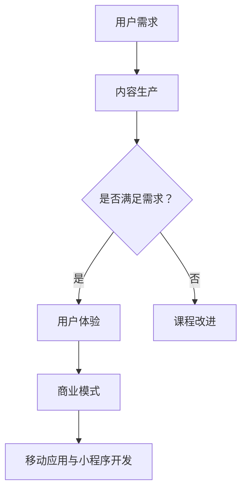

                 

关键词：知识付费、移动应用开发、小程序开发、技术教程、在线教育、商业模式、用户体验、技术趋势。

> 摘要：本文将探讨如何通过知识付费模式，为开发者提供移动应用与小程序开发的技术教程和资源，从而实现商业模式的创新和用户体验的提升。我们将从背景介绍、核心概念、算法原理、数学模型、项目实践、实际应用场景、未来展望等多个角度，深入分析这一领域的发展趋势与挑战。

## 1. 背景介绍

随着移动互联网的迅猛发展，移动应用和小程序成为了人们日常生活中不可或缺的一部分。从社交、购物、娱乐到生活服务，各类应用层出不穷，极大地丰富了人们的线上生活。然而，面对如此庞大的市场，开发者和创业者们不仅需要具备出色的技术能力，还需要了解商业模式、用户体验、市场营销等多方面知识。

在此背景下，知识付费应运而生。知识付费是指用户通过支付一定费用，获取专业知识和技能的过程。在线教育平台、技术论坛、专业社区等，都成为了知识付费的重要载体。开发者可以通过这些平台，学习到最前沿的技术知识，提升自身能力，从而在激烈的市场竞争中脱颖而出。

## 2. 核心概念与联系

### 2.1 知识付费模式

知识付费模式是指通过在线教育、技术教程、专业咨询等形式，向用户提供有价值的信息和技能。这种模式的核心在于，用户愿意为高质量的知识和服务支付费用。以下是知识付费模式的几个关键组成部分：

1. **内容生产**：知识付费平台需要拥有一批具备专业知识和经验的讲师、专家，他们能够生产高质量的内容。
2. **课程设计**：课程设计要贴近用户需求，具有系统性和实用性，能够帮助用户快速提升技能。
3. **用户体验**：良好的用户体验是知识付费模式成功的关键，包括界面设计、内容推送、互动交流等方面。
4. **商业模式**：知识付费平台需要找到合适的商业模式，如会员制、一次性购买、订阅制等，以实现可持续盈利。

### 2.2 移动应用与小程序开发

移动应用与小程序开发是知识付费的重要应用领域。以下是这一领域的主要概念：

1. **移动应用**：移动应用是指为智能手机和平板电脑等移动设备设计的软件，它们通常需要下载安装，并提供丰富的功能和服务。
2. **小程序**：小程序是一种无需安装即可使用的应用，它依托于微信、支付宝等平台，具有快速启动、低门槛、高复用等特点。
3. **开发技术**：移动应用与小程序开发涉及多种技术，包括前端开发、后端开发、数据库设计、算法实现等。
4. **平台选择**：开发者需要根据项目需求和目标用户，选择合适的开发平台，如iOS、Android、微信小程序等。

### 2.3 Mermaid 流程图

为了更好地展示知识付费模式与移动应用、小程序开发之间的联系，我们可以使用Mermaid流程图来描述。以下是一个简化的流程图：



## 3. 核心算法原理 & 具体操作步骤

### 3.1 算法原理概述

在移动应用与小程序开发中，算法原理是核心之一。以下是几个常见的算法原理及其应用：

1. **前端开发算法**：包括布局算法、渲染算法、动画算法等，用于实现页面交互和视觉效果。
2. **后端开发算法**：包括数据处理算法、排序算法、搜索算法等，用于处理用户请求和数据存储。
3. **数据库算法**：包括索引算法、缓存算法、分布式数据库算法等，用于提高数据访问效率和性能。
4. **算法优化**：包括算法复杂度分析、空间换时间、时间换空间等策略，用于提高算法性能。

### 3.2 算法步骤详解

以下是移动应用与小程序开发中几个关键算法的具体步骤：

1. **前端布局算法**：
   - 计算元素位置：根据页面设计，计算每个元素的位置和尺寸。
   - 布局计算：根据元素位置和尺寸，计算页面布局。
   - 渲染输出：将布局结果输出到屏幕上。

2. **后端数据处理算法**：
   - 数据读取：从数据库中读取用户请求的数据。
   - 数据处理：对数据进行处理，如排序、筛选、聚合等。
   - 数据写入：将处理后的数据写入数据库或返回给用户。

3. **数据库缓存算法**：
   - 缓存命中判断：判断查询数据是否在缓存中。
   - 缓存更新：当缓存命中时，更新缓存内容。
   - 缓存淘汰：当缓存容量达到上限时，淘汰部分缓存。

### 3.3 算法优缺点

以下是几种常见算法的优缺点：

1. **快速排序**：
   - 优点：平均时间复杂度为O(nlogn)，高效。
   - 缺点：最坏时间复杂度为O(n^2)，稳定性差。

2. **归并排序**：
   - 优点：时间复杂度为O(nlogn)，稳定性好。
   - 缺点：空间复杂度为O(n)，占用内存大。

3. **哈希表**：
   - 优点：时间复杂度为O(1)，快速查询。
   - 缺点：可能产生哈希碰撞，需要处理。

### 3.4 算法应用领域

算法在移动应用与小程序开发中的应用非常广泛，以下是一些应用领域：

1. **前端开发**：用于实现页面交互和视觉效果。
2. **后端开发**：用于数据处理、排序、搜索等。
3. **数据库**：用于索引、缓存、分布式存储等。
4. **人工智能**：用于图像识别、自然语言处理等。

## 4. 数学模型和公式 & 详细讲解 & 举例说明

### 4.1 数学模型构建

在移动应用与小程序开发中，数学模型用于描述系统的行为和性能。以下是几个常见的数学模型：

1. **线性回归模型**：
   - 公式：y = ax + b
   - 说明：用于预测连续值，如用户评分、股票价格等。

2. **逻辑回归模型**：
   - 公式：P(y=1) = 1 / (1 + e^(-z))
   - 说明：用于预测离散值，如二分类问题。

3. **时间序列模型**：
   - 公式：y(t) = a * y(t-1) + b * x(t)
   - 说明：用于预测时间序列数据，如天气、股票走势等。

### 4.2 公式推导过程

以下是对逻辑回归模型的公式推导：

1. **概率公式**：
   - 公式：P(A|B) = P(B|A) * P(A) / P(B)

2. **对数函数**：
   - 公式：log(a * b) = log(a) + log(b)

3. **指数函数**：
   - 公式：e^(x+y) = e^x * e^y

4. **逻辑函数**：
   - 公式：P(A|B) = 1 / (1 + e^(-z))

### 4.3 案例分析与讲解

以下是一个简单的线性回归模型案例：

**案例**：预测商品销量。

1. **数据收集**：收集过去一段时间内商品销量和广告投放金额的数据。
2. **数据预处理**：对数据进行清洗和预处理，如缺失值处理、异常值处理等。
3. **模型构建**：选择线性回归模型，并使用最小二乘法求解参数a和b。
4. **模型训练**：将数据分为训练集和测试集，使用训练集训练模型，并使用测试集评估模型性能。
5. **模型应用**：使用训练好的模型预测未来商品销量。

**公式**：y = ax + b

**解释**：a表示广告投放金额对商品销量的影响程度，b表示常数项。

## 5. 项目实践：代码实例和详细解释说明

### 5.1 开发环境搭建

在开始项目实践之前，我们需要搭建一个合适的开发环境。以下是开发环境的搭建步骤：

1. **安装Node.js**：Node.js 是一个基于 Chrome V8 引擎的 JavaScript 运行环境，我们使用它来构建小程序项目。
2. **安装微信开发者工具**：微信开发者工具是微信官方提供的一个开发平台，用于开发和调试微信小程序。
3. **创建小程序项目**：在微信开发者工具中创建一个新的小程序项目，选择合适的模板或从零开始搭建。

### 5.2 源代码详细实现

以下是一个简单的小程序项目示例，实现了一个简单的计数器功能。

**源代码**：

```javascript
// pages/index/index.js
Page({
  data: {
    count: 0
  },
  onLoad: function () {
    // 页面加载时获取本地存储的计数器值
    var count = wx.getStorageSync('count') || 0;
    this.setData({
      count: count
    });
  },
  onCountChange: function (e) {
    // 更新计数器值
    var count = e.detail.value;
    wx.setStorageSync('count', count);
  }
});
```

**解释**：

- `data`：定义了页面的数据模型，包括计数器值`count`。
- `onLoad`：页面加载时触发，从本地存储中获取计数器值，并设置数据模型。
- `onCountChange`：计数器值变化时触发，更新本地存储的计数器值。

### 5.3 代码解读与分析

以下是代码的详细解读和分析：

1. **数据模型**：
   - `data`：定义了页面的数据模型，包括计数器值`count`。数据模型是小程序的核心，它决定了页面的数据状态和行为。

2. **页面加载**：
   - `onLoad`：页面加载时触发，从本地存储中获取计数器值，并设置数据模型。这里使用了`wx.getStorageSync`方法，它是一个同步方法，用于获取本地存储的值。

3. **计数器值变化**：
   - `onCountChange`：计数器值变化时触发，更新本地存储的计数器值。这里使用了`wx.setStorageSync`方法，它是一个同步方法，用于设置本地存储的值。

### 5.4 运行结果展示

在微信开发者工具中运行该项目，我们可以看到以下运行结果：

1. **页面展示**：页面展示了一个简单的计数器，包括一个文本输入框和一个按钮。
2. **功能实现**：点击按钮，计数器的值会发生变化，并实时保存到本地存储中。

## 6. 实际应用场景

### 6.1 社交类应用

社交类应用是移动应用与小程序开发的重要应用领域之一。通过知识付费模式，开发者可以学习到如何实现社交功能，如朋友圈、私信、直播等。以下是一个具体案例：

**案例**：开发一个基于微信小程序的社交平台。

1. **功能设计**：设计朋友圈、私信、直播等社交功能。
2. **技术实现**：使用微信小程序提供的API，实现社交功能。
3. **用户体验**：优化页面交互和视觉效果，提升用户体验。

### 6.2 生活服务类应用

生活服务类应用是小程序开发的重要领域之一。通过知识付费模式，开发者可以学习到如何实现生活服务功能，如美食推荐、出行导航、在线购物等。以下是一个具体案例：

**案例**：开发一个基于微信小程序的美食推荐平台。

1. **功能设计**：设计美食推荐、餐厅导航、在线预订等功能。
2. **技术实现**：使用微信小程序提供的API，实现美食推荐和生活服务功能。
3. **用户体验**：优化页面交互和视觉效果，提升用户体验。

### 6.3 教育类应用

教育类应用是移动应用与小程序开发的重要领域之一。通过知识付费模式，开发者可以学习到如何实现在线教育功能，如课程学习、作业提交、考试测评等。以下是一个具体案例：

**案例**：开发一个基于微信小程序的在线教育平台。

1. **功能设计**：设计课程学习、作业提交、考试测评等功能。
2. **技术实现**：使用微信小程序提供的API，实现在线教育功能。
3. **用户体验**：优化页面交互和视觉效果，提升用户体验。

## 7. 工具和资源推荐

### 7.1 学习资源推荐

1. **《微信小程序开发入门与实战》**：一本全面介绍微信小程序开发的入门书籍，适合初学者阅读。
2. **《React Native实战》**：一本介绍React Native移动应用开发的书籍，适合想要开发跨平台应用的开发者阅读。
3. **《前端开发技术解析》**：一本介绍前端开发技术的书籍，包括HTML、CSS、JavaScript等。

### 7.2 开发工具推荐

1. **微信开发者工具**：微信官方提供的开发工具，用于开发、调试和发布微信小程序。
2. **HBuilderX**：一款集成开发环境，支持多种编程语言，包括微信小程序开发。
3. **React Native Developer Tools**：一款用于React Native开发的调试工具，提供丰富的调试功能和性能分析。

### 7.3 相关论文推荐

1. **"Mobile Application Development: Concepts, Tools, and Platforms"**：一篇介绍移动应用开发的综述论文，涵盖了移动应用开发的基本概念和技术框架。
2. **"Web Application Development Using HTML5 and JavaScript"**：一篇介绍Web应用开发的论文，介绍了HTML5和JavaScript在Web应用开发中的应用。
3. **"Building Cross-Platform Mobile Apps with React Native"**：一篇介绍React Native开发的论文，介绍了React Native的基本原理和应用场景。

## 8. 总结：未来发展趋势与挑战

### 8.1 研究成果总结

随着移动互联网的快速发展，知识付费模式在移动应用与小程序开发领域取得了显著成果。通过知识付费，开发者可以快速获取前沿技术知识和实践经验，提升自身竞争力。同时，知识付费平台为用户提供了一个便捷的学习渠道，促进了技术的传播和普及。

### 8.2 未来发展趋势

1. **技术多元化**：随着技术的不断进步，移动应用与小程序开发将涉及更多新技术，如人工智能、物联网、区块链等。
2. **平台生态化**：知识付费平台将进一步完善生态，提供更丰富的学习资源和更全面的技术支持。
3. **个性化服务**：知识付费平台将更加注重用户体验，提供个性化的学习服务，满足不同用户的需求。

### 8.3 面临的挑战

1. **内容质量**：知识付费平台需要不断提高内容质量，满足用户对高质量知识的追求。
2. **竞争压力**：随着知识付费市场的扩大，竞争将变得更加激烈，平台需要不断创新，以保持竞争力。
3. **隐私保护**：在知识付费过程中，用户隐私保护成为一个重要问题，平台需要加强数据安全措施，保护用户隐私。

### 8.4 研究展望

未来，知识付费模式在移动应用与小程序开发领域将继续发挥重要作用。随着技术的不断进步和用户需求的不断变化，知识付费模式将不断创新，为开发者提供更多价值。同时，知识付费平台也将不断完善生态，为用户提供更好的学习体验。

## 9. 附录：常见问题与解答

### 9.1 知识付费平台如何盈利？

知识付费平台可以通过以下方式盈利：

1. **会员制**：用户支付一定费用成为会员，享受平台提供的所有服务。
2. **课程购买**：用户购买单个课程，获取课程内容和学习资源。
3. **广告收入**：平台在课程页面或学习过程中展示广告，获得广告收入。
4. **平台分成**：平台与内容创作者进行分成，平台获得一定比例的收入。

### 9.2 小程序开发需要掌握哪些技术？

小程序开发需要掌握以下技术：

1. **前端开发**：HTML、CSS、JavaScript等前端技术。
2. **后端开发**：Node.js、Python、Java等后端技术。
3. **数据库**：MySQL、MongoDB等数据库技术。
4. **API接口**：了解各种API接口的使用，如微信API、支付宝API等。
5. **移动端开发**：了解iOS和Android平台的特点和开发技术。

### 9.3 如何提升用户体验？

提升用户体验可以从以下几个方面入手：

1. **界面设计**：优化页面布局、配色、字体等，提高视觉体验。
2. **交互设计**：设计合理的交互流程，提高用户的操作效率。
3. **内容质量**：提供高质量、有价值的内容，满足用户需求。
4. **技术优化**：优化代码、减少页面加载时间，提高系统性能。
5. **反馈机制**：建立有效的用户反馈机制，及时解决用户问题。

---

**作者：禅与计算机程序设计艺术 / Zen and the Art of Computer Programming**  
本文旨在探讨如何利用知识付费模式，为开发者提供移动应用与小程序开发的技术教程和资源，从而实现商业模式的创新和用户体验的提升。通过本文的阐述，我们希望读者能够对知识付费、移动应用开发、小程序开发等领域的现状、趋势和挑战有更深入的理解。在未来的发展中，知识付费将继续发挥重要作用，为开发者提供更广阔的发展空间。让我们共同期待知识付费在移动应用与小程序开发领域的辉煌未来！

