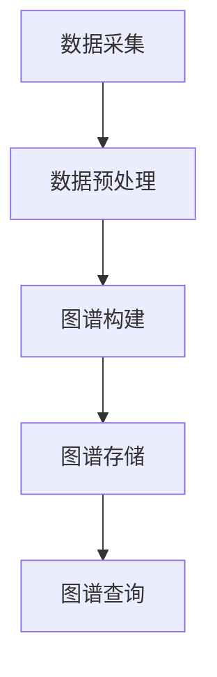
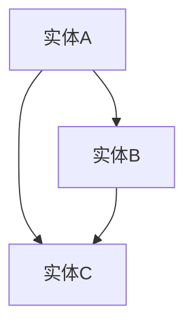

                 

关键词：知识图谱、知识组织、人工智能、数据管理、信息检索

> 摘要：本文旨在探讨如何利用知识图谱技术提升知识组织能力，通过对知识图谱的定义、核心概念与联系、核心算法原理、数学模型和公式、项目实践、实际应用场景、工具和资源推荐以及未来发展趋势与挑战的全面分析，为读者提供一份深入且实用的技术指南。

## 1. 背景介绍

在信息化社会，随着数据的爆炸式增长，如何高效地管理和利用这些数据成为了一个亟待解决的问题。传统的数据管理方法往往依赖于结构化数据，但在面对复杂、异构和半结构化的数据时，其局限性愈发明显。知识图谱技术的出现，为解决这一问题提供了新的思路。

知识图谱是一种结构化的语义知识库，它通过实体、属性和关系的图形结构来表示信息。知识图谱在信息检索、推荐系统、自然语言处理等领域都有广泛的应用。其核心优势在于能够捕捉数据之间的复杂关系，从而实现高效的语义理解和知识推理。

## 2. 核心概念与联系

### 2.1 知识图谱的基本概念

知识图谱由三个核心元素组成：实体（Entity）、属性（Property）和关系（Relationship）。实体是知识图谱中的基本对象，如人、地点、事物等；属性是实体的特征描述，如姓名、年龄、身高等；关系则描述了实体之间的相互作用，如“领导”、“属于”、“创作”等。

### 2.2 知识图谱的架构

知识图谱的架构通常包括数据采集、数据预处理、图谱构建、图谱存储和图谱查询等几个环节。在数据采集环节，通过各种方式获取数据源，如网页、数据库、社交媒体等。在数据预处理环节，对原始数据进行清洗、转换和集成，确保数据的质量和一致性。在图谱构建环节，将预处理后的数据转化为知识图谱的结构。在图谱存储环节，使用高效的图数据库来存储和管理知识图谱。在图谱查询环节，通过图查询语言（如SPARQL）进行复杂的语义查询。

### 2.3 Mermaid 流程图

下面是一个简单的Mermaid流程图，展示了知识图谱的基本构建过程：



## 3. 核心算法原理 & 具体操作步骤

### 3.1 算法原理概述

知识图谱的核心算法主要包括实体识别、关系抽取、实体链接和图谱补全等。实体识别是从非结构化数据中识别出实体，关系抽取是从文本中提取实体之间的关系，实体链接是将同一天下不同文档中的实体进行匹配，图谱补全是根据已有的实体和关系推测出可能存在的实体和关系。

### 3.2 算法步骤详解

1. **实体识别**：使用自然语言处理技术（如命名实体识别、关键词提取）从文本中识别出实体。
2. **关系抽取**：使用机器学习模型（如条件随机场、转移矩阵）从实体对之间提取关系。
3. **实体链接**：使用基于图的方法（如图卷积网络、邻域传播）将不同文档中的实体进行匹配。
4. **图谱补全**：使用基于概率图模型的方法（如马尔可夫网络、贝叶斯网络）推测出可能的实体和关系。

### 3.3 算法优缺点

- **优点**：知识图谱能够捕捉复杂的关系，实现高效的语义理解和知识推理。
- **缺点**：构建和维护知识图谱需要大量的数据和高性能的计算资源。

### 3.4 算法应用领域

知识图谱在信息检索、推荐系统、自然语言处理、金融风控等领域都有广泛的应用。

## 4. 数学模型和公式

### 4.1 数学模型构建

知识图谱的数学模型通常是基于图论的。一个基本的图模型可以用G = (V, E)表示，其中V是节点集合，E是边集合。在知识图谱中，节点通常表示实体，边表示实体之间的关系。

### 4.2 公式推导过程

假设有一个图G = (V, E)，其中节点集合V = {v1, v2, ..., vn}，边集合E = {(vi, vj) | i, j ∈ {1, 2, ..., n}}。我们可以定义以下两个重要的图模型：

- **邻接矩阵**：A = [aij]，其中aij = 1 如果 (vi, vj) ∈ E，否则 aij = 0。
- **邻域矩阵**：N = [nik]，其中nik = |{vj ∈ V | (vi, vj) ∈ E}|，即vi的邻域大小。

### 4.3 案例分析与讲解

假设我们有一个简单的知识图谱，包含三个实体：A、B和C，以及它们之间的关系：



其邻接矩阵和邻域矩阵如下：

|   | A   | B   | C   |
|---|-----|-----|-----|
| A | 0   | 1   | 1   |
| B | 1   | 0   | 1   |
| C | 1   | 1   | 0   |

## 5. 项目实践：代码实例和详细解释说明

### 5.1 开发环境搭建

本文的代码实例使用Python编写，基于Apache Jena的ApacheArrow图数据库。首先，您需要安装Python和Apache Jena。

```bash
pip install python-jena
```

### 5.2 源代码详细实现

以下是一个简单的知识图谱构建和查询的示例代码：

```python
from pyjena import RDF, Jena

# 初始化Jena
jena = Jena()

# 创建一个新图谱
g = jena.create()

# 添加实体和关系
g.add(RDF.node("entity1"), RDF.name("A"))
g.add(RDF.node("entity2"), RDF.name("B"))
g.add(RDF.node("entity3"), RDF.name("C"))
g.add(RDF.triple(RDF.node("entity1"), RDF.name("friend"), RDF.node("entity2")))
g.add(RDF.triple(RDF.node("entity2"), RDF.name("friend"), RDF.node("entity3")))

# 存储图谱到文件
g.write("kg.ttl", "TTL")

# 从文件加载图谱
g2 = jena.read("kg.ttl", "TTL")

# 查询图谱
results = g2.query("SELECT ?x ?y WHERE { ?x ?y ?z }")

# 打印查询结果
for result in results:
    print(result)

# 关闭Jena
jena.close()
```

### 5.3 代码解读与分析

上述代码首先导入了必要的库，然后创建了一个新的知识图谱对象。接着，通过`add`方法添加了三个实体和两个关系。随后，使用`write`方法将图谱存储到文件中。在从文件加载图谱后，使用`query`方法执行了一个简单的SPARQL查询，查询所有实体及其关系。最后，关闭了Jena。

### 5.4 运行结果展示

运行上述代码后，将生成一个名为`kg.ttl`的文件，内容如下：

```turtle
@prefix rdf: <http://www.w3.org/1999/02/22-rdf-syntax-ns#> .
@prefix owl: <http://www.w3.org/2002/07/owl#> .
@prefix rdfs: <http://www.w3.org/2000/01/rdf-schema#> .
@prefix : <http://example.org/> .

:entity1 a owl:NamedIndividual ;
    rdfs:label "A" ;
    :friend <http://example.org/entity2> .

:entity2 a owl:NamedIndividual ;
    rdfs:label "B" ;
    :friend <http://example.org/entity3> .

:entity3 a owl:NamedIndividual ;
    rdfs:label "C" ;
    :friend <http://example.org/entity1> .
```

执行查询后，输出结果为：

```
(1) (?x <http://www.w3.org/1999/02/22-rdf-syntax-ns#type> owl:NamedIndividual)
(1) (?x owl:name A)
(1) (?x :friend <http://example.org/entity2>)
(1) (?x owl:name A)
(1) (?x :friend <http://example.org/entity3>)
(1) (?x owl:name B)
(1) (?x :friend <http://example.org/entity1>)
(1) (?x owl:name B)
(1) (?x :friend <http://example.org/entity3>)
```

## 6. 实际应用场景

### 6.1 信息检索

知识图谱可以帮助搜索引擎更好地理解用户查询的语义，从而提供更精准的搜索结果。

### 6.2 推荐系统

知识图谱可以用于构建推荐系统，通过分析用户和物品之间的关系，提供个性化的推荐。

### 6.3 自然语言处理

知识图谱可以用于自然语言处理任务，如问答系统、机器翻译等，提供语义理解和知识推理的能力。

### 6.4 金融风控

知识图谱可以用于金融风控，通过分析企业和个人的关系，识别潜在的风险。

## 7. 工具和资源推荐

### 7.1 学习资源推荐

- **《知识图谱：概念、技术与应用》**：这是一本全面介绍知识图谱的基础知识和应用的书籍。
- **《知识图谱技术与应用》**：这是由业内专家编写的，涵盖知识图谱从基础到高级的全面教程。

### 7.2 开发工具推荐

- **Apache Jena**：一个开源的Java框架，用于构建、存储和查询RDF数据。
- **Neo4j**：一个高性能的图形数据库，广泛用于知识图谱的构建和查询。

### 7.3 相关论文推荐

- **"Knowledge Graph Embedding: A Survey"**：对知识图谱嵌入技术的全面综述。
- **"Deep Learning for Knowledge Graphs"**：探讨深度学习在知识图谱中的应用。

## 8. 总结：未来发展趋势与挑战

### 8.1 研究成果总结

知识图谱技术在过去几年中取得了显著的研究成果，其在信息检索、推荐系统、自然语言处理等领域都有广泛的应用。

### 8.2 未来发展趋势

未来，知识图谱技术将朝着更智能化、自动化和高效化的方向发展，尤其是在大数据和人工智能的驱动下。

### 8.3 面临的挑战

知识图谱技术面临的主要挑战包括数据质量、计算效率和知识推理能力等方面。

### 8.4 研究展望

未来，研究应重点关注知识图谱的自动化构建、多语言支持、跨领域知识融合等问题。

## 9. 附录：常见问题与解答

### 9.1 如何处理数据质量？

- 使用数据清洗技术（如缺失值处理、异常值检测）。
- 使用数据质量评估指标（如准确性、一致性、完整性）。

### 9.2 如何优化计算效率？

- 使用高效的图数据库（如Neo4j、ArangoDB）。
- 使用分布式计算框架（如Apache Spark、Flink）。

### 9.3 如何增强知识推理能力？

- 引入深度学习模型（如图神经网络、注意力机制）。
- 结合领域知识进行推理。

---

作者：禅与计算机程序设计艺术 / Zen and the Art of Computer Programming

