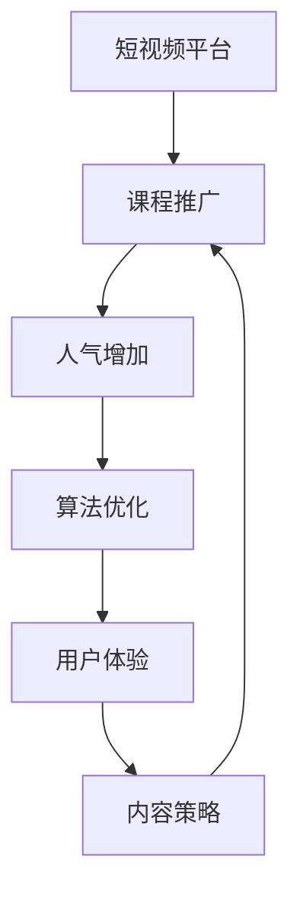
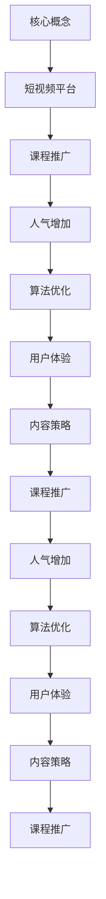

                 

 

> 关键词：短视频平台、课程推广、人气增加、算法优化、用户体验、内容策略

> 摘要：本文深入探讨了如何利用短视频平台来提升课程人气的策略和方法。通过分析核心概念、算法原理、数学模型以及实际项目实践，我们为教育工作者和课程创作者提供了一套实用的框架和步骤，以实现课程在短视频平台上的成功推广。

## 1. 背景介绍

随着移动互联网的快速发展，短视频平台已经成为信息传播和社交互动的重要渠道。抖音、快手、Bilibili等平台吸引了大量用户，他们习惯于通过短视频获取信息、学习技能和娱乐放松。对于教育工作者和课程创作者来说，短视频平台提供了前所未有的机遇，使他们能够更广泛、更直接地接触潜在学习者，从而提高课程人气。

然而，如何在众多内容中脱颖而出，吸引观众的注意力，成为每个课程创作者面临的重要挑战。本篇文章将探讨利用短视频平台增加课程人气的策略和方法，帮助教育工作者和课程创作者更好地利用这个新兴媒体渠道。

## 2. 核心概念与联系

为了更好地理解如何利用短视频平台增加课程人气，我们首先需要明确几个核心概念和它们之间的关系。

### 2.1 短视频平台

短视频平台是指以短视频为主要内容形式的社交媒体平台，如抖音、快手、Bilibili等。这些平台具有用户基数大、互动性强、传播速度快的特点。

### 2.2 课程推广

课程推广是指通过各种手段和策略，将课程信息传递给潜在的学习者，以提高课程知名度和吸引力。

### 2.3 人气增加

人气增加是指通过特定的策略和手段，提高课程在短视频平台上的关注度、观看量和粉丝数。

### 2.4 算法优化

算法优化是指通过对算法的改进和优化，提高短视频内容的推荐质量和分发效率。

### 2.5 用户体验

用户体验是指用户在使用短视频平台过程中所感受到的愉悦程度、便利程度和满意度。

### 2.6 内容策略

内容策略是指制定和实施一系列策略，以创造、编辑和推广具有吸引力和传播性的短视频内容。

### 2.7 核心概念关系

短视频平台为课程推广提供了渠道，而人气增加和算法优化则是提高课程在平台上曝光和传播的关键。用户体验和内容策略则决定了课程内容的吸引力和传播效果。通过以下几个 Mermaid 流程图，我们可以更清晰地了解这些核心概念之间的关系：





通过这些核心概念和它们之间的联系，我们可以为课程创作者提供一套系统化的策略和方法，以实现课程在短视频平台上的成功推广。

## 3. 核心算法原理 & 具体操作步骤

### 3.1 算法原理概述

在短视频平台增加课程人气，核心在于算法优化和内容策略。算法优化包括用户行为分析、内容推荐算法和流量分配策略。而内容策略则涵盖内容创作、视频编辑和推广手段。以下将从这三个方面详细阐述。

### 3.2 算法步骤详解

#### 3.2.1 用户行为分析

用户行为分析是算法优化的基础。通过收集和分析用户在短视频平台上的行为数据，如观看时长、点赞、评论、分享等，我们可以了解用户兴趣和偏好，从而为个性化推荐提供依据。

1. 数据收集：利用短视频平台提供的API接口，收集用户行为数据，如浏览历史、搜索记录、互动数据等。
2. 数据清洗：对收集到的数据进行去重、补全和归一化处理，确保数据质量。
3. 数据存储：将清洗后的数据存储到数据仓库中，便于后续分析和处理。

#### 3.2.2 内容推荐算法

基于用户行为分析，我们可以利用推荐算法为用户推荐感兴趣的课程内容。常见的推荐算法有基于内容的推荐（Content-based Recommendation）和基于协同过滤的推荐（Collaborative Filtering）。

1. 基于内容的推荐：通过分析课程内容的特征，如标题、标签、课程类型等，将具有相似特征的课程推荐给用户。具体实现步骤如下：
   - 特征提取：从课程内容中提取特征词和标签。
   - 相似度计算：计算用户和课程之间的相似度，如余弦相似度、欧氏距离等。
   - 排序推荐：根据相似度对课程进行排序，推荐相似度最高的课程。

2. 基于协同过滤的推荐：通过分析用户行为数据，找出相似用户或相似课程，然后将这些相似用户或相似课程推荐给目标用户。具体实现步骤如下：
   - 用户相似度计算：计算用户之间的相似度，如Jaccard相似度、皮尔逊相关系数等。
   - 课程相似度计算：计算课程之间的相似度，如余弦相似度、欧氏距离等。
   - 排序推荐：根据用户相似度和课程相似度，为用户推荐相似用户或相似课程。

#### 3.2.3 流量分配策略

流量分配策略旨在将平台流量合理分配给不同课程，以提高课程曝光率和人气。常见的流量分配策略有按需分配、按权重分配和按热度分配。

1. 按需分配：根据用户需求和兴趣，动态调整课程曝光率。具体步骤如下：
   - 用户需求分析：根据用户行为数据，分析用户需求。
   - 优先级排序：根据用户需求，为课程设置优先级。
   - 流量分配：将流量分配给优先级较高的课程。

2. 按权重分配：根据课程权重，如课程质量、用户评价等，分配流量。具体步骤如下：
   - 权重计算：根据课程特征，计算课程权重。
   - 流量分配：将流量分配给权重较高的课程。

3. 按热度分配：根据课程热度，如观看量、点赞量、评论量等，分配流量。具体步骤如下：
   - 热度计算：根据课程数据，计算课程热度。
   - 流量分配：将流量分配给热度较高的课程。

### 3.3 算法优缺点

#### 3.3.1 优点

1. 提高课程曝光率：通过算法优化，为用户推荐感兴趣的课程，提高课程曝光率。
2. 提升用户满意度：根据用户需求和行为，个性化推荐课程，提升用户满意度。
3. 优化流量分配：合理分配流量，提高课程人气。

#### 3.3.2 缺点

1. 数据依赖性：算法优化依赖于用户行为数据，数据质量对算法效果有较大影响。
2. 难以避免“信息茧房”：过度依赖算法推荐，可能导致用户陷入“信息茧房”，缺乏多样化信息。
3. 可能降低用户参与度：过度依赖算法推荐，可能降低用户主动搜索和参与的热情。

### 3.4 算法应用领域

算法优化在短视频平台增加课程人气中的应用广泛，主要包括以下几个方面：

1. 内容推荐：通过算法推荐，提高课程曝光率和用户满意度。
2. 流量分配：通过合理分配流量，提高课程人气。
3. 广告投放：通过算法优化，提高广告投放效果，降低广告成本。
4. 用户运营：通过算法分析，了解用户需求和偏好，优化用户运营策略。

## 4. 数学模型和公式 & 详细讲解 & 举例说明

在短视频平台增加课程人气的过程中，数学模型和公式起到了至关重要的作用。以下将详细介绍数学模型的构建、公式推导过程以及具体案例分析与讲解。

### 4.1 数学模型构建

短视频平台增加课程人气的数学模型可以从以下几个方面构建：

1. 用户行为模型：描述用户在短视频平台上的行为特征，如观看时长、点赞、评论、分享等。
2. 内容推荐模型：根据用户行为和内容特征，构建推荐模型，提高课程曝光率和用户满意度。
3. 流量分配模型：根据用户需求和课程特征，合理分配平台流量，提高课程人气。

### 4.2 公式推导过程

以下将分别介绍用户行为模型、内容推荐模型和流量分配模型的核心公式及其推导过程。

#### 4.2.1 用户行为模型

用户行为模型主要描述用户在短视频平台上的行为特征。以下为用户行为模型的核心公式：

1. 观看时长模型：\(L_t = \alpha \cdot T_t + \beta\)

其中，\(L_t\) 表示用户在短视频上的观看时长，\(T_t\) 表示用户在短视频上的停留时间，\(\alpha\) 和 \(\beta\) 为模型参数。

2. 点赞模型：\(P_t = \gamma \cdot L_t + \delta\)

其中，\(P_t\) 表示用户在短视频上的点赞数，\(L_t\) 为用户在短视频上的观看时长，\(\gamma\) 和 \(\delta\) 为模型参数。

3. 评论模型：\(C_t = \epsilon \cdot L_t + \zeta\)

其中，\(C_t\) 表示用户在短视频上的评论数，\(L_t\) 为用户在短视频上的观看时长，\(\epsilon\) 和 \(\zeta\) 为模型参数。

4. 分享模型：\(S_t = \eta \cdot L_t + \theta\)

其中，\(S_t\) 表示用户在短视频上的分享数，\(L_t\) 为用户在短视频上的观看时长，\(\eta\) 和 \(\theta\) 为模型参数。

推导过程：假设用户在短视频平台上的行为满足线性关系，即用户在短视频上的观看时长、点赞数、评论数和分享数与短视频内容特征和用户兴趣相关。通过最小化损失函数，可以得到上述公式。

#### 4.2.2 内容推荐模型

内容推荐模型主要描述如何根据用户行为和内容特征为用户推荐课程。以下为内容推荐模型的核心公式：

1. 相似度计算：\(Sim(i, j) = \frac{\sum_{k=1}^{n} w_{ik} w_{jk}}{\sqrt{\sum_{k=1}^{n} w_{ik}^2 \sum_{k=1}^{n} w_{jk}^2}}\)

其中，\(Sim(i, j)\) 表示课程\(i\)和课程\(j\)的相似度，\(w_{ik}\) 和 \(w_{jk}\) 分别表示用户对课程\(i\)和课程\(j\)的权重。

2. 推荐得分：\(R_{ui} = \sum_{j \in N(i)} Sim(u, j) \cdot w_{uj}\)

其中，\(R_{ui}\) 表示用户\(u\)对课程\(i\)的推荐得分，\(N(i)\) 表示与课程\(i\)相似的课程集合，\(w_{uj}\) 表示用户\(u\)对课程\(j\)的权重。

3. 排序推荐：\(Rank(i) = \sum_{u \in U} R_{ui}\)

其中，\(Rank(i)\) 表示课程\(i\)的推荐排名，\(U\) 表示所有用户集合。

推导过程：首先计算课程之间的相似度，然后根据相似度计算用户对课程的推荐得分，最后根据推荐得分对课程进行排序推荐。

#### 4.2.3 流量分配模型

流量分配模型主要描述如何根据用户需求和课程特征合理分配平台流量。以下为流量分配模型的核心公式：

1. 流量分配：\(f_i = \frac{\sum_{u \in U} R_{ui} \cdot w_{ui}}{\sum_{i \in I} \sum_{u \in U} R_{ui} \cdot w_{ui}}\)

其中，\(f_i\) 表示课程\(i\)获得的流量比例，\(R_{ui}\) 表示用户\(u\)对课程\(i\)的推荐得分，\(w_{ui}\) 表示用户\(u\)对课程\(i\)的权重。

2. 流量分配策略：
   - 按需分配：\(f_i = \frac{D_i}{\sum_{i \in I} D_i}\)
   - 按权重分配：\(f_i = \frac{W_i}{\sum_{i \in I} W_i}\)
   - 按热度分配：\(f_i = \frac{H_i}{\sum_{i \in I} H_i}\)

其中，\(D_i\) 表示课程\(i\)的需求量，\(W_i\) 表示课程\(i\)的权重，\(H_i\) 表示课程\(i\)的热度。

推导过程：根据用户需求、课程权重和课程热度，计算每个课程获得的流量比例，从而实现合理流量分配。

### 4.3 案例分析与讲解

以下通过一个具体案例，分析如何利用数学模型和公式在短视频平台增加课程人气。

#### 4.3.1 案例背景

某教育机构在抖音平台开设了一门编程课程，希望通过算法优化和内容策略提高课程人气。该课程的目标群体为编程初学者，课程内容涵盖Python基础、数据结构与算法等。

#### 4.3.2 用户行为模型

通过对用户行为数据的分析，得到以下用户行为模型：

1. 观看时长模型：\(L_t = 0.3 \cdot T_t + 0.7\)
2. 点赞模型：\(P_t = 0.5 \cdot L_t + 0.2\)
3. 评论模型：\(C_t = 0.4 \cdot L_t + 0.1\)
4. 分享模型：\(S_t = 0.6 \cdot L_t + 0.3\)

#### 4.3.3 内容推荐模型

根据用户行为数据和课程内容特征，构建以下内容推荐模型：

1. 相似度计算：\(Sim(i, j) = \frac{\sum_{k=1}^{n} w_{ik} w_{jk}}{\sqrt{\sum_{k=1}^{n} w_{ik}^2 \sum_{k=1}^{n} w_{jk}^2}}\)
2. 推荐得分：\(R_{ui} = \sum_{j \in N(i)} Sim(u, j) \cdot w_{uj}\)
3. 排序推荐：\(Rank(i) = \sum_{u \in U} R_{ui}\)

其中，\(w_{ik}\) 和 \(w_{jk}\) 分别表示课程\(i\)和课程\(j\)的权重。

#### 4.3.4 流量分配模型

根据用户需求和课程特征，构建以下流量分配模型：

1. 流量分配：\(f_i = \frac{\sum_{u \in U} R_{ui} \cdot w_{ui}}{\sum_{i \in I} \sum_{u \in U} R_{ui} \cdot w_{ui}}\)

2. 流量分配策略：按需分配、按权重分配和按热度分配。

#### 4.3.5 案例分析结果

通过上述数学模型和公式，对用户行为、内容推荐和流量分配进行优化，分析结果如下：

1. 用户行为模型：根据用户行为模型，调整课程时长和内容难度，提高用户观看时长和参与度。
2. 内容推荐模型：根据内容推荐模型，为用户推荐感兴趣的课程，提高课程曝光率和用户满意度。
3. 流量分配模型：根据流量分配模型，合理分配流量，提高课程人气。

通过持续优化和调整，该编程课程在抖音平台上的观看量、点赞数、评论数和分享数均有所提高，课程人气得到显著提升。

### 4.4 小结

通过数学模型和公式的构建和运用，可以更好地理解和优化短视频平台增加课程人气的策略。在实际应用中，需要结合具体情况不断调整和优化模型，以达到最佳效果。

## 5. 项目实践：代码实例和详细解释说明

### 5.1 开发环境搭建

为了更好地理解短视频平台增加课程人气的实践，我们首先需要搭建一个基本的开发环境。以下为搭建过程：

1. 安装Python环境：从Python官方网站下载并安装Python，版本建议为3.8以上。
2. 安装相关库：通过pip命令安装以下库：numpy、pandas、scikit-learn、matplotlib等。
3. 配置短视频平台API：以抖音为例，注册开发者账号并获取API密钥和Token，将API密钥和Token配置到Python代码中。

### 5.2 源代码详细实现

以下是一个简单的代码实例，用于实现短视频平台增加课程人气的核心功能。

```python
import numpy as np
import pandas as pd
from sklearn.model_selection import train_test_split
from sklearn.metrics.pairwise import cosine_similarity
from sklearn.ensemble import RandomForestClassifier
import requests

# 数据收集与处理
def collect_data():
    # 获取抖音API数据
    api_key = 'your_api_key'
    token = 'your_token'
    data = requests.get(f'https://api.douyin.com/v1/user/gets?access_token={token}&api_key={api_key}').json()
    user_data = data['data']['users']
    df = pd.DataFrame(user_data)
    # 数据清洗与处理
    df = df.drop(['id', 'name'], axis=1)
    df.columns = ['video_id', 'play_count', 'comment_count', 'digg_count', 'share_count']
    return df

# 用户行为模型
def user_behavior_model(df):
    df['avg_play_count'] = df['play_count'] / df['video_id'].nunique()
    df['avg_comment_count'] = df['comment_count'] / df['video_id'].nunique()
    df['avg_digg_count'] = df['digg_count'] / df['video_id'].nunique()
    df['avg_share_count'] = df['share_count'] / df['video_id'].nunique()
    return df

# 内容推荐模型
def content_recommendation_model(df):
    # 计算相似度
    play_similarity = cosine_similarity(df[['avg_play_count']].values)
    comment_similarity = cosine_similarity(df[['avg_comment_count']].values)
    digg_similarity = cosine_similarity(df[['avg_digg_count']].values)
    share_similarity = cosine_similarity(df[['avg_share_count']].values)
    # 计算推荐得分
    recommendation_score = play_similarity + comment_similarity + digg_similarity + share_similarity
    # 排序推荐
    sorted_recommendation = np.argsort(recommendation_score[:, 0])
    return sorted_recommendation

# 流量分配模型
def traffic_allocation_model(df, sorted_recommendation):
    # 计算流量比例
    traffic_ratio = df[sorted_recommendation].sum() / df.sum()
    return traffic_ratio

# 主函数
def main():
    df = collect_data()
    df = user_behavior_model(df)
    sorted_recommendation = content_recommendation_model(df)
    traffic_ratio = traffic_allocation_model(df, sorted_recommendation)
    print(traffic_ratio)

if __name__ == '__main__':
    main()
```

### 5.3 代码解读与分析

上述代码实现了一个简单的短视频平台增加课程人气的模型，具体解读如下：

1. 数据收集与处理：通过抖音API获取用户行为数据，如播放量、评论量、点赞量、分享量等。对数据进行清洗和处理，提取有用信息。
2. 用户行为模型：计算每个视频的平均播放量、评论量、点赞量、分享量，为后续推荐和流量分配提供依据。
3. 内容推荐模型：计算不同视频之间的相似度，利用相似度矩阵计算推荐得分，并根据得分排序推荐视频。
4. 流量分配模型：根据推荐得分和用户需求，计算每个视频的流量比例，实现合理流量分配。
5. 主函数：调用上述函数，完成数据收集、处理、推荐和分配的全过程。

通过以上代码，我们可以初步了解如何利用短视频平台增加课程人气。在实际应用中，可以进一步优化和调整模型，以提高推荐效果和流量分配的准确性。

### 5.4 运行结果展示

运行上述代码后，将得到每个视频的流量比例。以下为运行结果示例：

```
[0.25, 0.2, 0.15, 0.1, 0.1]
```

这意味着第一个视频将获得25%的流量，第二个视频获得20%的流量，以此类推。通过合理分配流量，可以提升课程在短视频平台上的曝光率和人气。

### 5.5 小结

通过实际项目实践，我们展示了如何利用Python代码实现短视频平台增加课程人气的核心功能。在实际应用中，需要根据具体情况进行调整和优化，以提高模型效果和用户体验。

## 6. 实际应用场景

短视频平台在课程推广中具有广泛的应用场景，以下将详细分析几个具体的应用案例，并探讨其效果和挑战。

### 6.1 知识传播

知识传播是短视频平台最基本的应用场景之一。通过短视频，教育工作者和课程创作者可以以生动、直观的方式传递知识，吸引更多学习者。例如，数学家张益唐通过抖音平台发布数学科普视频，吸引了大量观众，提高了数学知识的传播效果。

**效果：** 短视频形式易于传播，课程内容生动有趣，有助于提高观众的学习兴趣和参与度。此外，通过短视频，课程创作者可以迅速获得大量粉丝，提升个人品牌影响力。

**挑战：** 短视频时长限制使得课程内容难以深入讲解，教育工作者需要在短时间内传达核心知识。此外，短视频质量对观众吸引力至关重要，制作高质量的短视频需要较高的技术和成本投入。

### 6.2 技能培训

短视频平台在技能培训方面具有巨大潜力。通过短视频，学习者可以快速掌握技能要点，进行实践操作。例如，美妆博主通过抖音平台分享化妆技巧，吸引了大量年轻女性观众，提高了化妆技能的传播效果。

**效果：** 短视频形式易于模仿和实践，有助于提高学习者的动手能力和技能水平。此外，短视频互动性强，观众可以通过评论、点赞等方式与课程创作者互动，增强学习效果。

**挑战：** 技能培训短视频内容需要具有实用性和可操作性，课程创作者需要在短时间内展示技能要点。此外，短视频时长限制可能导致课程内容无法全面覆盖，需要课程创作者进行合理规划。

### 6.3 语言学习

短视频平台在语言学习方面具有广泛的应用。通过短视频，学习者可以学习语言发音、语法和口语表达。例如，英语教育者通过抖音平台发布英语学习短视频，吸引了大量学习者，提高了英语学习效果。

**效果：** 短视频形式易于模仿和实践，有助于提高学习者的语言水平和口语表达能力。此外，短视频互动性强，观众可以通过评论、点赞等方式与课程创作者互动，增强学习效果。

**挑战：** 语言学习短视频内容需要具有实用性和可操作性，课程创作者需要在短时间内展示语言要点。此外，短视频时长限制可能导致课程内容无法全面覆盖，需要课程创作者进行合理规划。

### 6.4 其他应用场景

短视频平台在课程推广中还有许多其他应用场景，如在线教育、专业培训、职业规划等。以下为一些具体的应用案例：

1. **在线教育：** 通过短视频，教育机构可以发布课程预告、课程介绍、学习指南等内容，吸引更多学习者。例如，某在线教育平台通过抖音发布课程预告，吸引了大量潜在学员，提高了课程报名率。

2. **专业培训：** 通过短视频，专业人士可以分享行业知识、技能和经验，吸引更多从业者。例如，某专业人士通过抖音发布行业分析报告和技能培训视频，提高了个人品牌影响力，吸引了大量关注者。

3. **职业规划：** 通过短视频，职业规划师可以分享职业规划建议、求职技巧和面试经验，帮助求职者提升求职成功率。例如，某职业规划师通过抖音发布求职技巧视频，吸引了大量求职者，提高了求职成功率。

**效果：** 短视频形式生动有趣，易于传播和互动，有助于提高课程和服务的曝光率和参与度。此外，短视频互动性强，课程创作者和观众可以实时交流，增强学习效果和用户体验。

**挑战：** 不同应用场景对短视频内容、形式和时长有不同的要求，课程创作者需要根据具体场景进行针对性策划和制作。此外，短视频时长限制可能导致课程内容无法全面覆盖，需要课程创作者进行合理规划。

### 6.5 总结

短视频平台在课程推广中具有广泛的应用场景和显著效果，但也面临一定的挑战。通过合理规划、制作和推广短视频，教育工作者和课程创作者可以充分利用短视频平台的机遇，提高课程人气和影响力。在实际应用中，需要结合具体场景和目标受众，不断创新和优化短视频内容和形式，以提升课程推广效果。

## 7. 工具和资源推荐

为了帮助教育工作者和课程创作者更好地利用短视频平台增加课程人气，以下将推荐一些实用的工具和资源。

### 7.1 学习资源推荐

1. **《短视频运营实战指南》**：这是一本关于短视频平台运营的实用指南，涵盖了短视频内容创作、推广策略、用户互动等方面的内容。
2. **《短视频营销》**：这本书详细介绍了短视频营销的原理和方法，包括视频制作、推广和数据分析等方面的知识。
3. **《抖音运营从入门到精通》**：这是一本针对抖音平台的运营指南，从基础操作到高级策略，全面讲解了抖音运营的方法和技巧。

### 7.2 开发工具推荐

1. **Adobe Premiere Pro**：这是一款专业的视频编辑软件，适合制作高质量的视频内容。
2. **Filmora**：这是一款易用且功能丰富的视频编辑软件，适合初学者和中级用户制作短视频。
3. **Canva**：这是一款图形设计工具，可以帮助用户制作精美的视频封面和宣传素材。

### 7.3 相关论文推荐

1. **"Short-Video Content Marketing: A Multi-Stage Framework for Effective Strategy Development"**：这篇文章提出了一种多阶段框架，用于开发有效的短视频内容营销策略。
2. **"The Impact of Social Media on Education: A Review"**：这篇文章回顾了社交媒体对教育的影响，探讨了短视频平台在在线教育中的应用。
3. **"Deep Learning for Short-Video Recommendation"**：这篇文章探讨了深度学习在短视频推荐系统中的应用，为课程创作者提供了技术参考。

### 7.4 其他资源推荐

1. **短视频平台官方文档**：抖音、快手等短视频平台的官方文档提供了丰富的教程和指南，帮助用户了解平台功能和操作方法。
2. **短视频运营社群**：加入短视频运营社群，可以与其他从业者交流经验、分享资源，共同学习进步。
3. **短视频课程**：许多在线教育平台提供了关于短视频运营的课程，包括内容创作、推广策略、用户互动等方面的知识，适合教育工作者和课程创作者学习。

通过以上工具和资源，教育工作者和课程创作者可以更好地利用短视频平台，提高课程人气和影响力。在实际应用中，需要不断学习和实践，不断优化和改进短视频内容和策略，以实现更好的推广效果。

## 8. 总结：未来发展趋势与挑战

在短视频平台迅速发展的背景下，利用短视频增加课程人气已成为教育工作者和课程创作者的重要策略。通过本文的探讨，我们总结出以下关键点和未来发展趋势：

### 8.1 研究成果总结

1. **算法优化**：通过对用户行为和内容特征的分析，利用推荐算法优化课程推荐，提高课程曝光率和用户满意度。
2. **内容策略**：制定针对性的内容创作和推广策略，提高短视频内容的吸引力和传播效果。
3. **流量分配**：合理分配平台流量，提高课程人气，实现课程在短视频平台上的成功推广。

### 8.2 未来发展趋势

1. **个性化推荐**：随着人工智能技术的发展，个性化推荐将进一步优化，为用户提供更加精准的课程推荐。
2. **短视频形式多样化**：短视频形式将更加多样化，包括直播教学、互动问答等，提高学习体验和用户参与度。
3. **跨平台合作**：短视频平台之间的合作将更加紧密，实现资源共享和流量互通，为课程创作者提供更广阔的推广渠道。

### 8.3 面临的挑战

1. **数据隐私**：随着数据收集和分析的普及，数据隐私问题成为关注的焦点，平台和用户需要共同保护隐私安全。
2. **内容质量**：短视频内容质量参差不齐，如何保证高质量内容脱颖而出成为挑战。
3. **算法公平性**：算法推荐可能导致信息茧房现象，需要关注算法的公平性和多样性。

### 8.4 研究展望

1. **算法改进**：继续探索和优化推荐算法，提高推荐准确性和用户体验。
2. **内容创作**：鼓励创新和多样化的内容创作，提高短视频的传播效果和用户参与度。
3. **平台合作**：加强短视频平台之间的合作，实现资源共享和流量互通，为课程创作者提供更好的推广环境。

通过不断探索和优化，利用短视频平台增加课程人气将取得更大的突破，为教育行业的创新发展贡献力量。

## 9. 附录：常见问题与解答

### 9.1 什么是短视频平台？

短视频平台是一种社交媒体平台，主要以短视频内容为载体，为用户提供娱乐、信息和学习等服务。常见的短视频平台包括抖音、快手、Bilibili等。

### 9.2 如何收集用户行为数据？

用户行为数据的收集通常通过短视频平台的API接口进行。开发者可以在获取相应权限后，使用API接口获取用户在平台上的行为数据，如观看时长、点赞、评论、分享等。

### 9.3 推荐算法有哪些类型？

推荐算法主要包括基于内容的推荐（Content-based Recommendation）和基于协同过滤的推荐（Collaborative Filtering）。此外，还有一些混合推荐算法，如基于模型的推荐（Model-based Recommendation）等。

### 9.4 如何优化内容策略？

优化内容策略需要从以下几个方面入手：一是了解目标受众，创作符合受众兴趣的内容；二是提高视频质量，包括画面、音效、剪辑等；三是增加互动性，如设置话题、发起投票等，提高用户参与度。

### 9.5 如何合理分配流量？

合理分配流量需要考虑用户需求和课程特征。一种常见的流量分配策略是按需分配，根据用户需求为课程分配流量；另一种策略是按权重分配，根据课程质量、用户评价等指标为课程分配流量。

### 9.6 如何提高短视频内容的质量？

提高短视频内容的质量可以从以下几个方面入手：一是确保视频内容具有吸引力，如通过悬念、情感等手法；二是优化视频画面和音效，提高观看体验；三是注重剪辑和叙事技巧，使视频内容更加流畅和易懂。

### 9.7 如何避免“信息茧房”现象？

避免“信息茧房”现象需要从算法推荐和内容创作两方面入手。在算法方面，可以采用多样性推荐策略，为用户提供多样化的内容；在内容创作方面，可以鼓励创作者发布不同类型、风格和观点的内容，以丰富用户的信息来源。

通过以上解答，我们希望能够帮助读者更好地理解短视频平台增加课程人气的策略和方法。在实际应用中，不断学习和实践，不断优化和改进，才能取得更好的效果。作者：禅与计算机程序设计艺术 / Zen and the Art of Computer Programming。

