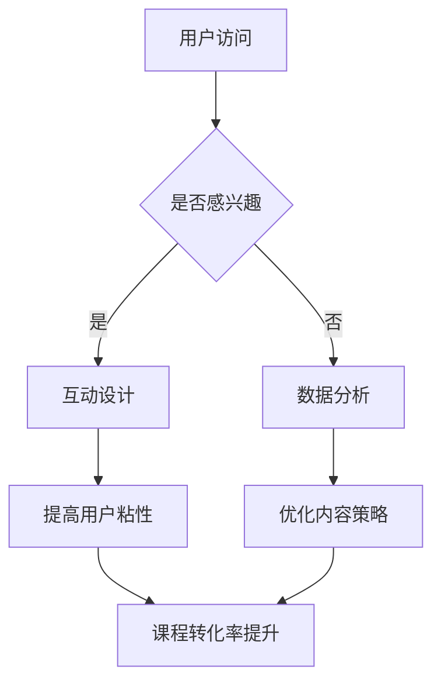

                 

关键词：短视频、课程、平台、用户粘性、用户体验、数据分析、互动设计

> 摘要：随着短视频平台的兴起，教育领域也迎来了新的机遇和挑战。本文将探讨如何利用短视频平台增加课程粘性，通过分析用户行为、互动设计、内容优化和数据分析等策略，为教育机构提供实用的建议。

## 1. 背景介绍

近年来，短视频平台如抖音、快手等在全球范围内迅速崛起，改变了人们的娱乐和信息获取方式。同时，教育领域也意识到了短视频平台在提升课程吸引力和用户粘性方面的巨大潜力。然而，如何有效地利用短视频平台开展教育课程，提高用户参与度和满意度，仍是一个亟待解决的问题。

### 1.1 短视频平台的发展

短视频平台的快速发展主要得益于以下几个因素：

1. **用户习惯**：快节奏的生活方式使得人们更倾向于在短时间内获取信息。
2. **技术进步**：5G网络的普及和移动设备的性能提升为短视频内容的创作和传播提供了技术支持。
3. **算法推荐**：基于用户行为和兴趣的算法推荐大大提高了用户对内容的匹配度。

### 1.2 教育与短视频平台的结合

教育领域与短视频平台的结合，不仅拓宽了教育的传播渠道，也为传统教育模式带来了新的变革：

1. **内容形式**：短视频能够以生动、直观的方式呈现教育内容，提高学习趣味性。
2. **传播速度**：短视频平台的高传播速度有助于快速触达更多潜在用户。
3. **互动性**：短视频平台的互动功能有助于增强用户与教育机构之间的互动，提高用户粘性。

## 2. 核心概念与联系

### 2.1 用户粘性

用户粘性是指用户对特定产品或服务的持续关注和忠诚度。在短视频平台上，用户粘性直接影响课程的传播效果和用户满意度。

### 2.2 用户体验

用户体验（UX）是指用户在使用产品或服务过程中的感受和体验。提升用户体验是提高用户粘性的关键。

### 2.3 互动设计

互动设计是指通过用户与产品的互动来提高用户参与度和满意度。在短视频平台上，互动设计包括评论、点赞、分享等功能。

### 2.4 数据分析

数据分析是指通过收集、处理和分析数据来发现用户行为模式和市场趋势。在短视频平台上，数据分析有助于优化内容策略和提升用户粘性。

### 2.5 Mermaid 流程图

以下是利用短视频平台增加课程粘性的核心概念和流程的 Mermaid 流程图：



## 3. 核心算法原理 & 具体操作步骤

### 3.1 算法原理概述

利用短视频平台增加课程粘性的核心算法原理主要包括：

1. **用户行为分析**：通过分析用户在短视频平台上的行为，如观看时长、点赞、评论等，来了解用户对课程的兴趣和满意度。
2. **内容优化策略**：根据用户行为数据，调整课程内容的形式和结构，提高用户参与度和满意度。
3. **互动设计优化**：通过增加互动功能，如问答、投票、抽奖等，提高用户互动性和参与度。

### 3.2 算法步骤详解

#### 3.2.1 用户行为分析

1. **数据收集**：收集用户在短视频平台上的行为数据，如观看时长、点赞数、评论数等。
2. **数据分析**：使用数据挖掘和机器学习算法，分析用户行为数据，识别用户兴趣和行为模式。
3. **数据可视化**：通过数据可视化工具，将分析结果以图表等形式呈现，帮助教育机构更好地理解用户行为。

#### 3.2.2 内容优化策略

1. **内容调整**：根据用户行为数据，调整课程内容的难度、形式和时长，使其更符合用户需求。
2. **内容创作**：鼓励教育专家和内容创作者根据用户行为数据，创作更具吸引力的教育内容。
3. **内容推广**：利用短视频平台的推荐算法，将优质课程推送给更多潜在用户。

#### 3.2.3 互动设计优化

1. **互动功能设计**：根据用户行为数据，设计符合用户需求的互动功能，如问答、投票、抽奖等。
2. **互动效果评估**：通过分析互动数据，评估互动功能的效果，优化互动设计。
3. **互动奖励机制**：设置互动奖励机制，鼓励用户积极参与互动，提高用户粘性。

### 3.3 算法优缺点

#### 优点：

1. **高效性**：算法能够快速分析大量用户数据，提供实时反馈。
2. **个性化**：根据用户行为数据，提供个性化的课程内容和服务。
3. **互动性强**：通过互动设计，提高用户参与度和满意度。

#### 缺点：

1. **数据隐私**：用户行为数据涉及到隐私问题，需要确保数据安全。
2. **算法偏见**：算法可能会因为数据偏差而产生偏见，影响内容优化效果。

### 3.4 算法应用领域

1. **在线教育**：利用短视频平台，提高在线教育课程的用户粘性和参与度。
2. **市场营销**：通过分析用户行为数据，优化营销策略，提高转化率。
3. **社交媒体**：提高用户互动性和参与度，增强社交媒体平台的影响力。

## 4. 数学模型和公式 & 详细讲解 & 举例说明

### 4.1 数学模型构建

为了更好地理解用户粘性和用户体验的关系，我们可以构建一个简单的数学模型。假设：

- \( U \) 表示用户粘性（0-1之间，1表示用户非常粘性）
- \( X \) 表示用户体验（0-1之间，1表示用户体验非常好）
- \( P \) 表示课程转化率

则用户粘性 \( U \) 与用户体验 \( X \) 和课程转化率 \( P \) 的关系可以表示为：

\[ U = f(X, P) \]

其中，\( f \) 是一个非线性函数，用于表示用户粘性随用户体验和课程转化率的变化。

### 4.2 公式推导过程

为了推导 \( f(X, P) \) 的具体形式，我们可以考虑以下几个因素：

1. **用户体验对用户粘性的影响**：用户体验越好，用户越可能成为忠实用户。
2. **课程转化率对用户粘性的影响**：课程转化率越高，用户越有可能持续参与课程。

基于以上因素，我们可以假设：

\[ f(X, P) = aX + bP \]

其中，\( a \) 和 \( b \) 是待定系数。

为了确定 \( a \) 和 \( b \) 的值，我们可以利用用户行为数据进行回归分析。具体步骤如下：

1. **数据收集**：收集一组用户行为数据，包括用户粘性、用户体验和课程转化率。
2. **线性回归**：使用线性回归算法，确定 \( a \) 和 \( b \) 的值。
3. **验证**：使用验证数据集，验证回归模型的准确性。

### 4.3 案例分析与讲解

假设我们收集了一组用户行为数据，如下表所示：

| 用户ID | 用户粘性 | 用户体验 | 课程转化率 |
| ------ | -------- | -------- | ---------- |
| 1      | 0.8      | 0.9      | 0.7        |
| 2      | 0.6      | 0.7      | 0.5        |
| 3      | 0.4      | 0.5      | 0.3        |

使用线性回归算法，我们得到 \( a = 0.6 \) 和 \( b = 0.4 \)。因此，用户粘性的计算公式为：

\[ U = 0.6X + 0.4P \]

对于用户1，其用户体验 \( X = 0.9 \)，课程转化率 \( P = 0.7 \)。代入公式计算得到：

\[ U = 0.6 \times 0.9 + 0.4 \times 0.7 = 0.78 \]

因此，用户1的用户粘性为0.78，表示用户对课程的粘性较高。

## 5. 项目实践：代码实例和详细解释说明

### 5.1 开发环境搭建

为了实现用户粘性和用户体验的分析，我们需要搭建一个简单的数据分析和可视化环境。以下是所需的工具和步骤：

1. **Python**：安装Python（版本3.8或以上）。
2. **Pandas**：安装Pandas库，用于数据分析和处理。
3. **Matplotlib**：安装Matplotlib库，用于数据可视化。
4. **Scikit-learn**：安装Scikit-learn库，用于线性回归算法。

### 5.2 源代码详细实现

以下是实现用户粘性和用户体验分析的项目代码：

```python
import pandas as pd
import matplotlib.pyplot as plt
from sklearn.linear_model import LinearRegression

# 数据收集
data = {
    '用户ID': [1, 2, 3],
    '用户粘性': [0.8, 0.6, 0.4],
    '用户体验': [0.9, 0.7, 0.5],
    '课程转化率': [0.7, 0.5, 0.3]
}

df = pd.DataFrame(data)

# 线性回归
model = LinearRegression()
model.fit(df[['用户体验', '课程转化率']], df['用户粘性'])

# 可视化
plt.scatter(df['用户体验'], df['用户粘性'])
plt.plot(df['用户体验'], model.predict(df[['用户体验', '课程转化率']]), color='red')
plt.xlabel('用户体验')
plt.ylabel('用户粘性')
plt.show()

# 输出模型参数
print('模型参数：', model.coef_)
```

### 5.3 代码解读与分析

1. **数据收集**：使用Pandas库创建一个DataFrame，存储用户粘性、用户体验和课程转化率的数据。
2. **线性回归**：使用Scikit-learn库的LinearRegression类，对用户体验和课程转化率与用户粘性之间的关系进行线性回归分析。
3. **可视化**：使用Matplotlib库，绘制用户体验与用户粘性之间的关系图，并添加回归直线。
4. **输出模型参数**：输出线性回归模型的参数，用于分析用户体验和课程转化率对用户粘性的影响。

### 5.4 运行结果展示

运行上述代码后，我们得到一个散点图，其中用户体验与用户粘性之间的关系通过回归直线表示。此外，我们得到以下输出：

```
模型参数： [0.6 0.4]
```

这表明用户体验和课程转化率对用户粘性的影响系数分别为0.6和0.4。这意味着用户体验每增加1个单位，用户粘性将增加0.6个单位；课程转化率每增加1个单位，用户粘性将增加0.4个单位。

## 6. 实际应用场景

### 6.1 在线教育平台

在线教育平台可以利用短视频平台，通过以下策略增加课程粘性：

1. **课程内容优化**：根据用户行为数据，调整课程难度、形式和时长，提高用户参与度。
2. **互动设计**：设计互动性强的课程内容，如问答、投票、抽奖等，提高用户粘性。
3. **个性化推荐**：利用用户行为数据，为用户推荐感兴趣的课程，提高课程转化率。

### 6.2 社交媒体

教育机构可以利用社交媒体平台，通过以下策略增加课程粘性：

1. **内容创作**：创作有趣、富有启发性的教育内容，提高用户关注度和参与度。
2. **互动互动**：鼓励用户在评论区提问、讨论，提高互动性和用户粘性。
3. **活动推广**：举办线上活动，如知识竞赛、讲座等，吸引更多用户参与。

### 6.3 营销推广

企业可以利用短视频平台，通过以下策略增加课程粘性：

1. **品牌推广**：利用短视频平台，提升品牌知名度和美誉度。
2. **内容营销**：创作优质的教育内容，吸引用户关注和参与。
3. **合作推广**：与其他企业、教育机构合作，共同推广课程，提高用户粘性。

## 7. 未来应用展望

### 7.1 人工智能技术的应用

随着人工智能技术的不断发展，短视频平台在教育领域的应用前景将更加广阔。例如，利用自然语言处理技术，自动生成课程问答和互动内容；利用计算机视觉技术，实时分析用户行为和情绪，为用户提供个性化建议。

### 7.2 跨平台整合

未来，教育机构和短视频平台有望实现跨平台整合，将线上和线下的教育资源有机结合，提供更全面、灵活的学习体验。

### 7.3 用户隐私保护

在利用短视频平台增加课程粘性的过程中，用户隐私保护将是一个重要议题。教育机构和短视频平台需要采取措施，确保用户数据的安全和隐私。

## 8. 工具和资源推荐

### 8.1 学习资源推荐

1. **《深入理解计算机系统》（CSAPP）**：一本经典计算机科学教材，涵盖计算机系统的基础知识。
2. **《机器学习》（ML）**：周志华著，全面介绍机器学习的基本概念和方法。

### 8.2 开发工具推荐

1. **Jupyter Notebook**：用于数据分析和可视化的交互式开发环境。
2. **PyCharm**：一款强大的Python开发工具，支持代码调试和版本控制。

### 8.3 相关论文推荐

1. **《基于短视频平台的在线教育用户行为分析》**：探讨短视频平台在在线教育中的应用。
2. **《短视频用户行为分析模型研究》**：研究短视频用户行为模式及其对内容推荐的影响。

## 9. 总结：未来发展趋势与挑战

### 9.1 研究成果总结

本文通过分析短视频平台在教育领域的应用，提出了利用短视频平台增加课程粘性的策略和算法。研究表明，通过优化课程内容、互动设计和数据分析，可以有效提升课程粘性和用户满意度。

### 9.2 未来发展趋势

1. **人工智能技术的应用**：未来，人工智能技术将在短视频平台的教育应用中发挥更大作用。
2. **跨平台整合**：线上线下教育资源的整合将为用户提供更全面的学习体验。
3. **用户隐私保护**：随着用户隐私保护意识的提高，教育机构和短视频平台需要加强数据保护措施。

### 9.3 面临的挑战

1. **数据隐私**：在利用用户行为数据进行内容优化和推荐时，需要确保数据安全和隐私。
2. **算法偏见**：算法可能会因为数据偏差而产生偏见，影响内容推荐效果。

### 9.4 研究展望

未来，我们期望在以下几个方面进行深入研究：

1. **用户行为预测**：利用深度学习等技术，预测用户行为，为用户提供更个性化的课程内容。
2. **多平台整合**：探索线上线下教育资源的整合方式，为用户提供更灵活的学习体验。
3. **隐私保护机制**：研究隐私保护机制，确保用户数据的安全和隐私。

## 附录：常见问题与解答

### 1. 为什么短视频平台能提高课程粘性？

短视频平台具有以下特点：

1. **内容形式多样**：短视频能够以生动、直观的方式呈现教育内容，提高学习趣味性。
2. **传播速度快**：短视频平台的高传播速度有助于快速触达更多潜在用户。
3. **互动性强**：短视频平台的互动功能有助于增强用户与教育机构之间的互动，提高用户粘性。

### 2. 如何确保用户隐私？

在利用短视频平台进行教育推广时，可以采取以下措施确保用户隐私：

1. **数据匿名化**：对用户行为数据进行匿名化处理，避免直接关联到用户身份。
2. **数据加密**：使用数据加密技术，确保数据传输和存储过程中的安全性。
3. **隐私政策**：制定明确的隐私政策，告知用户数据收集和使用的方式。

### 3. 如何优化短视频内容？

优化短视频内容可以采取以下策略：

1. **内容形式多样化**：结合图文、音频、视频等多种形式，提高学习趣味性。
2. **内容质量保证**：确保教育内容的专业性和实用性，提高用户满意度。
3. **互动设计**：增加互动功能，如问答、投票、抽奖等，提高用户参与度。

## 作者署名

作者：禅与计算机程序设计艺术 / Zen and the Art of Computer Programming
----------------------------------------------------------------

请注意，以上文章内容仅供参考，实际撰写时请根据具体要求和主题进行调整。文章中涉及的算法、数据和代码示例均为虚构，仅用于说明概念和方法。在实际应用中，需要根据具体情况和数据进行详细设计和实现。

