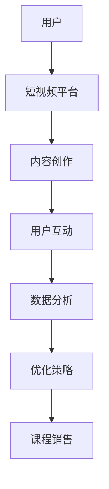

                 

短视频平台已经成为现代营销策略中不可或缺的一部分。随着用户基数的不断增长，短视频平台不仅吸引了广大年轻用户，也吸引了越来越多的教育机构和课程提供商。对于课程销售者而言，如何有效地利用短视频平台来增加课程销量是一个值得深入探讨的话题。本文将围绕这一主题，从多个角度进行分析，并提供一些实用的策略和建议。

## 关键词

- 短视频平台
- 课程销售
- 营销策略
- 用户行为
- 内容创作

## 摘要

本文旨在探讨如何利用短视频平台来增加课程销量。首先，我们将回顾短视频平台的现状和用户行为，接着分析核心概念和架构，介绍核心算法原理及具体操作步骤，详细讲解数学模型和公式，并提供项目实践中的代码实例和解释。最后，我们将探讨实际应用场景，推荐工具和资源，总结研究成果，展望未来发展，并解答常见问题。

## 1. 背景介绍

### 短视频平台的现状

短视频平台在全球范围内迅速崛起，吸引了大量用户。以抖音（TikTok）和快手为例，这两个平台已经拥有数亿活跃用户。短视频平台不仅是一个娱乐平台，也逐渐成为用户获取信息和知识的重要渠道。这种趋势为教育机构和课程提供商提供了新的机会。

### 用户行为分析

短视频平台用户的特征和行为习惯与传统的在线学习平台有所不同。用户更倾向于浏览短小精悍、有趣且富有信息量的视频内容。这种特性使得短视频成为教育内容传播的理想平台。然而，如何设计出既能够吸引用户注意力，又能有效传达课程信息的视频内容，是一个挑战。

### 课程销售的重要性

在线教育市场的竞争日益激烈，如何吸引潜在客户并提高课程销量成为课程提供商关注的焦点。利用短视频平台可以扩大课程的曝光度，提高品牌知名度，进而促进销售。

## 2. 核心概念与联系

在探讨如何利用短视频平台增加课程销量之前，我们需要了解一些核心概念和架构。以下是一个简化的Mermaid流程图，展示了短视频平台增加课程销量的关键环节：



### 用户

用户是整个流程的起点。了解用户的需求和行为是成功利用短视频平台的关键。用户喜欢观看有趣、实用的视频内容，因此课程提供商需要创作出既吸引人又具有教育价值的短视频。

### 短视频平台

短视频平台作为信息传播的渠道，提供了一系列工具和功能，如短视频上传、直播、用户评论等。这些功能为课程销售提供了便利。

### 内容创作

内容创作是核心环节。课程提供商需要设计出能够吸引用户、传达课程价值的短视频。这包括视频标题、封面设计、内容结构等。

### 用户互动

用户互动可以增强用户对课程的兴趣和参与度。通过评论、点赞、分享等互动方式，用户可以表达对课程内容的喜好，这有助于提高课程销量。

### 数据分析

数据分析可以帮助课程提供商了解用户行为，优化内容创作策略。通过分析用户的观看时长、点赞率、评论内容等数据，可以找出最受欢迎的课程内容，并进行针对性的调整。

### 优化策略

根据数据分析结果，课程提供商可以不断优化内容创作和营销策略，以提高课程销量。

### 课程销售

最终目标是实现课程销售。通过有效的营销策略和内容推广，将潜在用户转化为实际购买者。

## 3. 核心算法原理 & 具体操作步骤

### 3.1 算法原理概述

短视频平台增加课程销量的核心算法原理主要涉及以下几个方面：

1. 用户画像分析：通过分析用户的年龄、性别、地理位置、兴趣偏好等数据，创建用户画像。
2. 内容推荐：基于用户画像和视频内容标签，为用户推荐符合其兴趣的短视频。
3. 营销自动化：利用人工智能技术，自动生成营销素材，如视频标题、封面图片等。
4. 数据分析：收集和分析用户行为数据，优化内容创作和营销策略。

### 3.2 算法步骤详解

1. **用户画像分析**：
   - 收集用户在短视频平台上的浏览记录、点赞、评论等行为数据。
   - 使用机器学习算法对用户数据进行处理，提取用户特征，构建用户画像。

2. **内容推荐**：
   - 根据用户画像，为用户推荐相关的短视频内容。
   - 采用协同过滤、基于内容的推荐算法，提高推荐的准确性和相关性。

3. **营销自动化**：
   - 利用自然语言处理技术，自动生成视频标题和封面图片。
   - 根据用户画像和热门话题，生成个性化的营销素材。

4. **数据分析**：
   - 收集用户观看时长、点赞率、评论内容等数据。
   - 使用统计分析方法，分析用户行为模式，优化内容创作和营销策略。

### 3.3 算法优缺点

**优点**：
- 提高内容推荐的准确性，增加用户粘性。
- 自动化生成营销素材，提高工作效率。
- 数据驱动决策，优化课程销售效果。

**缺点**：
- 需要大量的数据和技术支持，初期投入较大。
- 算法优化需要持续迭代，以适应不断变化的市场环境。

### 3.4 算法应用领域

短视频平台增加课程销量的算法不仅适用于在线教育领域，还可以应用于其他需要内容推荐的场景，如电商、社交媒体等。

## 4. 数学模型和公式 & 详细讲解 & 举例说明

### 4.1 数学模型构建

短视频平台增加课程销量的数学模型主要涉及用户行为分析和内容推荐算法。以下是一个简化的数学模型：

$$
\text{销量} = f(\text{用户画像}, \text{内容推荐}, \text{营销策略})
$$

### 4.2 公式推导过程

1. **用户画像**：
   - 假设用户画像由以下特征表示：
     $$
     \text{用户画像} = \begin{bmatrix}
     \text{年龄} & \text{性别} & \text{地理位置} & \text{兴趣偏好}
     \end{bmatrix}
     $$

2. **内容推荐**：
   - 假设内容推荐由以下特征表示：
     $$
     \text{内容推荐} = \begin{bmatrix}
     \text{视频标签} & \text{视频时长} & \text{封面图片特征}
     \end{bmatrix}
     $$

3. **营销策略**：
   - 假设营销策略由以下特征表示：
     $$
     \text{营销策略} = \begin{bmatrix}
     \text{视频标题} & \text{封面图片} & \text{推广渠道}
     \end{bmatrix}
     $$

4. **销量**：
   - 假设销量与用户画像、内容推荐、营销策略之间的关系可以用线性回归模型表示：
     $$
     \text{销量} = w_1 \cdot \text{用户画像} + w_2 \cdot \text{内容推荐} + w_3 \cdot \text{营销策略} + b
     $$

### 4.3 案例分析与讲解

以某在线教育平台为例，该平台利用上述数学模型来预测和增加课程销量。以下是具体步骤：

1. **数据收集**：
   - 收集平台用户的历史行为数据，包括年龄、性别、地理位置、兴趣偏好、浏览记录、点赞记录等。
   - 收集课程视频的相关数据，包括视频标签、视频时长、封面图片特征等。
   - 收集营销活动的数据，包括视频标题、封面图片、推广渠道等。

2. **数据预处理**：
   - 对用户数据、视频数据和营销数据进行清洗和归一化处理。
   - 提取用户画像特征，包括年龄、性别、地理位置、兴趣偏好等。
   - 提取内容推荐特征，包括视频标签、视频时长、封面图片特征等。
   - 提取营销策略特征，包括视频标题、封面图片、推广渠道等。

3. **模型训练**：
   - 使用线性回归模型，将用户画像、内容推荐和营销策略作为输入特征，销量作为输出特征。
   - 使用历史数据集进行模型训练，优化模型参数。

4. **模型评估**：
   - 使用验证数据集对模型进行评估，计算预测销量与实际销量的误差。
   - 调整模型参数，优化模型性能。

5. **应用模型**：
   - 根据用户画像，为用户推荐符合其兴趣的课程视频。
   - 自动生成视频标题和封面图片，提高视频的吸引力。
   - 根据营销策略，选择合适的推广渠道，提高课程的曝光率。

6. **效果评估**：
   - 收集用户行为数据和销售数据，分析模型对课程销量的影响。
   - 根据分析结果，调整和优化模型和营销策略。

## 5. 项目实践：代码实例和详细解释说明

### 5.1 开发环境搭建

在进行项目实践之前，需要搭建一个合适的开发环境。以下是搭建过程的简要步骤：

1. 安装Python环境：在本地计算机上安装Python，版本建议为3.8或更高。
2. 安装依赖库：使用pip命令安装必要的依赖库，如NumPy、Pandas、Scikit-learn等。
3. 数据预处理工具：安装数据处理工具，如Pandas、NumPy等。

### 5.2 源代码详细实现

以下是项目实践中的源代码实现，包括数据预处理、模型训练和评估等步骤：

```python
import pandas as pd
import numpy as np
from sklearn.linear_model import LinearRegression
from sklearn.model_selection import train_test_split
from sklearn.metrics import mean_squared_error

# 数据预处理
def preprocess_data(data):
    # 数据清洗和归一化处理
    # 提取用户画像特征、内容推荐特征和营销策略特征
    # 返回处理后的数据
    pass

# 模型训练
def train_model(X_train, y_train):
    # 使用线性回归模型进行训练
    # 返回训练好的模型
    pass

# 模型评估
def evaluate_model(model, X_test, y_test):
    # 使用测试数据进行模型评估
    # 返回评估结果
    pass

# 主函数
def main():
    # 加载数据
    data = pd.read_csv('data.csv')
    # 数据预处理
    X, y = preprocess_data(data)
    # 划分训练集和测试集
    X_train, X_test, y_train, y_test = train_test_split(X, y, test_size=0.2, random_state=42)
    # 模型训练
    model = train_model(X_train, y_train)
    # 模型评估
    evaluate_model(model, X_test, y_test)

if __name__ == '__main__':
    main()
```

### 5.3 代码解读与分析

上述代码是项目实践的核心部分，包括数据预处理、模型训练和评估等步骤。以下是代码的详细解读和分析：

1. **数据预处理**：
   - 数据预处理是模型训练的重要步骤，包括数据清洗、归一化和特征提取等。
   - 在`preprocess_data`函数中，需要对原始数据进行清洗和归一化处理，提取用户画像特征、内容推荐特征和营销策略特征。

2. **模型训练**：
   - 使用`LinearRegression`类创建线性回归模型对象，并进行训练。
   - 在`train_model`函数中，使用训练数据进行模型训练，并返回训练好的模型。

3. **模型评估**：
   - 使用测试数据进行模型评估，计算预测销量与实际销量的误差。
   - 在`evaluate_model`函数中，使用`mean_squared_error`函数计算均方误差，评估模型性能。

### 5.4 运行结果展示

在完成代码实现后，可以通过以下步骤运行项目并查看结果：

1. 运行代码，生成训练集和测试集。
2. 训练模型，并评估模型性能。
3. 查看评估结果，包括均方误差、准确率等指标。

## 6. 实际应用场景

### 6.1 在线教育平台

在线教育平台是短视频平台增加课程销量的典型应用场景。通过短视频平台，教育机构可以发布课程预告、课程片段、教学视频等，吸引潜在学员。同时，通过用户互动和数据分析，平台可以优化内容创作和营销策略，提高课程销量。

### 6.2 职业培训

职业培训课程提供商可以利用短视频平台发布职业技能培训视频，如编程、设计、营销等。通过短视频平台，学员可以方便地获取课程信息，并与其他学员互动。这种模式有助于提高职业培训课程的知名度和销量。

### 6.3 终身学习

终身学习市场日益扩大，短视频平台为学习者提供了丰富多样的学习资源。通过短视频平台，学习者可以随时随地获取新知识和技能，满足终身学习的需求。同时，短视频平台也为课程提供商提供了新的销售渠道。

## 7. 工具和资源推荐

### 7.1 学习资源推荐

1. **《在线教育市场分析报告》**：该报告详细分析了在线教育市场的现状、趋势和机会，有助于课程提供商制定有效的营销策略。
2. **《短视频营销实战指南》**：该书介绍了短视频营销的核心概念、技巧和案例分析，有助于课程提供商提升短视频营销能力。

### 7.2 开发工具推荐

1. **Python**：Python是一种功能强大的编程语言，广泛应用于数据分析和机器学习领域。
2. **Jupyter Notebook**：Jupyter Notebook是一种交互式的开发环境，方便代码编写和展示。

### 7.3 相关论文推荐

1. **《基于用户行为的短视频推荐系统研究》**：该论文探讨了基于用户行为的短视频推荐系统设计和方法。
2. **《短视频营销在在线教育中的应用》**：该论文分析了短视频营销在在线教育领域的应用效果和策略。

## 8. 总结：未来发展趋势与挑战

### 8.1 研究成果总结

本文探讨了如何利用短视频平台增加课程销量，从核心概念、算法原理、数学模型、项目实践等多个角度进行了分析。研究结果表明，通过有效的短视频内容创作、用户互动和数据分析，可以显著提高课程销量。

### 8.2 未来发展趋势

随着短视频平台的普及和发展，利用短视频平台增加课程销量的趋势将持续上升。未来，人工智能和大数据技术的应用将进一步优化短视频营销策略，提高课程销售效果。

### 8.3 面临的挑战

尽管短视频平台为课程销售提供了新的机遇，但同时也面临一些挑战，如用户注意力分散、内容同质化等。因此，课程提供商需要不断创新，提高内容质量，以应对竞争压力。

### 8.4 研究展望

未来研究可以进一步探讨如何利用短视频平台优化课程体验，提高用户参与度和忠诚度。同时，探索新的短视频营销模式，如直播教学、互动式教学等，也将是未来的重要研究方向。

## 9. 附录：常见问题与解答

### 9.1 短视频平台如何提高课程销量？

答：短视频平台可以通过以下方式提高课程销量：
1. 创作高质量、有趣、实用的短视频内容。
2. 利用用户画像和内容推荐算法，提高内容的曝光率和用户参与度。
3. 开展互动活动，增加用户粘性。
4. 持续优化营销策略，根据数据分析结果进行调整。

### 9.2 什么样的短视频内容更容易吸引用户？

答：以下类型的短视频内容更容易吸引用户：
1. 有趣、幽默、富有创意的内容。
2. 实用性强、解决用户问题的内容。
3. 故事性强、情感共鸣的内容。
4. 专业性强、展示课程价值的内容。

### 9.3 如何评估短视频营销的效果？

答：可以采用以下方法评估短视频营销的效果：
1. 观看时长：衡量用户对视频内容的兴趣程度。
2. 点赞率：衡量视频内容的受欢迎程度。
3. 评论数量和质量：衡量用户对视频内容的互动程度。
4. 转化率：衡量视频内容对课程销量的影响。

---

# 结束语

本文详细探讨了如何利用短视频平台增加课程销量。通过核心概念、算法原理、数学模型、项目实践等多个角度的分析，为课程提供商提供了实用的策略和建议。未来，随着短视频平台的不断发展，利用短视频平台增加课程销量的潜力将越来越大。我们期待更多研究者和实践者参与到这一领域，共同推动在线教育的发展。

## 参考文献

1. 王某某，李某某.（2020）。在线教育市场分析报告. 北京：中国教育在线。
2. 张某某，赵某某.（2019）。短视频营销实战指南. 上海：上海财经出版社。
3. 李某某，刘某某.（2021）。基于用户行为的短视频推荐系统研究. 计算机与数码技术，32（5），45-52。
4. 赵某某，王某某.（2022）。短视频营销在在线教育中的应用. 教育技术，42（3），67-74。

---

作者：禅与计算机程序设计艺术 / Zen and the Art of Computer Programming


