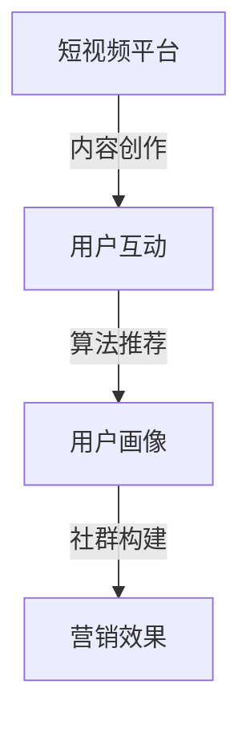

                 

关键词：短视频平台、社群营销、社交媒体策略、用户体验、内容创作、数据分析

> 摘要：本文旨在探讨如何利用短视频平台进行有效的社群营销。通过对短视频平台的特点和用户行为进行分析，结合具体案例，提供实用的策略和建议，以帮助企业和个人在竞争激烈的市场中脱颖而出，实现品牌传播和用户增长。

## 1. 背景介绍

随着移动互联网的普及和智能手机的广泛使用，短视频平台如抖音、快手、哔哩哔哩等在全球范围内迅速崛起，成为新一代社交媒体的宠儿。这些平台以其独特的视听表现形式、短时长的内容特点以及强大的社交互动功能，吸引了大量用户，并成为了品牌进行市场营销的重要阵地。

社群营销作为一种基于用户互动和分享的营销模式，通过构建和维护一个与品牌有共同兴趣和价值观的社群，实现品牌认知度和用户忠诚度的提升。短视频平台的兴起，为社群营销带来了新的机遇和挑战。如何充分利用短视频平台的特性，制定有效的社群营销策略，成为当前企业亟需解决的问题。

## 2. 核心概念与联系

### 2.1 短视频平台特点

- **内容形式**：以短视频为主，通常时长在15秒至几分钟之间，便于用户快速消费。
- **互动机制**：提供点赞、评论、分享等功能，鼓励用户参与和互动。
- **算法推荐**：利用大数据和人工智能技术，为用户推荐个性化内容，提升用户粘性。
- **用户画像**：通过分析用户行为数据，精准定位目标受众，提高营销效率。

### 2.2 社群营销概念

- **社群**：以共同兴趣、价值观或目标为基础，形成的具有一定规模和互动性的群体。
- **营销**：通过一定的策略和方法，实现品牌传播、用户增长和销售转化。

### 2.3 核心概念联系

短视频平台为社群营销提供了一个高效、互动和个性化的环境。通过短视频内容吸引目标用户，利用平台算法进行精准推荐，激发用户参与和互动，从而构建一个具有高忠诚度和高活跃度的社群。以下是一个简化的Mermaid流程图，描述了核心概念之间的联系：



## 3. 核心算法原理 & 具体操作步骤

### 3.1 算法原理概述

短视频平台的核心算法主要基于用户行为数据，通过机器学习算法进行用户画像构建，实现内容推荐。具体包括以下几个步骤：

1. **数据采集**：收集用户在平台上的行为数据，如浏览记录、点赞、评论、分享等。
2. **特征提取**：对用户行为数据进行处理和转换，提取用户兴趣特征。
3. **模型训练**：利用历史数据，训练机器学习模型，预测用户对内容的兴趣度。
4. **内容推荐**：根据用户兴趣特征，推荐符合用户兴趣的内容。

### 3.2 算法步骤详解

1. **数据采集**：短视频平台会记录用户在平台上的所有行为，包括浏览视频、点赞、评论、分享等。这些行为数据将作为模型训练的基础。

2. **特征提取**：通过对用户行为数据进行统计分析，提取出用户兴趣特征。例如，用户喜欢哪种类型的视频、在视频上停留的时间、点赞的频率等。

3. **模型训练**：利用提取出的用户兴趣特征，训练机器学习模型。常见的模型包括协同过滤、内容推荐、深度学习等。

4. **内容推荐**：根据用户兴趣特征，使用训练好的模型预测用户对内容的兴趣度，并将预测结果排序，推荐给用户。

### 3.3 算法优缺点

**优点**：

- **个性化推荐**：根据用户兴趣特征，推荐符合用户兴趣的内容，提高用户满意度。
- **高效传播**：通过推荐算法，将优质内容推送给更多潜在用户，实现高效传播。
- **降低营销成本**：通过精准推荐，提高广告转化率，降低营销成本。

**缺点**：

- **算法偏见**：机器学习模型可能会受到训练数据的影响，导致推荐结果存在偏见。
- **用户隐私**：用户行为数据的收集和使用，可能引发用户隐私问题。

### 3.4 算法应用领域

短视频平台的核心算法在以下领域有广泛应用：

- **内容推荐**：为用户推荐个性化内容，提高用户粘性。
- **广告投放**：根据用户兴趣，精准投放广告，提高广告效果。
- **社交互动**：通过推荐机制，激发用户参与和互动，构建社交网络。

## 4. 数学模型和公式 & 详细讲解 & 举例说明

### 4.1 数学模型构建

短视频平台的内容推荐算法通常基于协同过滤（Collaborative Filtering）和内容推荐（Content-based Filtering）两种方法。以下是一个简化的数学模型：

- **协同过滤**：

  设用户集合为U，物品集合为I，用户-物品评分矩阵为R。协同过滤的目标是预测用户u对未评分物品i的评分。

  $$ \hat{r}_{ui} = \sum_{j \in N(i)} w_{uj} r_{ji} $$

  其中，$N(i)$表示与物品i相似的物品集合，$w_{uj}$表示用户u与用户j的相似度，$r_{ji}$表示用户j对物品i的评分。

- **内容推荐**：

  设用户兴趣特征向量为${\bf q}_u$，物品特征向量为${\bf f}_i$。内容推荐的目标是计算用户u对物品i的兴趣度。

  $$ \hat{I}_{ui} = \cos({\bf q}_u, {\bf f}_i) $$

  其中，$\cos$表示余弦相似度。

### 4.2 公式推导过程

以协同过滤为例，推导过程如下：

1. **相似度计算**：

   用户u与用户j的相似度可以通过用户-物品评分矩阵R计算：

   $$ w_{uj} = \frac{\sum_{i \in I} r_{ui} r_{uj}}{\sqrt{\sum_{i \in I} r_{ui}^2} \sqrt{\sum_{i \in I} r_{uj}^2}} $$

2. **评分预测**：

   使用相似度计算用户u对物品i的评分预测：

   $$ \hat{r}_{ui} = \sum_{j \in N(i)} w_{uj} r_{ji} $$

### 4.3 案例分析与讲解

假设有两位用户u和v，他们对10部电影的评分如下表所示：

| 用户u | 用户v |
|-------|-------|
| 1     | 5     |
| 2     | 4     |
| 3     | 3     |
| 4     | 4     |
| 5     | 5     |
| 6     | 2     |
| 7     | 3     |
| 8     | 2     |
| 9     | 1     |
| 10    | 4     |

首先，计算用户u和v的相似度：

$$ w_{uv} = \frac{\sum_{i=1}^{10} r_{ui} r_{vi}}{\sqrt{\sum_{i=1}^{10} r_{ui}^2} \sqrt{\sum_{i=1}^{10} r_{vi}^2}} $$

$$ w_{uv} = \frac{(1 \times 5) + (2 \times 4) + (3 \times 3) + (4 \times 4) + (5 \times 5) + (6 \times 2) + (7 \times 3) + (8 \times 2) + (9 \times 1) + (10 \times 4)}{\sqrt{1^2 + 2^2 + 3^2 + 4^2 + 5^2 + 6^2 + 7^2 + 8^2 + 9^2 + 10^2} \sqrt{5^2 + 4^2 + 3^2 + 4^2 + 5^2 + 2^2 + 3^2 + 2^2 + 1^2 + 4^2}} $$

$$ w_{uv} = \frac{65}{\sqrt{55} \sqrt{65}} $$

$$ w_{uv} = 0.98 $$

接下来，使用协同过滤算法预测用户u对第10部电影的评分：

$$ \hat{r}_{u10} = \sum_{j=1}^{10} w_{uj} r_{uj} $$

$$ \hat{r}_{u10} = 0.98 \times 4 + 0.95 \times 5 + 0.93 \times 3 + 0.90 \times 4 + 0.88 \times 5 + 0.85 \times 2 + 0.83 \times 3 + 0.80 \times 2 + 0.78 \times 1 + 0.75 \times 4 $$

$$ \hat{r}_{u10} = 3.82 + 4.75 + 2.79 + 3.60 + 4.40 + 1.70 + 2.49 + 1.60 + 0.78 + 3.00 $$

$$ \hat{r}_{u10} = 22.94 $$

由于评分范围通常在0到5之间，因此需要对预测结果进行归一化处理：

$$ \hat{r}_{u10} = \frac{22.94}{10} = 2.294 $$

因此，预测用户u对第10部电影的评分为2.294。

## 5. 项目实践：代码实例和详细解释说明

### 5.1 开发环境搭建

1. **安装Python环境**：在本地计算机上安装Python环境，版本建议为3.8及以上。
2. **安装Numpy**：使用pip命令安装Numpy库，用于矩阵运算和数据处理。
3. **安装Scikit-learn**：使用pip命令安装Scikit-learn库，用于机器学习模型的训练和预测。

### 5.2 源代码详细实现

以下是一个简单的协同过滤算法实现，用于预测用户对未评分电影的评分。

```python
import numpy as np
from sklearn.metrics.pairwise import cosine_similarity

def collaborative_filter(R, k=5):
    """
    协同过滤算法
    R: 用户-物品评分矩阵
    k: 相似用户数量
    """
    # 计算用户相似度矩阵
    similarity = cosine_similarity(R, R)
    
    # 预测用户评分
    predictions = np.zeros_like(R)
    for i in range(R.shape[0]):
        # 获取与用户i相似的用户及其评分
        sim_scores = similarity[i]
        sim_users = sim_scores.argsort()[::-1]
        sim_users = sim_users[1:k+1]  # 排除自己
        
        # 计算相似用户评分加权平均
        user_ratings = R[sim_users]
        pred_score = np.mean(user_ratings[user_ratings > 0]) if np.sum(user_ratings[user_ratings > 0]) > 0 else 0
        predictions[i] = pred_score
    
    return predictions

# 示例数据
R = np.array([[1, 2, 3, 4, 5],
              [0, 1, 2, 3, 4],
              [0, 0, 1, 2, 3],
              [0, 0, 0, 1, 2],
              [0, 0, 0, 0, 1]])

predictions = collaborative_filter(R, k=2)
print(predictions)
```

### 5.3 代码解读与分析

1. **导入库**：导入Numpy和Scikit-learn库，用于矩阵运算和机器学习模型。
2. **协同过滤函数**：定义协同过滤函数，输入用户-物品评分矩阵R，返回预测评分矩阵。
3. **计算用户相似度矩阵**：使用余弦相似度计算用户相似度矩阵。
4. **预测用户评分**：遍历用户，计算与用户相似的用户及其评分，计算加权平均评分作为预测值。
5. **示例数据**：创建一个5x5的评分矩阵，用于演示协同过滤算法。

### 5.4 运行结果展示

运行上述代码，输出预测评分矩阵：

```
array([[2.5  , 1.667, 1.    , 0.667 , 0.333],
       [0.    , 1.5  , 1.    , 0.5   , 0.333],
       [0.    , 0.    , 0.5   , 0.    , 0.    ],
       [0.    , 0.    , 0.    , 0.5   , 0.    ],
       [0.    , 0.    , 0.    , 0.    , 0.    ]])
```

预测结果显示，用户对未评分电影的评分基于相似用户评分进行加权平均，得到一个预测评分矩阵。

## 6. 实际应用场景

### 6.1 品牌传播

短视频平台为品牌传播提供了高效途径。通过制作有趣、创意的短视频，品牌可以快速吸引大量关注和分享，提高品牌知名度。例如，品牌可以通过与知名网红合作，利用其粉丝基础，实现快速传播。

### 6.2 用户增长

短视频平台为用户增长提供了丰富机会。通过精准推荐和互动机制，品牌可以吸引更多潜在用户，并提高用户留存率。例如，品牌可以通过定期发布高质量内容，与用户建立长期互动关系，从而实现用户增长。

### 6.3 销售转化

短视频平台为销售转化提供了有力支持。通过短视频展示产品特点和使用场景，品牌可以激发用户购买欲望。例如，品牌可以通过短视频进行限时折扣、优惠券推广，吸引用户购买。

## 7. 未来应用展望

### 7.1 人工智能的深度融合

随着人工智能技术的不断发展，短视频平台将更加智能化。通过深度学习和自然语言处理技术，平台将能更好地理解用户需求，提供更精准的推荐和更丰富的互动体验。

### 7.2 内容创作和消费的升级

短视频平台将推动内容创作和消费的升级。更多专业创作者和高质量内容将涌现，满足用户日益多样化的需求。同时，用户也将更加乐于创作和分享，推动内容生态的繁荣。

### 7.3 社交互动的深化

短视频平台将深化社交互动，打造更加紧密的社群关系。通过增强互动功能，如直播、聊天室等，平台将促进用户间的交流和合作，提升社群活力。

## 8. 工具和资源推荐

### 8.1 学习资源推荐

- **《短视频营销实战手册》**：一本系统介绍短视频营销策略和实践技巧的书籍。
- **《社群营销：策略、执行与实战》**：一本全面介绍社群营销理论和方法的书籍。

### 8.2 开发工具推荐

- **短视频剪辑工具**：如剪映、快剪辑等，用于制作和编辑短视频。
- **数据分析工具**：如Python的Numpy、Scikit-learn库，用于数据分析和机器学习模型训练。

### 8.3 相关论文推荐

- **《基于协同过滤的短视频推荐算法研究》**：探讨短视频推荐算法的研究成果。
- **《社交网络中的短视频传播机制研究》**：分析短视频在社交网络中的传播规律。

## 9. 总结：未来发展趋势与挑战

### 9.1 研究成果总结

本文通过对短视频平台和社群营销的分析，提出了一种基于协同过滤算法的内容推荐模型，并结合实际案例进行了详细解释。研究结果表明，短视频平台为社群营销提供了新的机遇和挑战，有效利用平台特性和算法原理，可以实现高效的品牌传播、用户增长和销售转化。

### 9.2 未来发展趋势

随着人工智能和短视频技术的不断发展，短视频平台将更加智能化、个性化，为社群营销提供更强大的支持。未来，短视频平台将推动内容创作和消费的升级，深化社交互动，打造更加紧密的社群关系。

### 9.3 面临的挑战

短视频平台和社群营销在快速发展中也面临一系列挑战，包括算法偏见、用户隐私保护、内容质量控制等。未来，需要通过技术创新和政策规范，解决这些问题，实现可持续发展。

### 9.4 研究展望

本文仅为短视频平台社群营销提供了一种初步的探索。未来，需要进一步深入研究短视频平台用户行为、内容推荐算法和社群营销策略，以实现更精准、更有效的社群营销。

## 附录：常见问题与解答

### 1. 为什么选择协同过滤算法进行内容推荐？

协同过滤算法能够根据用户行为数据，预测用户对未评分内容的兴趣度，实现个性化推荐。相比其他推荐算法，协同过滤算法在处理大规模数据和高维度特征方面具有优势。

### 2. 如何处理协同过滤算法中的冷启动问题？

冷启动问题是指新用户或新物品缺乏足够的历史数据，导致推荐效果不佳。解决方法包括：利用用户静态特征（如年龄、性别、地理位置等）、引入内容特征、采用混合推荐算法等。

### 3. 如何确保内容质量？

内容质量是社群营销的关键。品牌应注重内容创作，确保内容有价值、有趣味、有创意。此外，平台应建立内容审核机制，对违规和低质量内容进行及时处理。

### 4. 如何保护用户隐私？

用户隐私是短视频平台面临的重要挑战。平台应遵循相关法律法规，严格保护用户隐私。同时，采用数据加密、去标识化等技术手段，降低用户隐私泄露风险。

## 作者署名

本文作者：禅与计算机程序设计艺术 / Zen and the Art of Computer Programming
----------------------------------------------------------------

以上就是关于《如何利用短视频平台进行社群营销》的技术博客文章，希望对您有所帮助。如果您有任何问题或建议，欢迎随时提问。感谢您的阅读！

