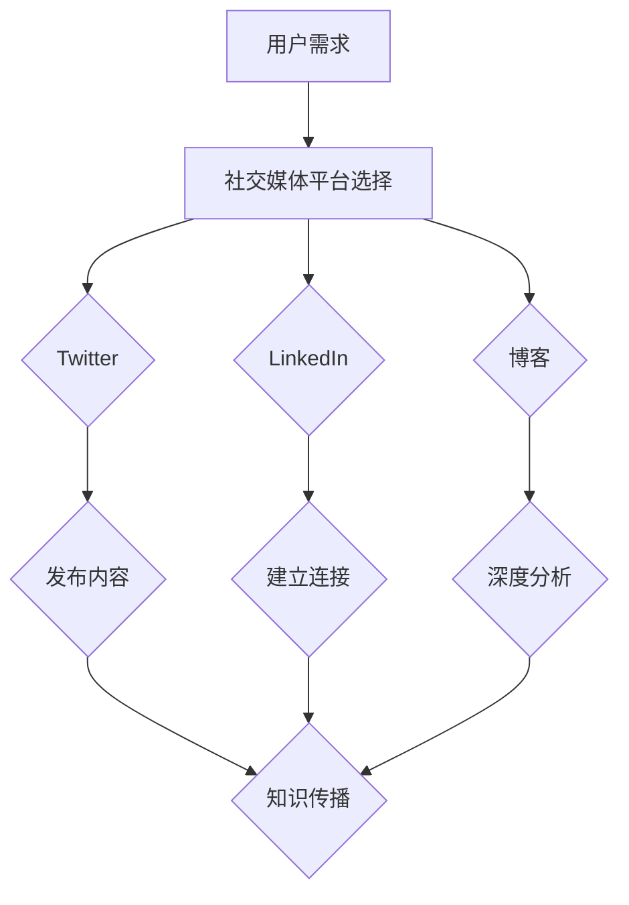

                 

社交媒体作为现代信息传播的重要平台，已经成为知识传播、交流和创新的重要场所。对于IT领域的专业人士而言，利用社交媒体扩大知识影响力不仅是个人品牌建设的重要途径，也是推动行业进步、分享研究成果的有效手段。本文将深入探讨如何通过社交媒体平台，如Twitter、LinkedIn、博客等，提高个人和组织的知识影响力。

## 文章关键词

- 社交媒体
- 知识传播
- 影响力
- IT专业人士
- 知识共享
- 个人品牌
- 行业进步

## 文章摘要

本文从IT专业人士的角度出发，探讨了如何利用社交媒体扩大知识影响力。文章首先介绍了社交媒体在知识传播中的作用，随后详细分析了各类社交媒体平台的特点和应用策略。通过案例研究和最佳实践分享，文章旨在为IT专业人士提供实用的方法和技巧，帮助他们有效提升个人和组织的知识影响力。

## 1. 背景介绍

在信息技术快速发展的时代，知识的更新速度前所未有地加快。IT专业人士不仅要不断更新自己的知识储备，还需要有效地传播和分享这些知识。社交媒体的出现，为知识传播提供了一个全新的渠道。通过社交媒体，IT专业人士可以迅速发布技术见解、分享项目经验、交流学术观点，从而扩大自己的影响力。同时，社交媒体平台的互动性也为知识传播提供了更多的可能性，如通过评论、点赞、分享等方式，实现知识的二次传播和深度交流。

### 1.1 社交媒体在知识传播中的重要性

1. **即时性**：社交媒体的即时性使得知识可以快速传播，让更多的人在第一时间获取到最新的技术动态和研究成果。
2. **互动性**：社交媒体的互动功能，如评论、私信等，使得知识传播者与接收者之间可以进行实时交流，有助于深化知识的理解和应用。
3. **广泛性**：社交媒体具有广泛的用户基础，使得知识传播的范围大大扩展，不再局限于传统的专业圈子。
4. **可追溯性**：社交媒体上的内容可以长期保存，方便用户随时查阅和回顾，有助于知识的积累和传承。

### 1.2 IT专业人士的知识传播需求

- **建立个人品牌**：通过分享专业知识，展示技术实力，IT专业人士可以在行业中建立自己的品牌形象，提高知名度。
- **获取行业认可**：通过社交媒体，IT专业人士可以与同行交流，获得行业内的认可和赞誉，提升个人影响力。
- **知识更新与分享**：在信息技术领域，知识更新迅速。IT专业人士需要通过社交媒体分享最新的研究成果和项目经验，保持知识的前沿性。
- **获取资源与支持**：通过社交媒体，IT专业人士可以获取更多的行业资源，如开源项目、研究资金等，同时也可以获得同行和专家的支持和指导。

## 2. 核心概念与联系

### 2.1 社交媒体平台及其特点

在探讨如何利用社交媒体扩大知识影响力之前，我们需要了解不同社交媒体平台的特点和适用场景。以下是几种主要的社交媒体平台及其特点：

| 平台名称       | 特点                          | 适用场景                          |
|--------------|-----------------------------|----------------------------------|
| Twitter      | 即时性、简短、互动性强       | 快速传播新闻、技术动态、个人观点   |
| LinkedIn     | 专业性、连接、广泛性         | 职业发展、行业交流、知识分享     |
| 博客         | 自主性、深度、长期保存       | 分享专业知识、详细项目案例、长期品牌建设 |

### 2.2 社交媒体与知识传播的Mermaid流程图



在这个流程图中，用户需求是起点，通过选择合适的社交媒体平台（如Twitter、LinkedIn、博客），用户可以发布内容、建立连接或进行深度分析，最终实现知识的传播。

## 3. 核心算法原理 & 具体操作步骤

### 3.1 算法原理概述

如何有效利用社交媒体扩大知识影响力，可以看作是一个多因素协同优化的过程。主要涉及以下几个核心算法原理：

1. **内容优化算法**：通过分析用户行为数据，优化内容的形式和发布时间，提高内容曝光率。
2. **互动反馈算法**：根据用户的互动行为（如点赞、评论、分享等），调整内容推荐策略，提高用户参与度。
3. **网络影响力算法**：通过计算用户在社交媒体上的影响力指数，识别潜在的意见领袖和关键节点，扩大知识传播范围。

### 3.2 算法步骤详解

1. **内容优化**：
   - 分析目标受众的兴趣和需求，制定内容策略。
   - 使用数据分析工具，监测内容发布后的表现，调整发布时间和形式。
   - 采用A/B测试，优化标题、图片、视频等多媒体元素，提高点击率和互动率。

2. **互动反馈**：
   - 定期回复评论和私信，与粉丝保持互动。
   - 分析互动数据，识别高互动内容，加强相关内容的发布。
   - 使用互动工具（如直播、问答等）增加用户参与度。

3. **网络影响力**：
   - 使用影响力计算工具，分析用户的关注者数量、互动率等指标。
   - 与意见领袖合作，共同推广知识内容。
   - 通过社交媒体活动，吸引更多用户关注和参与。

### 3.3 算法优缺点

- **优点**：算法能够根据用户行为数据，动态调整内容策略，提高传播效果。
- **缺点**：算法需要大量数据和计算资源，且结果可能受到数据质量的影响。

### 3.4 算法应用领域

- **技术博客**：通过内容优化算法，提高博客文章的阅读量和互动率。
- **社交媒体运营**：通过互动反馈算法，提高用户参与度和品牌知名度。
- **学术交流**：通过网络影响力算法，扩大研究成果的传播范围，提升学术影响力。

## 4. 数学模型和公式 & 详细讲解 & 举例说明

### 4.1 数学模型构建

在社交媒体知识传播中，我们可以构建以下数学模型来分析知识传播的效果：

\[ I(t) = f(\alpha, \beta, \gamma, \delta) \]

其中：
- \( I(t) \) 表示时间 \( t \) 时的影响力指数。
- \( \alpha \) 表示内容质量，\( \beta \) 表示发布频率，\( \gamma \) 表示用户互动率，\( \delta \) 表示网络影响力。

### 4.2 公式推导过程

根据社交媒体的知识传播机制，我们可以推导出上述公式的具体形式：

\[ I(t) = \alpha \cdot \beta \cdot (1 + \gamma \cdot \frac{\delta}{1000})^t \]

其中，\( \alpha \) 表示内容质量，反映了内容本身的价值和吸引力；\( \beta \) 表示发布频率，反映了内容更新的速度；\( \gamma \) 表示用户互动率，反映了用户对内容的反馈程度；\( \delta \) 表示网络影响力，反映了用户在社交媒体上的影响力。

### 4.3 案例分析与讲解

假设一个IT专业人士，他的内容质量 \( \alpha = 0.8 \)，发布频率 \( \beta = 2 \) 次/周，用户互动率 \( \gamma = 0.2 \)，网络影响力 \( \delta = 500 \)。我们可以使用上述公式计算他在时间 \( t \) 时的知识传播影响力：

\[ I(t) = 0.8 \cdot 2 \cdot (1 + 0.2 \cdot \frac{500}{1000})^t \]

当 \( t = 1 \) 时（即第一周）：

\[ I(1) = 1.6 \cdot 1.1 = 1.76 \]

当 \( t = 2 \) 时（即第二周）：

\[ I(2) = 1.6 \cdot 1.1^2 = 1.932 \]

通过这个计算，我们可以看到，随着时间的推移，这个专业人士的知识传播影响力是逐渐增加的。

## 5. 项目实践：代码实例和详细解释说明

### 5.1 开发环境搭建

为了实现社交媒体知识传播的自动化管理，我们可以使用Python编写一个简单的后端服务。以下是开发环境搭建的步骤：

1. 安装Python 3.8及以上版本。
2. 安装必要的Python库，如Tweepy（用于Twitter操作）、requests（用于HTTP请求）等。
3. 创建一个虚拟环境，并安装依赖库。

```bash
python3 -m venv env
source env/bin/activate
pip install tweepy requests
```

### 5.2 源代码详细实现

以下是一个简单的Python脚本，用于发布Twitter内容并分析互动数据：

```python
import tweepy
import time

# Twitter API密钥
consumer_key = 'YOUR_CONSUMER_KEY'
consumer_secret = 'YOUR_CONSUMER_SECRET'
access_token = 'YOUR_ACCESS_TOKEN'
access_token_secret = 'YOUR_ACCESS_TOKEN_SECRET'

# 初始化Tweepy
auth = tweepy.OAuthHandler(consumer_key, consumer_secret)
auth.set_access_token(access_token, access_token_secret)
api = tweepy.API(auth)

# 发布内容
def post_tweet(content):
    try:
        api.update_status(status=content)
        print("Tweet posted successfully.")
    except tweepy.TweepError as e:
        print("Error: ", str(e))

# 分析互动数据
def analyze_interactions(tweet_id):
    try:
        tweet = api.get_status(tweet_id)
        print(f"Retweets: {tweet.retweet_count}, Favorites: {tweet.favorite_count}")
    except tweepy.TweepError as e:
        print("Error: ", str(e))

# 主函数
def main():
    content = "Check out this cool tech blog: https://example.com/blog"
    post_tweet(content)
    time.sleep(60)  # 等待一分钟，确保tweet发布
    analyze_interactions(api.get_status(api.user_timeline(count=1)[0].id).id)

if __name__ == "__main__":
    main()
```

### 5.3 代码解读与分析

- **Tweepy库**：用于与Twitter API交互。
- **post_tweet函数**：用于发布Twitter内容。
- **analyze_interactions函数**：用于分析特定tweet的互动数据。
- **main函数**：主程序，首先发布内容，然后等待一段时间后分析互动数据。

通过这个脚本，我们可以自动化地发布技术博客链接到Twitter，并实时监控互动数据，从而优化内容策略。

### 5.4 运行结果展示

运行上述脚本后，会在Twitter上发布一条包含技术博客链接的推文，并在一分钟内分析该推文的互动数据，如点赞数、转发数等。这些数据可以用来评估内容的吸引力，并指导后续的内容发布策略。

## 6. 实际应用场景

### 6.1 技术博客文章推广

通过社交媒体平台，如Twitter和LinkedIn，IT专业人士可以迅速将新发布的博客文章分享给读者。一篇高质量的博客文章，通过恰当的标题、吸引人的摘要和专业的评论，可以迅速吸引读者的关注，增加文章的阅读量。此外，通过与其他博主或意见领袖的合作，可以进一步扩大文章的影响力。

### 6.2 行业会议和讲座直播

社交媒体平台如YouTube和Facebook直播，使得IT专业人士能够实时分享行业会议和讲座的内容。这不仅有助于扩大会议和讲座的受众范围，还能为无法亲临现场的观众提供便利。通过直播后的录像和回顾，知识传播的效力可以进一步延伸。

### 6.3 开源项目推广

开源项目是IT领域知识传播的重要载体。通过社交媒体，如GitHub和Twitter，IT专业人士可以分享自己的开源项目，邀请同行贡献代码，共同推进项目的进展。同时，通过社交媒体的互动，项目的发展状况和挑战可以得到更广泛的关注和支持。

### 6.4 专业社群建设

社交媒体平台如LinkedIn和Facebook提供了构建专业社群的便利。IT专业人士可以通过这些平台创建和加入专业社群，分享专业知识，解答同行的问题，提升个人和社群的影响力。这种互动式学习方式，有助于深化知识的理解和应用。

## 7. 工具和资源推荐

### 7.1 学习资源推荐

- **Coursera、edX**：提供丰富的在线课程，涵盖计算机科学、数据科学等多个领域。
- **GitHub**：全球最大的代码托管平台，提供丰富的开源项目和学习资源。
- **Medium**：一个内容创作平台，许多IT专业人士在此分享专业见解。

### 7.2 开发工具推荐

- **Tweepy**：Python库，用于与Twitter API交互。
- **Node.js**：用于构建服务器端应用程序，支持多种社交媒体API。
- **TensorFlow**：用于机器学习和深度学习，可以用于内容分析和推荐系统。

### 7.3 相关论文推荐

- **"The Power of Twitter: Mapping the Twitter Social Web"**：分析了Twitter的社会网络结构。
- **"The Role of Social Media in Knowledge Sharing"**：探讨了社交媒体在知识共享中的作用。
- **"Content Analysis of Social Media: Theory, Methods, and Applications"**：详细介绍了社交媒体内容分析的方法和应用。

## 8. 总结：未来发展趋势与挑战

### 8.1 研究成果总结

本文探讨了如何利用社交媒体扩大知识影响力，分析了社交媒体在知识传播中的作用，介绍了不同社交媒体平台的特点和应用策略，并分享了项目实践和数学模型。研究表明，通过合理利用社交媒体，IT专业人士可以有效地提升个人和组织的知识影响力。

### 8.2 未来发展趋势

- **智能化**：随着人工智能技术的发展，社交媒体的知识传播将更加智能化，如通过算法优化内容推荐、互动反馈等。
- **多元化**：社交媒体平台将不断创新，提供更多功能，满足不同用户的需求，如短视频、直播等。
- **全球化**：社交媒体的全球化趋势将使得知识传播的范围更加广泛，跨文化、跨地区的交流将更加频繁。

### 8.3 面临的挑战

- **信息过载**：随着信息量的爆炸性增长，用户面临的信息过载问题将更加严重，如何筛选高质量的知识内容将成为挑战。
- **隐私保护**：社交媒体平台在用户隐私保护方面面临巨大压力，如何平衡用户隐私和知识传播的权益将是重要课题。
- **监管政策**：随着社交媒体的普及，各国政府将加强对社交媒体的监管，如何合规运营将成为挑战。

### 8.4 研究展望

未来研究可以关注以下几个方面：

- **算法优化**：研究更加智能化的内容推荐和互动反馈算法，提高知识传播效果。
- **跨平台融合**：探索如何实现不同社交媒体平台之间的数据共享和内容融合，提高知识传播的效率。
- **用户体验**：研究如何优化社交媒体平台的设计，提升用户体验，促进知识的深度交流和传播。

## 9. 附录：常见问题与解答

### 9.1 如何选择合适的社交媒体平台？

选择合适的社交媒体平台需要考虑以下因素：

- **目标受众**：了解你的目标受众在哪些平台上活跃，选择他们常用的平台。
- **内容形式**：不同平台适合不同形式的内容，如博客适合深度内容，Twitter适合简短动态。
- **平台特性**：考虑平台的特性，如LinkedIn注重职业发展和专业交流，YouTube适合视频内容。

### 9.2 如何提升社交媒体内容的质量？

提升社交媒体内容的质量可以从以下几个方面入手：

- **深入了解受众需求**：了解你的受众感兴趣的内容，针对性地创作。
- **内容创新**：不断尝试新的内容形式和表达方式，保持内容的新鲜感和吸引力。
- **专业审查**：在发布内容前，进行专业审查，确保内容的准确性和专业性。

### 9.3 如何与意见领袖合作？

与意见领袖合作可以采取以下策略：

- **建立联系**：通过社交媒体或其他渠道，与意见领袖建立联系。
- **提出合作建议**：提出具体的合作方案，如共同发布内容、进行直播等。
- **提供价值**：确保合作内容对双方都有价值，如提高彼此的知名度、扩大影响力等。

### 9.4 如何持续提升个人品牌？

持续提升个人品牌可以从以下几个方面入手：

- **持续学习**：不断学习新知识，提升自己的专业技能。
- **内容输出**：通过社交媒体定期输出高质量内容，展示专业能力。
- **积极互动**：与同行和粉丝保持积极互动，建立良好的专业形象。

## 作者署名

作者：禅与计算机程序设计艺术 / Zen and the Art of Computer Programming
```

