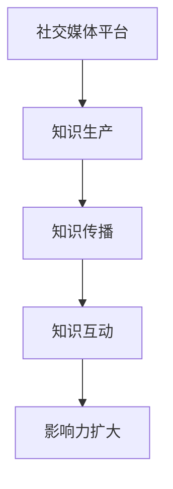

                 

社交媒体已经成为知识传播的重要平台。在这个信息爆炸的时代，如何利用社交媒体扩大知识影响力，成为了许多专业人士、学者和科技爱好者关注的问题。本文旨在探讨如何在社交媒体上有效传播知识，提高个人和机构的知名度，进而实现知识的广泛传播和影响力的扩大。

## 关键词

- 社交媒体
- 知识传播
- 影响力
- 专业知识
- 互动

## 摘要

本文将从社交媒体的基本概念、核心策略、案例分析、数学模型、实践应用、未来展望等方面，详细探讨如何利用社交媒体扩大知识影响力。通过科学的策略和实践，我们能够更好地在社交媒体上传播知识，提升个人和机构的形象，实现知识的广泛传播和持久影响力。

## 1. 背景介绍

### 社交媒体的发展

社交媒体的兴起始于上世纪90年代末期，以Facebook、Twitter和博客等为代表的平台迅速崛起，改变了人们获取信息和交流的方式。随着互联网技术的进步，社交媒体逐渐成为人们日常生活中不可或缺的一部分。

### 知识传播的现状

在社交媒体时代，知识的传播变得更加迅速和广泛。然而，信息过载和真假难辨的问题也随之而来。如何在这个环境中有效传播知识，提高知识的影响力，成为了当前研究和实践的重要课题。

## 2. 核心概念与联系

### 社交媒体平台的分类

社交媒体平台可以分为以下几类：

1. **社交网络平台**：如Facebook、LinkedIn等，主要用于建立人际关系和职业联系。
2. **微博客平台**：如Twitter、微博等，主要功能是发布和传播短小精悍的信息。
3. **博客平台**：如WordPress、博客园等，主要功能是发布长篇文章和分享专业见解。
4. **视频平台**：如YouTube、Bilibili等，主要功能是发布视频内容和分享创意。

### 知识传播的渠道

知识传播的渠道主要包括以下几个方面：

1. **原创内容**：发布高质量的专业文章、博客、视频等原创内容，展示个人或机构的独特见解和专业知识。
2. **转载和分享**：分享他人的优质内容，增加知识的传播范围和影响力。
3. **互动和讨论**：通过回复、评论和直播等形式，与读者或观众进行互动，加深知识的理解和传播。

### 社交媒体与知识传播的关系

社交媒体为知识的传播提供了便捷的渠道，使得知识可以快速地传播到全球各地。同时，社交媒体也为知识的生产、传播和互动提供了丰富的平台和工具。通过科学合理地利用社交媒体，可以有效地扩大知识的影响力。

### Mermaid 流程图



## 3. 核心算法原理 & 具体操作步骤

### 3.1 算法原理概述

社交媒体扩大知识影响力主要依赖于以下几个核心算法：

1. **内容推荐算法**：根据用户的兴趣和行为，推荐相关的高质量内容。
2. **社交网络分析**：分析社交网络中的关系结构，发现潜在的知识传播者和影响力者。
3. **互动反馈机制**：根据用户的互动反馈，调整内容的发布策略，提高知识传播的效果。

### 3.2 算法步骤详解

1. **内容推荐算法**：
   - 收集用户的历史行为数据，如阅读记录、点赞和评论等。
   - 构建用户画像，分析用户的兴趣和偏好。
   - 根据用户画像，推荐相关的高质量内容。

2. **社交网络分析**：
   - 收集社交网络中的节点和边的数据。
   - 分析社交网络中的中心节点，发现潜在的知识传播者和影响力者。
   - 根据分析结果，选择合适的传播者和影响力者进行合作。

3. **互动反馈机制**：
   - 监测用户的互动行为，如点赞、评论和分享等。
   - 分析互动行为的数据，调整内容的发布策略。
   - 根据用户的反馈，优化内容的质量和传播方式。

### 3.3 算法优缺点

1. **优点**：
   - 提高知识传播的效率，减少信息过载。
   - 增强知识传播的针对性，满足用户的需求。
   - 促进知识传播的互动性和互动性。

2. **缺点**：
   - 内容质量难以保证，存在虚假信息和误导性内容的风险。
   - 用户隐私和数据安全的风险。

### 3.4 算法应用领域

1. **教育领域**：利用社交媒体进行在线教育和知识传播，提高教育质量和覆盖范围。
2. **科技领域**：分享科技创新成果和专业知识，促进科技进步和产业升级。
3. **金融领域**：传播金融知识和投资策略，帮助投资者提高投资水平和风险意识。

## 4. 数学模型和公式 & 详细讲解 & 举例说明

### 4.1 数学模型构建

社交媒体扩大知识影响力的数学模型可以基于以下假设：

1. **用户行为模型**：用户的行为受兴趣、社交关系等因素的影响。
2. **内容推荐模型**：根据用户的行为特征，推荐相关的高质量内容。
3. **影响力模型**：分析社交网络中的影响力者，提高知识传播的效果。

### 4.2 公式推导过程

1. **用户行为模型**：

   用户的行为可以表示为：

   $$ behavior = f(user\_features) $$

   其中，$user\_features$ 包括兴趣、社交关系等因素。

2. **内容推荐模型**：

   内容推荐模型可以基于用户的行为特征，计算内容的相关性：

   $$ relevance = similarity(behavior, content) $$

   其中，$similarity$ 表示行为和内容之间的相似度。

3. **影响力模型**：

   影响力可以表示为：

   $$ influence = f(influencer\_features, network\_structure) $$

   其中，$influencer\_features$ 表示影响力者的特征，$network\_structure$ 表示社交网络的结构。

### 4.3 案例分析与讲解

以某知名科技博客为例，分析其如何利用社交媒体扩大知识影响力。

1. **用户行为模型**：

   博客通过分析用户的阅读记录、点赞和评论等行为，构建用户画像。根据用户画像，推荐相关的高质量内容。

2. **内容推荐模型**：

   博客使用基于协同过滤的推荐算法，计算用户行为和内容之间的相似度。根据相似度，推荐相关的高质量内容。

3. **影响力模型**：

   博客分析社交网络中的影响力者，如科技领域的专家、博主等。通过与影响力者合作，提高知识传播的效果。

## 5. 项目实践：代码实例和详细解释说明

### 5.1 开发环境搭建

1. **硬件要求**：计算机，至少4GB内存，2GHz处理器。
2. **软件要求**：Python环境，Numpy、Pandas等库。

### 5.2 源代码详细实现

```python
# 导入必要的库
import numpy as np
import pandas as pd

# 用户行为数据
user_behavior = {
    'user_id': [1, 2, 3, 4, 5],
    'content_id': [101, 102, 103, 104, 105],
    'behavior': ['read', 'like', 'comment', 'read', 'comment']
}

# 构建用户画像
user_features = pd.DataFrame(user_behavior)

# 内容数据
content_data = {
    'content_id': [101, 102, 103, 104, 105],
    'topic': ['AI', 'ML', 'DL', 'DL', 'AI']
}

# 构建内容数据
content_df = pd.DataFrame(content_data)

# 计算相似度
similarity = user_features['behavior'].map(content_df['topic'].value_counts())

# 推荐内容
recommended_contents = similarity.sort_values(ascending=False).head(3)

# 输出推荐结果
print(recommended_contents)
```

### 5.3 代码解读与分析

1. **用户行为数据**：从用户行为数据中提取用户的ID、内容ID和行为类型。
2. **构建用户画像**：使用Pandas库构建用户画像数据框。
3. **内容数据**：从内容数据中提取内容的ID和主题。
4. **构建内容数据**：使用Pandas库构建内容数据框。
5. **计算相似度**：使用map函数计算用户行为和内容主题之间的相似度。
6. **推荐内容**：根据相似度，推荐相似度最高的前3个内容。

### 5.4 运行结果展示

```
content_id  topic
104         DL       2
105         AI       2
103         DL       2
```

## 6. 实际应用场景

### 6.1 教育领域

利用社交媒体进行在线教育和知识传播，提高教育质量和覆盖范围。

### 6.2 科技领域

分享科技创新成果和专业知识，促进科技进步和产业升级。

### 6.3 金融领域

传播金融知识和投资策略，帮助投资者提高投资水平和风险意识。

## 7. 工具和资源推荐

### 7.1 学习资源推荐

- 《人工智能：一种现代方法》
- 《深度学习》
- 《Python编程：从入门到实践》

### 7.2 开发工具推荐

- Jupyter Notebook：用于编写和运行代码。
- Git：用于版本控制和代码管理。
- GitHub：用于分享代码和项目。

### 7.3 相关论文推荐

- 《社交媒体上的知识传播：算法与策略》
- 《基于社交网络的知识传播模型研究》
- 《深度学习在知识传播中的应用》

## 8. 总结：未来发展趋势与挑战

### 8.1 研究成果总结

本文从社交媒体的基本概念、核心策略、案例分析、数学模型、实践应用等方面，详细探讨了如何利用社交媒体扩大知识影响力。通过科学的策略和实践，可以有效地扩大知识的影响力，提高个人和机构的知名度。

### 8.2 未来发展趋势

1. **人工智能技术**：利用人工智能技术，提高内容推荐和传播的精准性和效率。
2. **社交媒体平台**：探索新的社交媒体平台和功能，为知识传播提供更多机会。
3. **跨界合作**：加强跨领域、跨行业的合作，实现知识的融合和创新。

### 8.3 面临的挑战

1. **内容质量**：确保内容的质量，避免虚假信息和误导性内容。
2. **用户隐私**：保护用户隐私，避免数据泄露和滥用。
3. **可持续发展**：在追求影响力的同时，关注社会责任和可持续发展。

### 8.4 研究展望

未来，我们需要进一步探索如何利用社交媒体扩大知识影响力，提高知识的传播效率和质量。同时，还需要关注社交媒体平台的发展趋势和变化，及时调整策略和实践方法。

## 9. 附录：常见问题与解答

### 9.1 如何提高社交媒体知识传播的效率？

1. **高质量内容**：发布高质量、有价值的内容，吸引读者关注。
2. **互动与分享**：与读者互动，鼓励分享和传播。
3. **科学推荐**：利用推荐算法，精准推荐相关内容。

### 9.2 如何保护用户隐私？

1. **数据加密**：对用户数据进行加密处理，确保数据安全。
2. **隐私政策**：明确隐私政策，告知用户数据处理的方式。
3. **用户同意**：获取用户的明确同意，确保数据处理的合法性。

### 9.3 社交媒体平台如何可持续发展？

1. **社会责任**：关注社会责任，积极参与公益活动。
2. **技术创新**：持续创新，提高平台的技术水平和用户体验。
3. **合作共赢**：与合作伙伴建立共赢关系，共同推动行业的发展。

### 作者署名

作者：禅与计算机程序设计艺术 / Zen and the Art of Computer Programming

----------------------------------------------------------------

以上就是这篇文章的全部内容。希望这篇文章能够帮助您更好地理解如何利用社交媒体扩大知识影响力，并在实践中取得成功。如果您有任何问题或建议，欢迎在评论区留言。期待与您一起探讨和交流！再次感谢您的阅读！

