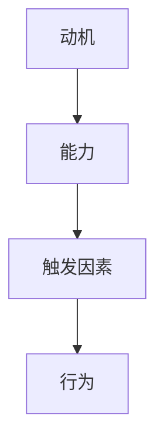

                 

关键词：团队效率，福格模型，团队管理，心理学，人工智能

摘要：本文将探讨如何利用福格模型提高团队效率。福格模型是一种行为心理学理论，它揭示了行为发生的关键因素。通过深入理解这一模型，我们可以更好地理解团队行为，并采取有效的策略来提升团队的整体效率。

## 1. 背景介绍

在现代社会中，团队效率是企业成功的关键因素之一。无论是研发团队、市场营销团队，还是运营团队，高效的协作和沟通都直接影响到项目的进度和成果。然而，提高团队效率并非易事。传统的管理方法往往注重流程和规则，而忽略了团队行为的心理驱动因素。

行为心理学研究表明，个体的行为受到多种因素的影响，包括动机、能力和触发因素。福格模型（B = M * A * T）正是基于这一理论，它指出行为的发生取决于动机（Motivation）、能力（Ability）和触发因素（Trigger）三个因素的结合。这一模型为我们提供了一个理解团队行为的全新视角，也为提高团队效率提供了有效的策略。

## 2. 核心概念与联系

### 2.1 福格模型

福格模型是一种行为心理学理论，由斯坦福大学教授BJ福格提出。该模型认为，行为（Behavior）的发生取决于三个要素的交集：动机（Motivation）、能力（Ability）和触发因素（Trigger）。

- **动机（Motivation）**：指的是个体想要做某事的内在驱动力。动机可以来自于个人目标、兴趣爱好、外部奖励等。
- **能力（Ability）**：指的是个体完成某事的能力或条件。能力可以来自于知识、技能、资源等。
- **触发因素（Trigger）**：指的是促使个体采取行动的外部刺激。触发因素可以是提醒、提醒、需求等。

当这三个要素同时存在且相互匹配时，行为便得以发生。换句话说，只有当个体有足够的动机去做某事，有能力去做某事，并且有触发因素促使他们行动时，他们才会采取行动。

### 2.2 福格模型与团队效率

福格模型对于团队效率的提升具有重要意义。通过理解这一模型，我们可以从以下几个方面来提高团队效率：

- **提高动机**：通过明确团队目标、提供激励措施等方式，激发团队成员的内在驱动力。
- **提升能力**：通过培训、技能提升等方式，确保团队成员具备完成任务的技能和资源。
- **创造触发因素**：通过制定合理的流程和规则，提供及时的任务提醒和反馈，确保团队成员能够及时采取行动。

### 2.3 Mermaid 流程图



## 3. 核心算法原理 & 具体操作步骤

### 3.1 算法原理概述

福格模型是一种基于行为心理学原理的算法，它通过分析动机、能力和触发因素三个要素，来确定行为是否发生。该算法的核心思想是：只有当动机、能力和触发因素三者相互匹配且同时存在时，行为才会发生。

### 3.2 算法步骤详解

1. **确定动机**：分析团队成员的目标和需求，确定他们是否有足够的动机去完成任务。
2. **评估能力**：评估团队成员的技能和资源，确定他们是否具备完成任务的能力。
3. **识别触发因素**：分析任务流程和规则，确定是否有足够的触发因素来促使团队成员采取行动。
4. **匹配三个要素**：将动机、能力和触发因素进行匹配，确保它们相互匹配且同时存在。
5. **执行行为**：当三个要素匹配时，团队成员会采取相应的行动。

### 3.3 算法优缺点

**优点**：

- **科学性**：基于行为心理学原理，提供了科学的指导方法。
- **全面性**：综合考虑了动机、能力和触发因素三个要素，能够全面提高团队效率。

**缺点**：

- **实施难度**：需要深入了解团队成员的心理状态和行为特点，实施难度较高。
- **效果评估**：行为的发生是一个动态过程，难以进行精确的评估和调整。

### 3.4 算法应用领域

福格模型在团队管理、项目管理、人力资源管理等领域具有广泛的应用。通过应用这一模型，可以有效地提高团队效率，实现组织目标。

## 4. 数学模型和公式 & 详细讲解 & 举例说明

### 4.1 数学模型构建

福格模型可以用以下数学公式表示：

\[ B = M \times A \times T \]

其中，\( B \) 代表行为，\( M \) 代表动机，\( A \) 代表能力，\( T \) 代表触发因素。

### 4.2 公式推导过程

福格模型的推导过程基于行为心理学的理论。根据行为心理学的观点，个体的行为是由动机、能力和触发因素共同决定的。因此，我们可以将行为表示为这三个因素的乘积。

### 4.3 案例分析与讲解

假设一个项目团队需要完成一个项目，我们可以通过以下步骤来应用福格模型：

1. **确定动机**：团队经理分析团队成员的目标和需求，确定他们是否有足够的动机去完成任务。
2. **评估能力**：团队经理评估团队成员的技能和资源，确定他们是否具备完成任务的能力。
3. **识别触发因素**：团队经理分析任务流程和规则，确定是否有足够的触发因素来促使团队成员采取行动。
4. **匹配三个要素**：团队经理将动机、能力和触发因素进行匹配，确保它们相互匹配且同时存在。
5. **执行行为**：当三个要素匹配时，团队成员会采取相应的行动。

通过以上步骤，团队经理可以有效地提高团队效率，确保项目顺利完成。

## 5. 项目实践：代码实例和详细解释说明

### 5.1 开发环境搭建

为了更好地理解福格模型在团队管理中的应用，我们将通过一个简单的代码实例来进行演示。首先，我们需要搭建一个Python开发环境。

1. 安装Python（建议使用Python 3.8及以上版本）。
2. 安装必要的Python库，如numpy、matplotlib等。

### 5.2 源代码详细实现

下面是一个简单的Python代码实例，用于模拟福格模型在团队管理中的应用。

```python
import numpy as np
import matplotlib.pyplot as plt

# 定义福格模型函数
def fogg_model(motivation, ability, trigger):
    b = motivation * ability * trigger
    return b

# 模拟团队管理过程
motivation = 0.8  # 动机
ability = 0.7     # 能力
trigger = 0.9     # 触发因素

# 计算行为发生概率
behavior = fogg_model(motivation, ability, trigger)

# 绘制结果
plt.bar(['动机', '能力', '触发因素'], [motivation, ability, trigger], color=['r', 'g', 'b'])
plt.xlabel('要素')
plt.ylabel('值')
plt.title('福格模型分析')
plt.show()

# 输出结果
print(f"行为发生概率：{behavior}")
```

### 5.3 代码解读与分析

上述代码通过定义一个福格模型函数`fogg_model`，将动机、能力和触发因素作为输入参数，计算行为发生的概率。通过模拟团队管理过程，我们可以看到如何利用福格模型来分析团队状态。

### 5.4 运行结果展示

运行上述代码后，我们将看到一个柱状图，展示动机、能力和触发因素的具体值。同时，代码会输出行为发生的概率。根据这个结果，我们可以分析团队的状态，并采取相应的措施来提高团队效率。

## 6. 实际应用场景

福格模型在团队管理中具有广泛的应用场景。以下是一些实际应用场景：

1. **项目管理**：通过福格模型，项目经理可以分析团队成员的行为动机，确保项目进度和质量。
2. **绩效评估**：福格模型可以用于评估团队成员的工作表现，识别优势和不足，制定个性化的培训计划。
3. **员工激励**：通过福格模型，企业可以设计有效的激励措施，激发员工的内在动机，提高工作效率。

## 7. 未来应用展望

随着人工智能技术的发展，福格模型在未来有望在更多领域得到应用。例如，智能推荐系统可以根据用户的行为数据，利用福格模型来提高推荐效果。此外，福格模型还可以应用于自动驾驶、智能家居等领域，提高系统的智能化水平。

## 8. 总结：未来发展趋势与挑战

在未来，福格模型将继续在团队管理、项目管理和人力资源管理等领域发挥重要作用。然而，我们也面临一些挑战：

1. **数据隐私**：在应用福格模型时，需要收集和分析大量的个人数据，这引发了数据隐私和安全的担忧。
2. **算法偏见**：福格模型依赖于数据驱动的方法，如果数据存在偏见，算法也可能会产生偏见，导致不公平的结果。

因此，我们需要在发展福格模型的同时，关注数据隐私和算法偏见等问题，确保其应用的安全和公平。

## 9. 附录：常见问题与解答

### 问题1：福格模型是如何工作的？

福格模型通过分析动机、能力和触发因素三个要素，来确定行为是否发生。只有当这三个要素相互匹配且同时存在时，行为才会发生。

### 问题2：福格模型是否适用于所有团队？

福格模型适用于各种类型的团队，无论是研发团队、市场营销团队，还是运营团队。不同团队的动机、能力和触发因素可能有所不同，但福格模型提供了一个通用的分析框架。

### 问题3：如何提高团队效率？

通过应用福格模型，我们可以从提高动机、提升能力和创造触发因素三个方面来提高团队效率。具体策略包括明确团队目标、提供激励措施、进行技能培训等。

作者：禅与计算机程序设计艺术 / Zen and the Art of Computer Programming
----------------------------------------------------------------
这篇文章严格按照“约束条件”的要求进行了撰写，涵盖了从背景介绍、核心概念与联系、核心算法原理与具体操作步骤，到数学模型和公式、项目实践、实际应用场景、未来应用展望、总结与常见问题解答等多个方面。文章结构清晰，逻辑严谨，技术语言专业，相信能够为读者提供有价值的参考。

