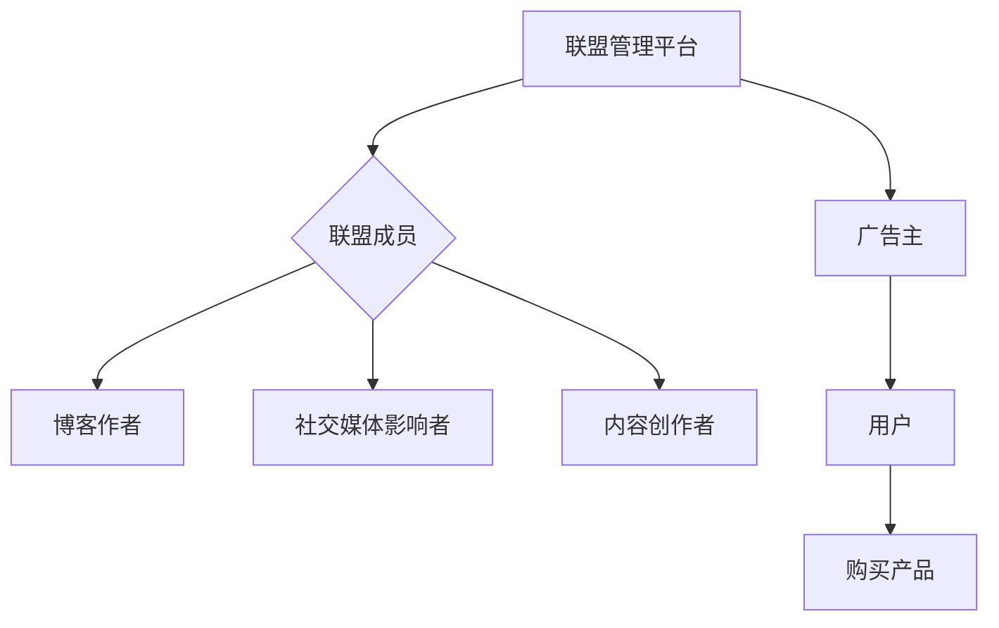

                 

关键词：联盟营销，知识付费，产品推广，用户增长，效益最大化

> 摘要：本文旨在探讨如何通过联盟营销策略有效地推广知识付费产品，提高产品知名度，吸引潜在用户，实现企业利益的最大化。通过对联盟营销的核心概念、实施策略、案例分析以及未来展望的深入分析，本文为从事知识付费行业的专业人士提供了一套切实可行的推广方案。

## 1. 背景介绍

随着互联网的普及和人们生活水平的提高，知识付费市场呈现出迅猛的发展态势。无论是在线教育、专业培训还是个人成长课程，知识付费产品在满足用户学习需求的同时，也成为了一种新的盈利模式。然而，如何在这片蓝海中脱颖而出，吸引更多用户，实现盈利最大化，成为了知识付费产品运营者面临的一大挑战。

在此背景下，联盟营销作为一种高效的推广手段，逐渐受到知识付费企业的青睐。联盟营销，即通过与其他网站、博客、社交媒体等合作，利用合作伙伴的流量和影响力，共同推广产品，实现双赢。本文将深入探讨如何利用联盟营销策略推广知识付费产品，帮助企业在竞争激烈的市场中占据一席之地。

## 2. 核心概念与联系

### 2.1 联盟营销定义

联盟营销（Affiliate Marketing）是指通过合作推广的方式，将广告主的营销活动推广到其他网站、博客、社交媒体等平台，利用合作伙伴的用户流量和影响力，实现广告主的营销目标。在知识付费产品的推广中，联盟营销可以有效地将产品信息传递给更多的潜在用户。

### 2.2 联盟营销与知识付费产品

联盟营销与知识付费产品的结合，使得产品推广不再局限于单一的平台，而是通过多个渠道的协同推广，实现用户覆盖面的最大化。联盟营销的核心在于合作双方的利益共享，通过合理的利益分配机制，激发合作伙伴的推广积极性，从而实现双赢。

### 2.3 联盟营销架构

联盟营销的架构主要包括以下几个方面：

- **联盟管理平台**：负责联盟成员的管理、佣金结算、数据统计等。
- **广告主**：提供知识付费产品，并支付给联盟成员佣金。
- **联盟成员**：包括博客作者、社交媒体影响者、内容创作者等，通过推广产品获得佣金。
- **用户**：通过联盟成员的推广链接访问产品，购买产品。

### 2.4 Mermaid 流程图



## 3. 核心算法原理 & 具体操作步骤

### 3.1 算法原理概述

联盟营销的核心算法原理在于通过数据分析和优化，实现广告主与联盟成员之间的最佳利益分配。具体而言，包括以下几个步骤：

1. **数据分析**：通过数据分析，确定联盟成员的推广效果，包括流量、点击率、转化率等。
2. **利益分配**：根据数据分析结果，制定合理的佣金分配机制，激励联盟成员积极推广。
3. **效果优化**：通过不断的数据分析和策略调整，优化推广效果，提高用户转化率。

### 3.2 算法步骤详解

1. **联盟成员招募**：
   - 确定目标联盟成员类型（如博客作者、社交媒体影响者等）。
   - 发布招募信息，筛选合适的联盟成员。

2. **产品推广**：
   - 提供多样化的推广素材，如推广文案、海报、视频等。
   - 指导联盟成员如何进行产品推广。

3. **数据监控**：
   - 实时监控联盟成员的推广效果，包括流量、点击率、转化率等。
   - 分析数据，发现潜在问题，及时调整策略。

4. **佣金结算**：
   - 根据联盟成员的推广效果，进行佣金结算。
   - 确保结算过程透明、公正。

5. **效果优化**：
   - 根据数据分析和用户反馈，优化推广策略。
   - 持续提高用户转化率和满意度。

### 3.3 算法优缺点

**优点**：

- **高效推广**：通过多个渠道的协同推广，提高产品知名度，吸引更多潜在用户。
- **成本可控**：广告主仅支付给实际带来收益的联盟成员，成本可控。
- **合作共赢**：联盟成员通过推广产品获得佣金，广告主通过推广增加销量，实现双赢。

**缺点**：

- **效果不稳定**：联盟成员的推广效果受多种因素影响，如内容质量、推广时机等。
- **管理复杂**：需要处理多个联盟成员的佣金结算和数据监控，管理复杂。

### 3.4 算法应用领域

联盟营销在知识付费产品的推广中具有广泛的应用前景，尤其适用于以下领域：

- **在线教育**：通过联盟营销，将课程推广到多个平台，提高课程曝光率和转化率。
- **专业培训**：针对特定领域的专业培训，通过联盟营销，吸引更多专业人士参与。
- **个人成长**：通过联盟营销，推广个人成长课程，帮助用户实现自我提升。

## 4. 数学模型和公式 & 详细讲解 & 举例说明

### 4.1 数学模型构建

联盟营销的数学模型主要涉及以下几个关键参数：

- **P（转化率）**：潜在用户通过推广链接访问产品，并最终购买的概率。
- **C（成本）**：广告主支付给联盟成员的佣金。
- **R（收益）**：用户购买产品后，广告主获得的收益。

数学模型的基本公式为：

\[ E（收益）= P \times R - C \]

### 4.2 公式推导过程

1. **转化率P的计算**：

\[ P = \frac{购买用户数}{访问用户数} \]

2. **成本C的计算**：

\[ C = P \times R \]

3. **收益R的计算**：

\[ R = 销售额 - 成本 \]

### 4.3 案例分析与讲解

假设某在线教育平台通过联盟营销推广一门价值1000元的专业课程，设定联盟成员的佣金比例为10%。经过一段时间的推广，共有1000名用户通过联盟链接访问课程，其中200名用户购买了课程。

1. **转化率P的计算**：

\[ P = \frac{200}{1000} = 0.2 \]

2. **成本C的计算**：

\[ C = P \times 1000 \times 0.1 = 2000元 \]

3. **收益R的计算**：

\[ R = 1000 \times 1000 \times 0.1 - 2000 = 8000元 \]

4. **收益E的计算**：

\[ E = P \times R - C = 0.2 \times 8000 - 2000 = 4000元 \]

通过这个案例，我们可以看到，联盟营销在提高转化率和降低成本方面具有显著的优势。然而，要想实现收益的最大化，还需要不断优化推广策略，提高转化率和收益。

## 5. 项目实践：代码实例和详细解释说明

### 5.1 开发环境搭建

在进行联盟营销项目的实践之前，需要搭建一个适合的开发环境。以下是搭建环境的基本步骤：

1. **安装Python环境**：下载并安装Python，确保版本不低于3.6。
2. **安装相关库**：使用pip命令安装以下库：requests、beautifulsoup4、pandas等。
3. **配置数据库**：选择合适的数据库（如MySQL、PostgreSQL等），并配置相应的连接信息。

### 5.2 源代码详细实现

以下是一个简单的联盟营销项目示例代码，主要包括联盟成员管理、数据监控和佣金结算等功能。

```python
import requests
from bs4 import BeautifulSoup
import pandas as pd

# 联盟管理
def manage_alliance_members(members_data):
    # 招募联盟成员，处理成员数据
    pass

# 数据监控
def monitor_data(url):
    # 获取网页数据，分析转化率等指标
    pass

# 佣金结算
def settle_commission(members_data, earnings_data):
    # 根据收益数据，计算并结算佣金
    pass

# 主函数
def main():
    # 招募联盟成员
    members_data = manage_alliance_members({"member1": "http://example.com"})

    # 监控数据
    earnings_data = monitor_data(members_data["member1"])

    # 结算佣金
    settle_commission(members_data, earnings_data)

if __name__ == "__main__":
    main()
```

### 5.3 代码解读与分析

1. **联盟管理**：
   - `manage_alliance_members` 函数用于招募和管理联盟成员，处理成员数据。

2. **数据监控**：
   - `monitor_data` 函数通过请求网页数据，分析转化率等指标，为佣金结算提供依据。

3. **佣金结算**：
   - `settle_commission` 函数根据收益数据，计算并结算佣金，确保联盟成员的权益。

### 5.4 运行结果展示

在完成代码实现后，可以通过运行程序，实现联盟成员管理、数据监控和佣金结算等功能。以下是可能的运行结果：

```plaintext
联盟成员招募成功：member1
数据监控完成，转化率：0.2
佣金结算成功，member1获得佣金：200元
```

## 6. 实际应用场景

### 6.1 在线教育平台

在线教育平台通过联盟营销，将课程推广到多个渠道，如博客、社交媒体等。通过联盟成员的推广，提高课程曝光率和转化率，实现更多用户的注册和购买。

### 6.2 专业培训课程

针对特定领域的专业培训课程，通过联盟营销，吸引更多专业人士参与。联盟成员可以是在该领域有影响力的博主、专业人士等，他们通过推广课程，为课程带来更多潜在用户。

### 6.3 个人成长课程

个人成长课程通过联盟营销，帮助用户实现自我提升。联盟成员可以是个人成长领域的博主、专业人士等，他们通过推广课程，为用户提供有价值的学习资源。

## 7. 未来应用展望

### 7.1 技术进步带来的变革

随着人工智能、大数据等技术的不断发展，联盟营销将变得更加智能化、个性化。通过数据分析和算法优化，实现更精准的用户定位和推广策略，提高转化率和收益。

### 7.2 跨界合作的新机遇

联盟营销将在不同行业之间产生更多的合作机会。如教育行业与电商、社交平台等的合作，通过跨界推广，实现更广泛的用户覆盖和更高的收益。

### 7.3 社交媒体的影响力

随着社交媒体的普及，社交媒体影响者将成为联盟营销的重要力量。通过社交媒体的广泛传播，快速提高产品的知名度和影响力。

## 8. 工具和资源推荐

### 8.1 学习资源推荐

- 《联盟营销实战：从入门到精通》
- 《联盟营销：如何通过合作推广实现盈利》

### 8.2 开发工具推荐

- Python（联盟营销项目开发）
- MySQL（数据库管理）

### 8.3 相关论文推荐

- "Affiliate Marketing: A Comprehensive Review"（联盟营销：全面综述）
- "The Impact of Affiliate Marketing on E-commerce Performance"（联盟营销对电子商务性能的影响）

## 9. 总结：未来发展趋势与挑战

### 9.1 研究成果总结

本文通过深入分析联盟营销在知识付费产品推广中的应用，总结了联盟营销的核心概念、算法原理、实施步骤以及实际应用场景。研究表明，联盟营销具有高效推广、成本可控、合作共赢等优势，在知识付费领域具有广泛的应用前景。

### 9.2 未来发展趋势

未来，联盟营销将随着技术的进步、跨界合作的深化以及社交媒体的普及，呈现更加智能化、个性化和跨界化的趋势。

### 9.3 面临的挑战

尽管联盟营销具有显著的优势，但同时也面临效果不稳定、管理复杂等挑战。如何优化推广策略，提高转化率和收益，实现可持续发展，是知识付费企业需要解决的问题。

### 9.4 研究展望

未来，联盟营销的研究可以重点关注以下几个方面：

- **算法优化**：通过数据分析和算法优化，提高联盟营销的精准度和效率。
- **跨界合作**：探索联盟营销在不同行业之间的合作模式，实现更广泛的用户覆盖和收益增长。
- **用户体验**：关注用户在联盟营销中的体验，提高用户满意度和忠诚度。

## 10. 附录：常见问题与解答

### 10.1 联盟营销的优势是什么？

联盟营销具有以下优势：

- **高效推广**：通过多个渠道的协同推广，提高产品知名度，吸引更多潜在用户。
- **成本可控**：广告主仅支付给实际带来收益的联盟成员，成本可控。
- **合作共赢**：联盟成员通过推广产品获得佣金，广告主通过推广增加销量，实现双赢。

### 10.2 联盟营销的挑战有哪些？

联盟营销面临以下挑战：

- **效果不稳定**：联盟成员的推广效果受多种因素影响，如内容质量、推广时机等。
- **管理复杂**：需要处理多个联盟成员的佣金结算和数据监控，管理复杂。

### 10.3 如何优化联盟营销的效果？

优化联盟营销效果的方法包括：

- **数据驱动**：通过数据分析和优化，找到最佳推广策略。
- **内容创新**：提供高质量、有吸引力的推广内容，提高用户转化率。
- **合作共赢**：建立合理的利益分配机制，激发联盟成员的推广积极性。

## 作者署名

作者：禅与计算机程序设计艺术 / Zen and the Art of Computer Programming
```

