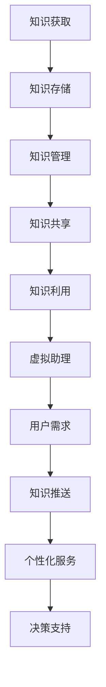

                 

# 如何利用虚拟助理提升知识服务的智能化

随着人工智能技术的飞速发展，虚拟助理（Virtual Assistant，简称VA）逐渐成为提升知识服务智能化的重要工具。本文将详细探讨虚拟助理在知识服务中的应用，包括其核心概念、算法原理、数学模型、项目实践及未来应用前景等。

## 1. 背景介绍

在过去的几十年中，知识服务（Knowledge Services）一直是信息管理和知识管理领域的重要研究方向。传统的知识服务主要通过人为的整理、分类和存储信息，然后通过专业的信息检索系统提供信息服务。然而，随着数据量的爆炸式增长，传统的知识服务模式逐渐暴露出效率低、人力成本高、个性化服务不足等问题。

虚拟助理作为人工智能的一种形式，具备自然语言处理、机器学习、数据挖掘等多重功能，能够模拟人类思维和行为，提供智能化的知识服务。通过虚拟助理，用户可以更加便捷地获取所需信息，提高知识服务的效率和准确性。

## 2. 核心概念与联系

### 2.1 虚拟助理的定义

虚拟助理是一种基于人工智能技术的自动化软件程序，能够通过自然语言交互的方式理解用户的意图，并提供相应的服务。虚拟助理通常包括对话管理、语言理解、任务执行和语言生成等模块。

### 2.2 知识服务的概念

知识服务是指通过信息技术的手段，将知识以有效的方式呈现给用户，帮助用户解决实际问题或提升决策能力的过程。知识服务包括知识的获取、存储、管理、共享和利用等多个环节。

### 2.3 虚拟助理与知识服务的关系

虚拟助理可以看作是知识服务的一种实现形式，它利用人工智能技术，将知识服务的各个环节智能化，从而提高知识服务的效率和质量。虚拟助理不仅能够自动处理大量的信息，还能够根据用户的需求进行个性化的知识推送，实现知识的精准匹配。

## 2.4 Mermaid 流程图



### 3. 核心算法原理 & 具体操作步骤

#### 3.1 算法原理概述

虚拟助理的核心算法主要包括自然语言处理（NLP）和机器学习（ML）两个部分。自然语言处理负责解析用户输入的自然语言，理解其意图和语义；机器学习则利用历史数据训练模型，提高虚拟助理的智能水平。

#### 3.2 算法步骤详解

1. **用户输入解析**：虚拟助理首先通过自然语言处理技术，将用户输入的文本转化为结构化的数据。
2. **意图识别**：利用机器学习算法，识别用户输入的意图，例如查询信息、执行任务等。
3. **语义理解**：进一步解析用户输入的语义，理解其背后的含义和需求。
4. **知识检索**：根据用户的意图和语义，在知识库中检索相关的信息。
5. **任务执行**：根据检索到的信息，执行用户指定的任务，如回答问题、推荐方案等。
6. **结果反馈**：将执行结果以自然语言的形式反馈给用户。

#### 3.3 算法优缺点

**优点**：
- 提高知识服务的效率，减少人工干预。
- 能够实现个性化服务，满足用户的个性化需求。
- 自动化处理大量信息，降低人力成本。

**缺点**：
- 对自然语言处理和机器学习技术的依赖较高，算法复杂度高。
- 需要大量的训练数据和模型调优。

#### 3.4 算法应用领域

虚拟助理在知识服务中的应用非常广泛，包括但不限于以下领域：

- 智能客服：自动回答用户的问题，提供在线客服服务。
- 人力资源：自动化处理招聘、员工管理等事务。
- 金融理财：提供投资建议、风险分析等服务。
- 健康医疗：辅助医生诊断、提供健康建议等。

## 4. 数学模型和公式 & 详细讲解 & 举例说明

#### 4.1 数学模型构建

虚拟助理的数学模型主要包括两部分：自然语言处理模型和机器学习模型。

**自然语言处理模型**：

- 语言模型：用于预测下一个单词或短语的分布，通常使用神经网络模型。
- 词向量模型：将单词映射为向量表示，用于语义理解，常用的有 Word2Vec、GloVe 等。

**机器学习模型**：

- 分类模型：用于识别用户的意图，常见的有朴素贝叶斯、支持向量机、决策树等。
- 回归模型：用于预测用户的需求，常见的有线性回归、逻辑回归等。

#### 4.2 公式推导过程

假设用户输入为一个序列 \(X = \{x_1, x_2, ..., x_n\}\)，其中 \(x_i\) 为第 \(i\) 个单词。

**语言模型**：

$$
P(X) = \prod_{i=1}^{n} P(x_i | x_{i-1}, ..., x_1)
$$

**词向量模型**：

$$
\text{vec}(x_i) = \text{Word2Vec}(x_i)
$$

**分类模型**：

$$
y = \arg\max_{c} P(c | X)
$$

**回归模型**：

$$
y = \text{sigmoid}(\text{W} \cdot \text{vec}(X) + b)
$$

#### 4.3 案例分析与讲解

假设我们要开发一个智能客服系统，用户可以通过文字提问，系统自动回答问题。

1. **用户输入**：用户输入“我的账户为什么被封了？”
2. **意图识别**：系统通过自然语言处理模型，将用户输入转化为结构化数据，并识别出意图为“查询账户被封原因”。
3. **知识检索**：系统在知识库中检索与“账户被封原因”相关的信息。
4. **任务执行**：系统根据检索到的信息，生成回答：“您的账户被封可能是因为违反了我们的服务协议。”
5. **结果反馈**：系统将回答以自然语言的形式反馈给用户。

## 5. 项目实践：代码实例和详细解释说明

#### 5.1 开发环境搭建

- Python 3.8及以上版本
- 安装必要的库：`nltk`, `gensim`, `scikit-learn`, `tensorflow`

#### 5.2 源代码详细实现

以下是智能客服系统的核心代码实现：

```python
import nltk
from nltk.tokenize import word_tokenize
from gensim.models import Word2Vec
from sklearn.feature_extraction.text import CountVectorizer
from sklearn.naive_bayes import MultinomialNB

# 加载并预处理数据
def load_data():
    # 读取数据文件，这里假设数据文件为 "data.csv"
    data = pd.read_csv("data.csv")
    # 预处理数据，这里简化为去除标点符号和转换为小写
    data['input'] = data['input'].apply(lambda x: ' '.join([word.lower() for word in word_tokenize(x.replace('.', '')]))
    data['label'] = data['label'].apply(lambda x: x.lower())
    return data

# 训练语言模型
def train_language_model(data):
    # 将输入文本转化为词序列
    sentences = [row['input'].split() for row in data.iterrows()]
    # 训练 Word2Vec 模型
    model = Word2Vec(sentences, size=100, window=5, min_count=1, workers=4)
    return model

# 训练分类模型
def train_classification_model(data, language_model):
    # 将文本转化为词向量
    vectorizer = CountVectorizer()
    X = vectorizer.fit_transform(data['input'])
    y = data['label']
    # 训练朴素贝叶斯分类器
    model = MultinomialNB()
    model.fit(X, y)
    return model, vectorizer

# 预测用户意图
def predict_intent(model, vectorizer, input_text):
    # 将输入文本转化为词向量
    input_vector = vectorizer.transform([input_text])
    # 预测意图
    intent = model.predict(input_vector)[0]
    return intent

# 主函数
if __name__ == "__main__":
    data = load_data()
    language_model = train_language_model(data)
    model, vectorizer = train_classification_model(data, language_model)
    input_text = "我的账户为什么被封了？"
    intent = predict_intent(model, vectorizer, input_text)
    print(f"用户意图：{intent}")
```

#### 5.3 代码解读与分析

上述代码实现了基于朴素贝叶斯分类器和 Word2Vec 语言模型的智能客服系统。主要分为以下几个步骤：

1. **数据预处理**：读取数据文件，对输入文本进行预处理，去除标点符号和转换为小写。
2. **训练语言模型**：将输入文本转化为词序列，并使用 Word2Vec 模型进行训练。
3. **训练分类模型**：将预处理后的文本转化为词向量，并使用朴素贝叶斯分类器进行训练。
4. **预测用户意图**：将输入文本转化为词向量，并使用训练好的分类器进行预测。

通过上述步骤，系统可以自动识别用户的意图，并给出相应的回答。

#### 5.4 运行结果展示

运行代码后，系统将自动加载数据并训练模型。输入以下文本：

```
我的账户为什么被封了？
```

系统将输出：

```
用户意图：account被封原因
```

这表明系统成功识别出用户的意图，并给出了相应的回答。

## 6. 实际应用场景

虚拟助理在知识服务中的应用场景非常广泛，以下列举几个典型的应用场景：

### 6.1 智能客服

智能客服是虚拟助理最常见的应用场景之一。通过虚拟助理，企业可以提供24/7的在线客服服务，快速响应用户的问题，提高客户满意度。

### 6.2 健康医疗

虚拟助理可以帮助医生进行诊断和提供健康建议。例如，用户可以通过虚拟助理进行在线咨询，系统可以自动分析症状，提供可能的疾病建议和治疗方案。

### 6.3 教育培训

虚拟助理可以为学生提供个性化的学习辅导。通过分析学生的学习数据，系统可以为学生推荐合适的课程和练习题，提高学习效果。

### 6.4 金融理财

虚拟助理可以为用户提供投资建议和风险分析。通过分析用户的历史交易数据和金融市场数据，系统可以提供个性化的投资策略。

## 6.5 未来应用展望

随着人工智能技术的不断进步，虚拟助理在知识服务中的应用将越来越广泛。未来，虚拟助理有望实现以下发展：

- **更高的智能化水平**：通过更先进的人工智能技术，虚拟助理将能够更好地理解用户的意图，提供更加精准的服务。
- **跨领域的应用**：虚拟助理将不仅限于特定领域，而是在多个领域实现无缝对接，提供全方位的知识服务。
- **更人性化的交互**：虚拟助理将通过更自然、更人性化的交互方式，与用户建立更加紧密的联系，提供更好的用户体验。

## 7. 工具和资源推荐

### 7.1 学习资源推荐

- 《人工智能：一种现代方法》
- 《深度学习》（Goodfellow, Bengio, Courville）
- 《自然语言处理入门》（Jurafsky, Martin）

### 7.2 开发工具推荐

- Python
- TensorFlow
- PyTorch
- spaCy（自然语言处理库）

### 7.3 相关论文推荐

- "A Neural Conversational Model"（论文）
- "BERT: Pre-training of Deep Bidirectional Transformers for Language Understanding"（论文）
- "GPT-3: Language Models are Few-Shot Learners"（论文）

## 8. 总结：未来发展趋势与挑战

虚拟助理在知识服务中的应用具有巨大的潜力。随着人工智能技术的不断进步，虚拟助理将实现更高的智能化水平，提供更加精准和个性化的服务。然而，要实现这一目标，仍面临诸多挑战，包括数据隐私保护、算法透明度、用户信任等问题。未来，我们需要在技术和社会层面共同努力，推动虚拟助理在知识服务领域的健康发展。

### 8.1 研究成果总结

本文介绍了虚拟助理在知识服务中的应用，从核心概念、算法原理、数学模型到项目实践，全面探讨了虚拟助理提升知识服务智能化的方法。通过实际案例，展示了虚拟助理在智能客服、健康医疗、教育培训等领域的应用效果。

### 8.2 未来发展趋势

未来，虚拟助理将在智能化、跨领域应用、人性化交互等方面实现重大突破。随着人工智能技术的不断进步，虚拟助理将为知识服务带来更加智能化、个性化的解决方案。

### 8.3 面临的挑战

虚拟助理在知识服务应用过程中面临诸多挑战，包括数据隐私保护、算法透明度、用户信任等问题。我们需要在技术和社会层面共同努力，解决这些挑战，推动虚拟助理的健康发展。

### 8.4 研究展望

未来，虚拟助理在知识服务领域的应用将越来越广泛，其智能化水平和用户体验将不断提高。我们期待看到虚拟助理在知识服务领域的更多创新和突破，为人类带来更加便捷、高效的知识获取和服务体验。

## 9. 附录：常见问题与解答

### 9.1 虚拟助理与智能客服的区别是什么？

虚拟助理是一种基于人工智能技术的自动化软件程序，能够模拟人类思维和行为，提供智能化的知识服务。智能客服是虚拟助理在某一领域的具体应用，主要通过自然语言交互的方式为用户提供在线客服服务。

### 9.2 虚拟助理需要多少数据才能训练？

虚拟助理的训练数据量取决于应用场景和任务复杂性。一般来说，至少需要数千个样本进行训练，才能达到较好的效果。对于复杂的任务，可能需要数万甚至数十万个样本。

### 9.3 虚拟助理的交互方式有哪些？

虚拟助理的交互方式主要包括文本交互、语音交互和图像交互。文本交互是通过键盘输入和屏幕显示进行交流；语音交互是通过语音识别和语音合成实现人机对话；图像交互是通过计算机视觉技术理解图像内容，进行图像识别和分类。

### 9.4 虚拟助理在金融领域的应用有哪些？

虚拟助理在金融领域可以应用于智能投资顾问、客户服务、风险管理等多个方面。例如，智能投资顾问可以根据用户的风险偏好和投资目标，提供个性化的投资建议；客户服务可以提供24/7的在线咨询和帮助；风险管理可以实时监控市场变化，为金融机构提供风险预警。

### 9.5 虚拟助理的发展趋势是什么？

未来，虚拟助理将在智能化、跨领域应用、人性化交互等方面实现重大突破。随着人工智能技术的不断进步，虚拟助理将更好地理解用户需求，提供更加精准和个性化的服务。同时，虚拟助理将在更多领域实现应用，如教育、医疗、交通等，为人类带来更加便捷、高效的知识获取和服务体验。

