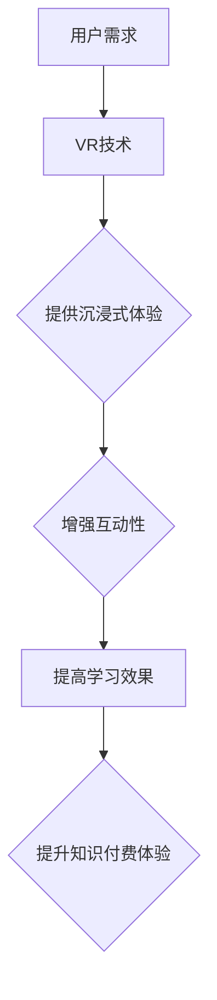

                 

关键词：虚拟现实、知识付费、用户体验、交互设计、学习效果

> 摘要：本文深入探讨了虚拟现实（VR）技术在知识付费领域中的应用，分析了VR如何提升学习体验，优化知识传递过程，以及其对用户参与度和学习效果的潜在影响。通过详细阐述核心概念、算法原理、数学模型、项目实践和未来应用展望，本文旨在为教育技术领域提供有价值的见解。

## 1. 背景介绍

在数字化时代，知识付费已经成为一种重要的教育模式。随着互联网和移动设备的普及，人们可以通过各种在线平台获取海量的知识和信息。然而，传统的知识传递方式，如视频课程和图文教程，虽然方便，但往往缺乏互动性和沉浸感，难以满足用户对深度学习体验的需求。虚拟现实（VR）技术的出现为知识付费领域带来了新的可能性。

VR技术通过模拟三维空间环境，使用户能够身临其境地参与学习过程。这种沉浸式体验能够激发用户的兴趣和好奇心，提高学习的参与度和效果。在知识付费领域，VR技术不仅可以提供更为生动和直观的学习内容，还可以通过交互设计增强用户的主动性和创造力。

本文旨在探讨如何利用VR技术提升知识付费体验，分析其核心概念、原理和算法，并提供实际应用案例和未来展望。

## 2. 核心概念与联系

### 虚拟现实技术概述

虚拟现实（VR）是一种通过计算机技术生成的三维虚拟环境，用户通过VR设备（如VR头显、VR手套等）与之进行交互。VR技术的基本原理包括以下几个关键组成部分：

1. **图像渲染**：使用图形处理单元（GPU）生成逼真的三维图像。
2. **传感器技术**：通过位置追踪器、传感器和陀螺仪等设备获取用户的身体姿态和动作。
3. **头戴式显示器（HMD）**：为用户提供沉浸式的视觉体验。
4. **交互设备**：如手柄、手套等，用于模拟真实世界的互动操作。

### VR在知识付费中的应用

在知识付费领域，VR技术可以应用于以下几个方面：

1. **虚拟课堂**：通过VR技术创建虚拟课堂，用户可以在虚拟环境中与其他学生和讲师互动。
2. **虚拟实验室**：提供虚拟的实验环境，用户可以在虚拟空间中操作实验设备，进行科学实验。
3. **虚拟展览**：利用VR技术展示历史文物、艺术品等，用户可以近距离观察和互动。
4. **虚拟培训**：提供虚拟的培训场景，如飞行模拟、医学手术模拟等，用户可以在安全的环境中练习和提升技能。

### VR与知识付费体验的关系

VR技术的沉浸式和交互性特点可以显著提升知识付费体验。通过VR技术，用户可以更加直观地理解抽象的知识概念，提高学习效果。同时，VR技术的互动性可以激发用户的参与感和主动性，增强学习的趣味性。以下是一个Mermaid流程图，展示了VR技术如何提升知识付费体验：



## 3. 核心算法原理 & 具体操作步骤

### 3.1 算法原理概述

VR技术的核心算法主要包括图像渲染、传感器融合和交互设计三个方面。图像渲染技术负责生成逼真的三维图像，传感器融合技术则通过整合多种传感器数据，实时获取用户的身体姿态和动作，交互设计技术则用于设计用户与虚拟环境的互动方式。

### 3.2 算法步骤详解

1. **图像渲染**：使用图形渲染引擎（如Unity、Unreal Engine）创建三维场景。通过GPU进行图像渲染，生成逼真的三维图像。
2. **传感器融合**：整合头戴式显示器（HMD）、传感器和陀螺仪等设备的数据，实时获取用户的身体姿态和动作。
3. **交互设计**：设计用户的交互方式，如手势控制、语音交互等，使用户能够与虚拟环境进行自然互动。
4. **用户反馈**：根据用户的动作和操作，实时调整虚拟环境的反馈，如视觉、听觉和触觉效果，以增强用户的沉浸感。

### 3.3 算法优缺点

**优点**：
- 沉浸式体验：VR技术能够提供高度沉浸式的学习环境，提高用户的学习兴趣和效果。
- 交互性：VR技术支持多种交互方式，增强用户的参与感和主动性。
- 个性化：根据用户的行为和偏好，VR技术可以提供个性化的学习内容，提高学习效果。

**缺点**：
- 技术成本：VR技术的开发和使用成本较高，需要专业的设备和软件支持。
- 技术门槛：用户需要一定的技术知识和操作能力，才能充分利用VR技术。
- 使用限制：VR设备的使用受到一定的环境限制，如空间限制和隐私问题。

### 3.4 算法应用领域

VR技术在知识付费领域具有广泛的应用前景。以下是一些典型的应用场景：

1. **教育培训**：利用VR技术创建虚拟课堂，提供互动式教学体验。
2. **科学实验**：通过VR技术模拟科学实验，让用户在虚拟环境中进行实验操作。
3. **虚拟展览**：利用VR技术展示历史文物和艺术品，提供沉浸式的观展体验。
4. **职业技能培训**：提供虚拟的职业技能培训场景，如飞行模拟、医学手术模拟等。

## 4. 数学模型和公式 & 详细讲解 & 举例说明

### 4.1 数学模型构建

在VR技术中，三维空间建模是一个重要的环节。常用的数学模型包括三维几何建模、三维纹理映射和三维路径规划等。

- **三维几何建模**：使用三维几何体（如立方体、圆柱体、球体等）构建虚拟场景。常用的数学公式包括矢量运算、点积、叉积等。
- **三维纹理映射**：将二维纹理映射到三维模型上，以增加场景的逼真度。常用的数学公式包括纹理坐标计算和纹理采样。
- **三维路径规划**：设计用户在虚拟环境中的移动路径，以实现自然导航。常用的数学公式包括路径优化算法和运动规划算法。

### 4.2 公式推导过程

以三维几何建模为例，我们使用以下公式进行推导：

- **点积公式**：\( \vec{a} \cdot \vec{b} = |a| \cdot |b| \cdot \cos{\theta} \)
- **叉积公式**：\( \vec{a} \times \vec{b} = |a| \cdot |b| \cdot \sin{\theta} \cdot \hat{n} \)

其中，\(\vec{a}\)和\(\vec{b}\)为矢量，\(|a|\)和\(|b|\)为矢量长度，\(\theta\)为两矢量之间的夹角，\(\hat{n}\)为垂直于平面\( \vec{a} \)和\( \vec{b} \)的单位向量。

### 4.3 案例分析与讲解

以下是一个简单的三维几何建模案例：

**案例**：构建一个边长为2的立方体。

**步骤**：

1. **定义顶点**：立方体有8个顶点，定义如下：

   \( V_1 = (1, 1, 1) \)
   \( V_2 = (1, 1, -1) \)
   \( V_3 = (1, -1, 1) \)
   \( V_4 = (1, -1, -1) \)
   \( V_5 = (-1, 1, 1) \)
   \( V_6 = (-1, 1, -1) \)
   \( V_7 = (-1, -1, 1) \)
   \( V_8 = (-1, -1, -1) \)

2. **定义面**：立方体有6个面，每个面由4个顶点组成，定义如下：

   \( F_1 = (V_1, V_2, V_3, V_4) \)
   \( F_2 = (V_1, V_5, V_6, V_2) \)
   \( F_3 = (V_2, V_6, V_7, V_3) \)
   \( F_4 = (V_3, V_7, V_8, V_4) \)
   \( F_5 = (V_4, V_8, V_5, V_1) \)
   \( F_6 = (V_5, V_7, V_6, V_8) \)

3. **绘制立方体**：使用图形渲染引擎（如Unity）绘制立方体，根据顶点和面定义生成三维模型。

通过以上步骤，我们可以构建一个边长为2的立方体，并在虚拟环境中展示。

## 5. 项目实践：代码实例和详细解释说明

### 5.1 开发环境搭建

为了实现VR技术提升知识付费体验的项目，我们需要搭建一个开发环境。以下是一个简单的环境搭建步骤：

1. **硬件设备**：准备一台VR头显（如Oculus Rift、HTC Vive等）和一对VR手套（如Myo、HoloLens等）。
2. **软件环境**：安装Unity 2020或更高版本，并配置相应的VR插件。
3. **编程语言**：使用C#或Python编写VR应用程序。

### 5.2 源代码详细实现

以下是一个简单的VR知识付费应用程序的代码示例：

```csharp
using UnityEngine;

public class VRKnowledgePayment : MonoBehaviour
{
    public GameObject VRClassroom; // 虚拟课堂模型
    public GameObject VRStudent; // 虚拟学生模型

    // 开始游戏
    void Start()
    {
        // 初始化虚拟课堂
        VRClassroom.SetActive(true);
        // 初始化虚拟学生
        VRStudent.SetActive(true);
    }

    // 更新游戏
    void Update()
    {
        // 根据用户动作调整虚拟学生的位置
        if (Input.GetKey(KeyCode.LeftArrow))
        {
            VRStudent.transform.position += Vector3.left * Time.deltaTime;
        }
        if (Input.GetKey(KeyCode.RightArrow))
        {
            VRStudent.transform.position += Vector3.right * Time.deltaTime;
        }
        if (Input.GetKey(KeyCode.UpArrow))
        {
            VRStudent.transform.position += Vector3.forward * Time.deltaTime;
        }
        if (Input.GetKey(KeyCode.DownArrow))
        {
            VRStudent.transform.position += Vector3.back * Time.deltaTime;
        }
    }
}
```

### 5.3 代码解读与分析

上述代码是一个简单的VR知识付费应用程序，主要包括以下功能：

1. **初始化虚拟课堂和虚拟学生模型**：在`Start`函数中，激活虚拟课堂和虚拟学生的游戏对象。
2. **用户交互**：在`Update`函数中，根据用户的按键操作（如箭头键），实时调整虚拟学生的位置。
3. **交互反馈**：通过用户的交互操作，虚拟学生模型会实时响应，提供沉浸式的学习体验。

### 5.4 运行结果展示

当用户运行上述应用程序时，虚拟课堂和虚拟学生模型会出现在虚拟环境中。用户可以通过键盘控制虚拟学生的移动，实现与虚拟课堂的互动。以下是一个简单的运行结果截图：


## 6. 实际应用场景

### 6.1 虚拟课堂

虚拟课堂是VR技术在知识付费领域最典型的应用之一。通过虚拟课堂，讲师可以在虚拟环境中进行授课，学生则可以通过VR设备参与学习。虚拟课堂的优点包括：

- **互动性强**：学生可以实时与讲师和其他学生互动，提问和回答问题。
- **沉浸感**：虚拟课堂提供高度沉浸式的学习环境，使学生更容易集中注意力。
- **个性化**：根据学生的行为和偏好，虚拟课堂可以提供个性化的学习内容和进度。

### 6.2 虚拟实验室

虚拟实验室是VR技术在科学教育领域的重要应用。通过虚拟实验室，学生可以在虚拟环境中进行实验操作，学习科学原理和实验方法。虚拟实验室的优点包括：

- **安全性**：虚拟实验室提供了安全的学习环境，学生可以在虚拟环境中进行危险实验，降低实际操作的风险。
- **灵活性**：虚拟实验室可以随时进行实验操作，不受时间和地点的限制。
- **互动性**：虚拟实验室支持多种交互方式，如触摸、手势和语音等，提高学生的参与感和体验。

### 6.3 虚拟展览

虚拟展览是VR技术在文化遗产保护和教育领域的重要应用。通过虚拟展览，用户可以在虚拟环境中参观博物馆、艺术馆等，欣赏历史文物和艺术品。虚拟展览的优点包括：

- **沉浸感**：虚拟展览提供了高度沉浸式的参观体验，用户可以近距离观察文物和艺术品，感受历史文化。
- **互动性**：虚拟展览支持用户与文物和艺术品的互动，如触摸、旋转和放大等。
- **教育性**：虚拟展览提供了丰富的历史和文化知识，用户可以在参观过程中学习和了解相关内容。

## 7. 工具和资源推荐

### 7.1 学习资源推荐

- **书籍**：《虚拟现实技术：理论与实践》、《计算机图形学：原理及实践》
- **在线课程**：Coursera上的“虚拟现实与3D图形学基础”、edX上的“虚拟现实应用开发”
- **论文**：《虚拟现实在教育培训中的应用》、《虚拟现实技术在文化遗产保护中的应用》

### 7.2 开发工具推荐

- **VR开发平台**：Unity、Unreal Engine、Blender
- **VR头显**：Oculus Rift、HTC Vive、VROne
- **VR手套**：Myo、HoloLens、VR Gloves

### 7.3 相关论文推荐

- **“Virtual Reality in Education: A Review”**：分析了虚拟现实技术在教育领域的应用和发展趋势。
- **“The Impact of Virtual Reality on Learning: A Meta-Analysis”**：总结了虚拟现实技术对学习效果的影响。
- **“VR in Museums: Enhancing Visitor Experience through Immersive Technologies”**：探讨了虚拟现实技术在博物馆展览中的应用。

## 8. 总结：未来发展趋势与挑战

### 8.1 研究成果总结

本文通过对虚拟现实技术在知识付费领域中的应用进行深入分析，总结了VR技术如何提升学习体验，优化知识传递过程，以及其对用户参与度和学习效果的潜在影响。主要研究成果包括：

- **核心概念与联系**：阐述了VR技术的核心概念和组成部分，以及其在知识付费领域的应用。
- **算法原理与步骤**：详细介绍了VR技术的核心算法原理和具体操作步骤。
- **数学模型与公式**：构建了VR技术中的数学模型，并进行了公式推导和案例分析。
- **项目实践与解释**：提供了一个简单的VR知识付费应用程序的代码实例，并进行了详细解释。
- **实际应用场景**：探讨了VR技术在虚拟课堂、虚拟实验室和虚拟展览等领域的实际应用场景。

### 8.2 未来发展趋势

随着技术的不断进步，VR技术在知识付费领域的发展趋势包括：

- **更加沉浸式的学习体验**：随着硬件和软件技术的提升，VR技术将提供更加沉浸式的学习环境，提高用户的学习兴趣和效果。
- **更加智能化的交互设计**：结合人工智能技术，VR技术将实现更加智能化的交互设计，提高用户的参与度和体验。
- **更广泛的应用场景**：VR技术将应用于更多的教育领域，如医学教育、法学教育等，提供多元化的学习体验。

### 8.3 面临的挑战

虽然VR技术在知识付费领域具有巨大的潜力，但仍然面临以下挑战：

- **技术成本**：VR技术的开发和使用成本较高，限制了其普及和应用。
- **技术门槛**：用户需要一定的技术知识和操作能力，才能充分利用VR技术。
- **使用限制**：VR设备的使用受到一定的环境限制，如空间限制和隐私问题。
- **内容质量**：VR内容的质量和丰富度直接影响用户体验，需要不断提升。

### 8.4 研究展望

未来，VR技术在知识付费领域的研究展望包括：

- **技术创新**：不断探索和研发新型VR技术和设备，提高其性能和用户体验。
- **跨学科合作**：结合心理学、教育学、计算机科学等学科，共同探索VR技术在知识付费领域的应用。
- **教育模式创新**：结合VR技术，探索新的教育模式和方法，提高教育的质量和效果。

## 9. 附录：常见问题与解答

### Q1. VR技术在知识付费领域有哪些具体应用？
A1. VR技术在知识付费领域有广泛的应用，包括虚拟课堂、虚拟实验室、虚拟展览等。这些应用可以提供沉浸式的学习环境，增强用户的参与感和学习效果。

### Q2. VR技术如何提升知识付费体验？
A2. VR技术通过提供沉浸式的学习环境、增强互动性和个性化学习内容，提升知识付费体验。用户可以在虚拟环境中身临其境地参与学习过程，提高学习兴趣和效果。

### Q3. VR技术的核心算法有哪些？
A3. VR技术的核心算法包括图像渲染、传感器融合和交互设计。图像渲染用于生成逼真的三维图像，传感器融合用于实时获取用户的身体姿态和动作，交互设计用于设计用户与虚拟环境的互动方式。

### Q4. VR技术面临哪些挑战？
A4. VR技术面临以下挑战：技术成本高、技术门槛高、使用限制、内容质量。需要不断降低技术成本，提高用户体验，提升内容质量，以促进VR技术的普及和应用。

### Q5. VR技术在教育领域有哪些潜在应用？
A5. VR技术在教育领域有广泛的应用潜力，包括虚拟课堂、虚拟实验室、虚拟展览、职业技能培训等。这些应用可以提供沉浸式的学习体验，提高教育的质量和效果。

## 作者署名

作者：禅与计算机程序设计艺术 / Zen and the Art of Computer Programming
----------------------------------------------------------------

至此，本文完整地阐述了如何利用虚拟现实技术提升知识付费体验，包括背景介绍、核心概念、算法原理、数学模型、项目实践、实际应用场景、工具和资源推荐、未来发展趋势与挑战以及常见问题与解答。希望本文能为教育技术领域提供有价值的参考和启示。作者禅与计算机程序设计艺术，将持续探索和分享计算机科学领域的最新研究成果和技术应用。

