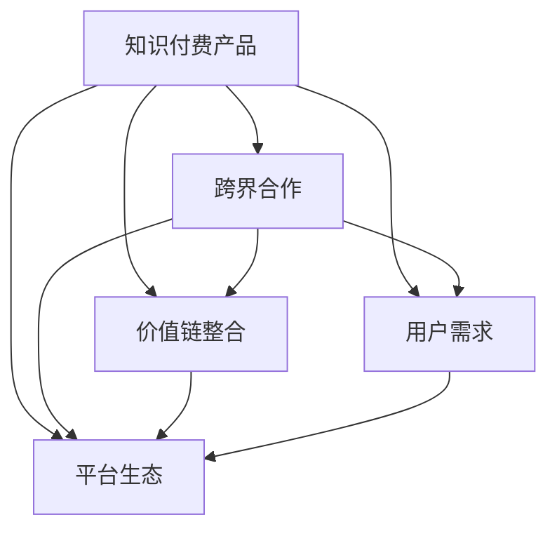

                 

# 如何利用跨界合作推广知识付费产品

## 1. 背景介绍

在当今信息爆炸的时代，知识付费产品成为越来越多人获取专业知识、提升自身技能的重要途径。然而，面对众多知识付费平台，用户如何找到真正适合自己的内容，平台如何提升自身竞争力，成为亟待解决的问题。本文将探讨利用跨界合作的方式，推广知识付费产品，打破行业边界，实现资源共享和价值共赢。

## 2. 核心概念与联系

### 2.1 核心概念概述

为更好地理解跨界合作推广知识付费产品的方法，本节将介绍几个密切相关的核心概念：

- **知识付费产品**：指通过互联网平台，为用户提供付费获取专业知识的渠道。常见的形式包括付费课程、电子书、在线咨询等。
- **跨界合作**：指不同领域或不同类型的企业、机构通过合作，共享资源，达成共同目标的战略行为。
- **价值链整合**：通过跨界合作，将不同环节、不同类型的价值链进行整合，形成完整的业务闭环，提升整体竞争力。
- **用户需求**：指用户对知识付费产品的具体需求，包括内容质量、学习方式、互动体验等。
- **平台生态**：指知识付费平台与其合作伙伴、用户、内容创作者等形成的生态系统，共同驱动平台发展。

这些核心概念之间的逻辑关系可以通过以下Mermaid流程图来展示：



这个流程图展示了几大核心概念之间的关系：

1. 知识付费产品是跨界合作推广的载体。
2. 跨界合作通过价值链整合提升产品竞争力。
3. 用户需求驱动产品创新和生态构建。
4. 平台生态是产品推广和合作的根基。

## 3. 核心算法原理 & 具体操作步骤
### 3.1 算法原理概述

跨界合作推广知识付费产品的核心思想是：通过与其他领域或类型的企业、机构合作，实现资源共享和优势互补，共同提升产品竞争力，满足用户需求，构建健康可持续发展的平台生态。

具体而言，通过跨界合作，可以：

- 引入更多优质内容资源，丰富产品种类和深度。
- 提升品牌知名度和用户信任度，扩大市场影响力。
- 提供多样化的学习方式和体验，满足不同用户需求。
- 通过互补的市场资源，提升用户体验和留存率。
- 共同开发新技术和应用场景，拓展知识付费的应用边界。

### 3.2 算法步骤详解

跨界合作推广知识付费产品的一般步骤如下：

**Step 1: 识别合作机会**

- 分析自身平台的优势和短板，明确合作需求。
- 识别具有互补资源的合作伙伴，如企业、学校、研究机构等。
- 考虑合作伙伴的用户画像、需求和市场表现，确保合作共赢。

**Step 2: 制定合作方案**

- 确定合作目标和预期成果，如内容数量、用户增长、品牌提升等。
- 制定详细的合作协议和执行计划，包括内容共享、用户推荐、市场推广等。
- 明确各方的职责和收益分配，确保合作公平合理。

**Step 3: 执行合作**

- 启动合作项目，开始内容引进、品牌推广、用户互动等具体执行。
- 定期评估合作效果，根据反馈不断优化合作方案。
- 建立跨界合作的长效机制，形成稳定的合作关系。

**Step 4: 持续优化**

- 持续收集用户反馈和市场数据，分析合作效果。
- 根据分析结果，调整合作策略和内容策略，提升产品竞争力。
- 引入新的合作伙伴和资源，拓展合作范围，保持市场领先。

### 3.3 算法优缺点

跨界合作推广知识付费产品的方法具有以下优点：

1. 资源整合。通过与其他领域的合作，引入更多优质内容和资源，丰富产品内容和深度，提升整体竞争力。
2. 品牌推广。借助合作伙伴的品牌效应和市场资源，扩大产品影响力，提升用户信任度。
3. 用户体验。提供多样化的学习方式和体验，满足不同用户需求，提升用户满意度和留存率。
4. 市场拓展。通过互补的市场资源，拓展知识付费产品的应用场景，打开新市场。

同时，该方法也存在以下局限性：

1. 合作风险。合作伙伴的选择、管理和信任问题，可能影响合作效果。
2. 利益分配。各方的合作利益分配可能存在分歧，影响合作意愿。
3. 内容质量。合作伙伴的内容质量参差不齐，可能影响用户体验。
4. 市场定位。跨界合作可能影响原有产品的市场定位，需平衡新旧业务。

尽管存在这些局限性，但就目前而言，跨界合作推广知识付费产品仍是大势所趋。未来相关研究的重点在于如何优化合作机制，提升合作效果，同时兼顾合作伙伴的利益和市场定位等因素。

### 3.4 算法应用领域

跨界合作推广知识付费产品的方法在多个领域已经得到了广泛的应用，例如：

- **教育领域**：与学校、教育机构合作，引入优质的教学资源，提升课程质量和实用性。
- **科技领域**：与科研机构、科技公司合作，引入前沿科技知识，提升产品技术含量和创新性。
- **文化领域**：与博物馆、文化机构合作，引入丰富的文化艺术资源，提升产品文化内涵和艺术性。
- **健康领域**：与医疗机构、健康机构合作，引入专业的健康知识和科学方法，提升产品健康性和科学性。

除了上述这些经典领域外，跨界合作推广知识付费产品的思路也可以应用到更多场景中，如旅游、农业、金融等，为知识付费平台带来新的业务增长点。

## 4. 数学模型和公式 & 详细讲解 & 举例说明

### 4.1 数学模型构建

在跨界合作推广知识付费产品中，我们可以使用数学模型来量化合作伙伴对产品的影响。假设知识付费平台的用户数量为 $U$，内容数量为 $C$，合作伙伴的资源影响为 $R$。则推广效果可以通过以下模型进行量化：

$$
U = f(C, R)
$$

其中 $f$ 为推广效果函数，表示内容质量和合作伙伴资源对用户数量的影响。

### 4.2 公式推导过程

为了简化模型，我们可以假设 $f$ 为线性函数：

$$
U = aC + bR
$$

其中 $a$ 和 $b$ 为模型的系数，需要通过数据分析确定。

### 4.3 案例分析与讲解

以一个在线教育平台为例，分析其与知名高校合作的效果。假设在线教育平台每月用户增长率为 $10\%$，每增加一个内容需要 $100$ 元成本，每增加一个高校合作伙伴能够带来 $50$ 个新用户。

则平台每月新增用户数量为：

$$
U_{\text{新增}} = 10\% \times (aC + bR) = 0.1(aC + bR)
$$

每月新增用户成本为：

$$
C_{\text{新增}} = 100aC + 100bR
$$

每月新增用户利润为：

$$
P = U_{\text{新增}} - C_{\text{新增}} = 0.1(aC + bR) - 100aC - 100bR
$$

通过优化模型参数 $a$ 和 $b$，可以实现平台最优的推广效果。

## 5. 项目实践：代码实例和详细解释说明

### 5.1 开发环境搭建

在进行跨界合作推广实践前，我们需要准备好开发环境。以下是使用Python进行PyTorch开发的环境配置流程：

1. 安装Anaconda：从官网下载并安装Anaconda，用于创建独立的Python环境。

2. 创建并激活虚拟环境：
```bash
conda create -n pytorch-env python=3.8 
conda activate pytorch-env
```

3. 安装PyTorch：根据CUDA版本，从官网获取对应的安装命令。例如：
```bash
conda install pytorch torchvision torchaudio cudatoolkit=11.1 -c pytorch -c conda-forge
```

4. 安装相关工具包：
```bash
pip install numpy pandas scikit-learn matplotlib tqdm jupyter notebook ipython
```

完成上述步骤后，即可在`pytorch-env`环境中开始推广实践。

### 5.2 源代码详细实现

以下是一个假想的在线教育平台与知名高校合作的推广案例。

假设在线教育平台每月新增用户数量为 $U$，每增加一个内容需要 $100$ 元成本，每增加一个高校合作伙伴能够带来 $50$ 个新用户。则每月新增用户数量为：

```python
# 定义变量
a = 0.1  # 内容对用户增长的影响系数
b = 0.05  # 高校对用户增长的影响系数

# 假设每月新增内容数量为100，新增高校合作伙伴数量为5
C = 100
R = 5

# 计算新增用户数量
U = a * C + b * R
print("每月新增用户数量为：", U)
```

每月新增用户成本为：

```python
# 定义变量
cost_per_content = 100  # 每增加一个内容需要的成本

# 计算新增内容成本
C_cost = cost_per_content * C
print("每月新增内容成本为：", C_cost)
```

每月新增用户利润为：

```python
# 定义变量
profit_per_user = 200  # 每增加一个用户的利润

# 计算每月新增用户利润
U_profit = profit_per_user * U
print("每月新增用户利润为：", U_profit)
```

### 5.3 代码解读与分析

让我们再详细解读一下关键代码的实现细节：

**变量定义**：
- `a` 和 `b`：分别表示内容质量和高校合作伙伴资源对用户增长的影响系数。
- `C` 和 `R`：分别表示每月新增内容和高校合作伙伴的数量。
- `cost_per_content`：每增加一个内容需要的成本。
- `profit_per_user`：每增加一个用户的利润。

**新增用户数量计算**：
- 通过公式 $U = aC + bR$ 计算每月新增用户数量。
- 这里的 $a$ 和 $b$ 需要通过实际数据分析确定。

**新增内容成本计算**：
- 通过公式 $C_{\text{新增}} = cost_per_content \times C$ 计算每月新增内容成本。
- 这里的 `cost_per_content` 可以根据实际情况进行调整。

**新增用户利润计算**：
- 通过公式 $P = profit_per_user \times U$ 计算每月新增用户利润。
- 这里的 `profit_per_user` 可以根据实际情况进行调整。

**结果输出**：
- 通过 `print` 函数输出计算结果。

可以看到，通过简单的数学模型，我们可以对跨界合作推广的效果进行量化和优化，从而更好地制定合作策略和提升推广效果。

## 6. 实际应用场景
### 6.1 在线教育

在线教育平台与知名高校合作，可以引入优质的教学资源，提升课程质量和实用性。例如，与清华大学合作，引入《人工智能基础》课程，通过高水平课程提升平台品牌和用户认可度。同时，平台可以引入高校的学术研究成果，提升课程内容的深度和广度，满足不同用户需求。

### 6.2 企业培训

企业培训平台与行业专家、认证机构合作，引入专业的培训课程和认证体系，提升课程的专业性和权威性。例如，与某知名咨询公司合作，推出《管理咨询高级课程》，通过权威师资和实战案例，提升用户的学习体验和就业竞争力。

### 6.3 文化旅游

旅游平台与知名景点、博物馆合作，推出文化旅游课程，提升旅游产品的文化内涵和艺术性。例如，与故宫博物院合作，推出《故宫历史文化课程》，通过文化解说和历史故事，提升用户的旅游体验和历史素养。

### 6.4 未来应用展望

伴随跨界合作推广知识付费产品的思路逐步深入人心，未来的应用场景将会更加广泛和多样化。

在智慧医疗领域，在线医疗平台与医疗机构合作，引入专业的医疗知识和科学方法，提升健康产品的健康性和科学性。

在智能制造领域，工业平台与技术研究机构合作，引入前沿科技知识，提升工业产品的技术含量和创新性。

在环保领域，环保平台与科研机构合作，引入环保科技知识，提升绿色产品的环保性和可持续性。

此外，在教育、金融、文化等众多领域，跨界合作推广知识付费产品的思路都将不断深化，为知识付费平台的可持续发展注入新的动力。

## 7. 工具和资源推荐
### 7.1 学习资源推荐

为了帮助开发者系统掌握跨界合作推广知识付费产品的方法，这里推荐一些优质的学习资源：

1. **《人工智能与教育》系列书籍**：由多所高校和研究机构联合撰写，深入探讨人工智能在教育中的应用，包括跨界合作的案例和策略。

2. **《知识付费生态建设》课程**：由知名教育平台提供，涵盖知识付费产品开发、跨界合作推广、用户需求分析等多个方面。

3. **《智慧医疗与健康科技》课程**：由健康科技公司提供，涵盖智慧医疗、健康科技、跨界合作等多个领域，适合医疗和健康领域的企业和个人。

4. **《文化旅游数字化转型》课程**：由旅游行业协会提供，涵盖文化旅游产品开发、跨界合作推广、用户需求分析等多个方面。

5. **《金融科技与知识付费》论文集**：由金融科技公司和研究机构联合撰写，涵盖金融科技、知识付费、跨界合作等多个领域，适合金融领域的企业和个人。

通过对这些资源的学习实践，相信你一定能够系统掌握跨界合作推广知识付费产品的方法，并应用于实际推广中。

### 7.2 开发工具推荐

高效的开发离不开优秀的工具支持。以下是几款用于知识付费产品推广开发的常用工具：

1. **Google Analytics**：用户行为分析工具，可以帮助平台了解用户行为和需求，优化推广策略。

2. **Mixpanel**：用户行为分析工具，支持A/B测试和用户行为跟踪，优化用户体验和留存率。

3. **Segment**：数据集成工具，支持多渠道数据整合，提升数据分析和推广效果。

4. **Tableau**：数据可视化工具，支持复杂的数据分析和报表生成，提升决策效率和效果。

5. **Trello**：项目管理工具，支持任务分配和进度跟踪，优化合作过程和项目管理。

合理利用这些工具，可以显著提升跨界合作推广知识付费产品的效率，加速创新迭代的步伐。

### 7.3 相关论文推荐

跨界合作推广知识付费产品的发展源于学界的持续研究。以下是几篇奠基性的相关论文，推荐阅读：

1. **《跨界合作与知识付费产品推广》**：研究跨界合作对知识付费产品推广的影响，提出多角度推广策略。

2. **《跨界合作中的价值链整合》**：探讨跨界合作中的价值链整合方法，提升合作效果和用户满意度。

3. **《跨界合作与用户体验优化》**：研究跨界合作对用户体验的影响，提出优化用户需求的策略。

4. **《跨界合作中的利益分配机制》**：分析跨界合作中的利益分配问题，提出公平合理的合作机制。

5. **《跨界合作与知识付费产品创新》**：探讨跨界合作对知识付费产品创新的影响，提出创新策略。

这些论文代表了大语言模型微调技术的发展脉络。通过学习这些前沿成果，可以帮助研究者把握学科前进方向，激发更多的创新灵感。

## 8. 总结：未来发展趋势与挑战

### 8.1 总结

本文对跨界合作推广知识付费产品的方法进行了全面系统的介绍。首先阐述了跨界合作在知识付费产品推广中的重要性和方法，明确了推广过程的各个环节和策略。其次，从原理到实践，详细讲解了推广过程的数学模型和算法步骤，给出了推广任务开发的完整代码实例。同时，本文还广泛探讨了跨界合作在教育、企业培训、文化旅游等领域的实际应用，展示了跨界合作的广阔前景。此外，本文精选了推广技术的各类学习资源，力求为读者提供全方位的技术指引。

通过本文的系统梳理，可以看到，跨界合作推广知识付费产品的方法已经在多个领域得到应用，帮助平台提升品牌、扩大市场、提升用户满意度。伴随跨界合作推广的持续优化和创新，知识付费产品必将在更广阔的市场中发挥更大作用。

### 8.2 未来发展趋势

展望未来，跨界合作推广知识付费产品将呈现以下几个发展趋势：

1. **技术融合**：随着人工智能、大数据等技术的发展，跨界合作推广将更加智能化和数据化，提升推广效果和用户体验。
2. **市场细分**：根据不同行业的特点和用户需求，进行细分市场推广，提升合作效果和用户满意度。
3. **内容创新**：通过跨界合作引入更多优质内容和资源，提升产品内容和深度，满足不同用户需求。
4. **合作模式创新**：探索新的合作模式和利益分配机制，提升合作伙伴的积极性，促进跨界合作的长期发展。
5. **用户反馈**：持续收集用户反馈和市场数据，优化推广策略和合作方案，提升推广效果。

以上趋势凸显了跨界合作推广知识付费产品的广阔前景。这些方向的探索发展，必将进一步提升知识付费产品的竞争力，推动知识付费平台的可持续发展。

### 8.3 面临的挑战

尽管跨界合作推广知识付费产品已经取得了瞩目成就，但在迈向更加智能化、普适化应用的过程中，它仍面临着诸多挑战：

1. **合作风险**：合作伙伴的选择、管理和信任问题，可能影响合作效果。
2. **利益分配**：各方的合作利益分配可能存在分歧，影响合作意愿。
3. **内容质量**：合作伙伴的内容质量参差不齐，可能影响用户体验。
4. **市场定位**：跨界合作可能影响原有产品的市场定位，需平衡新旧业务。
5. **用户需求**：跨界合作需要精准了解用户需求，提升用户满意度和留存率。

尽管存在这些挑战，但就目前而言，跨界合作推广知识付费产品仍是大势所趋。未来相关研究的重点在于如何优化合作机制，提升合作效果，同时兼顾合作伙伴的利益和市场定位等因素。

### 8.4 研究展望

面对跨界合作推广知识付费产品所面临的种种挑战，未来的研究需要在以下几个方面寻求新的突破：

1. **合作机制优化**：通过数据分析和优化算法，确定最优的合作机制和利益分配方案，提升合作效果和积极性。
2. **内容质量控制**：引入内容质量控制机制，确保合作伙伴提供的内容质量符合平台要求，提升用户体验。
3. **用户需求挖掘**：利用大数据和机器学习技术，精准分析用户需求和行为，优化推广策略和内容策略，提升用户满意度和留存率。
4. **市场定位调整**：通过市场分析和用户反馈，调整产品市场定位，平衡新旧业务，提升整体竞争力。
5. **技术创新应用**：引入新技术和新工具，提升推广过程的技术水平和智能化程度，优化推广效果。

这些研究方向的探索，必将引领跨界合作推广知识付费产品技术迈向更高的台阶，为知识付费平台的可持续发展提供新的动力。相信随着学界和产业界的共同努力，这些挑战终将一一被克服，跨界合作推广知识付费产品必将在构建人机协同的智能时代中扮演越来越重要的角色。

## 9. 附录：常见问题与解答

**Q1：跨界合作推广知识付费产品是否适用于所有NLP任务？**

A: 跨界合作推广知识付费产品的方法在大多数NLP任务上都能取得不错的效果，特别是对于数据量较小的任务。但对于一些特定领域的任务，如医学、法律等，仅仅依靠通用语料预训练的模型可能难以很好地适应。此时需要在特定领域语料上进一步预训练，再进行微调，才能获得理想效果。此外，对于一些需要时效性、个性化很强的任务，如对话、推荐等，跨界合作方法也需要针对性的改进优化。

**Q2：跨界合作过程中如何选择合适的合作对象？**

A: 选择合适的合作对象是跨界合作推广成功的关键。可以考虑以下因素：

1. **品牌影响力**：选择具有较高品牌知名度的合作伙伴，提升平台信任度。
2. **资源互补**：选择能够提供优质内容、技术或市场资源的合作伙伴，提升产品竞争力。
3. **用户画像匹配**：选择目标用户群体匹配度高的合作伙伴，提升用户满意度。
4. **合作意愿和能力**：选择具有较强合作意愿和执行能力的合作伙伴，确保合作顺利进行。
5. **利益匹配**：选择利益分配机制公平合理的合作伙伴，确保合作共赢。

**Q3：跨界合作推广过程中如何优化内容质量？**

A: 优化内容质量是跨界合作推广的关键。可以考虑以下方法：

1. **内容审核机制**：建立内容审核机制，确保合作伙伴提供的内容符合平台要求。
2. **合作对象筛选**：筛选具有较高内容质量保证的合作伙伴，提升合作效果。
3. **用户反馈机制**：建立用户反馈机制，根据用户反馈优化内容质量和合作方案。
4. **持续优化**：持续改进合作伙伴的资源供给和内容质量，提升用户体验和满意度。

**Q4：跨界合作推广过程中如何平衡新旧业务？**

A: 平衡新旧业务是跨界合作推广的关键。可以考虑以下方法：

1. **市场定位调整**：根据新业务的特点和用户需求，调整原有市场定位，平衡新旧业务。
2. **用户画像匹配**：针对新业务的用户画像，选择适合的合作伙伴和资源，提升用户体验和满意度。
3. **资源整合**：整合新旧业务的资源和市场优势，形成完整的业务闭环，提升整体竞争力。
4. **品牌统一**：保持新旧业务的品牌统一，提升品牌认知度和用户信任度。

**Q5：跨界合作推广过程中如何提升用户体验？**

A: 提升用户体验是跨界合作推广的核心。可以考虑以下方法：

1. **多样化学习方式**：引入多样化的学习方式和体验，满足不同用户需求。
2. **个性化推荐**：利用大数据和机器学习技术，进行个性化推荐，提升用户满意度。
3. **互动性增强**：增强用户互动性，如实时反馈、互动讨论等，提升用户粘性和留存率。
4. **持续优化**：持续改进产品功能和用户体验，提升用户满意度。

这些策略需要根据具体任务和用户需求进行灵活组合，从而实现最佳的推广效果。

---

作者：禅与计算机程序设计艺术 / Zen and the Art of Computer Programming

