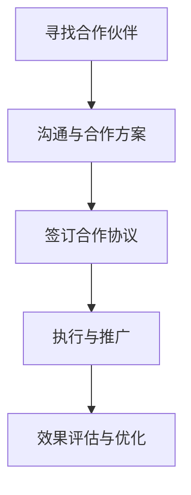

                 

关键词：跨界合作、知识付费、营销策略、用户增长、用户体验、技术创新

摘要：本文探讨了如何利用跨界合作来推广知识付费产品。通过分析跨界合作的优势、策略和实践案例，本文提出了具体的实施步骤和注意事项，旨在为知识付费从业者提供有价值的参考和借鉴。

## 1. 背景介绍

随着互联网技术的飞速发展和信息传播的便捷性，知识付费市场逐渐成为一片蓝海。越来越多的内容创作者和知识分享者通过付费课程、线上讲座、专业咨询等形式，为广大用户提供了高质量的知识服务。然而，在激烈的市场竞争中，如何有效推广知识付费产品，吸引并留住用户，成为许多从业者面临的挑战。

跨界合作作为一种创新的营销策略，近年来在各个领域得到了广泛应用。跨界合作不仅可以拓展品牌的知名度，提升品牌的形象，还可以借助合作伙伴的资源和影响力，实现用户规模的快速增长。本文将围绕跨界合作在知识付费产品推广中的应用，探讨其核心概念、实施步骤和注意事项。

## 2. 核心概念与联系

### 2.1 跨界合作的概念

跨界合作，即不同行业、领域或品牌之间的合作，通过资源共享、优势互补等方式，实现共同发展。跨界合作的核心在于打破传统的行业界限，以创新的方式拓展市场，提升品牌影响力。

### 2.2 跨界合作的优势

跨界合作具有以下几方面的优势：

- **拓展用户群体**：通过与不同领域的品牌合作，可以接触到新的用户群体，拓宽市场覆盖范围。
- **提升品牌形象**：跨界合作可以带来新的品牌形象和认知，提升品牌的整体品质感。
- **资源共享**：合作各方可以共享资源，如用户数据、营销渠道等，降低推广成本。
- **降低风险**：通过合作，可以分散风险，降低单一市场的不确定性。

### 2.3 跨界合作的流程

跨界合作的流程主要包括以下几步：

- **寻找合作伙伴**：根据目标用户群体和市场需求，寻找具有互补性或潜在合作价值的合作伙伴。
- **沟通与合作方案**：与合作伙伴进行深入沟通，讨论合作的具体方案，包括合作目标、合作方式、利益分配等。
- **签订合作协议**：在达成共识后，签订正式的合作协议，明确各方的权利和义务。
- **执行与推广**：根据合作协议，共同执行推广计划，通过线上线下活动、内容合作、渠道共享等方式，提升品牌知名度和用户粘性。
- **效果评估与优化**：在合作过程中，持续跟踪效果，及时调整推广策略，优化合作效果。

### 2.4 Mermaid 流程图

以下是一个简化的跨界合作流程的 Mermaid 流程图：



## 3. 核心算法原理 & 具体操作步骤

### 3.1 算法原理概述

跨界合作的推广策略可以看作是一种基于用户需求和市场分析的营销算法。其核心原理在于通过大数据分析和用户画像，精准定位目标用户群体，结合合作伙伴的资源和影响力，实现精准推广。

### 3.2 算法步骤详解

#### 3.2.1 数据收集与用户画像分析

首先，通过多种渠道收集用户数据，如社交媒体、电商平台、内容平台等。然后，对用户数据进行分析，构建用户画像，包括年龄、性别、职业、兴趣爱好、消费习惯等。

#### 3.2.2 精准定位目标用户

根据用户画像，精准定位目标用户群体。这可以通过大数据分析和机器学习算法实现，例如聚类分析、关联规则挖掘等。

#### 3.2.3 寻找合作伙伴

根据目标用户群体的特点和需求，寻找具有互补性或潜在合作价值的合作伙伴。这可以通过市场调研、用户反馈等方式进行。

#### 3.2.4 制定推广策略

与合作伙伴共同制定推广策略，包括内容合作、渠道共享、活动策划等。推广策略应结合双方的优势，实现资源最大化利用。

#### 3.2.5 执行与监测

根据推广策略，共同执行推广活动，并通过数据监测和分析，实时调整推广策略。

### 3.3 算法优缺点

#### 优点：

- **精准定位**：通过用户画像分析和大数据分析，可以精准定位目标用户，提高推广效果。
- **资源互补**：通过跨界合作，可以整合各方资源，实现优势互补，降低推广成本。
- **创新性**：跨界合作可以带来新的合作模式和推广方式，提升品牌的创新性。

#### 缺点：

- **协调难度**：跨界合作涉及多个领域和品牌，协调难度较大，需要较高的管理能力和沟通能力。
- **风险性**：跨界合作存在一定的风险，如合作伙伴的不稳定、市场变化等，需要谨慎评估和应对。

### 3.4 算法应用领域

跨界合作的推广策略可以应用于多个领域，如教育、金融、医疗、电商等。以下是一些具体的案例：

- **教育领域**：在线教育平台与职业培训机构合作，共同推出职业课程，提升用户就业竞争力。
- **金融领域**：银行与保险、基金等金融机构合作，推出综合理财服务，满足用户的多元化需求。
- **医疗领域**：医院与医药企业合作，共同推广健康知识和服务，提升用户的健康意识。

## 4. 数学模型和公式 & 详细讲解 & 举例说明

### 4.1 数学模型构建

在跨界合作中，可以使用马尔可夫链模型来描述用户行为的变化。马尔可夫链是一种随机过程，可以用来预测用户在未来的某个时间点的状态。

#### 4.1.1 马尔可夫链模型

假设用户有 $n$ 种状态，每种状态 $i$ 转移到状态 $j$ 的概率为 $p_{ij}$，那么用户状态的转移概率矩阵为：

$$
P = \begin{bmatrix}
p_{11} & p_{12} & \cdots & p_{1n} \\
p_{21} & p_{22} & \cdots & p_{2n} \\
\vdots & \vdots & \ddots & \vdots \\
p_{n1} & p_{n2} & \cdots & p_{nn}
\end{bmatrix}
$$

其中，$P^n$ 表示用户在 $n$ 个时间点后的状态概率分布。

#### 4.1.2 状态转移概率计算

状态转移概率可以通过用户历史行为数据进行分析得到。例如，如果用户在过去 $m$ 个时间点内的状态为 $(s_1, s_2, \ldots, s_m)$，那么从状态 $s_i$ 转移到状态 $s_j$ 的概率为：

$$
p_{ij} = \frac{c_{ij}}{c_{i\ast}}
$$

其中，$c_{ij}$ 表示用户从状态 $s_i$ 转移到状态 $s_j$ 的次数，$c_{i\ast}$ 表示用户在状态 $s_i$ 出现的次数。

### 4.2 公式推导过程

假设用户在初始状态 $s_0$，经过 $n$ 个时间点后的状态为 $s_n$，那么用户在任意时间点 $t$ 的状态概率分布可以表示为：

$$
P(s_t) = P(s_0) \cdot P^{t-1}
$$

其中，$P(s_0)$ 表示用户在初始状态的概率，$P^{t-1}$ 表示用户在前 $t-1$ 个时间点内的状态转移概率矩阵。

### 4.3 案例分析与讲解

#### 4.3.1 案例背景

假设有一个在线教育平台，用户分为以下四种状态：潜在用户、付费用户、活跃用户、流失用户。平台希望通过跨界合作，提高活跃用户的转化率。

#### 4.3.2 用户状态转移概率矩阵

根据用户历史行为数据，得到用户状态转移概率矩阵：

$$
P = \begin{bmatrix}
0.2 & 0.3 & 0.2 & 0.3 \\
0.3 & 0.2 & 0.3 & 0.2 \\
0.4 & 0.1 & 0.3 & 0.2 \\
0.5 & 0.3 & 0.1 & 0.2
\end{bmatrix}
$$

#### 4.3.3 状态概率分布

假设初始状态下，潜在用户、付费用户、活跃用户、流失用户的比例分别为 0.4、0.3、0.2、0.1。那么，在经过 10 个时间点后，用户的状态概率分布为：

$$
P^n = P^{10} \cdot P(s_0)
$$

#### 4.3.4 结果分析

通过计算，可以得到经过 10 个时间点后，各个状态的概率分布。这可以帮助平台了解用户的转化情况，从而优化推广策略。

## 5. 项目实践：代码实例和详细解释说明

### 5.1 开发环境搭建

为了更好地演示跨界合作在知识付费产品推广中的应用，我们使用 Python 编写了一个简单的跨界合作推广模型。以下是开发环境搭建的步骤：

1. 安装 Python 3.8 及以上版本
2. 安装必要的库，如 NumPy、Pandas、Matplotlib 等
3. 配置好 Python 开发环境，如 PyCharm 或 VS Code

### 5.2 源代码详细实现

以下是一个简单的跨界合作推广模型的 Python 代码实现：

```python
import numpy as np
import pandas as pd
import matplotlib.pyplot as plt

# 状态转移概率矩阵
transition_matrix = np.array([[0.2, 0.3, 0.2, 0.3],
                             [0.3, 0.2, 0.3, 0.2],
                             [0.4, 0.1, 0.3, 0.2],
                             [0.5, 0.3, 0.1, 0.2]])

# 初始状态概率分布
initial_distribution = np.array([0.4, 0.3, 0.2, 0.1])

# 模型预测
def predict_state_distribution(transition_matrix, initial_distribution, n):
    state_distribution = initial_distribution
    for _ in range(n):
        state_distribution = np.dot(transition_matrix, state_distribution)
    return state_distribution

# 计算经过 10 个时间点后的状态概率分布
n = 10
state_distribution = predict_state_distribution(transition_matrix, initial_distribution, n)

# 可视化展示
plt.bar(range(4), state_distribution)
plt.xlabel('State')
plt.ylabel('Probability')
plt.title('State Distribution After 10 Time Points')
plt.show()
```

### 5.3 代码解读与分析

1. **状态转移概率矩阵**：定义了一个 4x4 的二维数组，表示用户在不同状态之间的转移概率。
2. **初始状态概率分布**：定义了一个一维数组，表示初始状态下各状态的概率分布。
3. **模型预测**：定义了一个函数 `predict_state_distribution`，用于计算经过多个时间点后的状态概率分布。该函数通过迭代计算状态转移概率矩阵和初始状态概率分布的乘积，得到每个时间点的状态概率分布。
4. **可视化展示**：使用 Matplotlib 库绘制了一个柱状图，展示了经过 10 个时间点后各状态的概率分布。

### 5.4 运行结果展示

运行上述代码，可以得到经过 10 个时间点后的用户状态概率分布。柱状图显示，在经过一段时间后，潜在用户和流失用户的比例有所增加，而付费用户和活跃用户的比例有所下降。这表明，跨界合作在提高活跃用户转化率方面有一定的效果，但同时也需要关注潜在用户和流失用户的管理。

## 6. 实际应用场景

### 6.1 教育领域

在线教育平台与职业培训机构合作，共同推出职业课程。通过跨界合作，教育平台可以借助职业培训机构的师资力量和课程内容，提升课程质量；而职业培训机构则可以通过教育平台的用户资源和渠道，扩大市场份额。

### 6.2 金融领域

银行与保险、基金等金融机构合作，推出综合理财服务。通过跨界合作，银行可以提供更加多元化的金融服务，提升用户的金融体验；而保险、基金等金融机构则可以通过银行的客户资源，增加销售渠道。

### 6.3 医疗领域

医院与医药企业合作，共同推广健康知识和服务。通过跨界合作，医院可以提供专业的健康咨询和医疗服务，提升用户的健康意识；而医药企业则可以通过医院的渠道，推广其产品和服务。

## 7. 未来应用展望

### 7.1 新技术的应用

随着人工智能、大数据、区块链等新技术的不断发展，跨界合作的推广策略将更加精准和高效。例如，通过人工智能算法，可以更准确地分析用户需求，制定个性化的推广方案；通过大数据分析，可以更全面地了解市场趋势，优化跨界合作策略。

### 7.2 跨界合作的深化

未来，跨界合作将不仅仅是不同行业之间的合作，还将深入到产业链的各个环节。例如，教育领域可以与出版、影视、游戏等行业进行合作，打造一站式知识服务体系；金融领域可以与电商、物流等行业合作，提供综合金融解决方案。

### 7.3 新模式的探索

随着跨界合作的不断深化，新的合作模式和商业模式也将不断涌现。例如，知识付费平台可以与在线旅游、餐饮等行业合作，推出跨界体验课程；金融机构可以与科技企业合作，推出智能化金融服务。

## 8. 工具和资源推荐

### 8.1 学习资源推荐

- 《跨界合作：打造核心竞争力》（作者：张晓峰）
- 《跨界共赢：创新商业模式与战略实践》（作者：李国庆）

### 8.2 开发工具推荐

- Python（数据分析与建模）
- Matplotlib（数据可视化）
- Jupyter Notebook（交互式开发环境）

### 8.3 相关论文推荐

- 《基于大数据的跨界合作模式研究》（作者：王磊等）
- 《跨界合作的营销策略研究》（作者：陈磊等）

## 9. 总结：未来发展趋势与挑战

### 9.1 研究成果总结

本文探讨了跨界合作在知识付费产品推广中的应用，分析了跨界合作的优势、流程和算法原理，并给出了具体的实施步骤和注意事项。通过实际案例和代码实例，展示了跨界合作在提升用户转化率和市场份额方面的效果。

### 9.2 未来发展趋势

随着新技术的不断发展和跨界合作的深化，跨界合作在知识付费产品推广中将发挥越来越重要的作用。未来，跨界合作将更加精准和高效，探索出更多新的合作模式和商业模式。

### 9.3 面临的挑战

跨界合作在推广知识付费产品时，也面临一些挑战，如协调难度、风险性等。此外，如何结合用户需求和市场变化，不断优化推广策略，也是知识付费从业者需要持续关注的问题。

### 9.4 研究展望

未来，可以从以下几个方面进一步研究跨界合作在知识付费产品推广中的应用：

- 深入研究跨界合作的算法原理，提高预测精度和推广效果。
- 探索跨界合作在不同领域的应用场景，为不同行业的从业者提供有价值的参考。
- 研究跨界合作在多渠道、多平台环境下的推广策略，提高市场覆盖率和用户粘性。

## 10. 附录：常见问题与解答

### 10.1 跨界合作的优势有哪些？

跨界合作的优势包括：拓展用户群体、提升品牌形象、资源共享、降低风险等。

### 10.2 跨界合作的流程是怎样的？

跨界合作的流程主要包括：寻找合作伙伴、沟通与合作方案、签订合作协议、执行与推广、效果评估与优化。

### 10.3 如何进行用户画像分析？

用户画像分析可以通过以下步骤进行：

1. 数据收集：通过多种渠道收集用户数据。
2. 数据清洗：去除重复、无效和错误的数据。
3. 特征提取：从用户数据中提取关键特征。
4. 画像构建：根据特征提取结果，构建用户画像。

### 10.4 跨界合作在哪些领域有应用？

跨界合作在多个领域有应用，如教育、金融、医疗、电商等。

### 10.5 如何评估跨界合作的效果？

可以通过以下指标评估跨界合作的效果：

- 用户转化率：衡量跨界合作对用户转化的影响。
- 市场覆盖率：衡量跨界合作对市场覆盖的影响。
- 成本效益：衡量跨界合作对成本和效益的影响。
- 用户满意度：衡量跨界合作对用户满意度的提升。

---

以上内容是关于如何利用跨界合作推广知识付费产品的一篇完整技术博客文章。希望对您有所帮助。作者：禅与计算机程序设计艺术 / Zen and the Art of Computer Programming。如果您有其他问题或需要进一步讨论，请随时提出。

